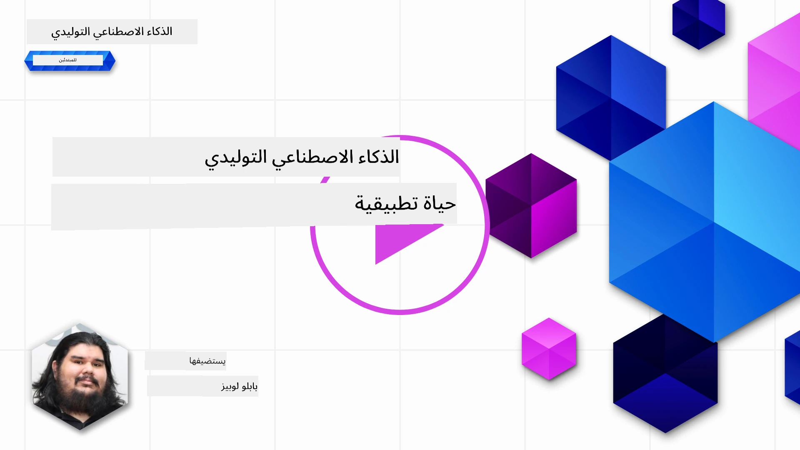
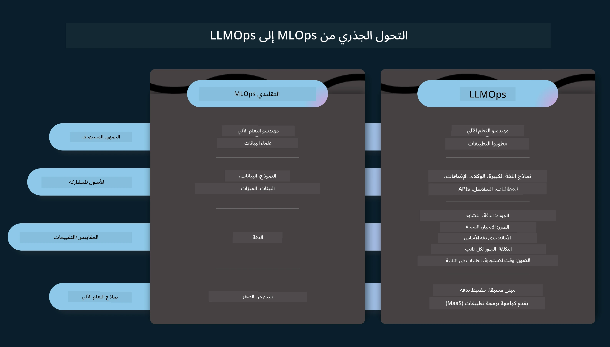
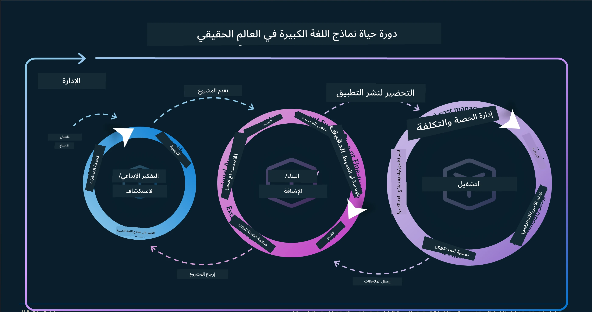
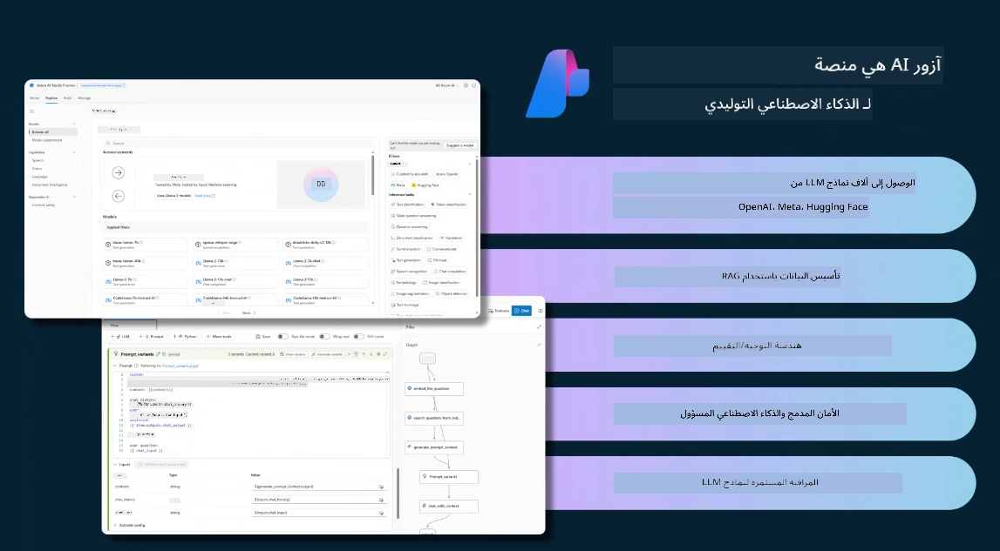
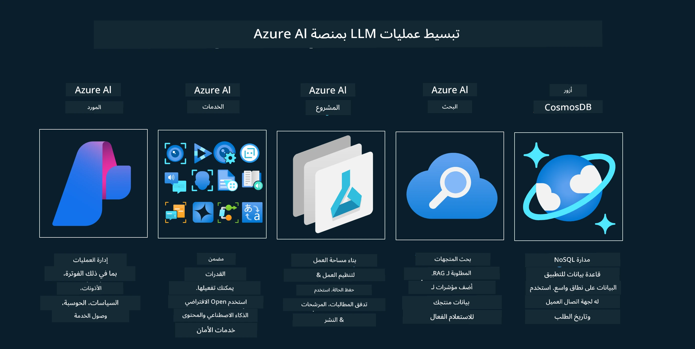
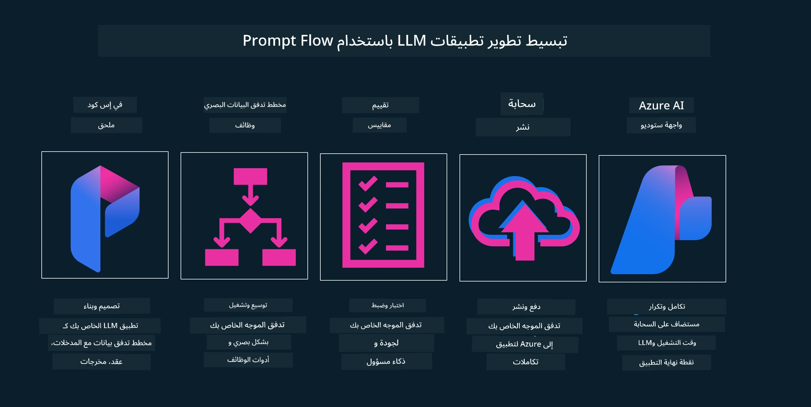

# دورة حياة تطبيقات الذكاء الاصطناعي التوليدي

سؤال مهم لجميع تطبيقات الذكاء الاصطناعي هو مدى ملاءمة ميزات الذكاء الاصطناعي، حيث إن الذكاء الاصطناعي مجال يتطور بسرعة، ولضمان بقاء تطبيقك ملائمًا وموثوقًا وقويًا، تحتاج إلى مراقبته وتقييمه وتحسينه باستمرار. وهنا تأتي دورة حياة الذكاء الاصطناعي التوليدي.

دورة حياة الذكاء الاصطناعي التوليدي هي إطار يرشدك عبر مراحل تطوير ونشر وصيانة تطبيق ذكاء اصطناعي توليدي. تساعدك على تحديد أهدافك، وقياس أدائك، وتحديد تحدياتك، وتنفيذ حلولك. كما تساعدك على مواءمة تطبيقك مع المعايير الأخلاقية والقانونية لمجالك وأصحاب المصلحة لديك. باتباع دورة حياة الذكاء الاصطناعي التوليدي، يمكنك ضمان أن تطبيقك يقدم قيمة دائماً ويرضي مستخدميك.

## مقدمة

في هذا الفصل، سوف:

- فهم التحول النموذجي من MLOps إلى LLMOps
- دورة حياة LLM
- أدوات دورة الحياة
- قياس وتقييم دورة الحياة

## فهم التحول النموذجي من MLOps إلى LLMOps

نماذج اللغة الكبيرة (LLMs) هي أداة جديدة في ترسانة الذكاء الاصطناعي، فهي قوية للغاية في مهام التحليل والتوليد للتطبيقات، لكن هذه القوة لها بعض العواقب على كيفية تنظيم مهام الذكاء الاصطناعي والتعلم الآلي التقليدي.

مع هذا، نحتاج إلى نموذج جديد لتكييف هذه الأداة بشكل ديناميكي مع الحوافز الصحيحة. يمكننا تصنيف التطبيقات القديمة للذكاء الاصطناعي كـ "تطبيقات التعلم الآلي" و التطبيقات الحديثة كـ "تطبيقات الذكاء الاصطناعي التوليدي" أو ببساطة "تطبيقات الذكاء الاصطناعي"، مما يعكس التكنولوجيا والتقنيات السائدة في ذلك الوقت. هذا يحوّل سردنا بعدة طرق، انظر إلى المقارنة التالية.

لاحظ أنه في LLMOps، نركز أكثر على مطوري التطبيقات، باستخدام التكامل كنقطة رئيسية، ونستخدم "النماذج كخدمة" ونفكر في النقاط التالية للقياس.

- الجودة: جودة الاستجابة
- الضرر: الذكاء الاصطناعي المسؤول
- الصدق: استنادية الاستجابة (هل منطقية؟ هل هي صحيحة؟)
- التكلفة: ميزانية الحل
- التأخير: متوسط الوقت للاستجابة بالرموز

## دورة حياة LLM

أولًا، لفهم دورة الحياة والتعديلات، دعونا نلاحظ الإنفوجرافيك التالي.

كما قد تلاحظ، هذا يختلف عن دورات الحياة المعتادة من MLOps. لدى نماذج اللغة الكبيرة العديد من المتطلبات الجديدة، مثل التوجيه، وتقنيات مختلفة لتحسين الجودة (الضبط الدقيق، RAG، الموجهات الفوقية)، والتقييم والمسؤولية مع الذكاء الاصطناعي المسؤول، وأخيرًا مقاييس تقييم جديدة (الجودة، الضرر، الصدق، التكلفة والتأخير).

على سبيل المثال، انظر كيف نتصور الأفكار. نستخدم هندسة التوجيه لتجربة نماذج مختلفة لاستكشاف الإمكانيات لاختبار ما إذا كان فرضيتهم قد تكون صحيحة.

لاحظ أن هذه ليست عملية خطية، بل حلقات متكاملة، متكررة وبها دورة شاملة.

كيف يمكننا استكشاف هذه الخطوات؟ دعنا نغوص في التفاصيل حول كيفية بناء دورة حياة.

قد يبدو هذا معقدًا بعض الشيء، دعونا نركز أولاً على الخطوات الكبرى الثلاث.

1. التفكير/الاستكشاف: استكشاف، هنا يمكننا الاستكشاف وفقًا لاحتياجات أعمالنا. إنشاء نموذج أولي، وإنشاء [PromptFlow](https://microsoft.github.io/promptflow/index.html?WT.mc_id=academic-105485-koreyst) واختبار ما إذا كان فعالًا كفاية لفرضيتنا.
1. البناء/التعزيز: التنفيذ، الآن، نبدأ بتقييم مجموعات بيانات أكبر وتطبيق تقنيات مثل الضبط الدقيق وRAG لفحص متانة حلنا. إذا لم ينجح، قد يساعد إعادة تنفيذه، إضافة خطوات جديدة في تدفقنا أو إعادة هيكلة البيانات. بعد اختبار تدفقنا ومقياسنا، إذا نجح وتحقق من مقاييسنا، يكون جاهزًا للخطوة التالية.
1. التشغيل: التكامل، الآن إضافة أنظمة المراقبة والتنبيهات إلى نظامنا، والنشر والتكامل مع التطبيق.

ثم، لدينا دورة شاملة للإدارة، تركز على الأمان والامتثال والحكومة.

تهانينا، أصبح لديك الآن تطبيق الذكاء الاصطناعي جاهز للعمل والتشغيل. لتجربة عملية، ألق نظرة على [عرض دردشة Contoso.](https://nitya.github.io/contoso-chat/?WT.mc_id=academic-105485-koreyst)

الآن، ما الأدوات التي يمكننا استخدامها؟

## أدوات دورة الحياة

لأدوات دورة الحياة، توفر Microsoft [منصة Azure AI](https://azure.microsoft.com/solutions/ai/?WT.mc_id=academic-105485-koreyst) و[PromptFlow](https://microsoft.github.io/promptflow/index.html?WT.mc_id=academic-105485-koreyst) لتسهيل وجعل دورة حياتك سهلة التنفيذ وجاهزة للاستخدام.

تتيح لك [منصة Azure AI](https://azure.microsoft.com/solutions/ai/?WT.mc_id=academic-105485-koreyst) استخدام [AI Studio](https://ai.azure.com/?WT.mc_id=academic-105485-koreyst). AI Studio هو بوابة ويب تتيح لك استكشاف النماذج والعينات والأدوات. إدارة مواردك، تطوير واجهات المستخدم وخيارات SDK/CLI لتطوير الكود أولًا.

يتيح لك Azure AI استخدام موارد متعددة، لإدارة عملياتك وخدماتك ومشاريعك واحتياجات البحث الاتجاهي وقواعد البيانات.

ابنِ، من إثبات المفهوم (POC) إلى التطبيقات ذات النطاق الكبير باستخدام PromptFlow:

- تصميم وبناء التطبيقات من VS Code، بأدوات بصرية ووظيفية
- اختبار وضبط تطبيقاتك لجودة الذكاء الاصطناعي، ببساطة.
- استخدم Azure AI Studio للتكامل والتكرار مع السحابة، والضغط والنشر للتكامل السريع.

## رائع! واصل تعلمك!

مذهل، الآن تعلّم المزيد عن كيفية هيكلة تطبيق لاستخدام المفاهيم مع [تطبيق دردشة Contoso](https://nitya.github.io/contoso-chat/?WT.mc_id=academic-105485-koreyst)، للاطلاع على كيفية إضافة Cloud Advocacy لتلك المفاهيم في العروض التوضيحية. لمزيد من المحتوى، تحقق من [جلسة الانعطاف الخاصة ب Ignite!
](https://www.youtube.com/watch?v=DdOylyrTOWg)

الآن، اطلع على الدرس 15، لفهم كيف تؤثر [التوليد المعزز بالاسترجاع وقواعد بيانات المتجهات](../15-rag-and-vector-databases/README.md?WT.mc_id=academic-105485-koreyst) على الذكاء الاصطناعي التوليدي ولإنشاء تطبيقات أكثر جاذبية!

---

<!-- CO-OP TRANSLATOR DISCLAIMER START -->
**إخلاء المسؤولية**:
تمت ترجمة هذا المستند باستخدام خدمة الترجمة الآلية [Co-op Translator](https://github.com/Azure/co-op-translator). على الرغم من أننا نسعى للدقة، يرجى العلم أن الترجمات الآلية قد تحتوي على أخطاء أو عدم دقة. يجب اعتبار المستند الأصلي بلغته الأصلية المصدر الموثوق به. للمعلومات الحساسة، يُنصح بالترجمة الاحترافية بواسطة البشر. نحن غير مسؤولين عن أي سوء فهم أو تفسير ناتج عن استخدام هذه الترجمة.
<!-- CO-OP TRANSLATOR DISCLAIMER END -->