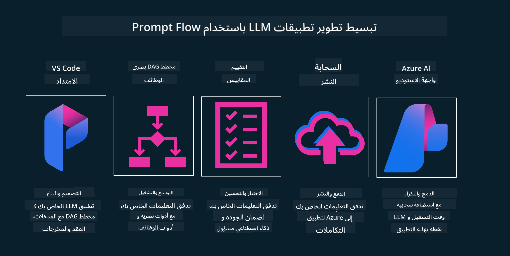

<!--
CO_OP_TRANSLATOR_METADATA:
{
  "original_hash": "27a5347a5022d5ef0a72ab029b03526a",
  "translation_date": "2025-07-09T15:47:31+00:00",
  "source_file": "14-the-generative-ai-application-lifecycle/README.md",
  "language_code": "ar"
}
-->

# دورة حياة تطبيقات الذكاء الاصطناعي التوليدي

سؤال مهم لجميع تطبيقات الذكاء الاصطناعي هو مدى ملاءمة ميزات الذكاء الاصطناعي، حيث أن هذا المجال يتطور بسرعة، ولضمان بقاء تطبيقك ملائمًا وموثوقًا وقويًا، تحتاج إلى مراقبته وتقييمه وتحسينه باستمرار. وهنا يأتي دور دورة حياة الذكاء الاصطناعي التوليدي.

دورة حياة الذكاء الاصطناعي التوليدي هي إطار عمل يرشدك خلال مراحل تطوير ونشر وصيانة تطبيق ذكاء اصطناعي توليدي. يساعدك على تحديد أهدافك، وقياس أدائك، وتحديد التحديات التي تواجهها، وتنفيذ الحلول المناسبة. كما يساعدك على مواءمة تطبيقك مع المعايير الأخلاقية والقانونية في مجالك ومع أصحاب المصلحة. باتباع دورة حياة الذكاء الاصطناعي التوليدي، يمكنك التأكد من أن تطبيقك يقدم قيمة مستمرة ويرضي المستخدمين.

## مقدمة

في هذا الفصل، ستتعلم:

- فهم التحول في النموذج من MLOps إلى LLMOps  
- دورة حياة LLM  
- أدوات دورة الحياة  
- قياس وتقييم دورة الحياة  

## فهم التحول في النموذج من MLOps إلى LLMOps

نماذج اللغة الكبيرة (LLMs) هي أداة جديدة في ترسانة الذكاء الاصطناعي، وهي قوية جدًا في مهام التحليل والتوليد للتطبيقات، لكن هذه القوة لها تأثيرات على كيفية تبسيط مهام الذكاء الاصطناعي والتعلم الآلي الكلاسيكي.

لذلك، نحتاج إلى نموذج جديد لتكييف هذه الأداة بطريقة ديناميكية وبالحوافز الصحيحة. يمكننا تصنيف تطبيقات الذكاء الاصطناعي القديمة كـ "تطبيقات تعلم آلي" و التطبيقات الحديثة كـ "تطبيقات الذكاء الاصطناعي التوليدي" أو ببساطة "تطبيقات الذكاء الاصطناعي"، مما يعكس التكنولوجيا والتقنيات السائدة في ذلك الوقت. هذا يغير سردنا بعدة طرق، انظر إلى المقارنة التالية.

لاحظ أنه في LLMOps، نركز أكثر على مطوري التطبيقات، باستخدام التكامل كنقطة رئيسية، مع الاعتماد على "النماذج كخدمة" والتفكير في النقاط التالية للقياس.

- الجودة: جودة الاستجابة  
- الضرر: الذكاء الاصطناعي المسؤول  
- الصدق: مدى استناد الاستجابة (هل منطقية؟ هل صحيحة؟)  
- التكلفة: ميزانية الحل  
- الكمون: متوسط الوقت للاستجابة لكل رمز  

## دورة حياة LLM

أولًا، لفهم دورة الحياة والتعديلات، دعنا نلاحظ الرسم البياني التالي.

كما تلاحظ، هذا يختلف عن دورات الحياة المعتادة في MLOps. نماذج اللغة الكبيرة لها متطلبات جديدة كثيرة، مثل التوجيه (Prompting)، وتقنيات مختلفة لتحسين الجودة (التعديل الدقيق Fine-Tuning، RAG، التوجيهات الميتا Meta-Prompts)، تقييم مختلف ومسؤولية مع الذكاء الاصطناعي المسؤول، وأخيرًا مقاييس تقييم جديدة (الجودة، الضرر، الصدق، التكلفة والكمون).

على سبيل المثال، انظر كيف نفكر في الأفكار. نستخدم هندسة التوجيه لتجربة نماذج LLM مختلفة لاستكشاف الإمكانيات واختبار صحة الفرضيات.

لاحظ أن هذا ليس خطيًا، بل حلقات متكاملة، تكرارية ومع دورة شاملة.

كيف يمكننا استكشاف هذه الخطوات؟ دعنا ندخل في التفاصيل حول كيفية بناء دورة حياة.

قد يبدو هذا معقدًا بعض الشيء، دعنا نركز أولًا على الخطوات الثلاث الكبرى.

1. التفكير/الاستكشاف: الاستكشاف، هنا يمكننا الاستكشاف وفقًا لاحتياجات أعمالنا. بناء النماذج الأولية، وإنشاء [PromptFlow](https://microsoft.github.io/promptflow/index.html?WT.mc_id=academic-105485-koreyst) واختبار ما إذا كان فعالًا بما يكفي لفرضيتنا.  
1. البناء/التعزيز: التنفيذ، الآن نبدأ في التقييم لمجموعات بيانات أكبر، وتطبيق تقنيات مثل التعديل الدقيق Fine-tuning وRAG، للتحقق من متانة الحل. إذا لم يكن كذلك، قد يساعد إعادة التنفيذ، إضافة خطوات جديدة في سير العمل أو إعادة هيكلة البيانات. بعد اختبار سير العمل والحجم، إذا نجح وتحقق من مقاييسنا، يكون جاهزًا للخطوة التالية.  
1. التشغيل: التكامل، الآن نضيف أنظمة المراقبة والتنبيهات إلى نظامنا، ونشر التطبيق ودمجه مع تطبيقنا.  

ثم لدينا الدورة الشاملة للإدارة، التي تركز على الأمان، والامتثال، والحوكمة.

تهانينا، الآن أصبح تطبيق الذكاء الاصطناعي الخاص بك جاهزًا للعمل والتشغيل. لتجربة عملية، ألق نظرة على [عرض دردشة Contoso.](https://nitya.github.io/contoso-chat/?WT.mc_id=academic-105485-koreys)

الآن، ما هي الأدوات التي يمكننا استخدامها؟

## أدوات دورة الحياة

بالنسبة للأدوات، توفر مايكروسوفت [منصة Azure AI](https://azure.microsoft.com/solutions/ai/?WT.mc_id=academic-105485-koreys) و[PromptFlow](https://microsoft.github.io/promptflow/index.html?WT.mc_id=academic-105485-koreyst) لتسهيل وتنفيذ دورة حياتك بسهولة وجاهزة للاستخدام.

تتيح لك [منصة Azure AI](https://azure.microsoft.com/solutions/ai/?WT.mc_id=academic-105485-koreys) استخدام [AI Studio](https://ai.azure.com/?WT.mc_id=academic-105485-koreys). AI Studio هو بوابة ويب تتيح لك استكشاف النماذج، والعينات، والأدوات. إدارة الموارد الخاصة بك، وتطوير واجهات المستخدم، وخيارات SDK/CLI لتطوير يعتمد على الكود أولًا.

تسمح لك Azure AI باستخدام موارد متعددة لإدارة عملياتك، وخدماتك، ومشاريعك، واحتياجات البحث المتجه وقواعد البيانات.

ابنِ من إثبات المفهوم (POC) حتى التطبيقات واسعة النطاق باستخدام PromptFlow:

- تصميم وبناء التطبيقات من VS Code، باستخدام أدوات بصرية ووظيفية  
- اختبار وتعديل تطبيقاتك لتحصل على ذكاء اصطناعي عالي الجودة بسهولة  
- استخدام Azure AI Studio للتكامل والتكرار مع السحابة، والدفع والنشر للتكامل السريع  

## رائع! واصل تعلمك!

مذهل، الآن تعلّم المزيد عن كيفية هيكلة التطبيق لاستخدام هذه المفاهيم مع [تطبيق دردشة Contoso](https://nitya.github.io/contoso-chat/?WT.mc_id=academic-105485-koreyst)، لتتعرف كيف تضيف فرق دعم السحابة هذه المفاهيم في العروض التوضيحية. للمزيد من المحتوى، اطلع على [جلسة Ignite المنفصلة!](https://www.youtube.com/watch?v=DdOylyrTOWg)

الآن، اطلع على الدرس 15، لفهم كيف تؤثر [التوليد المعزز بالاسترجاع وقواعد البيانات المتجهة](../15-rag-and-vector-databases/README.md?WT.mc_id=academic-105485-koreyst) على الذكاء الاصطناعي التوليدي ولإنشاء تطبيقات أكثر تفاعلية!

**إخلاء المسؤولية**:  
تمت ترجمة هذا المستند باستخدام خدمة الترجمة الآلية [Co-op Translator](https://github.com/Azure/co-op-translator). بينما نسعى لتحقيق الدقة، يرجى العلم أن الترجمات الآلية قد تحتوي على أخطاء أو عدم دقة. يجب اعتبار المستند الأصلي بلغته الأصلية المصدر الموثوق به. للمعلومات الهامة، يُنصح بالاعتماد على الترجمة البشرية المهنية. نحن غير مسؤولين عن أي سوء فهم أو تفسير ناتج عن استخدام هذه الترجمة.