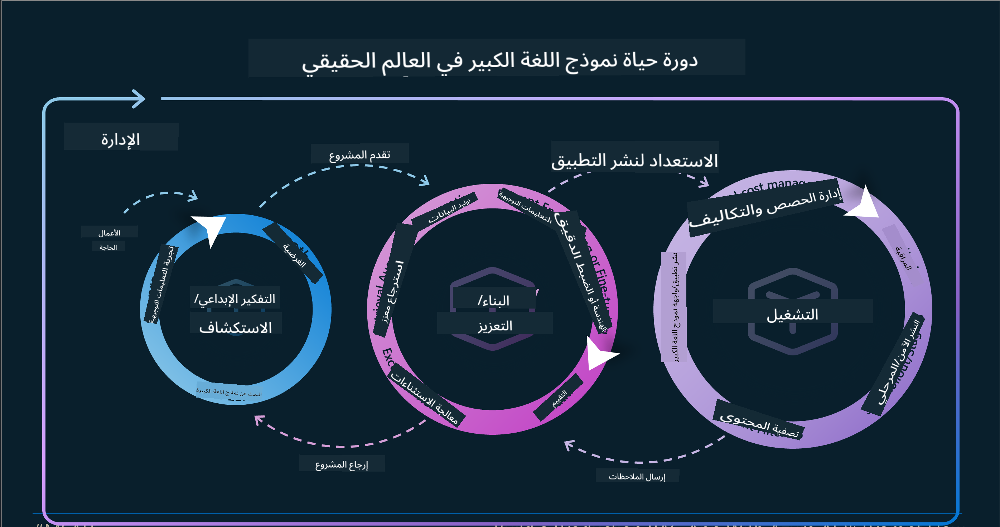

<!--
CO_OP_TRANSLATOR_METADATA:
{
  "original_hash": "b9d32511b27373a1b21b5789d4fda057",
  "translation_date": "2025-10-17T12:54:18+00:00",
  "source_file": "14-the-generative-ai-application-lifecycle/README.md",
  "language_code": "ar"
}
-->

# دورة حياة تطبيق الذكاء الاصطناعي التوليدي

سؤال مهم لجميع تطبيقات الذكاء الاصطناعي هو مدى ملاءمة ميزات الذكاء الاصطناعي، حيث إن الذكاء الاصطناعي مجال سريع التطور. لضمان بقاء تطبيقك ملائمًا وموثوقًا وقويًا، تحتاج إلى مراقبته وتقييمه وتحسينه باستمرار. وهنا تأتي دورة حياة الذكاء الاصطناعي التوليدي.

دورة حياة الذكاء الاصطناعي التوليدي هي إطار عمل يوجهك خلال مراحل تطوير ونشر وصيانة تطبيق الذكاء الاصطناعي التوليدي. يساعدك على تحديد أهدافك، قياس أدائك، تحديد التحديات، وتنفيذ الحلول. كما يساعدك على مواءمة تطبيقك مع المعايير الأخلاقية والقانونية لمجالك وأصحاب المصلحة لديك. من خلال اتباع دورة حياة الذكاء الاصطناعي التوليدي، يمكنك ضمان أن تطبيقك يقدم دائمًا قيمة ويرضي المستخدمين.

## المقدمة

في هذا الفصل، ستتعلم:

- فهم التحول من MLOps إلى LLMOps
- دورة حياة LLM
- أدوات دورة الحياة
- قياس وتقييم دورة الحياة

## فهم التحول من MLOps إلى LLMOps

LLMs هي أداة جديدة في ترسانة الذكاء الاصطناعي، وهي قوية للغاية في مهام التحليل والتوليد للتطبيقات. ومع ذلك، فإن هذه القوة لها بعض العواقب على كيفية تحسين مهام الذكاء الاصطناعي والتعلم الآلي التقليدي.

لذلك، نحن بحاجة إلى نموذج جديد لتكييف هذه الأداة بطريقة ديناميكية مع الحوافز الصحيحة. يمكننا تصنيف تطبيقات الذكاء الاصطناعي القديمة كـ "تطبيقات تعلم آلي" وتطبيقات الذكاء الاصطناعي الجديدة كـ "تطبيقات الذكاء الاصطناعي التوليدي" أو ببساطة "تطبيقات الذكاء الاصطناعي"، مما يعكس التكنولوجيا والتقنيات السائدة المستخدمة في ذلك الوقت. هذا التحول يغير سردنا بطرق متعددة، انظر إلى المقارنة التالية.

لاحظ أنه في LLMOps، نحن نركز أكثر على مطوري التطبيقات، باستخدام التكامل كنقطة رئيسية، واستخدام "النماذج كخدمة" والتفكير في النقاط التالية للقياسات:

- الجودة: جودة الاستجابة
- الضرر: الذكاء الاصطناعي المسؤول
- الصدق: استناد الاستجابة (هل يبدو منطقيًا؟ هل هو صحيح؟)
- التكلفة: ميزانية الحل
- التأخير: متوسط الوقت لاستجابة الرموز

## دورة حياة LLM

أولاً، لفهم دورة الحياة والتعديلات، دعونا نلاحظ الإنفوجرافيك التالي.

كما قد تلاحظ، هذا مختلف عن دورات الحياة المعتادة في MLOps. LLMs لديها العديد من المتطلبات الجديدة، مثل التوجيه، تقنيات مختلفة لتحسين الجودة (Fine-Tuning، RAG، Meta-Prompts)، تقييم مختلف ومسؤولية مع الذكاء الاصطناعي المسؤول، وأخيرًا، مقاييس تقييم جديدة (الجودة، الضرر، الصدق، التكلفة، والتأخير).

على سبيل المثال، انظر كيف نبتكر. باستخدام هندسة التوجيه لتجربة نماذج LLM المختلفة لاستكشاف الاحتمالات واختبار ما إذا كانت الفرضية صحيحة.

لاحظ أن هذا ليس خطيًا، بل حلقات متكاملة، تكرارية ومع دورة شاملة.

كيف يمكننا استكشاف هذه الخطوات؟ دعونا نتعمق في كيفية بناء دورة حياة.

قد يبدو هذا معقدًا بعض الشيء، دعونا نركز على الخطوات الثلاث الكبرى أولاً.

1. الابتكار/الاستكشاف: الاستكشاف، هنا يمكننا الاستكشاف وفقًا لاحتياجات أعمالنا. إنشاء نموذج أولي، إنشاء [PromptFlow](https://microsoft.github.io/promptflow/index.html?WT.mc_id=academic-105485-koreyst) واختبار ما إذا كان فعالًا بما يكفي لفرضيتنا.
1. البناء/التعزيز: التنفيذ، الآن، نبدأ في تقييم مجموعات البيانات الأكبر وتنفيذ تقنيات مثل Fine-tuning وRAG للتحقق من قوة الحل. إذا لم يكن كذلك، قد يساعد إعادة التنفيذ، إضافة خطوات جديدة في التدفق أو إعادة هيكلة البيانات. بعد اختبار التدفق والمقياس، إذا كان يعمل وتحققنا من مقاييسنا، فهو جاهز للخطوة التالية.
1. التشغيل: التكامل، الآن إضافة أنظمة المراقبة والتنبيهات إلى النظام، النشر والتكامل مع التطبيق.

ثم لدينا الدورة الشاملة للإدارة، التي تركز على الأمن، الامتثال، والحوكمة.

تهانينا، الآن لديك تطبيق الذكاء الاصطناعي جاهز للعمل. للحصول على تجربة عملية، ألقِ نظرة على [عرض Contoso Chat Demo.](https://nitya.github.io/contoso-chat/?WT.mc_id=academic-105485-koreys)

الآن، ما الأدوات التي يمكننا استخدامها؟

## أدوات دورة الحياة

بالنسبة للأدوات، توفر Microsoft [منصة Azure AI](https://azure.microsoft.com/solutions/ai/?WT.mc_id=academic-105485-koreys) و[PromptFlow](https://microsoft.github.io/promptflow/index.html?WT.mc_id=academic-105485-koreyst) لتسهيل وجعل الدورة سهلة التنفيذ وجاهزة للعمل.

[منصة Azure AI](https://azure.microsoft.com/solutions/ai/?WT.mc_id=academic-105485-koreys)، تتيح لك استخدام [AI Studio](https://ai.azure.com/?WT.mc_id=academic-105485-koreys). AI Studio هو بوابة ويب تتيح لك استكشاف النماذج، العينات، والأدوات. إدارة الموارد، تدفقات تطوير واجهة المستخدم وخيارات SDK/CLI لتطوير يعتمد على الكود أولاً.

Azure AI، تتيح لك استخدام موارد متعددة لإدارة العمليات، الخدمات، المشاريع، البحث المتجه واحتياجات قواعد البيانات.

بناء، من إثبات المفهوم (POC) حتى التطبيقات واسعة النطاق باستخدام PromptFlow:

- تصميم وبناء التطبيقات من VS Code، باستخدام أدوات بصرية ووظيفية
- اختبار وتحسين التطبيقات لجودة الذكاء الاصطناعي بسهولة.
- استخدام Azure AI Studio للتكامل والتكرار مع السحابة، الدفع والنشر للتكامل السريع.

## رائع! استمر في التعلم!

مذهل، الآن تعلم المزيد حول كيفية هيكلة تطبيق لاستخدام المفاهيم مع [تطبيق Contoso Chat](https://nitya.github.io/contoso-chat/?WT.mc_id=academic-105485-koreyst)، للتحقق من كيفية إضافة مفاهيم Cloud Advocacy في العروض التوضيحية. لمزيد من المحتوى، تحقق من [جلسة Ignite!](https://www.youtube.com/watch?v=DdOylyrTOWg)

الآن، تحقق من الدرس 15، لفهم كيف يؤثر [التوليد المعزز بالاسترجاع وقواعد البيانات المتجهة](../15-rag-and-vector-databases/README.md?WT.mc_id=academic-105485-koreyst) على الذكاء الاصطناعي التوليدي ولإنشاء تطبيقات أكثر جاذبية!

---

**إخلاء المسؤولية**:  
تم ترجمة هذا المستند باستخدام خدمة الترجمة بالذكاء الاصطناعي [Co-op Translator](https://github.com/Azure/co-op-translator). بينما نسعى لتحقيق الدقة، يرجى العلم أن الترجمات الآلية قد تحتوي على أخطاء أو عدم دقة. يجب اعتبار المستند الأصلي بلغته الأصلية المصدر الرسمي. للحصول على معلومات حاسمة، يُوصى بالترجمة البشرية الاحترافية. نحن غير مسؤولين عن أي سوء فهم أو تفسيرات خاطئة ناتجة عن استخدام هذه الترجمة.