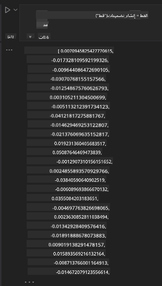

<!--
CO_OP_TRANSLATOR_METADATA:
{
  "original_hash": "e2861bbca91c0567ef32bc77fe054f9e",
  "translation_date": "2025-05-20T01:01:49+00:00",
  "source_file": "15-rag-and-vector-databases/README.md",
  "language_code": "ar"
}
-->
# توليد معزز بالاسترجاع (RAG) وقواعد بيانات المتجهات

في درس تطبيقات البحث، تعلمنا بشكل مختصر كيفية دمج بياناتك الخاصة في نماذج اللغة الكبيرة (LLMs). في هذا الدرس، سنتعمق أكثر في مفاهيم تأصيل بياناتك في تطبيق LLM الخاص بك، ميكانيكيات العملية وطرق تخزين البيانات، بما في ذلك كل من التضمينات والنصوص.

> **الفيديو قريباً**

## مقدمة

في هذا الدرس سنغطي ما يلي:

- مقدمة إلى RAG، ما هو ولماذا يستخدم في الذكاء الاصطناعي.

- فهم ما هي قواعد بيانات المتجهات وإنشاء واحدة لتطبيقنا.

- مثال عملي على كيفية دمج RAG في تطبيق.

## أهداف التعلم

بعد إكمال هذا الدرس، ستكون قادرًا على:

- شرح أهمية RAG في استرجاع ومعالجة البيانات.

- إعداد تطبيق RAG وتأصيل بياناتك في LLM

- دمج فعال لـ RAG وقواعد بيانات المتجهات في تطبيقات LLM.

## سيناريو الخاص بنا: تعزيز نماذج اللغة الكبيرة ببياناتنا الخاصة

لهذا الدرس، نريد إضافة ملاحظاتنا الخاصة إلى شركة التعليم الناشئة، مما يسمح للروبوت الدردشة بالحصول على معلومات أكثر حول المواضيع المختلفة. باستخدام الملاحظات التي لدينا، سيتمكن المتعلمون من الدراسة بشكل أفضل وفهم المواضيع المختلفة، مما يسهل عليهم المراجعة لامتحاناتهم. لإنشاء سيناريو الخاص بنا، سنستخدم:

- `Azure OpenAI:` النموذج الذي سنستخدمه لإنشاء روبوت الدردشة الخاص بنا

- `AI for beginners' lesson on Neural Networks`: ستكون هذه البيانات التي نؤسس عليها نموذجنا اللغوي

- `Azure AI Search` و `Azure Cosmos DB:` قاعدة بيانات المتجهات لتخزين بياناتنا وإنشاء فهرس بحث

سيتمكن المستخدمون من إنشاء اختبارات ممارسة من ملاحظاتهم، بطاقات المراجعة وتلخيصها لتقديم نظرات عامة موجزة. للبدء، دعونا نلقي نظرة على ما هو RAG وكيف يعمل:

## توليد معزز بالاسترجاع (RAG)

يعالج روبوت الدردشة المدعوم من LLM مطالبات المستخدم لتوليد ردود. تم تصميمه ليكون تفاعليًا ويتفاعل مع المستخدمين في مجموعة واسعة من المواضيع. ومع ذلك، فإن ردوده محدودة بالسياق المقدم وبيانات التدريب الأساسية الخاصة به. على سبيل المثال، قطع المعرفة لـ GPT-4 هو سبتمبر 2021، مما يعني أنه يفتقر إلى المعرفة بالأحداث التي وقعت بعد هذه الفترة. بالإضافة إلى ذلك، البيانات المستخدمة لتدريب نماذج اللغة الكبيرة تستثني المعلومات السرية مثل الملاحظات الشخصية أو دليل منتجات الشركة.

### كيف يعمل RAG (توليد معزز بالاسترجاع)


افترض أنك تريد نشر روبوت دردشة يقوم بإنشاء اختبارات من ملاحظاتك، ستحتاج إلى اتصال بقاعدة المعرفة. هنا يأتي دور RAG للإنقاذ. تعمل RAGs كما يلي:

- **قاعدة المعرفة:** قبل الاسترجاع، تحتاج هذه الوثائق إلى أن يتم استيعابها ومعالجتها مسبقًا، عادةً عن طريق تقسيم الوثائق الكبيرة إلى أجزاء أصغر، وتحويلها إلى تضمينات نصية وتخزينها في قاعدة بيانات.

- **استعلام المستخدم:** يسأل المستخدم سؤالاً

- **الاسترجاع:** عندما يسأل المستخدم سؤالاً، يسترجع نموذج التضمين معلومات ذات صلة من قاعدة المعرفة الخاصة بنا لتقديم المزيد من السياق الذي سيتم دمجه في المطالبة.

- **التوليد المعزز:** يعزز النموذج اللغوي ردوده بناءً على البيانات المسترجعة. يسمح للردود التي يتم توليدها بأن تكون مستندة ليس فقط على البيانات المدربة مسبقًا ولكن أيضًا على المعلومات ذات الصلة من السياق المضاف. يتم استخدام البيانات المسترجعة لتعزيز ردود النموذج اللغوي. ثم يعيد النموذج اللغوي إجابة على سؤال المستخدم.


يتم تنفيذ بنية RAG باستخدام المحولات المكونة من جزئين: مشفر ومفكك. على سبيل المثال، عندما يسأل المستخدم سؤالاً، يتم "تشفير" النص المدخل إلى متجهات تلتقط معنى الكلمات ويتم "فك تشفير" المتجهات إلى فهرس الوثيقة لدينا وتوليد نص جديد بناءً على استعلام المستخدم. يستخدم النموذج اللغوي كلا من نموذج المشفر-المفكك لتوليد الإخراج.

نهجان عند تنفيذ RAG وفقًا للورقة المقترحة: [توليد معزز بالاسترجاع لمهام معالجة اللغة الطبيعية المكثفة بالمعرفة](https://arxiv.org/pdf/2005.11401.pdf?WT.mc_id=academic-105485-koreyst) هما:

- **_RAG-Sequence_** باستخدام الوثائق المسترجعة للتنبؤ بأفضل إجابة ممكنة لاستعلام المستخدم

- **RAG-Token** باستخدام الوثائق لتوليد الرمز التالي، ثم استرجاعها للإجابة على استعلام المستخدم

### لماذا قد تستخدم RAG؟

- **غنى المعلومات:** يضمن أن تكون الردود النصية حديثة ومواكبة. وبالتالي، يعزز الأداء في المهام الخاصة بالمجال من خلال الوصول إلى قاعدة المعرفة الداخلية.

- يقلل من الاختلاق باستخدام **بيانات قابلة للتحقق** في قاعدة المعرفة لتقديم سياق لاستعلامات المستخدم.

- هو **اقتصادي** حيث يكون أكثر اقتصادية مقارنةً بضبط نموذج لغوي كبير

## إنشاء قاعدة المعرفة

تطبيقنا يعتمد على بياناتنا الشخصية، أي درس الشبكة العصبية في منهج الذكاء الاصطناعي للمبتدئين.

### قواعد بيانات المتجهات

قاعدة بيانات المتجهات، على عكس قواعد البيانات التقليدية، هي قاعدة بيانات متخصصة مصممة لتخزين وإدارة والبحث في المتجهات المضمنة. تخزن التمثيلات العددية للوثائق. تقسيم البيانات إلى تضمينات عددية يجعل من الأسهل لنظام الذكاء الاصطناعي الخاص بنا فهم ومعالجة البيانات.

نخزن تضميناتنا في قواعد بيانات المتجهات حيث أن نماذج اللغة الكبيرة لديها حد لعدد الرموز التي تقبلها كمدخلات. نظرًا لأنه لا يمكنك تمرير جميع التضمينات إلى نموذج لغوي كبير، سنحتاج إلى تقسيمها إلى أجزاء وعندما يسأل المستخدم سؤالاً، سيتم إرجاع التضمينات الأكثر تشابهًا مع السؤال مع المطالبة. التقسيم أيضًا يقلل التكاليف على عدد الرموز الممررة عبر نموذج لغوي كبير.

تشمل بعض قواعد بيانات المتجهات الشهيرة Azure Cosmos DB، Clarifyai، Pinecone، Chromadb، ScaNN، Qdrant و DeepLake. يمكنك إنشاء نموذج Azure Cosmos DB باستخدام Azure CLI باستخدام الأمر التالي:

```bash
az login
az group create -n <resource-group-name> -l <location>
az cosmosdb create -n <cosmos-db-name> -r <resource-group-name>
az cosmosdb list-keys -n <cosmos-db-name> -g <resource-group-name>
```

### من النص إلى التضمينات

قبل أن نخزن بياناتنا، سنحتاج إلى تحويلها إلى تضمينات متجهات قبل أن يتم تخزينها في قاعدة البيانات. إذا كنت تعمل مع وثائق كبيرة أو نصوص طويلة، يمكنك تقسيمها بناءً على الاستعلامات التي تتوقعها. يمكن تقسيم النصوص على مستوى الجملة أو على مستوى الفقرة. نظرًا لأن التقسيم يستخلص المعاني من الكلمات المحيطة بها، يمكنك إضافة بعض السياق الآخر إلى جزء، على سبيل المثال، بإضافة عنوان الوثيقة أو تضمين بعض النص قبل أو بعد الجزء. يمكنك تقسيم البيانات كما يلي:

```python
def split_text(text, max_length, min_length):
    words = text.split()
    chunks = []
    current_chunk = []

    for word in words:
        current_chunk.append(word)
        if len(' '.join(current_chunk)) < max_length and len(' '.join(current_chunk)) > min_length:
            chunks.append(' '.join(current_chunk))
            current_chunk = []

    # If the last chunk didn't reach the minimum length, add it anyway
    if current_chunk:
        chunks.append(' '.join(current_chunk))

    return chunks
```

بمجرد التقسيم، يمكننا بعد ذلك تضمين نصوصنا باستخدام نماذج التضمين المختلفة. بعض النماذج التي يمكنك استخدامها تشمل: word2vec، ada-002 بواسطة OpenAI، Azure Computer Vision والعديد من النماذج الأخرى. اختيار النموذج الذي ستستخدمه سيعتمد على اللغات التي تستخدمها، نوع المحتوى المشفر (نصوص/صور/صوت)، حجم المدخلات التي يمكنه تشفيرها وطول إخراج التضمين.

مثال على نص مضمن باستخدام نموذج `text-embedding-ada-002` من OpenAI هو:


## الاسترجاع والبحث المتجه

عندما يسأل المستخدم سؤالاً، يقوم المسترجع بتحويله إلى متجه باستخدام مشفر الاستعلام، ثم يبحث في فهرس البحث في وثائقنا عن المتجهات ذات الصلة في الوثيقة التي ترتبط بالمدخل. بمجرد الانتهاء، يقوم بتحويل كلا من المتجه المدخل ومتجهات الوثائق إلى نص ويمرره عبر النموذج اللغوي الكبير.

### الاسترجاع

يحدث الاسترجاع عندما يحاول النظام العثور بسرعة على الوثائق من الفهرس التي تلبي معايير البحث. هدف المسترجع هو الحصول على الوثائق التي سيتم استخدامها لتقديم السياق وتأصيل النموذج اللغوي الكبير على بياناتك.

هناك عدة طرق لأداء البحث داخل قاعدة البيانات الخاصة بنا مثل:

- **البحث بالكلمات المفتاحية** - يستخدم للبحث النصي

- **البحث الدلالي** - يستخدم المعنى الدلالي للكلمات

- **البحث المتجه** - يحول الوثائق من النص إلى تمثيلات متجه باستخدام نماذج التضمين. سيتم الاسترجاع عن طريق استعلام الوثائق التي تكون تمثيلاتها المتجهة الأقرب إلى سؤال المستخدم.

- **الهجين** - مزيج من كل من البحث بالكلمات المفتاحية والبحث المتجه.

تأتي التحديات مع الاسترجاع عندما لا يكون هناك استجابة مماثلة للاستعلام في قاعدة البيانات، سيعيد النظام أفضل المعلومات التي يمكنه الحصول عليها، ومع ذلك، يمكنك استخدام تكتيكات مثل إعداد المسافة القصوى للملاءمة أو استخدام البحث الهجين الذي يجمع بين الكلمات المفتاحية والبحث المتجه. في هذا الدرس سنستخدم البحث الهجين، مزيج من كل من البحث المتجه والبحث بالكلمات المفتاحية. سنخزن بياناتنا في إطار بيانات يحتوي على أعمدة تحتوي على الأجزاء بالإضافة إلى التضمينات.

### التشابه المتجه

سيبحث المسترجع في قاعدة بيانات المعرفة عن التضمينات التي تكون قريبة من بعضها البعض، أقرب الجيران، حيث أنها نصوص مشابهة. في حالة يسأل المستخدم استعلامًا، يتم تضمينه أولاً ثم مطابقته مع التضمينات المشابهة. القياس المشترك الذي يستخدم للعثور على مدى تشابه المتجهات المختلفة هو التشابه الجيبي الذي يعتمد على الزاوية بين متجهين.

يمكننا قياس التشابه باستخدام بدائل أخرى يمكننا استخدامها مثل المسافة الإقليدية وهي الخط المستقيم بين نقاط نهاية المتجهات والمنتج النقطي الذي يقيس مجموع منتجات العناصر المتقابلة لمتجهين.

### فهرس البحث

عند القيام بالاسترجاع، سنحتاج إلى بناء فهرس بحث لقاعدة المعرفة الخاصة بنا قبل أن نقوم بالبحث. سيخزن الفهرس تضميناتنا ويمكنه استرجاع الأجزاء الأكثر تشابهًا بسرعة حتى في قاعدة بيانات كبيرة. يمكننا إنشاء الفهرس محليًا باستخدام:

```python
from sklearn.neighbors import NearestNeighbors

embeddings = flattened_df['embeddings'].to_list()

# Create the search index
nbrs = NearestNeighbors(n_neighbors=5, algorithm='ball_tree').fit(embeddings)

# To query the index, you can use the kneighbors method
distances, indices = nbrs.kneighbors(embeddings)
```

### إعادة الترتيب

بمجرد أن تقوم باستعلام قاعدة البيانات، قد تحتاج إلى ترتيب النتائج من الأكثر صلة. يستخدم النموذج اللغوي الكبير لإعادة الترتيب التعلم الآلي لتحسين ملاءمة نتائج البحث عن طريق ترتيبها من الأكثر صلة. باستخدام Azure AI Search، يتم إعادة الترتيب تلقائيًا لك باستخدام معيد ترتيب دلالي. مثال على كيفية عمل إعادة الترتيب باستخدام أقرب الجيران:

```python
# Find the most similar documents
distances, indices = nbrs.kneighbors([query_vector])

index = []
# Print the most similar documents
for i in range(3):
    index = indices[0][i]
    for index in indices[0]:
        print(flattened_df['chunks'].iloc[index])
        print(flattened_df['path'].iloc[index])
        print(flattened_df['distances'].iloc[index])
    else:
        print(f"Index {index} not found in DataFrame")
```

## جمع كل شيء معًا

الخطوة الأخيرة هي إضافة النموذج اللغوي الكبير إلى المزيج ليكون قادرًا على الحصول على ردود مؤسّسة على بياناتنا. يمكننا تنفيذها كما يلي:

```python
user_input = "what is a perceptron?"

def chatbot(user_input):
    # Convert the question to a query vector
    query_vector = create_embeddings(user_input)

    # Find the most similar documents
    distances, indices = nbrs.kneighbors([query_vector])

    # add documents to query  to provide context
    history = []
    for index in indices[0]:
        history.append(flattened_df['chunks'].iloc[index])

    # combine the history and the user input
    history.append(user_input)

    # create a message object
    messages=[
        {"role": "system", "content": "You are an AI assistant that helps with AI questions."},
        {"role": "user", "content": history[-1]}
    ]

    # use chat completion to generate a response
    response = openai.chat.completions.create(
        model="gpt-4",
        temperature=0.7,
        max_tokens=800,
        messages=messages
    )

    return response.choices[0].message

chatbot(user_input)
```

## تقييم تطبيقنا

### مقاييس التقييم

- جودة الردود المقدمة مع ضمان أنها تبدو طبيعية، سلسة وذات طابع إنساني

- تأصيل البيانات: تقييم ما إذا كانت الردود جاءت من الوثائق المقدمة

- الملاءمة: تقييم ما إذا كانت الردود تطابق وتتعلق بالسؤال المطروح

- الطلاقة - ما إذا كانت الردود منطقية من الناحية النحوية

## حالات استخدام RAG (توليد معزز بالاسترجاع) وقواعد بيانات المتجهات

هناك العديد من حالات الاستخدام المختلفة حيث يمكن أن تحسن استدعاءات الوظائف تطبيقك مثل:

- السؤال والإجابة: تأصيل بيانات شركتك إلى دردشة يمكن استخدامها من قبل الموظفين لطرح الأسئلة.

- أنظمة التوصية: حيث يمكنك إنشاء نظام يطابق القيم الأكثر تشابهًا مثل الأفلام، المطاعم والعديد من الأشياء الأخرى.

- خدمات الروبوتات الدردشة: يمكنك تخزين سجل الدردشة وتخصيص المحادثة بناءً على بيانات المستخدم.

- البحث عن الصور بناءً على تضمينات المتجهات، مفيد عند القيام بالتعرف على الصور واكتشاف الشذوذ.

## ملخص

لقد غطينا المجالات الأساسية لـ RAG بدءًا من إضافة بياناتنا إلى التطبيق، استعلام المستخدم والإخراج. لتبسيط إنشاء RAG، يمكنك استخدام أطر عمل مثل Semanti Kernel، Langchain أو Autogen.

## المهمة

للمتابعة في تعلمك لتوليد معزز بالاسترجاع (RAG) يمكنك بناء:

- بناء واجهة أمامية للتطبيق باستخدام إطار العمل الذي تختاره

- استخدام إطار عمل، إما LangChain أو Semantic Kernel، وإعادة إنشاء تطبيقك.

تهانينا على إكمال الدرس 👏.

## التعلم لا يتوقف هنا، تابع الرحلة

بعد إكمال هذا الدرس، تحقق من مجموعة [تعلم الذكاء الاصطناعي التوليدي](https://aka.ms/genai-collection?WT.mc_id=academic-105485-koreyst) لمواصلة تحسين معرفتك بالذكاء الاصطناعي التوليدي!

**إخلاء المسؤولية**:  
تمت ترجمة هذه الوثيقة باستخدام خدمة الترجمة بالذكاء الاصطناعي [Co-op Translator](https://github.com/Azure/co-op-translator). بينما نسعى للدقة، يرجى العلم أن الترجمات الآلية قد تحتوي على أخطاء أو عدم دقة. يجب اعتبار الوثيقة الأصلية بلغتها الأصلية المصدر الموثوق. للحصول على معلومات حيوية، يوصى بالترجمة البشرية المهنية. نحن لسنا مسؤولين عن أي سوء فهم أو تفسيرات خاطئة ناتجة عن استخدام هذه الترجمة.