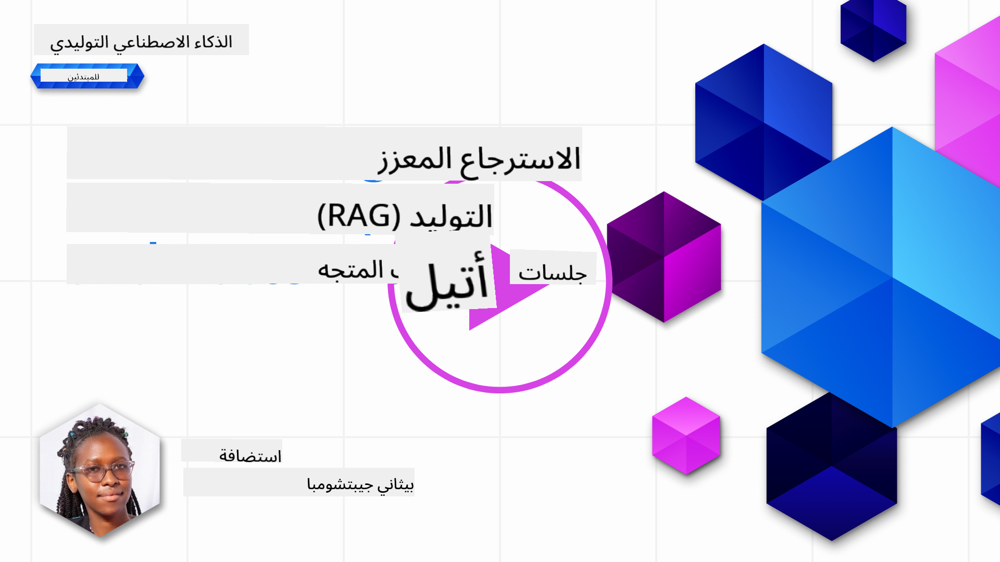
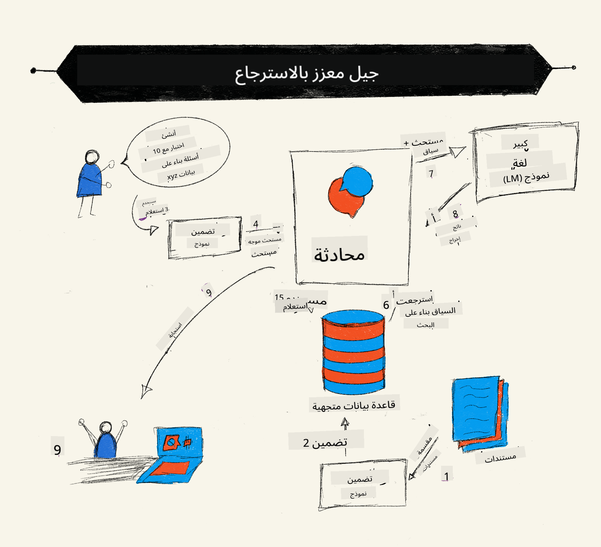
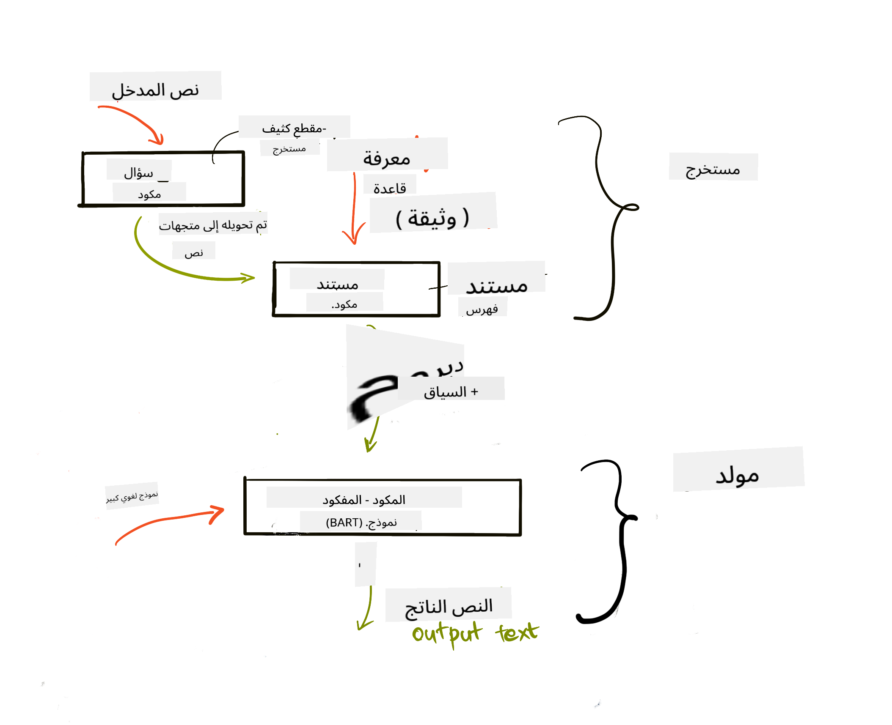

<!--
CO_OP_TRANSLATOR_METADATA:
{
  "original_hash": "b4b0266fbadbba7ded891b6485adc66d",
  "translation_date": "2025-10-17T12:52:14+00:00",
  "source_file": "15-rag-and-vector-databases/README.md",
  "language_code": "ar"
}
-->
# استرجاع البيانات المعزز (RAG) وقواعد بيانات المتجهات

[](https://youtu.be/4l8zhHUBeyI?si=BmvDmL1fnHtgQYkL)

في درس تطبيقات البحث، تعلمنا بشكل موجز كيفية دمج بياناتك الخاصة في نماذج اللغة الكبيرة (LLMs). في هذا الدرس، سنتعمق أكثر في مفاهيم تأصيل بياناتك في تطبيق LLM الخاص بك، آليات العملية وطرق تخزين البيانات، بما في ذلك التضمينات والنصوص.

> **الفيديو قريبًا**

## المقدمة

في هذا الدرس سنغطي ما يلي:

- مقدمة عن RAG، ما هو ولماذا يُستخدم في الذكاء الاصطناعي.

- فهم قواعد بيانات المتجهات وإنشاء واحدة لتطبيقنا.

- مثال عملي على كيفية دمج RAG في تطبيق.

## أهداف التعلم

بعد إكمال هذا الدرس، ستكون قادرًا على:

- شرح أهمية RAG في استرجاع البيانات ومعالجتها.

- إعداد تطبيق RAG وتأصيل بياناتك إلى LLM.

- دمج فعال بين RAG وقواعد بيانات المتجهات في تطبيقات LLM.

## السيناريو الخاص بنا: تعزيز LLMs ببياناتنا الخاصة

في هذا الدرس، نريد إضافة ملاحظاتنا الخاصة إلى شركة ناشئة تعليمية، مما يسمح للروبوت بالحصول على مزيد من المعلومات حول المواضيع المختلفة. باستخدام الملاحظات التي لدينا، سيتمكن المتعلمون من الدراسة بشكل أفضل وفهم المواضيع المختلفة، مما يسهل عليهم المراجعة لامتحاناتهم. لإنشاء السيناريو الخاص بنا، سنستخدم:

- `Azure OpenAI:` النموذج الذي سنستخدمه لإنشاء الروبوت.

- `درس المبتدئين في الذكاء الاصطناعي حول الشبكات العصبية:` سيكون هذا هو البيانات التي سنؤصل عليها LLM الخاص بنا.

- `Azure AI Search` و `Azure Cosmos DB:` قاعدة بيانات متجهات لتخزين بياناتنا وإنشاء فهرس بحث.

سيتمكن المستخدمون من إنشاء اختبارات تدريبية من ملاحظاتهم، بطاقات مراجعة، وتلخيصها إلى نظرات عامة مختصرة. للبدء، دعونا نلقي نظرة على ما هو RAG وكيف يعمل:

## استرجاع البيانات المعزز (RAG)

روبوت الدردشة المدعوم بـ LLM يعالج مطالبات المستخدم لتوليد ردود. تم تصميمه ليكون تفاعليًا ويتفاعل مع المستخدمين حول مجموعة واسعة من المواضيع. ومع ذلك، فإن ردوده محدودة بالسياق المقدم وبيانات التدريب الأساسية. على سبيل المثال، الحد الأقصى لمعرفة GPT-4 هو سبتمبر 2021، مما يعني أنه يفتقر إلى المعرفة بالأحداث التي حدثت بعد هذه الفترة. بالإضافة إلى ذلك، البيانات المستخدمة لتدريب LLMs تستثني المعلومات السرية مثل الملاحظات الشخصية أو دليل منتجات الشركة.

### كيف تعمل RAGs (استرجاع البيانات المعزز)



افترض أنك تريد نشر روبوت دردشة ينشئ اختبارات من ملاحظاتك، ستحتاج إلى اتصال بقاعدة المعرفة. هنا يأتي دور RAG. تعمل RAGs كما يلي:

- **قاعدة المعرفة:** قبل الاسترجاع، يجب استيعاب هذه الوثائق ومعالجتها مسبقًا، عادةً عن طريق تقسيم الوثائق الكبيرة إلى أجزاء أصغر، تحويلها إلى تضمينات نصية وتخزينها في قاعدة بيانات.

- **استفسار المستخدم:** يسأل المستخدم سؤالًا.

- **الاسترجاع:** عندما يسأل المستخدم سؤالًا، يقوم نموذج التضمين باسترجاع المعلومات ذات الصلة من قاعدة المعرفة الخاصة بنا لتوفير المزيد من السياق الذي سيتم دمجه في المطالبة.

- **التوليد المعزز:** يعزز LLM استجابته بناءً على البيانات المسترجعة. يسمح ذلك للردود التي يتم توليدها بأن تكون مبنية ليس فقط على البيانات المدربة مسبقًا ولكن أيضًا على المعلومات ذات الصلة من السياق المضاف. يتم استخدام البيانات المسترجعة لتعزيز ردود LLM. ثم يقوم LLM بإرجاع إجابة على سؤال المستخدم.



يتم تنفيذ بنية RAGs باستخدام المحولات التي تتكون من جزئين: مشفر ومفكك. على سبيل المثال، عندما يسأل المستخدم سؤالًا، يتم "تشفير" النص المدخل إلى متجهات تلتقط معنى الكلمات ويتم "فك تشفير" المتجهات إلى فهرس الوثائق لدينا وتوليد نص جديد بناءً على استفسار المستخدم. يستخدم LLM نموذج مشفر-مفكك لتوليد المخرجات.

هناك نهجان عند تنفيذ RAG وفقًا للورقة المقترحة: [استرجاع البيانات المعزز للمهام المكثفة للمعرفة في معالجة اللغة الطبيعية](https://arxiv.org/pdf/2005.11401.pdf?WT.mc_id=academic-105485-koreyst):

- **_RAG-Sequence_** استخدام الوثائق المسترجعة للتنبؤ بأفضل إجابة ممكنة لاستفسار المستخدم.

- **RAG-Token** استخدام الوثائق لتوليد الرمز التالي، ثم استرجاعها للإجابة على استفسار المستخدم.

### لماذا تستخدم RAGs؟

- **غنى المعلومات:** يضمن أن تكون الردود النصية محدثة وحالية. وبالتالي، يعزز الأداء في المهام الخاصة بالمجال من خلال الوصول إلى قاعدة المعرفة الداخلية.

- يقلل من التزييف باستخدام **بيانات يمكن التحقق منها** في قاعدة المعرفة لتوفير السياق لاستفسارات المستخدم.

- **فعال من حيث التكلفة** حيث إنه أكثر اقتصادية مقارنة بتخصيص LLM.

## إنشاء قاعدة المعرفة

تطبيقنا يعتمد على بياناتنا الشخصية أي درس الشبكات العصبية في منهج المبتدئين في الذكاء الاصطناعي.

### قواعد بيانات المتجهات

قاعدة بيانات المتجهات، على عكس قواعد البيانات التقليدية، هي قاعدة بيانات متخصصة مصممة لتخزين وإدارة والبحث عن المتجهات المضمنة. تخزن التمثيلات العددية للوثائق. تقسيم البيانات إلى تضمينات عددية يجعل من السهل على نظام الذكاء الاصطناعي فهم ومعالجة البيانات.

نخزن تضميناتنا في قواعد بيانات المتجهات حيث أن LLMs لديها حد لعدد الرموز التي تقبلها كمدخلات. نظرًا لأنه لا يمكنك تمرير جميع التضمينات إلى LLM، سنحتاج إلى تقسيمها إلى أجزاء وعندما يسأل المستخدم سؤالًا، يتم إرجاع التضمينات الأكثر شبهًا بالسؤال مع المطالبة. التقسيم أيضًا يقلل التكاليف على عدد الرموز التي تمر عبر LLM.

تشمل بعض قواعد بيانات المتجهات الشهيرة Azure Cosmos DB، Clarifyai، Pinecone، Chromadb، ScaNN، Qdrant و DeepLake. يمكنك إنشاء نموذج Azure Cosmos DB باستخدام Azure CLI مع الأمر التالي:

```bash
az login
az group create -n <resource-group-name> -l <location>
az cosmosdb create -n <cosmos-db-name> -r <resource-group-name>
az cosmosdb list-keys -n <cosmos-db-name> -g <resource-group-name>
```

### من النص إلى التضمينات

قبل أن نخزن بياناتنا، سنحتاج إلى تحويلها إلى تضمينات متجهية قبل تخزينها في قاعدة البيانات. إذا كنت تعمل مع وثائق كبيرة أو نصوص طويلة، يمكنك تقسيمها بناءً على الاستفسارات التي تتوقعها. يمكن تقسيم النصوص على مستوى الجملة أو الفقرة. حيث أن التقسيم يستخلص المعاني من الكلمات المحيطة بها، يمكنك إضافة بعض السياق إلى الجزء، على سبيل المثال، بإضافة عنوان الوثيقة أو تضمين بعض النصوص قبل أو بعد الجزء. يمكنك تقسيم البيانات كما يلي:

```python
def split_text(text, max_length, min_length):
    words = text.split()
    chunks = []
    current_chunk = []

    for word in words:
        current_chunk.append(word)
        if len(' '.join(current_chunk)) < max_length and len(' '.join(current_chunk)) > min_length:
            chunks.append(' '.join(current_chunk))
            current_chunk = []

    # If the last chunk didn't reach the minimum length, add it anyway
    if current_chunk:
        chunks.append(' '.join(current_chunk))

    return chunks
```

بمجرد تقسيمها، يمكننا تضمين نصوصنا باستخدام نماذج تضمين مختلفة. بعض النماذج التي يمكنك استخدامها تشمل: word2vec، ada-002 بواسطة OpenAI، Azure Computer Vision والعديد غيرها. اختيار النموذج يعتمد على اللغات التي تستخدمها، نوع المحتوى المشفر (نصوص/صور/صوت)، حجم المدخلات التي يمكن تشفيرها وطول مخرجات التضمين.

مثال على نص مضمن باستخدام نموذج `text-embedding-ada-002` من OpenAI هو:


## الاسترجاع والبحث المتجهي

عندما يسأل المستخدم سؤالًا، يقوم المسترجع بتحويله إلى متجه باستخدام مشفر الاستفسار، ثم يبحث في فهرس البحث الخاص بالوثائق عن المتجهات ذات الصلة في الوثيقة التي ترتبط بالمدخل. بمجرد الانتهاء، يقوم بتحويل كل من المتجه المدخل ومتجهات الوثائق إلى نص ويمرره عبر LLM.

### الاسترجاع

يحدث الاسترجاع عندما يحاول النظام بسرعة العثور على الوثائق من الفهرس التي تلبي معايير البحث. هدف المسترجع هو الحصول على الوثائق التي سيتم استخدامها لتوفير السياق وتأصيل LLM على بياناتك.

هناك عدة طرق لإجراء البحث داخل قاعدة البيانات الخاصة بنا مثل:

- **البحث بالكلمات المفتاحية** - يستخدم للبحث النصي.

- **البحث الدلالي** - يستخدم المعنى الدلالي للكلمات.

- **البحث المتجهي** - يحول الوثائق من نصوص إلى تمثيلات متجهية باستخدام نماذج التضمين. يتم الاسترجاع عن طريق استفسار الوثائق التي تكون تمثيلاتها المتجهية الأقرب إلى سؤال المستخدم.

- **الهجين** - مزيج من البحث بالكلمات المفتاحية والبحث المتجهي.

تحدي الاسترجاع يظهر عندما لا يكون هناك استجابة مشابهة للاستفسار في قاعدة البيانات، سيقوم النظام حينها بإرجاع أفضل المعلومات التي يمكنه الحصول عليها، ومع ذلك، يمكنك استخدام تكتيكات مثل إعداد المسافة القصوى للملاءمة أو استخدام البحث الهجين الذي يجمع بين الكلمات المفتاحية والبحث المتجهي. في هذا الدرس سنستخدم البحث الهجين، مزيج من البحث المتجهي والكلمات المفتاحية. سنخزن بياناتنا في إطار بيانات يحتوي على أعمدة تحتوي على الأجزاء وكذلك التضمينات.

### تشابه المتجهات

سيبحث المسترجع في قاعدة بيانات المعرفة عن التضمينات القريبة من بعضها البعض، الأقرب، حيث إنها نصوص مشابهة. في السيناريو الذي يسأل فيه المستخدم استفسارًا، يتم تضمينه أولاً ثم مطابقته مع التضمينات المشابهة. القياس الشائع المستخدم لمعرفة مدى تشابه المتجهات المختلفة هو التشابه الكوني الذي يعتمد على الزاوية بين متجهين.

يمكننا قياس التشابه باستخدام بدائل أخرى مثل المسافة الإقليدية التي تمثل الخط المستقيم بين نقاط نهاية المتجهات والمنتج النقطي الذي يقيس مجموع منتجات العناصر المقابلة لمتجهين.

### فهرس البحث

عند القيام بالاسترجاع، سنحتاج إلى بناء فهرس بحث لقاعدة المعرفة الخاصة بنا قبل أن نقوم بالبحث. الفهرس سيخزن تضميناتنا ويمكنه بسرعة استرجاع الأجزاء الأكثر تشابهًا حتى في قاعدة بيانات كبيرة. يمكننا إنشاء الفهرس محليًا باستخدام:

```python
from sklearn.neighbors import NearestNeighbors

embeddings = flattened_df['embeddings'].to_list()

# Create the search index
nbrs = NearestNeighbors(n_neighbors=5, algorithm='ball_tree').fit(embeddings)

# To query the index, you can use the kneighbors method
distances, indices = nbrs.kneighbors(embeddings)
```

### إعادة الترتيب

بمجرد أن تقوم باستفسار قاعدة البيانات، قد تحتاج إلى ترتيب النتائج من الأكثر ملاءمة. يستخدم LLM لإعادة الترتيب التعلم الآلي لتحسين ملاءمة نتائج البحث عن طريق ترتيبها من الأكثر ملاءمة. باستخدام Azure AI Search، يتم إعادة الترتيب تلقائيًا باستخدام معيد ترتيب دلالي. مثال على كيفية عمل إعادة الترتيب باستخدام أقرب الجيران:

```python
# Find the most similar documents
distances, indices = nbrs.kneighbors([query_vector])

index = []
# Print the most similar documents
for i in range(3):
    index = indices[0][i]
    for index in indices[0]:
        print(flattened_df['chunks'].iloc[index])
        print(flattened_df['path'].iloc[index])
        print(flattened_df['distances'].iloc[index])
    else:
        print(f"Index {index} not found in DataFrame")
```

## جمع كل شيء معًا

الخطوة الأخيرة هي إضافة LLM إلى المزيج ليكون قادرًا على الحصول على ردود مؤصلة على بياناتنا. يمكننا تنفيذ ذلك كما يلي:

```python
user_input = "what is a perceptron?"

def chatbot(user_input):
    # Convert the question to a query vector
    query_vector = create_embeddings(user_input)

    # Find the most similar documents
    distances, indices = nbrs.kneighbors([query_vector])

    # add documents to query  to provide context
    history = []
    for index in indices[0]:
        history.append(flattened_df['chunks'].iloc[index])

    # combine the history and the user input
    history.append(user_input)

    # create a message object
    messages=[
        {"role": "system", "content": "You are an AI assistant that helps with AI questions."},
        {"role": "user", "content": history[-1]}
    ]

    # use chat completion to generate a response
    response = openai.chat.completions.create(
        model="gpt-4",
        temperature=0.7,
        max_tokens=800,
        messages=messages
    )

    return response.choices[0].message

chatbot(user_input)
```

## تقييم تطبيقنا

### مقاييس التقييم

- جودة الردود المقدمة لضمان أنها تبدو طبيعية، سلسة وشبيهة بالإنسان.

- تأصيل البيانات: تقييم ما إذا كانت الردود جاءت من الوثائق المقدمة.

- الملاءمة: تقييم ما إذا كانت الردود تتطابق وتتعلق بالسؤال المطروح.

- الطلاقة - ما إذا كانت الردود منطقية نحويًا.

## حالات الاستخدام لاسترجاع البيانات المعزز (RAG) وقواعد بيانات المتجهات

هناك العديد من حالات الاستخدام المختلفة حيث يمكن أن تحسن استدعاء الوظائف تطبيقك مثل:

- الأسئلة والأجوبة: تأصيل بيانات شركتك إلى دردشة يمكن استخدامها من قبل الموظفين لطرح الأسئلة.

- أنظمة التوصية: حيث يمكنك إنشاء نظام يطابق القيم الأكثر تشابهًا مثل الأفلام، المطاعم والعديد غيرها.

- خدمات الروبوتات: يمكنك تخزين تاريخ الدردشة وتخصيص المحادثة بناءً على بيانات المستخدم.

- البحث عن الصور بناءً على تضمينات المتجهات، مفيد عند القيام بالتعرف على الصور واكتشاف الشذوذ.

## الملخص

لقد غطينا المجالات الأساسية لـ RAG من إضافة بياناتنا إلى التطبيق، استفسار المستخدم والمخرجات. لتبسيط إنشاء RAG، يمكنك استخدام أطر عمل مثل Semanti Kernel، Langchain أو Autogen.

## المهمة

لمواصلة تعلمك لاسترجاع البيانات المعزز (RAG) يمكنك بناء:

- بناء واجهة أمامية للتطبيق باستخدام إطار العمل الذي تختاره.

- استخدام إطار عمل، إما LangChain أو Semantic Kernel، وإعادة إنشاء تطبيقك.

تهانينا على إكمال الدرس 👏.

## التعلم لا يتوقف هنا، استمر في الرحلة

بعد إكمال هذا الدرس، تحقق من [مجموعة تعلم الذكاء الاصطناعي التوليدي](https://aka.ms/genai-collection?WT.mc_id=academic-105485-koreyst) لمواصلة تعزيز معرفتك بالذكاء الاصطناعي التوليدي!

---

**إخلاء المسؤولية**:  
تم ترجمة هذا المستند باستخدام خدمة الترجمة بالذكاء الاصطناعي [Co-op Translator](https://github.com/Azure/co-op-translator). بينما نسعى لتحقيق الدقة، يرجى العلم أن الترجمات الآلية قد تحتوي على أخطاء أو عدم دقة. يجب اعتبار المستند الأصلي بلغته الأصلية المصدر الرسمي. للحصول على معلومات حاسمة، يُوصى بالترجمة البشرية الاحترافية. نحن غير مسؤولين عن أي سوء فهم أو تفسيرات خاطئة ناتجة عن استخدام هذه الترجمة.