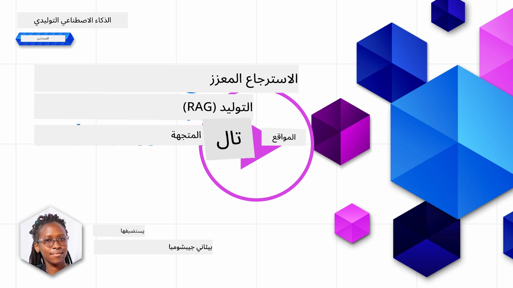
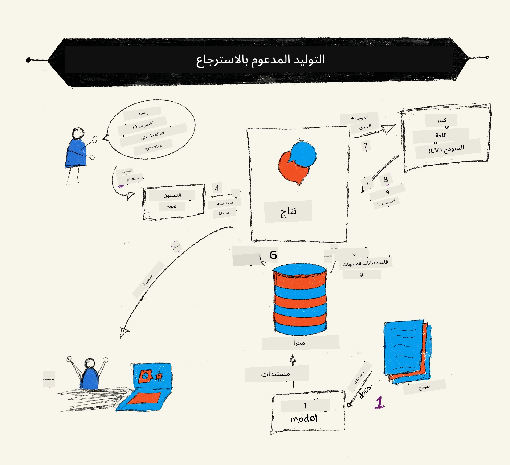
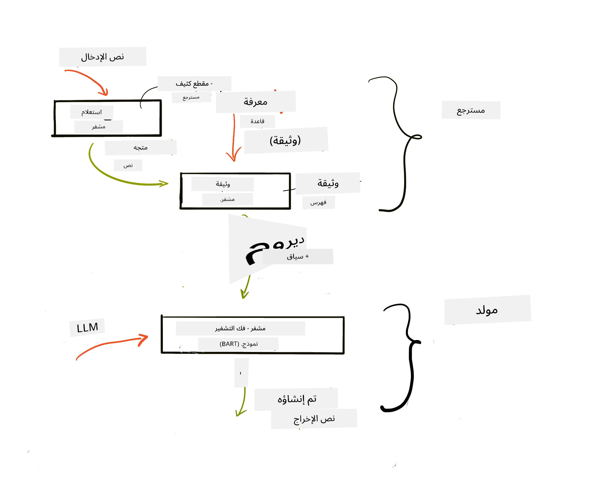
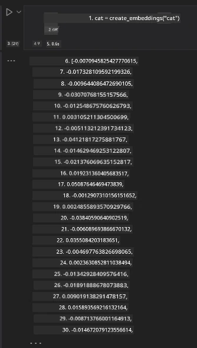

# التوليد المعزز بالاسترجاع (RAG) وقواعد بيانات المتجهات

[](https://youtu.be/4l8zhHUBeyI?si=BmvDmL1fnHtgQYkL)

في درس تطبيقات البحث، تعلمنا بإيجاز كيفية دمج بياناتك الخاصة في نماذج اللغة الكبيرة (LLMs). في هذا الدرس، سنتعمق أكثر في مفاهيم تثبيت بياناتك في تطبيق LLM، وآليات العملية وطرق تخزين البيانات، بما في ذلك كل من التضمينات والنصوص.

> **فيديو قادم قريباً**

## مقدمة

في هذا الدرس، سنغطي ما يلي:

- مقدمة عن RAG، ما هو ولماذا يُستخدم في الذكاء الاصطناعي.

- فهم ما هي قواعد بيانات المتجهات وإنشاء واحدة لتطبيقنا.

- مثال عملي حول كيفية دمج RAG في تطبيق.

## أهداف التعلم

بعد إكمال هذا الدرس، ستكون قادرًا على:

- شرح أهمية RAG في استرجاع البيانات ومعالجتها.

- إعداد تطبيق RAG وتثبيت بياناتك في نموذج لغة كبير.

- دمج فعال لـ RAG وقواعد بيانات المتجهات في تطبيقات LLM.

## سيناريو خاص بنا: تحسين نماذج لغتنا الكبيرة ببياناتنا الخاصة

في هذا الدرس، نرغب في إضافة ملاحظاتنا الخاصة إلى شركة ناشئة تعليمية، مما يسمح للروبوت المحادثة بالحصول على مزيد من المعلومات حول مختلف المواضيع. باستخدام الملاحظات التي لدينا، سيتمكن المتعلمون من الدراسة بشكل أفضل وفهم المواضيع المختلفة، مما يجعل من السهل مراجعتها للامتحانات. لإنشاء سيناريو خاص بنا، سنستخدم:

- `Azure OpenAI:` نموذج اللغة الكبير الذي سنستخدمه لإنشاء روبوت المحادثة الخاص بنا

- `درس الذكاء الاصطناعي للمبتدئين حول الشبكات العصبية`: هذه هي البيانات التي سنثبت نموذجنا عليها

- `Azure AI Search` و `Azure Cosmos DB:` قاعدة بيانات المتجهات لتخزين بياناتنا وإنشاء فهرس بحث

سيتمكن المستخدمون من إنشاء اختبارات تدريبية من ملاحظاتهم، وبطاقات مراجعة، وتلخيصها إلى نظرات عامة مختصرة. للبدء، دعنا ننظر إلى ما هو RAG وكيف يعمل:

## التوليد المعزز بالاسترجاع (RAG)

روبوت المحادثة المدعوم بنموذج لغة كبير يعالج مطالبات المستخدمين لإنشاء ردود. وصُمم ليكون تفاعليًا ويتبادل الحديث مع المستخدمين في مجموعة واسعة من المواضيع. مع ذلك، فإن ردوده محدودة بالسياق المقدم وبيانات التدريب الأساسية الخاصة به. على سبيل المثال، حد معرفة GPT-4 هو سبتمبر 2021، مما يعني أنه يفتقر إلى معرفة الأحداث التي وقعت بعد هذه الفترة. بالإضافة إلى ذلك، البيانات المستخدمة لتدريب نماذج اللغة الكبيرة تستثني المعلومات السرية مثل الملاحظات الشخصية أو دليل استخدام منتج الشركة.

### كيف تعمل أنظمة RAG (التوليد المعزز بالاسترجاع)



افترض أنك تريد نشر روبوت محادثة ينشئ اختبارات من ملاحظاتك، فستحتاج إلى اتصال مع قاعدة المعرفة. هنا يأتي دور RAG. تعمل أنظمة RAG كما يلي:

- **قاعدة المعرفة:** قبل الاسترجاع، يجب معالجة هذه الوثائق وتحليلها، عادةً بتقسيم الوثائق الكبيرة إلى أجزاء أصغر، تحويلها إلى تضمينات نصية وتخزينها في قاعدة بيانات.

- **طلب المستخدم:** المستخدم يطرح سؤالًا

- **الاسترجاع:** عندما يطرح المستخدم سؤالًا، يسترجع نموذج التضمين المعلومات ذات الصلة من قاعدة المعرفة الخاصة بنا لتوفير المزيد من السياق الذي سيتم دمجه في المطالبة.

- **التوليد المعزز:** يقوم نموذج اللغة الكبير بتحسين استجابته بناءً على البيانات المسترجعة. يسمح الرد الناتج بأن لا يكون مبنيًا فقط على البيانات المدربة مسبقًا بل أيضًا على المعلومات ذات الصلة من السياق المضاف. يتم استخدام البيانات المسترجعة لدعم ردود نموذج اللغة الكبير. ثم يعيد النموذج إجابة على سؤال المستخدم.



تُنفذ معماريات أنظمة RAG باستخدام المحولات وتتألف من جزأين: مشفر ومفكك للشفرة. على سبيل المثال، عندما يطرح المستخدم سؤالًا، يُشفر النص المدخل إلى متجهات تلتقط معنى الكلمات، ويتم فك تشفير هذه المتجهات إلى فهرس المستندات الخاص بنا وينشئ نصًا جديدًا بناءً على سؤال المستخدم. يستخدم نموذج اللغة الكبير نموذج مشفر-مفكك لإنتاج المخرجات.

هناك نهجان عند تنفيذ RAG وفقًا للورقة المقترحة: [التوليد المعزز بالاسترجاع لمهام معالجة اللغة الطبيعية المعتمدة على المعرفة](https://arxiv.org/pdf/2005.11401.pdf?WT.mc_id=academic-105485-koreyst):

- **_RAG-Sequence_** يستخدم الوثائق المسترجعة لتوقع أفضل إجابة ممكنة لسؤال المستخدم

- **RAG-Token** يستخدم الوثائق لتوليد الرمز التالي، ثم يسترجعها للرد على سؤال المستخدم

### لماذا تستخدم أنظمة RAG؟ 

- **غنى المعلومات:** يضمن أن تكون الردود النصية محدثة وحالية. وبالتالي يعزز الأداء في المهام الخاصة بالمجال من خلال الوصول إلى قاعدة المعرفة الداخلية.

- يقلل من التضليل باستخدام **بيانات قابلة للتحقق** في قاعدة المعرفة لتوفير سياق لطلبات المستخدم.

- هو **فعال من حيث التكلفة** حيث أنه أكثر اقتصادًا مقارنة بضبط دقيق لنموذج اللغة الكبير

## إنشاء قاعدة معرفة

تطبيقنا مبني على بياناتنا الشخصية، أي درس الشبكات العصبية في منهج الذكاء الاصطناعي للمبتدئين.

### قواعد بيانات المتجهات

قاعدة بيانات المتجهات، على عكس قواعد البيانات التقليدية، هي قاعدة بيانات متخصصة مصممة لتخزين وإدارة والبحث في المتجهات المضمنة. تخزن تمثيلات عددية للوثائق. تقسيم البيانات إلى تضمينات رقمية يسهل على نظام الذكاء الاصطناعي فهمها ومعالجتها.

نخزن تضميناتنا في قواعد بيانات المتجهات لأن نماذج اللغة الكبيرة لها حد أقصى لعدد الرموز التي يمكنها قبولها كمدخلات. نظرًا لأنه لا يمكن تمرير التضمينات الكاملة إلى نموذج اللغة الكبير دفعة واحدة، سنحتاج إلى تقسيمها إلى أجزاء، وعندما يطرح المستخدم سؤالًا، يتم إرجاع التضمينات التي تشبه السؤال مع المطالبة. كما أن التقسيم يقلل من التكاليف المتعلقة بعدد الرموز التي تمر عبر نموذج اللغة الكبير.

من قواعد بيانات المتجهات الشهيرة Azure Cosmos DB، Clarifyai، Pinecone، Chromadb، ScaNN، Qdrant و DeepLake. يمكنك إنشاء نموذج لـ Azure Cosmos DB باستخدام Azure CLI بالأمر التالي:

```bash
az login
az group create -n <resource-group-name> -l <location>
az cosmosdb create -n <cosmos-db-name> -r <resource-group-name>
az cosmosdb list-keys -n <cosmos-db-name> -g <resource-group-name>
```

### من النص إلى التضمينات

قبل أن نخزن بياناتنا، نحتاج إلى تحويلها إلى تضمينات متجهية قبل تخزينها في قاعدة البيانات. إذا كنت تعمل مع وثائق كبيرة أو نصوص طويلة، يمكنك تقسيمها بناءً على الاستعلامات التي تتوقعها. يمكن تقسيمها على مستوى الجملة أو الفقرة. نظرًا لأن التقسيم يستخلص المعاني من الكلمات المحيطة، يمكنك إضافة سياق إضافي للجزء، على سبيل المثال، بإضافة عنوان الوثيقة أو تضمين بعض النص قبل أو بعد الجزء. يمكنك تقسيم البيانات كما يلي:

```python
def split_text(text, max_length, min_length):
    words = text.split()
    chunks = []
    current_chunk = []

    for word in words:
        current_chunk.append(word)
        if len(' '.join(current_chunk)) < max_length and len(' '.join(current_chunk)) > min_length:
            chunks.append(' '.join(current_chunk))
            current_chunk = []

    # إذا لم تصل القطعة الأخيرة إلى الحد الأدنى للطول، أضفها على أي حال
    if current_chunk:
        chunks.append(' '.join(current_chunk))

    return chunks
```

بعد تقسيمها، يمكننا تضمين نصنا باستخدام نماذج تضمين مختلفة. بعض النماذج التي يمكنك استخدامها تشمل: word2vec، ada-002 من OpenAI، Azure Computer Vision والعديد غيرها. اختيار النموذج يعتمد على اللغات المستخدمة، نوع المحتوى المشفر (نص/صور/صوت)، حجم الإدخال الذي يمكن تشفيره وطول مخرجات التضمين.

مثال على نص مضمن باستخدام نموذج OpenAI `text-embedding-ada-002` هو:


## الاسترجاع والبحث المتجهي

عندما يطرح المستخدم سؤالًا، يقوم المسترجع بتحويله إلى متجه باستخدام مشفر الاستعلام، ثم يبحث خلال فهرس البحث عن المتجهات ذات الصلة في الوثائق المرتبطة بالإدخال. بعد ذلك، يحول كل من متجه الإدخال ومتجهات الوثائق إلى نص ويمرره عبر نموذج اللغة الكبير.

### الاسترجاع

يحدث الاسترجاع عندما يحاول النظام بسرعة العثور على الوثائق من الفهرس التي تلبي معايير البحث. هدف المسترجع هو الحصول على الوثائق التي ستُستخدم لتوفير السياق وتثبيت نموذج اللغة الكبير على بياناتك.

هناك عدة طرق لإجراء البحث داخل قاعدة بياناتنا مثل:

- **البحث بالكلمات المفتاحية** - يُستخدم للبحث النصي

- **البحث المتجهي** - يحول الوثائق من نص إلى تمثيل متجهي باستخدام نماذج التضمين، مما يسمح بعملية **بحث دلالي** باستخدام معنى الكلمات. يتم الاسترجاع من خلال استعلام الوثائق التي تمثل متجهاتها الأقرب إلى سؤال المستخدم.

- **الهجين** - مزيج من البحث بالكلمات المفتاحية والمتجه

تكمن المشكلة في الاسترجاع عندما لا يوجد رد مماثل للاستعلام في قاعدة البيانات، حينها يعيد النظام أفضل المعلومات المتاحة، ومع ذلك، يمكنك استخدام تكتيكات مثل تعيين الحد الأقصى للمسافة للملاءمة أو استخدام البحث الهجين الذي يجمع بين الكلمات المفتاحية والبحث المتجهي. في هذا الدرس سنستخدم البحث الهجين، مزيجًا من كلا الطريقتين. سنخزن بياناتنا في إطار بيانات يحتوي على الأعمدة التي تشمل الأجزاء والتضمينات.

### التشابه المتجهي

سيبحث المسترجع في قاعدة المعرفة عن التضمينات القريبة من بعضها البعض، الأقرب من الجيران، لأنها نصوص متشابهة. في السيناريو، عند طرح المستخدم استعلامًا، يتم تضمينه ثم مطابقته مع التضمينات المشابهة. القياس الشائع المستخدم لمعرفة مدى التشابه بين المتجهات هو تشابه جيب التمام (cosine similarity) الذي يعتمد على الزاوية بين متجهين.

يمكننا قياس التشابه باستخدام بدائل أخرى مثل المسافة الإقليدية التي تمثل الخط المستقيم بين نقاط المتجهات والناتج الداخلي الذي يقيس مجموع حاصل ضرب عناصر متجهين مقابلة.

### فهرس البحث

عند إجراء الاسترجاع، سنحتاج إلى بناء فهرس بحث لقاعدة المعرفة قبل بدء البحث. سيخزن الفهرس التضمينات الخاصة بنا ويمكنه استرجاع الأجزاء الأكثر تشابهًا بسرعة حتى في قاعدة بيانات كبيرة. يمكننا إنشاء الفهرس محليًا باستخدام:

```python
from sklearn.neighbors import NearestNeighbors

embeddings = flattened_df['embeddings'].to_list()

# إنشاء فهرس البحث
nbrs = NearestNeighbors(n_neighbors=5, algorithm='ball_tree').fit(embeddings)

# لاستعلام الفهرس، يمكنك استخدام طريقة kneighbors
distances, indices = nbrs.kneighbors(embeddings)
```

### إعادة الترتيب

بعد استعلام قاعدة البيانات، قد تحتاج إلى فرز النتائج من الأكثر ملائمة. يستخدم نموذج إعادة الترتيب (reranking) التعلم الآلي لتحسين ملاءمة نتائج البحث بترتيبها من الأكثر ملائمة. باستخدام Azure AI Search، يتم تنفيذ إعادة الترتيب تلقائيًا باستخدام معدل دلالي. مثال على كيفية عمل إعادة الترتيب باستخدام أقرب الجيران:

```python
# ابحث عن أكثر المستندات تشابهًا
distances, indices = nbrs.kneighbors([query_vector])

index = []
# اطبع أكثر المستندات تشابهًا
for i in range(3):
    index = indices[0][i]
    for index in indices[0]:
        print(flattened_df['chunks'].iloc[index])
        print(flattened_df['path'].iloc[index])
        print(flattened_df['distances'].iloc[index])
    else:
        print(f"Index {index} not found in DataFrame")
```

## جمع كل شيء معًا

الخطوة الأخيرة هي إضافة نموذج اللغة الكبير إلى العملية للحصول على ردود تعتمد على بياناتنا. يمكننا تنفيذ ذلك كما يلي:

```python
user_input = "what is a perceptron?"

def chatbot(user_input):
    # تحويل السؤال إلى متجه استعلام
    query_vector = create_embeddings(user_input)

    # العثور على أكثر المستندات تشابهاً
    distances, indices = nbrs.kneighbors([query_vector])

    # إضافة المستندات إلى الاستعلام لتوفير السياق
    history = []
    for index in indices[0]:
        history.append(flattened_df['chunks'].iloc[index])

    # دمج السجل ومدخلات المستخدم
    history.append(user_input)

    # إنشاء كائن رسالة
    messages=[
        {"role": "system", "content": "You are an AI assistant that helps with AI questions."},
        {"role": "user", "content": "\n\n".join(history) }
    ]

    # استخدام واجهة برمجة التطبيقات للردود لتوليد استجابة
    response = client.responses.create(
        model="gpt-4o-mini",
        temperature=0.7,
        max_output_tokens=800,
        input=messages,
        store=False,
    )

    return response.output_text

chatbot(user_input)
```

## تقييم تطبيقنا

### مقاييس التقييم

- جودة الردود المقدمة، لضمان أنها تبدو طبيعية وطليقة وتشبه الإنسان

- مدى تثبيت البيانات: تقييم ما إذا كان الرد يأتي من الوثائق المقدمة

- الملاءمة: تقييم ما إذا كان الرد مناسبًا ومرتبطًا بالسؤال الموجه

- الطلاقة - ما إذا كان الرد منطقيًا نحويًا

## حالات استخدام التوليد المعزز بالاسترجاع (RAG) وقواعد بيانات المتجهات

هناك العديد من حالات الاستخدام التي يمكن أن تحسن التطبيق الخاص بك مثل:

- الأسئلة والإجابات: تثبيت بيانات شركتك في دردشة يمكن للموظفين استخدامها لطرح الأسئلة.

- أنظمة التوصية: حيث يمكنك إنشاء نظام يطابق القيم الأكثر تشابهًا مثل الأفلام والمطاعم وغيرها.

- خدمات روبوت المحادثة: يمكنك تخزين سجل المحادثة وتخصيص الحوار استنادًا إلى بيانات المستخدم.

- البحث عن الصور بناءً على التضمينات المتجهية، مفيد عند إجراء التعرف على الصور والكشف عن الشذوذ.

## ملخص

لقد غطينا المجالات الأساسية لـ RAG من إضافة بياناتنا إلى التطبيق، واستعلام المستخدم والإخراج. لتبسيط إنشاء RAG، يمكنك استخدام أُطُر مثل Semanti Kernel، Langchain أو Autogen.

## الواجب

للاستمرار في تعلمك عن التوليد المعزز بالاسترجاع (RAG) يمكنك بناء:

- إنشاء واجهة أمامية للتطبيق باستخدام الإطار الذي تختاره

- استخدام إطار عمل، إما LangChain أو Semantic Kernel، وإعادة إنشاء تطبيقك.

تهانينا على إكمال الدرس 👏.

## التعلم لا يتوقف هنا، استمر في الرحلة

بعد إكمال هذا الدرس، اطلع على [مجموعة تعلم الذكاء الاصطناعي التوليدي](https://aka.ms/genai-collection?WT.mc_id=academic-105485-koreyst) لمواصلة رفع مستوى معرفتك بالذكاء الاصطناعي التوليدي!

---

<!-- CO-OP TRANSLATOR DISCLAIMER START -->
**تنويه**:
تمت ترجمة هذا المستند باستخدام خدمة الترجمة بالذكاء الاصطناعي [Co-op Translator](https://github.com/Azure/co-op-translator). بينما نسعى للدقة، يرجى العلم أن الترجمات الآلية قد تحتوي على أخطاء أو عدم دقة. يجب اعتبار المستند الأصلي بلغته الأصلية المصدر الرسمي والمعتمد. للمعلومات الهامة، يُنصح بالاستعانة بترجمة بشرية محترفة. نحن غير مسؤولين عن أي سوء فهم أو تفسير ناتج عن استخدام هذه الترجمة.
<!-- CO-OP TRANSLATOR DISCLAIMER END -->