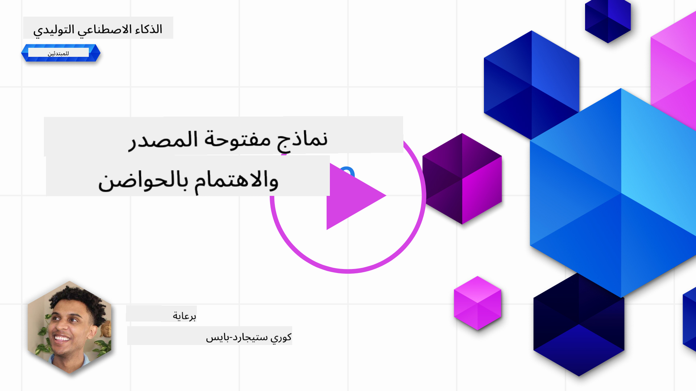
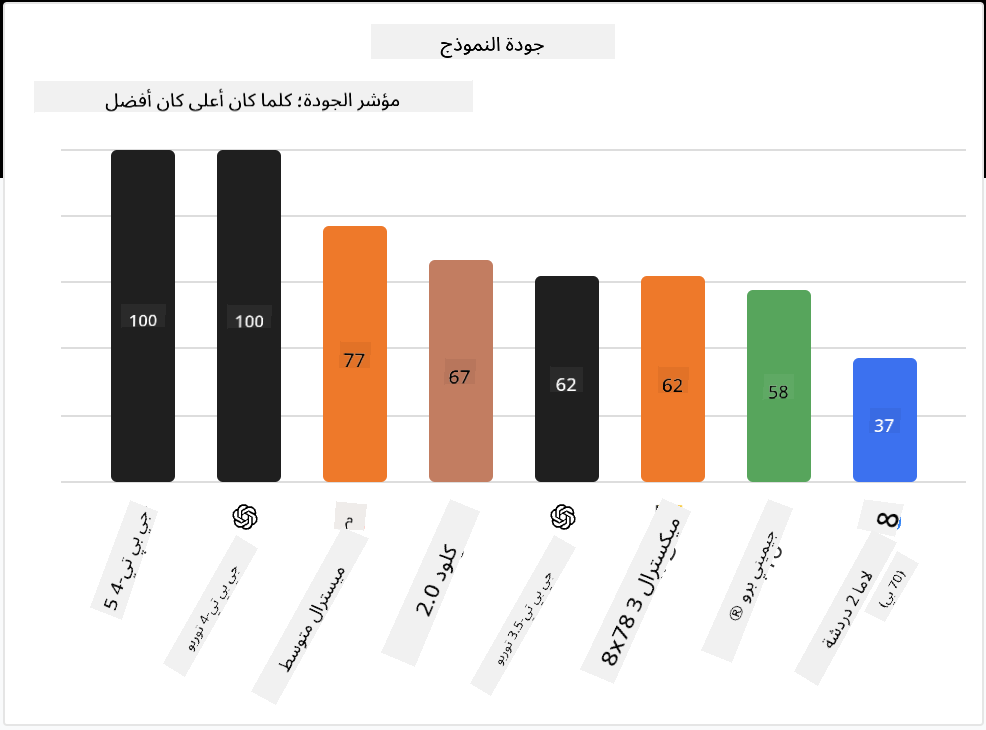

<!--
CO_OP_TRANSLATOR_METADATA:
{
  "original_hash": "a2a83aac52158c23161046cbd13faa2b",
  "translation_date": "2025-10-17T12:57:09+00:00",
  "source_file": "16-open-source-models/README.md",
  "language_code": "ar"
}
-->

## المقدمة

عالم النماذج مفتوحة المصدر مليء بالإثارة ويتطور باستمرار. تهدف هذه الدرس إلى تقديم نظرة معمقة على النماذج مفتوحة المصدر. إذا كنت تبحث عن معلومات حول كيفية مقارنة النماذج المملوكة بالنماذج مفتوحة المصدر، يمكنك زيارة درس ["استكشاف ومقارنة النماذج المختلفة"](../02-exploring-and-comparing-different-llms/README.md?WT.mc_id=academic-105485-koreyst). كما ستتناول هذه الدرس موضوع التخصيص الدقيق، ولكن يمكن العثور على شرح أكثر تفصيلًا في درس ["تخصيص النماذج اللغوية الكبيرة"](../18-fine-tuning/README.md?WT.mc_id=academic-105485-koreyst).

## أهداف التعلم

- فهم النماذج مفتوحة المصدر
- فهم فوائد العمل مع النماذج مفتوحة المصدر
- استكشاف النماذج المفتوحة المتاحة على Hugging Face وAzure AI Studio

## ما هي النماذج مفتوحة المصدر؟

لعبت البرمجيات مفتوحة المصدر دورًا حيويًا في نمو التكنولوجيا عبر مختلف المجالات. وقد حددت مبادرة المصدر المفتوح (OSI) [10 معايير للبرمجيات](https://web.archive.org/web/20241126001143/https://opensource.org/osd?WT.mc_id=academic-105485-koreyst) لتصنيفها كمفتوحة المصدر. يجب أن يتم مشاركة الكود المصدري بشكل مفتوح بموجب ترخيص معتمد من OSI.

على الرغم من أن تطوير النماذج اللغوية الكبيرة يشترك في بعض العناصر مع تطوير البرمجيات، إلا أن العملية ليست متطابقة تمامًا. وقد أثار هذا الكثير من النقاش في المجتمع حول تعريف المصدر المفتوح في سياق النماذج اللغوية الكبيرة. لكي يتماشى النموذج مع التعريف التقليدي للمصدر المفتوح، يجب أن تكون المعلومات التالية متاحة للجمهور:

- مجموعات البيانات المستخدمة لتدريب النموذج.
- أوزان النموذج الكاملة كجزء من التدريب.
- كود التقييم.
- كود التخصيص الدقيق.
- أوزان النموذج الكاملة ومقاييس التدريب.

حاليًا، هناك عدد قليل فقط من النماذج التي تتطابق مع هذه المعايير. نموذج [OLMo الذي أنشأه معهد ألين للذكاء الاصطناعي (AllenAI)](https://huggingface.co/allenai/OLMo-7B?WT.mc_id=academic-105485-koreyst) هو أحد النماذج التي تتماشى مع هذه الفئة.

في هذا الدرس، سنشير إلى النماذج باسم "النماذج المفتوحة" من الآن فصاعدًا لأنها قد لا تتطابق مع المعايير المذكورة أعلاه في وقت الكتابة.

## فوائد النماذج المفتوحة

**قابلة للتخصيص بشكل كبير** - نظرًا لأن النماذج المفتوحة يتم إصدارها مع معلومات تدريب مفصلة، يمكن للباحثين والمطورين تعديل تفاصيل النموذج الداخلية. يتيح ذلك إنشاء نماذج متخصصة للغاية يتم تخصيصها لمهمة معينة أو مجال دراسة معين. بعض الأمثلة على ذلك هي توليد الأكواد، العمليات الرياضية، وعلم الأحياء.

**التكلفة** - تكلفة استخدام ونشر هذه النماذج لكل رمز أقل من تكلفة النماذج المملوكة. عند بناء تطبيقات الذكاء الاصطناعي التوليدي، يجب النظر في الأداء مقابل السعر عند العمل مع هذه النماذج لحالتك.

المصدر: Artificial Analysis

**المرونة** - العمل مع النماذج المفتوحة يتيح لك المرونة في استخدام نماذج مختلفة أو دمجها. مثال على ذلك هو [مساعدي HuggingChat](https://huggingface.co/chat?WT.mc_id=academic-105485-koreyst) حيث يمكن للمستخدم اختيار النموذج المستخدم مباشرة في واجهة المستخدم:

## استكشاف النماذج المفتوحة المختلفة

### Llama 2

[LLama2](https://huggingface.co/meta-llama?WT.mc_id=academic-105485-koreyst)، الذي تم تطويره بواسطة Meta، هو نموذج مفتوح تم تحسينه لتطبيقات المحادثة. يعود ذلك إلى طريقة التخصيص الدقيق التي تضمنت كمية كبيرة من الحوارات وردود الفعل البشرية. باستخدام هذه الطريقة، ينتج النموذج نتائج أكثر توافقًا مع توقعات البشر مما يوفر تجربة مستخدم أفضل.

بعض الأمثلة على الإصدارات المخصصة من Llama تشمل [Llama الياباني](https://huggingface.co/elyza/ELYZA-japanese-Llama-2-7b?WT.mc_id=academic-105485-koreyst)، الذي يتخصص في اللغة اليابانية و[Llama Pro](https://huggingface.co/TencentARC/LLaMA-Pro-8B?WT.mc_id=academic-105485-koreyst)، الذي يعد نسخة محسنة من النموذج الأساسي.

### Mistral

[Mistral](https://huggingface.co/mistralai?WT.mc_id=academic-105485-koreyst) هو نموذج مفتوح يركز بشكل كبير على الأداء العالي والكفاءة. يستخدم نهج Mixture-of-Experts الذي يجمع مجموعة من النماذج المتخصصة في نظام واحد حيث يتم اختيار نماذج معينة بناءً على المدخلات. يجعل هذا الحساب أكثر فعالية حيث تتعامل النماذج فقط مع المدخلات التي تتخصص فيها.

بعض الأمثلة على الإصدارات المخصصة من Mistral تشمل [BioMistral](https://huggingface.co/BioMistral/BioMistral-7B?text=Mon+nom+est+Thomas+et+mon+principal?WT.mc_id=academic-105485-koreyst)، الذي يركز على المجال الطبي و[OpenMath Mistral](https://huggingface.co/nvidia/OpenMath-Mistral-7B-v0.1-hf?WT.mc_id=academic-105485-koreyst)، الذي يقوم بالعمليات الرياضية.

### Falcon

[Falcon](https://huggingface.co/tiiuae?WT.mc_id=academic-105485-koreyst) هو نموذج لغوي كبير تم إنشاؤه بواسطة معهد الابتكار التكنولوجي (**TII**). تم تدريب Falcon-40B على 40 مليار معلمة وقد أظهر أداءً أفضل من GPT-3 بميزانية حسابية أقل. يعود ذلك إلى استخدامه لخوارزمية FlashAttention والانتباه متعدد الاستعلامات الذي يمكنه تقليل متطلبات الذاكرة أثناء وقت الاستنتاج. مع هذا الوقت المخفض للاستنتاج، يعد Falcon-40B مناسبًا لتطبيقات المحادثة.

بعض الأمثلة على الإصدارات المخصصة من Falcon تشمل [OpenAssistant](https://huggingface.co/OpenAssistant/falcon-40b-sft-top1-560?WT.mc_id=academic-105485-koreyst)، مساعد مبني على نماذج مفتوحة و[GPT4ALL](https://huggingface.co/nomic-ai/gpt4all-falcon?WT.mc_id=academic-105485-koreyst)، الذي يقدم أداءً أعلى من النموذج الأساسي.

## كيفية الاختيار

لا توجد إجابة واحدة لاختيار النموذج المفتوح. مكان جيد للبدء هو استخدام ميزة التصفية حسب المهمة في Azure AI Studio. سيساعدك ذلك على فهم أنواع المهام التي تم تدريب النموذج عليها. كما تحتفظ Hugging Face بلوحة قيادة للنماذج اللغوية الكبيرة تعرض أفضل النماذج أداءً بناءً على مقاييس معينة.

عند النظر في مقارنة النماذج اللغوية الكبيرة عبر الأنواع المختلفة، فإن [Artificial Analysis](https://artificialanalysis.ai/?WT.mc_id=academic-105485-koreyst) هو مورد رائع آخر:

المصدر: Artificial Analysis

إذا كنت تعمل على حالة استخدام محددة، فإن البحث عن إصدارات مخصصة تركز على نفس المجال يمكن أن يكون فعالًا. تجربة نماذج مفتوحة متعددة لمعرفة كيف تؤدي وفقًا لتوقعاتك وتوقعات المستخدمين هي ممارسة جيدة أخرى.

## الخطوات التالية

أفضل جزء في النماذج المفتوحة هو أنه يمكنك البدء في العمل معها بسرعة كبيرة. تحقق من [كتالوج نماذج Azure AI Foundry](https://ai.azure.com?WT.mc_id=academic-105485-koreyst)، الذي يحتوي على مجموعة محددة من Hugging Face مع النماذج التي ناقشناها هنا.

## التعلم لا يتوقف هنا، استمر في الرحلة

بعد إكمال هذا الدرس، تحقق من [مجموعة تعلم الذكاء الاصطناعي التوليدي](https://aka.ms/genai-collection?WT.mc_id=academic-105485-koreyst) لمواصلة تعزيز معرفتك بالذكاء الاصطناعي التوليدي!

---

**إخلاء المسؤولية**:  
تم ترجمة هذا المستند باستخدام خدمة الترجمة بالذكاء الاصطناعي [Co-op Translator](https://github.com/Azure/co-op-translator). بينما نسعى لتحقيق الدقة، يرجى العلم أن الترجمات الآلية قد تحتوي على أخطاء أو عدم دقة. يجب اعتبار المستند الأصلي بلغته الأصلية المصدر الرسمي. للحصول على معلومات حاسمة، يُوصى بالترجمة البشرية الاحترافية. نحن غير مسؤولين عن أي سوء فهم أو تفسير خاطئ ينشأ عن استخدام هذه الترجمة.