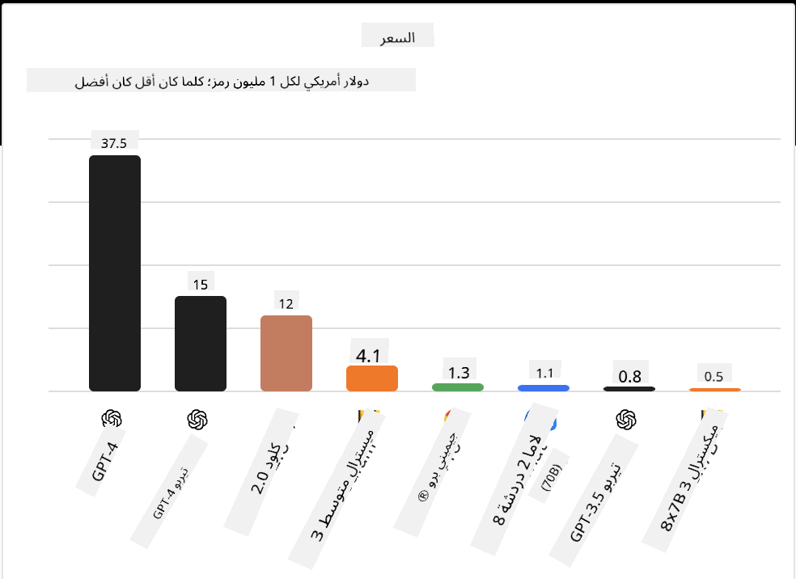
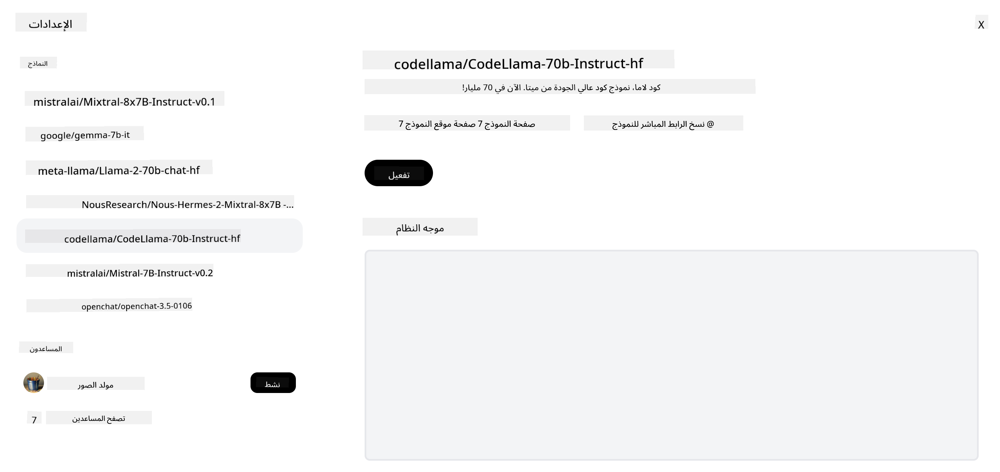

<!--
CO_OP_TRANSLATOR_METADATA:
{
  "original_hash": "0bba96e53ab841d99db731892a51fab8",
  "translation_date": "2025-05-20T06:46:59+00:00",
  "source_file": "16-open-source-models/README.md",
  "language_code": "ar"
}
-->

## المقدمة

عالم نماذج LLM مفتوحة المصدر مثير ويتطور باستمرار. تهدف هذه الدرس إلى تقديم نظرة معمقة على نماذج مفتوحة المصدر. إذا كنت تبحث عن معلومات حول كيفية مقارنة النماذج الخاصة بالنماذج مفتوحة المصدر، انتقل إلى درس ["استكشاف ومقارنة نماذج LLM المختلفة"](../02-exploring-and-comparing-different-llms/README.md?WT.mc_id=academic-105485-koreyst). ستغطي هذه الدرس أيضًا موضوع التخصيص، ولكن يمكن العثور على شرح أكثر تفصيلًا في درس ["تخصيص نماذج LLM"](../18-fine-tuning/README.md?WT.mc_id=academic-105485-koreyst).

## أهداف التعلم

- فهم نماذج مفتوحة المصدر
- فهم فوائد العمل مع نماذج مفتوحة المصدر
- استكشاف النماذج المفتوحة المتاحة على Hugging Face وAzure AI Studio

## ما هي نماذج مفتوحة المصدر؟

لعبت البرمجيات مفتوحة المصدر دورًا حاسمًا في نمو التكنولوجيا عبر مجالات مختلفة. وقد حددت مبادرة المصدر المفتوح (OSI) [10 معايير للبرمجيات](https://web.archive.org/web/20241126001143/https://opensource.org/osd?WT.mc_id=academic-105485-koreyst) لتصنيفها كمفتوحة المصدر. يجب مشاركة الشفرة المصدرية بشكل مفتوح تحت ترخيص معتمد من OSI.

بينما يتشابه تطوير نماذج LLM مع تطوير البرمجيات، إلا أن العملية ليست نفسها تمامًا. وقد أدى ذلك إلى الكثير من النقاش في المجتمع حول تعريف المصدر المفتوح في سياق نماذج LLM. لكي يتماشى النموذج مع التعريف التقليدي للمصدر المفتوح، يجب أن تكون المعلومات التالية متاحة للجمهور:

- مجموعات البيانات المستخدمة لتدريب النموذج.
- أوزان النموذج الكاملة كجزء من التدريب.
- رمز التقييم.
- رمز التخصيص.
- أوزان النموذج الكاملة ومقاييس التدريب.

حاليًا، هناك عدد قليل فقط من النماذج التي تطابق هذه المعايير. النموذج [OLMo الذي أنشأه معهد Allen للذكاء الاصطناعي (AllenAI)](https://huggingface.co/allenai/OLMo-7B?WT.mc_id=academic-105485-koreyst) هو واحد من هذه الفئة.

لهذا الدرس، سنشير إلى النماذج على أنها "نماذج مفتوحة" للمضي قدمًا حيث قد لا تطابق المعايير المذكورة أعلاه في وقت الكتابة.

## فوائد النماذج المفتوحة

**قابلة للتخصيص بشكل كبير** - نظرًا لأن النماذج المفتوحة تُصدر مع معلومات تدريب مفصلة، يمكن للباحثين والمطورين تعديل الأجزاء الداخلية للنموذج. هذا يتيح إنشاء نماذج متخصصة للغاية يتم تخصيصها لمهمة محددة أو مجال دراسي. بعض الأمثلة على ذلك هي توليد الشفرات، العمليات الرياضية والبيولوجيا.

**التكلفة** - تكلفة كل رمز لاستخدام ونشر هذه النماذج أقل من تكلفة النماذج الخاصة. عند بناء تطبيقات الذكاء الاصطناعي التوليدي، يجب النظر إلى الأداء مقابل السعر عند العمل مع هذه النماذج على حالتك.

المصدر: التحليل الاصطناعي

**المرونة** - العمل مع النماذج المفتوحة يمكنك من أن تكون مرنًا من حيث استخدام نماذج مختلفة أو دمجها. مثال على ذلك هو [مساعدي HuggingChat](https://huggingface.co/chat?WT.mc_id=academic-105485-koreyst) حيث يمكن للمستخدم اختيار النموذج المستخدم مباشرة في واجهة المستخدم:

## استكشاف نماذج مفتوحة مختلفة

### Llama 2

[LLama2](https://huggingface.co/meta-llama?WT.mc_id=academic-105485-koreyst)، الذي طورته Meta هو نموذج مفتوح محسن للتطبيقات القائمة على المحادثات. وذلك بسبب طريقة التخصيص الخاصة به، التي تضمنت كمية كبيرة من الحوارات وردود الفعل البشرية. باستخدام هذه الطريقة، ينتج النموذج نتائج أكثر توافقًا مع توقعات البشر مما يوفر تجربة مستخدم أفضل.

بعض الأمثلة على إصدارات Llama المحسنة تشمل [Llama الياباني](https://huggingface.co/elyza/ELYZA-japanese-Llama-2-7b?WT.mc_id=academic-105485-koreyst)، الذي يتخصص في اللغة اليابانية و[Llama Pro](https://huggingface.co/TencentARC/LLaMA-Pro-8B?WT.mc_id=academic-105485-koreyst)، وهو نسخة محسنة من النموذج الأساسي.

### Mistral

[Mistral](https://huggingface.co/mistralai?WT.mc_id=academic-105485-koreyst) هو نموذج مفتوح يركز بشكل كبير على الأداء العالي والكفاءة. يستخدم نهج مزيج من الخبراء الذي يجمع مجموعة من النماذج الخبيرة المتخصصة في نظام واحد حيث يتم اختيار نماذج معينة للاستخدام بناءً على المدخلات. هذا يجعل الحساب أكثر فعالية حيث تعالج النماذج فقط المدخلات التي تتخصص فيها.

بعض الأمثلة على إصدارات Mistral المحسنة تشمل [BioMistral](https://huggingface.co/BioMistral/BioMistral-7B?text=Mon+nom+est+Thomas+et+mon+principal?WT.mc_id=academic-105485-koreyst)، الذي يركز على المجال الطبي و[OpenMath Mistral](https://huggingface.co/nvidia/OpenMath-Mistral-7B-v0.1-hf?WT.mc_id=academic-105485-koreyst)، الذي يقوم بإجراء الحسابات الرياضية.

### Falcon

[Falcon](https://huggingface.co/tiiuae?WT.mc_id=academic-105485-koreyst) هو نموذج LLM أنشأه معهد الابتكار التكنولوجي (**TII**). تم تدريب Falcon-40B على 40 مليار معلمة وقد أظهر أداءً أفضل من GPT-3 بميزانية حساب أقل. ويرجع ذلك إلى استخدامه لخوارزمية FlashAttention والانتباه متعدد الاستعلامات التي تمكنه من تقليل متطلبات الذاكرة في وقت الاستنتاج. مع هذا الوقت المستقطع للاستنتاج، يكون Falcon-40B مناسبًا لتطبيقات المحادثة.

بعض الأمثلة على إصدارات Falcon المحسنة تشمل [OpenAssistant](https://huggingface.co/OpenAssistant/falcon-40b-sft-top1-560?WT.mc_id=academic-105485-koreyst)، وهو مساعد مبني على نماذج مفتوحة و[GPT4ALL](https://huggingface.co/nomic-ai/gpt4all-falcon?WT.mc_id=academic-105485-koreyst)، الذي يوفر أداءً أعلى من النموذج الأساسي.

## كيفية الاختيار

لا يوجد جواب واحد لاختيار النموذج المفتوح. مكان جيد للبدء هو استخدام ميزة تصفية حسب المهمة في Azure AI Studio. سيساعدك ذلك على فهم أنواع المهام التي تم تدريب النموذج عليها. كما يحافظ Hugging Face على لوحة قيادة LLM التي تعرض لك أفضل النماذج أداءً بناءً على مقاييس معينة.

عند النظر إلى مقارنة نماذج LLM عبر الأنواع المختلفة، [التحليل الاصطناعي](https://artificialanalysis.ai/?WT.mc_id=academic-105485-koreyst) هو مورد رائع آخر:

المصدر: التحليل الاصطناعي

إذا كنت تعمل على حالة استخدام محددة، فإن البحث عن إصدارات محسنة تركز على نفس المجال يمكن أن يكون فعالًا. تجربة نماذج مفتوحة متعددة لرؤية كيف تؤدي وفقًا لتوقعاتك وتوقعات مستخدميك هي ممارسة جيدة أخرى.

## الخطوات التالية

أفضل جزء في النماذج المفتوحة هو أنك يمكنك البدء في العمل معها بسرعة كبيرة. تحقق من [كتالوج نماذج Azure AI Studio](https://ai.azure.com?WT.mc_id=academic-105485-koreyst)، الذي يحتوي على مجموعة خاصة من Hugging Face مع هذه النماذج التي ناقشناها هنا.

## التعلم لا يتوقف هنا، استمر في الرحلة

بعد إكمال هذا الدرس، تحقق من [مجموعة تعلم الذكاء الاصطناعي التوليدي](https://aka.ms/genai-collection?WT.mc_id=academic-105485-koreyst) لتستمر في رفع مستوى معرفتك بالذكاء الاصطناعي التوليدي!

**إخلاء المسؤولية**:  
تم ترجمة هذه الوثيقة باستخدام خدمة الترجمة بالذكاء الاصطناعي [Co-op Translator](https://github.com/Azure/co-op-translator). بينما نسعى لتحقيق الدقة، يرجى العلم أن الترجمات الآلية قد تحتوي على أخطاء أو عدم دقة. يجب اعتبار الوثيقة الأصلية بلغتها الأم المصدر الموثوق. للحصول على معلومات حيوية، يُوصى بالترجمة البشرية المهنية. نحن غير مسؤولين عن أي سوء فهم أو تفسير خاطئ ناتج عن استخدام هذه الترجمة.