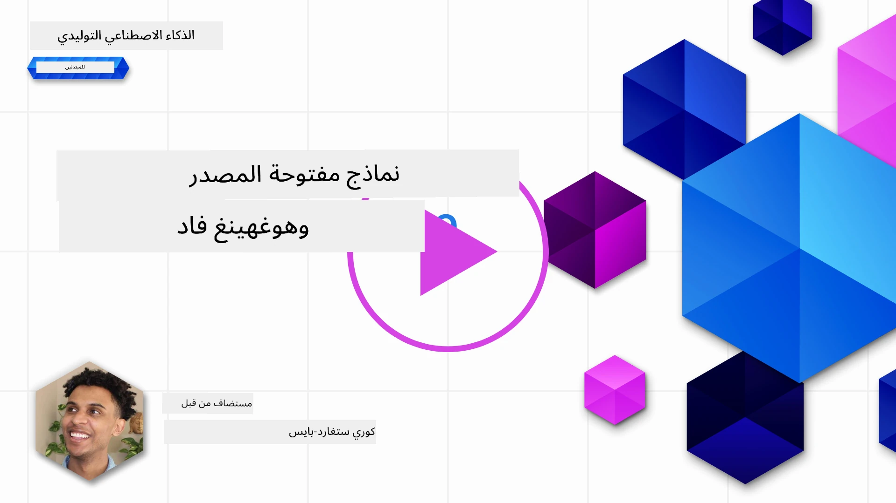
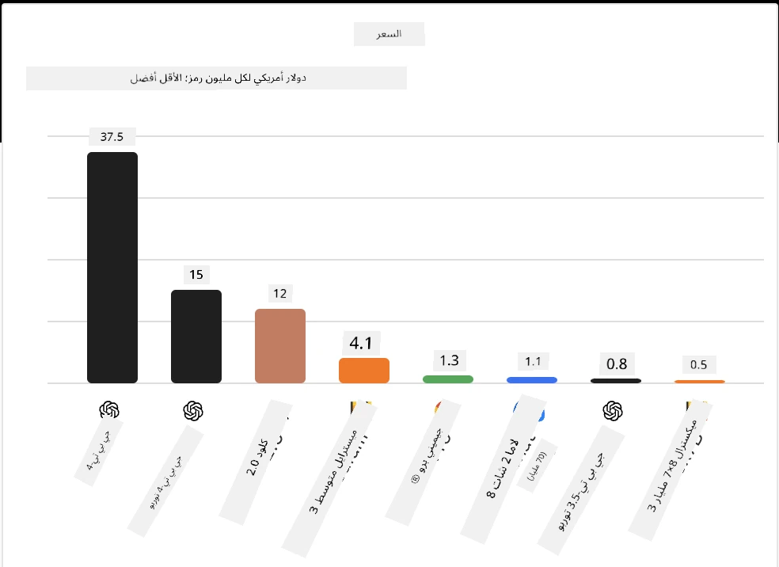
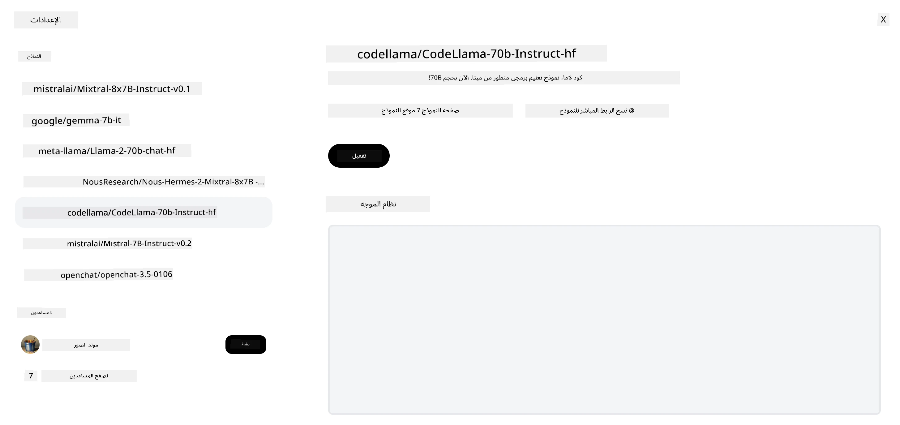
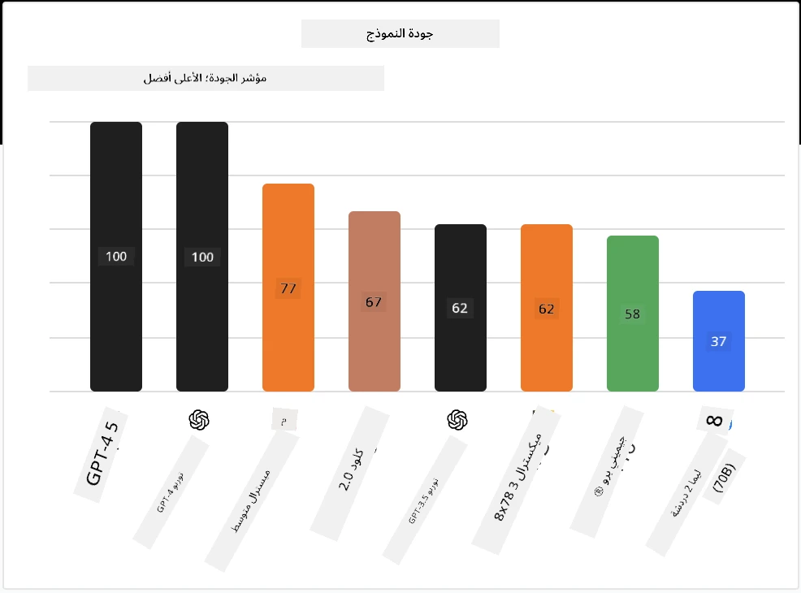

## المقدمة

عالم نماذج اللغة الكبيرة المفتوحة المصدر مثير ومتطور باستمرار. تهدف هذه الدرس إلى تقديم نظرة متعمقة على النماذج المفتوحة المصدر. إذا كنت تبحث عن معلومات حول كيفية مقارنة النماذج المملوكة بالنماذج المفتوحة المصدر، فانتقل إلى درس ["استكشاف ومقارنة نماذج LLM المختلفة"](../02-exploring-and-comparing-different-llms/README.md?WT.mc_id=academic-105485-koreyst). كما سيغطي هذا الدرس موضوع الضبط الدقيق، ولكن يمكن العثور على شرح أكثر تفصيلاً في درس ["الضبط الدقيق لنماذج اللغة الكبيرة"](../18-fine-tuning/README.md?WT.mc_id=academic-105485-koreyst).

## أهداف التعلم

- اكتساب فهم للنماذج المفتوحة المصدر
- فهم فوائد العمل مع النماذج المفتوحة المصدر
- استكشاف النماذج المفتوحة المتوفرة على Hugging Face وكتالوج نماذج Microsoft Foundry

## ما هي النماذج المفتوحة المصدر؟

كان للبرمجيات المفتوحة المصدر دور حاسم في نمو التكنولوجيا عبر مجالات مختلفة. قامت مبادرة المصدر المفتوح (OSI) بتحديد [10 معايير للبرمجيات](https://web.archive.org/web/20241126001143/https://opensource.org/osd?WT.mc_id=academic-105485-koreyst) لتصنيفها كمصدر مفتوح. يجب أن يتم مشاركة شفرة المصدر بشكل مفتوح بموجب ترخيص معتمد من OSI.

بينما يتشارك تطوير نماذج اللغة الكبيرة عناصر مشابهة لتطوير البرمجيات، فإن العملية ليست متطابقة بالضبط. أدى هذا إلى الكثير من النقاش في المجتمع حول تعريف المصدر المفتوح في سياق نماذج اللغة الكبيرة. لكي يتماشى النموذج مع التعريف التقليدي للمصدر المفتوح، يجب أن تكون المعلومات التالية متاحة علنًا:

- مجموعات البيانات المستخدمة في تدريب النموذج.
- أوزان النموذج الكاملة كجزء من التدريب.
- كود التقييم.
- كود الضبط الدقيق.
- أوزان النموذج الكاملة ومقاييس التدريب.

هناك حاليًا عدد قليل فقط من النماذج التي تطابق هذه المعايير. يعد [نموذج OLMo الذي أنشأه معهد ألين للذكاء الاصطناعي (AllenAI)](https://huggingface.co/allenai/OLMo-7B?WT.mc_id=academic-105485-koreyst) نموذجًا يتناسب مع هذه الفئة.

في هذا الدرس، سوف نشير إلى النماذج باعتبارها "نماذج مفتوحة" لأنّها قد لا تطابق المعايير المذكورة آنفًا في وقت الكتابة.

## فوائد النماذج المفتوحة

**قابلة للتخصيص بدرجة عالية** - نظرًا لأن النماذج المفتوحة تُصدر مع معلومات تدريب مفصلة، يمكن للباحثين والمطورين تعديل مكونات النموذج الداخلية. هذا يمكّن من إنشاء نماذج متخصصة للغاية يتم ضبطها بشكل دقيق لمهمة أو مجال دراسة معين. بعض الأمثلة على ذلك هي توليد الشيفرة، العمليات الرياضية وعلم الأحياء.

**التكلفة** - التكلفة لكل رمز لاستخدام ونشر هذه النماذج أقل من النماذج المملوكة. عند بناء تطبيقات الذكاء الاصطناعي التوليدي، يجب النظر في الأداء مقابل السعر عند العمل مع هذه النماذج على حالة الاستخدام الخاصة بك.

المصدر: Artificial Analysis

**المرونة** - العمل مع النماذج المفتوحة يتيح لك المرونة من حيث استخدام نماذج مختلفة أو دمجها. مثال على ذلك هو [مساعدو HuggingChat](https://huggingface.co/chat?WT.mc_id=academic-105485-koreyst) حيث يمكن للمستخدم اختيار النموذج المستخدم مباشرة في واجهة المستخدم:

## استكشاف النماذج المفتوحة المختلفة

### لاما 2

[LLama2](https://huggingface.co/meta-llama?WT.mc_id=academic-105485-koreyst)، الذي طورته Meta هو نموذج مفتوح محسن لتطبيقات الدردشة. ويرجع ذلك إلى طريقة الضبط الدقيق التي شملت كمية كبيرة من الحوارات وردود الفعل البشرية. باستخدام هذه الطريقة، ينتج النموذج نتائج أكثر توافقًا مع توقعات البشر مما يوفر تجربة مستخدم أفضل.

بعض الأمثلة على النسخ المضبوطة من Llama تشمل [Japanese Llama](https://huggingface.co/elyza/ELYZA-japanese-Llama-2-7b?WT.mc_id=academic-105485-koreyst)، التي تتخصص في اليابانية و [Llama Pro](https://huggingface.co/TencentARC/LLaMA-Pro-8B?WT.mc_id=academic-105485-koreyst)، وهي نسخة محسّنة من النموذج الأساسي.

### ميسترال

[Mistral](https://huggingface.co/mistralai?WT.mc_id=academic-105485-koreyst) هو نموذج مفتوح يركز بشكل قوي على الأداء العالي والكفاءة. يستخدم منهجية مزيج الخبراء التي تجمع مجموعة من النماذج المتخصصة في نظام واحد، حيث يتم اختيار نماذج معينة للاستخدام اعتمادًا على المدخلات. هذا يجعل العمليات الحسابية أكثر فعالية لأن النماذج تتعامل فقط مع المدخلات التي تتخصص بها.

بعض الأمثلة على النسخ المضبوطة من Mistral تشمل [BioMistral](https://huggingface.co/BioMistral/BioMistral-7B?text=Mon+nom+est+Thomas+et+mon+principal?WT.mc_id=academic-105485-koreyst)، التي تركز على المجال الطبي و [OpenMath Mistral](https://huggingface.co/nvidia/OpenMath-Mistral-7B-v0.1-hf?WT.mc_id=academic-105485-koreyst)، التي تؤدي الحسابات الرياضية.

### فالكون

[Falcon](https://huggingface.co/tiiuae?WT.mc_id=academic-105485-koreyst) هو نموذج لغة كبيرة أنشأه معهد الابتكار التكنولوجي (**TII**). تم تدريب Falcon-40B على 40 مليار معلمة، وقد أظهر أداءً أفضل من GPT-3 مع ميزانية حسابية أقل. ويرجع ذلك إلى استخدامه خوارزمية FlashAttention واهتمام متعدد الاستعلامات التي تمكّنه من تقليل متطلبات الذاكرة أثناء الاستدلال. مع هذا الوقت المخفض للاستدلال، يعد Falcon-40B مناسبًا لتطبيقات الدردشة.

بعض الأمثلة على النسخ المضبوطة من Falcon هي [OpenAssistant](https://huggingface.co/OpenAssistant/falcon-40b-sft-top1-560?WT.mc_id=academic-105485-koreyst)، مساعد مبني على نماذج مفتوحة و[GPT4ALL](https://huggingface.co/nomic-ai/gpt4all-falcon?WT.mc_id=academic-105485-koreyst)، الذي يقدم أداءً أعلى من النموذج الأساسي.

## كيفية الاختيار

لا يوجد جواب واحد لاختيار نموذج مفتوح. مكان جيد للبدء هو استخدام ميزة تصفية المهام في كتالوج نماذج Microsoft Foundry. هذا سيساعدك على فهم أنواع المهام التي تم تدريب النموذج عليها. كما تحتفظ Hugging Face بلجنة قيادة LLM تُظهر لك أفضل النماذج أداءً بناءً على مقاييس معينة.

عند الرغبة في مقارنة نماذج LLM بين الأنواع المختلفة، [Artificial Analysis](https://artificialanalysis.ai/?WT.mc_id=academic-105485-koreyst) هو مصدر رائع آخر:

المصدر: Artificial Analysis

إذا كنت تعمل على حالة استخدام محددة، فإن البحث عن نسخ مضبوطة تركز على نفس المجال يمكن أن يكون فعالًا. التجربة مع نماذج مفتوحة متعددة لملاحظة كيفية أدائها وفقًا لتوقعاتك وتوقعات المستخدمين هي ممارسة جيدة أخرى

## الخطوات التالية

أفضل شيء في النماذج المفتوحة هو أنه يمكنك البدء في العمل معها بسرعة كبيرة. تحقق من [كتالوج نماذج Microsoft Foundry](https://ai.azure.com?WT.mc_id=academic-105485-koreyst)، الذي يتضمن مجموعة محددة من Hugging Face تحتوي على هذه النماذج التي ناقشناها هنا.

## التعلم لا يتوقف هنا، استمر في الرحلة

بعد إكمال هذا الدرس، تحقق من [مجموعة تعلم الذكاء الاصطناعي التوليدي](https://aka.ms/genai-collection?WT.mc_id=academic-105485-koreyst) لمواصلة رفع مستوى معرفتك في الذكاء الاصطناعي التوليدي!

---

<!-- CO-OP TRANSLATOR DISCLAIMER START -->
**تنويه**:
تمت ترجمة هذا المستند باستخدام خدمة الترجمة بالذكاء الاصطناعي [Co-op Translator](https://github.com/Azure/co-op-translator). بينما نسعى للدقة، يرجى العلم أن الترجمات الآلية قد تحتوي على أخطاء أو عدم دقة. يجب اعتبار المستند الأصلي بلغته الأصلية المصدر الرسمي والمعتمد. للمعلومات الهامة، يُنصح بالاستعانة بترجمة بشرية محترفة. نحن غير مسؤولين عن أي سوء فهم أو تفسير ناتج عن استخدام هذه الترجمة.
<!-- CO-OP TRANSLATOR DISCLAIMER END -->