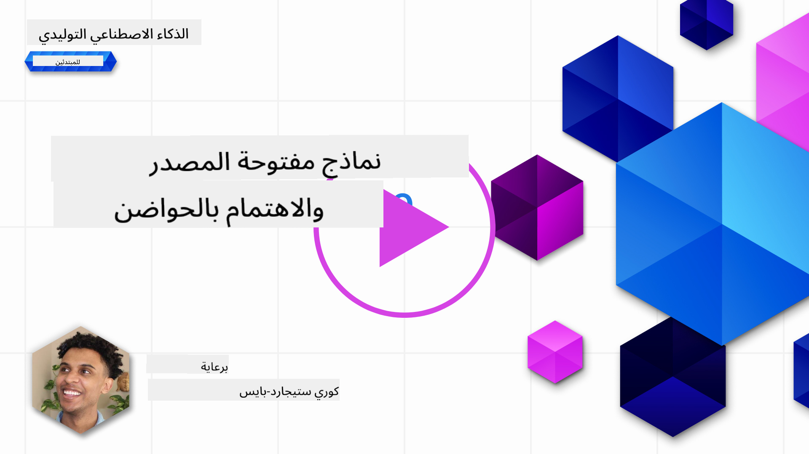
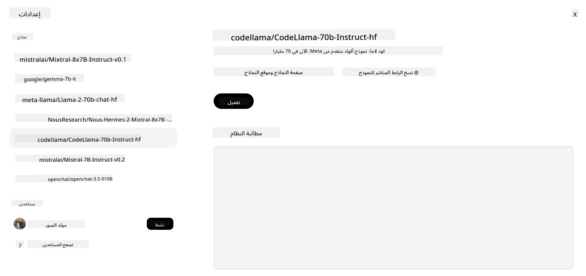

<!--
CO_OP_TRANSLATOR_METADATA:
{
  "original_hash": "0bba96e53ab841d99db731892a51fab8",
  "translation_date": "2025-06-25T23:48:37+00:00",
  "source_file": "16-open-source-models/README.md",
  "language_code": "ar"
}
-->

## مقدمة

عالم نماذج اللغة الكبيرة (LLMs) مفتوحة المصدر مثير ومليء بالتطورات المستمرة. تهدف هذه الدرس إلى تقديم نظرة متعمقة على نماذج المصدر المفتوح. إذا كنت تبحث عن معلومات حول كيفية مقارنة النماذج الخاصة بالنماذج المفتوحة المصدر، انتقل إلى درس ["استكشاف ومقارنة النماذج المختلفة"](../02-exploring-and-comparing-different-llms/README.md?WT.mc_id=academic-105485-koreyst). سيتناول هذا الدرس أيضًا موضوع التخصيص الدقيق، ولكن يمكن العثور على شرح أكثر تفصيلًا في درس ["تخصيص نماذج اللغة الكبيرة"](../18-fine-tuning/README.md?WT.mc_id=academic-105485-koreyst).

## أهداف التعلم

- فهم نماذج المصدر المفتوح
- فهم فوائد العمل مع نماذج المصدر المفتوح
- استكشاف النماذج المفتوحة المتاحة على Hugging Face وAzure AI Studio

## ما هي نماذج المصدر المفتوح؟

لعبت برامج المصدر المفتوح دورًا حاسمًا في نمو التكنولوجيا عبر مجالات مختلفة. حددت مبادرة المصدر المفتوح (OSI) [10 معايير للبرمجيات](https://web.archive.org/web/20241126001143/https://opensource.org/osd?WT.mc_id=academic-105485-koreyst) ليتم تصنيفها كمصدر مفتوح. يجب أن يتم مشاركة الكود المصدري علنًا بموجب ترخيص معتمد من OSI.

على الرغم من أن تطوير نماذج اللغة الكبيرة يشبه إلى حد ما تطوير البرمجيات، إلا أن العملية ليست متطابقة تمامًا. وقد أثار ذلك الكثير من النقاش في المجتمع حول تعريف المصدر المفتوح في سياق نماذج اللغة الكبيرة. لكي يتوافق النموذج مع التعريف التقليدي للمصدر المفتوح، يجب أن تكون المعلومات التالية متاحة للجمهور:

- مجموعات البيانات المستخدمة لتدريب النموذج.
- الأوزان الكاملة للنموذج كجزء من التدريب.
- كود التقييم.
- كود التخصيص الدقيق.
- الأوزان الكاملة للنموذج وقياسات التدريب.

حاليًا، هناك عدد قليل فقط من النماذج التي تتطابق مع هذه المعايير. نموذج [OLMo الذي تم إنشاؤه بواسطة معهد ألين للذكاء الاصطناعي (AllenAI)](https://huggingface.co/allenai/OLMo-7B?WT.mc_id=academic-105485-koreyst) هو واحد من هذه الفئة.

لهذا الدرس، سنشير إلى النماذج على أنها "نماذج مفتوحة" مستقبلاً لأنها قد لا تتطابق مع المعايير المذكورة في وقت الكتابة.

## فوائد النماذج المفتوحة

**قابلة للتخصيص بشكل كبير** - نظرًا لأن النماذج المفتوحة تُصدر مع معلومات تدريب مفصلة، يمكن للباحثين والمطورين تعديل تفاصيل النموذج. هذا يمكن من إنشاء نماذج متخصصة للغاية تم تخصيصها لمهمة أو مجال دراسة معين. بعض الأمثلة على ذلك هي توليد الكود، العمليات الرياضية والبيولوجيا.

**التكلفة** - تكلفة استخدام ونشر هذه النماذج لكل رمز أقل من تلك النماذج الخاصة. عند بناء تطبيقات الذكاء الاصطناعي التوليدي، يجب النظر في الأداء مقابل السعر عند العمل مع هذه النماذج في حالتك.

المصدر: التحليل الاصطناعي

**المرونة** - العمل مع النماذج المفتوحة يتيح لك أن تكون مرنًا فيما يتعلق باستخدام نماذج مختلفة أو دمجها. مثال على ذلك هو [مساعدي HuggingChat](https://huggingface.co/chat?WT.mc_id=academic-105485-koreyst) حيث يمكن للمستخدم اختيار النموذج المستخدم مباشرة في واجهة المستخدم:

## استكشاف النماذج المفتوحة المختلفة

### Llama 2

[LLama2](https://huggingface.co/meta-llama?WT.mc_id=academic-105485-koreyst)، الذي تم تطويره بواسطة Meta هو نموذج مفتوح مُحسّن لتطبيقات الدردشة. هذا بسبب طريقة التخصيص الدقيق الخاصة به، والتي تضمنت كمية كبيرة من الحوار والتغذية الراجعة البشرية. باستخدام هذه الطريقة، ينتج النموذج نتائج أكثر توافقًا مع توقعات البشر مما يوفر تجربة مستخدم أفضل.

بعض الأمثلة على النسخ المخصصة الدقيقة من Llama تشمل [Llama الياباني](https://huggingface.co/elyza/ELYZA-japanese-Llama-2-7b?WT.mc_id=academic-105485-koreyst)، الذي يتخصص في اليابانية و[Llama Pro](https://huggingface.co/TencentARC/LLaMA-Pro-8B?WT.mc_id=academic-105485-koreyst)، الذي يعد نسخة محسنة من النموذج الأساسي.

### Mistral

[Mistral](https://huggingface.co/mistralai?WT.mc_id=academic-105485-koreyst) هو نموذج مفتوح يركز بشكل كبير على الأداء العالي والكفاءة. يستخدم نهج خليط الخبراء الذي يجمع مجموعة من نماذج الخبراء المتخصصة في نظام واحد حيث يتم اختيار نماذج معينة للاستخدام بناءً على الإدخال. هذا يجعل الحساب أكثر فعالية حيث تتعامل النماذج فقط مع المدخلات التي تخصصت فيها.

بعض الأمثلة على النسخ المخصصة الدقيقة من Mistral تشمل [BioMistral](https://huggingface.co/BioMistral/BioMistral-7B?text=Mon+nom+est+Thomas+et+mon+principal?WT.mc_id=academic-105485-koreyst)، الذي يركز على المجال الطبي و[OpenMath Mistral](https://huggingface.co/nvidia/OpenMath-Mistral-7B-v0.1-hf?WT.mc_id=academic-105485-koreyst)، الذي يؤدي العمليات الحسابية الرياضية.

### Falcon

[Falcon](https://huggingface.co/tiiuae?WT.mc_id=academic-105485-koreyst) هو نموذج لغة كبيرة تم إنشاؤه بواسطة معهد الابتكار التكنولوجي (**TII**). تم تدريب Falcon-40B على 40 مليار معلمة والتي أظهرت أداءً أفضل من GPT-3 بميزانية حسابية أقل. هذا بسبب استخدامه لخوارزمية FlashAttention والانتباه متعدد الاستعلامات الذي يمكنه من تقليل متطلبات الذاكرة في وقت الاستدلال. مع هذا الوقت الاستدلال المخفض، يعد Falcon-40B مناسبًا لتطبيقات الدردشة.

بعض الأمثلة على النسخ المخصصة الدقيقة من Falcon هي [OpenAssistant](https://huggingface.co/OpenAssistant/falcon-40b-sft-top1-560?WT.mc_id=academic-105485-koreyst)، مساعد مبني على نماذج مفتوحة و[GPT4ALL](https://huggingface.co/nomic-ai/gpt4all-falcon?WT.mc_id=academic-105485-koreyst)، الذي يقدم أداءً أعلى من النموذج الأساسي.

## كيفية الاختيار

لا توجد إجابة واحدة لاختيار نموذج مفتوح. مكان جيد للبدء هو استخدام ميزة التصفية حسب المهمة في Azure AI Studio. سيساعدك هذا في فهم أنواع المهام التي تم تدريب النموذج عليها. تحافظ Hugging Face أيضًا على لوحة المتصدرين لنماذج اللغة الكبيرة التي تظهر لك أفضل النماذج أداءً بناءً على معايير معينة.

عند النظر إلى مقارنة نماذج اللغة الكبيرة عبر الأنواع المختلفة، [التحليل الاصطناعي](https://artificialanalysis.ai/?WT.mc_id=academic-105485-koreyst) هو مورد رائع آخر:

المصدر: التحليل الاصطناعي

إذا كنت تعمل على حالة استخدام محددة، فإن البحث عن النسخ المخصصة الدقيقة التي تركز على نفس المجال يمكن أن يكون فعالًا. تجربة نماذج مفتوحة متعددة لمعرفة كيفية أدائها وفقًا لتوقعاتك وتوقعات مستخدميك هي ممارسة جيدة أخرى.

## الخطوات التالية

أفضل جزء في النماذج المفتوحة هو أنه يمكنك البدء في العمل معها بسرعة كبيرة. تحقق من [كتالوج نماذج Azure AI Studio](https://ai.azure.com?WT.mc_id=academic-105485-koreyst)، الذي يتميز بمجموعة محددة من Hugging Face مع النماذج التي ناقشناها هنا.

## التعلم لا يتوقف هنا، استمر في الرحلة

بعد الانتهاء من هذا الدرس، تحقق من [مجموعة تعلم الذكاء الاصطناعي التوليدي](https://aka.ms/genai-collection?WT.mc_id=academic-105485-koreyst) لمواصلة تعزيز معرفتك بالذكاء الاصطناعي التوليدي!

**إخلاء المسؤولية**:  
تمت ترجمة هذا المستند باستخدام خدمة الترجمة بالذكاء الاصطناعي [Co-op Translator](https://github.com/Azure/co-op-translator). بينما نسعى لتحقيق الدقة، يرجى العلم أن الترجمات الآلية قد تحتوي على أخطاء أو عدم دقة. يجب اعتبار المستند الأصلي بلغته الأصلية المصدر الموثوق به. للمعلومات الحساسة، يوصى بالترجمة البشرية الاحترافية. نحن غير مسؤولين عن أي سوء فهم أو تفسير خاطئ ينشأ عن استخدام هذه الترجمة.