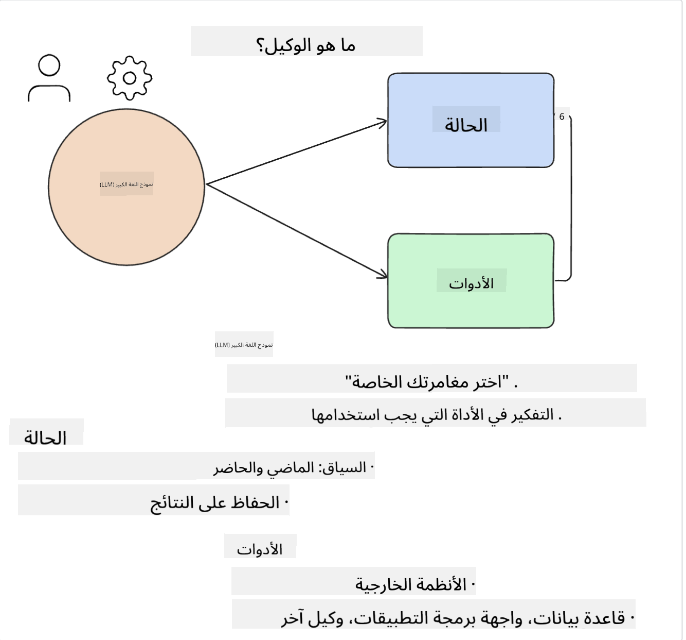
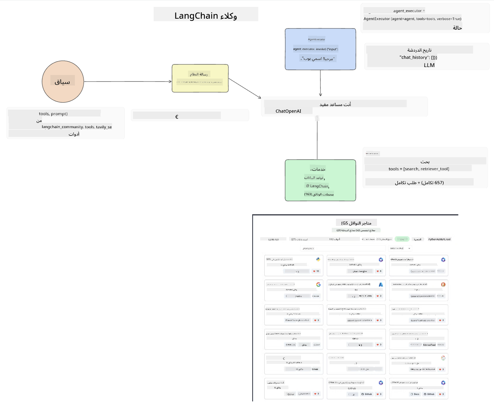
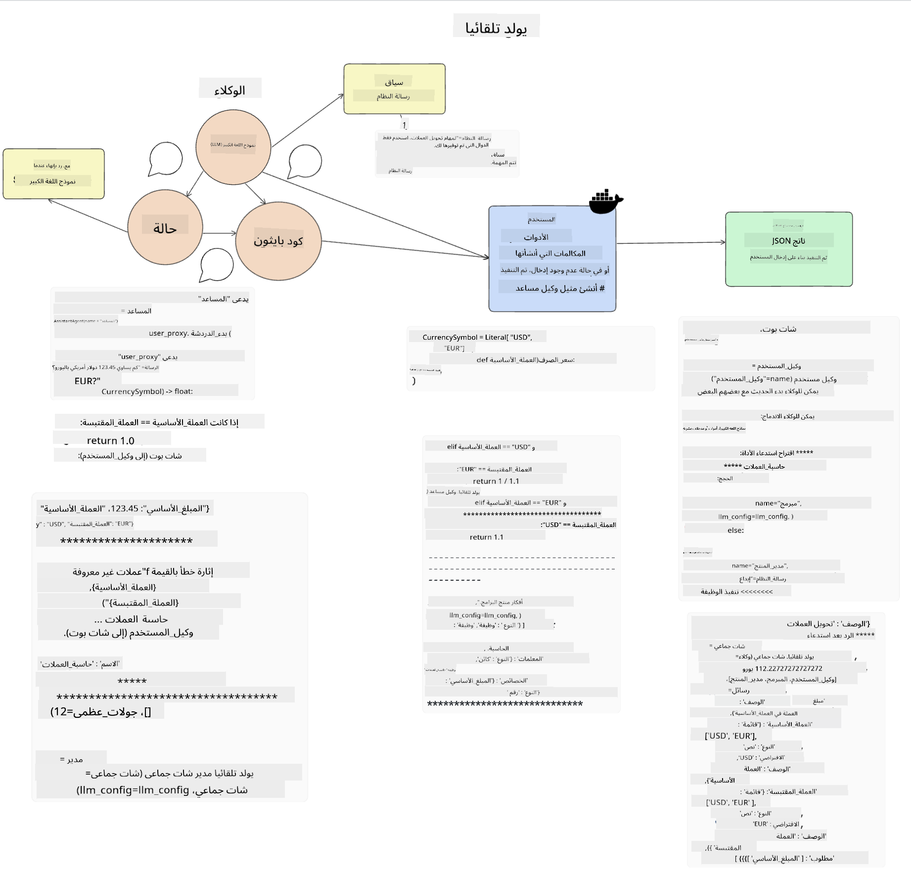
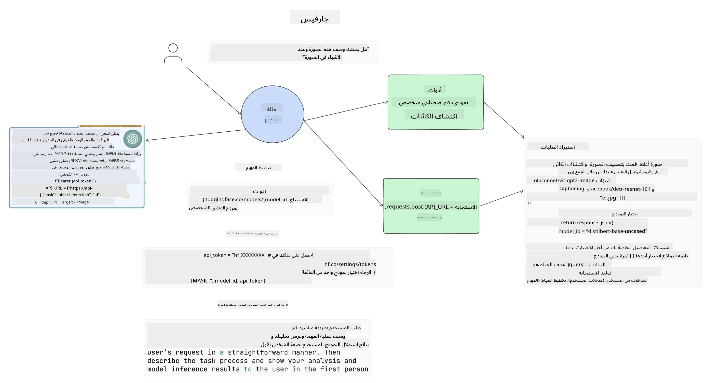

<!--
CO_OP_TRANSLATOR_METADATA:
{
  "original_hash": "11f03c81f190d9cbafd0f977dcbede6c",
  "translation_date": "2025-05-20T07:08:20+00:00",
  "source_file": "17-ai-agents/README.md",
  "language_code": "ar"
}
-->
[](https://aka.ms/gen-ai-lesson17-gh?WT.mc_id=academic-105485-koreyst)

## مقدمة

تمثل الوكلاء الذكاء الاصطناعي تطورًا مثيرًا في الذكاء الاصطناعي التوليدي، حيث تمكّن النماذج اللغوية الكبيرة (LLMs) من التحول من مساعدين إلى وكلاء قادرين على اتخاذ الإجراءات. تتيح أطر عمل وكلاء الذكاء الاصطناعي للمطورين إنشاء تطبيقات تمنح النماذج اللغوية الكبيرة الوصول إلى الأدوات وإدارة الحالة. كما تعزز هذه الأطر الرؤية، مما يسمح للمستخدمين والمطورين بمراقبة الإجراءات المخططة من قبل النماذج اللغوية الكبيرة، وبالتالي تحسين إدارة التجربة.

ستغطي الدرس المجالات التالية:

- فهم ما هو وكيل الذكاء الاصطناعي - ما هو بالضبط وكيل الذكاء الاصطناعي؟
- استكشاف أربعة أطر عمل مختلفة لوكلاء الذكاء الاصطناعي - ما الذي يجعلها فريدة؟
- تطبيق هذه الوكلاء على حالات استخدام مختلفة - متى يجب علينا استخدام وكلاء الذكاء الاصطناعي؟

## أهداف التعلم

بعد الانتهاء من هذا الدرس، ستكون قادرًا على:

- شرح ما هي وكلاء الذكاء الاصطناعي وكيف يمكن استخدامها.
- فهم الفروق بين بعض أطر عمل وكلاء الذكاء الاصطناعي الشهيرة، وكيف تختلف.
- فهم كيفية عمل وكلاء الذكاء الاصطناعي لبناء تطبيقات باستخدامها.

## ما هي وكلاء الذكاء الاصطناعي؟

وكلاء الذكاء الاصطناعي هو مجال مثير للغاية في عالم الذكاء الاصطناعي التوليدي. مع هذا الحماس يأتي أحيانًا ارتباك في المصطلحات وتطبيقها. للحفاظ على الأمور بسيطة وشاملة لمعظم الأدوات التي تشير إلى وكلاء الذكاء الاصطناعي، سنستخدم هذا التعريف:

تسمح وكلاء الذكاء الاصطناعي للنماذج اللغوية الكبيرة (LLMs) بأداء المهام من خلال منحها الوصول إلى **الحالة** و**الأدوات**.



لنعرّف هذه المصطلحات:

**النماذج اللغوية الكبيرة** - هذه هي النماذج المشار إليها طوال هذه الدورة مثل GPT-3.5، GPT-4، Llama-2، إلخ.

**الحالة** - يشير هذا إلى السياق الذي يعمل فيه النموذج اللغوي الكبير. يستخدم النموذج اللغوي الكبير سياق أفعاله السابقة والسياق الحالي لتوجيه اتخاذ قراراته للأفعال اللاحقة. تتيح أطر عمل وكلاء الذكاء الاصطناعي للمطورين الحفاظ على هذا السياق بسهولة أكبر.

**الأدوات** - لإكمال المهمة التي طلبها المستخدم والتي خطط لها النموذج اللغوي الكبير، يحتاج النموذج إلى الوصول إلى الأدوات. بعض الأمثلة على الأدوات يمكن أن تكون قاعدة بيانات، واجهة برمجة تطبيقات، تطبيق خارجي أو حتى نموذج لغوي كبير آخر!

نأمل أن تمنحك هذه التعريفات فهمًا جيدًا للمضي قدمًا بينما ننظر في كيفية تنفيذها. دعونا نستكشف بعض أطر عمل وكلاء الذكاء الاصطناعي المختلفة:

## وكلاء LangChain

[وكلاء LangChain](https://python.langchain.com/docs/how_to/#agents?WT.mc_id=academic-105485-koreyst) هو تنفيذ للتعريفات التي قدمناها أعلاه.

لإدارة **الحالة**، يستخدم وظيفة مدمجة تسمى `AgentExecutor`. تقبل هذه الوظيفة `agent` المعرفة و`tools` المتاحة لها.

كما يقوم `Agent Executor` بتخزين سجل الدردشة لتوفير سياق الدردشة.



يقدم LangChain [كتالوج من الأدوات](https://integrations.langchain.com/tools?WT.mc_id=academic-105485-koreyst) التي يمكن استيرادها إلى تطبيقك حيث يمكن للنموذج اللغوي الكبير الوصول إليها. هذه الأدوات تم إنشاؤها من قبل المجتمع وفريق LangChain.

يمكنك بعد ذلك تعريف هذه الأدوات وتمريرها إلى `Agent Executor`.

الرؤية هي جانب مهم آخر عند الحديث عن وكلاء الذكاء الاصطناعي. من المهم لمطوري التطبيقات فهم الأداة التي يستخدمها النموذج اللغوي الكبير ولماذا. لذلك، قام فريق LangChain بتطوير LangSmith.

## AutoGen

إطار عمل وكيل الذكاء الاصطناعي التالي الذي سنناقشه هو [AutoGen](https://microsoft.github.io/autogen/?WT.mc_id=academic-105485-koreyst). يركز AutoGen بشكل رئيسي على المحادثات. الوكلاء يكونون **قابلين للمحادثة** و**قابلين للتخصيص**.

**قابل للمحادثة -** يمكن للنماذج اللغوية الكبيرة بدء ومواصلة محادثة مع نموذج لغوي كبير آخر لإكمال مهمة. يتم ذلك من خلال إنشاء `AssistantAgents` ومنحهم رسالة نظام محددة.

```python

autogen.AssistantAgent( name="Coder", llm_config=llm_config, ) pm = autogen.AssistantAgent( name="Product_manager", system_message="Creative in software product ideas.", llm_config=llm_config, )

```

**قابل للتخصيص** - يمكن تعريف الوكلاء ليس فقط كنماذج لغوية كبيرة بل كمستخدم أو كأداة. كمطور، يمكنك تعريف `UserProxyAgent` الذي يكون مسؤولاً عن التفاعل مع المستخدم للحصول على تعليقات في إكمال المهمة. يمكن أن تستمر هذه التعليقات في تنفيذ المهمة أو إيقافها.

```python
user_proxy = UserProxyAgent(name="user_proxy")
```

### الحالة والأدوات

لتغيير وإدارة الحالة، يقوم وكيل مساعد بإنشاء رمز Python لإكمال المهمة.

إليك مثال على العملية:



#### النموذج اللغوي الكبير معرف برسالة نظام

```python
system_message="For weather related tasks, only use the functions you have been provided with. Reply TERMINATE when the task is done."
```

توجه رسائل النظام هذه النموذج اللغوي الكبير المحدد إلى الوظائف ذات الصلة بمهمته. تذكر، مع AutoGen يمكنك أن يكون لديك عدة وكلاء مساعدون معرفون برسائل نظام مختلفة.

#### الدردشة تبدأ من قبل المستخدم

```python
user_proxy.initiate_chat( chatbot, message="I am planning a trip to NYC next week, can you help me pick out what to wear? ", )

```

هذه الرسالة من user_proxy (الإنسان) هي ما سيبدأ عملية الوكيل لاستكشاف الوظائف الممكنة التي يجب تنفيذها.

#### تنفيذ الوظيفة

```bash
chatbot (to user_proxy):

***** Suggested tool Call: get_weather ***** Arguments: {"location":"New York City, NY","time_periond:"7","temperature_unit":"Celsius"} ******************************************************** --------------------------------------------------------------------------------

>>>>>>>> EXECUTING FUNCTION get_weather... user_proxy (to chatbot): ***** Response from calling function "get_weather" ***** 112.22727272727272 EUR ****************************************************************

```

بمجرد معالجة الدردشة الأولية، سيرسل الوكيل الأداة المقترحة للاتصال. في هذه الحالة، هي وظيفة تسمى `get_weather`. Depending on your configuration, this function can be automatically executed and read by the Agent or can be executed based on user input.

You can find a list of [AutoGen code samples](https://microsoft.github.io/autogen/docs/Examples/?WT.mc_id=academic-105485-koreyst) to further explore how to get started building.

## Taskweaver

The next agent framework we will explore is [Taskweaver](https://microsoft.github.io/TaskWeaver/?WT.mc_id=academic-105485-koreyst). It is known as a "code-first" agent because instead of working strictly with `strings` , it can work with DataFrames in Python. This becomes extremely useful for data analysis and generation tasks. This can be things like creating graphs and charts or generating random numbers.

### State and Tools

To manage the state of the conversation, TaskWeaver uses the concept of a `Planner`. The `Planner` is a LLM that takes the request from the users and maps out the tasks that need to be completed to fulfill this request.

To complete the tasks the `Planner` is exposed to the collection of tools called `Plugins`. يمكن أن تكون هذه الوظائف فئات Python أو مفسر عام للرمز. يتم تخزين هذه المكونات الإضافية كتعابير بحيث يمكن للنموذج اللغوي الكبير البحث بشكل أفضل عن المكون الإضافي الصحيح.


إليك مثال على مكون إضافي للتعامل مع كشف الشذوذ:

```python
class AnomalyDetectionPlugin(Plugin): def __call__(self, df: pd.DataFrame, time_col_name: str, value_col_name: str):
```

يتم التحقق من الرمز قبل التنفيذ. ميزة أخرى لإدارة السياق في Taskweaver هي `experience`. Experience allows for the context of a conversation to be stored over to the long term in a YAML file. This can be configured so that the LLM improves over time on certain tasks given that it is exposed to prior conversations.

## JARVIS

The last agent framework we will explore is [JARVIS](https://github.com/microsoft/JARVIS?tab=readme-ov-file?WT.mc_id=academic-105485-koreyst). What makes JARVIS unique is that it uses an LLM to manage the `state` للمحادثة و`tools` هي نماذج ذكاء اصطناعي أخرى. كل من نماذج الذكاء الاصطناعي هي نماذج متخصصة تؤدي مهام معينة مثل كشف الكائنات، أو النسخ أو وصف الصور.



النموذج اللغوي الكبير، كونه نموذجًا عامًا، يستقبل الطلب من المستخدم ويحدد المهمة المحددة وأي بيانات/معطيات مطلوبة لإكمال المهمة.

```python
[{"task": "object-detection", "id": 0, "dep": [-1], "args": {"image": "e1.jpg" }}]
```

ثم يقوم النموذج اللغوي الكبير بتنسيق الطلب بطريقة يمكن للنموذج الذكاء الاصطناعي المتخصص تفسيرها، مثل JSON. بمجرد أن يعود النموذج الذكاء الاصطناعي بتوقعه بناءً على المهمة، يستقبل النموذج اللغوي الكبير الاستجابة.

إذا كانت هناك حاجة إلى نماذج متعددة لإكمال المهمة، فسيقوم أيضًا بتفسير الاستجابة من تلك النماذج قبل جمعها معًا لتوليد الاستجابة للمستخدم.

المثال أدناه يوضح كيف سيعمل ذلك عندما يطلب المستخدم وصف وعدد الكائنات في صورة:

## الواجب

لمواصلة تعلمك عن وكلاء الذكاء الاصطناعي يمكنك البناء باستخدام AutoGen:

- تطبيق يحاكي اجتماع عمل مع أقسام مختلفة من شركة ناشئة في مجال التعليم.
- إنشاء رسائل نظام توجه النماذج اللغوية الكبيرة لفهم شخصيات وأولويات مختلفة، وتمكين المستخدم من تقديم فكرة منتج جديدة.
- يجب أن يقوم النموذج اللغوي الكبير بعد ذلك بتوليد أسئلة متابعة من كل قسم لتحسين العرض وفكرة المنتج.

## التعلم لا يتوقف هنا، استمر في الرحلة

بعد الانتهاء من هذا الدرس، تحقق من [مجموعة تعلم الذكاء الاصطناعي التوليدي](https://aka.ms/genai-collection?WT.mc_id=academic-105485-koreyst) لمواصلة رفع مستوى معرفتك بالذكاء الاصطناعي التوليدي!

**إخلاء المسؤولية**:  
تمت ترجمة هذه الوثيقة باستخدام خدمة الترجمة بالذكاء الاصطناعي [Co-op Translator](https://github.com/Azure/co-op-translator). بينما نسعى لتحقيق الدقة، يُرجى العلم أن الترجمات الآلية قد تحتوي على أخطاء أو عدم دقة. يجب اعتبار الوثيقة الأصلية بلغتها الأصلية المصدر الموثوق. للحصول على معلومات مهمة، يُوصى بالترجمة البشرية المهنية. نحن غير مسؤولين عن أي سوء فهم أو تفسيرات خاطئة تنشأ من استخدام هذه الترجمة.