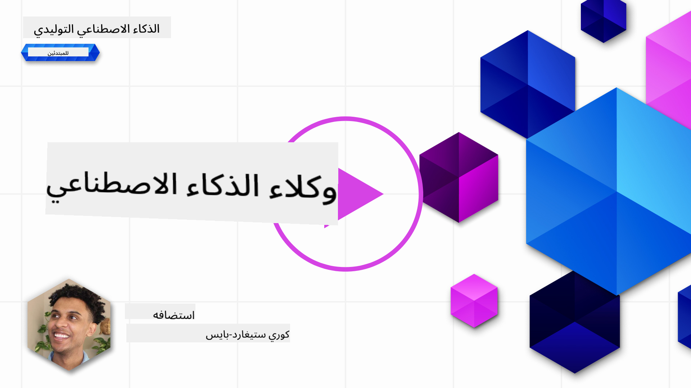
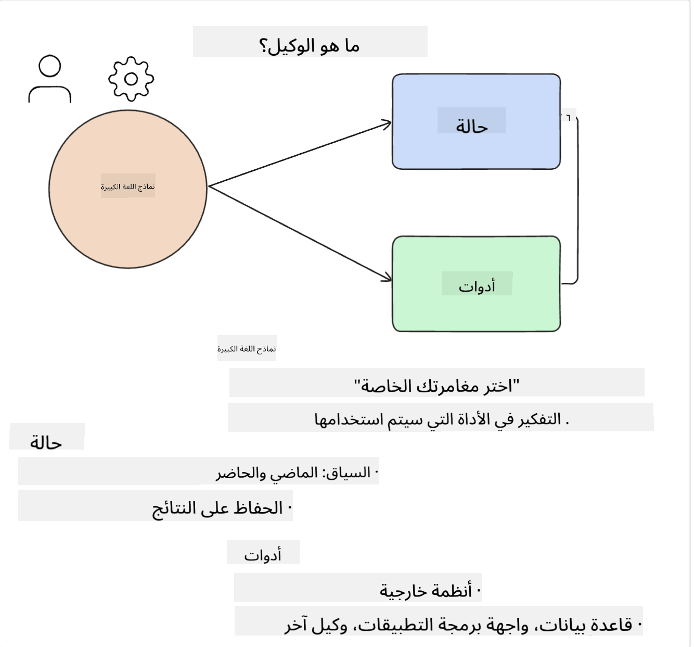
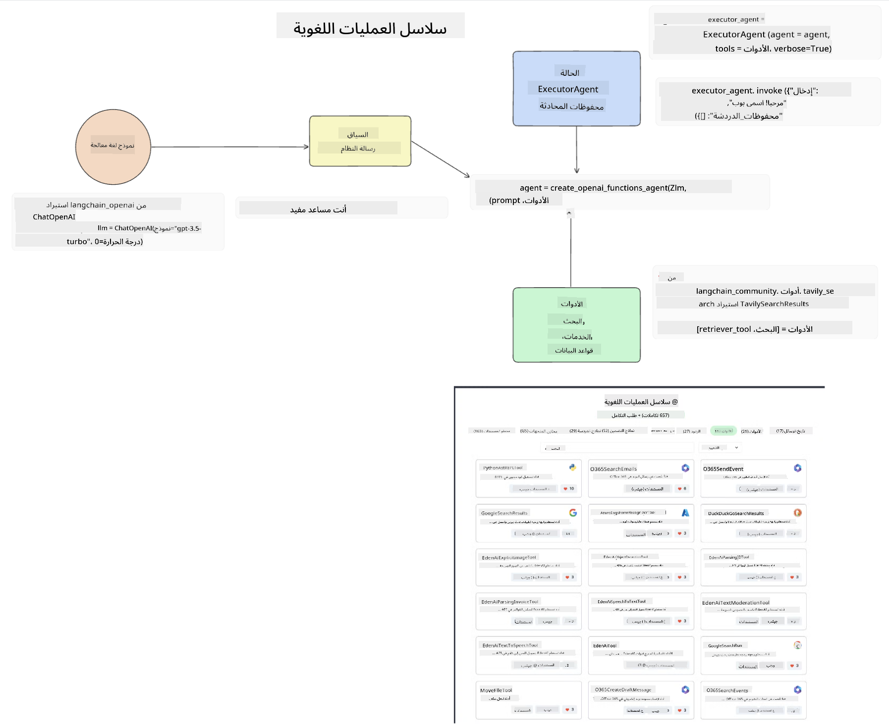
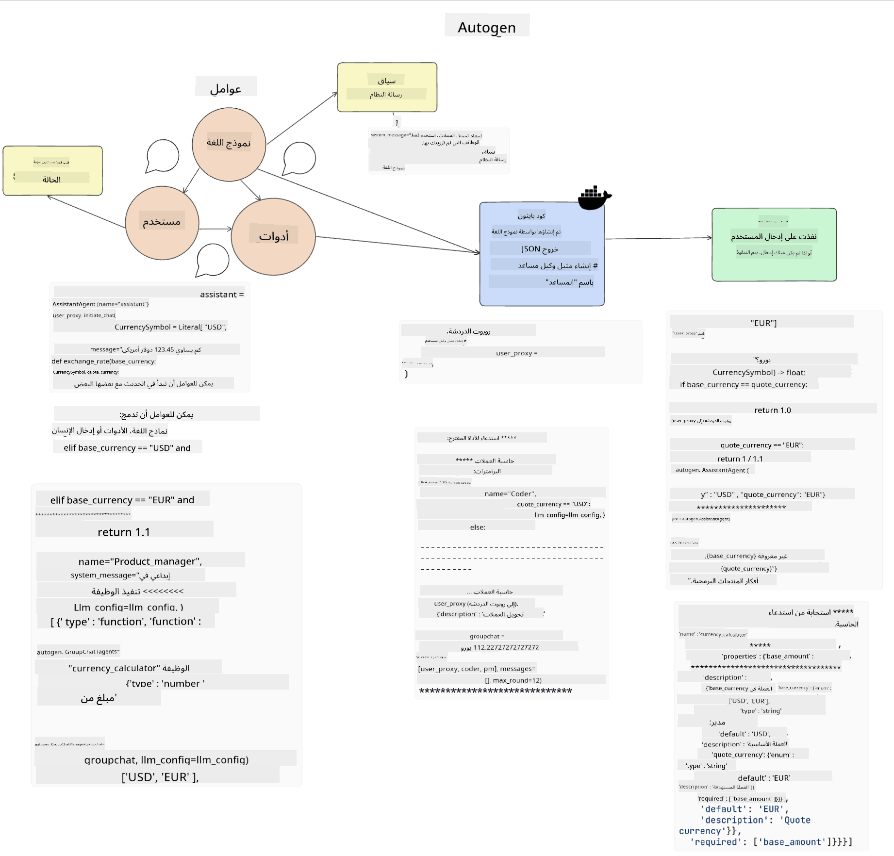
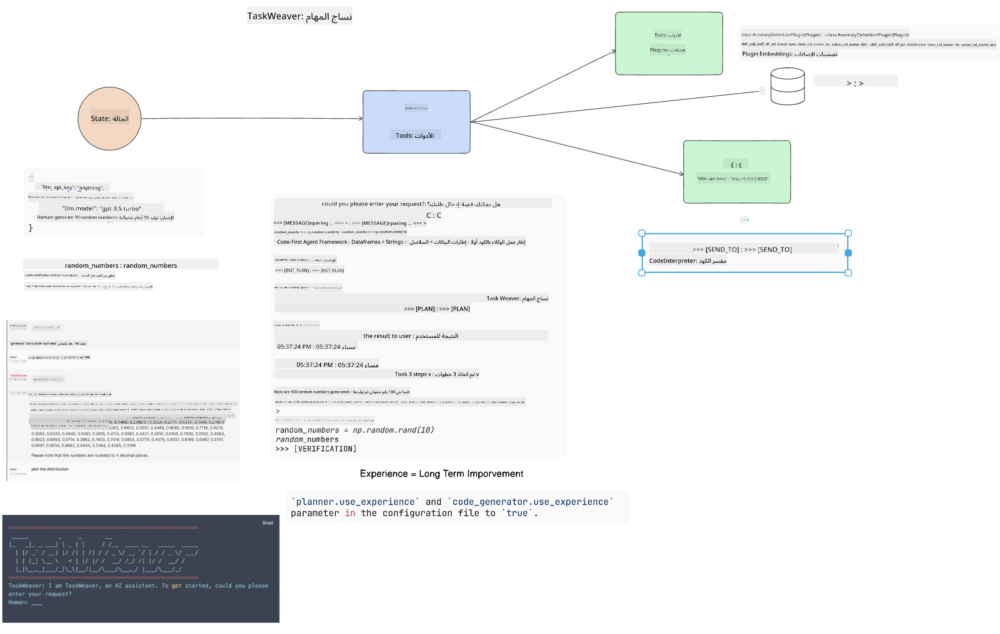
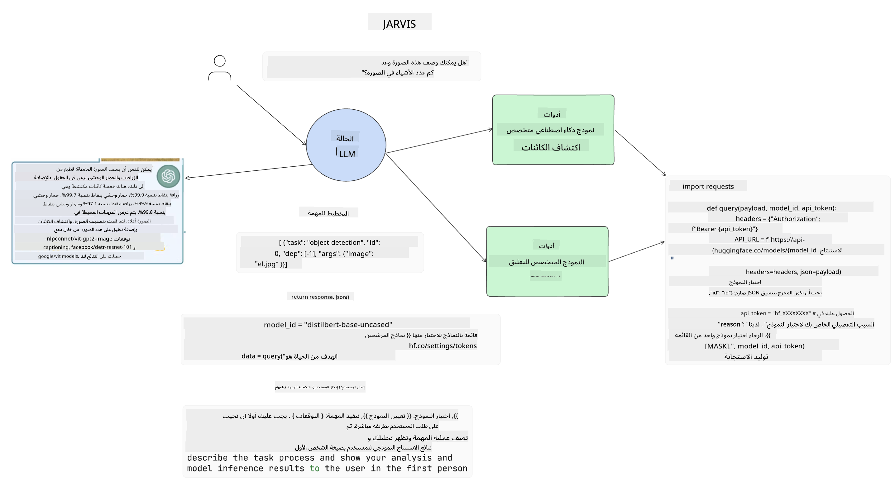

<!--
CO_OP_TRANSLATOR_METADATA:
{
  "original_hash": "11f03c81f190d9cbafd0f977dcbede6c",
  "translation_date": "2025-06-26T00:09:17+00:00",
  "source_file": "17-ai-agents/README.md",
  "language_code": "ar"
}
-->
[](https://aka.ms/gen-ai-lesson17-gh?WT.mc_id=academic-105485-koreyst)

## المقدمة

تمثل وكلاء الذكاء الاصطناعي تطورًا مثيرًا في الذكاء الاصطناعي التوليدي، مما يتيح لنماذج اللغة الكبيرة (LLMs) التطور من مساعدين إلى وكلاء قادرين على اتخاذ الإجراءات. تمكن أطر وكلاء الذكاء الاصطناعي المطورين من إنشاء تطبيقات تمنح LLMs الوصول إلى الأدوات وإدارة الحالة. تعزز هذه الأطر أيضًا الرؤية، مما يسمح للمستخدمين والمطورين بمراقبة الإجراءات المخطط لها بواسطة LLMs، وبالتالي تحسين إدارة التجربة.

ستغطي الدرس المجالات التالية:

- فهم ما هو وكيل الذكاء الاصطناعي - ما هو وكيل الذكاء الاصطناعي بالضبط؟
- استكشاف أربعة أطر مختلفة لوكلاء الذكاء الاصطناعي - ما الذي يجعلها فريدة؟
- تطبيق هذه الوكلاء في حالات استخدام مختلفة - متى يجب أن نستخدم وكلاء الذكاء الاصطناعي؟

## أهداف التعلم

بعد أخذ هذا الدرس، ستتمكن من:

- شرح ما هي وكلاء الذكاء الاصطناعي وكيف يمكن استخدامها.
- فهم الفروق بين بعض أطر وكلاء الذكاء الاصطناعي الشهيرة، وكيف تختلف.
- فهم كيفية عمل وكلاء الذكاء الاصطناعي لبناء تطبيقات معهم.

## ما هي وكلاء الذكاء الاصطناعي؟

وكلاء الذكاء الاصطناعي مجال مثير جدًا في عالم الذكاء الاصطناعي التوليدي. مع هذا الإثارة يأتي أحيانًا ارتباك في المصطلحات وتطبيقها. للحفاظ على الأمور بسيطة وشاملة لمعظم الأدوات التي تشير إلى وكلاء الذكاء الاصطناعي، سنستخدم هذا التعريف:

تسمح وكلاء الذكاء الاصطناعي لنماذج اللغة الكبيرة (LLMs) بأداء المهام من خلال منحها الوصول إلى **الحالة** و**الأدوات**.



لنقم بتعريف هذه المصطلحات:

**نماذج اللغة الكبيرة** - هذه هي النماذج المشار إليها طوال هذا الدورة مثل GPT-3.5، GPT-4، Llama-2، إلخ.

**الحالة** - يشير هذا إلى السياق الذي يعمل فيه LLM. يستخدم LLM سياق أفعاله السابقة والسياق الحالي، لتوجيه اتخاذ القرارات للأفعال التالية. تسمح أطر وكلاء الذكاء الاصطناعي للمطورين بالحفاظ على هذا السياق بسهولة أكبر.

**الأدوات** - لإكمال المهمة التي طلبها المستخدم والتي خطط لها LLM، يحتاج LLM إلى الوصول إلى الأدوات. بعض الأمثلة على الأدوات يمكن أن تكون قاعدة بيانات، واجهة برمجة تطبيقات، تطبيق خارجي أو حتى LLM آخر!

هذه التعريفات ستعطيك أساسًا جيدًا للمضي قدمًا بينما ننظر في كيفية تنفيذها. دعونا نستكشف بعض الأطر المختلفة لوكلاء الذكاء الاصطناعي:

## وكلاء LangChain

[وكلاء LangChain](https://python.langchain.com/docs/how_to/#agents?WT.mc_id=academic-105485-koreyst) هي تنفيذ للتعريفات التي قدمناها أعلاه.

لإدارة **الحالة** ، يستخدم وظيفة مدمجة تسمى `AgentExecutor`. يقبل `agent` المحدد و`tools` المتاحة له.

يخزن `Agent Executor` أيضًا سجل المحادثة لتوفير سياق المحادثة.



يوفر LangChain [كتالوج الأدوات](https://integrations.langchain.com/tools?WT.mc_id=academic-105485-koreyst) التي يمكن استيرادها إلى تطبيقك والتي يمكن أن يحصل LLM على الوصول إليها. يتم صنع هذه الأدوات من قبل المجتمع وفريق LangChain.

يمكنك بعد ذلك تحديد هذه الأدوات وتمريرها إلى `Agent Executor`.

الرؤية هي جانب آخر مهم عند الحديث عن وكلاء الذكاء الاصطناعي. من المهم لمطوري التطبيقات فهم الأداة التي يستخدمها LLM ولماذا. لذلك، قام الفريق في LangChain بتطوير LangSmith.

## AutoGen

الإطار التالي لوكيل الذكاء الاصطناعي الذي سنناقشه هو [AutoGen](https://microsoft.github.io/autogen/?WT.mc_id=academic-105485-koreyst). التركيز الرئيسي لـ AutoGen هو المحادثات. الوكلاء يمكن أن يكونوا **قابلين للمحادثة** و**قابلين للتخصيص**.

**قابل للمحادثة -** يمكن لـ LLMs بدء ومواصلة محادثة مع LLM آخر لإكمال مهمة. يتم ذلك عن طريق إنشاء `AssistantAgents` وإعطائهم رسالة نظام محددة.

```python

autogen.AssistantAgent( name="Coder", llm_config=llm_config, ) pm = autogen.AssistantAgent( name="Product_manager", system_message="Creative in software product ideas.", llm_config=llm_config, )

```

**قابل للتخصيص** - يمكن تعريف الوكلاء ليس فقط كـ LLMs ولكن كمستخدم أو أداة. كمطور، يمكنك تعريف `UserProxyAgent` الذي يكون مسؤولاً عن التفاعل مع المستخدم للحصول على ردود الفعل في إكمال المهمة. يمكن أن تستمر هذه الردود في تنفيذ المهمة أو توقفها.

```python
user_proxy = UserProxyAgent(name="user_proxy")
```

### الحالة والأدوات

لتغيير وإدارة الحالة، يولد وكيل مساعد كود بايثون لإكمال المهمة.

إليك مثال على العملية:



#### LLM معرف برسالة نظام

```python
system_message="For weather related tasks, only use the functions you have been provided with. Reply TERMINATE when the task is done."
```

توجه هذه الرسائل النظامية LLM المحدد إلى الوظائف ذات الصلة بمهمته. تذكر، مع AutoGen يمكنك أن يكون لديك مساعدين محددين متعددين مع رسائل نظام مختلفة.

#### المحادثة تبدأ بواسطة المستخدم

```python
user_proxy.initiate_chat( chatbot, message="I am planning a trip to NYC next week, can you help me pick out what to wear? ", )

```

هذه الرسالة من user_proxy (الإنسان) هي التي ستبدأ عملية الوكيل لاستكشاف الوظائف الممكنة التي يجب تنفيذها.

#### يتم تنفيذ الوظيفة

```bash
chatbot (to user_proxy):

***** Suggested tool Call: get_weather ***** Arguments: {"location":"New York City, NY","time_periond:"7","temperature_unit":"Celsius"} ******************************************************** --------------------------------------------------------------------------------

>>>>>>>> EXECUTING FUNCTION get_weather... user_proxy (to chatbot): ***** Response from calling function "get_weather" ***** 112.22727272727272 EUR ****************************************************************

```

بمجرد معالجة المحادثة الأولية، سيرسل الوكيل الأداة المقترحة للاتصال. في هذه الحالة، إنها وظيفة تسمى `get_weather`. Depending on your configuration, this function can be automatically executed and read by the Agent or can be executed based on user input.

You can find a list of [AutoGen code samples](https://microsoft.github.io/autogen/docs/Examples/?WT.mc_id=academic-105485-koreyst) to further explore how to get started building.

## Taskweaver

The next agent framework we will explore is [Taskweaver](https://microsoft.github.io/TaskWeaver/?WT.mc_id=academic-105485-koreyst). It is known as a "code-first" agent because instead of working strictly with `strings` , it can work with DataFrames in Python. This becomes extremely useful for data analysis and generation tasks. This can be things like creating graphs and charts or generating random numbers.

### State and Tools

To manage the state of the conversation, TaskWeaver uses the concept of a `Planner`. The `Planner` is a LLM that takes the request from the users and maps out the tasks that need to be completed to fulfill this request.

To complete the tasks the `Planner` is exposed to the collection of tools called `Plugins`. يمكن أن تكون هذه فئات بايثون أو مفسر كود عام. يتم تخزين هذه المكونات الإضافية كأوجه حتى يتمكن LLM من البحث بشكل أفضل عن المكون الإضافي الصحيح.



إليك مثال على مكون إضافي للتعامل مع اكتشاف الشذوذ:

```python
class AnomalyDetectionPlugin(Plugin): def __call__(self, df: pd.DataFrame, time_col_name: str, value_col_name: str):
```

يتم التحقق من الكود قبل التنفيذ. ميزة أخرى لإدارة السياق في Taskweaver هي `experience`. Experience allows for the context of a conversation to be stored over to the long term in a YAML file. This can be configured so that the LLM improves over time on certain tasks given that it is exposed to prior conversations.

## JARVIS

The last agent framework we will explore is [JARVIS](https://github.com/microsoft/JARVIS?tab=readme-ov-file?WT.mc_id=academic-105485-koreyst). What makes JARVIS unique is that it uses an LLM to manage the `state` للمحادثة و`tools` هي نماذج ذكاء اصطناعي أخرى. كل من نماذج الذكاء الاصطناعي هي نماذج متخصصة تؤدي مهام معينة مثل اكتشاف الكائنات، النسخ أو وصف الصور.



LLM، كونه نموذجًا متعدد الأغراض، يتلقى الطلب من المستخدم ويحدد المهمة المحددة وأي بيانات/معطيات مطلوبة لإكمال المهمة.

```python
[{"task": "object-detection", "id": 0, "dep": [-1], "args": {"image": "e1.jpg" }}]
```

ثم يقوم LLM بتنسيق الطلب بطريقة يمكن لنموذج الذكاء الاصطناعي المتخصص تفسيرها، مثل JSON. بمجرد أن يعيد نموذج الذكاء الاصطناعي توقعه بناءً على المهمة، يتلقى LLM الاستجابة.

إذا كانت هناك حاجة إلى نماذج متعددة لإكمال المهمة، فسوف يفسر أيضًا الاستجابة من تلك النماذج قبل تجميعها معًا لتوليد الاستجابة للمستخدم.

يوضح المثال أدناه كيف سيعمل هذا عندما يطلب المستخدم وصفًا وعددًا للكائنات في صورة:

## الواجب

لمواصلة تعلمك لوكلاء الذكاء الاصطناعي يمكنك البناء باستخدام AutoGen:

- تطبيق يحاكي اجتماع عمل مع مختلف أقسام شركة ناشئة في مجال التعليم.
- إنشاء رسائل نظام توجه LLMs في فهم الشخصيات والأولويات المختلفة، وتمكن المستخدم من تقديم فكرة منتج جديد.
- يجب أن يقوم LLM بعد ذلك بتوليد أسئلة متابعة من كل قسم لتحسين العرض وفكرة المنتج.

## التعلم لا يتوقف هنا، استمر في الرحلة

بعد إكمال هذا الدرس، تحقق من [مجموعة تعلم الذكاء الاصطناعي التوليدي](https://aka.ms/genai-collection?WT.mc_id=academic-105485-koreyst) لمواصلة تحسين معرفتك بالذكاء الاصطناعي التوليدي!

**إخلاء المسؤولية**:  
تمت ترجمة هذه الوثيقة باستخدام خدمة الترجمة بالذكاء الاصطناعي [Co-op Translator](https://github.com/Azure/co-op-translator). بينما نسعى للدقة، يرجى العلم أن الترجمات الآلية قد تحتوي على أخطاء أو عدم دقة. يجب اعتبار الوثيقة الأصلية بلغتها الأصلية المصدر الموثوق. للحصول على معلومات حيوية، يُوصى بالترجمة البشرية الاحترافية. نحن غير مسؤولين عن أي سوء فهم أو تفسير خاطئ ينشأ عن استخدام هذه الترجمة.