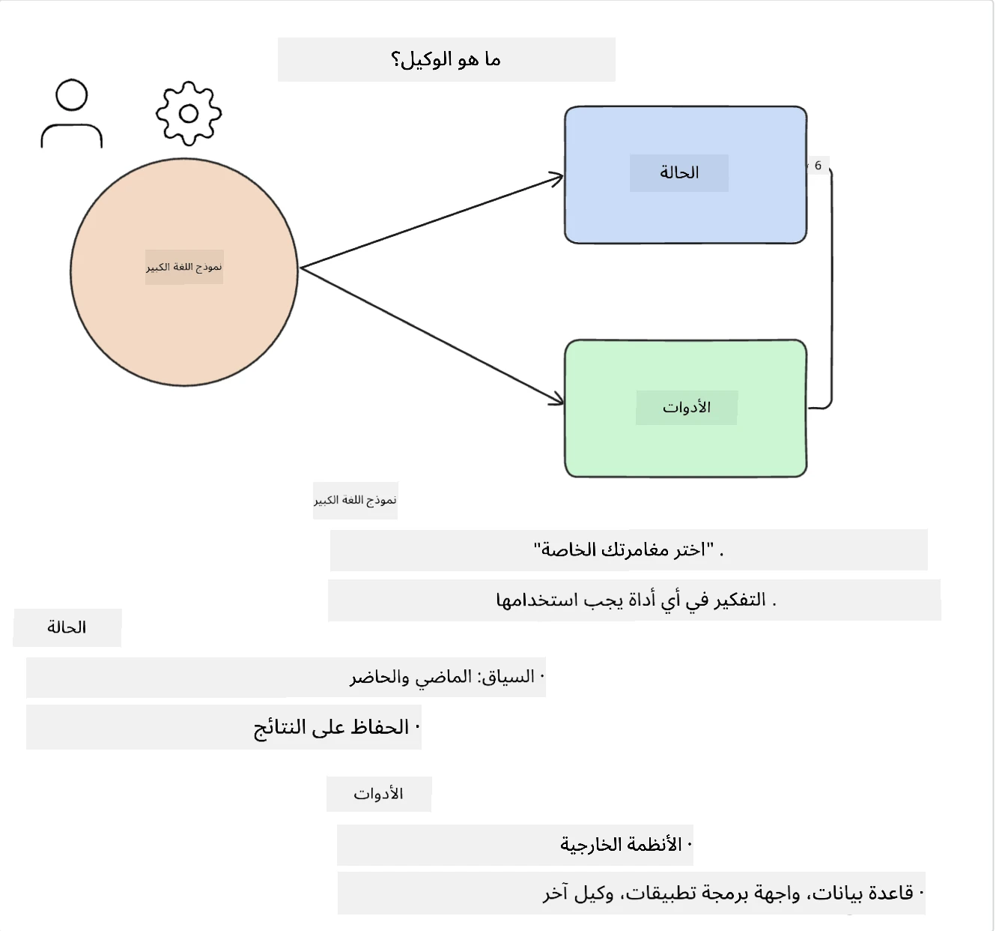
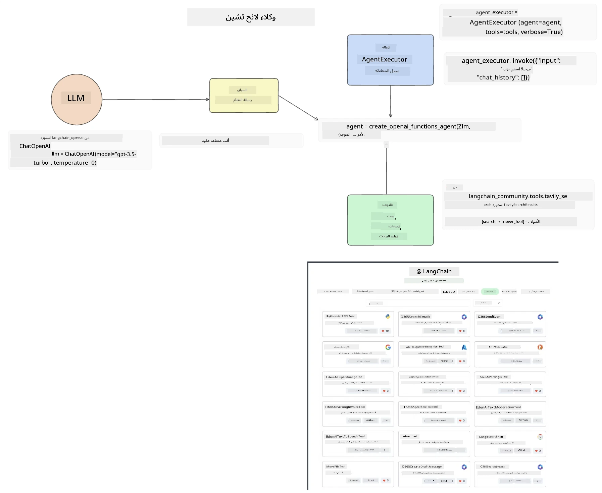
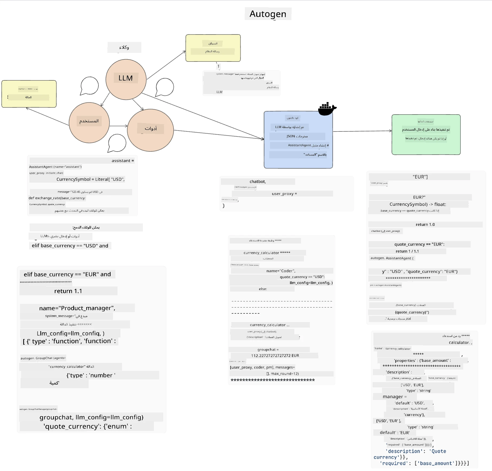
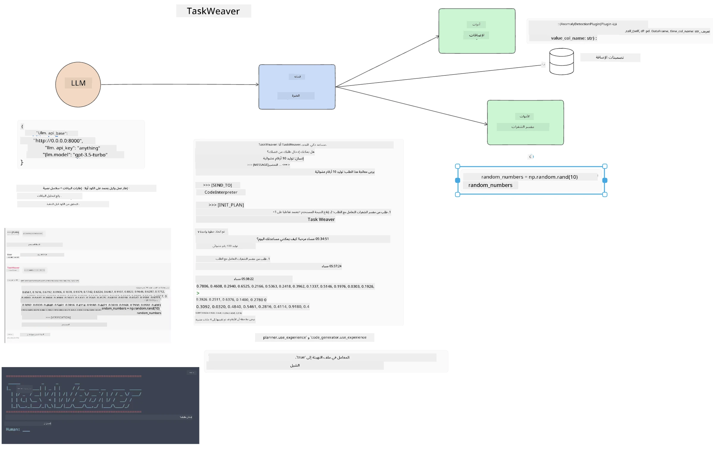
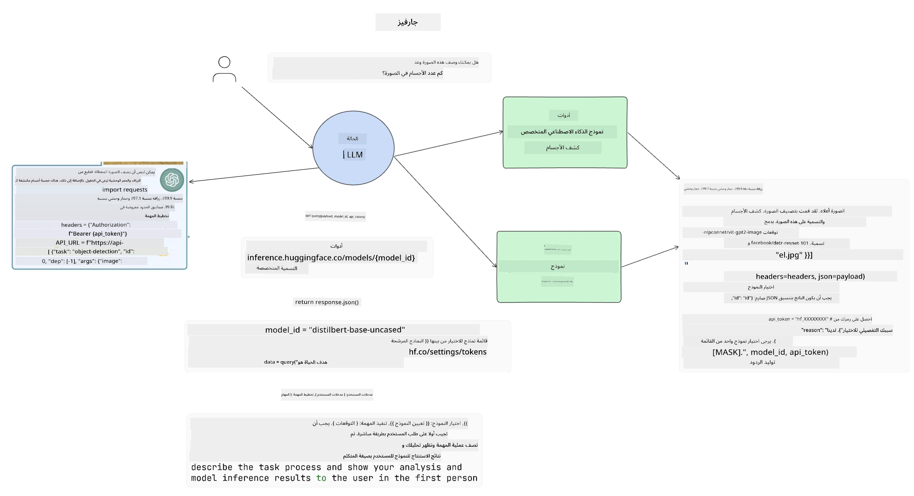

[](https://youtu.be/yAXVW-lUINc?si=bOtW9nL6jc3XJgOM)

## المقدمة

تمثل وكلاء الذكاء الاصطناعي تطورًا مثيرًا في مجال الذكاء الاصطناعي التوليدي، حيث تمكّن نماذج اللغات الكبيرة (LLMs) من التطور من مساعدين إلى وكلاء قادرين على اتخاذ إجراءات. تتيح أُطُر عمل وكلاء الذكاء الاصطناعي للمطورين إنشاء تطبيقات تمنح نماذج اللغات الكبيرة الوصول إلى الأدوات وإدارة الحالة. كما تعزز هذه الأُطُر من الشفافية، مما يتيح للمستخدمين والمطورين مراقبة الإجراءات المخطط لها من قبل نماذج اللغات الكبيرة، وبالتالي تحسين إدارة تجربة المستخدم.

سيغطي الدرس المجالات التالية:

- فهم ما هو وكيل الذكاء الاصطناعي - ما هو بالضبط وكيل الذكاء الاصطناعي؟
- استكشاف أربعة أُطُر مختلفة لوكلاء الذكاء الاصطناعي - ما الذي يجعل كل منها فريدًا؟
- تطبيق هؤلاء الوكلاء على حالات استخدام مختلفة - متى يجب استخدام وكلاء الذكاء الاصطناعي؟

## أهداف التعلم

بعد أخذ هذا الدرس، ستتمكن من:

- شرح ما هي وكلاء الذكاء الاصطناعي وكيف يمكن استخدامها.
- فهم الاختلافات بين بعض أُطُر وكلاء الذكاء الاصطناعي الشهيرة وكيف تختلف.
- فهم كيفية عمل وكلاء الذكاء الاصطناعي لبناء التطبيقات باستخدامهم.

## ما هي وكلاء الذكاء الاصطناعي؟

وكلاء الذكاء الاصطناعي مجال مثير جدًا في عالم الذكاء الاصطناعي التوليدي. مع هذا الحماس، أحيانًا يحدث التباس في المصطلحات وتطبيقاتها. للحفاظ على البساطة وشمول معظم الأدوات التي تشير إلى وكلاء الذكاء الاصطناعي، سنستخدم هذا التعريف:

تمكّن وكلاء الذكاء الاصطناعي نماذج اللغات الكبيرة (LLMs) من أداء المهام من خلال منحهم الوصول إلى **الحالة** و**الأدوات**.



دعونا نحدد هذه المصطلحات:

**نماذج اللغات الكبيرة** - هذه هي النماذج المشار إليها طوال هذا المقرر مثل GPT-3.5، GPT-4، Llama-2، إلخ.

**الحالة** - تشير إلى السياق الذي يعمل فيه النموذج اللغوي الكبير. يستخدم النموذج السياق الخاص بالإجراءات السابقة والسياق الحالي، مما يوجه اتخاذ قراراته للإجراءات التالية. تتيح أُطُر عمل وكلاء الذكاء الاصطناعي للمطورين صيانة هذا السياق بسهولة أكبر.

**الأدوات** - لإكمال المهمة التي طلبها المستخدم والتي خطط لها النموذج، يحتاج النموذج إلى الوصول إلى أدوات. بعض الأمثلة على الأدوات يمكن أن تكون قاعدة بيانات، واجهة برمجة تطبيقات، تطبيق خارجي أو حتى نموذج لغوي كبير آخر!

نأمل أن تمنحك هذه التعريفات أساسًا جيدًا للمضي قدمًا بينما نستعرض كيف يتم تنفيذها. دعونا نستكشف بعض أُطُر وكلاء الذكاء الاصطناعي المختلفة:

## وكلاء LangChain

[وكلاء LangChain](https://python.langchain.com/docs/how_to/#agents?WT.mc_id=academic-105485-koreyst) هم تنفيذ للتعريفات التي قدمناها أعلاه.

لإدارة **الحالة**، يستخدم دالة مضمنة تسمى `AgentExecutor`. تقبل هذه الدالة الوكيل المحدد `agent` والأدوات المتاحة له `tools`.

يقوم `AgentExecutor` أيضًا بتخزين سجل الدردشة لتوفير سياق المحادثة.



توفر LangChain [كتالوج أدوات](https://integrations.langchain.com/tools?WT.mc_id=academic-105485-koreyst) يمكن استيرادها إلى تطبيقك حيث يمكن للنموذج اللغوي الكبير الوصول إليها. يتم صنع هذه الأدوات من قبل المجتمع وفريق LangChain.

يمكنك بعد ذلك تعريف هذه الأدوات وتمريرها إلى `AgentExecutor`.

الشفافية أيضًا جانب مهم عند الحديث عن وكلاء الذكاء الاصطناعي. من المهم لمطوري التطبيقات فهم أي أداة يستخدمها النموذج ولماذا. لهذا السبب، طور فريق LangChain أداة LangSmith.

## AutoGen

الإطار التالي لوكلاء الذكاء الاصطناعي الذي سنناقشه هو [AutoGen](https://microsoft.github.io/autogen/?WT.mc_id=academic-105485-koreyst). التركيز الرئيسي في AutoGen هو المحادثات. الوكلاء هم **قابلون للمحادثة** و**قابلون للتخصيص**.

**قابل للمحادثة -** يمكن لنماذج اللغات الكبيرة أن تبدأ وتواصل محادثة مع نموذج لغوي كبير آخر من أجل إكمال مهمة. يتم ذلك من خلال إنشاء `AssistantAgents` وإعطائهم رسالة نظام محددة.

```python

autogen.AssistantAgent( name="Coder", llm_config=llm_config, ) pm = autogen.AssistantAgent( name="Product_manager", system_message="Creative in software product ideas.", llm_config=llm_config, )

```

**قابل للتخصيص** - يمكن تعريف الوكلاء ليس فقط كنماذج لغوية كبيرة ولكن كمستخدم أو كأداة. كمطور، يمكنك تعريف `UserProxyAgent` الذي يكون مسؤولاً عن التفاعل مع المستخدم للحصول على ملاحظات في إكمال مهمة. يمكن أن تستمر هذه الملاحظات في تنفيذ المهمة أو توقفها.

```python
user_proxy = UserProxyAgent(name="user_proxy")
```

### الحالة والأدوات

لتغيير وإدارة الحالة، يولد وكيل المساعد رمز بايثون لإكمال المهمة.

إليك مثال على العملية:



#### نموذج لغوي كبير معرف برسالة نظام

```python
system_message="For weather related tasks, only use the functions you have been provided with. Reply TERMINATE when the task is done."
```

توجه رسائل النظام هذه نموذج اللغوي الكبير إلى الوظائف ذات الصلة بمهمته. تذكر، مع AutoGen يمكنك أن تملك عدة وكلاء مساعدين معرفين مع رسائل نظام مختلفة.

#### المحادثة يبدأها المستخدم

```python
user_proxy.initiate_chat( chatbot, message="I am planning a trip to NYC next week, can you help me pick out what to wear? ", )

```

هذه الرسالة من user_proxy (إنسان) هي التي ستبدأ عملية الوكيل في استكشاف الوظائف التي يجب عليه تنفيذها.

#### تنفيذ الوظيفة

```bash
chatbot (to user_proxy):

***** Suggested tool Call: get_weather ***** Arguments: {"location":"New York City, NY","time_periond:"7","temperature_unit":"Celsius"} ******************************************************** --------------------------------------------------------------------------------

>>>>>>>> EXECUTING FUNCTION get_weather... user_proxy (to chatbot): ***** Response from calling function "get_weather" ***** 112.22727272727272 EUR ****************************************************************

```

بمجرد معالجة الدردشة الأولية، سيرسل الوكيل الأداة المقترحة للنداء. في هذه الحالة، هي وظيفة تسمى `get_weather`. حسب تكوينك، يمكن تنفيذ هذه الوظيفة تلقائيًا وقرايتها من قبل الوكيل أو يمكن تنفيذها بناءً على إدخال المستخدم.

يمكنك العثور على قائمة بـ [عينات كود AutoGen](https://microsoft.github.io/autogen/docs/Examples/?WT.mc_id=academic-105485-koreyst) لاستكشاف المزيد لبدء البناء.

## Taskweaver

الإطار التالي لوكلاء الذكاء الاصطناعي الذي سنستعرضه هو [Taskweaver](https://microsoft.github.io/TaskWeaver/?WT.mc_id=academic-105485-koreyst). يُعرف بأنه وكيل "يعتمد على الكود أولًا" لأنه بدلاً من العمل فقط مع `strings`، يمكنه العمل مع DataFrames في بايثون. هذا يصبح مفيدًا جدًا لتحليل البيانات ومهام التوليد. يمكن أن تكون أشياء مثل إنشاء الرسوم البيانية والمخططات أو توليد أرقام عشوائية.

### الحالة والأدوات

لإدارة الحالة للمحادثة، يستخدم TaskWeaver مفهوم `Planner`. هو نموذج لغوي كبير يأخذ الطلب من المستخدمين ويرسم خارطة للمهام التي تحتاج إلى إنجاز لتلبية هذا الطلب.

لإكمال المهام، يتم تعريض `Planner` لمجموعة الأدوات المسماة `Plugins`. قد تكون هذه فئات بايثون أو مفسر كود عام. تخزن هذه الإضافات كتمثيلات مضمّنة embedding بحيث يمكن للنموذج اللغوي الكبير البحث بشكل أفضل عن الإضافة الصحيحة.



هذا مثال لإضافة تعالج اكتشاف الشذوذ:

```python
class AnomalyDetectionPlugin(Plugin): def __call__(self, df: pd.DataFrame, time_col_name: str, value_col_name: str):
```

يتم التحقق من الكود قبل التنفيذ. ميزة أخرى لإدارة السياق في Taskweaver هي `experience`. تسمح تجربة الـ `experience` بتخزين سياق المحادثة على المدى الطويل في ملف YAML. يمكن تكوين هذا بحيث يتحسن النموذج اللغوي الكبير مع مرور الوقت في مهام معينة بالنظر إلى تعرضه للمحادثات السابقة.

## JARVIS

الإطار الأخير لوكلاء الذكاء الاصطناعي الذي سنستعرضه هو [JARVIS](https://github.com/microsoft/JARVIS?tab=readme-ov-file&WT.mc_id=academic-105485-koreyst). ما يميز JARVIS هو أنه يستخدم نموذج لغوي كبير لإدارة `حالة` المحادثة، و`الأدوات` هي نماذج ذكاء اصطناعي أخرى. كل نموذج ذكاء اصطناعي متخصص يؤدي مهامًا معينة مثل اكتشاف الأشياء، التفريغ الصوتي، أو التعليق على الصور.



النموذج اللغوي الكبير، كونه نموذجًا عامًا، يستلم الطلب من المستخدم ويحدد المهمة المحددة وأي معطيات/بيانات يحتاجها لإكمال المهمة.

```python
[{"task": "object-detection", "id": 0, "dep": [-1], "args": {"image": "e1.jpg" }}]
```

يقوم النموذج اللغوي بعد ذلك بتنسيق الطلب بطريقة يمكن للنموذج المتخصص تفسيرها، مثل JSON. بمجرد أن يعيد نموذج الذكاء الاصطناعي توقعه بناءً على المهمة، يستلم النموذج اللغوي الكبير الرد.

إذا تطلب إكمال المهمة استخدام نماذج متعددة، فسيفسر الرد من تلك النماذج قبل جمعها معًا لتوليد الرد للمستخدم.

المثال أدناه يوضح كيف ستعمل هذه العملية عندما يطلب المستخدم وصفًا وعددًا للأشياء في صورة:

## الواجب

لمتابعة تعلمك حول وكلاء الذكاء الاصطناعي يمكنك البناء باستخدام AutoGen:

- تطبيق يحاكي اجتماع عمل مع أقسام مختلفة ضمن شركة ناشئة تعليمية.
- إنشاء رسائل نظام توجه نماذج اللغات الكبيرة لفهم شخصيات وأولويات مختلفة، وتمكين المستخدم من عرض فكرة منتج جديد.
- يجب على النموذج اللغوي الكبير توليد أسئلة متابعة من كل قسم لصقل وتحسين العرض وفكرة المنتج.

## التعلم لا يتوقف هنا، واصل الرحلة

بعد إتمام هذا الدرس، اطلع على [مجموعة تعلم الذكاء الاصطناعي التوليدي](https://aka.ms/genai-collection?WT.mc_id=academic-105485-koreyst) للاستمرار في رفع مستواك في معرفة الذكاء الاصطناعي التوليدي!

---

<!-- CO-OP TRANSLATOR DISCLAIMER START -->
**إخلاء المسؤولية**:  
تمت ترجمة هذا المستند باستخدام خدمة الترجمة الآلية [Co-op Translator](https://github.com/Azure/co-op-translator). بينما نسعى لتحقيق الدقة، يرجى العلم أن الترجمات الآلية قد تحتوي على أخطاء أو عدم دقة. يجب اعتبار المستند الأصلي بلغته الأصلية المصدر الموثوق. للمعلومات الحساسة أو الهامة، يُنصح بالترجمة الاحترافية من قبل مترجم بشري. نحن غير مسؤولين عن أي سوء فهم أو تفسير خاطئ ناتج عن استخدام هذه الترجمة.
<!-- CO-OP TRANSLATOR DISCLAIMER END -->