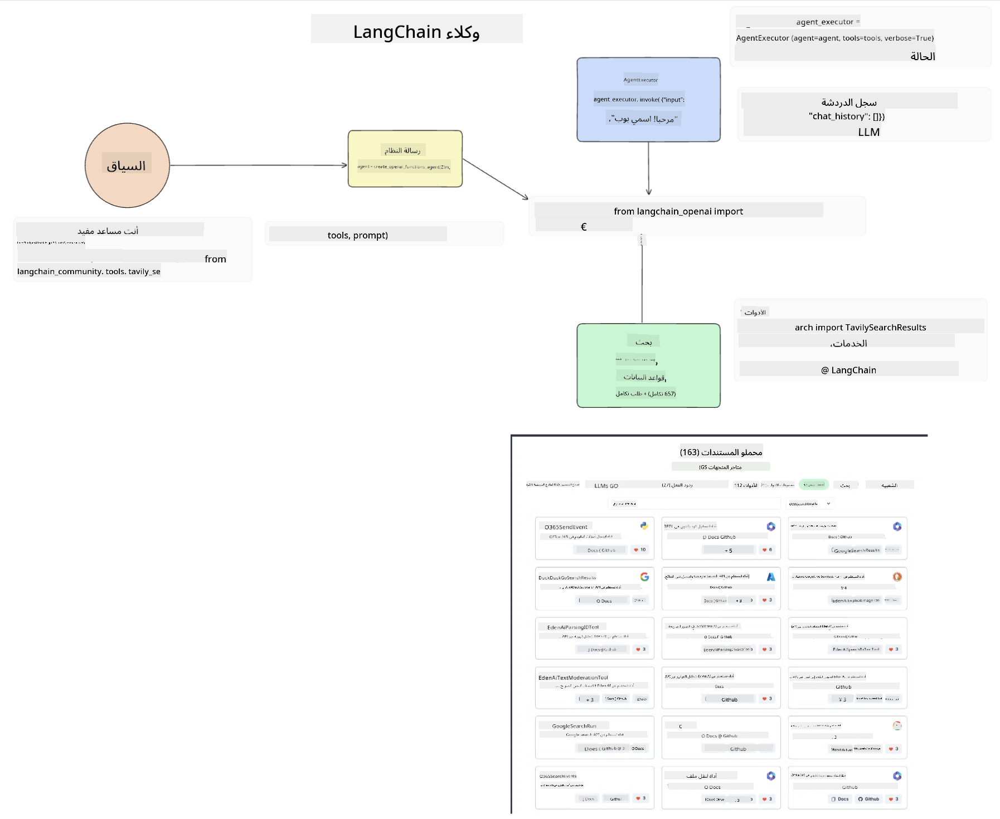

<!--
CO_OP_TRANSLATOR_METADATA:
{
  "original_hash": "8e8d1f6a63da606af7176a87ff8e92b6",
  "translation_date": "2025-10-17T12:57:26+00:00",
  "source_file": "17-ai-agents/README.md",
  "language_code": "ar"
}
-->
[](https://youtu.be/yAXVW-lUINc?si=bOtW9nL6jc3XJgOM)

## المقدمة

تمثل وكلاء الذكاء الاصطناعي تطورًا مثيرًا في مجال الذكاء الاصطناعي التوليدي، حيث تمكن نماذج اللغة الكبيرة (LLMs) من التحول من مساعدين إلى وكلاء قادرين على اتخاذ الإجراءات. تتيح أطر عمل وكلاء الذكاء الاصطناعي للمطورين إنشاء تطبيقات تمنح نماذج اللغة الكبيرة الوصول إلى الأدوات وإدارة الحالة. كما تعزز هذه الأطر الرؤية، مما يسمح للمستخدمين والمطورين بمراقبة الإجراءات التي تخطط لها نماذج اللغة الكبيرة، وبالتالي تحسين إدارة التجربة.

ستغطي الدرس المجالات التالية:

- فهم ما هو وكيل الذكاء الاصطناعي - ما هو وكيل الذكاء الاصطناعي بالضبط؟
- استكشاف أربعة أطر عمل مختلفة لوكلاء الذكاء الاصطناعي - ما الذي يجعلها فريدة؟
- تطبيق هذه الوكلاء على حالات استخدام مختلفة - متى يجب استخدام وكلاء الذكاء الاصطناعي؟

## أهداف التعلم

بعد إكمال هذا الدرس، ستكون قادرًا على:

- شرح ما هي وكلاء الذكاء الاصطناعي وكيف يمكن استخدامها.
- فهم الفروقات بين بعض أطر عمل وكلاء الذكاء الاصطناعي الشهيرة وكيف تختلف.
- فهم كيفية عمل وكلاء الذكاء الاصطناعي لبناء تطبيقات باستخدامها.

## ما هي وكلاء الذكاء الاصطناعي؟

وكلاء الذكاء الاصطناعي مجال مثير للغاية في عالم الذكاء الاصطناعي التوليدي. ومع هذا الحماس، قد يحدث أحيانًا ارتباك في المصطلحات وتطبيقاتها. للحفاظ على الأمور بسيطة وشاملة لمعظم الأدوات التي تشير إلى وكلاء الذكاء الاصطناعي، سنستخدم هذا التعريف:

تسمح وكلاء الذكاء الاصطناعي لنماذج اللغة الكبيرة (LLMs) بأداء المهام من خلال منحها الوصول إلى **الحالة** و**الأدوات**.


دعونا نعرف هذه المصطلحات:

**نماذج اللغة الكبيرة** - هذه هي النماذج المشار إليها طوال هذا الدرس مثل GPT-3.5، GPT-4، Llama-2، وغيرها.

**الحالة** - تشير إلى السياق الذي تعمل فيه نماذج اللغة الكبيرة. تستخدم نماذج اللغة الكبيرة سياق الإجراءات السابقة والسياق الحالي لتوجيه اتخاذ القرارات للإجراءات اللاحقة. تتيح أطر عمل وكلاء الذكاء الاصطناعي للمطورين الحفاظ على هذا السياق بسهولة أكبر.

**الأدوات** - لإكمال المهمة التي طلبها المستخدم والتي خطط لها نموذج اللغة الكبير، يحتاج النموذج إلى الوصول إلى الأدوات. بعض الأمثلة على الأدوات يمكن أن تكون قاعدة بيانات، واجهة برمجة تطبيقات، تطبيق خارجي أو حتى نموذج لغة كبير آخر!

هذه التعريفات ستوفر لك أساسًا جيدًا للمضي قدمًا أثناء استكشاف كيفية تنفيذها. دعونا نستكشف بعض أطر عمل وكلاء الذكاء الاصطناعي المختلفة:

## وكلاء LangChain

[وكلاء LangChain](https://python.langchain.com/docs/how_to/#agents?WT.mc_id=academic-105485-koreyst) هو تنفيذ للتعريفات التي قدمناها أعلاه.

لإدارة **الحالة**، يستخدم وظيفة مدمجة تسمى `AgentExecutor`. هذه الوظيفة تقبل الوكيل المحدد والأدوات المتاحة له.

يقوم `AgentExecutor` أيضًا بتخزين سجل المحادثات لتوفير سياق المحادثة.



يوفر LangChain [كتالوجًا للأدوات](https://integrations.langchain.com/tools?WT.mc_id=academic-105485-koreyst) يمكن استيراده إلى تطبيقك حيث يمكن لنموذج اللغة الكبير الوصول إليه. تم إنشاء هذه الأدوات بواسطة المجتمع وفريق LangChain.

يمكنك بعد ذلك تعريف هذه الأدوات وتمريرها إلى `AgentExecutor`.

الرؤية هي جانب مهم آخر عند الحديث عن وكلاء الذكاء الاصطناعي. من المهم لمطوري التطبيقات فهم الأداة التي يستخدمها نموذج اللغة الكبير ولماذا. لهذا السبب، قام فريق LangChain بتطوير LangSmith.

## AutoGen

الإطار التالي لوكلاء الذكاء الاصطناعي الذي سنناقشه هو [AutoGen](https://microsoft.github.io/autogen/?WT.mc_id=academic-105485-koreyst). يركز AutoGen بشكل أساسي على المحادثات. الوكلاء يمكنهم أن يكونوا **قابلين للمحادثة** و**قابلين للتخصيص**.

**قابل للمحادثة -** يمكن لنماذج اللغة الكبيرة بدء ومواصلة محادثة مع نموذج لغة كبير آخر لإكمال مهمة. يتم ذلك عن طريق إنشاء `AssistantAgents` ومنحهم رسالة نظام محددة.

```python

autogen.AssistantAgent( name="Coder", llm_config=llm_config, ) pm = autogen.AssistantAgent( name="Product_manager", system_message="Creative in software product ideas.", llm_config=llm_config, )

```

**قابل للتخصيص** - يمكن تعريف الوكلاء ليس فقط كنماذج لغة كبيرة ولكن أيضًا كمستخدم أو أداة. كمطور، يمكنك تعريف `UserProxyAgent` المسؤول عن التفاعل مع المستخدم للحصول على ملاحظات لإكمال المهمة. يمكن لهذه الملاحظات إما متابعة تنفيذ المهمة أو إيقافها.

```python
user_proxy = UserProxyAgent(name="user_proxy")
```

### الحالة والأدوات

لتغيير وإدارة الحالة، يقوم وكيل المساعد بإنشاء كود Python لإكمال المهمة.

إليك مثال على العملية:


#### نموذج لغة كبير معرف برسالة نظام

```python
system_message="For weather related tasks, only use the functions you have been provided with. Reply TERMINATE when the task is done."
```

توجه هذه الرسالة النظامية نموذج اللغة الكبير المحدد إلى الوظائف ذات الصلة بمهمته. تذكر، مع AutoGen يمكنك أن يكون لديك عدة وكلاء مساعدين معرفين برسائل نظام مختلفة.

#### المحادثة تبدأ بواسطة المستخدم

```python
user_proxy.initiate_chat( chatbot, message="I am planning a trip to NYC next week, can you help me pick out what to wear? ", )

```

هذه الرسالة من الوكيل البشري (Human) هي ما سيبدأ عملية الوكيل لاستكشاف الوظائف الممكنة التي يجب تنفيذها.

#### تنفيذ الوظيفة

```bash
chatbot (to user_proxy):

***** Suggested tool Call: get_weather ***** Arguments: {"location":"New York City, NY","time_periond:"7","temperature_unit":"Celsius"} ******************************************************** --------------------------------------------------------------------------------

>>>>>>>> EXECUTING FUNCTION get_weather... user_proxy (to chatbot): ***** Response from calling function "get_weather" ***** 112.22727272727272 EUR ****************************************************************

```

بمجرد معالجة المحادثة الأولية، سيرسل الوكيل الأداة المقترحة للاستدعاء. في هذه الحالة، هي وظيفة تسمى `get_weather`. بناءً على تكوينك، يمكن تنفيذ هذه الوظيفة تلقائيًا وقراءتها بواسطة الوكيل أو يمكن تنفيذها بناءً على إدخال المستخدم.

يمكنك العثور على قائمة [عينات كود AutoGen](https://microsoft.github.io/autogen/docs/Examples/?WT.mc_id=academic-105485-koreyst) لاستكشاف كيفية البدء في البناء.

## Taskweaver

الإطار التالي للوكيل الذي سنستكشفه هو [Taskweaver](https://microsoft.github.io/TaskWeaver/?WT.mc_id=academic-105485-koreyst). يُعرف بأنه وكيل "يبدأ بالكود" لأنه بدلاً من العمل بشكل صارم مع `strings`، يمكنه العمل مع DataFrames في Python. يصبح هذا مفيدًا للغاية لتحليل البيانات ومهام التوليد. يمكن أن تكون هذه المهام مثل إنشاء الرسوم البيانية والمخططات أو توليد أرقام عشوائية.

### الحالة والأدوات

لإدارة حالة المحادثة، يستخدم TaskWeaver مفهوم `Planner`. الـ `Planner` هو نموذج لغة كبير يأخذ الطلب من المستخدمين ويرسم المهام التي يجب إكمالها لتلبية هذا الطلب.

لإكمال المهام، يتم عرض الـ `Planner` على مجموعة من الأدوات تسمى `Plugins`. يمكن أن تكون هذه الأدوات فصول Python أو مفسر كود عام. يتم تخزين هذه الإضافات كـ embeddings بحيث يمكن لنموذج اللغة الكبير البحث بشكل أفضل عن الإضافة الصحيحة.


إليك مثال على إضافة للتعامل مع اكتشاف الشذوذ:

```python
class AnomalyDetectionPlugin(Plugin): def __call__(self, df: pd.DataFrame, time_col_name: str, value_col_name: str):
```

يتم التحقق من الكود قبل التنفيذ. ميزة أخرى لإدارة السياق في Taskweaver هي `experience`. تسمح التجربة بتخزين سياق المحادثة على المدى الطويل في ملف YAML. يمكن تكوين ذلك بحيث يتحسن نموذج اللغة الكبير بمرور الوقت في مهام معينة نظرًا لأنه تعرض لمحادثات سابقة.

## JARVIS

الإطار الأخير للوكيل الذي سنستكشفه هو [JARVIS](https://github.com/microsoft/JARVIS?tab=readme-ov-file?WT.mc_id=academic-105485-koreyst). ما يجعل JARVIS فريدًا هو أنه يستخدم نموذج لغة كبير لإدارة `الحالة` للمحادثة و`الأدوات` هي نماذج ذكاء اصطناعي أخرى. كل نموذج من نماذج الذكاء الاصطناعي هو نموذج متخصص يؤدي مهام معينة مثل اكتشاف الكائنات، النسخ أو وصف الصور.


نموذج اللغة الكبير، كونه نموذجًا عامًا، يتلقى الطلب من المستخدم ويحدد المهمة المحددة وأي حجج/بيانات مطلوبة لإكمال المهمة.

```python
[{"task": "object-detection", "id": 0, "dep": [-1], "args": {"image": "e1.jpg" }}]
```

ثم يقوم نموذج اللغة الكبير بتنسيق الطلب بطريقة يمكن لنموذج الذكاء الاصطناعي المتخصص تفسيرها، مثل JSON. بمجرد أن يعيد نموذج الذكاء الاصطناعي توقعه بناءً على المهمة، يتلقى نموذج اللغة الكبير الاستجابة.

إذا كانت هناك حاجة إلى نماذج متعددة لإكمال المهمة، فإنه يفسر أيضًا الاستجابة من تلك النماذج قبل جمعها معًا لتوليد الاستجابة للمستخدم.

المثال أدناه يوضح كيف سيعمل ذلك عندما يطلب المستخدم وصفًا وعددًا للكائنات في صورة:

## المهمة

لمواصلة تعلمك عن وكلاء الذكاء الاصطناعي، يمكنك البناء باستخدام AutoGen:

- تطبيق يحاكي اجتماع عمل مع أقسام مختلفة لشركة ناشئة في مجال التعليم.
- إنشاء رسائل نظام توجه نماذج اللغة الكبيرة لفهم شخصيات وأولويات مختلفة، وتمكين المستخدم من تقديم فكرة منتج جديد.
- يجب أن يقوم نموذج اللغة الكبير بعد ذلك بتوليد أسئلة متابعة من كل قسم لتحسين الفكرة والمنتج.

## التعلم لا يتوقف هنا، استمر في الرحلة

بعد إكمال هذا الدرس، تحقق من [مجموعة تعلم الذكاء الاصطناعي التوليدي](https://aka.ms/genai-collection?WT.mc_id=academic-105485-koreyst) لمواصلة تطوير معرفتك بالذكاء الاصطناعي التوليدي!

---

**إخلاء المسؤولية**:  
تم ترجمة هذا المستند باستخدام خدمة الترجمة بالذكاء الاصطناعي [Co-op Translator](https://github.com/Azure/co-op-translator). بينما نسعى لتحقيق الدقة، يرجى العلم أن الترجمات الآلية قد تحتوي على أخطاء أو عدم دقة. يجب اعتبار المستند الأصلي بلغته الأصلية المصدر الموثوق. للحصول على معلومات حاسمة، يُوصى بالترجمة البشرية الاحترافية. نحن غير مسؤولين عن أي سوء فهم أو تفسيرات خاطئة ناتجة عن استخدام هذه الترجمة.