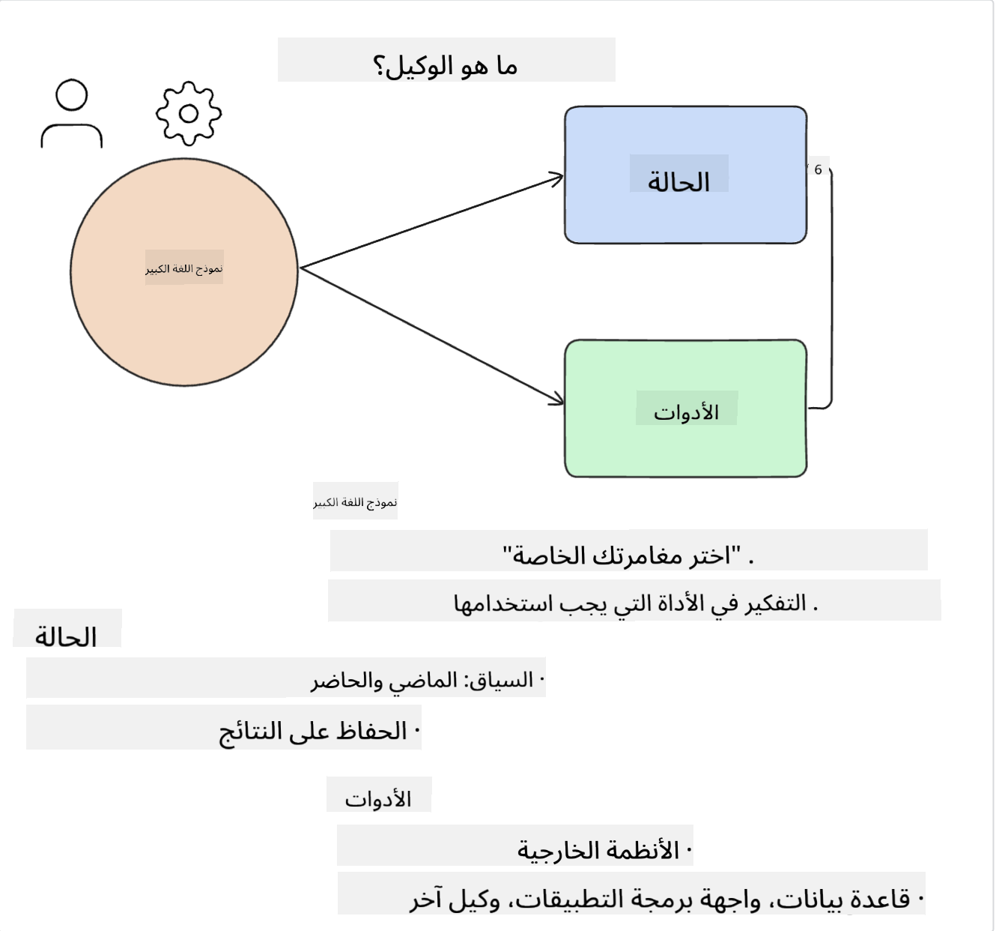
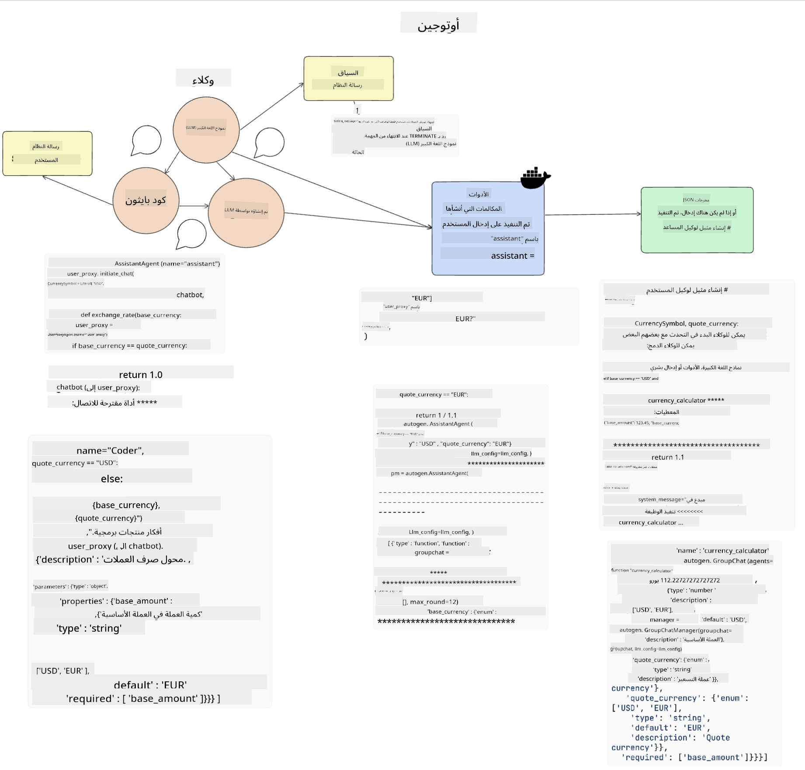
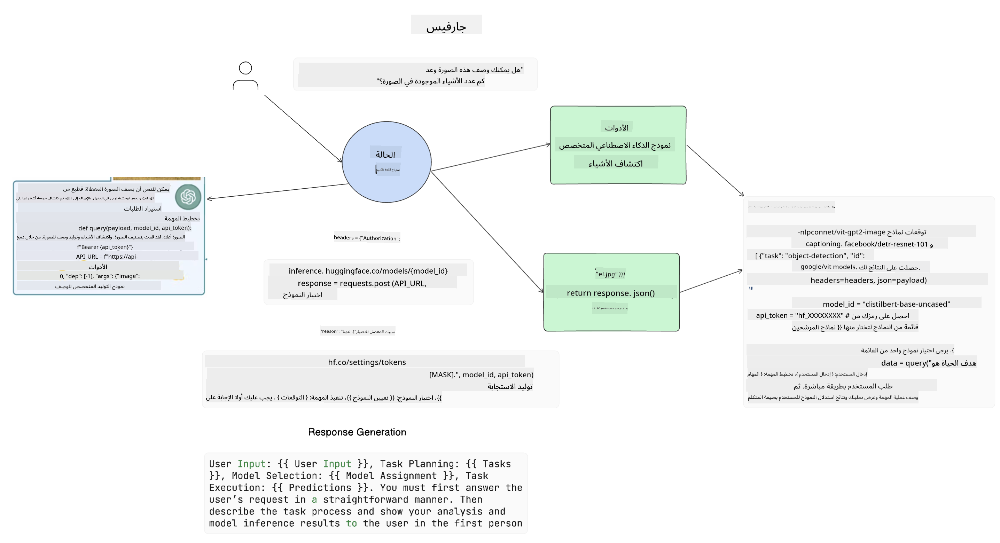

<!--
CO_OP_TRANSLATOR_METADATA:
{
  "original_hash": "11f03c81f190d9cbafd0f977dcbede6c",
  "translation_date": "2025-07-09T17:18:47+00:00",
  "source_file": "17-ai-agents/README.md",
  "language_code": "ar"
}
-->
[](https://aka.ms/gen-ai-lesson17-gh?WT.mc_id=academic-105485-koreyst)

## مقدمة

تمثل وكلاء الذكاء الاصطناعي تطورًا مثيرًا في مجال الذكاء الاصطناعي التوليدي، حيث تمكّن نماذج اللغة الكبيرة (LLMs) من التطور من مجرد مساعدين إلى وكلاء قادرين على اتخاذ إجراءات. تتيح أُطُر عمل وكلاء الذكاء الاصطناعي للمطورين إنشاء تطبيقات تمنح نماذج اللغة الكبيرة إمكانية الوصول إلى الأدوات وإدارة الحالة. كما تعزز هذه الأُطُر من الشفافية، مما يسمح للمستخدمين والمطورين بمراقبة الإجراءات التي تخطط لها نماذج اللغة الكبيرة، وبالتالي تحسين إدارة التجربة.

ستتناول هذه الدرس المجالات التالية:

- فهم ما هو وكيل الذكاء الاصطناعي - ما هو بالضبط وكيل الذكاء الاصطناعي؟
- استكشاف أربعة أُطُر مختلفة لوكلاء الذكاء الاصطناعي - ما الذي يميز كل منها؟
- تطبيق هؤلاء الوكلاء على حالات استخدام مختلفة - متى يجب استخدام وكلاء الذكاء الاصطناعي؟

## أهداف التعلم

بعد إتمام هذا الدرس، ستكون قادرًا على:

- شرح ماهية وكلاء الذكاء الاصطناعي وكيفية استخدامهم.
- فهم الفروقات بين بعض أُطُر وكلاء الذكاء الاصطناعي الشهيرة وكيف تختلف عن بعضها.
- فهم كيفية عمل وكلاء الذكاء الاصطناعي لبناء تطبيقات باستخدامهم.

## ما هي وكلاء الذكاء الاصطناعي؟

وكلاء الذكاء الاصطناعي مجال مثير جدًا في عالم الذكاء الاصطناعي التوليدي. ومع هذا الحماس، قد يحدث أحيانًا لبس في المصطلحات وتطبيقاتها. للحفاظ على البساطة وشمولية معظم الأدوات التي تشير إلى وكلاء الذكاء الاصطناعي، سنستخدم هذا التعريف:

تسمح وكلاء الذكاء الاصطناعي لنماذج اللغة الكبيرة (LLMs) بأداء المهام من خلال منحها إمكانية الوصول إلى **الحالة** و**الأدوات**.



لنوضح هذه المصطلحات:

**نماذج اللغة الكبيرة** - هي النماذج المشار إليها طوال هذا المقرر مثل GPT-3.5، GPT-4، Llama-2، وغيرها.

**الحالة** - تشير إلى السياق الذي يعمل فيه نموذج اللغة الكبير. يستخدم النموذج سياق أفعاله السابقة والسياق الحالي لتوجيه قراراته بشأن الإجراءات التالية. تتيح أُطُر عمل وكلاء الذكاء الاصطناعي للمطورين إدارة هذا السياق بسهولة أكبر.

**الأدوات** - لإكمال المهمة التي طلبها المستخدم والتي خطط لها نموذج اللغة الكبير، يحتاج النموذج إلى الوصول إلى أدوات. بعض الأمثلة على الأدوات يمكن أن تكون قاعدة بيانات، واجهة برمجة تطبيقات (API)، تطبيق خارجي أو حتى نموذج لغة كبير آخر!

نأمل أن تمنحك هذه التعريفات أساسًا جيدًا للمضي قدمًا أثناء استعراض كيفية تنفيذها. دعونا نستكشف بعض أُطُر وكلاء الذكاء الاصطناعي المختلفة:

## وكلاء LangChain

[وكلاء LangChain](https://python.langchain.com/docs/how_to/#agents?WT.mc_id=academic-105485-koreyst) هي تطبيق للتعريفات التي قدمناها أعلاه.

لإدارة **الحالة**، يستخدم وظيفة مدمجة تسمى `AgentExecutor`. هذه الوظيفة تقبل الوكيل المحدد `agent` والأدوات المتاحة له `tools`.

يقوم `AgentExecutor` أيضًا بتخزين سجل المحادثة لتوفير سياق المحادثة.


تقدم LangChain [كتالوجًا من الأدوات](https://integrations.langchain.com/tools?WT.mc_id=academic-105485-koreyst) التي يمكن استيرادها إلى تطبيقك ليتمكن نموذج اللغة الكبير من الوصول إليها. هذه الأدوات من صنع المجتمع وفريق LangChain.

يمكنك بعد ذلك تعريف هذه الأدوات وتمريرها إلى `AgentExecutor`.

الشفافية جانب مهم آخر عند الحديث عن وكلاء الذكاء الاصطناعي. من المهم لمطوري التطبيقات فهم الأداة التي يستخدمها نموذج اللغة الكبير ولماذا. لهذا السبب، طور فريق LangChain أداة LangSmith.

## AutoGen

الإطار التالي لوكلاء الذكاء الاصطناعي الذي سنناقشه هو [AutoGen](https://microsoft.github.io/autogen/?WT.mc_id=academic-105485-koreyst). يركز AutoGen بشكل رئيسي على المحادثات. الوكلاء هنا **قابلون للمحادثة** و**قابلون للتخصيص**.

**قابلون للمحادثة -** يمكن لنماذج اللغة الكبيرة بدء واستمرار محادثة مع نموذج لغة كبير آخر لإكمال مهمة. يتم ذلك بإنشاء `AssistantAgents` ومنحهم رسالة نظام محددة.

```python

autogen.AssistantAgent( name="Coder", llm_config=llm_config, ) pm = autogen.AssistantAgent( name="Product_manager", system_message="Creative in software product ideas.", llm_config=llm_config, )

```

**قابلون للتخصيص** - يمكن تعريف الوكلاء ليس فقط كنماذج لغة كبيرة، بل يمكن أن يكونوا مستخدمًا أو أداة. كمطور، يمكنك تعريف `UserProxyAgent` المسؤول عن التفاعل مع المستخدم للحصول على ملاحظات حول إكمال المهمة. يمكن أن تستمر هذه الملاحظات في تنفيذ المهمة أو توقفها.

```python
user_proxy = UserProxyAgent(name="user_proxy")
```

### الحالة والأدوات

لتغيير وإدارة الحالة، يقوم وكيل المساعد بإنشاء كود بايثون لإكمال المهمة.

إليك مثال على العملية:



#### نموذج اللغة الكبير معرف برسالة نظام

```python
system_message="For weather related tasks, only use the functions you have been provided with. Reply TERMINATE when the task is done."
```

توجه رسالة النظام هذه نموذج اللغة الكبير المحدد إلى الوظائف ذات الصلة بمهمته. تذكر، مع AutoGen يمكنك أن تملك عدة `AssistantAgents` معرفين برسائل نظام مختلفة.

#### يبدأ المستخدم المحادثة

```python
user_proxy.initiate_chat( chatbot, message="I am planning a trip to NYC next week, can you help me pick out what to wear? ", )

```

هذه الرسالة من user_proxy (البشري) هي التي ستبدأ عملية الوكيل لاستكشاف الوظائف المحتملة التي يجب تنفيذها.

#### تنفيذ الوظيفة

```bash
chatbot (to user_proxy):

***** Suggested tool Call: get_weather ***** Arguments: {"location":"New York City, NY","time_periond:"7","temperature_unit":"Celsius"} ******************************************************** --------------------------------------------------------------------------------

>>>>>>>> EXECUTING FUNCTION get_weather... user_proxy (to chatbot): ***** Response from calling function "get_weather" ***** 112.22727272727272 EUR ****************************************************************

```

بمجرد معالجة المحادثة الأولية، سيرسل الوكيل الأداة المقترحة للاستدعاء. في هذه الحالة، هي وظيفة تسمى `get_weather`. اعتمادًا على إعداداتك، يمكن تنفيذ هذه الوظيفة تلقائيًا وقراءتها من قبل الوكيل أو تنفيذها بناءً على إدخال المستخدم.

يمكنك العثور على قائمة بـ [عينات كود AutoGen](https://microsoft.github.io/autogen/docs/Examples/?WT.mc_id=academic-105485-koreyst) لاستكشاف كيفية البدء في البناء.

## Taskweaver

الإطار التالي لوكلاء الذكاء الاصطناعي الذي سنستعرضه هو [Taskweaver](https://microsoft.github.io/TaskWeaver/?WT.mc_id=academic-105485-koreyst). يُعرف بأنه وكيل "يركز على الكود" لأنه بدلاً من العمل فقط مع `strings`، يمكنه العمل مع DataFrames في بايثون. هذا يصبح مفيدًا جدًا لمهام تحليل البيانات والتوليد. مثل إنشاء الرسوم البيانية والمخططات أو توليد أرقام عشوائية.

### الحالة والأدوات

لإدارة حالة المحادثة، يستخدم TaskWeaver مفهوم `Planner`. الـ `Planner` هو نموذج لغة كبير يأخذ طلبات المستخدمين ويرسم خارطة للمهام التي يجب إكمالها لتلبية هذا الطلب.

لإكمال المهام، يتاح للـ `Planner` مجموعة من الأدوات تسمى `Plugins`. يمكن أن تكون هذه فئات بايثون أو مفسر كود عام. تُخزن هذه الإضافات كتمثيلات مضمنة (embeddings) حتى يتمكن نموذج اللغة الكبير من البحث بشكل أفضل عن الإضافة الصحيحة.


إليك مثال على إضافة للتعامل مع اكتشاف الشذوذ:

```python
class AnomalyDetectionPlugin(Plugin): def __call__(self, df: pd.DataFrame, time_col_name: str, value_col_name: str):
```

يتم التحقق من الكود قبل التنفيذ. ميزة أخرى لإدارة السياق في Taskweaver هي `experience`. تسمح الـ experience بتخزين سياق المحادثة على المدى الطويل في ملف YAML. يمكن تكوين ذلك بحيث يتحسن نموذج اللغة الكبير مع مرور الوقت في مهام معينة طالما تعرض للمحادثات السابقة.

## JARVIS

الإطار الأخير لوكلاء الذكاء الاصطناعي الذي سنستعرضه هو [JARVIS](https://github.com/microsoft/JARVIS?tab=readme-ov-file?WT.mc_id=academic-105485-koreyst). ما يميز JARVIS هو أنه يستخدم نموذج لغة كبير لإدارة `الحالة` للمحادثة، و`الأدوات` هي نماذج ذكاء اصطناعي أخرى. كل نموذج من هذه النماذج متخصص في أداء مهام معينة مثل اكتشاف الأشياء، النسخ الصوتي أو وصف الصور.



نموذج اللغة الكبير، كونه نموذجًا عامًا، يستقبل طلب المستخدم ويحدد المهمة المحددة وأي بيانات/معطيات لازمة لإكمال المهمة.

```python
[{"task": "object-detection", "id": 0, "dep": [-1], "args": {"image": "e1.jpg" }}]
```

يقوم نموذج اللغة الكبير بعد ذلك بتنسيق الطلب بطريقة يمكن للنموذج المتخصص تفسيرها، مثل JSON. بمجرد أن يعيد النموذج المتخصص توقعه بناءً على المهمة، يستقبل نموذج اللغة الكبير الرد.

إذا تطلبت المهمة نماذج متعددة لإكمالها، فسوف يفسر أيضًا الردود من تلك النماذج قبل جمعها معًا لتوليد الرد للمستخدم.

المثال أدناه يوضح كيف يعمل هذا عندما يطلب المستخدم وصفًا وعددًا للأشياء في صورة:

## المهمة

لمواصلة تعلمك عن وكلاء الذكاء الاصطناعي يمكنك البناء باستخدام AutoGen:

- تطبيق يحاكي اجتماع عمل مع أقسام مختلفة في شركة ناشئة تعليمية.
- إنشاء رسائل نظام توجه نماذج اللغة الكبيرة لفهم شخصيات وأولويات مختلفة، وتمكين المستخدم من عرض فكرة منتج جديد.
- يجب على نموذج اللغة الكبير بعد ذلك توليد أسئلة متابعة من كل قسم لتحسين وتطوير العرض وفكرة المنتج.

## التعلم لا يتوقف هنا، استمر في الرحلة

بعد إكمال هذا الدرس، اطلع على [مجموعة تعلم الذكاء الاصطناعي التوليدي](https://aka.ms/genai-collection?WT.mc_id=academic-105485-koreyst) لمواصلة تطوير معرفتك في الذكاء الاصطناعي التوليدي!

**إخلاء المسؤولية**:  
تمت ترجمة هذا المستند باستخدام خدمة الترجمة الآلية [Co-op Translator](https://github.com/Azure/co-op-translator). بينما نسعى لتحقيق الدقة، يرجى العلم أن الترجمات الآلية قد تحتوي على أخطاء أو عدم دقة. يجب اعتبار المستند الأصلي بلغته الأصلية المصدر الموثوق به. للمعلومات الهامة، يُنصح بالاعتماد على الترجمة البشرية المهنية. نحن غير مسؤولين عن أي سوء فهم أو تفسير ناتج عن استخدام هذه الترجمة.