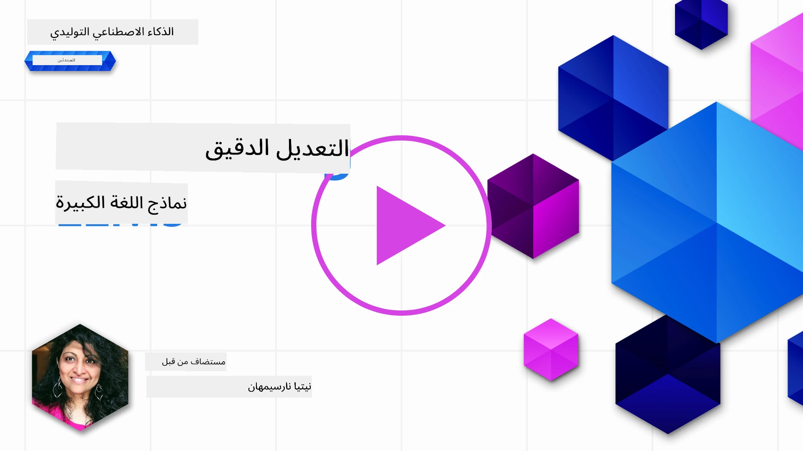
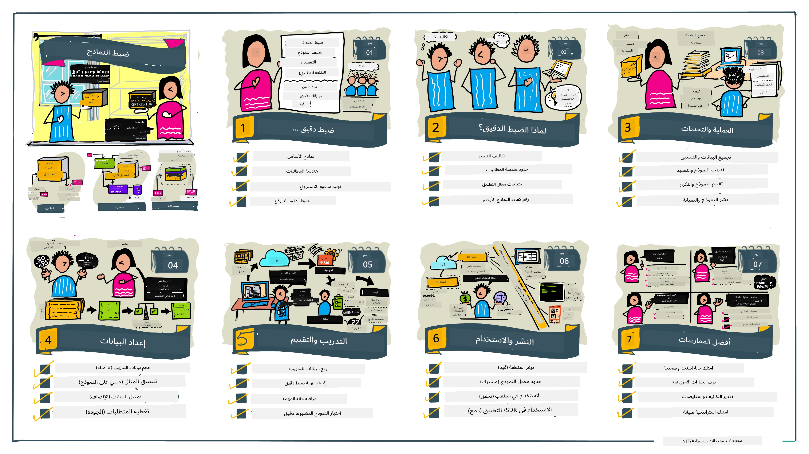

# توجيه النماذج اللغوية الكبيرة

يمثل استخدام النماذج اللغوية الكبيرة لبناء تطبيقات الذكاء الاصطناعي التوليدي تحديات جديدة. إحدى القضايا الرئيسية هي ضمان جودة الاستجابة (الدقة والملاءمة) في المحتوى الذي يولده النموذج لطلب المستخدم المحدد. في الدروس السابقة، ناقشنا تقنيات مثل هندسة المطالبات والتوليد المدعوم بالاسترجاع التي تحاول حل المشكلة من خلال _تعديل مدخلات المطالبة_ إلى النموذج الحالي.

في درس اليوم، نناقش تقنية ثالثة، وهي **التوجيه الدقيق**، التي تحاول معالجة التحدي عن طريق _إعادة تدريب النموذج نفسه_ ببيانات إضافية. دعونا نتعمق في التفاصيل.

## أهداف التعلم

يقدم هذا الدرس مفهوم التوجيه الدقيق للنماذج اللغوية المدربة مسبقًا، ويستعرض فوائد وتحديات هذا النهج، ويوفر إرشادات حول متى وكيفية استخدام التوجيه الدقيق لتحسين أداء نماذج الذكاء الاصطناعي التوليدي الخاصة بك.

بنهاية هذا الدرس، يجب أن تكون قادرًا على الإجابة عن الأسئلة التالية:

- ما هو التوجيه الدقيق للنماذج اللغوية؟
- متى ولماذا يكون التوجيه الدقيق مفيدًا؟
- كيف يمكنني توجيه نموذج مدرب مسبقًا بدقة؟
- ما هي حدود التوجيه الدقيق؟

هل أنت مستعد؟ لنبدأ.

## دليل توضيحي

هل ترغب في الحصول على الصورة الكبرى لما سنغطيه قبل أن نغوص في التفاصيل؟ تصفح هذا الدليل التوضيحي الذي يوضح رحلة التعلم لهذا الدرس – من تعلم المفاهيم الأساسية والدافع للتوجيه الدقيق، إلى فهم العملية وأفضل الممارسات لتنفيذ مهمة التوجيه الدقيق. هذا موضوع شيق للاستكشاف، فلا تنسَ الاطلاع على صفحة [الموارد](./RESOURCES.md?WT.mc_id=academic-105485-koreyst) لمزيد من الروابط التي تدعم رحلة التعلم الذاتية الخاصة بك!

## ما هو التوجيه الدقيق للنماذج اللغوية؟

بحسب التعريف، النماذج اللغوية الكبيرة هي نماذج _مدربة مسبقًا_ على كميات كبيرة من النصوص مأخوذة من مصادر متنوعة بما فيها الإنترنت. كما تعلمنا في الدروس السابقة، نحتاج إلى تقنيات مثل _هندسة المطالبات_ و _التوليد المدعوم بالاسترجاع_ لتحسين جودة استجابات النموذج لأسئلة المستخدم ("المطالبات").

تقنية شائعة لهندسة المطالبات تتضمن إعطاء النموذج إرشادات أكثر حول ما هو متوقع في الاستجابة إما بتقديم _تعليمات_ (إرشادات صريحة) أو _تزويده ببعض الأمثلة_ (إرشادات ضمنية). وهذا ما يعرف بـ _التعلم بالقليل من الأمثلة_ ولكن له حدين:

- قيود عدد رموز النموذج قد تحد من عدد الأمثلة التي يمكن تقديمها، وتقلل الفعالية.
- تكلفة رموز النموذج قد تجعل من المكلف إضافة أمثلة لكل مطالبة، مما يحد من المرونة.

التوجيه الدقيق هو ممارسة شائعة في أنظمة التعلم الآلي حيث نأخذ نموذجًا مدربًا مسبقًا ونعيد تدريبه ببيانات جديدة لتحسين أدائه في مهمة محددة. في سياق النماذج اللغوية، يمكننا توجيه النموذج المدرب مسبقًا _بمجموعة مختارة من الأمثلة لمهمة معينة أو مجال تطبيقي_ لإنشاء **نموذج مخصص** قد يكون أكثر دقة وملاءمة لتلك المهمة أو المجال المحدد. من فوائد التوجيه الدقيق أيضًا أنه يمكن أن يقلل عدد الأمثلة المطلوبة للتعلم بالقليل من الأمثلة - مما يقلل من استخدام الرموز والتكاليف المرتبطة.

## متى ولماذا ينبغي علينا توجيه النماذج بدقة؟

في _هذا_ السياق، عندما نتحدث عن التوجيه الدقيق، فإننا نشير إلى التوجيه الدقيق **المشرف عليه** حيث يتم إعادة التدريب عن طريق **إضافة بيانات جديدة** لم تكن جزءًا من مجموعة البيانات الأصلية للتدريب. وهذا يختلف عن نهج التوجيه الدقيق غير المشرف حيث يعاد تدريب النموذج على البيانات الأصلية، ولكن باستخدام معلمات فرعية مختلفة.

الأمر الأساسي الذي يجب تذكره هو أن التوجيه الدقيق هو تقنية متقدمة تتطلب مستوى معينًا من الخبرة للحصول على النتائج المرجوة. إذا تم بشكل غير صحيح، فقد لا يوفر التحسينات المتوقعة، وربما يقلل من أداء النموذج في المجال المستهدف.

لذا، قبل أن تتعلم "كيفية" توجيه النماذج اللغوية بدقة، تحتاج إلى معرفة "لماذا" يجب أن تسلك هذا الطريق، و"متى" تبدأ عملية التوجيه الدقيق. ابدأ بطرح هذه الأسئلة على نفسك:

- **حالة الاستخدام**: ما هي _حالة الاستخدام_ الخاصة بك للتوجيه الدقيق؟ أي جانب من النموذج المدرب مسبقًا الحالي تريد تحسينه؟
- **البدائل**: هل جربت _تقنيات أخرى_ لتحقيق النتائج المرجوة؟ استخدمها لإنشاء أساس للمقارنة.
  - هندسة المطالبات: جرب تقنيات مثل التوجيه بالقليل من الأمثلة مع أمثلة لمطالبات ذات استجابات مناسبة. قيّم جودة الاستجابات.
  - التوليد المدعوم بالاسترجاع: حاول تعزيز المطالبات بنتائج استعلام تمت استعادتها من خلال البحث في بياناتك. قيّم جودة الاستجابات.
- **التكاليف**: هل حددت التكاليف للتوجيه الدقيق؟
  - قابلية التوجيه – هل النموذج المدرب مسبقًا متاح للتوجيه الدقيق؟
  - الجهد – لإعداد بيانات التدريب، وتقييم وتحسين النموذج.
  - الحوسبة – لتشغيل مهمات التوجيه الدقيق، ونشر النموذج الموجه.
  - البيانات – الوصول إلى أمثلة ذات جودة كافية لتأثير التوجيه الدقيق.
- **الفوائد**: هل أكدت الفوائد من التوجيه الدقيق؟
  - الجودة – هل تفوق النموذج الموجه على الأساس المرجعي؟
  - التكلفة – هل يقلل من استخدام الرموز بتبسيط المطالبات؟
  - القابلية للتوسع – هل يمكنك إعادة استخدام النموذج الأساسي لمجالات جديدة؟

من خلال الإجابة على هذه الأسئلة، يجب أن تكون قادرًا على تحديد ما إذا كان التوجيه الدقيق هو النهج الصحيح لحالة استخدامك. من الناحية المثالية، يكون النهج صالحًا فقط إذا كانت الفوائد تفوق التكاليف. بعد أن تقرر المتابعة، حان الوقت للتفكير في _كيفية_ توجيه النموذج المدرب مسبقًا.

هل تريد معرفة المزيد عن عملية اتخاذ القرار؟ شاهد [هل توجيه النموذج مفيد أم لا](https://www.youtube.com/watch?v=0Jo-z-MFxJs)

## كيف يمكننا توجيه نموذج مدرب مسبقًا بدقة؟

لتوجيه نموذج مدرب مسبقًا بدقة، تحتاج إلى:

- نموذج مدرب مسبقًا لتوجيهه
- مجموعة بيانات لاستخدامها في التوجيه الدقيق
- بيئة تدريب لتشغيل مهمة التوجيه الدقيق
- بيئة استضافة لنشر النموذج الموجه

## التوجيه الدقيق عمليًا

توفر الموارد التالية دروسًا تعليمية خطوة بخطوة تشرح مثالًا عمليًا باستخدام نموذج مختار مع مجموعة بيانات مختارة. للعمل من خلال هذه الدروس، تحتاج إلى حساب على المزود المحدد، إلى جانب الوصول إلى النموذج ومجموعات البيانات ذات الصلة.

| المزود       | الدرس التعليمي                                                                                                                                                                 | الوصف                                                                                                                                                                                                                                                                                                                                                                                                                             |
| ------------ | ------------------------------------------------------------------------------------------------------------------------------------------------------------------------------ | -------------------------------------------------------------------------------------------------------------------------------------------------------------------------------------------------------------------------------------------------------------------------------------------------------------------------------------------------------------------------------------------------------------------------------- |
| OpenAI       | [كيفية توجيه نماذج الدردشة](https://github.com/openai/openai-cookbook/blob/main/examples/How_to_finetune_chat_models.ipynb?WT.mc_id=academic-105485-koreyst)                    | تعلّم كيف توجه نموذج `gpt-35-turbo` بدقة لمجال محدد ("مساعد الوصفات") من خلال إعداد بيانات التدريب، وتشغيل مهمة التوجيه الدقيق، واستخدام النموذج الموجه للاستدلال.                                                                                                                                                                                                                                                             |
| Azure OpenAI | [درس توجيه GPT 3.5 Turbo](https://learn.microsoft.com/azure/ai-services/openai/tutorials/fine-tune?tabs=python-new%2Ccommand-line?WT.mc_id=academic-105485-koreyst)             | تعلّم كيفية توجيه نموذج `gpt-35-turbo-0613` **على Azure** عبر خطوات إنشاء وتحميل بيانات التدريب، تشغيل مهمة التوجيه الدقيق، النشر، واستخدام النموذج الجديد.                                                                                                                                                                                                                                                                  |
| Hugging Face | [توجيه النماذج اللغوية الكبيرة مع Hugging Face](https://www.philschmid.de/fine-tune-llms-in-2024-with-trl?WT.mc_id=academic-105485-koreyst)                                   | يشرح هذا المنشور كيفية توجيه نموذج _مفتوح_ (مثال: `CodeLlama 7B`) باستخدام مكتبة [transformers](https://huggingface.co/docs/transformers/index?WT.mc_id=academic-105485-koreyst) و[التعلم التعزيزي باستخدام المحولات (TRL)](https://huggingface.co/docs/trl/index?WT.mc_id=academic-105485-koreyst) مع مجموعات بيانات مفتوحة على Hugging Face.                                                                                              |
|              |                                                                                                                                                                                |                                                                                                                                                                                                                                                                                                                                                                                                                                   |
| 🤗 AutoTrain | [توجيه النماذج اللغوية الكبيرة مع AutoTrain](https://github.com/huggingface/autotrain-advanced/?WT.mc_id=academic-105485-koreyst)                                             | AutoTrain (أو AutoTrain Advanced) هي مكتبة بايثون طورتها Hugging Face تسمح بالتوجيه الدقيق لمهام مختلفة بما في ذلك توجيه النماذج اللغوية الكبيرة. AutoTrain هو حل بدون كتابة كود، ويمكن إجراء التوجيه الدقيق في سحابتك الخاصة، أو على Hugging Face Spaces أو محليًا. يدعم واجهة مستخدم ويب، واجهة سطر الأوامر، والتدريب عبر ملفات تكوين yaml.                                                                                         |
|              |                                                                                                                                                                                |                                                                                                                                                                                                                                                                                                                                                                                                                                   |
| 🦥 Unsloth  | [توجيه النماذج اللغوية الكبيرة مع Unsloth](https://github.com/unslothai/unsloth)                                                                                             | Unsloth هو إطار عمل مفتوح المصدر يدعم التوجيه الدقيق للنماذج اللغوية الكبيرة والتعلم التعزيزي (RL). يقوم Unsloth بتبسيط التدريب المحلي، والتقييم، والنشر من خلال دفاتر جاهزة [notebooks](https://github.com/unslothai/notebooks). كما يدعم تحويل النص إلى كلام (TTS)، ونماذج BERT والنماذج متعددة الوسائط. للبدء، اقرأ دليلهم التفصيلي [Fine-tuning LLMs Guide](https://docs.unsloth.ai/get-started/fine-tuning-llms-guide).                                                   |
|              |                                                                                                                                                                                |                                                                                                                                                                                                                                                                                                                                                                                                                                   |
## الواجب

اختر أحد الدروس التعليمية أعلاه واطّلع عليها خطوة بخطوة. _قد نقوم بمحاكاة نسخة من هذه الدروس على دفاتر Jupyter في هذا المستودع للمرجعية فقط. يرجى استخدام المصادر الأصلية مباشرة للحصول على أحدث الإصدارات_.

## عمل رائع! استمر بالتعلم.

بعد إكمال هذا الدرس، تصفح [مجموعة تعلم الذكاء الاصطناعي التوليدي](https://aka.ms/genai-collection?WT.mc_id=academic-105485-koreyst) لمواصلة رفع مستوى معرفتك بالذكاء الاصطناعي التوليدي!

تهانينا!! لقد أكملت الدرس النهائي من سلسلة الإصدار الثاني لهذا المقرر! لا تتوقف عن التعلم والبناء. \*\*اطلع على صفحة [الموارد](RESOURCES.md?WT.mc_id=academic-105485-koreyst) لقائمة اقتراحات إضافية حول هذا الموضوع فقط.

تم تحديث سلسلة دروس الإصدار الأول لدينا أيضًا مع مزيد من المهام والمفاهيم. لذا خذ دقيقة لتحديث معلوماتك – ويرجى [مشاركة أسئلتك وتعليقاتك](https://github.com/microsoft/generative-ai-for-beginners/issues?WT.mc_id=academic-105485-koreyst) لمساعدتنا في تحسين هذه الدروس للمجتمع.

---

<!-- CO-OP TRANSLATOR DISCLAIMER START -->
**إخلاء المسؤولية**:  
تمت ترجمة هذا المستند باستخدام خدمة الترجمة الآلية [Co-op Translator](https://github.com/Azure/co-op-translator). بينما نسعى لضمان الدقة، يرجى ملاحظة أن الترجمات الآلية قد تحتوي على أخطاء أو عدم دقة. يجب اعتبار المستند الأصلي بلغته الأصلية هو المصدر الموثوق به. للمعلومات الحرجة، يُنصح بالاعتماد على الترجمة البشرية المهنية. نحن غير مسؤولين عن أي سوء فهم أو تفسير خاطئ ناتج عن استخدام هذه الترجمة.
<!-- CO-OP TRANSLATOR DISCLAIMER END -->