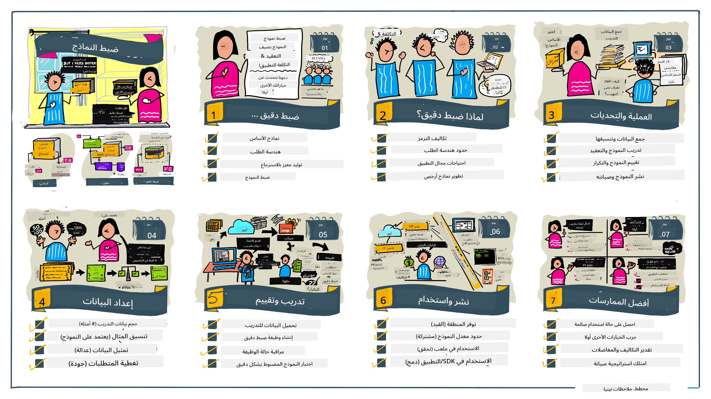

<!--
CO_OP_TRANSLATOR_METADATA:
{
  "original_hash": "68664f7e754a892ae1d8d5e2b7bd2081",
  "translation_date": "2025-05-20T07:36:28+00:00",
  "source_file": "18-fine-tuning/README.md",
  "language_code": "ar"
}
-->

# تحسين النموذج اللغوي الكبير الخاص بك

استخدام النماذج اللغوية الكبيرة لبناء تطبيقات الذكاء الاصطناعي التوليدي يأتي مع تحديات جديدة. المشكلة الرئيسية هي ضمان جودة الاستجابة (الدقة والملاءمة) في المحتوى الذي يولده النموذج لطلب المستخدم المحدد. في الدروس السابقة، ناقشنا تقنيات مثل هندسة التعليمات واسترجاع المعلومات المعزز بالتوليد التي تحاول حل المشكلة عن طريق _تعديل إدخال التعليمات_ للنموذج الحالي.

في درس اليوم، نناقش تقنية ثالثة، **تحسين النموذج**، التي تحاول معالجة التحدي عن طريق _إعادة تدريب النموذج نفسه_ ببيانات إضافية. دعونا نتعمق في التفاصيل.

## أهداف التعلم

يقدم هذا الدرس مفهوم تحسين النموذج للنماذج اللغوية المدربة مسبقًا، ويستكشف فوائد وتحديات هذا النهج، ويوفر إرشادات حول متى وكيفية استخدام تحسين النموذج لتحسين أداء نماذج الذكاء الاصطناعي التوليدي الخاصة بك.

بحلول نهاية هذا الدرس، يجب أن تكون قادرًا على الإجابة على الأسئلة التالية:

- ما هو تحسين النموذج للنماذج اللغوية؟
- متى ولماذا يكون تحسين النموذج مفيدًا؟
- كيف يمكنني تحسين نموذج مدرب مسبقًا؟
- ما هي حدود تحسين النموذج؟

جاهز؟ دعونا نبدأ.

## دليل مصور

هل تريد الحصول على الصورة الكبيرة لما سنغطيه قبل أن نتعمق؟ تحقق من هذا الدليل المصور الذي يصف رحلة التعلم لهذا الدرس - بدءًا من تعلم المفاهيم الأساسية والدافع لتحسين النموذج، إلى فهم العملية والممارسات الأفضل لتنفيذ مهمة تحسين النموذج. هذا موضوع مثير للاستكشاف، لذا لا تنسى الاطلاع على صفحة [الموارد](./RESOURCES.md?WT.mc_id=academic-105485-koreyst) للحصول على روابط إضافية لدعم رحلة التعلم الذاتية الخاصة بك!

## ما هو تحسين النموذج للنماذج اللغوية؟

حسب التعريف، النماذج اللغوية الكبيرة _مدربة مسبقًا_ على كميات كبيرة من النصوص المستمدة من مصادر متنوعة بما في ذلك الإنترنت. كما تعلمنا في الدروس السابقة، نحن بحاجة إلى تقنيات مثل _هندسة التعليمات_ و_التوليد المعزز بالاسترجاع_ لتحسين جودة استجابات النموذج لأسئلة المستخدم ("التعليمات").

تتضمن تقنية هندسة التعليمات الشائعة إعطاء النموذج المزيد من التوجيه حول ما هو متوقع في الاستجابة إما بتقديم _تعليمات_ (توجيه صريح) أو _إعطائه بعض الأمثلة_ (توجيه ضمني). يُشار إلى هذا بـ _التعلم القليل_ ولكن له حدان:

- حدود الرموز في النموذج يمكن أن تقيد عدد الأمثلة التي يمكنك إعطائها، وتحد من الفعالية.
- تكاليف الرموز في النموذج يمكن أن تجعل من المكلف إضافة أمثلة إلى كل تعليم، وتحد من المرونة.

تحسين النموذج هو ممارسة شائعة في أنظمة تعلم الآلة حيث نأخذ نموذجًا مدربًا مسبقًا ونعيد تدريبه ببيانات جديدة لتحسين أدائه في مهمة معينة. في سياق النماذج اللغوية، يمكننا تحسين النموذج المدرب مسبقًا _بمجموعة مختارة من الأمثلة لمهمة معينة أو مجال تطبيق_ لإنشاء **نموذج مخصص** قد يكون أكثر دقة وملاءمة لتلك المهمة أو المجال المحدد. فائدة جانبية لتحسين النموذج هي أنه يمكن أيضًا تقليل عدد الأمثلة المطلوبة للتعلم القليل - مما يقلل من استخدام الرموز والتكاليف المرتبطة.

## متى ولماذا يجب أن نحسن النماذج؟

في _هذا_ السياق، عندما نتحدث عن تحسين النموذج، نشير إلى تحسين النموذج **المشرف عليه** حيث يتم إعادة التدريب عن طريق **إضافة بيانات جديدة** لم تكن جزءًا من مجموعة البيانات الأصلية للتدريب. هذا يختلف عن نهج تحسين النموذج غير المشرف عليه حيث يتم إعادة تدريب النموذج على البيانات الأصلية، ولكن مع معلمات فائقة مختلفة.

الشيء الرئيسي الذي يجب تذكره هو أن تحسين النموذج هو تقنية متقدمة تتطلب مستوى معين من الخبرة للحصول على النتائج المطلوبة. إذا تم تنفيذه بشكل غير صحيح، قد لا يوفر التحسينات المتوقعة، وقد يؤدي حتى إلى تدهور أداء النموذج للمجال المستهدف.

لذلك، قبل أن تتعلم "كيف" تحسن النماذج اللغوية، تحتاج إلى معرفة "لماذا" يجب أن تسلك هذا الطريق، و"متى" تبدأ عملية تحسين النموذج. ابدأ بطرح هذه الأسئلة على نفسك:

- **حالة الاستخدام**: ما هي _حالة الاستخدام_ الخاصة بك لتحسين النموذج؟ ما الجانب الذي ترغب في تحسينه في النموذج المدرب مسبقًا؟
- **البدائل**: هل جربت _تقنيات أخرى_ لتحقيق النتائج المرجوة؟ استخدمها لإنشاء خط أساس للمقارنة.
  - هندسة التعليمات: جرب تقنيات مثل التعليمات القليلة مع أمثلة على استجابات التعليمات ذات الصلة. قم بتقييم جودة الاستجابات.
  - التوليد المعزز بالاسترجاع: جرب تعزيز التعليمات بنتائج الاستعلام المسترجعة عن طريق البحث في بياناتك. قم بتقييم جودة الاستجابات.
- **التكاليف**: هل حددت التكاليف لتحسين النموذج؟
  - قابلية التعديل - هل النموذج المدرب مسبقًا متاح للتحسين؟
  - الجهد - لتحضير بيانات التدريب، وتقييم النموذج وتحسينه.
  - الحساب - لتشغيل وظائف تحسين النموذج، ونشر النموذج المحسن
  - البيانات - الوصول إلى أمثلة ذات جودة كافية لتأثير تحسين النموذج
- **الفوائد**: هل أكدت الفوائد لتحسين النموذج؟
  - الجودة - هل النموذج المحسن يتفوق على خط الأساس؟
  - التكلفة - هل يقلل من استخدام الرموز بتبسيط التعليمات؟
  - القابلية للتوسع - هل يمكنك إعادة استخدام النموذج الأساسي لمجالات جديدة؟

بإجابة هذه الأسئلة، يجب أن تكون قادرًا على تحديد ما إذا كان تحسين النموذج هو النهج الصحيح لحالة الاستخدام الخاصة بك. من الناحية المثالية، يكون النهج صالحًا فقط إذا كانت الفوائد تفوق التكاليف. بمجرد أن تقرر المضي قدمًا، حان الوقت للتفكير في _كيفية_ تحسين النموذج المدرب مسبقًا.

هل تريد الحصول على المزيد من الأفكار حول عملية اتخاذ القرار؟ شاهد [هل يجب تحسين النموذج أم لا](https://www.youtube.com/watch?v=0Jo-z-MFxJs)

## كيف يمكننا تحسين نموذج مدرب مسبقًا؟

لتحسين نموذج مدرب مسبقًا، تحتاج إلى:

- نموذج مدرب مسبقًا لتحسينه
- مجموعة بيانات لاستخدامها في تحسين النموذج
- بيئة تدريب لتشغيل وظيفة تحسين النموذج
- بيئة استضافة لنشر النموذج المحسن

## تحسين النموذج في العمل

توفر الموارد التالية دروسًا خطوة بخطوة لتوجيهك خلال مثال حقيقي باستخدام نموذج محدد مع مجموعة بيانات مختارة. للعمل من خلال هذه الدروس، تحتاج إلى حساب على المزود المحدد، إلى جانب الوصول إلى النموذج والبيانات ذات الصلة.

| المزود       | الدرس                                                                                                                                                                       | الوصف                                                                                                                                                                                                                                                                                                                                                                                                                        |
| ------------ | ------------------------------------------------------------------------------------------------------------------------------------------------------------------------------ | ---------------------------------------------------------------------------------------------------------------------------------------------------------------------------------------------------------------------------------------------------------------------------------------------------------------------------------------------------------------------------------------------------------------------------------- |
| OpenAI       | [كيفية تحسين نماذج الدردشة](https://github.com/openai/openai-cookbook/blob/main/examples/How_to_finetune_chat_models.ipynb?WT.mc_id=academic-105485-koreyst)                | تعلم تحسين نموذج `gpt-35-turbo` لمجال معين ("مساعد الوصفات") عن طريق تحضير بيانات التدريب، تشغيل وظيفة تحسين النموذج، واستخدام النموذج المحسن للاستنتاج.                                                                                                                                                                                                                                              |
| Azure OpenAI | [درس تحسين GPT 3.5 Turbo](https://learn.microsoft.com/azure/ai-services/openai/tutorials/fine-tune?tabs=python-new%2Ccommand-line?WT.mc_id=academic-105485-koreyst) | تعلم تحسين نموذج `gpt-35-turbo-0613` **على Azure** عن طريق اتخاذ خطوات لإنشاء وتحميل بيانات التدريب، تشغيل وظيفة تحسين النموذج. نشر واستخدام النموذج الجديد.                                                                                                                                                                                                                                                                 |
| Hugging Face | [تحسين النماذج اللغوية باستخدام Hugging Face](https://www.philschmid.de/fine-tune-llms-in-2024-with-trl?WT.mc_id=academic-105485-koreyst)                                               | هذا المنشور في المدونة يوجهك لتحسين _نموذج لغوي مفتوح_ (مثل `CodeLlama 7B`) باستخدام مكتبة [transformers](https://huggingface.co/docs/transformers/index?WT.mc_id=academic-105485-koreyst) و[تعلم التعزيز باستخدام المحولات (TRL)](https://huggingface.co/docs/trl/index?WT.mc_id=academic-105485-koreyst]) مع [مجموعات البيانات المفتوحة](https://huggingface.co/docs/datasets/index?WT.mc_id=academic-105485-koreyst) على Hugging Face. |
|              |                                                                                                                                                                                |                                                                                                                                                                                                                                                                                                                                                                                                                                    |
| 🤗 AutoTrain | [تحسين النماذج اللغوية باستخدام AutoTrain](https://github.com/huggingface/autotrain-advanced/?WT.mc_id=academic-105485-koreyst)                                                         | AutoTrain (أو AutoTrain Advanced) هي مكتبة بايثون تم تطويرها بواسطة Hugging Face تتيح تحسين النموذج لمهام متعددة بما في ذلك تحسين النماذج اللغوية. AutoTrain هو حل بدون كود ويمكن تحسين النموذج في السحابة الخاصة بك، على Hugging Face Spaces أو محليًا. يدعم كل من واجهة المستخدم الرسومية المستندة إلى الويب، CLI والتدريب عبر ملفات تكوين yaml.                                                                               |
|              |                                                                                                                                                                                |                                                                                                                                                                                                                                                                                                                                                                                                                                    |

## المهمة

اختر واحدًا من الدروس أعلاه وامشِ من خلاله. _قد نقوم بتكرار نسخة من هذه الدروس في Jupyter Notebooks في هذا المستودع للرجوع إليها فقط. يرجى استخدام المصادر الأصلية مباشرة للحصول على الإصدارات الأحدث_.

## عمل رائع! استمر في التعلم.

بعد إكمال هذا الدرس، تحقق من [مجموعة تعلم الذكاء الاصطناعي التوليدي](https://aka.ms/genai-collection?WT.mc_id=academic-105485-koreyst) لمواصلة تعزيز معرفتك بالذكاء الاصطناعي التوليدي!

تهانينا!! لقد أكملت الدرس النهائي من سلسلة v2 لهذه الدورة! لا تتوقف عن التعلم والبناء. \*\*تحقق من صفحة [الموارد](RESOURCES.md?WT.mc_id=academic-105485-koreyst) للحصول على قائمة بالاقتراحات الإضافية لهذا الموضوع فقط.

تم تحديث سلسلة الدروس v1 أيضًا بمزيد من المهام والمفاهيم. لذا خذ دقيقة لتحديث معرفتك - ويرجى [مشاركة أسئلتك وملاحظاتك](https://github.com/microsoft/generative-ai-for-beginners/issues?WT.mc_id=academic-105485-koreyst) لمساعدتنا في تحسين هذه الدروس للمجتمع.

**إخلاء المسؤولية**:  
تمت ترجمة هذه الوثيقة باستخدام خدمة الترجمة بالذكاء الاصطناعي [Co-op Translator](https://github.com/Azure/co-op-translator). بينما نسعى للدقة، يرجى العلم أن الترجمات الآلية قد تحتوي على أخطاء أو عدم دقة. يجب اعتبار الوثيقة الأصلية بلغتها الأم هي المصدر الموثوق. بالنسبة للمعلومات الحيوية، يُوصى بالترجمة البشرية الاحترافية. نحن غير مسؤولين عن أي سوء فهم أو تفسيرات خاطئة تنشأ عن استخدام هذه الترجمة.