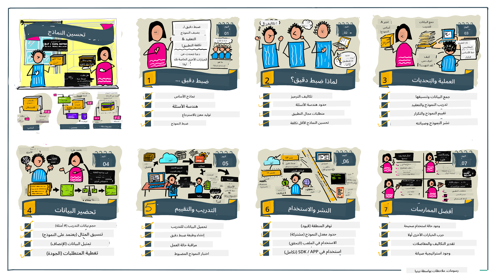

<!--
CO_OP_TRANSLATOR_METADATA:
{
  "original_hash": "68664f7e754a892ae1d8d5e2b7bd2081",
  "translation_date": "2025-06-26T00:31:13+00:00",
  "source_file": "18-fine-tuning/README.md",
  "language_code": "ar"
}
-->

# تحسين النموذج اللغوي الكبير الخاص بك

استخدام النماذج اللغوية الكبيرة لبناء تطبيقات الذكاء الاصطناعي التوليدية يأتي مع تحديات جديدة. تتمثل إحدى القضايا الرئيسية في ضمان جودة الاستجابة (الدقة والملاءمة) في المحتوى الذي يولده النموذج لطلب المستخدم المعطى. في الدروس السابقة، ناقشنا تقنيات مثل هندسة المطالبات والتوليد المعزز بالاسترجاع التي تحاول حل المشكلة عن طريق _تعديل إدخال المطالبة_ للنموذج الحالي.

في درس اليوم، نناقش تقنية ثالثة، **التعديل الدقيق**، التي تحاول معالجة التحدي عن طريق _إعادة تدريب النموذج نفسه_ ببيانات إضافية. دعونا نتعمق في التفاصيل.

## أهداف التعلم

يقدم هذا الدرس مفهوم التعديل الدقيق للنماذج اللغوية المدربة مسبقًا، ويستكشف الفوائد والتحديات لهذا النهج، ويوفر إرشادات حول متى وكيفية استخدام التعديل الدقيق لتحسين أداء نماذج الذكاء الاصطناعي التوليدية الخاصة بك.

بنهاية هذا الدرس، يجب أن تكون قادرًا على الإجابة على الأسئلة التالية:

- ما هو التعديل الدقيق للنماذج اللغوية؟
- متى ولماذا يكون التعديل الدقيق مفيدًا؟
- كيف يمكنني تعديل نموذج مدرب مسبقًا؟
- ما هي قيود التعديل الدقيق؟

جاهز؟ دعونا نبدأ.

## دليل مصور

هل تريد الحصول على الصورة الكبيرة لما سنغطيه قبل أن نتعمق؟ تحقق من هذا الدليل المصور الذي يصف رحلة التعلم لهذا الدرس - من تعلم المفاهيم الأساسية والدافع للتعديل الدقيق، إلى فهم العملية وأفضل الممارسات لتنفيذ مهمة التعديل الدقيق. هذا موضوع رائع للاستكشاف، لذا لا تنسى التحقق من صفحة [الموارد](./RESOURCES.md?WT.mc_id=academic-105485-koreyst) للحصول على روابط إضافية لدعم رحلة التعلم الذاتية الخاصة بك!

## ما هو التعديل الدقيق للنماذج اللغوية؟

بحسب التعريف، النماذج اللغوية الكبيرة هي _مدربة مسبقًا_ على كميات كبيرة من النصوص المستمدة من مصادر متنوعة بما في ذلك الإنترنت. كما تعلمنا في الدروس السابقة، نحتاج إلى تقنيات مثل _هندسة المطالبات_ و _التوليد المعزز بالاسترجاع_ لتحسين جودة استجابات النموذج لأسئلة المستخدم ("المطالبات").

تشمل تقنية هندسة المطالبات الشائعة إعطاء النموذج مزيدًا من التوجيه حول ما هو متوقع في الاستجابة إما عن طريق توفير _تعليمات_ (توجيه صريح) أو _إعطائه بعض الأمثلة_ (توجيه ضمني). يُشار إلى هذا باسم _التعلم بعدد قليل من الأمثلة_ ولكن له حدان:

- يمكن أن تحدد حدود الرموز النموذجية عدد الأمثلة التي يمكنك تقديمها وتحد من الفعالية.
- يمكن أن تجعل تكاليف الرموز النموذجية من المكلف إضافة أمثلة لكل مطالبة، وتحد من المرونة.

التعديل الدقيق هو ممارسة شائعة في أنظمة التعلم الآلي حيث نأخذ نموذجًا مدربًا مسبقًا ونعيد تدريبه ببيانات جديدة لتحسين أدائه في مهمة محددة. في سياق النماذج اللغوية، يمكننا تعديل النموذج المدرب مسبقًا _بمجموعة مختارة من الأمثلة لمهمة معينة أو مجال تطبيق_ لإنشاء **نموذج مخصص** قد يكون أكثر دقة وملاءمة لتلك المهمة المحددة أو المجال. ميزة جانبية للتعديل الدقيق هي أنه يمكن أن يقلل أيضًا من عدد الأمثلة اللازمة للتعلم بعدد قليل من الأمثلة - مما يقلل من استخدام الرموز والتكاليف المرتبطة.

## متى ولماذا يجب علينا تعديل النماذج؟

في _هذا_ السياق، عندما نتحدث عن التعديل الدقيق، نشير إلى التعديل الدقيق **المشرف عليه** حيث يتم إعادة التدريب عن طريق **إضافة بيانات جديدة** لم تكن جزءًا من مجموعة البيانات التدريبية الأصلية. هذا يختلف عن نهج التعديل الدقيق غير المشرف عليه حيث يتم إعادة تدريب النموذج على البيانات الأصلية، ولكن بمعلمات فرعية مختلفة.

الشيء الأساسي الذي يجب تذكره هو أن التعديل الدقيق هو تقنية متقدمة تتطلب مستوى معينًا من الخبرة لتحقيق النتائج المرجوة. إذا تم القيام به بشكل غير صحيح، قد لا يوفر التحسينات المتوقعة، وقد يتسبب حتى في تدهور أداء النموذج للمجال المستهدف.

لذا، قبل أن تتعلم "كيف" تقوم بتعديل النماذج اللغوية، تحتاج إلى معرفة "لماذا" يجب عليك اتباع هذا المسار، و"متى" تبدأ عملية التعديل الدقيق. ابدأ بطرح هذه الأسئلة على نفسك:

- **حالة الاستخدام**: ما هي _حالة الاستخدام_ الخاصة بك للتعديل الدقيق؟ ما هو الجانب من النموذج المدرب مسبقًا الذي تريد تحسينه؟
- **البدائل**: هل جربت _تقنيات أخرى_ لتحقيق النتائج المرجوة؟ استخدمها لإنشاء خط أساس للمقارنة.
  - هندسة المطالبات: جرب تقنيات مثل تقديم مطالبات بعدد قليل من الأمثلة مع أمثلة للاستجابات المناسبة. قيم جودة الاستجابات.
  - التوليد المعزز بالاسترجاع: جرب تعزيز المطالبات بنتائج الاستعلام التي تم استرجاعها من خلال البحث في بياناتك. قيم جودة الاستجابات.
- **التكاليف**: هل حددت التكاليف للتعديل الدقيق؟
  - إمكانية التعديل - هل النموذج المدرب مسبقًا متاح للتعديل؟
  - الجهد - لتحضير بيانات التدريب، تقييم وتكرير النموذج.
  - الحوسبة - لتشغيل وظائف التعديل الدقيق، ونشر النموذج المعدل
  - البيانات - الوصول إلى أمثلة كافية ذات جودة لتأثير التعديل الدقيق
- **الفوائد**: هل أكدت الفوائد للتعديل الدقيق؟
  - الجودة - هل تفوق النموذج المعدل على خط الأساس؟
  - التكلفة - هل يقلل من استخدام الرموز عن طريق تبسيط المطالبات؟
  - الامتداد - هل يمكنك إعادة استخدام النموذج الأساسي لمجالات جديدة؟

بإجابتك على هذه الأسئلة، يجب أن تكون قادرًا على اتخاذ قرار ما إذا كان التعديل الدقيق هو النهج الصحيح لحالة الاستخدام الخاصة بك. من الناحية المثالية، يكون النهج صالحًا فقط إذا كانت الفوائد تفوق التكاليف. بمجرد أن تقرر المتابعة، حان الوقت للتفكير في _كيف_ يمكنك تعديل النموذج المدرب مسبقًا.

هل تريد الحصول على مزيد من الأفكار حول عملية اتخاذ القرار؟ شاهد [التعديل الدقيق أم لا](https://www.youtube.com/watch?v=0Jo-z-MFxJs)

## كيف يمكننا تعديل نموذج مدرب مسبقًا؟

لتعديل نموذج مدرب مسبقًا، تحتاج إلى:

- نموذج مدرب مسبقًا للتعديل
- مجموعة بيانات لاستخدامها في التعديل
- بيئة تدريب لتشغيل وظيفة التعديل
- بيئة استضافة لنشر النموذج المعدل

## التعديل الدقيق في العمل

توفر الموارد التالية دروسًا خطوة بخطوة لتوجيهك خلال مثال حقيقي باستخدام نموذج محدد مع مجموعة بيانات مختارة. للعمل من خلال هذه الدروس، تحتاج إلى حساب على المزود المحدد، بالإضافة إلى الوصول إلى النموذج ومجموعات البيانات ذات الصلة.

| المزود       | الدرس                                                                                                                                                                       | الوصف                                                                                                                                                                                                                                                                                                                                                                                                                        |
| ------------ | --------------------------------------------------------------------------------------------------------------------------------------------------------------------------- | ---------------------------------------------------------------------------------------------------------------------------------------------------------------------------------------------------------------------------------------------------------------------------------------------------------------------------------------------------------------------------------------------------------------------------------- |
| OpenAI       | [كيفية تعديل نماذج المحادثة](https://github.com/openai/openai-cookbook/blob/main/examples/How_to_finetune_chat_models.ipynb?WT.mc_id=academic-105485-koreyst)                | تعلم كيفية تعديل `gpt-35-turbo` لنطاق محدد ("مساعد الوصفات") عن طريق تحضير بيانات التدريب، تشغيل وظيفة التعديل، واستخدام النموذج المعدل للاستدلال.                                                                                                                                                                                                                                              |
| Azure OpenAI | [درس تعديل GPT 3.5 Turbo](https://learn.microsoft.com/azure/ai-services/openai/tutorials/fine-tune?tabs=python-new%2Ccommand-line?WT.mc_id=academic-105485-koreyst) | تعلم كيفية تعديل نموذج `gpt-35-turbo-0613` **على Azure** باتخاذ خطوات لإنشاء وتحميل بيانات التدريب، تشغيل وظيفة التعديل. نشر واستخدام النموذج الجديد.                                                                                                                                                                                                                                                                 |
| Hugging Face | [تعديل النماذج اللغوية الكبيرة باستخدام Hugging Face](https://www.philschmid.de/fine-tune-llms-in-2024-with-trl?WT.mc_id=academic-105485-koreyst)                                               | هذا المنشور يوجهك في تعديل نموذج _LLM مفتوح_ (مثل `CodeLlama 7B`) باستخدام مكتبة [transformers](https://huggingface.co/docs/transformers/index?WT.mc_id=academic-105485-koreyst) و [تعلم التعزيز باستخدام التحويلات (TRL)](https://huggingface.co/docs/trl/index?WT.mc_id=academic-105485-koreyst]) مع مجموعات البيانات المفتوحة [datasets](https://huggingface.co/docs/datasets/index?WT.mc_id=academic-105485-koreyst) على Hugging Face. |
|              |                                                                                                                                                                                |                                                                                                                                                                                                                                                                                                                                                                                                                                    |
| 🤗 AutoTrain | [تعديل النماذج اللغوية الكبيرة باستخدام AutoTrain](https://github.com/huggingface/autotrain-advanced/?WT.mc_id=academic-105485-koreyst)                                                         | AutoTrain (أو AutoTrain Advanced) هي مكتبة بايثون طورتها Hugging Face تسمح بالتعديل للعديد من المهام المختلفة بما في ذلك تعديل النماذج اللغوية الكبيرة. AutoTrain هو حل بدون كود ويمكن تنفيذ التعديل في السحابة الخاصة بك، على Hugging Face Spaces أو محليًا. يدعم كل من واجهة المستخدم الرسومية القائمة على الويب، وCLI والتدريب عبر ملفات تكوين yaml.                                                                               |
|              |                                                                                                                                                                                |                                                                                                                                                                                                                                                                                                                                                                                                                                    |

## المهمة

اختر أحد الدروس أعلاه وقم بتطبيقها. _قد نقوم بتكرار نسخة من هذه الدروس في دفاتر Jupyter في هذا المستودع للرجوع إليها فقط. يرجى استخدام المصادر الأصلية مباشرة للحصول على الإصدارات الأحدث_.

## عمل رائع! استمر في تعلمك.

بعد إكمال هذا الدرس، تحقق من [مجموعة تعلم الذكاء الاصطناعي التوليدي](https://aka.ms/genai-collection?WT.mc_id=academic-105485-koreyst) لمواصلة تحسين معرفتك بالذكاء الاصطناعي التوليدي!

تهانينا!! لقد أكملت الدرس الأخير من السلسلة v2 لهذا الدورة! لا تتوقف عن التعلم والبناء. \*\*تحقق من صفحة [الموارد](RESOURCES.md?WT.mc_id=academic-105485-koreyst) للحصول على قائمة من الاقتراحات الإضافية لهذا الموضوع فقط.

تم تحديث سلسلة الدروس v1 لدينا أيضًا بمزيد من المهام والمفاهيم. لذا خذ دقيقة لتحديث معرفتك - وفضلًا [شارك أسئلتك وملاحظاتك](https://github.com/microsoft/generative-ai-for-beginners/issues?WT.mc_id=academic-105485-koreyst) لمساعدتنا في تحسين هذه الدروس للمجتمع.

**إخلاء المسؤولية**:  
تمت ترجمة هذا المستند باستخدام خدمة الترجمة الآلية [Co-op Translator](https://github.com/Azure/co-op-translator). بينما نسعى للدقة، يرجى العلم أن الترجمات الآلية قد تحتوي على أخطاء أو معلومات غير دقيقة. يجب اعتبار المستند الأصلي بلغته الأصلية هو المصدر الموثوق. للحصول على معلومات حاسمة، يوصى بالترجمة البشرية الاحترافية. نحن غير مسؤولين عن أي سوء فهم أو تفسير خاطئ ناتج عن استخدام هذه الترجمة.