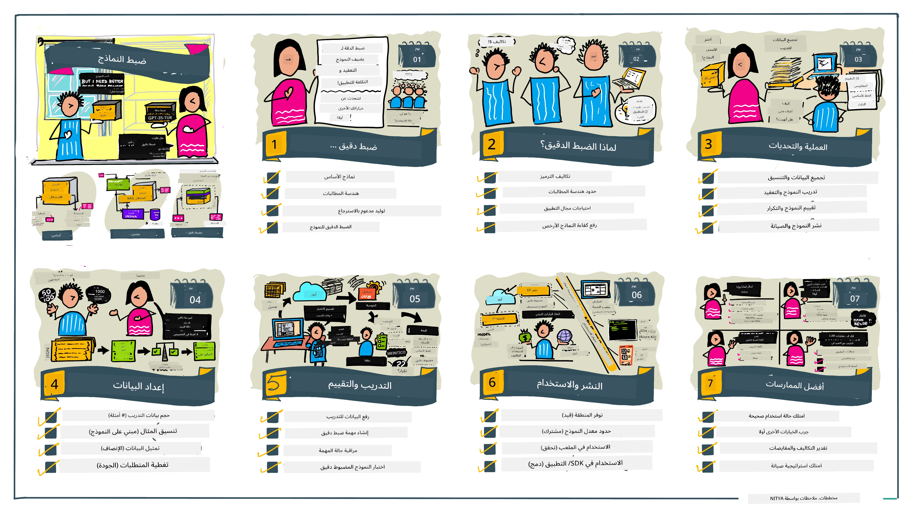

# ضبط نماذج اللغة الكبيرة الخاص بك

استخدام نماذج اللغة الكبيرة لبناء تطبيقات الذكاء الاصطناعي التوليدية يأتي مع تحديات جديدة. القضية الرئيسية هي ضمان جودة الاستجابة (الدقة والملاءمة) في المحتوى الذي يولده النموذج لطلب المستخدم المعين. في الدروس السابقة، ناقشنا تقنيات مثل هندسة التعليمات وتوليد معزز بالاستخراج التي تحاول حل المشكلة عن طريق _تعديل مدخلات التعليمات_ للنموذج الحالي.

في درس اليوم، نناقش تقنية ثالثة، **الضبط الدقيق**، التي تحاول معالجة التحدي عن طريق _إعادة تدريب النموذج نفسه_ ببيانات إضافية. هيا نغوص في التفاصيل.

## أهداف التعلم

يقدم هذا الدرس مفهوم الضبط الدقيق لنماذج اللغة المدربة مسبقًا، ويستعرض فوائد وتحديات هذه الطريقة، ويوفر إرشادات حول متى وكيفية استخدام الضبط الدقيق لتحسين أداء نماذج الذكاء الاصطناعي التوليدية الخاصة بك.

بنهاية هذا الدرس، ينبغي أن تكون قادرًا على الإجابة على الأسئلة التالية:

- ما هو الضبط الدقيق لنماذج اللغة؟
- متى ولماذا يكون الضبط الدقيق مفيدًا؟
- كيف يمكنني ضبط نموذج مدرب مسبقًا بشكل دقيق؟
- ما هي قيود الضبط الدقيق؟

هل أنت مستعد؟ لنبدأ.

## الدليل المصور

هل ترغب في الحصول على صورة شاملة لما سنغطيه قبل الغوص في التفاصيل؟ تحقق من هذا الدليل المصور الذي يصف رحلة التعلم لهذا الدرس - من فهم المفاهيم الأساسية والدوافع للضبط الدقيق، إلى فهم العملية وأفضل الممارسات لتنفيذ مهمة الضبط الدقيق. هذا موضوع شيق للاستكشاف، فلا تنس التحقق من صفحة [الموارد](./RESOURCES.md?WT.mc_id=academic-105485-koreyst) للحصول على روابط إضافية تدعم رحلة التعلم الذاتية الخاصة بك!

## ما هو الضبط الدقيق لنماذج اللغة؟

بحسب التعريف، نماذج اللغة الكبيرة هي _مدربة مسبقًا_ على كميات كبيرة من النصوص المأخوذة من مصادر متنوعة بما في ذلك الإنترنت. كما تعلمنا في الدروس السابقة، نحتاج إلى تقنيات مثل _هندسة التعليمات_ و _التوليد المعزز بالاستخراج_ لتحسين جودة ردود النموذج على أسئلة المستخدم ("التعليمات").

تقنية شائعة في هندسة التعليمات تتضمن إعطاء النموذج مزيدًا من التوجيه حول ما هو متوقع في الرد إما بتوفير _تعليمات_ (توجيه صريح) أو _تقديم بعض الأمثلة_ (توجيه ضمني). يُشار إلى هذا باسم _التعلم باستخدام عدد قليل من الأمثلة_ ولكنه يحتوي على حدين:

- حدود الرموز في النموذج يمكن أن تقيد عدد الأمثلة التي يمكنك تقديمها، وتحد من الفعالية.
- تكلفة الرموز في النموذج قد تجعل من المكلف إضافة أمثلة لكل طلب، مما يحد من المرونة.

الضبط الدقيق هو ممارسة شائعة في أنظمة تعلم الآلة حيث نأخذ نموذجًا مدربًا مسبقًا ونعيد تدريبه ببيانات جديدة لتحسين أدائه في مهمة محددة. في سياق نماذج اللغة، يمكننا ضبط النموذج المدرب مسبقًا _بمجموعة منظمة من الأمثلة لمهمة أو مجال تطبيقي معين_ لإنشاء **نموذج مخصص** قد يكون أكثر دقة وملاءمة لتلك المهمة أو المجال المحدد. فائدة جانبية للضبط الدقيق هي أنه يمكن أيضًا تقليل عدد الأمثلة المطلوبة للتعلم باستخدام عدد قليل من الأمثلة - مما يقلل من استخدام الرموز والتكاليف ذات الصلة.

## متى ولماذا يجب علينا ضبط النماذج بدقة؟

في _هذا_ السياق، حين نتحدث عن الضبط الدقيق، فإننا نشير إلى الضبط الدقيق **المراقب** حيث يتم إعادة التدريب عن طريق **إضافة بيانات جديدة** لم تكن جزءًا من مجموعة بيانات التدريب الأصلية. وهذا يختلف عن نهج الضبط الدقيق غير المراقب حيث يعاد تدريب النموذج على البيانات الأصلية، لكن مع معلمات فرعية مختلفة.

الأمر الرئيسي الذي يجب تذكره هو أن الضبط الدقيق تقنية متقدمة تتطلب مستوى معين من الخبرة للحصول على النتائج المطلوبة. إذا تم بشكل غير صحيح، قد لا يوفر التحسينات المتوقعة، وقد يضعف أداء النموذج في المجال المستهدف.

لذا قبل أن تتعلم "كيف" تضبط نماذج اللغة، تحتاج إلى معرفة "لماذا" يجب أن تسلك هذا الطريق، و"متى" تبدأ عملية الضبط الدقيق. ابدأ بطرح هذه الأسئلة على نفسك:

- **حالة الاستخدام**: ما هي _حالة الاستخدام_ الخاصة بك للضبط الدقيق؟ ما الجانب الذي تريد تحسينه في النموذج المدرب مسبقًا الحالي؟
- **البدائل**: هل جربت _تقنيات أخرى_ لتحقيق النتائج المرغوبة؟ استخدمها لإنشاء قاعدة للمقارنة.
  - هندسة التعليمات: جرب تقنيات مثل تقديم أمثلة قليلة للردود ذات الصلة، وقيم جودة الردود.
  - التوليد المعزز بالاستخراج: جرب تعزيز التعليمات بنتائج استعلام يتم استرجاعها عبر البحث في بياناتك. قيم جودة الردود.
- **التكاليف**: هل حددت التكاليف المتعلقة بالضبط الدقيق؟
  - قابلية التوليف - هل النموذج المدرب مسبقًا متاح للضبط الدقيق؟
  - الجهد - لإعداد بيانات التدريب، وتقييم وتحسين النموذج.
  - الحوسبة - لتشغيل مهام الضبط الدقيق ونشر النموذج المضبوط.
  - البيانات - توفر أمثلة بجودة كافية لتأثير الضبط الدقيق.
- **الفوائد**: هل أكدت فوائد الضبط الدقيق؟
  - الجودة - هل تفوق النموذج المضبوط دقة النموذج الأساسي؟
  - التكلفة - هل يقلل من استخدام الرموز بتبسيط التعليمات؟
  - قابلية التوسع - هل يمكنك إعادة استخدام النموذج الأساسي لمجالات جديدة؟

بمجرد الإجابة عن هذه الأسئلة، يجب أن تكون قادرًا على اتخاذ قرار ما إذا كان الضبط الدقيق هو النهج الصحيح لحالة استخدامك. من الناحية المثالية، يكون النهج صالحًا فقط إذا فاقت الفوائد التكاليف. وبمجرد أن تقرر المتابعة، حان الوقت للتفكير في _كيفية_ ضبط النموذج المدرب مسبقًا.

هل تريد المزيد من الأفكار حول عملية اتخاذ القرار؟ شاهد [هل تضبط بدقة أم لا؟](https://www.youtube.com/watch?v=0Jo-z-MFxJs)

## كيف يمكننا ضبط نموذج مدرب مسبقًا؟

لضبط نموذج مدرب مسبقًا، تحتاج إلى:

- نموذج مدرب مسبقًا للضبط.
- مجموعة بيانات لاستخدامها في الضبط.
- بيئة تدريب لتشغيل مهمة الضبط.
- بيئة استضافة لنشر النموذج المضبوط.

## الضبط الدقيق في التطبيق

الموارد التالية توفر دروسًا خطوة بخطوة لترشدك خلال مثال حقيقي باستخدام نموذج مختار مع مجموعة بيانات منظمة. للعمل على هذه الدروس، ستحتاج إلى حساب لدى المزود المحدد، بالإضافة إلى وصول للنموذج والبيانات ذات الصلة.

| المزود       | الدرس                                                                                                                                                                         | الوصف                                                                                                                                                                                                                                                                                                                                                                                                                              |
| ------------ | ---------------------------------------------------------------------------------------------------------------------------------------------------------------------------- | ---------------------------------------------------------------------------------------------------------------------------------------------------------------------------------------------------------------------------------------------------------------------------------------------------------------------------------------------------------------------------------------------------------------------------------- |
| OpenAI       | [كيفية ضبط نماذج الدردشة بدقة](https://github.com/openai/openai-cookbook/blob/main/examples/How_to_finetune_chat_models.ipynb?WT.mc_id=academic-105485-koreyst)                | تعلّم كيفية ضبط نموذج `gpt-35-turbo` لمجال معين ("مساعد وصفات") بإعداد بيانات التدريب، وتشغيل مهمة الضبط، واستخدام النموذج المضبوط للاستدلال.                                                                                                                                                                                                                                           |
| Azure OpenAI | [درس ضبط دقيق لـ GPT 3.5 Turbo](https://learn.microsoft.com/azure/ai-services/openai/tutorials/fine-tune?tabs=python-new%2Ccommand-line&WT.mc_id=academic-105485-koreyst)       | تعلّم ضبط نموذج `gpt-35-turbo-0613` **على أزور** باتباع خطوات لإنشاء وتحميل بيانات التدريب، تشغيل مهمة الضبط، ونشر النموذج الجديد واستخدامه.                                                                                                                                                                                                                                                                                            |
| Hugging Face | [ضبط نماذج اللغة الكبيرة باستخدام Hugging Face](https://www.philschmid.de/fine-tune-llms-in-2024-with-trl?WT.mc_id=academic-105485-koreyst)                               | يقدم هذا المقال كيفية ضبط نموذج _LLM مفتوح_ (مثل `CodeLlama 7B`) باستخدام مكتبة [transformers](https://huggingface.co/docs/transformers/index?WT.mc_id=academic-105485-koreyst) و [Transformer Reinforcement Learning (TRL)](https://huggingface.co/docs/trl/index?WT.mc_id=academic-105485-koreyst) مع [مجموعات بيانات](https://huggingface.co/docs/datasets/index?WT.mc_id=academic-105485-koreyst) مفتوحة على Hugging Face. |
|              |                                                                                                                                                                              |                                                                                                                                                                                                                                                                                                                                                                                                                                    |
| 🤗 AutoTrain | [ضبط نماذج اللغة الكبيرة باستخدام AutoTrain](https://github.com/huggingface/autotrain-advanced/?WT.mc_id=academic-105485-koreyst)                                         | AutoTrain (أو AutoTrain Advanced) هي مكتبة بايثون طورتها Hugging Face تسمح بضبط العديد من المهام المختلفة بما في ذلك ضبط LLM. AutoTrain هو حل بدون كود ويمكن تنفيذ الضبط في السحابة الخاصة بك، أو على Hugging Face Spaces أو محليًا. يدعم واجهة مستخدم ويب، وسطر الأوامر، والتدريب عبر ملفات تكوين yaml.                                                                                                                |
|              |                                                                                                                                                                              |                                                                                                                                                                                                                                                                                                                                                                                                                                    |
| 🦥 Unsloth   | [ضبط نماذج اللغة الكبيرة باستخدام Unsloth](https://github.com/unslothai/unsloth)                                                                                           | Unsloth هو إطار عمل مفتوح المصدر يدعم الضبط الدقيق لنماذج LLM والتعلم التعزيزي (RL). يسهل Unsloth التدريب المحلي، والتقييم، والنشر من خلال دفاتر [جاهزة للإستخدام](https://github.com/unslothai/notebooks). كما يدعم تحويل النص إلى كلام (TTS)، ونماذج BERT، والنماذج متعددة الوسائط. للبدء، اقرأ دليل [الضبط الدقيق لنماذج LLM](https://docs.unsloth.ai/get-started/fine-tuning-llms-guide) خطوة بخطوة.         |
|              |                                                                                                                                                                              |                                                                                                                                                                                                                                                                                                                                                                                                                                    |
## الواجب

اختر أحد الدروس أعلاه وابدأ في متابعتها. _قد نقوم بتكرار نسخة من هذه الدروس في دفاتر Jupyter في هذا المستودع للرجوع فقط. يرجى استخدام المصادر الأصلية مباشرة للحصول على أحدث الإصدارات_.

## عمل رائع! واصل التعلم.

بعد إكمال هذا الدرس، تحقق من مجموعة [تعلم الذكاء الاصطناعي التوليدي](https://aka.ms/genai-collection?WT.mc_id=academic-105485-koreyst) لمواصلة رفع مستوى معرفتك بالذكاء الاصطناعي التوليدي!

تهانينا!! لقد أكملت الدرس النهائي من سلسلة النسخة الثانية لهذا المساق! لا تتوقف عن التعلم والبناء. \*\*تحقق من صفحة [الموارد](RESOURCES.md?WT.mc_id=academic-105485-koreyst) لقائمة اقتراحات إضافية لموضوعات فقط.

تم تحديث سلسلة الدروس الخاصة بالنسخة الأولى أيضًا مع المزيد من الواجبات والمفاهيم. لذا خذ دقيقة لتجديد معرفتك - ويرجى [مشاركة أسئلتك وتعليقاتك](https://github.com/microsoft/generative-ai-for-beginners/issues?WT.mc_id=academic-105485-koreyst) لمساعدتنا على تحسين هذه الدروس للمجتمع.

---

<!-- CO-OP TRANSLATOR DISCLAIMER START -->
**تنبيه**:  
تمت ترجمة هذا المستند باستخدام خدمة الترجمة الآلية [Co-op Translator](https://github.com/Azure/co-op-translator). رغم أننا نسعى لتحقيق الدقة، يرجى العلم بأن الترجمات الآلية قد تحتوي على أخطاء أو عدم دقة. يجب اعتبار المستند الأصلي بلغته الأصلية المصدر الرسمي والمعتمد. بالنسبة للمعلومات الحيوية، يُنصح بالاستعانة بترجمة بشرية محترفة. نحن غير مسؤولين عن أي سوء فهم أو تفسير ناتج عن استخدام هذه الترجمة.
<!-- CO-OP TRANSLATOR DISCLAIMER END -->