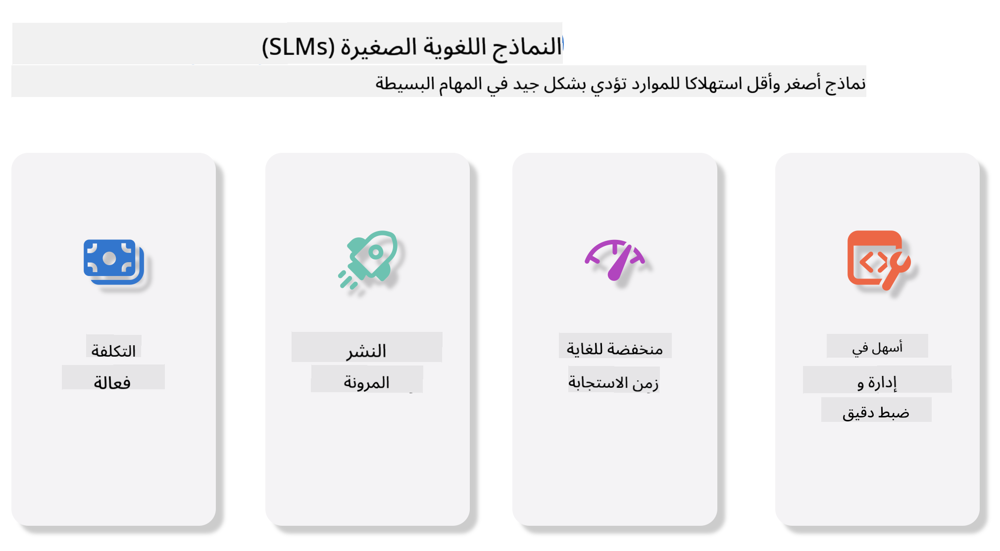
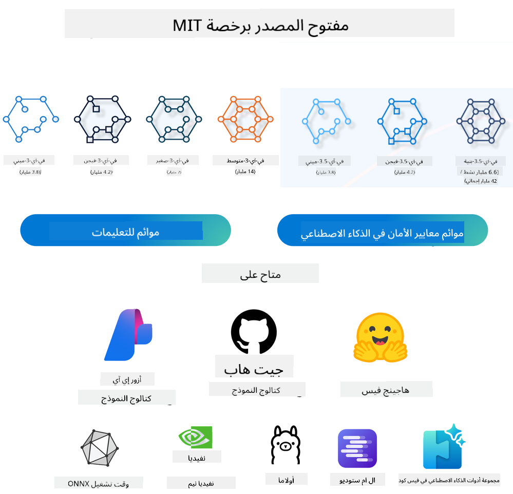
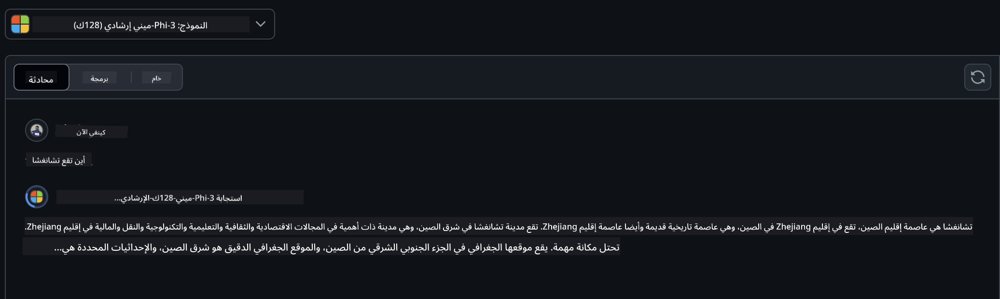
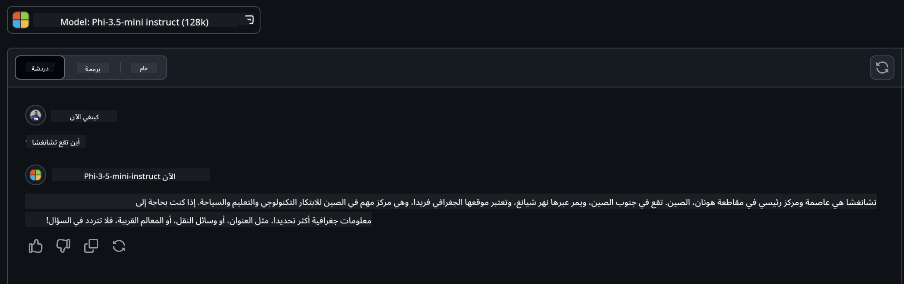

<!--
CO_OP_TRANSLATOR_METADATA:
{
  "original_hash": "124ad36cfe96f74038811b6e2bb93e9d",
  "translation_date": "2025-05-20T09:04:54+00:00",
  "source_file": "19-slm/README.md",
  "language_code": "ar"
}
-->
# مقدمة إلى نماذج اللغة الصغيرة للذكاء الاصطناعي التوليدي للمبتدئين

الذكاء الاصطناعي التوليدي هو مجال مثير في الذكاء الاصطناعي يركز على إنشاء أنظمة قادرة على إنتاج محتوى جديد. يمكن أن يتراوح هذا المحتوى من النصوص والصور إلى الموسيقى وحتى البيئات الافتراضية الكاملة. واحدة من التطبيقات الأكثر إثارة للذكاء الاصطناعي التوليدي هي في مجال نماذج اللغة.

## ما هي نماذج اللغة الصغيرة؟

تمثل نماذج اللغة الصغيرة (SLM) نسخة مصغرة من نماذج اللغة الكبيرة (LLM)، تعتمد على العديد من المبادئ المعمارية والتقنيات الخاصة بـ LLMs، بينما تعرض بصمة حسابية منخفضة بشكل كبير. تعد SLMs مجموعة فرعية من نماذج اللغة المصممة لإنشاء نص يشبه النص البشري. على عكس نظيراتها الأكبر، مثل GPT-4، فإن SLMs أكثر كفاءة وملاءمة، مما يجعلها مثالية للتطبيقات حيث تكون الموارد الحاسوبية محدودة. على الرغم من حجمها الأصغر، يمكنها أداء مجموعة متنوعة من المهام. عادةً ما يتم إنشاء SLMs عن طريق ضغط أو تقطير LLMs، بهدف الاحتفاظ بجزء كبير من وظائف النموذج الأصلي وقدراته اللغوية. يقلل هذا التخفيض في حجم النموذج من التعقيد العام، مما يجعل SLMs أكثر كفاءة من حيث استخدام الذاكرة ومتطلبات الحساب. على الرغم من هذه التحسينات، يمكن لـ SLMs أداء مجموعة واسعة من مهام معالجة اللغة الطبيعية (NLP):

- إنشاء النص: إنشاء جمل أو فقرات متماسكة وذات صلة بالسياق.
- إكمال النص: التنبؤ وإكمال الجمل بناءً على موجه معين.
- الترجمة: تحويل النص من لغة إلى أخرى.
- التلخيص: تكثيف النصوص الطويلة إلى ملخصات أقصر وأكثر قابلية للهضم.

ومع ذلك، قد يكون هناك بعض التنازلات في الأداء أو عمق الفهم مقارنة بنظيراتها الأكبر.

## كيف تعمل نماذج اللغة الصغيرة؟

يتم تدريب SLMs على كميات كبيرة من بيانات النصوص. خلال التدريب، تتعلم الأنماط والهياكل اللغوية، مما يمكنها من إنتاج نص صحيح نحويًا ومناسب سياقيًا. تتضمن عملية التدريب:

- جمع البيانات: جمع مجموعات كبيرة من النصوص من مصادر مختلفة.
- المعالجة المسبقة: تنظيف وتنظيم البيانات لجعلها مناسبة للتدريب.
- التدريب: استخدام خوارزميات التعلم الآلي لتعليم النموذج كيفية فهم وإنشاء النص.
- التحسين الدقيق: تعديل النموذج لتحسين أدائه في مهام معينة.

يتماشى تطوير SLMs مع الحاجة المتزايدة للنماذج التي يمكن نشرها في بيئات ذات موارد محدودة، مثل الأجهزة المحمولة أو منصات الحوسبة الطرفية، حيث قد تكون LLMs ذات النطاق الكامل غير عملية بسبب متطلبات الموارد الثقيلة. من خلال التركيز على الكفاءة، توازن SLMs بين الأداء وإمكانية الوصول، مما يتيح تطبيقًا أوسع عبر مختلف المجالات.



## أهداف التعلم

في هذا الدرس، نأمل في تقديم معرفة SLM وربطها مع Microsoft Phi-3 لتعلم سيناريوهات مختلفة في محتوى النص والرؤية وMoE. بنهاية هذا الدرس، يجب أن تكون قادرًا على الإجابة على الأسئلة التالية:

- ما هو SLM
- ما هو الفرق بين SLM وLLM
- ما هو Microsoft Phi-3/3.5 Family
- كيفية الاستدلال باستخدام Microsoft Phi-3/3.5 Family

جاهز؟ لنبدأ.

## الفروقات بين نماذج اللغة الكبيرة (LLMs) ونماذج اللغة الصغيرة (SLMs)

تم بناء كل من LLMs وSLMs على مبادئ أساسية في التعلم الآلي الاحتمالي، باتباع نهج مماثل في تصميمها المعماري، وطرق التدريب، وعمليات توليد البيانات، وتقنيات تقييم النموذج. ومع ذلك، هناك عدة عوامل رئيسية تميز بين هذين النوعين من النماذج.

## تطبيقات نماذج اللغة الصغيرة

لدى SLMs مجموعة واسعة من التطبيقات، بما في ذلك:

- روبوتات الدردشة: تقديم دعم العملاء والتفاعل مع المستخدمين بطريقة محادثة.
- إنشاء المحتوى: مساعدة الكتاب في توليد الأفكار أو حتى صياغة مقالات كاملة.
- التعليم: مساعدة الطلاب في مهام الكتابة أو تعلم لغات جديدة.
- الوصول: إنشاء أدوات للأفراد ذوي الإعاقة، مثل أنظمة تحويل النص إلى كلام.

**الحجم**

يكمن الفرق الأساسي بين LLMs وSLMs في حجم النماذج. يمكن أن تتكون LLMs، مثل ChatGPT (GPT-4)، من حوالي 1.76 تريليون من المعلمات، بينما تم تصميم SLMs مفتوحة المصدر مثل Mistral 7B بعدد أقل بكثير من المعلمات - حوالي 7 مليارات. يعود هذا التفاوت أساسًا إلى الاختلافات في بنية النموذج وعمليات التدريب. على سبيل المثال، يستخدم ChatGPT آلية الاهتمام الذاتي ضمن إطار عمل الترميز-الفك، بينما يستخدم Mistral 7B اهتمام نافذة منزلقة، مما يتيح تدريبًا أكثر كفاءة ضمن نموذج فك فقط. لهذا التفاوت المعماري تأثيرات عميقة على تعقيد وأداء هذه النماذج.

**الفهم**

عادةً ما يتم تحسين SLMs للأداء ضمن مجالات محددة، مما يجعلها متخصصة للغاية ولكنها قد تكون محدودة في قدرتها على توفير فهم سياقي واسع عبر مجالات متعددة من المعرفة. في المقابل، تهدف LLMs إلى محاكاة الذكاء البشري على مستوى أكثر شمولية. تم تدريبها على مجموعات بيانات ضخمة ومتنوعة، وتم تصميمها لتعمل بشكل جيد عبر مجموعة متنوعة من المجالات، مما يوفر تنوعًا وتكيفًا أكبر. وبالتالي، فإن LLMs أكثر ملاءمة لمجموعة واسعة من المهام اللاحقة، مثل معالجة اللغة الطبيعية والبرمجة.

**الحوسبة**

تعتبر عمليات تدريب ونشر LLMs عمليات مكثفة من حيث الموارد، وغالبًا ما تتطلب بنية تحتية حسابية كبيرة، بما في ذلك مجموعات GPU واسعة النطاق. على سبيل المثال، قد يتطلب تدريب نموذج مثل ChatGPT من البداية آلاف وحدات معالجة الرسوميات على مدار فترات طويلة. في المقابل، تكون SLMs، بعدد معلماتها الأصغر، أكثر سهولة من حيث الموارد الحاسوبية. يمكن تدريب نماذج مثل Mistral 7B وتشغيلها على أجهزة محلية مزودة بقدرات GPU متوسطة، على الرغم من أن التدريب لا يزال يتطلب عدة ساعات عبر وحدات معالجة الرسوميات متعددة.

**التحيز**

التحيز هو مشكلة معروفة في LLMs، ويرجع ذلك أساسًا إلى طبيعة بيانات التدريب. تعتمد هذه النماذج غالبًا على بيانات خام متاحة بشكل مفتوح من الإنترنت، والتي قد تمثل بشكل غير كاف أو خاطئ مجموعات معينة، أو تقدم تصنيفًا خاطئًا، أو تعكس تحيزات لغوية متأثرة باللهجة، والتغيرات الجغرافية، والقواعد النحوية. بالإضافة إلى ذلك، يمكن أن تعزز تعقيد هياكل LLMs بشكل غير مقصود التحيز، والذي قد يمر دون أن يلاحظ دون تحسين دقيق. من ناحية أخرى، تكون SLMs، التي تم تدريبها على مجموعات بيانات أكثر تقييدًا ومحددة النطاق، أقل عرضة لمثل هذه التحيزات، على الرغم من أنها ليست محصنة منها.

**الاستدلال**

يوفر الحجم المنخفض لـ SLMs ميزة كبيرة من حيث سرعة الاستدلال، مما يسمح لها بتوليد النتائج بكفاءة على الأجهزة المحلية دون الحاجة إلى معالجة متوازية واسعة النطاق. في المقابل، تتطلب LLMs، بسبب حجمها وتعقيدها، غالبًا موارد حسابية متوازية كبيرة لتحقيق أوقات استدلال مقبولة. يؤدي وجود العديد من المستخدمين المتزامنين إلى إبطاء أوقات استجابة LLMs بشكل أكبر، خاصة عند نشرها على نطاق واسع.

باختصار، على الرغم من أن كل من LLMs وSLMs يشتركان في أساسيات التعلم الآلي، إلا أنهما يختلفان بشكل كبير من حيث حجم النموذج، ومتطلبات الموارد، وفهم السياق، والقدرة على التحيز، وسرعة الاستدلال. تعكس هذه الفروقات ملاءمتها للاستخدامات المختلفة، حيث تكون LLMs أكثر تنوعًا ولكنها ثقيلة الموارد، وSLMs تقدم كفاءة أكثر تحديدًا في النطاق مع متطلبات حسابية منخفضة.

***ملاحظة: في هذا الفصل، سنقدم SLM باستخدام Microsoft Phi-3 / 3.5 كمثال.***

## تقديم عائلة Phi-3 / Phi-3.5

تستهدف عائلة Phi-3 / 3.5 بشكل رئيسي سيناريوهات التطبيقات النصية والرؤية والوكيل (MoE):

### Phi-3 / 3.5 Instruct

أساسًا لإنشاء النصوص، إكمال الدردشة، واستخراج معلومات المحتوى، إلخ.

**Phi-3-mini**

نموذج اللغة 3.8B متاح على Microsoft Azure AI Studio، Hugging Face، وOllama. تتفوق نماذج Phi-3 بشكل كبير على نماذج اللغة من نفس الحجم والأكبر في المعايير الرئيسية (راجع أرقام المعايير أدناه، الأرقام الأعلى أفضل). يتفوق Phi-3-mini على نماذج ضعف حجمه، بينما يتفوق Phi-3-small وPhi-3-medium على النماذج الأكبر، بما في ذلك GPT-3.5

**Phi-3-small & medium**

مع 7 مليارات فقط من المعلمات، يتفوق Phi-3-small على GPT-3.5T في مجموعة متنوعة من معايير اللغة، التفكير، البرمجة، والرياضيات. يستمر Phi-3-medium مع 14 مليار معلمات في هذا الاتجاه ويتفوق على Gemini 1.0 Pro.

**Phi-3.5-mini**

يمكن اعتبارها ترقية لـ Phi-3-mini. بينما تظل المعلمات دون تغيير، فإنها تحسن القدرة على دعم لغات متعددة (دعم 20+ لغة: العربية، الصينية، التشيكية، الدنماركية، الهولندية، الإنجليزية، الفنلندية، الفرنسية، الألمانية، العبرية، المجرية، الإيطالية، اليابانية، الكورية، النرويجية، البولندية، البرتغالية، الروسية، الإسبانية، السويدية، التايلاندية، التركية، الأوكرانية) وتضيف دعمًا أقوى للسياق الطويل. يتفوق Phi-3.5-mini مع 3.8 مليار معلمات على نماذج اللغة من نفس الحجم ويتساوى مع نماذج ضعف حجمه.

### Phi-3 / 3.5 Vision

يمكن اعتبار نموذج Instruct لـ Phi-3/3.5 كقدرة Phi على الفهم، والرؤية هي ما يمنح Phi عيونًا لفهم العالم.

**Phi-3-Vision**

يستمر Phi-3-vision، مع 4.2 مليار معلمات فقط، في هذا الاتجاه ويتفوق على نماذج أكبر مثل Claude-3 Haiku وGemini 1.0 Pro V في مهام التفكير البصري العامة، التعرف على النصوص، وفهم الجداول والرسوم البيانية.

**Phi-3.5-Vision**

يعد Phi-3.5-Vision أيضًا ترقية لـ Phi-3-Vision، مضيفًا دعمًا لصور متعددة. يمكنك اعتباره تحسينًا في الرؤية، ليس فقط لرؤية الصور، ولكن أيضًا الفيديوهات. يتفوق Phi-3.5-vision على نماذج أكبر مثل Claude-3.5 Sonnet وGemini 1.5 Flash عبر مهام فهم النصوص، الجداول والرسوم البيانية وعلى قدم المساواة في مهام التفكير المعرفي البصري العام. يدعم إدخال متعدد الإطارات، أي إجراء التفكير على صور إدخال متعددة.

### Phi-3.5-MoE

***مزيج من الخبراء (MoE)*** يمكّن النماذج من أن يتم تدريبها مسبقًا مع حوسبة أقل بكثير، مما يعني أنه يمكنك توسيع حجم النموذج أو حجم مجموعة البيانات بشكل كبير بنفس ميزانية الحوسبة كنموذج كثيف. على وجه الخصوص، يجب أن يحقق نموذج MoE نفس الجودة كنظيره الكثيف بشكل أسرع بكثير خلال التدريب المسبق. يتكون Phi-3.5-MoE من 16x3.8B وحدات خبراء. يحقق Phi-3.5-MoE مع 6.6 مليار معلمات نشطة فقط مستوى مشابه من التفكير، وفهم اللغة، والرياضيات كنماذج أكبر بكثير

يمكننا استخدام نموذج عائلة Phi-3/3.5 بناءً على سيناريوهات مختلفة. على عكس LLM، يمكنك نشر Phi-3/3.5-mini أو Phi-3/3.5-Vision على الأجهزة الطرفية.

## كيفية استخدام نماذج عائلة Phi-3/3.5

نأمل في استخدام Phi-3/3.5 في سيناريوهات مختلفة. بعد ذلك، سنستخدم Phi-3/3.5 بناءً على سيناريوهات مختلفة.



### الفرق في الاستدلال

API السحابة

**نماذج GitHub**

GitHub
النماذج هي الطريقة الأكثر مباشرة. يمكنك الوصول بسرعة إلى نموذج Phi-3/3.5-Instruct من خلال نماذج GitHub. بالتعاون مع Azure AI Inference SDK / OpenAI SDK، يمكنك الوصول إلى API عبر الكود لإكمال استدعاء Phi-3/3.5-Instruct. يمكنك أيضًا اختبار تأثيرات مختلفة من خلال Playground. - العرض التوضيحي: مقارنة تأثيرات Phi-3-mini و Phi-3.5-mini في السيناريوهات الصينية   **استوديو Azure AI** أو إذا أردنا استخدام نماذج الرؤية و MoE، يمكنك استخدام استوديو Azure AI لإكمال الاستدعاء. إذا كنت مهتمًا، يمكنك قراءة Phi-3 Cookbook لتتعلم كيفية استدعاء Phi-3/3.5 Instruct, Vision, MoE من خلال استوديو Azure AI [انقر على هذا الرابط](https://github.com/microsoft/Phi-3CookBook/blob/main/md/02.QuickStart/AzureAIStudio_QuickStart.md?WT.mc_id=academic-105485-koreyst) **NVIDIA NIM** بالإضافة إلى حلول كتالوج النماذج القائمة على السحابة المقدمة من Azure و GitHub، يمكنك أيضًا استخدام [Nivida NIM](https://developer.nvidia.com/nim?WT.mc_id=academic-105485-koreyst) لإكمال الاستدعاءات ذات الصلة. يمكنك زيارة NIVIDA NIM لإكمال استدعاءات API لعائلة Phi-3/3.5. NVIDIA NIM (NVIDIA Inference Microservices) هي مجموعة من خدمات الاستدلال المسرعة المصممة لمساعدة المطورين في نشر نماذج الذكاء الاصطناعي بكفاءة عبر بيئات مختلفة، بما في ذلك السحب، ومراكز البيانات، ومحطات العمل. إليك بعض الميزات الرئيسية لـ NVIDIA NIM: - **سهولة النشر:** يسمح NIM بنشر نماذج الذكاء الاصطناعي بأمر واحد، مما يجعله سهل التكامل في سير العمل الحالي. - **الأداء المحسن:** يستفيد من محركات الاستدلال المحسنة مسبقًا من NVIDIA، مثل TensorRT و TensorRT-LLM، لضمان انخفاض زمن الوصول وارتفاع الإنتاجية. - **قابلية التوسع:** يدعم NIM التوسع التلقائي على Kubernetes، مما يمكنه من التعامل مع أحمال العمل المتغيرة بفعالية. - **الأمان والتحكم:** يمكن للمنظمات الحفاظ على السيطرة على بياناتها وتطبيقاتها من خلال استضافة خدمات NIM الصغيرة ذاتيًا على بنيتها التحتية المدارة الخاصة بها. - **واجهات برمجة التطبيقات القياسية:** يوفر NIM واجهات برمجة التطبيقات القياسية في الصناعة، مما يجعل من السهل بناء وتكامل تطبيقات الذكاء الاصطناعي مثل الدردشة، والمساعدين الذكاء الاصطناعي، والمزيد. NIM جزء من NVIDIA AI Enterprise، الذي يهدف إلى تبسيط نشر وتشغيل نماذج الذكاء الاصطناعي، مما يضمن تشغيلها بكفاءة على وحدات معالجة الرسوميات من NVIDIA. - العرض التوضيحي: استخدام Nividia NIM لاستدعاء Phi-3.5-Vision-API [[انقر على هذا الرابط](../../../19-slm/python/Phi-3-Vision-Nividia-NIM.ipynb)] ### استدلال Phi-3/3.5 في البيئة المحلية الاستدلال فيما يتعلق بـ Phi-3، أو أي نموذج لغوي مثل GPT-3، يشير إلى عملية توليد استجابات أو تنبؤات بناءً على المدخلات التي يتلقاها. عندما تقدم تلميحًا أو سؤالًا إلى Phi-3، يستخدم شبكته العصبية المدربة لاستنتاج الاستجابة الأكثر احتمالًا وملاءمة من خلال تحليل الأنماط والعلاقات في البيانات التي تم تدريبه عليها. **Hugging Face Transformer** Hugging Face Transformers هي مكتبة قوية مصممة لمعالجة اللغة الطبيعية (NLP) ومهام تعلم الآلة الأخرى. إليك بعض النقاط الرئيسية حولها: 1. **النماذج المدربة مسبقًا**: توفر آلاف النماذج المدربة مسبقًا التي يمكن استخدامها لمهام متنوعة مثل تصنيف النص، التعرف على الكيانات المسماة، الإجابة على الأسئلة، التلخيص، الترجمة، وتوليد النص. 2. **التوافق بين الأطر**: تدعم المكتبة العديد من أطر التعلم العميق، بما في ذلك PyTorch، TensorFlow، و JAX. يتيح لك ذلك تدريب نموذج في إطار واحد واستخدامه في إطار آخر. 3. **القدرات متعددة الوسائط**: بالإضافة إلى NLP، تدعم Hugging Face Transformers أيضًا المهام في رؤية الكمبيوتر (مثل تصنيف الصور، اكتشاف الكائنات) ومعالجة الصوت (مثل التعرف على الكلام، تصنيف الصوت). 4. **سهولة الاستخدام**: تقدم المكتبة واجهات برمجة التطبيقات وأدوات لتحميل وتخصيص النماذج بسهولة، مما يجعلها متاحة للمبتدئين والخبراء. 5. **المجتمع والموارد**: لدى Hugging Face مجتمع نابض بالحياة ووثائق شاملة، ودروس، وأدلة لمساعدة المستخدمين على البدء والاستفادة القصوى من المكتبة. [الوثائق الرسمية](https://huggingface.co/docs/transformers/index?WT.mc_id=academic-105485-koreyst) أو مستودع GitHub الخاص بهم [GitHub repository](https://github.com/huggingface/transformers?WT.mc_id=academic-105485-koreyst). هذه هي الطريقة الأكثر استخدامًا، لكنها تتطلب أيضًا تسريع GPU. بعد كل شيء، تتطلب مشاهد مثل Vision و MoE الكثير من الحسابات، والتي ستكون محدودة جدًا في وحدة المعالجة المركزية إذا لم يتم تحديدها. - العرض التوضيحي: استخدام Transformer لاستدعاء Phi-3.5-Instuct [انقر على هذا الرابط](../../../19-slm/python/phi35-instruct-demo.ipynb) - العرض التوضيحي: استخدام Transformer لاستدعاء Phi-3.5-Vision[انقر على هذا الرابط](../../../19-slm/python/phi35-vision-demo.ipynb) - العرض التوضيحي: استخدام Transformer لاستدعاء Phi-3.5-MoE[انقر على هذا الرابط](../../../19-slm/python/phi35_moe_demo.ipynb) **Ollama** [Ollama](https://ollama.com/?WT.mc_id=academic-105485-koreyst) هي منصة مصممة لتسهيل تشغيل نماذج اللغة الكبيرة (LLMs) محليًا على جهازك. تدعم نماذج متنوعة مثل Llama 3.1، Phi 3، Mistral، و Gemma 2، من بين آخرين. تبسط المنصة العملية من خلال تجميع أوزان النموذج، التكوين، والبيانات في حزمة واحدة، مما يجعلها أكثر قابلية للتخصيص للمستخدمين لإنشاء نماذجهم الخاصة. Ollama متاحة لنظام macOS، Linux، و Windows. إنها أداة رائعة إذا كنت تبحث عن تجربة أو نشر LLMs دون الاعتماد على خدمات السحابة. Ollama هي الطريقة الأكثر مباشرة، تحتاج فقط إلى تنفيذ البيان التالي. ```bash

ollama run phi3.5

``` **ONNX Runtime للذكاء الاصطناعي التوليدي** [ONNX Runtime](https://github.com/microsoft/onnxruntime-genai?WT.mc_id=academic-105485-koreyst) هو مسرع للتعلم الآلي عبر المنصات للاستدلال والتدريب. ONNX Runtime للذكاء الاصطناعي التوليدي (GENAI) هو أداة قوية تساعدك في تشغيل نماذج الذكاء الاصطناعي التوليدي بكفاءة عبر منصات مختلفة. ## ما هو ONNX Runtime؟ ONNX Runtime هو مشروع مفتوح المصدر يمكن من الاستدلال عالي الأداء لنماذج التعلم الآلي. يدعم نماذج بتنسيق Open Neural Network Exchange (ONNX)، وهو معيار لتمثيل نماذج التعلم الآلي. يمكن أن يمكن الاستدلال باستخدام ONNX Runtime من تحسين تجارب العملاء وخفض التكاليف، ودعم النماذج من أطر التعلم العميق مثل PyTorch و TensorFlow/Keras وكذلك مكتبات التعلم الآلي الكلاسيكية مثل scikit-learn، LightGBM، XGBoost، إلخ. يتوافق ONNX Runtime مع أجهزة مختلفة، برامج تشغيل، وأنظمة تشغيل، ويوفر أداءً مثاليًا من خلال الاستفادة من المسرعات حيثما كان ذلك ممكنًا بجانب تحسينات الرسم البياني والتحويلات ## ما هو الذكاء الاصطناعي التوليدي؟ يشير الذكاء الاصطناعي التوليدي إلى أنظمة الذكاء الاصطناعي التي يمكنها توليد محتوى جديد، مثل النصوص، الصور، أو الموسيقى، بناءً على البيانات التي تم تدريبها عليها. تتضمن الأمثلة نماذج اللغة مثل GPT-3 ونماذج توليد الصور مثل Stable Diffusion. توفر مكتبة ONNX Runtime للذكاء الاصطناعي التوليدي الحلقة التوليدية لنماذج ONNX، بما في ذلك الاستدلال باستخدام ONNX Runtime، معالجة اللوغيتس، البحث والتجميع، وإدارة ذاكرة التخزين المؤقت KV. ## ONNX Runtime للذكاء الاصطناعي التوليدي يمتد ONNX Runtime للذكاء الاصطناعي التوليدي ليشمل قدرات ONNX Runtime لدعم نماذج الذكاء الاصطناعي التوليدي. إليك بعض الميزات الرئيسية: - **دعم واسع للمنصات:** يعمل على منصات مختلفة، بما في ذلك Windows، Linux، macOS، Android، و iOS. - **دعم النموذج:** يدعم العديد من نماذج الذكاء الاصطناعي التوليدي الشهيرة، مثل LLaMA، GPT-Neo، BLOOM، والمزيد. - **تحسين الأداء:** يتضمن تحسينات لمسرعات الأجهزة المختلفة مثل وحدات معالجة الرسوميات NVIDIA، وحدات معالجة الرسوميات AMD، والمزيد2. - **سهولة الاستخدام:** يوفر واجهات برمجة التطبيقات للتكامل السهل في التطبيقات، مما يتيح لك توليد النصوص، الصور، والمحتوى الآخر بأقل قدر من الكود - يمكن للمستخدمين استدعاء طريقة توليد عالية المستوى، أو تشغيل كل تكرار للنموذج في حلقة، توليد رمز واحد في المرة، وتحديث معلمات التوليد اختياريًا داخل الحلقة. - يدعم ONNX runtime أيضًا البحث الجشع/الشعاع وأخذ العينات TopP، TopK لتوليد تسلسلات الرموز ومعالجة اللوغيتس المدمجة مثل عقوبات التكرار. يمكنك أيضًا إضافة التقييمات المخصصة بسهولة. ## البدء للبدء مع ONNX Runtime للذكاء الاصطناعي التوليدي، يمكنك اتباع هذه الخطوات: ### تثبيت ONNX Runtime: ```Python
pip install onnxruntime
``` ### تثبيت إضافات الذكاء الاصطناعي التوليدي: ```Python
pip install onnxruntime-genai
``` ### تشغيل نموذج: إليك مثال بسيط في Python: ```Python
import onnxruntime_genai as og

model = og.Model('path_to_your_model.onnx')

tokenizer = og.Tokenizer(model)

input_text = "Hello, how are you?"

input_tokens = tokenizer.encode(input_text)

output_tokens = model.generate(input_tokens)

output_text = tokenizer.decode(output_tokens)

print(output_text) 
``` ### العرض التوضيحي: استخدام ONNX Runtime GenAI لاستدعاء Phi-3.5-Vision ```python

import onnxruntime_genai as og

model_path = './Your Phi-3.5-vision-instruct ONNX Path'

img_path = './Your Image Path'

model = og.Model(model_path)

processor = model.create_multimodal_processor()

tokenizer_stream = processor.create_stream()

text = "Your Prompt"

prompt = "<|user|>\n"

prompt += "<|image_1|>\n"

prompt += f"{text}<|end|>\n"

prompt += "<|assistant|>\n"

image = og.Images.open(img_path)

inputs = processor(prompt, images=image)

params = og.GeneratorParams(model)

params.set_inputs(inputs)

params.set_search_options(max_length=3072)

generator = og.Generator(model, params)

while not generator.is_done():

    generator.compute_logits()
    
    generator.generate_next_token()

    new_token = generator.get_next_tokens()[0]
    
    code += tokenizer_stream.decode(new_token)
    
    print(tokenizer_stream.decode(new_token), end='', flush=True)

``` **الآخرون** بالإضافة إلى طرق المرجعية ONNX Runtime و Ollama، يمكننا أيضًا إكمال المرجعية للنماذج الكمية بناءً على طرق المرجعية النموذجية المقدمة من الشركات المصنعة المختلفة. مثل إطار عمل Apple MLX مع Apple Metal، Qualcomm QNN مع NPU، Intel OpenVINO مع CPU/GPU، إلخ. يمكنك أيضًا الحصول على المزيد من المحتوى من [Phi-3 Cookbook](https://github.com/microsoft/phi-3cookbook?WT.mc_id=academic-105485-koreyst) ## المزيد لقد تعلمنا أساسيات عائلة Phi-3/3.5، لكن لتعلم المزيد عن SLM نحتاج إلى المزيد من المعرفة. يمكنك العثور على الإجابات في Phi-3 Cookbook. إذا كنت ترغب في معرفة المزيد، يرجى زيارة [Phi-3 Cookbook](https://github.com/microsoft/phi-3cookbook?WT.mc_id=academic-105485-koreyst).

**إخلاء المسؤولية**:  
تم ترجمة هذه الوثيقة باستخدام خدمة الترجمة بالذكاء الاصطناعي [Co-op Translator](https://github.com/Azure/co-op-translator). بينما نسعى لتحقيق الدقة، يُرجى العلم أن الترجمات الآلية قد تحتوي على أخطاء أو عدم دقة. يجب اعتبار الوثيقة الأصلية بلغتها الأصلية المصدر الموثوق. بالنسبة للمعلومات الحرجة، يُوصى بالترجمة البشرية الاحترافية. نحن غير مسؤولين عن أي سوء فهم أو تفسير ناتج عن استخدام هذه الترجمة.