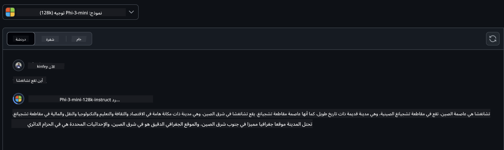
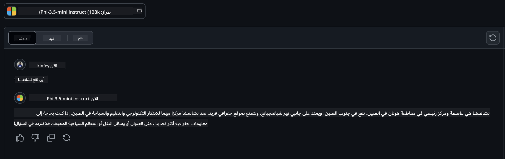

<!--
CO_OP_TRANSLATOR_METADATA:
{
  "original_hash": "124ad36cfe96f74038811b6e2bb93e9d",
  "translation_date": "2025-06-26T01:34:03+00:00",
  "source_file": "19-slm/README.md",
  "language_code": "ar"
}
-->
# مقدمة في نماذج اللغة الصغيرة للذكاء الاصطناعي التوليدي للمبتدئين

الذكاء الاصطناعي التوليدي هو مجال رائع في الذكاء الاصطناعي يركز على إنشاء أنظمة قادرة على توليد محتوى جديد. يمكن أن يتراوح هذا المحتوى من النصوص والصور إلى الموسيقى وحتى البيئات الافتراضية الكاملة. واحدة من التطبيقات الأكثر إثارة للذكاء الاصطناعي التوليدي هو في مجال نماذج اللغة.

## ما هي نماذج اللغة الصغيرة؟

تمثل نماذج اللغة الصغيرة (SLM) نسخة مصغرة من نماذج اللغة الكبيرة (LLM)، حيث تستفيد من العديد من المبادئ المعمارية والتقنيات الخاصة بنماذج اللغة الكبيرة، مع إظهار بصمة حسابية أقل بكثير. تعتبر نماذج اللغة الصغيرة جزءًا من نماذج اللغة المصممة لتوليد نصوص تشبه النصوص البشرية. على عكس نظيراتها الأكبر، مثل GPT-4، فإن نماذج اللغة الصغيرة أكثر كفاءة وصغرًا، مما يجعلها مثالية للتطبيقات التي تكون فيها الموارد الحسابية محدودة. على الرغم من صغر حجمها، إلا أنها لا تزال قادرة على أداء مجموعة متنوعة من المهام. عادةً ما يتم إنشاء نماذج اللغة الصغيرة عن طريق ضغط أو تقطير نماذج اللغة الكبيرة، بهدف الاحتفاظ بجزء كبير من وظائف وقدرات النموذج الأصلي اللغوية. يقلل هذا التخفيض في حجم النموذج من التعقيد العام، مما يجعل نماذج اللغة الصغيرة أكثر كفاءة من حيث استخدام الذاكرة ومتطلبات الحساب. على الرغم من هذه التحسينات، لا تزال نماذج اللغة الصغيرة قادرة على أداء مجموعة واسعة من مهام معالجة اللغة الطبيعية (NLP):

- توليد النصوص: إنشاء جمل أو فقرات متماسكة وذات صلة بالسياق.
- إكمال النص: التنبؤ وإكمال الجمل بناءً على موجه معين.
- الترجمة: تحويل النص من لغة إلى أخرى.
- التلخيص: تكثيف النصوص الطويلة إلى ملخصات أقصر وأكثر قابلية للهضم.

وذلك مع بعض التنازلات في الأداء أو عمق الفهم مقارنة بنظيراتها الأكبر.

## كيف تعمل نماذج اللغة الصغيرة؟

يتم تدريب نماذج اللغة الصغيرة على كميات هائلة من بيانات النصوص. خلال التدريب، تتعلم الأنماط والهياكل اللغوية، مما يمكنها من توليد نصوص صحيحة نحويًا وملائمة للسياق. تتضمن عملية التدريب:

- جمع البيانات: جمع مجموعات كبيرة من النصوص من مصادر مختلفة.
- المعالجة المسبقة: تنظيف وتنظيم البيانات لجعلها مناسبة للتدريب.
- التدريب: استخدام خوارزميات التعلم الآلي لتعليم النموذج كيفية فهم وتوليد النصوص.
- الضبط الدقيق: تعديل النموذج لتحسين أدائه في مهام محددة.

يتماشى تطوير نماذج اللغة الصغيرة مع الحاجة المتزايدة للنماذج التي يمكن نشرها في بيئات محدودة الموارد، مثل الأجهزة المحمولة أو منصات الحوسبة الحافة، حيث قد تكون نماذج اللغة الكبيرة غير عملية بسبب متطلباتها العالية من الموارد. من خلال التركيز على الكفاءة، توازن نماذج اللغة الصغيرة بين الأداء وإمكانية الوصول، مما يتيح تطبيقًا أوسع عبر مجالات متنوعة.

## أهداف التعلم

في هذا الدرس، نأمل في تقديم معرفة حول نماذج اللغة الصغيرة ودمجها مع Microsoft Phi-3 لتعلم سيناريوهات مختلفة في محتوى النص والرؤية وMoE. بنهاية هذا الدرس، يجب أن تكون قادرًا على الإجابة على الأسئلة التالية:

- ما هو SLM
- ما الفرق بين SLM وLLM
- ما هي عائلة Microsoft Phi-3/3.5
- كيفية استنتاج عائلة Microsoft Phi-3/3.5

جاهز؟ دعنا نبدأ.

## الفروقات بين نماذج اللغة الكبيرة (LLMs) ونماذج اللغة الصغيرة (SLMs)

تُبنى كل من نماذج اللغة الكبيرة والصغيرة على مبادئ أساسية في التعلم الآلي الاحتمالي، وتتبنى نهجًا مشابهًا في تصميمها المعماري، ومنهجيات التدريب، وعمليات توليد البيانات، وتقنيات تقييم النموذج. ومع ذلك، هناك عدة عوامل رئيسية تميز بين هذين النوعين من النماذج.

## تطبيقات نماذج اللغة الصغيرة

تتمتع نماذج اللغة الصغيرة بمجموعة واسعة من التطبيقات، بما في ذلك:

- الدردشة الآلية: توفير الدعم للعملاء والتفاعل مع المستخدمين بطريقة محادثة.
- إنشاء المحتوى: مساعدة الكتاب في توليد الأفكار أو حتى صياغة مقالات كاملة.
- التعليم: مساعدة الطلاب في مهام الكتابة أو تعلم لغات جديدة.
- إمكانية الوصول: إنشاء أدوات للأفراد ذوي الإعاقة، مثل أنظمة تحويل النص إلى كلام.

**الحجم**

يكمن الفارق الرئيسي بين نماذج اللغة الكبيرة والصغيرة في حجم النماذج. يمكن أن تتكون نماذج اللغة الكبيرة، مثل ChatGPT (GPT-4)، من حوالي 1.76 تريليون معلمة، بينما تم تصميم نماذج اللغة الصغيرة المفتوحة المصدر مثل Mistral 7B بعدد أقل بكثير من المعلمات - حوالي 7 مليارات. يعود هذا التفاوت بشكل رئيسي إلى الاختلافات في بنية النموذج وعمليات التدريب. على سبيل المثال، يستخدم ChatGPT آلية الانتباه الذاتي ضمن إطار عمل التشفير وفك التشفير، في حين يستخدم Mistral 7B انتباه النافذة المنزلقة، مما يتيح تدريبًا أكثر كفاءة داخل نموذج فك التشفير فقط. هذا التباين المعماري له تأثيرات عميقة على تعقيد وأداء هذه النماذج.

**الفهم**

عادةً ما يتم تحسين نماذج اللغة الصغيرة لأداء ضمن مجالات محددة، مما يجعلها متخصصة للغاية ولكن قد تكون محدودة في قدرتها على توفير فهم سياقي واسع عبر مجالات معرفية متعددة. في المقابل، تهدف نماذج اللغة الكبيرة إلى محاكاة الذكاء البشري على مستوى أكثر شمولية. تم تدريبها على مجموعات بيانات ضخمة ومتنوعة، وتم تصميمها لتعمل بشكل جيد عبر مجموعة متنوعة من المجالات، مما يوفر تنوعًا وتكيفًا أكبر. وبالتالي، فإن نماذج اللغة الكبيرة تكون أكثر ملاءمة لمجموعة واسعة من المهام اللاحقة، مثل معالجة اللغة الطبيعية والبرمجة.

**الحوسبة**

تتطلب عملية تدريب ونشر نماذج اللغة الكبيرة موارد كثيفة، وغالبًا ما تتطلب بنية تحتية حسابية كبيرة، بما في ذلك مجموعات GPU واسعة النطاق. على سبيل المثال، قد يتطلب تدريب نموذج مثل ChatGPT من الصفر آلاف وحدات معالجة الرسومات على مدى فترات طويلة. في المقابل، تكون نماذج اللغة الصغيرة، مع عدد معلماتها الأصغر، أكثر قابلية للوصول من حيث الموارد الحسابية. يمكن تدريب وتشغيل نماذج مثل Mistral 7B على أجهزة محلية مجهزة بإمكانيات GPU متوسطة، على الرغم من أن التدريب لا يزال يتطلب عدة ساعات عبر وحدات معالجة الرسومات المتعددة.

**التحيز**

يُعتبر التحيز مشكلة معروفة في نماذج اللغة الكبيرة، ويرجع ذلك أساسًا إلى طبيعة بيانات التدريب. تعتمد هذه النماذج غالبًا على بيانات خام متاحة بشكل مفتوح من الإنترنت، والتي قد تمثل بشكل غير كافٍ أو تسيء تمثيل مجموعات معينة، أو تقدم تصنيفًا خاطئًا، أو تعكس تحيزات لغوية تتأثر باللهجة والاختلافات الجغرافية والقواعد النحوية. بالإضافة إلى ذلك، يمكن أن يؤدي تعقيد البنية المعمارية لنماذج اللغة الكبيرة إلى تفاقم التحيز بشكل غير مقصود، والذي قد لا يتم ملاحظته دون ضبط دقيق بعناية. من ناحية أخرى، تكون نماذج اللغة الصغيرة، التي تم تدريبها على مجموعات بيانات محدودة ومجالات معينة، أقل عرضة لمثل هذه التحيزات، على الرغم من أنها ليست محصنة منها.

**الاستنتاج**

يمنح الحجم المخفض لنماذج اللغة الصغيرة ميزة كبيرة من حيث سرعة الاستنتاج، مما يسمح لها بتوليد مخرجات بكفاءة على الأجهزة المحلية دون الحاجة إلى معالجة موازية واسعة النطاق. في المقابل، تتطلب نماذج اللغة الكبيرة، نظرًا لحجمها وتعقيدها، غالبًا موارد حسابية موازية كبيرة لتحقيق أوقات استنتاج مقبولة. يؤدي وجود مستخدمين متزامنين متعددين إلى إبطاء أوقات استجابة نماذج اللغة الكبيرة بشكل أكبر، خاصة عند نشرها على نطاق واسع.

باختصار، على الرغم من أن كل من نماذج اللغة الكبيرة والصغيرة تشترك في أساس مشترك في التعلم الآلي، إلا أنها تختلف بشكل كبير من حيث حجم النموذج ومتطلبات الموارد والفهم السياقي وقابلية التحيز وسرعة الاستنتاج. تعكس هذه الفروقات مدى ملاءمتها للاستخدامات المختلفة، حيث تكون نماذج اللغة الكبيرة أكثر تنوعًا ولكنها تتطلب موارد كثيفة، بينما تقدم نماذج اللغة الصغيرة كفاءة محددة المجال مع تقليل المتطلبات الحسابية.

## مقدمة في عائلة Phi-3 / Phi-3.5

تستهدف عائلة Phi-3 / 3.5 بشكل رئيسي سيناريوهات التطبيقات النصية والبصرية والوكيل (MoE):

### Phi-3 / 3.5 Instruct

موجهة بشكل رئيسي لتوليد النصوص، إكمال الدردشة، واستخراج معلومات المحتوى، إلخ.

**Phi-3-mini**

نموذج اللغة 3.8B متاح على Microsoft Azure AI Studio وHugging Face وOllama. تتفوق نماذج Phi-3 بشكل كبير على نماذج اللغة ذات الأحجام المماثلة والأكبر في المعايير الرئيسية (انظر أرقام المعايير أدناه، الأرقام الأعلى أفضل). يتفوق Phi-3-mini على النماذج التي تضاعف حجمه، بينما يتفوق Phi-3-small وPhi-3-medium على النماذج الأكبر، بما في ذلك GPT-3.5

**Phi-3-small & medium**

بمجرد 7 مليارات معلمة، يتفوق Phi-3-small على GPT-3.5T في مجموعة متنوعة من المعايير اللغوية والمنطقية والبرمجية والرياضية. يستمر Phi-3-medium مع 14 مليار معلمة في هذا الاتجاه ويتفوق على Gemini 1.0 Pro.

**Phi-3.5-mini**

يمكن اعتباره ترقية لـ Phi-3-mini. بينما تظل المعلمات دون تغيير، فإنه يحسن القدرة على دعم لغات متعددة (يدعم أكثر من 20 لغة: العربية، الصينية، التشيكية، الدنماركية، الهولندية، الإنجليزية، الفنلندية، الفرنسية، الألمانية، العبرية، المجرية، الإيطالية، اليابانية، الكورية، النرويجية، البولندية، البرتغالية، الروسية، الإسبانية، السويدية، التايلاندية، التركية، الأوكرانية) ويضيف دعمًا أقوى للسياق الطويل. يتفوق Phi-3.5-mini مع 3.8 مليار معلمة على نماذج اللغة ذات الحجم نفسه ويتساوى مع النماذج التي تضاعف حجمه.

### Phi-3 / 3.5 Vision

يمكن اعتبار نموذج Phi-3/3.5 Instruct على أنه قدرة Phi على الفهم، وVision هو ما يمنح Phi عيونًا لفهم العالم.

**Phi-3-Vision**

يواصل Phi-3-vision، مع 4.2 مليار معلمة فقط، هذا الاتجاه ويتفوق على النماذج الأكبر مثل Claude-3 Haiku وGemini 1.0 Pro V في مهام الاستدلال البصري العام، OCR، وفهم الجداول والرسوم البيانية.

**Phi-3.5-Vision**

يعتبر Phi-3.5-Vision أيضًا ترقية لـ Phi-3-Vision، حيث يضيف دعمًا للصور المتعددة. يمكنك اعتباره تحسينًا في الرؤية، لا يمكنك فقط رؤية الصور، ولكن أيضًا الفيديوهات. يتفوق Phi-3.5-vision على النماذج الأكبر مثل Claude-3.5 Sonnet وGemini 1.5 Flash عبر مهام OCR وفهم الجداول والرسوم البيانية ويتساوى في مهام الاستدلال على المعرفة البصرية العامة. يدعم الإدخال المتعدد الإطارات، أي إجراء الاستدلال على صور متعددة المدخلات.

### Phi-3.5-MoE

تمكن ***Mixture of Experts(MoE)*** النماذج من التدريب المسبق باستخدام حساب أقل بكثير، مما يعني أنه يمكنك توسيع حجم النموذج أو مجموعة البيانات بشكل كبير بنفس ميزانية الحساب كنموذج كثيف. بشكل خاص، يجب أن يحقق نموذج MoE نفس الجودة كنظيره الكثيف بشكل أسرع بكثير أثناء التدريب المسبق. يتألف Phi-3.5-MoE من 16x3.8B وحدات خبراء. يحقق Phi-3.5-MoE مع 6.6 مليار معلمة نشطة فقط مستوى مشابه من الاستدلال وفهم اللغة والرياضيات مثل النماذج الأكبر بكثير.

يمكننا استخدام نموذج عائلة Phi-3/3.5 بناءً على سيناريوهات مختلفة. على عكس LLM، يمكنك نشر Phi-3/3.5-mini أو Phi-3/3.5-Vision على الأجهزة الحافة.

## كيفية استخدام نماذج عائلة Phi-3/3.5

نأمل في استخدام Phi-3/3.5 في سيناريوهات مختلفة. بعد ذلك، سنستخدم Phi-3/3.5 بناءً على سيناريوهات مختلفة.
النماذج هي الطريقة الأكثر مباشرة. يمكنك الوصول بسرعة إلى نموذج Phi-3/3.5-Instruct عبر GitHub Models. بالاقتران مع Azure AI Inference SDK / OpenAI SDK، يمكنك الوصول إلى API عبر الكود لإكمال استدعاء Phi-3/3.5-Instruct. يمكنك أيضًا اختبار تأثيرات مختلفة من خلال Playground. - العرض التوضيحي: مقارنة تأثيرات Phi-3-mini و Phi-3.5-mini في السيناريوهات الصينية   **Azure AI Studio** أو إذا أردنا استخدام نماذج الرؤية و MoE، يمكنك استخدام Azure AI Studio لإكمال الاستدعاء. إذا كنت مهتمًا، يمكنك قراءة Phi-3 Cookbook لتعلم كيفية استدعاء Phi-3/3.5 Instruct, Vision, MoE عبر Azure AI Studio [انقر هنا](https://github.com/microsoft/Phi-3CookBook/blob/main/md/02.QuickStart/AzureAIStudio_QuickStart.md?WT.mc_id=academic-105485-koreyst) **NVIDIA NIM** بالإضافة إلى حلول كتالوج النماذج السحابية التي توفرها Azure و GitHub، يمكنك أيضًا استخدام [Nivida NIM](https://developer.nvidia.com/nim?WT.mc_id=academic-105485-koreyst) لإكمال الاستدعاءات ذات الصلة. يمكنك زيارة NIVIDA NIM لإكمال استدعاءات API لعائلة Phi-3/3.5. NVIDIA NIM (NVIDIA Inference Microservices) هي مجموعة من خدمات الاستدلال المسرعة المصممة لمساعدة المطورين على نشر نماذج الذكاء الاصطناعي بكفاءة عبر بيئات مختلفة، بما في ذلك السحابة ومراكز البيانات ومحطات العمل. إليك بعض الميزات الرئيسية لـ NVIDIA NIM: - **سهولة النشر:** يسمح NIM بنشر نماذج الذكاء الاصطناعي بأمر واحد، مما يجعله بسيطًا للتكامل في سير العمل الحالي. - **الأداء المحسن:** يستفيد من محركات الاستدلال المسبقة التحسين من NVIDIA، مثل TensorRT و TensorRT-LLM، لضمان انخفاض زمن الاستجابة وارتفاع الإنتاجية. - **القدرة على التوسع:** يدعم NIM التوسع التلقائي على Kubernetes، مما يمكنه من التعامل بفعالية مع أعباء العمل المتغيرة. - **الأمان والتحكم:** يمكن للمؤسسات الحفاظ على التحكم في بياناتها وتطبيقاتها من خلال استضافة خدمات NIM المصغرة ذاتيًا على البنية التحتية المدارة الخاصة بها. - **واجهات برمجة التطبيقات القياسية:** يوفر NIM واجهات برمجة التطبيقات القياسية في الصناعة، مما يسهل بناء وتكامل تطبيقات الذكاء الاصطناعي مثل روبوتات الدردشة، ومساعدي الذكاء الاصطناعي، والمزيد. NIM جزء من NVIDIA AI Enterprise، الذي يهدف إلى تبسيط نشر وتشغيل نماذج الذكاء الاصطناعي، مما يضمن تشغيلها بكفاءة على وحدات معالجة الرسوميات من NVIDIA. - العرض التوضيحي: استخدام Nividia NIM لاستدعاء Phi-3.5-Vision-API [[انقر هنا](../../../19-slm/python/Phi-3-Vision-Nividia-NIM.ipynb)] ### الاستدلال Phi-3/3.5 في البيئة المحلية يشير الاستدلال فيما يتعلق بـ Phi-3، أو أي نموذج لغة مثل GPT-3، إلى عملية توليد الردود أو التوقعات بناءً على المدخلات التي يتلقاها. عندما تقدم موجهًا أو سؤالًا إلى Phi-3، فإنه يستخدم الشبكة العصبية المدربة لاستنتاج الرد الأكثر احتمالًا وملاءمة من خلال تحليل الأنماط والعلاقات في البيانات التي تم تدريبه عليها. **Hugging Face Transformer** Hugging Face Transformers هي مكتبة قوية مصممة لمعالجة اللغة الطبيعية (NLP) ومهام التعلم الآلي الأخرى. إليك بعض النقاط الرئيسية عنها: 1. **النماذج المدربة مسبقًا:** توفر الآلاف من النماذج المدربة مسبقًا التي يمكن استخدامها لمهام متنوعة مثل تصنيف النص، والتعرف على الكيانات المسماة، والإجابة على الأسئلة، والتلخيص، والترجمة، وتوليد النصوص. 2. **التشغيل البيني للإطار:** تدعم المكتبة العديد من أطر التعلم العميق، بما في ذلك PyTorch و TensorFlow و JAX. يتيح لك ذلك تدريب نموذج في إطار واحد واستخدامه في آخر. 3. **القدرات متعددة الوسائط:** بالإضافة إلى معالجة اللغة الطبيعية، تدعم Hugging Face Transformers أيضًا المهام في رؤية الكمبيوتر (مثل تصنيف الصور، واكتشاف الكائنات) ومعالجة الصوت (مثل التعرف على الكلام، وتصنيف الصوت). 4. **سهولة الاستخدام:** توفر المكتبة واجهات برمجة التطبيقات والأدوات لتنزيل النماذج وضبطها بسهولة، مما يجعلها متاحة للمبتدئين والخبراء على حد سواء. 5. **المجتمع والموارد:** تتمتع Hugging Face بمجتمع نابض بالحياة ووثائق شاملة ودروس إرشادية وأدلة لمساعدة المستخدمين على البدء والاستفادة القصوى من المكتبة. [التوثيق الرسمي](https://huggingface.co/docs/transformers/index?WT.mc_id=academic-105485-koreyst) أو مستودع [GitHub الخاص بهم](https://github.com/huggingface/transformers?WT.mc_id=academic-105485-koreyst). هذه هي الطريقة الأكثر استخدامًا، لكنها تتطلب أيضًا تسريع GPU. بعد كل شيء، تتطلب مشاهد مثل Vision و MoE الكثير من الحسابات، والتي ستكون محدودة جدًا في وحدة المعالجة المركزية إذا لم يتم تقليلها. - العرض التوضيحي: استخدام Transformer لاستدعاء Phi-3.5-Instuct [انقر هنا](../../../19-slm/python/phi35-instruct-demo.ipynb) - العرض التوضيحي: استخدام Transformer لاستدعاء Phi-3.5-Vision[انقر هنا](../../../19-slm/python/phi35-vision-demo.ipynb) - العرض التوضيحي: استخدام Transformer لاستدعاء Phi-3.5-MoE[انقر هنا](../../../19-slm/python/phi35_moe_demo.ipynb) **Ollama** [Ollama](https://ollama.com/?WT.mc_id=academic-105485-koreyst) هي منصة مصممة لتسهيل تشغيل نماذج اللغة الكبيرة (LLMs) محليًا على جهازك. تدعم نماذج متنوعة مثل Llama 3.1 و Phi 3 و Mistral و Gemma 2، من بين أخرى. تبسط المنصة العملية من خلال تجميع أوزان النموذج، والتكوين، والبيانات في حزمة واحدة، مما يجعلها أكثر وصولًا للمستخدمين لتخصيص وإنشاء نماذجهم الخاصة. تتوفر Ollama لأنظمة macOS و Linux و Windows. إنها أداة رائعة إذا كنت تبحث عن تجربة أو نشر LLMs دون الاعتماد على الخدمات السحابية. Ollama هي الطريقة الأكثر مباشرة، ما عليك سوى تنفيذ البيان التالي. ```bash

ollama run phi3.5

``` **ONNX Runtime for GenAI** [ONNX Runtime](https://github.com/microsoft/onnxruntime-genai?WT.mc_id=academic-105485-koreyst) هو معجل تعلم الآلة عبر الأنظمة الأساسية للاستدلال والتدريب. يعد ONNX Runtime للذكاء الاصطناعي التوليدي (GENAI) أداة قوية تساعدك على تشغيل نماذج الذكاء الاصطناعي التوليدي بكفاءة عبر منصات متنوعة. ## ما هو ONNX Runtime؟ ONNX Runtime هو مشروع مفتوح المصدر يمكّن من استدلال عالي الأداء لنماذج تعلم الآلة. يدعم النماذج بتنسيق Open Neural Network Exchange (ONNX)، وهو معيار لتمثيل نماذج تعلم الآلة. يمكن أن يمكن استدلال ONNX Runtime من توفير تجارب أسرع للعملاء وتكاليف أقل، ويدعم النماذج من أطر التعلم العميق مثل PyTorch و TensorFlow/Keras وكذلك مكتبات تعلم الآلة الكلاسيكية مثل scikit-learn و LightGBM و XGBoost، إلخ. يتوافق ONNX Runtime مع أجهزة وبرامج تشغيل وأنظمة تشغيل مختلفة، ويوفر أداءً مثاليًا من خلال الاستفادة من مسرعات الأجهزة حيثما كان ذلك ممكنًا إلى جانب تحسينات الرسوم البيانية والتحويلات. ## ما هو الذكاء الاصطناعي التوليدي؟ يشير الذكاء الاصطناعي التوليدي إلى أنظمة الذكاء الاصطناعي التي يمكنها توليد محتوى جديد، مثل النصوص أو الصور أو الموسيقى، بناءً على البيانات التي تم تدريبها عليها. تشمل الأمثلة نماذج اللغة مثل GPT-3 ونماذج توليد الصور مثل Stable Diffusion. توفر مكتبة ONNX Runtime for GenAI الحلقة التوليدية لنماذج ONNX، بما في ذلك الاستدلال باستخدام ONNX Runtime، ومعالجة لوغاريتمات النماذج، والبحث وأخذ العينات، وإدارة ذاكرة التخزين المؤقت KV. ## ONNX Runtime للذكاء الاصطناعي التوليدي يوسع ONNX Runtime للذكاء الاصطناعي التوليدي قدرات ONNX Runtime لدعم نماذج الذكاء الاصطناعي التوليدي. إليك بعض الميزات الرئيسية: - **دعم واسع للمنصات:** يعمل على منصات متنوعة، بما في ذلك Windows و Linux و macOS و Android و iOS. - **دعم النموذج:** يدعم العديد من نماذج الذكاء الاصطناعي التوليدي الشهيرة، مثل LLaMA و GPT-Neo و BLOOM والمزيد. - **تحسين الأداء:** يتضمن تحسينات لمسرعات الأجهزة المختلفة مثل وحدات معالجة الرسوميات NVIDIA و AMD والمزيد2. - **سهولة الاستخدام:** يوفر واجهات برمجة التطبيقات للتكامل السهل في التطبيقات، مما يسمح لك بتوليد النصوص والصور والمحتويات الأخرى بأقل كمية من الكود. - يمكن للمستخدمين استدعاء طريقة generate() عالية المستوى، أو تشغيل كل تكرار للنموذج في حلقة، وتوليد رمز واحد في كل مرة، وتحديث معلمات التوليد داخل الحلقة اختياريًا. - يدعم ONNX runtime أيضًا البحث الجشع/الشعاعي وأخذ العينات TopP و TopK لتوليد تسلسلات الرموز ومعالجة اللوغاريتمات المدمجة مثل عقوبات التكرار. يمكنك أيضًا إضافة تسجيل مخصص بسهولة. ## البدء للبدء باستخدام ONNX Runtime للذكاء الاصطناعي التوليدي، يمكنك اتباع هذه الخطوات: ### تثبيت ONNX Runtime: ```Python
pip install onnxruntime
``` ### تثبيت الإضافات التوليدية للذكاء الاصطناعي: ```Python
pip install onnxruntime-genai
``` ### تشغيل نموذج: إليك مثال بسيط في بايثون: ```Python
import onnxruntime_genai as og

model = og.Model('path_to_your_model.onnx')

tokenizer = og.Tokenizer(model)

input_text = "Hello, how are you?"

input_tokens = tokenizer.encode(input_text)

output_tokens = model.generate(input_tokens)

output_text = tokenizer.decode(output_tokens)

print(output_text) 
``` ### العرض التوضيحي: استخدام ONNX Runtime GenAI لاستدعاء Phi-3.5-Vision ```python

import onnxruntime_genai as og

model_path = './Your Phi-3.5-vision-instruct ONNX Path'

img_path = './Your Image Path'

model = og.Model(model_path)

processor = model.create_multimodal_processor()

tokenizer_stream = processor.create_stream()

text = "Your Prompt"

prompt = "<|user|>\n"

prompt += "<|image_1|>\n"

prompt += f"{text}<|end|>\n"

prompt += "<|assistant|>\n"

image = og.Images.open(img_path)

inputs = processor(prompt, images=image)

params = og.GeneratorParams(model)

params.set_inputs(inputs)

params.set_search_options(max_length=3072)

generator = og.Generator(model, params)

while not generator.is_done():

    generator.compute_logits()
    
    generator.generate_next_token()

    new_token = generator.get_next_tokens()[0]
    
    code += tokenizer_stream.decode(new_token)
    
    print(tokenizer_stream.decode(new_token), end='', flush=True)

``` **أخرى** بالإضافة إلى طرق مرجعية ONNX Runtime و Ollama، يمكننا أيضًا إكمال المرجع للنماذج الكمية بناءً على طرق المرجع النموذجية التي تقدمها الشركات المصنعة المختلفة. مثل إطار عمل Apple MLX مع Apple Metal، و Qualcomm QNN مع NPU، و Intel OpenVINO مع CPU/GPU، إلخ. يمكنك أيضًا الحصول على المزيد من المحتوى من [Phi-3 Cookbook](https://github.com/microsoft/phi-3cookbook?WT.mc_id=academic-105485-koreyst) ## المزيد لقد تعلمنا أساسيات عائلة Phi-3/3.5، ولكن لتعلم المزيد عن SLM نحتاج إلى المزيد من المعرفة. يمكنك العثور على الإجابات في Phi-3 Cookbook. إذا كنت تريد معرفة المزيد، يرجى زيارة [Phi-3 Cookbook](https://github.com/microsoft/phi-3cookbook?WT.mc_id=academic-105485-koreyst).

**إخلاء المسؤولية**:  
تمت ترجمة هذه الوثيقة باستخدام خدمة الترجمة بالذكاء الاصطناعي [Co-op Translator](https://github.com/Azure/co-op-translator). بينما نسعى لتحقيق الدقة، يرجى العلم أن الترجمات الآلية قد تحتوي على أخطاء أو معلومات غير دقيقة. يجب اعتبار الوثيقة الأصلية بلغتها الأم المصدر الموثوق. بالنسبة للمعلومات الحيوية، يُوصى بالترجمة البشرية الاحترافية. نحن غير مسؤولين عن أي سوء فهم أو تفسيرات خاطئة ناتجة عن استخدام هذه الترجمة.