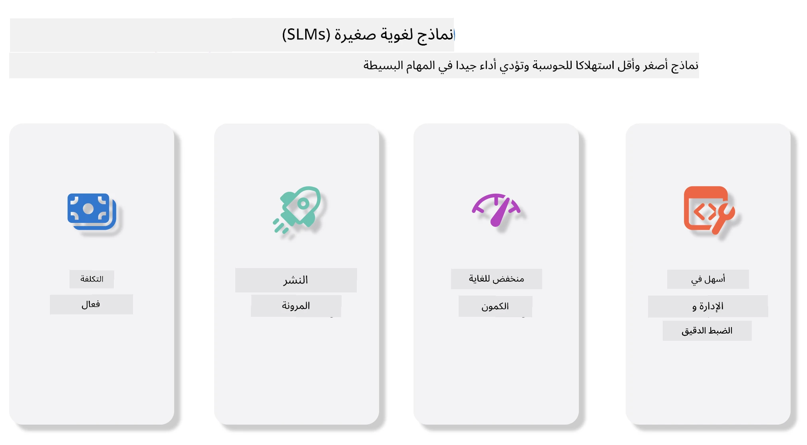
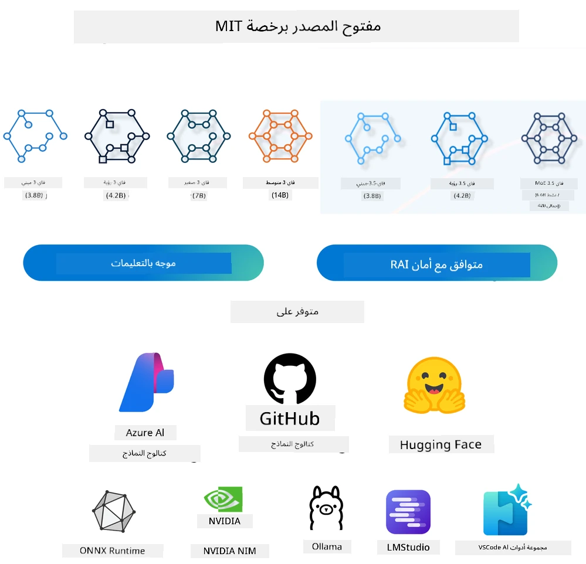
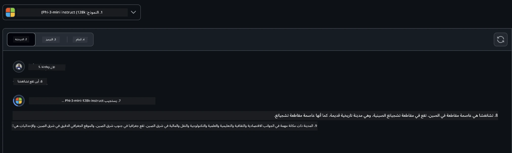
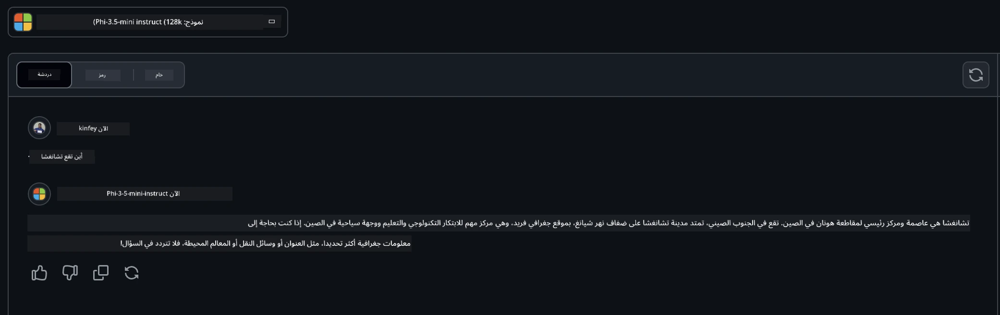

# مقدمة في نماذج اللغة الصغيرة للذكاء الاصطناعي التوليدي للمبتدئين  
الذكاء الاصطناعي التوليدي هو مجال مثير في الذكاء الاصطناعي يركز على إنشاء أنظمة قادرة على إنتاج محتوى جديد. يمكن أن يشمل هذا المحتوى نصوصًا وصورًا وموسيقى وحتى بيئات افتراضية كاملة. واحدة من أكثر التطبيقات إثارة للذكاء الاصطناعي التوليدي هي في مجال نماذج اللغة.  

## ما هي نماذج اللغة الصغيرة؟  

نموذج اللغة الصغير (SLM) يمثل نسخة مصغرة من نموذج اللغة الكبير (LLM)، مستفيدًا من العديد من المبادئ المعمارية والتقنيات الخاصة بنماذج اللغة الكبيرة، ولكنه يظهر بصمة حسابية أقل بكثير.  

نماذج اللغة الصغيرة هي مجموعة فرعية من نماذج اللغة مصممة لإنشاء نص يشبه النص البشري. بخلاف نظرائهم الأكبر مثل GPT-4، تتميز نماذج اللغة الصغيرة بأنها أكثر صغرًا وكفاءة، مما يجعلها مثالية للتطبيقات التي تكون فيها موارد الحوسبة محدودة. رغم حجمها الأصغر، إلا أنها لا تزال قادرة على أداء مجموعة متنوعة من المهام. غالبًا ما يتم بناء نماذج اللغة الصغيرة عن طريق ضغط أو تقطير نماذج اللغة الكبيرة، بهدف الاحتفاظ بجزء كبير من وظيفة النموذج الأصلي وقدراته اللغوية. هذا التقليل في حجم النموذج يقلل من التعقيد الكلي، مما يجعل نماذج اللغة الصغيرة أكثر كفاءة من حيث استخدام الذاكرة ومتطلبات الحوسبة. ورغم هذه التحسينات، فإن نماذج اللغة الصغيرة لا تزال قادرة على أداء مجموعة واسعة من مهام معالجة اللغة الطبيعية (NLP):  

- توليد النص: إنشاء جمل أو فقرات متماسكة وذات صلة سياقية.  
- إكمال النص: التنبؤ بإكمال الجمل بناءً على مُدخل معين.  
- الترجمة: تحويل النص من لغة إلى أخرى.  
- التلخيص: اختصار نصوص طويلة إلى ملخصات أقصر وأسهل في الفهم.  

وذلك مع بعض التنازلات في الأداء أو عمق الفهم مقارنةً بنظرائهم الأكبر.  

## كيف تعمل نماذج اللغة الصغيرة؟  
تُدرّب نماذج اللغة الصغيرة على كميات هائلة من بيانات النصوص. خلال التدريب، تتعلم أنماط وبُنى اللغة، مما يمكنها من توليد نص يكون صحيحًا من الناحية القواعدية ومناسبًا من الناحية السياقية. تتضمن عملية التدريب:  

- جمع البيانات: تجميع مجموعات بيانات كبيرة من النصوص من مصادر متعددة.  
- المعالجة المسبقة: تنظيف وتنظيم البيانات لجعلها مناسبة للتدريب.  
- التدريب: استخدام خوارزميات التعلم الآلي لتعليم النموذج كيفية فهم وتوليد النصوص.  
- التعديل الدقيق: ضبط النموذج لتحسين أدائه على مهام محددة.  

يتماشى تطوير نماذج اللغة الصغيرة مع الحاجة المتزايدة للنماذج التي يمكن نشرها في بيئات ذات موارد محدودة، مثل الأجهزة المحمولة أو منصات الحوسبة الطرفية، حيث قد تكون نماذج اللغة الكبيرة غير عملية بسبب متطلباتها العالية للموارد. من خلال التركيز على الكفاءة، توازن نماذج اللغة الصغيرة بين الأداء وسهولة الوصول، مما يمكّن من تطبيق أوسع عبر مجالات مختلفة.  

  

## أهداف التعلم  

في هذا الدرس، نأمل في تقديم المعرفة حول نماذج اللغة الصغيرة وربطها مع Microsoft Phi-3 لتعلم سيناريوهات مختلفة في محتوى النص والرؤية ومواضيع الخبراء (MoE).  

بنهاية هذا الدرس، ينبغي أن تكون قادرًا على الإجابة على الأسئلة التالية:  

- ما هو نموذج اللغة الصغير (SLM)؟  
- ما الفرق بين SLM وLLM؟  
- ما هي عائلة Microsoft Phi-3/3.5؟  
- كيف تقوم بإجراء الاستدلال باستخدام عائلة Microsoft Phi-3/3.5؟  

هل أنت مستعد؟ لنبدأ.  

## الفروقات بين نماذج اللغة الكبيرة (LLMs) ونماذج اللغة الصغيرة (SLMs)  

كلا من نماذج اللغة الكبيرة والصغيرة مبنية على مبادئ أساسية في التعلم الآلي الاحتمالي، وتتبع نهجًا مماثلًا في التصميم المعماري، ومنهجيات التدريب، وعمليات توليد البيانات، وتقنيات تقييم النماذج. ولكن هناك عدة عوامل رئيسية تميز هذين النوعين من النماذج.  

## تطبيقات نماذج اللغة الصغيرة  

تمتلك نماذج اللغة الصغيرة مجموعة واسعة من التطبيقات، منها:  

- روبوتات الدردشة: تقديم دعم العملاء والتفاعل مع المستخدمين بطريقة محادثة.  
- إنشاء المحتوى: مساعدة الكتّاب في توليد الأفكار أو حتى صياغة المقالات بأكملها.  
- التعليم: مساعدة الطلاب في الواجبات الكتابية أو تعلم لغات جديدة.  
- إمكانية الوصول: إنشاء أدوات للأشخاص ذوي الإعاقات، مثل أنظمة تحويل النص إلى كلام.  

**الحجم**  
  
الاختلاف الأساسي بين نماذج اللغة الكبيرة والصغيرة يكمن في حجم النماذج. نماذج اللغة الكبيرة، مثل ChatGPT (GPT-4)، قد تحتوي على نحو 1.76 تريليون معامل، بينما نماذج اللغة الصغيرة مفتوحة المصدر مثل Mistral 7B مصممة بعدد معاملات أقل بكثير—حوالي 7 مليارات. يعود هذا الاختلاف بشكل رئيسي إلى الفوارق في البنية المعمارية وعملية التدريب. على سبيل المثال، يستخدم ChatGPT آلية الانتباه الذاتي ضمن إطار تشفير-فك التشفير، في حين يستخدم Mistral 7B انتباه نافذة متحركة، مما يمكّن من تدريب أكثر كفاءة ضمن نموذج فك التشفير فقط. لهذا الاختلاف المعماري تأثيرات عميقة على تعقيد وأداء هذه النماذج.  

**الفهم**  

نماذج اللغة الصغيرة عادة ما تُحسَّن من حيث الأداء داخل مجالات محددة، مما يجعلها متخصصة جدًا ولكن قد تكون محدودة في قدرتها على تقديم فهم سياقي واسع عبر مجالات متعددة من المعرفة. بينما تهدف نماذج اللغة الكبيرة إلى محاكاة الذكاء الشبيه بالإنسان على مستوى أكثر شمولًا. مدربة على مجموعات بيانات ضخمة ومتنوعة، تم تصميم نماذج اللغة الكبيرة لتؤدي جيدًا عبر مجموعة متنوعة من المجالات، مما يوفر مرونة وقدرة على التكيف أكبر. بناءً عليه، فإن نماذج اللغة الكبيرة تناسب مجموعة أوسع من المهام اللاحقة مثل معالجة اللغة الطبيعية والبرمجة.  

**الحوسبة**  

تتطلب عملية تدريب ونشر نماذج اللغة الكبيرة بنية تحتية حسابية كثيفة تشمل عادةً مجموعات ضخمة من وحدات معالجة الرسوميات (GPU). على سبيل المثال، تدريب نموذج مثل ChatGPT من الصفر قد يحتاج آلاف وحدات GPU على فترات زمنية طويلة. بالمقابل، نماذج اللغة الصغيرة، بسبب قلة عدد المعاملات، أكثر إمكانية في الوصول من حيث موارد الحوسبة. يمكن تدريب وتشغيل نماذج مثل Mistral 7B على أجهزة محلية مزودة بوحدات GPU متوسطة القدرة، مع العلم أن التدريب لا يزال يستغرق عدة ساعات عبر عدة وحدات GPU.  

**التحيز**  

التحيز هو قضية معروفة في نماذج اللغة الكبيرة، ويرجع ذلك بشكل رئيسي إلى طبيعة بيانات التدريب. تعتمد هذه النماذج غالبًا على بيانات خام متاحة بحرية من الإنترنت، والتي قد تمثل مجموعات معينة بشكل ناقص أو خاطئ، أو تقدم تسميات خاطئة، أو تعكس تحيزات لغوية متأثرة باللهجات، والاختلافات الجغرافية، والقواعد النحوية. بالإضافة إلى ذلك، يمكن أن يؤدي تعقيد البنية المعمارية لنماذج اللغة الكبيرة إلى تفاقم التحيز بشكل غير مقصود، مما قد لا يُكتشف بدون تعديل دقيق. على الجانب الآخر، نماذج اللغة الصغيرة، كونها مدربة على مجموعات بيانات أكثر تقيدًا ومتخصصة في مجال محدد، تكون أقل عرضة لمثل هذه التحيزات، رغم أنها ليست محصنة تمامًا منها.  

**الاستدلال**  

الحجم الأقل لنماذج اللغة الصغيرة يمنحها ميزة كبيرة من حيث سرعة الاستدلال، مما يسمح لها بإنتاج نتائج بكفاءة على الأجهزة المحلية دون الحاجة لمعالجة متوازية مكثفة. بالمقابل، نماذج اللغة الكبيرة، بسبب حجمها وتعقيدها، غالبًا ما تحتاج إلى موارد حوسبة متوازية ضخمة لتحقيق أوقات استدلال مقبولة. وجود مستخدمين متعددين متزامنين يبطئ أوقات استجابة نماذج اللغة الكبيرة، خصوصًا عند نشرها على نطاق واسع.  

باختصار، بينما يشترك كل من نماذج اللغة الكبيرة والصغيرة في أساسيات التعلم الآلي، إلا أنهما يختلفان بشكل كبير من حيث حجم النموذج، ومتطلبات الموارد، والفهم السياقي، وقابلية التحيز، وسرعة الاستدلال. تعكس هذه الفوارق مدى ملاءمة كل منهما لحالات استخدام مختلفة، مع كون نماذج اللغة الكبيرة أكثر تنوعًا ولكنها تتطلب موارد ثقيلة، ونماذج اللغة الصغيرة تقدم كفاءة أكثر تخصصًا مع متطلبات حسابية منخفضة.  

***ملاحظة: في هذا الدرس، سنقدم نموذج اللغة الصغيرة باستخدام Microsoft Phi-3 / 3.5 كمثال.***  

## تقديم عائلة Phi-3 / Phi-3.5  

تستهدف عائلة Phi-3 / 3.5 بشكل رئيسي سيناريوهات النص والرؤية والوكيل (MoE):  

### Phi-3 / 3.5 Instruct  

تركز بشكل أساسي على توليد النصوص، وإكمال المحادثات، واستخراج معلومات المحتوى، وغيرها.  

**Phi-3-mini**  

نموذج اللغة الذي يضم 3.8 مليار معامل متوفر على Microsoft Azure AI Studio وHugging Face وOllama. تتفوق نماذج Phi-3 بشكل كبير على نماذج اللغة ذات الأحجام المماثلة والأكبر في المعايير الرئيسية (انظر أرقام المعايير أدناه، الأرقام الأعلى أفضل). يتفوق Phi-3-mini على نماذج بحجم ضعف حجمه، في حين يتفوق Phi-3-small وPhi-3-medium على نماذج أكبر، بما في ذلك GPT-3.5.  

**Phi-3-small & medium**  

بحجم 7 مليارات معامل فقط، يتفوق Phi-3-small على GPT-3.5T في مجموعة متنوعة من معايير اللغة، والتفكير، والبرمجة، والرياضيات.  

ويستمر Phi-3-medium مع 14 مليار معامل في هذا الاتجاه ويتفوق على Gemini 1.0 Pro.  

**Phi-3.5-mini**  

يمكننا التفكير فيه كتطوير لـ Phi-3-mini. بينما لا تتغير المعاملات، يحسن القدرة على دعم لغات متعددة (يدعم أكثر من 20 لغة: العربية، الصينية، التشيكية، الدنماركية، الهولندية، الإنجليزية، الفنلندية، الفرنسية، الألمانية، العبرية، الهنغارية، الإيطالية، اليابانية، الكورية، النرويجية، البولندية، البرتغالية، الروسية، الإسبانية، السويدية، التايلاندية، التركية، الأوكرانية) ​​ويضيف دعمًا أقوى للسياقات الطويلة.  

Phi-3.5-mini مع 3.8 مليار معامل يتفوق على نماذج لغة بنفس الحجم ومقارب لنماذج بحجم ضعف حجمه.  

### Phi-3 / 3.5 رؤية  

يمكننا اعتبار نموذج Instruct من Phi-3/3.5 كقدرة Phi على الفهم، والرؤية هي التي تعطي Phi "عيون" لفهم العالم.  

**Phi-3-Vision**  

Phi-3-vision، بحجم 4.2 مليار معامل فقط، يستمر في هذا الاتجاه ويتفوق على نماذج أكبر مثل Claude-3 Haiku و Gemini 1.0 Pro V في مهام التفكير البصري العامة، والتعرف الضوئي على الحروف (OCR)، وفهم الجداول والمخططات.  

**Phi-3.5-Vision**  

Phi-3.5-Vision هو أيضًا تطوير لـ Phi-3-Vision، مضيفًا دعمًا للصور المتعددة. يمكنك اعتباره تحسنًا في الرؤية، حيث لا يمكن فقط رؤية الصور، بل أيضًا الفيديوهات.  

يتفوق Phi-3.5-vision على نماذج أكبر مثل Claude-3.5 Sonnet و Gemini 1.5 Flash في مهام التعرف الضوئي على الحروف، وفهم الجداول والرسوم البيانية، ويتميز بأداء مماثل في مهام التفكير المعرفي البصري العامة. يدعم إدخال متعدد الإطارات، أي إجراء التفكير على صور متعددة مدخلة.  

### Phi-3.5-MoE  

***مزيج من الخبراء (Mixture of Experts - MoE)*** يتيح تدريب النماذج بحوسبة أقل بكثير، مما يعني أنه يمكنك توسيع حجم النموذج أو مجموعة البيانات بشكل كبير بنفس ميزانية الحوسبة الخاصة بنموذج كثيف. على وجه الخصوص، ينبغي لنموذج MoE أن يحقق جودة مماثلة لنظيره الكثيف بسرعة أكبر بكثير أثناء مرحلة ما قبل التدريب.  

يتكون Phi-3.5-MoE من 16 وحدة خبير كل منها 3.8 مليار معامل. يحقق Phi-3.5-MoE مع 6.6 مليار معامل نشط فقط مستوى مماثل من التفكير، وفهم اللغة، والرياضيات كنماذج أكبر بكثير.  

يمكننا استخدام نموذج عائلة Phi-3/3.5 بناءً على السيناريوهات المختلفة. على عكس LLM، يمكنك نشر Phi-3/3.5-mini أو Phi-3/3.5-Vision على أجهزة الطرف.  

## كيفية استخدام نماذج عائلة Phi-3/3.5  

نأمل في استخدام Phi-3/3.5 في سيناريوهات مختلفة. بعد ذلك، سنستخدم Phi-3/3.5 بناءً على سيناريوهات متعددة.  

  

### الاستدلال عبر واجهات برمجة تطبيقات السحابة  

**نماذج GitHub**  

نماذج GitHub هي الطريقة الأكثر مباشرة. يمكنك الوصول سريعًا إلى نموذج Phi-3/3.5-Instruct من خلال نماذج GitHub. مجتمعة مع Azure AI Inference SDK / OpenAI SDK، يمكنك الوصول إلى واجهة برمجة التطبيقات عبر الكود لإكمال استدعاء Phi-3/3.5-Instruct. يمكنك أيضًا تجربة تأثيرات مختلفة من خلال Playground.  

- عرض تجريبي: مقارنة بين تأثيرات Phi-3-mini و Phi-3.5-mini في السيناريوهات الصينية  

  

  


**استوديو Azure AI**  

أو إذا أردنا استخدام نماذج الرؤية وMoE، يمكنك استخدام Azure AI Studio لإكمال الاستدعاء. إذا كنت مهتمًا، يمكنك قراءة دليل الطهي Phi-3 لتتعلم كيفية استدعاء Phi-3/3.5 Instruct، وVision، وMoE من خلال Azure AI Studio [انقر على هذا الرابط](https://github.com/microsoft/Phi-3CookBook/blob/main/md/02.QuickStart/AzureAIStudio_QuickStart.md?WT.mc_id=academic-105485-koreyst)  

**NVIDIA NIM**  

بالإضافة إلى حلول كتالوج النماذج السحابية التي تقدمها Azure وGitHub، يمكنك أيضًا استخدام [NVIDIA NIM](https://developer.nvidia.com/nim?WT.mc_id=academic-105485-koreyst) لإكمال الاستدعاءات المتعلقة. يمكنك زيارة NVIDIA NIM لإتمام استدعاءات واجهة برمجة التطبيقات لعائلة Phi-3/3.5. NVIDIA NIM (خدمات الميكرو الخاصة بالاستدلال من NVIDIA) هي مجموعة من خدمات الاستدلال المسرّعة المصممة لمساعدة المطورين على نشر نماذج الذكاء الاصطناعي بكفاءة عبر بيئات متعددة، بما في ذلك السحب، ومراكز البيانات، ومحطات العمل.  

إليك بعض الميزات الرئيسية لـ NVIDIA NIM:  
- **سهولة النشر:** يسمح NIM بنشر نماذج الذكاء الاصطناعي بأمر واحد، مما يجعله سهلاً للتكامل في سير العمل الحالي.
- **أداء محسن:** يستفيد من محركات الاستدلال المُحسّنة مسبقًا من NVIDIA، مثل TensorRT و TensorRT-LLM، لضمان زمن استجابة منخفض وإنتاجية عالية.
- **قابلية التوسع:** يدعم NIM التوسيع التلقائي على Kubernetes، مما يمكنه من التعامل بفعالية مع الأحمال المختلفة.
- **الأمان والتحكم:** يمكن للمؤسسات الحفاظ على السيطرة على بياناتها وتطبيقاتها من خلال استضافة خدمات NIM المصغرة على بنيتها التحتية المُدارة الخاصة بها.
- **واجهات برمجة التطبيقات القياسية:** يوفر NIM واجهات برمجة التطبيقات الصناعية القياسية، مما يسهل بناء وتكامل تطبيقات الذكاء الاصطناعي مثل روبوتات الدردشة والمساعدين الذكيين والمزيد.

يعد NIM جزءًا من NVIDIA AI Enterprise، التي تهدف إلى تبسيط نشر وتشغيل نماذج الذكاء الاصطناعي، وضمان تشغيلها بكفاءة على وحدات معالجة الرسوميات من NVIDIA.

- العرض التوضيحي: استخدام NVIDIA NIM لاستدعاء Phi-3.5-Vision-API  [[انقر على هذا الرابط](./python/Phi-3-Vision-Nividia-NIM.ipynb?WT.mc_id=academic-105485-koreyst)]


### تشغيل Phi-3/3.5 محليًا
يشير الاستدلال بالنسبة لـ Phi-3، أو أي نموذج لغة مثل GPT-3، إلى عملية توليد الردود أو التنبؤات استنادًا إلى المدخلات التي يتلقاها. عند تقديم مطالبة أو سؤال إلى Phi-3، يستخدم شبكة عصبية مدربة لاستنتاج الرد الأكثر احتمالاً وملاءمة من خلال تحليل الأنماط والعلاقات في البيانات التي تم تدريبه عليها.

**Hugging Face Transformer**  
Hugging Face Transformers هي مكتبة قوية مصممة لمعالجة اللغة الطبيعية (NLP) ومهام التعلم الآلي الأخرى. فيما يلي بعض النقاط الرئيسية حولها:

1. **نماذج مدربة مسبقًا:** توفر آلاف النماذج المدربة مسبقًا التي يمكن استخدامها لمهام مختلفة مثل تصنيف النصوص، التعرف على الكيانات المسماة، الإجابة على الأسئلة، التلخيص، الترجمة، وتوليد النصوص.

2. **توافق الأُطُر:** تدعم المكتبة أُطُر التعلم العميق المتعددة، بما في ذلك PyTorch و TensorFlow و JAX، مما يسمح بتدريب نموذج في إطار واستخدامه في آخر.

3. **القدرات متعددة الوسائط:** إلى جانب معالجة اللغة، تدعم المكتبة أيضًا مهام رؤية الحاسوب (مثل تصنيف الصور، كشف الأجسام) ومعالجة الصوت (مثل التعرف على الكلام، تصنيف الصوت).

4. **سهولة الاستخدام:** تقدم المكتبة واجهات برمجة تطبيقات وأدوات لتنزيل النماذج وضبطها بسهولة، مما يجعلها مناسبة للمبتدئين والمتخصصين على حد سواء.

5. **المجتمع والموارد:** لدى Hugging Face مجتمع نشط وموارد واسعة من وثائق ودروس وأدلة لمساعدة المستخدمين على البدء والاستفادة القصوى من المكتبة.  
[التوثيق الرسمي](https://huggingface.co/docs/transformers/index?WT.mc_id=academic-105485-koreyst) أو مخزنهم على [GitHub](https://github.com/huggingface/transformers?WT.mc_id=academic-105485-koreyst).

هذه هي الطريقة الأكثر شيوعًا للاستخدام، لكنها تحتاج أيضًا إلى تسريع باستخدام GPU. على كل حال، السيناريوهات مثل الرؤية (Vision) وMoE تتطلب الكثير من العمليات الحسابية، والتي ستكون بطيئة جدًا على وحدة المعالجة المركزية إن لم تكن مُكمِمة.

- العرض التوضيحي: استخدام Transformer لاستدعاء Phi-3.5-Instruct [انقر على هذا الرابط](./python/phi35-instruct-demo.ipynb?WT.mc_id=academic-105485-koreyst)

- العرض التوضيحي: استخدام Transformer لاستدعاء Phi-3.5-Vision [انقر على هذا الرابط](./python/phi35-vision-demo.ipynb?WT.mc_id=academic-105485-koreyst)

- العرض التوضيحي: استخدام Transformer لاستدعاء Phi-3.5-MoE [انقر على هذا الرابط](./python/phi35_moe_demo.ipynb?WT.mc_id=academic-105485-koreyst)

**Ollama**  
[Ollama](https://ollama.com/?WT.mc_id=academic-105485-koreyst) هي منصة مصممة لتسهيل تشغيل نماذج اللغة الكبيرة (LLMs) محليًا على جهازك. تدعم المنصة نماذج مختلفة مثل Llama 3.1 و Phi 3 و Mistral و Gemma 2 وغيرها. تبسط المنصة العملية عن طريق تجميع أوزان النماذج، التكوين، والبيانات في حزمة واحدة، مما يجعلها أكثر سهولة للمستخدمين لتخصيص وإنشاء نماذجهم الخاصة. Ollama متاحة لأنظمة macOS و Linux و Windows. إنها أداة رائعة إذا كنت ترغب في التجريب مع أو نشر LLMs دون الاعتماد على خدمات السحابة. Ollama هي الطريقة الأكثر مباشرة، فقط تحتاج إلى تنفيذ الأمر التالي.

```bash

ollama run phi3.5

```


**ONNX Runtime للذكاء الاصطناعي التوليدي**

[ONNX Runtime](https://github.com/microsoft/onnxruntime-genai?WT.mc_id=academic-105485-koreyst) هو مسرع تعلّم آلي متعدد المنصات للتدريب والاستدلال. ONNX Runtime للذكاء الاصطناعي التوليدي (GENAI) هو أداة قوية تساعدك على تشغيل نماذج الذكاء الاصطناعي التوليدي بكفاءة عبر منصات مختلفة.

## ما هو ONNX Runtime؟  
ONNX Runtime هو مشروع مفتوح المصدر يمكّن من استدلال عالي الأداء لنماذج التعلم الآلي. يدعم النماذج بصيغة Open Neural Network Exchange (ONNX)، وهي معيار لتمثيل نماذج التعلم الآلي. يمكن لاستدلال ONNX Runtime تمكين تجارب أسرع للمستخدمين وتقليل التكاليف، ويدعم نماذج من أُطُر التعلم العميق مثل PyTorch و TensorFlow/Keras بالإضافة إلى مكتبات التعلم الآلي التقليدية مثل scikit-learn و LightGBM و XGBoost، وغيرها. ONNX Runtime متوافق مع مختلف الأجهزة، وبرامج التشغيل، وأنظمة التشغيل، ويوفر أداءً مثاليًا بالاستفادة من المسرعات المادية حيثما كان ذلك ممكنًا جنبًا إلى جنب مع تحسينات وتحويلات الشبكة.

## ما هو الذكاء الاصطناعي التوليدي؟  
يشير الذكاء الاصطناعي التوليدي إلى أنظمة الذكاء الاصطناعي التي يمكنها توليد محتوى جديد، مثل النصوص، الصور، أو الموسيقى، بناءً على البيانات التي تم تدريبها عليها. من الأمثلة على ذلك نماذج اللغة مثل GPT-3 ونماذج توليد الصور مثل Stable Diffusion. تقدم مكتبة ONNX Runtime للذكاء الاصطناعي التوليدي حلقة توليد الذكاء الاصطناعي للنماذج ONNX، بما في ذلك الاستدلال باستخدام ONNX Runtime، معالجة اللوغيت، البحث والعينة، وإدارة ذاكرة KV cache.

## ONNX Runtime لـ GENAI  
يوسع ONNX Runtime لـ GENAI قدرات ONNX Runtime لدعم نماذج الذكاء الاصطناعي التوليدي. إليك بعض الميزات الرئيسية:

- **دعم واسع للمنصات:** يعمل على منصات متعددة، بما فيها Windows و Linux و macOS و Android و iOS.
- **دعم النماذج:** يدعم العديد من نماذج الذكاء الاصطناعي التوليدي الشهيرة، مثل LLaMA و GPT-Neo و BLOOM والمزيد.
- **تحسين الأداء:** يتضمن تحسينات لمسرعات الأجهزة المختلفة مثل وحدات GPU من NVIDIA، و AMD، والمزيد.
- **سهولة الاستخدام:** يوفر واجهات برمجة التطبيقات لتكامل سهل في التطبيقات، مما يسمح لك بتوليد نصوص، صور، ومحتويات أخرى بأقل قدر من التعليمات البرمجية.
- يمكن للمستخدمين استدعاء الطريقة العليا generate()، أو تشغيل كل تكرار من النموذج داخل حلقة، لتوليد رمز واحد في الوقت، مع إمكانية تحديث معايير التوليد داخل الحلقة.
- يدعم ONNX Runtime أيضًا البحث الجشع/مستوى الحزمة والعينات TopP و TopK لتوليد تسلسلات رموز ومعالجة اللوغيت المدمجة مثل عقوبات التكرار. يمكنك أيضًا إضافة تقييمات خاصة بسهولة.

## بدء الاستخدام  
لبدء استخدام ONNX Runtime لـ GENAI، يمكنك اتباع الخطوات التالية:

### تثبيت ONNX Runtime:  
```Python
pip install onnxruntime
```
### تثبيت إضافات الذكاء الاصطناعي التوليدي:  
```Python
pip install onnxruntime-genai
```
  
### تشغيل نموذج: إليك مثال بسيط بلغة بايثون:  
```Python
import onnxruntime_genai as og

model = og.Model('path_to_your_model.onnx')

tokenizer = og.Tokenizer(model)

input_text = "Hello, how are you?"

input_tokens = tokenizer.encode(input_text)

output_tokens = model.generate(input_tokens)

output_text = tokenizer.decode(output_tokens)

print(output_text) 
```
### العرض التوضيحي: استخدام ONNX Runtime GenAI لاستدعاء Phi-3.5-Vision

```python

import onnxruntime_genai as og

model_path = './Your Phi-3.5-vision-instruct ONNX Path'

img_path = './Your Image Path'

model = og.Model(model_path)

processor = model.create_multimodal_processor()

tokenizer_stream = processor.create_stream()

text = "Your Prompt"

prompt = "<|user|>\n"

prompt += "<|image_1|>\n"

prompt += f"{text}<|end|>\n"

prompt += "<|assistant|>\n"

image = og.Images.open(img_path)

inputs = processor(prompt, images=image)

params = og.GeneratorParams(model)

params.set_inputs(inputs)

params.set_search_options(max_length=3072)

generator = og.Generator(model, params)

while not generator.is_done():

    generator.compute_logits()
    
    generator.generate_next_token()

    new_token = generator.get_next_tokens()[0]
    
    output = tokenizer_stream.decode(new_token)
    
    print(tokenizer_stream.decode(new_token), end='', flush=True)

```


**أخرى**

بالإضافة إلى طرق ONNX Runtime و Ollama المرجعية، يمكننا أيضًا استكمال مرجع النماذج الكمية بناءً على طرق المراجع التي تقدمها الشركات المصنعة المختلفة. مثل إطار Apple MLX مع Apple Metal، Qualcomm QNN مع NPU، Intel OpenVINO مع CPU/GPU، وغيرها. يمكنك أيضًا الحصول على المزيد من المحتوى من [دليل Phi-3](https://github.com/microsoft/phi-3cookbook?WT.mc_id=academic-105485-koreyst)

## المزيد

لقد تعلمنا أساسيات عائلة Phi-3/3.5، ولكن لتعلم المزيد عن SLM نحتاج إلى معرفة أكثر. يمكنك العثور على الإجابات في دليل Phi-3. إذا أردت التعلم أكثر، يرجى زيارة [دليل Phi-3](https://github.com/microsoft/phi-3cookbook?WT.mc_id=academic-105485-koreyst).

---

<!-- CO-OP TRANSLATOR DISCLAIMER START -->
**تنويه**:  
تمت ترجمة هذا المستند باستخدام خدمة الترجمة الآلية [Co-op Translator](https://github.com/Azure/co-op-translator). بينما نسعى جاهدين لتحقيق الدقة، يرجى العلم أن الترجمات الآلية قد تحتوي على أخطاء أو معلومات غير دقيقة. ينبغي اعتبار المستند الأصلي بلغته الأصلية المصدر الرسمي والمعتمد. للمعلومات الهامة، يُنصح بالاستعانة بترجمة بشرية محترفة. نحن غير مسؤولين عن أي سوء فهم أو تفسير خاطئ ناتج عن استخدام هذه الترجمة.
<!-- CO-OP TRANSLATOR DISCLAIMER END -->