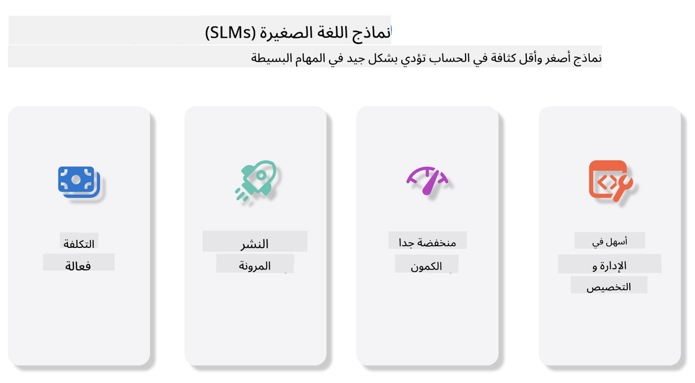
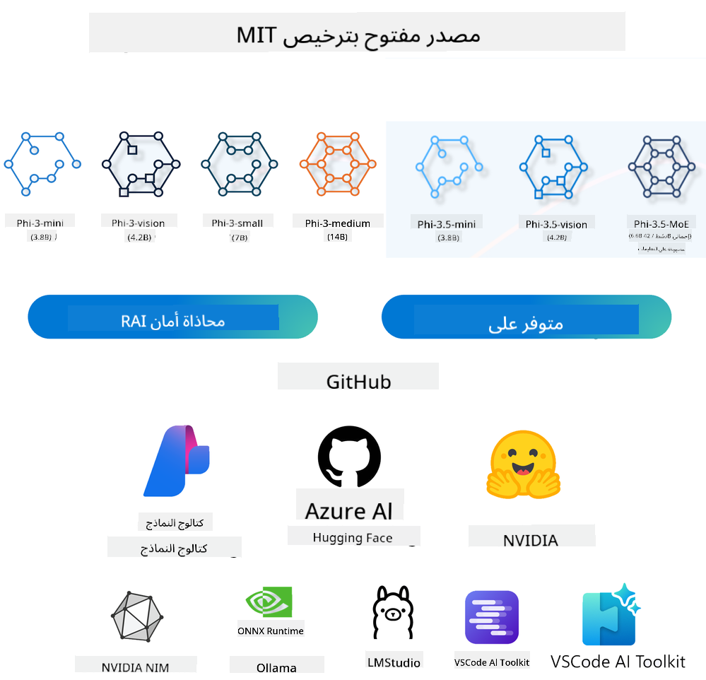

<!--
CO_OP_TRANSLATOR_METADATA:
{
  "original_hash": "124ad36cfe96f74038811b6e2bb93e9d",
  "translation_date": "2025-07-09T18:15:33+00:00",
  "source_file": "19-slm/README.md",
  "language_code": "ar"
}
-->
# مقدمة في نماذج اللغة الصغيرة للذكاء الاصطناعي التوليدي للمبتدئين  
الذكاء الاصطناعي التوليدي هو مجال مثير في الذكاء الاصطناعي يركز على إنشاء أنظمة قادرة على توليد محتوى جديد. يمكن أن يشمل هذا المحتوى نصوصًا وصورًا وموسيقى وحتى بيئات افتراضية كاملة. واحدة من أكثر التطبيقات إثارة للذكاء الاصطناعي التوليدي تكمن في مجال نماذج اللغة.

## ما هي نماذج اللغة الصغيرة؟  
نموذج اللغة الصغير (SLM) هو نسخة مصغرة من نموذج اللغة الكبير (LLM)، يستفيد من العديد من المبادئ المعمارية والتقنيات المستخدمة في نماذج اللغة الكبيرة، مع تقليل كبير في متطلبات الحوسبة.

نماذج اللغة الصغيرة هي فئة من نماذج اللغة مصممة لتوليد نص يشبه النص البشري. على عكس نظيراتها الأكبر مثل GPT-4، تتميز نماذج اللغة الصغيرة بصغر حجمها وكفاءتها، مما يجعلها مثالية للتطبيقات التي تكون فيها موارد الحوسبة محدودة. وعلى الرغم من صغر حجمها، إلا أنها قادرة على أداء مجموعة متنوعة من المهام. عادةً ما يتم بناء نماذج اللغة الصغيرة عن طريق ضغط أو تقطير نماذج اللغة الكبيرة، بهدف الاحتفاظ بجزء كبير من وظائف النموذج الأصلي وقدراته اللغوية. هذا التصغير في حجم النموذج يقلل من التعقيد الكلي، مما يجعل نماذج اللغة الصغيرة أكثر كفاءة من حيث استخدام الذاكرة ومتطلبات الحوسبة. وعلى الرغم من هذه التحسينات، يمكن لنماذج اللغة الصغيرة أداء مجموعة واسعة من مهام معالجة اللغة الطبيعية (NLP):

- توليد النص: إنشاء جمل أو فقرات متماسكة وذات صلة بالسياق.
- إكمال النص: التنبؤ وإكمال الجمل بناءً على موجه معين.
- الترجمة: تحويل النص من لغة إلى أخرى.
- التلخيص: اختصار نصوص طويلة إلى ملخصات أقصر وأسهل للفهم.

مع بعض التنازلات في الأداء أو عمق الفهم مقارنةً بنماذج اللغة الكبيرة.

## كيف تعمل نماذج اللغة الصغيرة؟  
يتم تدريب نماذج اللغة الصغيرة على كميات هائلة من بيانات النصوص. خلال التدريب، تتعلم هذه النماذج أنماط وبُنى اللغة، مما يمكنها من توليد نصوص صحيحة نحويًا وملائمة للسياق. تشمل عملية التدريب:

- جمع البيانات: تجميع مجموعات بيانات كبيرة من النصوص من مصادر متنوعة.
- المعالجة المسبقة: تنظيف وتنظيم البيانات لتكون مناسبة للتدريب.
- التدريب: استخدام خوارزميات التعلم الآلي لتعليم النموذج كيفية فهم وتوليد النصوص.
- الضبط الدقيق: تعديل النموذج لتحسين أدائه في مهام محددة.

يتماشى تطوير نماذج اللغة الصغيرة مع الحاجة المتزايدة لنماذج يمكن نشرها في بيئات ذات موارد محدودة، مثل الأجهزة المحمولة أو منصات الحوسبة الطرفية، حيث قد تكون نماذج اللغة الكبيرة غير عملية بسبب متطلبات مواردها العالية. من خلال التركيز على الكفاءة، توازن نماذج اللغة الصغيرة بين الأداء وسهولة الوصول، مما يتيح تطبيقات أوسع في مجالات مختلفة.



## أهداف التعلم  
في هذا الدرس، نأمل في تقديم معرفة حول نماذج اللغة الصغيرة وربطها مع Microsoft Phi-3 لتعلم سيناريوهات مختلفة في محتوى النصوص، والرؤية، وMoE.

بنهاية هذا الدرس، يجب أن تكون قادرًا على الإجابة على الأسئلة التالية:

- ما هو نموذج اللغة الصغير (SLM)  
- ما الفرق بين SLM وLLM  
- ما هي عائلة Microsoft Phi-3/3.5  
- كيف يتم الاستدلال باستخدام عائلة Microsoft Phi-3/3.5  

هل أنت مستعد؟ لنبدأ.

## الفروقات بين نماذج اللغة الكبيرة (LLMs) ونماذج اللغة الصغيرة (SLMs)  
كلا من نماذج اللغة الكبيرة والصغيرة مبنية على مبادئ أساسية في التعلم الآلي الاحتمالي، وتتبع نهجًا مشابهًا في التصميم المعماري، وأساليب التدريب، وعمليات توليد البيانات، وتقنيات تقييم النماذج. ومع ذلك، هناك عدة عوامل رئيسية تميز بين هذين النوعين من النماذج.

## تطبيقات نماذج اللغة الصغيرة  
تمتلك نماذج اللغة الصغيرة مجموعة واسعة من التطبيقات، منها:

- روبوتات المحادثة: تقديم دعم العملاء والتفاعل مع المستخدمين بطريقة محادثة طبيعية.
- إنشاء المحتوى: مساعدة الكتاب في توليد الأفكار أو حتى صياغة مقالات كاملة.
- التعليم: مساعدة الطلاب في الواجبات الكتابية أو تعلم لغات جديدة.
- الوصولية: إنشاء أدوات للأشخاص ذوي الإعاقات، مثل أنظمة تحويل النص إلى كلام.

**الحجم**  
الفرق الأساسي بين نماذج اللغة الكبيرة والصغيرة يكمن في حجم النماذج. نماذج اللغة الكبيرة، مثل ChatGPT (GPT-4)، قد تحتوي على ما يقدر بـ 1.76 تريليون معامل، بينما نماذج اللغة الصغيرة مفتوحة المصدر مثل Mistral 7B مصممة بعدد معاملات أقل بكثير — حوالي 7 مليارات. يعود هذا التفاوت بشكل رئيسي إلى اختلافات في بنية النموذج وعمليات التدريب. على سبيل المثال، يستخدم ChatGPT آلية الانتباه الذاتي ضمن إطار الترميز-فك الترميز، في حين يستخدم Mistral 7B انتباه نافذة منزلقة، مما يتيح تدريبًا أكثر كفاءة ضمن نموذج فك الترميز فقط. لهذا الاختلاف المعماري تأثيرات عميقة على تعقيد وأداء هذه النماذج.

**الفهم**  
عادةً ما يتم تحسين نماذج اللغة الصغيرة للأداء ضمن مجالات محددة، مما يجعلها متخصصة للغاية ولكن قد تكون محدودة في قدرتها على تقديم فهم سياقي واسع عبر مجالات معرفية متعددة. بالمقابل، تهدف نماذج اللغة الكبيرة إلى محاكاة الذكاء البشري على مستوى أكثر شمولاً. مدربة على مجموعات بيانات ضخمة ومتنوعة، تم تصميم نماذج اللغة الكبيرة لتؤدي جيدًا عبر مجالات متعددة، مما يوفر مرونة وتكيفًا أكبر. بناءً عليه، تعتبر نماذج اللغة الكبيرة أكثر ملاءمة لمجموعة أوسع من المهام اللاحقة، مثل معالجة اللغة الطبيعية والبرمجة.

**الحوسبة**  
تتطلب عملية تدريب ونشر نماذج اللغة الكبيرة موارد حوسبة مكثفة، غالبًا ما تحتاج إلى بنية تحتية حوسبية ضخمة تشمل مجموعات كبيرة من وحدات معالجة الرسوميات (GPU). على سبيل المثال، قد يتطلب تدريب نموذج مثل ChatGPT من الصفر آلاف وحدات GPU لفترات طويلة. بالمقابل، نماذج اللغة الصغيرة، بعدد معاملات أقل، أكثر سهولة من حيث الموارد الحوسبية. يمكن تدريب وتشغيل نماذج مثل Mistral 7B على أجهزة محلية مزودة بوحدات GPU متوسطة القدرات، رغم أن التدريب لا يزال يستغرق عدة ساعات عبر عدة وحدات GPU.

**التحيز**  
التحيز هو مشكلة معروفة في نماذج اللغة الكبيرة، ويرجع ذلك أساسًا إلى طبيعة بيانات التدريب. غالبًا ما تعتمد هذه النماذج على بيانات خام متاحة على الإنترنت، والتي قد تقلل من تمثيل بعض المجموعات أو تقدم تمثيلًا خاطئًا، أو تحتوي على تصنيفات خاطئة، أو تعكس تحيزات لغوية متأثرة باللهجات، والاختلافات الجغرافية، والقواعد النحوية. بالإضافة إلى ذلك، قد يؤدي تعقيد بنية نماذج اللغة الكبيرة إلى تفاقم التحيزات بشكل غير مقصود، والتي قد تمر دون ملاحظة دون ضبط دقيق. من ناحية أخرى، نماذج اللغة الصغيرة، التي تُدرّب على مجموعات بيانات أكثر تحديدًا ومحدودة النطاق، تكون أقل عرضة لهذه التحيزات، رغم أنها ليست محصنة تمامًا منها.

**الاستدلال**  
يمنح الحجم الأصغر لنماذج اللغة الصغيرة ميزة كبيرة من حيث سرعة الاستدلال، مما يسمح لها بتوليد المخرجات بكفاءة على الأجهزة المحلية دون الحاجة إلى معالجة متوازية مكثفة. في المقابل، غالبًا ما تتطلب نماذج اللغة الكبيرة، بسبب حجمها وتعقيدها، موارد حوسبة متوازية كبيرة لتحقيق أوقات استدلال مقبولة. كما أن وجود عدة مستخدمين متزامنين يبطئ أوقات استجابة نماذج اللغة الكبيرة، خاصة عند نشرها على نطاق واسع.

باختصار، بينما تشترك نماذج اللغة الكبيرة والصغيرة في أساسيات التعلم الآلي، إلا أنها تختلف بشكل كبير من حيث حجم النموذج، ومتطلبات الموارد، والفهم السياقي، وقابلية التحيز، وسرعة الاستدلال. تعكس هذه الفروقات مدى ملاءمتها لاستخدامات مختلفة، حيث تتميز نماذج اللغة الكبيرة بالمرونة لكنها تتطلب موارد كبيرة، في حين تقدم نماذج اللغة الصغيرة كفاءة متخصصة مع متطلبات حوسبة أقل.

***ملاحظة: في هذا الفصل، سنقدم نموذج اللغة الصغير باستخدام Microsoft Phi-3 / 3.5 كمثال.***

## تقديم عائلة Phi-3 / Phi-3.5  
تركز عائلة Phi-3 / 3.5 بشكل رئيسي على سيناريوهات التطبيقات المتعلقة بالنصوص، والرؤية، والوكيل (MoE):

### Phi-3 / 3.5 Instruct  
تركز بشكل رئيسي على توليد النصوص، وإكمال المحادثات، واستخراج معلومات المحتوى، وغيرها.

**Phi-3-mini**  
نموذج اللغة بحجم 3.8 مليار معامل متاح على Microsoft Azure AI Studio، وHugging Face، وOllama. تتفوق نماذج Phi-3 بشكل كبير على نماذج اللغة ذات الأحجام المماثلة والأكبر في المعايير الرئيسية (انظر أرقام المعايير أدناه، الأرقام الأعلى أفضل). يتفوق Phi-3-mini على نماذج ضعف حجمه، بينما يتفوق Phi-3-small وPhi-3-medium على نماذج أكبر، بما في ذلك GPT-3.5.

**Phi-3-small & medium**  
بحجم 7 مليارات معامل فقط، يتفوق Phi-3-small على GPT-3.5T في مجموعة متنوعة من معايير اللغة، والتفكير، والبرمجة، والرياضيات.  
يواصل Phi-3-medium بحجم 14 مليار معامل هذا الاتجاه ويتفوق على Gemini 1.0 Pro.

**Phi-3.5-mini**  
يمكن اعتباره ترقية لـ Phi-3-mini. بينما تبقى المعاملات دون تغيير، يحسن القدرة على دعم لغات متعددة (يدعم أكثر من 20 لغة: العربية، الصينية، التشيكية، الدنماركية، الهولندية، الإنجليزية، الفنلندية، الفرنسية، الألمانية، العبرية، الهنغارية، الإيطالية، اليابانية، الكورية، النرويجية، البولندية، البرتغالية، الروسية، الإسبانية، السويدية، التايلاندية، التركية، الأوكرانية) ويضيف دعمًا أقوى للسياقات الطويلة.  
يتفوق Phi-3.5-mini بحجم 3.8 مليار معامل على نماذج اللغة ذات الحجم نفسه ويضاهي نماذج ضعف حجمه.

### Phi-3 / 3.5 Vision  
يمكننا اعتبار نموذج Instruct في Phi-3/3.5 كقدرة Phi على الفهم، والرؤية هي ما يمنح Phi "عيونًا" لفهم العالم.

**Phi-3-Vision**  
يستمر Phi-3-Vision، بحجم 4.2 مليار معامل فقط، في هذا الاتجاه ويتفوق على نماذج أكبر مثل Claude-3 Haiku وGemini 1.0 Pro V في مهام التفكير البصري العامة، والتعرف الضوئي على الحروف (OCR)، وفهم الجداول والرسوم البيانية.

**Phi-3.5-Vision**  
يعد Phi-3.5-Vision ترقية لـ Phi-3-Vision، حيث يضيف دعمًا لصور متعددة. يمكن اعتباره تحسينًا في الرؤية، حيث لا يمكنك فقط رؤية الصور، بل أيضًا الفيديوهات.  
يتفوق Phi-3.5-Vision على نماذج أكبر مثل Claude-3.5 Sonnet وGemini 1.5 Flash في مهام OCR، وفهم الجداول والرسوم البيانية، ويضاهيها في مهام التفكير البصري العام. يدعم إدخال متعدد الإطارات، أي إجراء التفكير على عدة صور مدخلة.

### Phi-3.5-MoE  
***Mixture of Experts (MoE)*** تمكّن النماذج من التدريب المسبق باستخدام حوسبة أقل بكثير، مما يعني أنه يمكنك توسيع حجم النموذج أو مجموعة البيانات بشكل كبير بنفس ميزانية الحوسبة المستخدمة لنموذج كثيف. على وجه الخصوص، يجب أن يحقق نموذج MoE نفس جودة نظيره الكثيف بشكل أسرع خلال التدريب المسبق.

يتألف Phi-3.5-MoE من 16 وحدة خبراء بحجم 3.8 مليار معامل لكل منها. يحقق Phi-3.5-MoE، مع 6.6 مليار معامل نشطة فقط، مستوى مشابهًا من التفكير، وفهم اللغة، والرياضيات كنماذج أكبر بكثير.

يمكننا استخدام نموذج عائلة Phi-3/3.5 بناءً على سيناريوهات مختلفة. على عكس LLM، يمكنك نشر Phi-3/3.5-mini أو Phi-3/3.5-Vision على الأجهزة الطرفية.

## كيفية استخدام نماذج عائلة Phi-3/3.5  
نأمل في استخدام Phi-3/3.5 في سيناريوهات مختلفة. بعد ذلك، سنستخدم Phi-3/3.5 بناءً على سيناريوهات مختلفة.



### الفرق في الاستدلال عبر API السحابي  
**نماذج GitHub**  
نماذج GitHub هي الطريقة الأكثر مباشرة. يمكنك الوصول بسرعة إلى نموذج Phi-3/3.5-Instruct عبر نماذج GitHub. وبالاقتران مع Azure AI Inference SDK / OpenAI SDK، يمكنك الوصول إلى API من خلال الكود لإجراء استدعاء Phi-3/3.5-Instruct. يمكنك أيضًا اختبار تأثيرات مختلفة عبر Playground.

- عرض توضيحي: مقارنة تأثيرات Phi-3-mini وPhi-3.5-mini في سيناريوهات اللغة الصينية


**Azure AI Studio**  
أو إذا أردنا استخدام نماذج الرؤية وMoE، يمكنك استخدام Azure AI Studio لإجراء الاستدعاء. إذا كنت مهتمًا، يمكنك قراءة كتاب وصفات Phi-3 لتعلم كيفية استدعاء Phi-3/3.5 Instruct، Vision، MoE عبر Azure AI Studio [اضغط على هذا الرابط](https://github.com/microsoft/Phi-3CookBook/blob/main/md/02.QuickStart/AzureAIStudio_QuickStart.md?WT.mc_id=academic-105485-koreyst)

**NVIDIA NIM**  
بالإضافة إلى حلول كتالوج النماذج السحابية المقدمة من Azure وGitHub، يمكنك أيضًا استخدام [NVIDIA NIM](https://developer.nvidia.com/nim?WT.mc_id=academic-105485-koreyst) لإجراء الاستدعاءات ذات الصلة. يمكنك زيارة NVIDIA NIM لإجراء استدعاءات API لعائلة Phi-3/3.5. NVIDIA NIM (NVIDIA Inference Microservices) هي مجموعة من خدمات الاستدلال المسرعة المصممة لمساعدة المطورين على نشر نماذج الذكاء الاصطناعي بكفاءة عبر بيئات مختلفة، بما في ذلك السحب، ومراكز البيانات، ومحطات العمل.

فيما يلي بعض الميزات الرئيسية لـ NVIDIA NIM:

- **سهولة النشر:** تتيح NIM نشر نماذج الذكاء الاصطناعي بأمر واحد، مما يجعل دمجها في سير العمل الحالي أمرًا بسيطًا.
- **الأداء المحسن:** تستفيد من محركات الاستدلال المحسنة مسبقًا من NVIDIA، مثل TensorRT وTensorRT-LLM، لضمان زمن استجابة منخفض وعرض نطاق عالي.
- **القابلية للتوسع:** تدعم NIM التوسع التلقائي على Kubernetes، مما يمكنها من التعامل مع أحمال العمل المتغيرة بفعالية.
- **الأمان والتحكم:** يمكن للمؤسسات الحفاظ على السيطرة على بياناتها وتطبيقاتها من خلال استضافة خدمات NIM المصغرة على بنيتها التحتية المدارة بنفسها.
- **واجهات برمجة التطبيقات القياسية:** توفر NIM واجهات برمجة تطبيقات معيارية في الصناعة، مما يسهل بناء ودمج تطبيقات الذكاء الاصطناعي مثل روبوتات الدردشة، والمساعدين الذكيين، والمزيد.

NIM هي جزء من NVIDIA AI Enterprise، التي تهدف إلى تبسيط نشر وتشغيل نماذج الذكاء الاصطناعي، وضمان عملها بكفاءة على وحدات معالجة الرسومات من NVIDIA.

- العرض التوضيحي: استخدام Nividia NIM لاستدعاء Phi-3.5-Vision-API  [[انقر على هذا الرابط](python/Phi-3-Vision-Nividia-NIM.ipynb)]


### الاستدلال على Phi-3/3.5 في البيئة المحلية
الاستدلال بالنسبة لـ Phi-3، أو أي نموذج لغوي مثل GPT-3، يشير إلى عملية توليد الردود أو التنبؤات بناءً على المدخلات التي يتلقاها. عندما تقدم موجهًا أو سؤالًا لـ Phi-3، يستخدم شبكته العصبية المدربة لاستنتاج الرد الأكثر احتمالًا وملاءمة من خلال تحليل الأنماط والعلاقات في البيانات التي تم تدريبه عليها.

**Hugging Face Transformer**  
Hugging Face Transformers هي مكتبة قوية مصممة لمعالجة اللغة الطبيعية (NLP) ومهام تعلم الآلة الأخرى. إليك بعض النقاط الرئيسية عنها:

1. **نماذج مدربة مسبقًا:** توفر آلاف النماذج المدربة مسبقًا التي يمكن استخدامها لمهام متنوعة مثل تصنيف النصوص، والتعرف على الكيانات المسماة، والإجابة على الأسئلة، والتلخيص، والترجمة، وتوليد النصوص.

2. **توافق الأُطُر:** تدعم المكتبة عدة أُطُر تعلم عميق، بما في ذلك PyTorch وTensorFlow وJAX. هذا يسمح لك بتدريب نموذج في إطار واحد واستخدامه في إطار آخر.

3. **القدرات متعددة الوسائط:** بالإضافة إلى معالجة اللغة الطبيعية، تدعم Hugging Face Transformers مهام في رؤية الحاسوب (مثل تصنيف الصور، واكتشاف الأجسام) ومعالجة الصوت (مثل التعرف على الكلام، وتصنيف الصوت).

4. **سهولة الاستخدام:** توفر المكتبة واجهات برمجة تطبيقات وأدوات لتحميل النماذج وضبطها بسهولة، مما يجعلها متاحة للمبتدئين والخبراء على حد سواء.

5. **المجتمع والموارد:** تمتلك Hugging Face مجتمعًا نشطًا ووثائق شاملة، ودروسًا، وأدلة لمساعدة المستخدمين على البدء والاستفادة القصوى من المكتبة.  
[التوثيق الرسمي](https://huggingface.co/docs/transformers/index?WT.mc_id=academic-105485-koreyst) أو [مستودع GitHub الخاص بهم](https://github.com/huggingface/transformers?WT.mc_id=academic-105485-koreyst).

هذه هي الطريقة الأكثر استخدامًا، لكنها تتطلب تسريعًا بواسطة GPU. فالمشاهد مثل الرؤية وMoE تحتاج إلى الكثير من الحسابات، والتي ستكون محدودة جدًا على وحدة المعالجة المركزية إذا لم يتم تقليل دقتها.

- العرض التوضيحي: استخدام Transformer لاستدعاء Phi-3.5-Instuct [انقر على هذا الرابط](python/phi35-instruct-demo.ipynb)

- العرض التوضيحي: استخدام Transformer لاستدعاء Phi-3.5-Vision [انقر على هذا الرابط](python/phi35-vision-demo.ipynb)

- العرض التوضيحي: استخدام Transformer لاستدعاء Phi-3.5-MoE [انقر على هذا الرابط](python/phi35_moe_demo.ipynb)

**Ollama**  
[Ollama](https://ollama.com/?WT.mc_id=academic-105485-koreyst) هي منصة تهدف إلى تسهيل تشغيل نماذج اللغة الكبيرة (LLMs) محليًا على جهازك. تدعم المنصة نماذج مختلفة مثل Llama 3.1، Phi 3، Mistral، وGemma 2، وغيرها. تبسط المنصة العملية من خلال تجميع أوزان النموذج، التكوين، والبيانات في حزمة واحدة، مما يجعلها أكثر سهولة للمستخدمين لتخصيص وإنشاء نماذجهم الخاصة. Ollama متاحة لأنظمة macOS وLinux وWindows. إنها أداة رائعة إذا كنت ترغب في تجربة أو نشر نماذج اللغة الكبيرة دون الاعتماد على خدمات السحابة. Ollama هي الطريقة الأكثر مباشرة، كل ما عليك هو تنفيذ البيان التالي.

```bash

ollama run phi3.5

```


**ONNX Runtime لـ GenAI**

[ONNX Runtime](https://github.com/microsoft/onnxruntime-genai?WT.mc_id=academic-105485-koreyst) هو مسرع تعلم آلي متعدد المنصات للتدريب والاستدلال. ONNX Runtime لـ Generative AI (GENAI) هو أداة قوية تساعدك على تشغيل نماذج الذكاء الاصطناعي التوليدية بكفاءة عبر منصات مختلفة.

## ما هو ONNX Runtime؟  
ONNX Runtime هو مشروع مفتوح المصدر يتيح استدلالًا عالي الأداء لنماذج تعلم الآلة. يدعم النماذج بصيغة Open Neural Network Exchange (ONNX)، وهي معيار لتمثيل نماذج تعلم الآلة. يمكن لاستدلال ONNX Runtime تمكين تجارب عملاء أسرع وتقليل التكاليف، ويدعم نماذج من أُطُر التعلم العميق مثل PyTorch وTensorFlow/Keras بالإضافة إلى مكتبات تعلم الآلة التقليدية مثل scikit-learn وLightGBM وXGBoost وغيرها. ONNX Runtime متوافق مع أجهزة مختلفة، وبرامج تشغيل، وأنظمة تشغيل، ويوفر أداءً مثاليًا من خلال الاستفادة من المسرعات المادية حيثما أمكن، إلى جانب تحسينات وتحويلات على الرسم البياني.

## ما هو الذكاء الاصطناعي التوليدي؟  
الذكاء الاصطناعي التوليدي يشير إلى أنظمة الذكاء الاصطناعي التي يمكنها توليد محتوى جديد، مثل النصوص، الصور، أو الموسيقى، بناءً على البيانات التي تم تدريبها عليها. من الأمثلة على ذلك نماذج اللغة مثل GPT-3 ونماذج توليد الصور مثل Stable Diffusion. توفر مكتبة ONNX Runtime لـ GenAI الحلقة التوليدية للذكاء الاصطناعي لنماذج ONNX، بما في ذلك الاستدلال باستخدام ONNX Runtime، معالجة اللوغاريتمات، البحث والعينة، وإدارة ذاكرة التخزين المؤقت KV.

## ONNX Runtime لـ GENAI  
يمتد ONNX Runtime لـ GENAI ليشمل دعم نماذج الذكاء الاصطناعي التوليدية. إليك بعض الميزات الرئيسية:

- **دعم واسع للمنصات:** يعمل على منصات متعددة، بما في ذلك Windows وLinux وmacOS وAndroid وiOS.
- **دعم النماذج:** يدعم العديد من نماذج الذكاء الاصطناعي التوليدية الشهيرة، مثل LLaMA وGPT-Neo وBLOOM والمزيد.
- **تحسين الأداء:** يتضمن تحسينات لمسرعات الأجهزة المختلفة مثل وحدات معالجة الرسومات من NVIDIA وAMD وغيرها.
- **سهولة الاستخدام:** يوفر واجهات برمجة تطبيقات لدمج سهل في التطبيقات، مما يسمح لك بتوليد النصوص، الصور، والمحتويات الأخرى بأقل قدر من الكود.
- يمكن للمستخدمين استدعاء طريقة generate() عالية المستوى، أو تشغيل كل تكرار للنموذج في حلقة، لتوليد رمز واحد في كل مرة، مع إمكانية تحديث معلمات التوليد داخل الحلقة.
- يدعم ONNX Runtime أيضًا البحث الجشع/شعاع البحث وعينات TopP وTopK لتوليد تسلسلات الرموز، ومعالجة اللوغاريتمات المدمجة مثل عقوبات التكرار. يمكنك أيضًا إضافة تقييم مخصص بسهولة.

## البدء  
لبدء استخدام ONNX Runtime لـ GENAI، يمكنك اتباع الخطوات التالية:

### تثبيت ONNX Runtime:  
```Python
pip install onnxruntime
```  
### تثبيت امتدادات الذكاء الاصطناعي التوليدي:  
```Python
pip install onnxruntime-genai
```

### تشغيل نموذج: إليك مثال بسيط بلغة Python:  
```Python
import onnxruntime_genai as og

model = og.Model('path_to_your_model.onnx')

tokenizer = og.Tokenizer(model)

input_text = "Hello, how are you?"

input_tokens = tokenizer.encode(input_text)

output_tokens = model.generate(input_tokens)

output_text = tokenizer.decode(output_tokens)

print(output_text) 
```  
### العرض التوضيحي: استخدام ONNX Runtime GenAI لاستدعاء Phi-3.5-Vision

```python

import onnxruntime_genai as og

model_path = './Your Phi-3.5-vision-instruct ONNX Path'

img_path = './Your Image Path'

model = og.Model(model_path)

processor = model.create_multimodal_processor()

tokenizer_stream = processor.create_stream()

text = "Your Prompt"

prompt = "<|user|>\n"

prompt += "<|image_1|>\n"

prompt += f"{text}<|end|>\n"

prompt += "<|assistant|>\n"

image = og.Images.open(img_path)

inputs = processor(prompt, images=image)

params = og.GeneratorParams(model)

params.set_inputs(inputs)

params.set_search_options(max_length=3072)

generator = og.Generator(model, params)

while not generator.is_done():

    generator.compute_logits()
    
    generator.generate_next_token()

    new_token = generator.get_next_tokens()[0]
    
    code += tokenizer_stream.decode(new_token)
    
    print(tokenizer_stream.decode(new_token), end='', flush=True)

```


**أخرى**

بالإضافة إلى طرق ONNX Runtime وOllama المرجعية، يمكننا أيضًا إكمال مرجع النماذج الكمية بناءً على طرق مرجعية للنماذج المقدمة من مختلف الشركات المصنعة. مثل إطار عمل Apple MLX مع Apple Metal، Qualcomm QNN مع NPU، Intel OpenVINO مع CPU/GPU، وغيرها. يمكنك أيضًا الحصول على المزيد من المحتوى من [Phi-3 Cookbook](https://github.com/microsoft/phi-3cookbook?WT.mc_id=academic-105485-koreyst)


## المزيد

لقد تعلمنا أساسيات عائلة Phi-3/3.5، ولكن لتعلم المزيد عن SLM نحتاج إلى معرفة أعمق. يمكنك العثور على الإجابات في كتاب وصفات Phi-3. إذا كنت ترغب في معرفة المزيد، يرجى زيارة [Phi-3 Cookbook](https://github.com/microsoft/phi-3cookbook?WT.mc_id=academic-105485-koreyst).

**إخلاء المسؤولية**:  
تمت ترجمة هذا المستند باستخدام خدمة الترجمة الآلية [Co-op Translator](https://github.com/Azure/co-op-translator). بينما نسعى لتحقيق الدقة، يرجى العلم أن الترجمات الآلية قد تحتوي على أخطاء أو عدم دقة. يجب اعتبار المستند الأصلي بلغته الأصلية المصدر الموثوق به. للمعلومات الهامة، يُنصح بالاعتماد على الترجمة البشرية المهنية. نحن غير مسؤولين عن أي سوء فهم أو تفسير ناتج عن استخدام هذه الترجمة.