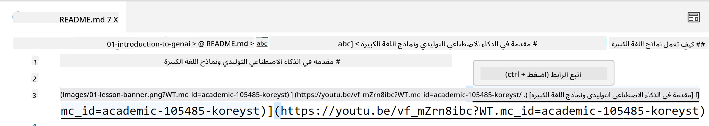
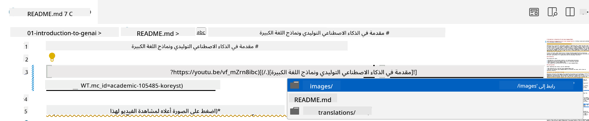
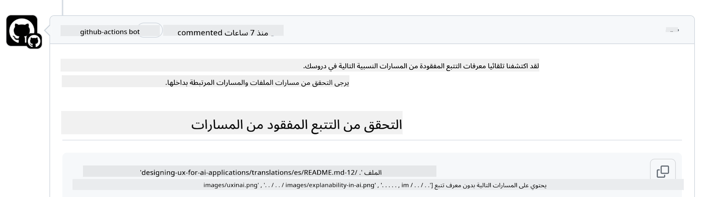
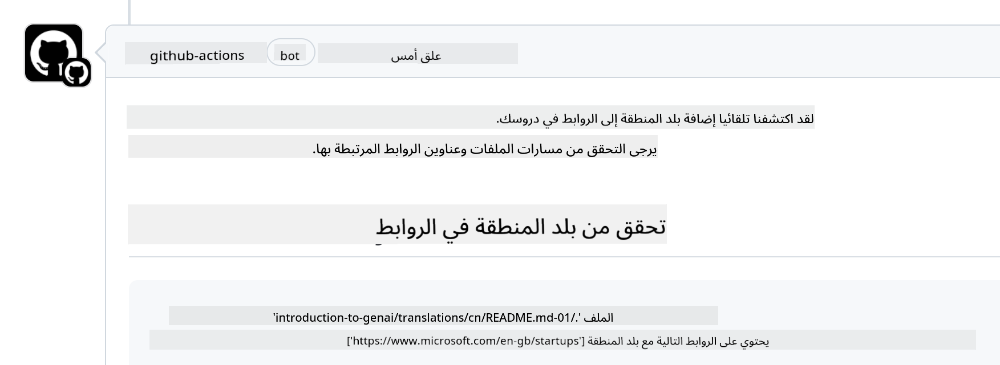

<!--
CO_OP_TRANSLATOR_METADATA:
{
  "original_hash": "57c41f2af71001a2cff9d8eb797cb843",
  "translation_date": "2025-05-19T11:09:40+00:00",
  "source_file": "CONTRIBUTING.md",
  "language_code": "ar"
}
-->
# المساهمة

هذا المشروع يرحب بالمساهمات والاقتراحات. معظم المساهمات تتطلب منك الموافقة على اتفاقية ترخيص المساهم (CLA) التي تعلن أنك تملك الحق في، وتقوم فعلاً، بمنحنا الحقوق لاستخدام مساهمتك. لمزيد من التفاصيل، قم بزيارة <https://cla.microsoft.com>.

> مهم: عند ترجمة النص في هذا المستودع، يرجى التأكد من عدم استخدام الترجمة الآلية. سنقوم بالتحقق من الترجمات عبر المجتمع، لذا يرجى التطوع فقط للترجمات في اللغات التي تجيدها.

عند تقديم طلب سحب، سيقوم CLA-bot تلقائيًا بتحديد ما إذا كنت بحاجة إلى تقديم CLA وتزيين PR بشكل مناسب (مثل وضع علامة، تعليق). ببساطة اتبع التعليمات المقدمة من البوت. ستحتاج إلى القيام بذلك مرة واحدة فقط عبر جميع المستودعات التي تستخدم CLA الخاص بنا.

## مدونة السلوك

لقد اعتمد هذا المشروع [مدونة سلوك المصادر المفتوحة من مايكروسوفت](https://opensource.microsoft.com/codeofconduct/?WT.mc_id=academic-105485-koreyst). لمزيد من المعلومات اقرأ [الأسئلة الشائعة حول مدونة السلوك](https://opensource.microsoft.com/codeofconduct/faq/?WT.mc_id=academic-105485-koreyst) أو تواصل مع [opencode@microsoft.com](mailto:opencode@microsoft.com) لأي أسئلة أو تعليقات إضافية.

## سؤال أو مشكلة؟

يرجى عدم فتح قضايا GitHub للأسئلة العامة للدعم لأن قائمة GitHub يجب أن تُستخدم لطلبات الميزات وتقرير الأخطاء. بهذه الطريقة يمكننا تتبع المشاكل الفعلية أو الأخطاء من الكود والحفاظ على النقاش العام منفصلًا عن الكود الفعلي.

## الأخطاء الإملائية، المشاكل، الأخطاء والمساهمات

عند تقديم أي تغييرات إلى مستودع الذكاء الاصطناعي التوليدي للمبتدئين، يرجى اتباع هذه التوصيات.

* قم دائمًا بعمل فورك للمستودع إلى حسابك الخاص قبل إجراء التعديلات
* لا تجمع بين تغييرات متعددة في طلب سحب واحد. على سبيل المثال، قدم أي إصلاح للأخطاء وتحديثات الوثائق باستخدام PRs منفصلة
* إذا أظهر طلب السحب الخاص بك تعارضات في الدمج، تأكد من تحديث النسخة المحلية الخاصة بك لتكون مرآة لما هو في المستودع الرئيسي قبل إجراء التعديلات
* إذا كنت تقدم ترجمة، يرجى إنشاء PR واحد لجميع الملفات المترجمة حيث أننا لا نقبل الترجمات الجزئية للمحتوى
* إذا كنت تقدم إصلاحًا لأخطاء إملائية أو وثائق، يمكنك دمج التعديلات في PR واحد حيثما كان ذلك مناسبًا

## إرشادات عامة للكتابة

- تأكد من أن جميع روابطك محاطة بأقواس مربعة تليها قوس دائري بدون مسافات إضافية حولها أو داخلها ``.
- تأكد من أن أي رابط نسبي (أي روابط لملفات ومجلدات أخرى في المستودع) يبدأ بـ `./` للإشارة إلى ملف أو مجلد موجود في الدليل العامل الحالي أو `../` للإشارة إلى ملف أو مجلد موجود في دليل عمل رئيسي.
- تأكد من أن أي رابط نسبي (أي روابط لملفات ومجلدات أخرى في المستودع) يحتوي على معرف تتبع (أي `?` أو `&` ثم `wt.mc_id=` أو `WT.mc_id=`) في نهايته.
- تأكد من أن أي URL من النطاقات التالية _github.com, microsoft.com, visualstudio.com, aka.ms, و azure.com_ يحتوي على معرف تتبع (أي `?` أو `&` ثم `wt.mc_id=` أو `WT.mc_id=`) في نهايته.
- تأكد من أن روابطك لا تحتوي على لغة محلية خاصة بالدولة (أي `/en-us/` أو `/en/`).
- تأكد من أن جميع الصور مخزنة في مجلد `./images`.
- تأكد من أن الصور تحمل أسماء وصفية باستخدام أحرف إنجليزية، أرقام، وشرطات في اسم الصورة.

## سير العمل في GitHub

عند تقديم طلب سحب، سيتم تفعيل أربعة سير عمل مختلفة للتحقق من القواعد السابقة. ببساطة اتبع التعليمات المدرجة هنا لاجتياز فحوصات سير العمل.

- [التحقق من المسارات النسبية المكسورة](../..)
- [التحقق من أن المسارات تحتوي على تتبع](../..)
- [التحقق من أن الروابط تحتوي على تتبع](../..)
- [التحقق من أن الروابط لا تحتوي على لغة محلية](../..)

### التحقق من المسارات النسبية المكسورة

هذا سير العمل يضمن أن أي مسار نسبي في ملفاتك يعمل بشكل صحيح. يتم نشر هذا المستودع على صفحات GitHub لذا تحتاج إلى أن تكون حذرًا جدًا عند كتابة الروابط التي تربط كل شيء معًا حتى لا توجه أي شخص إلى المكان الخطأ.

للتأكد من أن روابطك تعمل بشكل صحيح ببساطة استخدم VS code للتحقق من ذلك.

على سبيل المثال، عند التمرير فوق أي رابط في ملفاتك سيتم مطالبتك باتباع الرابط بالضغط على **ctrl + click**

إذا نقرت على رابط ولم يعمل محليًا، فبالتأكيد سيثير سير العمل ولن يعمل على GitHub.

لإصلاح هذه المشكلة، حاول كتابة الرابط بمساعدة VS code.

عند كتابة `./` أو `../` سيقترح عليك VS code الاختيار من بين الخيارات المتاحة وفقًا لما كتبته.

اتبع المسار بالنقر على الملف أو المجلد المطلوب وستتأكد من أن مسارك ليس مكسورًا.

بمجرد إضافة المسار النسبي الصحيح، احفظ وادفع تغييراتك سيتم تفعيل سير العمل مرة أخرى للتحقق من تغييراتك. إذا اجتزت الفحص فأنت جاهز للانطلاق.

### التحقق من أن المسارات تحتوي على تتبع

هذا سير العمل يضمن أن أي مسار نسبي يحتوي على تتبع فيه. يتم نشر هذا المستودع على صفحات GitHub لذا نحتاج إلى تتبع الحركة بين الملفات والمجلدات المختلفة.

للتأكد من أن مساراتك النسبية تحتوي على تتبع فيها ببساطة تحقق من النص التالي `?wt.mc_id=` في نهاية المسار. إذا كان مضافًا إلى مساراتك النسبية فستجتاز هذا الفحص.

إذا لم يكن كذلك، قد تحصل على الخطأ التالي.

لإصلاح هذه المشكلة، حاول فتح مسار الملف الذي أشار إليه سير العمل وأضف معرف التتبع إلى نهاية المسارات النسبية.

بمجرد إضافة معرف التتبع، احفظ وادفع تغييراتك سيتم تفعيل سير العمل مرة أخرى للتحقق من تغييراتك. إذا اجتزت الفحص فأنت جاهز للانطلاق.

### التحقق من أن الروابط تحتوي على تتبع

هذا سير العمل يضمن أن أي URL ويب يحتوي على تتبع فيه. هذا المستودع متاح للجميع لذا تحتاج إلى التأكد من تتبع الوصول لمعرفة من أين يأتي الحركة.

للتأكد من أن روابطك تحتوي على تتبع فيها ببساطة تحقق من النص التالي `?wt.mc_id=` في نهاية الرابط. إذا كان مضافًا إلى روابطك فستجتاز هذا الفحص.

إذا لم يكن كذلك، قد تحصل على الخطأ التالي.

لإصلاح هذه المشكلة، حاول فتح مسار الملف الذي أشار إليه سير العمل وأضف معرف التتبع إلى نهاية الروابط.

بمجرد إضافة معرف التتبع، احفظ وادفع تغييراتك سيتم تفعيل سير العمل مرة أخرى للتحقق من تغييراتك. إذا اجتزت الفحص فأنت جاهز للانطلاق.

### التحقق من أن الروابط لا تحتوي على لغة محلية

هذا سير العمل يضمن أن أي URL ويب لا يحتوي على لغة محلية خاصة بالدولة. هذا المستودع متاح للجميع حول العالم لذا تحتاج إلى التأكد من عدم تضمين لغة دولتك المحلية في الروابط.

للتأكد من أن روابطك لا تحتوي على لغة محلية ببساطة تحقق من النص التالي `/en-us/` أو `/en/` أو أي لغة محلية أخرى في أي مكان في الرابط. إذا لم يكن موجودًا في روابطك فستجتاز هذا الفحص.

إذا لم يكن كذلك، قد تحصل على الخطأ التالي.

لإصلاح هذه المشكلة، حاول فتح مسار الملف الذي أشار إليه سير العمل وإزالة اللغة المحلية من الروابط.

بمجرد إزالة اللغة المحلية، احفظ وادفع تغييراتك سيتم تفعيل سير العمل مرة أخرى للتحقق من تغييراتك. إذا اجتزت الفحص فأنت جاهز للانطلاق.

تهانينا! سنعود إليك في أقرب وقت ممكن مع ملاحظات حول مساهمتك.

**إخلاء المسؤولية**:  
تمت ترجمة هذا المستند باستخدام خدمة الترجمة بالذكاء الاصطناعي [Co-op Translator](https://github.com/Azure/co-op-translator). بينما نسعى لتحقيق الدقة، يرجى العلم أن الترجمات الآلية قد تحتوي على أخطاء أو عدم دقة. يجب اعتبار المستند الأصلي بلغته الأصلية هو المصدر الموثوق. للحصول على معلومات حيوية، يُوصى بالترجمة البشرية الاحترافية. نحن غير مسؤولين عن أي سوء فهم أو تفسيرات خاطئة تنشأ عن استخدام هذه الترجمة.