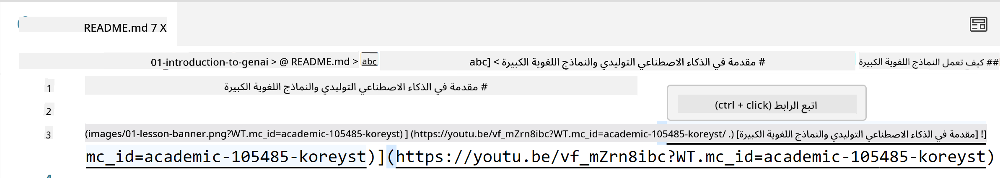
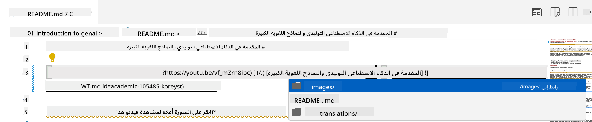
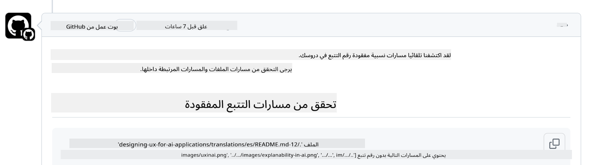
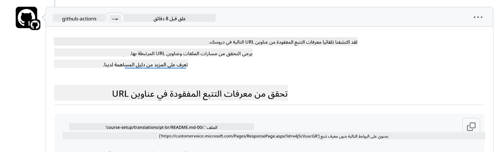
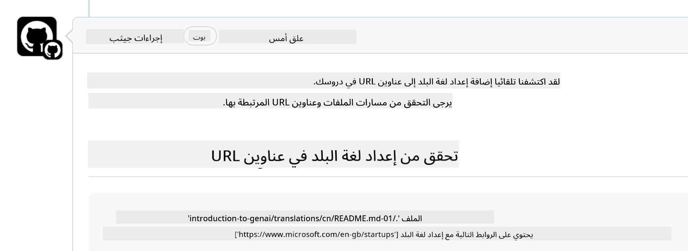

<!--
CO_OP_TRANSLATOR_METADATA:
{
  "original_hash": "57c41f2af71001a2cff9d8eb797cb843",
  "translation_date": "2025-06-25T07:00:24+00:00",
  "source_file": "CONTRIBUTING.md",
  "language_code": "ar"
}
-->
# المساهمة

يرحب هذا المشروع بالمساهمات والاقتراحات. تتطلب معظم المساهمات منك الموافقة على اتفاقية ترخيص المساهمين (CLA) التي تُعلن أنك تمتلك الحق في منحنا حقوق استخدام مساهمتك. لمزيد من التفاصيل، قم بزيارة <https://cla.microsoft.com>.

> مهم: عند ترجمة النص في هذا المستودع، يرجى التأكد من عدم استخدام الترجمة الآلية. سنقوم بالتحقق من الترجمات عبر المجتمع، لذا يرجى التطوع للترجمة فقط في اللغات التي تتقنها.

عند تقديم طلب دمج، سيقوم الروبوت الخاص بـ CLA تلقائيًا بتحديد ما إذا كنت بحاجة إلى تقديم CLA وتزيين PR بشكل مناسب (مثل وضع علامة، تعليق). ببساطة اتبع التعليمات المقدمة من الروبوت. ستحتاج إلى القيام بذلك مرة واحدة فقط عبر جميع المستودعات التي تستخدم CLA الخاص بنا.

## مدونة قواعد السلوك

لقد اعتمد هذا المشروع [مدونة قواعد السلوك مفتوحة المصدر من مايكروسوفت](https://opensource.microsoft.com/codeofconduct/?WT.mc_id=academic-105485-koreyst).
لمزيد من المعلومات، اقرأ [الأسئلة الشائعة حول مدونة قواعد السلوك](https://opensource.microsoft.com/codeofconduct/faq/?WT.mc_id=academic-105485-koreyst) أو تواصل مع [opencode@microsoft.com](mailto:opencode@microsoft.com) لأي أسئلة أو تعليقات إضافية.

## سؤال أو مشكلة؟

يرجى عدم فتح قضايا GitHub للأسئلة العامة المتعلقة بالدعم حيث يجب استخدام قائمة GitHub لطلبات الميزات وتقارير الأخطاء. بهذه الطريقة يمكننا تتبع المشكلات أو الأخطاء الفعلية من الكود والحفاظ على النقاش العام منفصلًا عن الكود الفعلي.

## الأخطاء المطبعية، القضايا، الأخطاء والمساهمات

عند تقديم أي تغييرات إلى مستودع Generative AI for Beginners، يرجى اتباع هذه التوصيات.

* قم دائمًا بتفريع المستودع إلى حسابك الخاص قبل إجراء تعديلاتك
* لا تجمع بين تغييرات متعددة في طلب دمج واحد. على سبيل المثال، قدم أي إصلاح للأخطاء وتحديثات الوثائق باستخدام PRs منفصلة
* إذا أظهر طلب الدمج الخاص بك تعارضات دمج، تأكد من تحديث الفرع المحلي ليكون مرآة لما هو موجود في المستودع الرئيسي قبل إجراء تعديلاتك
* إذا كنت تقدم ترجمة، يرجى إنشاء PR واحد لجميع الملفات المترجمة حيث لا نقبل الترجمات الجزئية للمحتوى
* إذا كنت تقدم إصلاحًا للخطأ المطبعي أو الوثائق، يمكنك دمج التعديلات في PR واحد حيث يكون ذلك مناسبًا

## التوجيه العام للكتابة

- تأكد من أن جميع روابط URL مغلفة بأقواس مربعة تليها قوس مع عدم وجود مسافات إضافية حولها أو داخلها ``.
- تأكد من أن أي رابط نسبي (أي روابط لملفات ومجلدات أخرى في المستودع) يبدأ بـ `./` يشير إلى ملف أو مجلد موجود في الدليل الحالي أو `../` يشير إلى ملف أو مجلد موجود في دليل الوالد.
- تأكد من أن أي رابط نسبي (أي روابط لملفات ومجلدات أخرى في المستودع) يحتوي على معرف تتبع (أي `?` أو `&` ثم `wt.mc_id=` أو `WT.mc_id=`) في نهايته.
- تأكد من أن أي URL من النطاقات التالية _github.com, microsoft.com, visualstudio.com, aka.ms, و azure.com_ يحتوي على معرف تتبع (أي `?` أو `&` ثم `wt.mc_id=` أو `WT.mc_id=`) في نهايته.
- تأكد من أن روابطك لا تحتوي على لغة محلية خاصة بالدولة فيها (أي `/en-us/` أو `/en/`).
- تأكد من أن جميع الصور مخزنة في مجلد `./images`.
- تأكد من أن الصور لها أسماء وصفية باستخدام أحرف إنجليزية وأرقام وشرطات في اسم الصورة.

## سير عمل GitHub

عند تقديم طلب دمج، سيتم تفعيل أربع سير عمل مختلفة للتحقق من القواعد السابقة. ببساطة اتبع التعليمات المدرجة هنا لاجتياز فحوصات سير العمل.

- [التحقق من المسارات النسبية المكسورة](../..)
- [التحقق من المسارات التي تحتوي على تتبع](../..)
- [التحقق من أن الروابط تحتوي على تتبع](../..)
- [التحقق من أن الروابط لا تحتوي على لغة محلية](../..)

### التحقق من المسارات النسبية المكسورة

يضمن هذا سير العمل أن أي مسار نسبي في ملفاتك يعمل. يتم نشر هذا المستودع على صفحات GitHub لذا عليك أن تكون حذرًا جدًا عند كتابة الروابط التي تربط كل شيء معًا لعدم توجيه أي شخص إلى المكان الخطأ.

للتأكد من أن روابطك تعمل بشكل صحيح، استخدم ببساطة VS code للتحقق من ذلك.

على سبيل المثال، عند التحويم فوق أي رابط في ملفاتك ستتم مطالبتك باتباع الرابط بالضغط على **ctrl + click**

إذا نقرت على رابط ولم يعمل محليًا، فبالتأكيد سيفشل سير العمل ولن يعمل على GitHub.

لحل هذه المشكلة، حاول كتابة الرابط بمساعدة VS code.

عند كتابة `./` أو `../` سيقوم VS code بتوجيهك لاختيار الخيارات المتاحة وفقًا لما كتبته.

اتبع المسار بالنقر على الملف أو المجلد المطلوب وستكون متأكدًا من أن مسارك ليس مكسورًا.

بمجرد إضافة المسار النسبي الصحيح، احفظ وادفع تغييراتك وسيتم تفعيل سير العمل مرة أخرى للتحقق من تغييراتك.
إذا اجتزت الفحص، فأنت جاهز للانطلاق.

### التحقق من أن المسارات تحتوي على تتبع

يضمن هذا سير العمل أن أي مسار نسبي يحتوي على تتبع فيه.
يتم نشر هذا المستودع على صفحات GitHub لذا نحتاج إلى تتبع الحركة بين الملفات والمجلدات المختلفة.

للتأكد من أن المسارات النسبية تحتوي على تتبع فيها، تحقق ببساطة من النص التالي `?wt.mc_id=` في نهاية المسار.
إذا كان مضافًا إلى المسارات النسبية، فستجتاز هذا الفحص.

إذا لم يكن كذلك، قد تحصل على الخطأ التالي.

لحل هذه المشكلة، حاول فتح مسار الملف الذي أبرزه سير العمل وأضف معرف التتبع إلى نهاية المسارات النسبية.

بمجرد إضافة معرف التتبع، احفظ وادفع تغييراتك وسيتم تفعيل سير العمل مرة أخرى للتحقق من تغييراتك.
إذا اجتزت الفحص، فأنت جاهز للانطلاق.

### التحقق من أن الروابط تحتوي على تتبع

يضمن هذا سير العمل أن أي رابط ويب يحتوي على تتبع فيه.
هذا المستودع متاح للجميع لذا تحتاج إلى التأكد من تتبع الوصول لمعرفة من أين يأتي المرور.

للتأكد من أن روابطك تحتوي على تتبع فيها، تحقق ببساطة من النص التالي `?wt.mc_id=` في نهاية الرابط.
إذا كان مضافًا إلى روابطك، فستجتاز هذا الفحص.

إذا لم يكن كذلك، قد تحصل على الخطأ التالي.

لحل هذه المشكلة، حاول فتح مسار الملف الذي أبرزه سير العمل وأضف معرف التتبع إلى نهاية الروابط.

بمجرد إضافة معرف التتبع، احفظ وادفع تغييراتك وسيتم تفعيل سير العمل مرة أخرى للتحقق من تغييراتك.
إذا اجتزت الفحص، فأنت جاهز للانطلاق.

### التحقق من أن الروابط لا تحتوي على لغة محلية

يضمن هذا سير العمل أن أي رابط ويب لا يحتوي على لغة محلية خاصة بالدولة فيه.
هذا المستودع متاح للجميع حول العالم لذا تحتاج إلى التأكد من عدم تضمين لغة دولتك المحلية في الروابط.

للتأكد من أن روابطك لا تحتوي على لغة محلية خاصة بالدولة فيها، تحقق ببساطة من النص التالي `/en-us/` أو `/en/` أو أي لغة محلية أخرى في أي مكان في الرابط.
إذا لم تكن موجودة في روابطك، فستجتاز هذا الفحص.

إذا لم يكن كذلك، قد تحصل على الخطأ التالي.

لحل هذه المشكلة، حاول فتح مسار الملف الذي أبرزه سير العمل وإزالة اللغة المحلية للدولة من الروابط.

بمجرد إزالة اللغة المحلية للدولة، احفظ وادفع تغييراتك وسيتم تفعيل سير العمل مرة أخرى للتحقق من تغييراتك.
إذا اجتزت الفحص، فأنت جاهز للانطلاق.

تهانينا! سنتواصل معك في أقرب وقت ممكن مع ملاحظات حول مساهمتك.

**إخلاء المسؤولية**:  
تمت ترجمة هذا المستند باستخدام خدمة الترجمة بالذكاء الاصطناعي [Co-op Translator](https://github.com/Azure/co-op-translator). بينما نسعى لتحقيق الدقة، يرجى العلم بأن الترجمات الآلية قد تحتوي على أخطاء أو عدم دقة. يجب اعتبار المستند الأصلي بلغته الأصلية هو المصدر الموثوق. بالنسبة للمعلومات الحرجة، يُوصى بالترجمة البشرية الاحترافية. نحن غير مسؤولين عن أي سوء فهم أو تفسيرات خاطئة تنشأ عن استخدام هذه الترجمة.