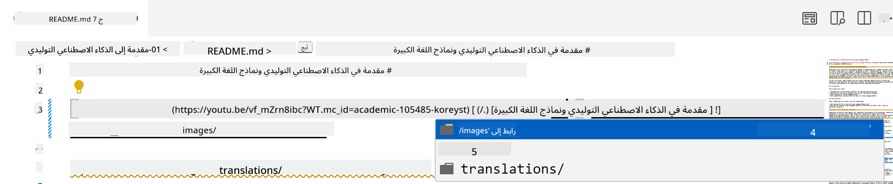
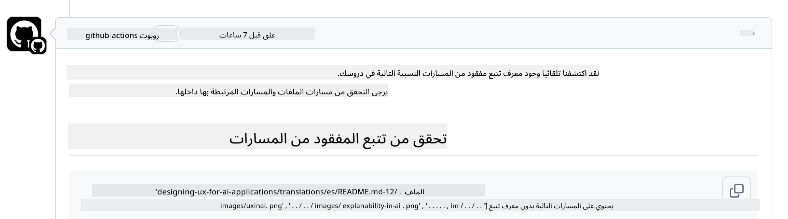
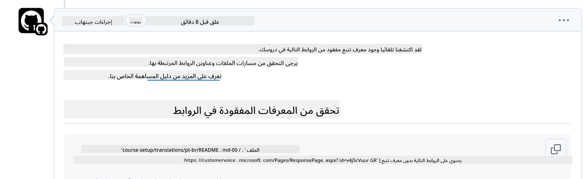

<!--
CO_OP_TRANSLATOR_METADATA:
{
  "original_hash": "57c41f2af71001a2cff9d8eb797cb843",
  "translation_date": "2025-07-09T05:48:31+00:00",
  "source_file": "CONTRIBUTING.md",
  "language_code": "ar"
}
-->
# المساهمة

يرحب هذا المشروع بالمساهمات والاقتراحات. تتطلب معظم المساهمات منك
الموافقة على اتفاقية ترخيص المساهمين (CLA) التي تُعلن أنك تملك الحق في،
وتمنحنا فعليًا، الحقوق لاستخدام مساهمتك. لمزيد من التفاصيل، قم بزيارة
<https://cla.microsoft.com>.

> مهم: عند ترجمة النصوص في هذا المستودع، يرجى التأكد من عدم استخدام الترجمة الآلية. سنقوم بالتحقق من الترجمات عبر المجتمع، لذا يرجى التطوع فقط لترجمات اللغات التي تجيدها.

عند تقديم طلب سحب، سيقوم بوت CLA تلقائيًا بتحديد ما إذا كنت بحاجة
لتقديم اتفاقية CLA وتزيين طلب السحب بشكل مناسب (مثل: تسمية، تعليق). فقط اتبع
التعليمات التي يقدمها البوت. ستحتاج إلى القيام بذلك مرة واحدة فقط عبر جميع المستودعات التي تستخدم اتفاقية CLA الخاصة بنا.

## مدونة السلوك

اعتمد هذا المشروع [مدونة السلوك مفتوحة المصدر من مايكروسوفت](https://opensource.microsoft.com/codeofconduct/?WT.mc_id=academic-105485-koreyst).
لمزيد من المعلومات، اقرأ [الأسئلة الشائعة حول مدونة السلوك](https://opensource.microsoft.com/codeofconduct/faq/?WT.mc_id=academic-105485-koreyst) أو تواصل مع [opencode@microsoft.com](mailto:opencode@microsoft.com) لأي أسئلة أو تعليقات إضافية.

## سؤال أو مشكلة؟

يرجى عدم فتح قضايا على GitHub لأسئلة الدعم العامة حيث يجب استخدام قائمة GitHub لطلبات الميزات وتقارير الأخطاء. بهذه الطريقة يمكننا تتبع المشاكل أو الأخطاء الفعلية في الكود بسهولة أكبر وفصل النقاش العام عن الكود الفعلي.

## الأخطاء، المشاكل، العلل والمساهمات

عند تقديم أي تغييرات على مستودع Generative AI for Beginners، يرجى اتباع التوصيات التالية.

* دائمًا قم بعمل فورك للمستودع إلى حسابك الخاص قبل إجراء التعديلات
* لا تدمج تغييرات متعددة في طلب سحب واحد. على سبيل المثال، قدم أي إصلاح للأخطاء وتحديثات التوثيق باستخدام طلبات سحب منفصلة
* إذا أظهر طلب السحب الخاص بك تعارضات في الدمج، تأكد من تحديث الفرع الرئيسي المحلي ليكون نسخة مطابقة لما هو موجود في المستودع الرئيسي قبل إجراء التعديلات
* إذا كنت تقدم ترجمة، يرجى إنشاء طلب سحب واحد لجميع الملفات المترجمة لأننا لا نقبل الترجمات الجزئية للمحتوى
* إذا كنت تقدم تصحيحًا للأخطاء الإملائية أو التوثيق، يمكنك دمج التعديلات في طلب سحب واحد حيثما كان ذلك مناسبًا

## إرشادات عامة للكتابة

- تأكد من أن جميع عناوين URL الخاصة بك مغلفة بأقواس مربعة تليها أقواس عادية بدون مسافات زائدة حولها أو بداخلها ``.
- تأكد من أن أي رابط نسبي (أي روابط لملفات ومجلدات أخرى في المستودع) يبدأ بـ `./` للإشارة إلى ملف أو مجلد موجود في دليل العمل الحالي أو بـ `../` للإشارة إلى ملف أو مجلد موجود في دليل العمل الأب.
- تأكد من أن أي رابط نسبي يحتوي على معرف تتبع (أي `?` أو `&` ثم `wt.mc_id=` أو `WT.mc_id=`) في نهايته.
- تأكد من أن أي عنوان URL من النطاقات التالية _github.com, microsoft.com, visualstudio.com, aka.ms, و azure.com_ يحتوي على معرف تتبع (أي `?` أو `&` ثم `wt.mc_id=` أو `WT.mc_id=`) في نهايته.
- تأكد من أن روابطك لا تحتوي على إعدادات محلية خاصة بالدولة (أي `/en-us/` أو `/en/`).
- تأكد من أن جميع الصور مخزنة في مجلد `./images`.
- تأكد من أن أسماء الصور وصفية وتستخدم أحرف إنجليزية وأرقام وشرطات في اسم الصورة.

## سير عمل GitHub

عند تقديم طلب سحب، سيتم تشغيل أربعة سير عمل مختلفة للتحقق من القواعد السابقة.
فقط اتبع التعليمات المدرجة هنا لاجتياز فحوصات سير العمل.

- [التحقق من المسارات النسبية المعطلة](../..)
- [التحقق من وجود تتبع في المسارات](../..)
- [التحقق من وجود تتبع في عناوين URL](../..)
- [التحقق من عدم وجود إعدادات محلية في عناوين URL](../..)

### التحقق من المسارات النسبية المعطلة

يضمن هذا سير العمل أن أي مسار نسبي في ملفاتك يعمل بشكل صحيح.
يتم نشر هذا المستودع على صفحات GitHub لذا يجب أن تكون حذرًا جدًا عند كتابة الروابط التي تربط كل شيء معًا حتى لا توجه أي شخص إلى مكان خاطئ.

للتأكد من أن روابطك تعمل بشكل صحيح، استخدم VS code للتحقق من ذلك.

على سبيل المثال، عند تحريك المؤشر فوق أي رابط في ملفاتك، سيُطلب منك اتباع الرابط بالضغط على **ctrl + click**

إذا نقرت على رابط ولم يعمل محليًا، فمن المؤكد أنه سيؤدي إلى فشل سير العمل ولن يعمل على GitHub.

لحل هذه المشكلة، حاول كتابة الرابط بمساعدة VS code.

عند كتابة `./` أو `../` سيقترح عليك VS code الخيارات المتاحة بناءً على ما كتبته.

اتبع المسار بالنقر على الملف أو المجلد المطلوب وستتأكد من أن مسارك غير معطل.

بمجرد إضافة المسار النسبي الصحيح، احفظ وادفع التغييرات وسيتم تشغيل سير العمل مرة أخرى للتحقق من تغييراتك.
إذا اجتزت الفحص، فأنت جاهز للمتابعة.

### التحقق من وجود تتبع في المسارات

يضمن هذا سير العمل أن أي مسار نسبي يحتوي على تتبع.
يتم نشر هذا المستودع على صفحات GitHub لذا نحتاج إلى تتبع التنقل بين الملفات والمجلدات المختلفة.

للتأكد من أن مساراتك النسبية تحتوي على تتبع، تحقق ببساطة من وجود النص التالي `?wt.mc_id=` في نهاية المسار.
إذا كان مضافًا إلى مساراتك النسبية، فستجتاز هذا الفحص.

إذا لم يكن كذلك، قد تحصل على الخطأ التالي.

لحل هذه المشكلة، افتح مسار الملف الذي أشار إليه سير العمل وأضف معرف التتبع إلى نهاية المسارات النسبية.

بمجرد إضافة معرف التتبع، احفظ وادفع التغييرات وسيتم تشغيل سير العمل مرة أخرى للتحقق من تغييراتك.
إذا اجتزت الفحص، فأنت جاهز للمتابعة.

### التحقق من وجود تتبع في عناوين URL

يضمن هذا سير العمل أن أي عنوان ويب يحتوي على تتبع.
هذا المستودع متاح للجميع لذا يجب التأكد من تتبع الوصول لمعرفة مصدر الحركة.

للتأكد من أن عناوين URL الخاصة بك تحتوي على تتبع، تحقق ببساطة من وجود النص التالي `?wt.mc_id=` في نهاية عنوان URL.
إذا كان مضافًا إلى عناوين URL الخاصة بك، فستجتاز هذا الفحص.

إذا لم يكن كذلك، قد تحصل على الخطأ التالي.

لحل هذه المشكلة، افتح مسار الملف الذي أشار إليه سير العمل وأضف معرف التتبع إلى نهاية عناوين URL.

بمجرد إضافة معرف التتبع، احفظ وادفع التغييرات وسيتم تشغيل سير العمل مرة أخرى للتحقق من تغييراتك.
إذا اجتزت الفحص، فأنت جاهز للمتابعة.

### التحقق من عدم وجود إعدادات محلية في عناوين URL

يضمن هذا سير العمل أن أي عنوان ويب لا يحتوي على إعدادات محلية خاصة بالدولة.
هذا المستودع متاح للجميع حول العالم لذا يجب التأكد من عدم تضمين إعدادات محلية لبلدك في عناوين URL.

للتأكد من أن عناوين URL الخاصة بك لا تحتوي على إعدادات محلية، تحقق ببساطة من وجود النص التالي `/en-us/` أو `/en/` أو أي إعداد محلي للغة أخرى في أي مكان في عنوان URL.
إذا لم يكن موجودًا في عناوين URL الخاصة بك، فستجتاز هذا الفحص.

إذا كان موجودًا، قد تحصل على الخطأ التالي.

لحل هذه المشكلة، افتح مسار الملف الذي أشار إليه سير العمل وأزل الإعداد المحلي من عناوين URL.

بمجرد إزالة الإعداد المحلي، احفظ وادفع التغييرات وسيتم تشغيل سير العمل مرة أخرى للتحقق من تغييراتك.
إذا اجتزت الفحص، فأنت جاهز للمتابعة.

تهانينا! سنعود إليك في أقرب وقت ممكن بملاحظات حول مساهمتك.

**إخلاء المسؤولية**:  
تمت ترجمة هذا المستند باستخدام خدمة الترجمة الآلية [Co-op Translator](https://github.com/Azure/co-op-translator). بينما نسعى لتحقيق الدقة، يرجى العلم أن الترجمات الآلية قد تحتوي على أخطاء أو عدم دقة. يجب اعتبار المستند الأصلي بلغته الأصلية المصدر الموثوق به. للمعلومات الهامة، يُنصح بالترجمة البشرية المهنية. نحن غير مسؤولين عن أي سوء فهم أو تفسير ناتج عن استخدام هذه الترجمة.