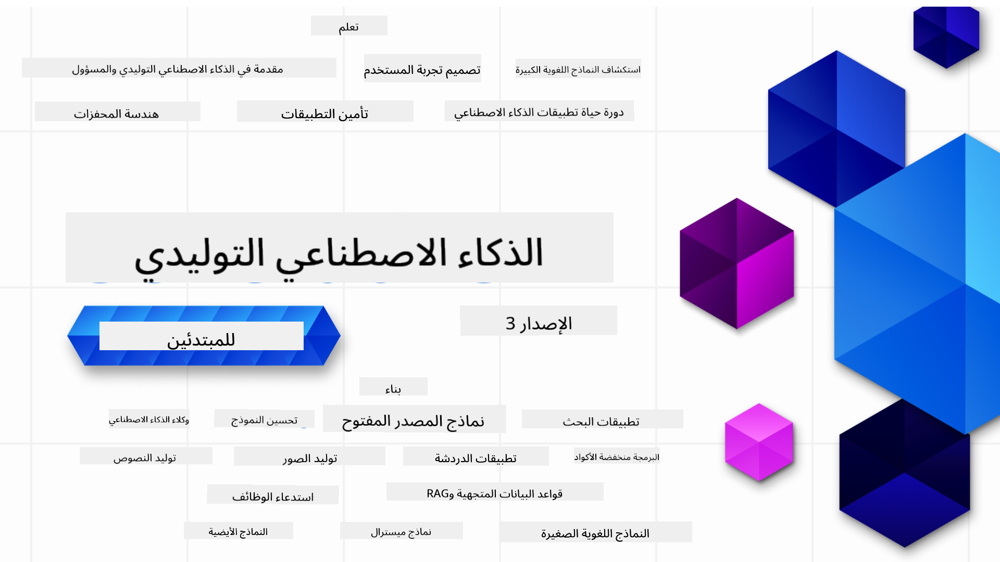

<!--
CO_OP_TRANSLATOR_METADATA:
{
  "original_hash": "f7e9011b478e180177185b73939b774c",
  "translation_date": "2025-10-17T12:51:34+00:00",
  "source_file": "README.md",
  "language_code": "ar"
}
-->

### 21 درسًا تعلمك كل ما تحتاجه للبدء في بناء تطبيقات الذكاء الاصطناعي التوليدي

  
  
  
  
  

  
  
  

### 🌐 دعم متعدد اللغات

#### مدعوم عبر GitHub Action (تلقائي ودائم التحديث)

[العربية](./README.md) | [البنغالية](../bn/README.md) | [البلغارية](../bg/README.md) | [البورمية (ميانمار)](../my/README.md) | [الصينية (المبسطة)](../zh/README.md) | [الصينية (التقليدية، هونغ كونغ)](../hk/README.md) | [الصينية (التقليدية، ماكاو)](../mo/README.md) | [الصينية (التقليدية، تايوان)](../tw/README.md) | [الكرواتية](../hr/README.md) | [التشيكية](../cs/README.md) | [الدانماركية](../da/README.md) | [الهولندية](../nl/README.md) | [الإستونية](../et/README.md) | [الفنلندية](../fi/README.md) | [الفرنسية](../fr/README.md) | [الألمانية](../de/README.md) | [اليونانية](../el/README.md) | [العبرية](../he/README.md) | [الهندية](../hi/README.md) | [الهنغارية](../hu/README.md) | [الإندونيسية](../id/README.md) | [الإيطالية](../it/README.md) | [اليابانية](../ja/README.md) | [الكورية](../ko/README.md) | [الليتوانية](../lt/README.md) | [الماليزية](../ms/README.md) | [الماراثية](../mr/README.md) | [النيبالية](../ne/README.md) | [النرويجية](../no/README.md) | [الفارسية (فارسي)](../fa/README.md) | [البولندية](../pl/README.md) | [البرتغالية (البرازيل)](../br/README.md) | [البرتغالية (البرتغال)](../pt/README.md) | [البنجابية (غورموخي)](../pa/README.md) | [الرومانية](../ro/README.md) | [الروسية](../ru/README.md) | [الصربية (السيريلية)](../sr/README.md) | [السلوفاكية](../sk/README.md) | [السلوفينية](../sl/README.md) | [الإسبانية](../es/README.md) | [السواحيلية](../sw/README.md) | [السويدية](../sv/README.md) | [التاغالوغية (الفلبينية)](../tl/README.md) | [التاميلية](../ta/README.md) | [التايلاندية](../th/README.md) | [التركية](../tr/README.md) | [الأوكرانية](../uk/README.md) | [الأردية](../ur/README.md) | [الفيتنامية](../vi/README.md)

# الذكاء الاصطناعي التوليدي للمبتدئين (الإصدار الثالث) - دورة تدريبية

تعلم أساسيات بناء تطبيقات الذكاء الاصطناعي التوليدي من خلال دورة شاملة مكونة من 21 درسًا مقدمة من Microsoft Cloud Advocates.

## 🌱 البداية

تتكون هذه الدورة من 21 درسًا. كل درس يغطي موضوعًا خاصًا، لذا يمكنك البدء من أي مكان يناسبك!

الدروس مصنفة إما كدروس "تعلم" تشرح مفهومًا في الذكاء الاصطناعي التوليدي أو كدروس "بناء" تشرح المفهوم مع أمثلة برمجية بلغة **Python** و **TypeScript** عندما يكون ذلك ممكنًا.

للمطورين باستخدام .NET، تحقق من [الذكاء الاصطناعي التوليدي للمبتدئين (إصدار .NET)](https://github.com/microsoft/Generative-AI-for-beginners-dotnet?WT.mc_id=academic-105485-koreyst)!

كل درس يتضمن أيضًا قسم "استمر في التعلم" مع أدوات تعليمية إضافية.

## ما الذي تحتاجه؟
### لتشغيل الكود الخاص بهذه الدورة، يمكنك استخدام:
 - [خدمة Azure OpenAI](https://aka.ms/genai-beginners/azure-open-ai?WT.mc_id=academic-105485-koreyst) - **الدروس:** "aoai-assignment"  
 - [كتالوج نماذج GitHub Marketplace](https://aka.ms/genai-beginners/gh-models?WT.mc_id=academic-105485-koreyst) - **الدروس:** "githubmodels"  
 - [واجهة برمجة التطبيقات OpenAI](https://aka.ms/genai-beginners/open-ai?WT.mc_id=academic-105485-koreyst) - **الدروس:** "oai-assignment"  

- معرفة أساسية بلغة Python أو TypeScript ستكون مفيدة - \*للمبتدئين تمامًا، تحقق من هذه الدورات [Python](https://aka.ms/genai-beginners/python?WT.mc_id=academic-105485-koreyst) و [TypeScript](https://aka.ms/genai-beginners/typescript?WT.mc_id=academic-105485-koreyst)  
- حساب GitHub لـ [نسخ هذا المستودع بالكامل](https://aka.ms/genai-beginners/github?WT.mc_id=academic-105485-koreyst) إلى حسابك الخاص على GitHub  

لقد قمنا بإنشاء درس **[إعداد الدورة](./00-course-setup/README.md?WT.mc_id=academic-105485-koreyst)** لمساعدتك في إعداد بيئة التطوير الخاصة بك.

لا تنسَ [إضافة نجمة (🌟) لهذا المستودع](https://docs.github.com/en/get-started/exploring-projects-on-github/saving-repositories-with-stars?WT.mc_id=academic-105485-koreyst) لتجده بسهولة لاحقًا.

## 🧠 جاهز للنشر؟

إذا كنت تبحث عن أمثلة برمجية متقدمة، تحقق من [مجموعة نماذج الكود للذكاء الاصطناعي التوليدي](https://aka.ms/genai-beg-code?WT.mc_id=academic-105485-koreyst) بلغة **Python** و **TypeScript**.

## 🗣️ قابل متعلمين آخرين واحصل على الدعم

انضم إلى [الخادم الرسمي لـ Azure AI Foundry على Discord](https://aka.ms/genai-discord?WT.mc_id=academic-105485-koreyst) لتقابل وتتعرف على متعلمين آخرين يأخذون هذه الدورة واحصل على الدعم.

اطرح الأسئلة أو شارك ملاحظات المنتج في [منتدى مطوري Azure AI Foundry](https://aka.ms/azureaifoundry/forum) على GitHub.

## 🚀 بناء شركة ناشئة؟

قم بزيارة [Microsoft for Startups](https://www.microsoft.com/startups) لمعرفة كيفية البدء باستخدام أرصدة Azure اليوم.

## 🙏 هل تريد المساعدة؟

هل لديك اقتراحات أو وجدت أخطاء في الكتابة أو الكود؟ [قم بفتح مشكلة](https://github.com/microsoft/generative-ai-for-beginners/issues?WT.mc_id=academic-105485-koreyst) أو [أنشئ طلب سحب](https://github.com/microsoft/generative-ai-for-beginners/pulls?WT.mc_id=academic-105485-koreyst)

## 📂 كل درس يتضمن:

- مقدمة فيديو قصيرة عن الموضوع  
- درس مكتوب موجود في README  
- أمثلة برمجية بلغة Python و TypeScript تدعم Azure OpenAI و OpenAI API  
- روابط لموارد إضافية لمواصلة التعلم  

## 🗃️ الدروس

| #   | **رابط الدرس**                                                                                                                              | **الوصف**                                                                                 | **الفيديو**                                                                   | **تعلم إضافي**                                                             |
| --- | -------------------------------------------------------------------------------------------------------------------------------------------- | ----------------------------------------------------------------------------------------------- | --------------------------------------------------------------------------- | ------------------------------------------------------------------------------ |
| 00  | [إعداد الدورة](./00-course-setup/README.md?WT.mc_id=academic-105485-koreyst)                                                                 | **تعلم:** كيفية إعداد بيئة التطوير الخاصة بك                                            | الفيديو قريبًا                                                                 | [تعلم المزيد](https://aka.ms/genai-collection?WT.mc_id=academic-105485-koreyst) |
| 01  | [مقدمة في الذكاء الاصطناعي التوليدي ونماذج اللغة الكبيرة](./01-introduction-to-genai/README.md?WT.mc_id=academic-105485-koreyst)                              | **تعلم:** فهم ما هو الذكاء الاصطناعي التوليدي وكيف تعمل نماذج اللغة الكبيرة (LLMs).       | [الفيديو](https://aka.ms/gen-ai-lesson-1-gh?WT.mc_id=academic-105485-koreyst) | [تعلم المزيد](https://aka.ms/genai-collection?WT.mc_id=academic-105485-koreyst) |
| 02  | [استكشاف ومقارنة نماذج اللغة الكبيرة المختلفة](./02-exploring-and-comparing-different-llms/README.md?WT.mc_id=academic-105485-koreyst)             | **تعلم:** كيفية اختيار النموذج المناسب لحالتك.                                      | [الفيديو](https://aka.ms/gen-ai-lesson2-gh?WT.mc_id=academic-105485-koreyst)  | [تعلم المزيد](https://aka.ms/genai-collection?WT.mc_id=academic-105485-koreyst) |
| 03  | [استخدام الذكاء الاصطناعي التوليدي بمسؤولية](./03-using-generative-ai-responsibly/README.md?WT.mc_id=academic-105485-koreyst)                           | **تعلم:** كيفية بناء تطبيقات الذكاء الاصطناعي التوليدي بمسؤولية.                                  | [الفيديو](https://aka.ms/gen-ai-lesson3-gh?WT.mc_id=academic-105485-koreyst)  | [تعلم المزيد](https://aka.ms/genai-collection?WT.mc_id=academic-105485-koreyst) |
| 04  | [فهم أساسيات هندسة التوجيه](./04-prompt-engineering-fundamentals/README.md?WT.mc_id=academic-105485-koreyst)             | **تعلم:** أفضل الممارسات العملية لهندسة التوجيه.                                           | [الفيديو](https://aka.ms/gen-ai-lesson4-gh?WT.mc_id=academic-105485-koreyst)  | [تعلم المزيد](https://aka.ms/genai-collection?WT.mc_id=academic-105485-koreyst) |
| 05  | [إنشاء توجيهات متقدمة](./05-advanced-prompts/README.md?WT.mc_id=academic-105485-koreyst)                                                | **تعلم:** كيفية تطبيق تقنيات هندسة التوجيه التي تحسن نتائج التوجيهات الخاصة بك. | [الفيديو](https://aka.ms/gen-ai-lesson5-gh?WT.mc_id=academic-105485-koreyst)  | [تعلم المزيد](https://aka.ms/genai-collection?WT.mc_id=academic-105485-koreyst) |
| 06  | [بناء تطبيقات توليد النصوص](./06-text-generation-apps/README.md?WT.mc_id=academic-105485-koreyst)                                | **بناء:** تطبيق لتوليد النصوص باستخدام Azure OpenAI / OpenAI API                                | [فيديو](https://aka.ms/gen-ai-lesson6-gh?WT.mc_id=academic-105485-koreyst)  | [تعرف أكثر](https://aka.ms/genai-collection?WT.mc_id=academic-105485-koreyst) |
| 07  | [بناء تطبيقات الدردشة](./07-building-chat-applications/README.md?WT.mc_id=academic-105485-koreyst)                                     | **بناء:** تقنيات لبناء ودمج تطبيقات الدردشة بكفاءة.                                               | [فيديو](https://aka.ms/gen-ai-lessons7-gh?WT.mc_id=academic-105485-koreyst) | [تعرف أكثر](https://aka.ms/genai-collection?WT.mc_id=academic-105485-koreyst) |
| 08  | [بناء تطبيقات البحث باستخدام قواعد بيانات المتجهات](./08-building-search-applications/README.md?WT.mc_id=academic-105485-koreyst)        | **بناء:** تطبيق بحث يستخدم التضمينات للبحث عن البيانات.                                          | [فيديو](https://aka.ms/gen-ai-lesson8-gh?WT.mc_id=academic-105485-koreyst)  | [تعرف أكثر](https://aka.ms/genai-collection?WT.mc_id=academic-105485-koreyst) |
| 09  | [بناء تطبيقات توليد الصور](./09-building-image-applications/README.md?WT.mc_id=academic-105485-koreyst)                                | **بناء:** تطبيق لتوليد الصور                                                                     | [فيديو](https://aka.ms/gen-ai-lesson9-gh?WT.mc_id=academic-105485-koreyst)  | [تعرف أكثر](https://aka.ms/genai-collection?WT.mc_id=academic-105485-koreyst) |
| 10  | [بناء تطبيقات الذكاء الاصطناعي باستخدام أدوات البرمجة منخفضة الكود](./10-building-low-code-ai-applications/README.md?WT.mc_id=academic-105485-koreyst) | **بناء:** تطبيق ذكاء اصطناعي توليدي باستخدام أدوات منخفضة الكود                                   | [فيديو](https://aka.ms/gen-ai-lesson10-gh?WT.mc_id=academic-105485-koreyst) | [تعرف أكثر](https://aka.ms/genai-collection?WT.mc_id=academic-105485-koreyst) |
| 11  | [دمج التطبيقات الخارجية باستخدام استدعاء الوظائف](./11-integrating-with-function-calling/README.md?WT.mc_id=academic-105485-koreyst)   | **بناء:** ما هو استدعاء الوظائف وحالات استخدامه في التطبيقات                                      | [فيديو](https://aka.ms/gen-ai-lesson11-gh?WT.mc_id=academic-105485-koreyst) | [تعرف أكثر](https://aka.ms/genai-collection?WT.mc_id=academic-105485-koreyst) |
| 12  | [تصميم تجربة المستخدم لتطبيقات الذكاء الاصطناعي](./12-designing-ux-for-ai-applications/README.md?WT.mc_id=academic-105485-koreyst)       | **تعلم:** كيفية تطبيق مبادئ تصميم تجربة المستخدم عند تطوير تطبيقات الذكاء الاصطناعي التوليدي       | [فيديو](https://aka.ms/gen-ai-lesson12-gh?WT.mc_id=academic-105485-koreyst) | [تعرف أكثر](https://aka.ms/genai-collection?WT.mc_id=academic-105485-koreyst) |
| 13  | [تأمين تطبيقات الذكاء الاصطناعي التوليدي](./13-securing-ai-applications/README.md?WT.mc_id=academic-105485-koreyst)                     | **تعلم:** التهديدات والمخاطر التي تواجه أنظمة الذكاء الاصطناعي وطرق تأمين هذه الأنظمة.             | [فيديو](https://aka.ms/gen-ai-lesson13-gh?WT.mc_id=academic-105485-koreyst) | [تعرف أكثر](https://aka.ms/genai-collection?WT.mc_id=academic-105485-koreyst) |
| 14  | [دورة حياة تطبيقات الذكاء الاصطناعي التوليدي](./14-the-generative-ai-application-lifecycle/README.md?WT.mc_id=academic-105485-koreyst)   | **تعلم:** الأدوات والمقاييس لإدارة دورة حياة نماذج اللغة الكبيرة وعملياتها                        | [فيديو](https://aka.ms/gen-ai-lesson14-gh?WT.mc_id=academic-105485-koreyst) | [تعرف أكثر](https://aka.ms/genai-collection?WT.mc_id=academic-105485-koreyst) |
| 15  | [استرجاع التضمينات باستخدام قواعد بيانات المتجهات](./15-rag-and-vector-databases/README.md?WT.mc_id=academic-105485-koreyst)            | **بناء:** تطبيق باستخدام إطار عمل RAG لاسترجاع التضمينات من قواعد بيانات المتجهات                | [فيديو](https://aka.ms/gen-ai-lesson15-gh?WT.mc_id=academic-105485-koreyst) | [تعرف أكثر](https://aka.ms/genai-collection?WT.mc_id=academic-105485-koreyst) |
| 16  | [النماذج مفتوحة المصدر و Hugging Face](./16-open-source-models/README.md?WT.mc_id=academic-105485-koreyst)                              | **بناء:** تطبيق باستخدام نماذج مفتوحة المصدر المتوفرة على Hugging Face                           | [فيديو](https://aka.ms/gen-ai-lesson16-gh?WT.mc_id=academic-105485-koreyst) | [تعرف أكثر](https://aka.ms/genai-collection?WT.mc_id=academic-105485-koreyst) |
| 17  | [وكلاء الذكاء الاصطناعي](./17-ai-agents/README.md?WT.mc_id=academic-105485-koreyst)                                                     | **بناء:** تطبيق باستخدام إطار عمل وكلاء الذكاء الاصطناعي                                         | [فيديو](https://aka.ms/gen-ai-lesson17-gh?WT.mc_id=academic-105485-koreyst) | [تعرف أكثر](https://aka.ms/genai-collection?WT.mc_id=academic-105485-koreyst) |
| 18  | [تخصيص نماذج اللغة الكبيرة](./18-fine-tuning/README.md?WT.mc_id=academic-105485-koreyst)                                                | **تعلم:** ما هو تخصيص نماذج اللغة الكبيرة، ولماذا وكيف يتم ذلك                                    | [فيديو](https://aka.ms/gen-ai-lesson18-gh?WT.mc_id=academic-105485-koreyst) | [تعرف أكثر](https://aka.ms/genai-collection?WT.mc_id=academic-105485-koreyst) |
| 19  | [البناء باستخدام نماذج اللغة الصغيرة](./19-slm/README.md?WT.mc_id=academic-105485-koreyst)                                              | **تعلم:** فوائد البناء باستخدام نماذج اللغة الصغيرة                                              | فيديو قريبًا | [تعرف أكثر](https://aka.ms/genai-collection?WT.mc_id=academic-105485-koreyst) |
| 20  | [البناء باستخدام نماذج Mistral](./20-mistral/README.md?WT.mc_id=academic-105485-koreyst)                                                | **تعلم:** ميزات واختلافات نماذج عائلة Mistral                                                   | فيديو قريبًا | [تعرف أكثر](https://aka.ms/genai-collection?WT.mc_id=academic-105485-koreyst) |
| 21  | [البناء باستخدام نماذج Meta](./21-meta/README.md?WT.mc_id=academic-105485-koreyst)                                                      | **تعلم:** ميزات واختلافات نماذج عائلة Meta                                                      | فيديو قريبًا | [تعرف أكثر](https://aka.ms/genai-collection?WT.mc_id=academic-105485-koreyst) |

### 🌟 شكر خاص

شكر خاص لـ [**جون عزيز**](https://www.linkedin.com/in/john0isaac/) لإنشاء جميع إجراءات GitHub وعمليات سير العمل.

[**بيرنهارد ميركل**](https://www.linkedin.com/in/bernhard-merkle-738b73/) لتقديم مساهمات رئيسية لكل درس لتحسين تجربة المتعلم والكود.

## 🎒 دورات أخرى

فريقنا يقدم دورات أخرى! تحقق من:

- [**جديد** الذكاء الاصطناعي الطرفي للمبتدئين](https://github.com/microsoft/edgeai-for-beginners)
- [بروتوكول سياق النموذج للمبتدئين](https://github.com/microsoft/mcp-for-beginners)
- [وكلاء الذكاء الاصطناعي للمبتدئين](https://github.com/microsoft/ai-agents-for-beginners)
- [الذكاء الاصطناعي التوليدي للمبتدئين باستخدام .NET](https://github.com/microsoft/Generative-AI-for-beginners-dotnet)
- [الذكاء الاصطناعي التوليدي للمبتدئين باستخدام JavaScript](https://aka.ms/genai-js-course)
- [الذكاء الاصطناعي التوليدي للمبتدئين باستخدام Java](https://aka.ms/genaijava)
- [تعلم الآلة للمبتدئين](https://aka.ms/ml-beginners)
- [علم البيانات للمبتدئين](https://aka.ms/datascience-beginners)
- [الذكاء الاصطناعي للمبتدئين](https://aka.ms/ai-beginners)
- [الأمن السيبراني للمبتدئين](https://github.com/microsoft/Security-101)
- [تطوير الويب للمبتدئين](https://aka.ms/webdev-beginners)
- [إنترنت الأشياء للمبتدئين](https://aka.ms/iot-beginners)
- [تطوير XR للمبتدئين](https://github.com/microsoft/xr-development-for-beginners)
- [إتقان GitHub Copilot للبرمجة المزدوجة بالذكاء الاصطناعي](https://aka.ms/GitHubCopilotAI)
- [إتقان GitHub Copilot لمطوري C#/.NET](https://github.com/microsoft/mastering-github-copilot-for-dotnet-csharp-developers)
- [اختر مغامرتك الخاصة مع Copilot](https://github.com/microsoft/CopilotAdventures)

## الحصول على المساعدة

إذا واجهت صعوبة أو لديك أي أسئلة حول بناء تطبيقات الذكاء الاصطناعي، انضم إلى:

إذا كان لديك ملاحظات حول المنتج أو أخطاء أثناء البناء، قم بزيارة:

---

**إخلاء المسؤولية**:  
تم ترجمة هذا المستند باستخدام خدمة الترجمة بالذكاء الاصطناعي [Co-op Translator](https://github.com/Azure/co-op-translator). بينما نسعى لتحقيق الدقة، يرجى العلم أن الترجمات الآلية قد تحتوي على أخطاء أو عدم دقة. يجب اعتبار المستند الأصلي بلغته الأصلية المصدر الرسمي. للحصول على معلومات حاسمة، يُوصى بالترجمة البشرية الاحترافية. نحن غير مسؤولين عن أي سوء فهم أو تفسيرات خاطئة ناتجة عن استخدام هذه الترجمة.