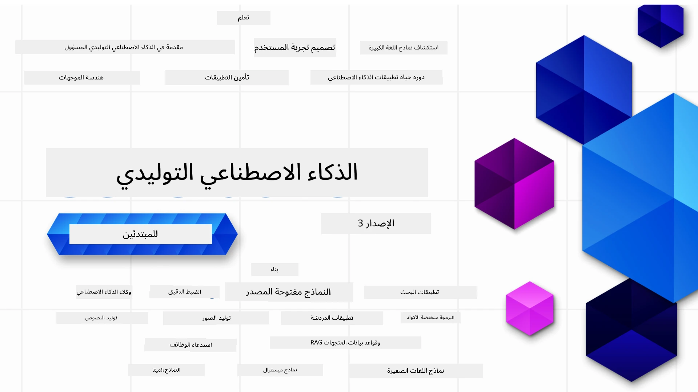

### 21 درسًا تعلمك كل ما تحتاج معرفته للبدء في بناء تطبيقات الذكاء الاصطناعي التوليدي

[](https://github.com/microsoft/Generative-AI-For-Beginners/blob/master/LICENSE?WT.mc_id=academic-105485-koreyst)
[](https://GitHub.com/microsoft/Generative-AI-For-Beginners/graphs/contributors/?WT.mc_id=academic-105485-koreyst)
[](https://GitHub.com/microsoft/Generative-AI-For-Beginners/issues/?WT.mc_id=academic-105485-koreyst)
[](https://GitHub.com/microsoft/Generative-AI-For-Beginners/pulls/?WT.mc_id=academic-105485-koreyst)
[](http://makeapullrequest.com?WT.mc_id=academic-105485-koreyst)

[](https://GitHub.com/microsoft/Generative-AI-For-Beginners/watchers/?WT.mc_id=academic-105485-koreyst)
[](https://GitHub.com/microsoft/Generative-AI-For-Beginners/network/?WT.mc_id=academic-105485-koreyst)
[](https://GitHub.com/microsoft/Generative-AI-For-Beginners/stargazers/?WT.mc_id=academic-105485-koreyst)

[](https://discord.gg/nTYy5BXMWG)

### 🌐 دعم متعدد اللغات

#### مدعوم عبر GitHub Action (مؤتمت ومُحدَّث دائمًا)

<!-- CO-OP TRANSLATOR LANGUAGES TABLE START -->
[العربية](./README.md) | [البنغالية](../bn/README.md) | [البلغارية](../bg/README.md) | [البورمية (ميانمار)](../my/README.md) | [الصينية (المبسطة)](../zh-CN/README.md) | [الصينية (التقليدية، هونغ كونغ)](../zh-HK/README.md) | [الصينية (التقليدية، ماكاو)](../zh-MO/README.md) | [الصينية (التقليدية، تايوان)](../zh-TW/README.md) | [الكرواتية](../hr/README.md) | [التشيكية](../cs/README.md) | [الدانماركية](../da/README.md) | [الهولندية](../nl/README.md) | [الإستونية](../et/README.md) | [الفنلندية](../fi/README.md) | [الفرنسية](../fr/README.md) | [الألمانية](../de/README.md) | [اليونانية](../el/README.md) | [العبرية](../he/README.md) | [الهندية](../hi/README.md) | [الهنغارية](../hu/README.md) | [الإندونيسية](../id/README.md) | [الإيطالية](../it/README.md) | [اليابانية](../ja/README.md) | [الكنادية](../kn/README.md) | [الخميرية](../km/README.md) | [الكورية](../ko/README.md) | [الليتوانية](../lt/README.md) | [الماليزية](../ms/README.md) | [المالايالامية](../ml/README.md) | [الماراثية](../mr/README.md) | [النپالية](../ne/README.md) | [النيجيرية بيدجين](../pcm/README.md) | [النرويجية](../no/README.md) | [الفارسية (الفارسية)](../fa/README.md) | [البولندية](../pl/README.md) | [البرتغالية (البرازيل)](../pt-BR/README.md) | [البرتغالية (البرتغال)](../pt-PT/README.md) | [البنجابية (جورموخي)](../pa/README.md) | [الرومانية](../ro/README.md) | [الروسية](../ru/README.md) | [الصربية (السيريلية)](../sr/README.md) | [السلوفاكية](../sk/README.md) | [السلوفينية](../sl/README.md) | [الإسبانية](../es/README.md) | [السواحيلية](../sw/README.md) | [السويدية](../sv/README.md) | [التاغالوغ (الفلبينية)](../tl/README.md) | [التاميل](../ta/README.md) | [التيلجو](../te/README.md) | [التايلاندية](../th/README.md) | [التركية](../tr/README.md) | [الأوكرانية](../uk/README.md) | [الأردية](../ur/README.md) | [الفيتنامية](../vi/README.md)

> **تفضل النسخ محليًا؟**
>
> يحتوي هذا المستودع على ترجمات لأكثر من 50 لغة مما يزيد بشكل كبير من حجم التنزيل. للنسخ بدون الترجمات، استخدم الخروج الانتقائي:
>
> **Bash / macOS / Linux:**
> ```bash
> git clone --filter=blob:none --sparse https://github.com/microsoft/generative-ai-for-beginners.git
> cd generative-ai-for-beginners
> git sparse-checkout set --no-cone '/*' '!translations' '!translated_images'
> ```
>
> **CMD (ويندوز):**
> ```cmd
> git clone --filter=blob:none --sparse https://github.com/microsoft/generative-ai-for-beginners.git
> cd generative-ai-for-beginners
> git sparse-checkout set --no-cone "/*" "!translations" "!translated_images"
> ```
>
> هذا يمنحك كل ما تحتاجه لإكمال الدورة بسرعة تنزيل أعلى.
<!-- CO-OP TRANSLATOR LANGUAGES TABLE END -->

# الذكاء الاصطناعي التوليدي للمبتدئين (الإصدار 3) - دورة تدريبية

تعلّم أساسيات بناء تطبيقات الذكاء الاصطناعي التوليدي مع دورتنا الشاملة المكونة من 21 درسًا من Microsoft Cloud Advocates.

## 🌱 البدء

تحتوي هذه الدورة على 21 درسًا. كل درس يغطي موضوعه الخاص لذا ابدأ من حيث تريد!

يتم تصنيف الدروس إما كدروس "تعلم" تشرح مفهوم الذكاء الاصطناعي التوليدي أو دروس "بناء" تشرح مفهومًا مع أمثلة برمجية بلغة **Python** و **TypeScript** عندما يكون ذلك ممكنًا.

لمطوري .NET، اطلع على [الذكاء الاصطناعي التوليدي للمبتدئين (إصدار .NET)](https://github.com/microsoft/Generative-AI-for-beginners-dotnet?WT.mc_id=academic-105485-koreyst)!

يشمل كل درس أيضًا قسم "استمر في التعلم" مع أدوات تعلم إضافية.

## ما تحتاجه
### لتشغيل تعليمات هذه الدورة، يمكنك استخدام أي مما يلي: 
 - [خدمة Azure OpenAI](https://aka.ms/genai-beginners/azure-open-ai?WT.mc_id=academic-105485-koreyst) - **الدروس:** "aoai-assignment"
 - [نماذج Microsoft Foundry](https://ai.azure.com/catalog/models?WT.mc_id=academic-105485-koreyst) - **الدروس:** "githubmodels" (نماذج GitHub سيتوقف دعمها في نهاية يوليو 2026 - استخدم نماذج Microsoft Foundry بدلاً من ذلك)
 - [واجهة برمجة تطبيقات OpenAI](https://aka.ms/genai-beginners/open-ai?WT.mc_id=academic-105485-koreyst) - **الدروس:** "oai-assignment" 
 - [Foundry Local](https://foundrylocal.ai?WT.mc_id=academic-105485-koreyst) - تشغيل النماذج بالكامل دون الاتصال بالإنترنت على جهازك الشخصي، لا حاجة لاشتراك سحابي
   
- معرفة أساسية بـ Python أو TypeScript مفيدة - *للمبتدئين تمامًا، اطلع على دورات [Python](https://aka.ms/genai-beginners/python?WT.mc_id=academic-105485-koreyst) و [TypeScript](https://aka.ms/genai-beginners/typescript?WT.mc_id=academic-105485-koreyst)
- حساب GitHub لعمل [نسخة مشتقة من هذا المستودع بالكامل](https://aka.ms/genai-beginners/github?WT.mc_id=academic-105485-koreyst) لحسابك على GitHub

أنشأنا درس **[إعداد الدورة](./00-course-setup/README.md?WT.mc_id=academic-105485-koreyst)** لمساعدتك في إعداد بيئة التطوير الخاصة بك.

لا تنس أن [تضع نجمة (🌟) على هذا المستودع](https://docs.github.com/en/get-started/exploring-projects-on-github/saving-repositories-with-stars?WT.mc_id=academic-105485-koreyst) لتجده بسهولة لاحقًا.

## 🧠 جاهز للنشر؟

إذا كنت تبحث عن أمثلة تعليمية متقدمة أكثر، اطلع على [مجموعتنا من عينات كود الذكاء الاصطناعي التوليدي](https://aka.ms/genai-beg-code?WT.mc_id=academic-105485-koreyst) بلغة **Python** و **TypeScript**.

## 🗣️ قابل متعلمين آخرين، واحصل على الدعم

انضم إلى [سيرفر Discord الرسمي لـ Microsoft Foundry](https://aka.ms/genai-discord?WT.mc_id=academic-105485-koreyst) للقاء والتواصل مع متعلمين آخرين يأخذون هذه الدورة واحصل على الدعم.

اطرح أسئلة أو شارك ملاحظات المنتج في [منتدى مطوري Microsoft Foundry](https://aka.ms/azureaifoundry/forum) على GitHub.

## 🚀 تبني شركة ناشئة؟

زر [Microsoft للمشاريع الناشئة](https://www.microsoft.com/startups?WT.mc_id=academic-105485-koreyst) لتعرف كيف تبدأ البناء باستخدام أرصدة Azure اليوم.

## 🙏 هل تريد المساعدة؟

هل لديك اقتراحات أو وجدت أخطاء إملائية أو برمجية؟ [ارفع مشكلة](https://github.com/microsoft/generative-ai-for-beginners/issues?WT.mc_id=academic-105485-koreyst) أو [أنشئ طلب سحب](https://github.com/microsoft/generative-ai-for-beginners/pulls?WT.mc_id=academic-105485-koreyst)

## 📂 يحتوي كل درس على:

- مقدمة فيديو قصيرة عن الموضوع
- درس مكتوب موجود في ملف README
- عينات كود بلغة Python و TypeScript تدعم Azure OpenAI و OpenAI API
- روابط لمصادر إضافية لمواصلة التعلم

## 🗃️ الدروس

| #   | **رابط الدرس**                                                                                                                              | **الوصف**                                                                                 | **الفيديو**                                                                   | **تعلم إضافي**                                                             |
| --- | -------------------------------------------------------------------------------------------------------------------------------------------- | ----------------------------------------------------------------------------------------------- | --------------------------------------------------------------------------- | ------------------------------------------------------------------------------ |
| 00  | [إعداد الدورة](./00-course-setup/README.md?WT.mc_id=academic-105485-koreyst)                                                                 | **تعلم:** كيفية إعداد بيئة التطوير الخاصة بك                                            | الفيديو قريبًا                                                                 | [تعرف أكثر](https://aka.ms/genai-collection?WT.mc_id=academic-105485-koreyst) |
| 01  | [مقدمة في الذكاء الاصطناعي التوليدي والنماذج اللغوية الكبيرة](./01-introduction-to-genai/README.md?WT.mc_id=academic-105485-koreyst)                              | **تعلم:** فهم ماهية الذكاء الاصطناعي التوليدي وكيفية عمل النماذج اللغوية الكبيرة (LLMs).       | [فيديو](https://aka.ms/gen-ai-lesson-1-gh?WT.mc_id=academic-105485-koreyst) | [تعرف أكثر](https://aka.ms/genai-collection?WT.mc_id=academic-105485-koreyst) |
| 02  | [استكشاف ومقارنة نماذج LLM المختلفة](./02-exploring-and-comparing-different-llms/README.md?WT.mc_id=academic-105485-koreyst)             | **تعلم:** كيفية اختيار النموذج المناسب لحالتك الاستخدامية                                      | [فيديو](https://aka.ms/gen-ai-lesson2-gh?WT.mc_id=academic-105485-koreyst)  | [تعرف أكثر](https://aka.ms/genai-collection?WT.mc_id=academic-105485-koreyst) |

| 03  | [استخدام الذكاء التوليدي بمسؤولية](./03-using-generative-ai-responsibly/README.md?WT.mc_id=academic-105485-koreyst)                           | **تعلّم:** كيفية بناء تطبيقات الذكاء التوليدي بمسؤولية                                  | [فيديو](https://aka.ms/gen-ai-lesson3-gh?WT.mc_id=academic-105485-koreyst)  | [اعرف المزيد](https://aka.ms/genai-collection?WT.mc_id=academic-105485-koreyst) |
| 04  | [فهم أساسيات هندسة الإرشادات](./04-prompt-engineering-fundamentals/README.md?WT.mc_id=academic-105485-koreyst)             | **تعلّم:** أفضل الممارسات العملية لهندسة الإرشادات                                           | [فيديو](https://aka.ms/gen-ai-lesson4-gh?WT.mc_id=academic-105485-koreyst)  | [اعرف المزيد](https://aka.ms/genai-collection?WT.mc_id=academic-105485-koreyst) |
| 05  | [إنشاء إرشادات متقدمة](./05-advanced-prompts/README.md?WT.mc_id=academic-105485-koreyst)                                                | **تعلّم:** كيفية تطبيق تقنيات هندسة الإرشادات التي تحسّن نتائج إرشاداتك. | [فيديو](https://aka.ms/gen-ai-lesson5-gh?WT.mc_id=academic-105485-koreyst)  | [اعرف المزيد](https://aka.ms/genai-collection?WT.mc_id=academic-105485-koreyst) |
| 06  | [بناء تطبيقات توليد النصوص](./06-text-generation-apps/README.md?WT.mc_id=academic-105485-koreyst)                                | **بناء:** تطبيق توليد نص باستخدام Azure OpenAI / OpenAI API                                | [فيديو](https://aka.ms/gen-ai-lesson6-gh?WT.mc_id=academic-105485-koreyst)  | [اعرف المزيد](https://aka.ms/genai-collection?WT.mc_id=academic-105485-koreyst) |
| 07  | [بناء تطبيقات الدردشة](./07-building-chat-applications/README.md?WT.mc_id=academic-105485-koreyst)                                     | **بناء:** تقنيات لبناء وتكامل تطبيقات الدردشة بكفاءة.               | [فيديو](https://aka.ms/gen-ai-lessons7-gh?WT.mc_id=academic-105485-koreyst) | [اعرف المزيد](https://aka.ms/genai-collection?WT.mc_id=academic-105485-koreyst) |
| 08  | [بناء تطبيقات البحث باستخدام قواعد بيانات المتجهات](./08-building-search-applications/README.md?WT.mc_id=academic-105485-koreyst)                        | **بناء:** تطبيق بحث يستخدم التضمينات للبحث عن البيانات.                        | [فيديو](https://aka.ms/gen-ai-lesson8-gh?WT.mc_id=academic-105485-koreyst)  | [اعرف المزيد](https://aka.ms/genai-collection?WT.mc_id=academic-105485-koreyst) |
| 09  | [بناء تطبيقات توليد الصور](./09-building-image-applications/README.md?WT.mc_id=academic-105485-koreyst)                        | **بناء:** تطبيق توليد الصور                                                       | [فيديو](https://aka.ms/gen-ai-lesson9-gh?WT.mc_id=academic-105485-koreyst)  | [اعرف المزيد](https://aka.ms/genai-collection?WT.mc_id=academic-105485-koreyst) |
| 10  | [بناء تطبيقات الذكاء الاصطناعي منخفضة الأكواد](./10-building-low-code-ai-applications/README.md?WT.mc_id=academic-105485-koreyst)                       | **بناء:** تطبيق ذكاء توليدي باستخدام أدوات منخفضة الأكواد                                     | [فيديو](https://aka.ms/gen-ai-lesson10-gh?WT.mc_id=academic-105485-koreyst) | [اعرف المزيد](https://aka.ms/genai-collection?WT.mc_id=academic-105485-koreyst) |
| 11  | [تكامل التطبيقات الخارجية مع استدعاء الدالة](./11-integrating-with-function-calling/README.md?WT.mc_id=academic-105485-koreyst) | **بناء:** ما هو استدعاء الدالة وحالات استخدامه في التطبيقات                          | [فيديو](https://aka.ms/gen-ai-lesson11-gh?WT.mc_id=academic-105485-koreyst) | [اعرف المزيد](https://aka.ms/genai-collection?WT.mc_id=academic-105485-koreyst) |
| 12  | [تصميم تجربة المستخدم لتطبيقات الذكاء الاصطناعي](./12-designing-ux-for-ai-applications/README.md?WT.mc_id=academic-105485-koreyst)                         | **تعلّم:** كيفية تطبيق مبادئ تصميم تجربة المستخدم عند تطوير تطبيقات الذكاء التوليدي         | [فيديو](https://aka.ms/gen-ai-lesson12-gh?WT.mc_id=academic-105485-koreyst) | [اعرف المزيد](https://aka.ms/genai-collection?WT.mc_id=academic-105485-koreyst) |
| 13  | [تأمين تطبيقات الذكاء التوليدي الخاصة بك](./13-securing-ai-applications/README.md?WT.mc_id=academic-105485-koreyst)                         | **تعلّم:** التهديدات والمخاطر على أنظمة الذكاء الاصطناعي وطرق تأمينها.             | [فيديو](https://aka.ms/gen-ai-lesson13-gh?WT.mc_id=academic-105485-koreyst) | [اعرف المزيد](https://aka.ms/genai-collection?WT.mc_id=academic-105485-koreyst) |
| 14  | [دورة حياة تطبيقات الذكاء التوليدي](./14-the-generative-ai-application-lifecycle/README.md?WT.mc_id=academic-105485-koreyst)           | **تعلّم:** الأدوات والقياسات لإدارة دورة حياة LLM وLLMOps                         | [فيديو](https://aka.ms/gen-ai-lesson14-gh?WT.mc_id=academic-105485-koreyst) | [اعرف المزيد](https://aka.ms/genai-collection?WT.mc_id=academic-105485-koreyst) |
| 15  | [التوليد المعزز بالاستخراج (RAG) وقواعد بيانات المتجهات](./15-rag-and-vector-databases/README.md?WT.mc_id=academic-105485-koreyst)        | **بناء:** تطبيق يستخدم إطار عمل RAG لاستخراج التضمينات من قواعد بيانات المتجهات  | [فيديو](https://aka.ms/gen-ai-lesson15-gh?WT.mc_id=academic-105485-koreyst) | [اعرف المزيد](https://aka.ms/genai-collection?WT.mc_id=academic-105485-koreyst) |
| 16  | [النماذج مفتوحة المصدر وHugging Face](./16-open-source-models/README.md?WT.mc_id=academic-105485-koreyst)                                    | **بناء:** تطبيق يستخدم نماذج مفتوحة المصدر المتاحة على Hugging Face                    | [فيديو](https://aka.ms/gen-ai-lesson16-gh?WT.mc_id=academic-105485-koreyst) | [اعرف المزيد](https://aka.ms/genai-collection?WT.mc_id=academic-105485-koreyst) |
| 17  | [وكلاء الذكاء الاصطناعي](./17-ai-agents/README.md?WT.mc_id=academic-105485-koreyst)                                                                       | **بناء:** تطبيق يستخدم إطار عمل وكلاء الذكاء الاصطناعي                                           | [فيديو](https://aka.ms/gen-ai-lesson17-gh?WT.mc_id=academic-105485-koreyst) | [اعرف المزيد](https://aka.ms/genai-collection?WT.mc_id=academic-105485-koreyst) |
| 18  | [تخصيص وضبط نماذج اللغة الكبيرة (LLMs)](./18-fine-tuning/README.md?WT.mc_id=academic-105485-koreyst)                                                              | **تعلّم:** ما هو، ولماذا وكيفية تخصيص وضبط نماذج اللغة الكبيرة                                            | [فيديو](https://aka.ms/gen-ai-lesson18-gh?WT.mc_id=academic-105485-koreyst) | [اعرف المزيد](https://aka.ms/genai-collection?WT.mc_id=academic-105485-koreyst) |
| 19  | [البناء باستخدام نماذج اللغة الصغيرة (SLMs)](./19-slm/README.md?WT.mc_id=academic-105485-koreyst)                                                              | **تعلّم:** فوائد البناء باستخدام نماذج اللغة الصغيرة                                            | الفيديو قريبًا | [اعرف المزيد](https://aka.ms/genai-collection?WT.mc_id=academic-105485-koreyst) |
| 20  | [البناء باستخدام نماذج Mistral](./20-mistral/README.md?WT.mc_id=academic-105485-koreyst)                                                              | **تعلّم:** ميزات وفروقات نماذج عائلة Mistral                                            | الفيديو قريبًا | [اعرف المزيد](https://aka.ms/genai-collection?WT.mc_id=academic-105485-koreyst) |
| 21  | [البناء باستخدام نماذج Meta](./21-meta/README.md?WT.mc_id=academic-105485-koreyst)                                                              | **تعلّم:** ميزات وفروقات نماذج عائلة Meta                                            | الفيديو قريبًا | [اعرف المزيد](https://aka.ms/genai-collection?WT.mc_id=academic-105485-koreyst) |

### 🌟 شكر خاص

شكر خاص لـ [**جون عزيز**](https://www.linkedin.com/in/john0isaac/) على إنشاء جميع إجراءات وقواعد عمل GitHub

[**بيرنهارد ميركل**](https://www.linkedin.com/in/bernhard-merkle-738b73/) على مساهماته الرئيسية في كل درس لتحسين تجربة المتعلم وتجربة الكود.

## 🎒 دورات أخرى

فريقنا ينتج دورات أخرى! تفقد:

<!-- CO-OP TRANSLATOR OTHER COURSES START -->
### LangChain
[](https://aka.ms/langchain4j-for-beginners)
[](https://aka.ms/langchainjs-for-beginners?WT.mc_id=m365-94501-dwahlin)
[](https://github.com/microsoft/langchain-for-beginners?WT.mc_id=m365-94501-dwahlin)
---

### Azure / Edge / MCP / وكلاء
[](https://github.com/microsoft/AZD-for-beginners?WT.mc_id=academic-105485-koreyst)
[](https://github.com/microsoft/edgeai-for-beginners?WT.mc_id=academic-105485-koreyst)
[](https://github.com/microsoft/mcp-for-beginners?WT.mc_id=academic-105485-koreyst)
[](https://github.com/microsoft/ai-agents-for-beginners?WT.mc_id=academic-105485-koreyst)

---
 
### سلسلة الذكاء التوليدي
[](https://github.com/microsoft/generative-ai-for-beginners?WT.mc_id=academic-105485-koreyst)
[-9333EA?style=for-the-badge&labelColor=E5E7EB&color=9333EA)](https://github.com/microsoft/Generative-AI-for-beginners-dotnet?WT.mc_id=academic-105485-koreyst)

[-C084FC?style=for-the-badge&labelColor=E5E7EB&color=C084FC)](https://github.com/microsoft/generative-ai-for-beginners-java?WT.mc_id=academic-105485-koreyst)
[-E879F9?style=for-the-badge&labelColor=E5E7EB&color=E879F9)](https://github.com/microsoft/generative-ai-with-javascript?WT.mc_id=academic-105485-koreyst)

---
 
### التعلم الأساسي
[](https://aka.ms/ml-beginners?WT.mc_id=academic-105485-koreyst)
[](https://aka.ms/datascience-beginners?WT.mc_id=academic-105485-koreyst)
[](https://aka.ms/ai-beginners?WT.mc_id=academic-105485-koreyst)
[](https://github.com/microsoft/Security-101?WT.mc_id=academic-96948-sayoung)
[](https://aka.ms/webdev-beginners?WT.mc_id=academic-105485-koreyst)
[](https://aka.ms/iot-beginners?WT.mc_id=academic-105485-koreyst)
[](https://github.com/microsoft/xr-development-for-beginners?WT.mc_id=academic-105485-koreyst)

---
 
### سلسلة كوبيلوت
[](https://aka.ms/GitHubCopilotAI?WT.mc_id=academic-105485-koreyst)
[](https://github.com/microsoft/mastering-github-copilot-for-dotnet-csharp-developers?WT.mc_id=academic-105485-koreyst)
[](https://github.com/microsoft/CopilotAdventures?WT.mc_id=academic-105485-koreyst)
<!-- CO-OP TRANSLATOR OTHER COURSES END -->

## الحصول على المساعدة

إذا واجهت صعوبة أو كان لديك أسئلة حول بناء تطبيقات الذكاء الاصطناعي. انضم إلى المتعلمين الآخرين والمطورين ذوي الخبرة في مناقشات MCP. إنه مجتمع داعم حيث تُرحب الأسئلة ويتم مشاركة المعرفة بحرية.

[](https://discord.gg/nTYy5BXMWG)

إذا كان لديك ملاحظات على المنتج أو أخطاء أثناء البناء قم بزيارتنا:

[](https://aka.ms/foundry/forum)

---

<!-- CO-OP TRANSLATOR DISCLAIMER START -->
**تنويه**:
تمت ترجمة هذا المستند باستخدام خدمة الترجمة بالذكاء الاصطناعي [Co-op Translator](https://github.com/Azure/co-op-translator). بينما نسعى للدقة، يرجى العلم أن الترجمات الآلية قد تحتوي على أخطاء أو عدم دقة. يجب اعتبار المستند الأصلي بلغته الأصلية المصدر الرسمي والمعتمد. للمعلومات الهامة، يُنصح بالاستعانة بترجمة بشرية محترفة. نحن غير مسؤولين عن أي سوء فهم أو تفسير ناتج عن استخدام هذه الترجمة.
<!-- CO-OP TRANSLATOR DISCLAIMER END -->