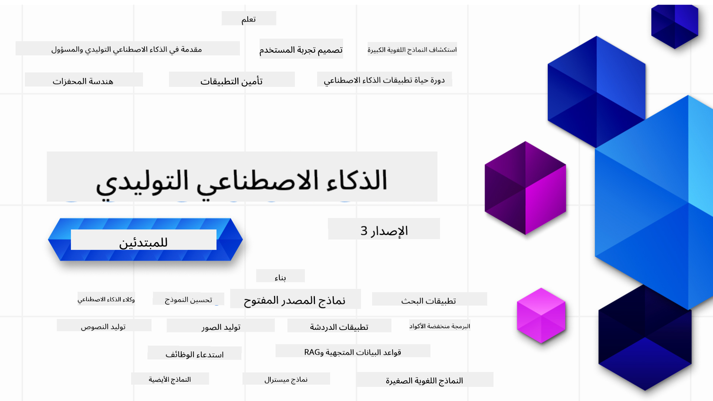

<!--
CO_OP_TRANSLATOR_METADATA:
{
  "original_hash": "6e3f4c8a4f323b8eab1cf11ded304b0f",
  "translation_date": "2025-06-25T07:30:59+00:00",
  "source_file": "README.md",
  "language_code": "ar"
}
-->

### 21 درسًا تعلمك كل ما تحتاج معرفته لبدء بناء تطبيقات الذكاء الاصطناعي التوليدي

### 🌐 دعم متعدد اللغات

#### مدعوم عبر GitHub Action (آلي ودائمًا محدث)
[الفرنسية](../fr/README.md) | [الإسبانية](../es/README.md) | [الألمانية](../de/README.md) | [الروسية](../ru/README.md) | [العربية](./README.md) | [الفارسية](../fa/README.md) | [الأردية](../ur/README.md) | [الصينية (المبسطة)](../zh/README.md) | [الصينية (التقليدية، ماكاو)](../mo/README.md) | [الصينية (التقليدية، هونغ كونغ)](../hk/README.md) | [الصينية (التقليدية، تايوان)](../tw/README.md) | [اليابانية](../ja/README.md) | [الكورية](../ko/README.md) | [الهندية](../hi/README.md) | [البنغالية](../bn/README.md) | [الماراثية](../mr/README.md) | [النيبالية](../ne/README.md) | [البنجابية (الغورمكية)](../pa/README.md) | [البرتغالية (البرتغال)](../pt/README.md) | [البرتغالية (البرازيل)](../br/README.md) | [الإيطالية](../it/README.md) | [البولندية](../pl/README.md) | [التركية](../tr/README.md) | [اليونانية](../el/README.md) | [التايلاندية](../th/README.md) | [السويدية](../sv/README.md) | [الدانماركية](../da/README.md) | [النرويجية](../no/README.md) | [الفنلندية](../fi/README.md) | [الهولندية](../nl/README.md) | [العبرية](../he/README.md) | [الفيتنامية](../vi/README.md) | [الإندونيسية](../id/README.md) | [الملايوية](../ms/README.md) | [التاغالوغية (الفلبينية)](../tl/README.md) | [السواحيلية](../sw/README.md) | [الهنغارية](../hu/README.md) | [التشيكية](../cs/README.md) | [السلوفاكية](../sk/README.md) | [الرومانية](../ro/README.md) | [البلغارية](../bg/README.md) | [الصربية (السيريلية)](../sr/README.md) | [الكرواتية](../hr/README.md) | [السلوفينية](../sl/README.md)
# الذكاء الاصطناعي التوليدي للمبتدئين (الإصدار 3) - دورة تدريبية

تعلم أساسيات بناء تطبيقات الذكاء الاصطناعي التوليدي مع دورتنا الشاملة المكونة من 21 درسًا بواسطة مناصري السحابة من مايكروسوفت.

## 🌱 البداية

تحتوي هذه الدورة على 21 درسًا. كل درس يغطي موضوعه الخاص، لذا ابدأ من حيث ترغب!

يتم تصنيف الدروس إما كدروس "تعلم" تشرح مفهوم الذكاء الاصطناعي التوليدي أو كدروس "بناء" تشرح المفهوم مع أمثلة برمجية في كل من **Python** و**TypeScript** عندما يكون ذلك ممكنًا.

لمطوري .NET، تحقق من [الذكاء الاصطناعي التوليدي للمبتدئين (إصدار .NET)](https://github.com/microsoft/Generative-AI-for-beginners-dotnet?WT.mc_id=academic-105485-koreyst)!

يحتوي كل درس أيضًا على قسم "استمر في التعلم" مع أدوات تعلم إضافية.

## ما تحتاجه
### لتشغيل الكود الخاص بهذه الدورة، يمكنك استخدام إما:
- [خدمة Azure OpenAI](https://aka.ms/genai-beginners/azure-open-ai?WT.mc_id=academic-105485-koreyst) - **الدروس:** "aoai-assignment"
- [كتالوج نماذج GitHub Marketplace](https://aka.ms/genai-beginners/gh-models?WT.mc_id=academic-105485-koreyst) - **الدروس:** "githubmodels"
- [واجهة برمجة تطبيقات OpenAI](https://aka.ms/genai-beginners/open-ai?WT.mc_id=academic-105485-koreyst) - **الدروس:** "oai-assignment"

- المعرفة الأساسية بـ Python أو TypeScript مفيدة - \*للمبتدئين المطلقين، تحقق من هذه الدورات [Python](https://aka.ms/genai-beginners/python?WT.mc_id=academic-105485-koreyst) و[TypeScript](https://aka.ms/genai-beginners/typescript?WT.mc_id=academic-105485-koreyst)
- حساب GitHub لـ [تفرع هذا المستودع بالكامل](https://aka.ms/genai-beginners/github?WT.mc_id=academic-105485-koreyst) إلى حساب GitHub الخاص بك

لقد أنشأنا درس **[إعداد الدورة](./00-course-setup/README.md?WT.mc_id=academic-105485-koreyst)** لمساعدتك في إعداد بيئة التطوير الخاصة بك.

لا تنس [إضافة نجمة (🌟) لهذا المستودع](https://docs.github.com/en/get-started/exploring-projects-on-github/saving-repositories-with-stars?WT.mc_id=academic-105485-koreyst) لتجده بسهولة لاحقًا.

## 🧠 جاهز للنشر؟

إذا كنت تبحث عن أمثلة برمجية أكثر تقدمًا، تحقق من [مجموعة أمثلة الكود للذكاء الاصطناعي التوليدي](https://aka.ms/genai-beg-code?WT.mc_id=academic-105485-koreyst) في كل من **Python** و**TypeScript**.

## 🗣️ تعرف على متعلمين آخرين، واحصل على الدعم

انضم إلى [خادم Discord الرسمي لـ Azure AI Foundry](https://aka.ms/genai-discord?WT.mc_id=academic-105485-koreyst) لتتعرف وتكوّن شبكة مع متعلمين آخرين يأخذون هذه الدورة واحصل على الدعم.

اطرح الأسئلة أو شارك ملاحظات المنتج في [منتدى مطوري Azure AI Foundry](https://aka.ms/azureaifoundry/forum) على GitHub.

## 🚀 بناء شركة ناشئة؟

اشترك في [Microsoft for Startups Founders Hub](https://aka.ms/genai-foundershub?WT.mc_id=academic-105485-koreyst) لتلقي **اعتمادات OpenAI مجانية** وحتى **150,000 دولار نحو اعتمادات Azure للوصول إلى نماذج OpenAI عبر خدمات Azure OpenAI**.

## 🙏 هل ترغب في المساعدة؟

هل لديك اقتراحات أو وجدت أخطاء إملائية أو في الكود؟ [قدم مشكلة](https://github.com/microsoft/generative-ai-for-beginners/issues?WT.mc_id=academic-105485-koreyst) أو [أنشئ طلب سحب](https://github.com/microsoft/generative-ai-for-beginners/pulls?WT.mc_id=academic-105485-koreyst)

## 📂 يحتوي كل درس على:

- مقدمة فيديو قصيرة للموضوع
- درس مكتوب موجود في README
- أمثلة برمجية في Python وTypeScript تدعم Azure OpenAI وواجهة برمجة تطبيقات OpenAI
- روابط لموارد إضافية لمواصلة التعلم

## 🗃️ الدروس

| #   | **رابط الدرس**                                                                                                                              | **الوصف**                                                                                       | **الفيديو**                                                                   | **تعلم إضافي**                                                             |
| --- | -------------------------------------------------------------------------------------------------------------------------------------------- | ------------------------------------------------------------------------------------------------ | --------------------------------------------------------------------------- | ------------------------------------------------------------------------------ |
| 00  | [إعداد الدورة](./00-course-setup/README.md?WT.mc_id=academic-105485-koreyst)                                                                 | **تعلم:** كيفية إعداد بيئة التطوير الخاصة بك                                                    | فيديو قادم قريبًا                                                                 | [تعلم المزيد](https://aka.ms/genai-collection?WT.mc_id=academic-105485-koreyst) |
| 01  | [مقدمة في الذكاء الاصطناعي التوليدي وLLMs](./01-introduction-to-genai/README.md?WT.mc_id=academic-105485-koreyst)                              | **تعلم:** فهم ما هو الذكاء الاصطناعي التوليدي وكيف تعمل النماذج اللغوية الكبيرة (LLMs).           | [فيديو](https://aka.ms/gen-ai-lesson-1-gh?WT.mc_id=academic-105485-koreyst) | [تعلم المزيد](https://aka.ms/genai-collection?WT.mc_id=academic-105485-koreyst) |
| 02  | [استكشاف ومقارنة النماذج اللغوية الكبيرة المختلفة](./02-exploring-and-comparing-different-llms/README.md?WT.mc_id=academic-105485-koreyst)             | **تعلم:** كيفية اختيار النموذج المناسب لحالة الاستخدام الخاصة بك                                | [فيديو](https://aka.ms/gen-ai-lesson2-gh?WT.mc_id=academic-105485-koreyst)  | [تعلم المزيد](https://aka.ms/genai-collection?WT.mc_id=academic-105485-koreyst) |
| 03  | [استخدام الذكاء الاصطناعي التوليدي بمسؤولية](./03-using-generative-ai-responsibly/README.md?WT.mc_id=academic-105485-koreyst)                           | **تعلم:** كيفية بناء تطبيقات الذكاء الاصطناعي التوليدي بمسؤولية                                   | [فيديو](https://aka.ms/gen-ai-lesson3-gh?WT.mc_id=academic-105485-koreyst)  | [تعلم المزيد](https://aka.ms/genai-collection?WT.mc_id=academic-105485-koreyst) |
| 04  | [فهم أساسيات هندسة الأوامر](./04-prompt-engineering-fundamentals/README.md?WT.mc_id=academic-105485-koreyst)             | **تعلم:** أفضل الممارسات العملية لهندسة الأوامر                                                 | [فيديو](https://aka.ms/gen-ai-lesson4-gh?WT.mc_id=academic-105485-koreyst)  | [تعلم المزيد](https://aka.ms/genai-collection?WT.mc_id=academic-105485-koreyst) |
| 05  | [إنشاء مطالبات متقدمة](./05-advanced-prompts/README.md?WT.mc_id=academic-105485-koreyst)                                                | **تعلم:** كيفية تطبيق تقنيات هندسة المطالبات التي تحسن نتائج مطالباتك. | [فيديو](https://aka.ms/gen-ai-lesson5-gh?WT.mc_id=academic-105485-koreyst)  | [تعرف على المزيد](https://aka.ms/genai-collection?WT.mc_id=academic-105485-koreyst) |
| 06  | [بناء تطبيقات توليد النصوص](./06-text-generation-apps/README.md?WT.mc_id=academic-105485-koreyst)                                | **بناء:** تطبيق لتوليد النصوص باستخدام Azure OpenAI / OpenAI API                                | [فيديو](https://aka.ms/gen-ai-lesson6-gh?WT.mc_id=academic-105485-koreyst)  | [تعرف على المزيد](https://aka.ms/genai-collection?WT.mc_id=academic-105485-koreyst) |
| 07  | [بناء تطبيقات الدردشة](./07-building-chat-applications/README.md?WT.mc_id=academic-105485-koreyst)                                     | **بناء:** تقنيات لبناء ودمج تطبيقات الدردشة بكفاءة.               | [فيديو](https://aka.ms/gen-ai-lessons7-gh?WT.mc_id=academic-105485-koreyst) | [تعرف على المزيد](https://aka.ms/genai-collection?WT.mc_id=academic-105485-koreyst) |
| 08  | [بناء تطبيقات البحث وقواعد البيانات المتجهة](./08-building-search-applications/README.md?WT.mc_id=academic-105485-koreyst)                        | **بناء:** تطبيق بحث يستخدم التضمين للبحث عن البيانات.                        | [فيديو](https://aka.ms/gen-ai-lesson8-gh?WT.mc_id=academic-105485-koreyst)  | [تعرف على المزيد](https://aka.ms/genai-collection?WT.mc_id=academic-105485-koreyst) |
| 09  | [بناء تطبيقات توليد الصور](./09-building-image-applications/README.md?WT.mc_id=academic-105485-koreyst)                        | **بناء:** تطبيق لتوليد الصور                                                       | [فيديو](https://aka.ms/gen-ai-lesson9-gh?WT.mc_id=academic-105485-koreyst)  | [تعرف على المزيد](https://aka.ms/genai-collection?WT.mc_id=academic-105485-koreyst) |
| 10  | [بناء تطبيقات الذكاء الاصطناعي منخفضة الكود](./10-building-low-code-ai-applications/README.md?WT.mc_id=academic-105485-koreyst)                       | **بناء:** تطبيق ذكاء اصطناعي توليدي باستخدام أدوات منخفضة الكود                                     | [فيديو](https://aka.ms/gen-ai-lesson10-gh?WT.mc_id=academic-105485-koreyst) | [تعرف على المزيد](https://aka.ms/genai-collection?WT.mc_id=academic-105485-koreyst) |
| 11  | [دمج التطبيقات الخارجية مع استدعاء الوظائف](./11-integrating-with-function-calling/README.md?WT.mc_id=academic-105485-koreyst) | **بناء:** ما هو استدعاء الوظائف وحالات استخدامه للتطبيقات                          | [فيديو](https://aka.ms/gen-ai-lesson11-gh?WT.mc_id=academic-105485-koreyst) | [تعرف على المزيد](https://aka.ms/genai-collection?WT.mc_id=academic-105485-koreyst) |
| 12  | [تصميم تجربة المستخدم لتطبيقات الذكاء الاصطناعي](./12-designing-ux-for-ai-applications/README.md?WT.mc_id=academic-105485-koreyst)                         | **تعلم:** كيفية تطبيق مبادئ تصميم تجربة المستخدم عند تطوير تطبيقات الذكاء الاصطناعي التوليدي         | [فيديو](https://aka.ms/gen-ai-lesson12-gh?WT.mc_id=academic-105485-koreyst) | [تعرف على المزيد](https://aka.ms/genai-collection?WT.mc_id=academic-105485-koreyst) |
| 13  | [تأمين تطبيقات الذكاء الاصطناعي التوليدية الخاصة بك](./13-securing-ai-applications/README.md?WT.mc_id=academic-105485-koreyst)                         | **تعلم:** التهديدات والمخاطر على أنظمة الذكاء الاصطناعي وطرق تأمين هذه الأنظمة.             | [فيديو](https://aka.ms/gen-ai-lesson13-gh?WT.mc_id=academic-105485-koreyst) | [تعرف على المزيد](https://aka.ms/genai-collection?WT.mc_id=academic-105485-koreyst) |
| 14  | [دورة حياة تطبيقات الذكاء الاصطناعي التوليدي](./14-the-generative-ai-application-lifecycle/README.md?WT.mc_id=academic-105485-koreyst)           | **تعلم:** الأدوات والمعايير لإدارة دورة حياة النماذج اللغوية الكبيرة وعمليات النماذج اللغوية الكبيرة                         | [فيديو](https://aka.ms/gen-ai-lesson14-gh?WT.mc_id=academic-105485-koreyst) | [تعرف على المزيد](https://aka.ms/genai-collection?WT.mc_id=academic-105485-koreyst) |
| 15  | [استرجاع الجيل المعزز (RAG) وقواعد البيانات المتجهة](./15-rag-and-vector-databases/README.md?WT.mc_id=academic-105485-koreyst)        | **بناء:** تطبيق باستخدام إطار عمل RAG لاسترجاع التضمينات من قواعد البيانات المتجهة  | [فيديو](https://aka.ms/gen-ai-lesson15-gh?WT.mc_id=academic-105485-koreyst) | [تعرف على المزيد](https://aka.ms/genai-collection?WT.mc_id=academic-105485-koreyst) |
| 16  | [النماذج مفتوحة المصدر وHugging Face](./16-open-source-models/README.md?WT.mc_id=academic-105485-koreyst)                                    | **بناء:** تطبيق باستخدام نماذج مفتوحة المصدر المتاحة على Hugging Face                    | [فيديو](https://aka.ms/gen-ai-lesson16-gh?WT.mc_id=academic-105485-koreyst) | [تعرف على المزيد](https://aka.ms/genai-collection?WT.mc_id=academic-105485-koreyst) |
| 17  | [وكلاء الذكاء الاصطناعي](./17-ai-agents/README.md?WT.mc_id=academic-105485-koreyst)                                                                       | **بناء:** تطبيق باستخدام إطار عمل وكيل الذكاء الاصطناعي                                           | [فيديو](https://aka.ms/gen-ai-lesson17-gh?WT.mc_id=academic-105485-koreyst) | [تعرف على المزيد](https://aka.ms/genai-collection?WT.mc_id=academic-105485-koreyst) |
| 18  | [تحسين الضبط للنماذج اللغوية الكبيرة](./18-fine-tuning/README.md?WT.mc_id=academic-105485-koreyst)                                                              | **تعلم:** ماذا ولماذا وكيفية تحسين الضبط للنماذج اللغوية الكبيرة                                            | [فيديو](https://aka.ms/gen-ai-lesson18-gh?WT.mc_id=academic-105485-koreyst) | [تعرف على المزيد](https://aka.ms/genai-collection?WT.mc_id=academic-105485-koreyst) |
| 19  | [البناء باستخدام النماذج اللغوية الصغيرة](./19-slm/README.md?WT.mc_id=academic-105485-koreyst)                                                              | **تعلم:** فوائد البناء باستخدام النماذج اللغوية الصغيرة                                            | الفيديو قادم قريبًا | [تعرف على المزيد](https://aka.ms/genai-collection?WT.mc_id=academic-105485-koreyst) |
| 20  | [البناء باستخدام نماذج ميسترال](./20-mistral/README.md?WT.mc_id=academic-105485-koreyst)                                                              | **تعلم:** ميزات واختلافات نماذج عائلة ميسترال                                           | الفيديو قادم قريبًا | [تعرف على المزيد](https://aka.ms/genai-collection?WT.mc_id=academic-105485-koreyst) |
| 21  | [البناء باستخدام نماذج ميتا](./21-meta/README.md?WT.mc_id=academic-105485-koreyst)                                                              | **تعلم:** ميزات واختلافات نماذج عائلة ميتا                                           | الفيديو قادم قريبًا | [تعرف على المزيد](https://aka.ms/genai-collection?WT.mc_id=academic-105485-koreyst) |

### 🌟 شكر خاص

شكر خاص لـ [**جون عزيز**](https://www.linkedin.com/in/john0isaac/) لإنشاء جميع إجراءات GitHub وعمليات العمل

[**بيرنهارد ميركل**](https://www.linkedin.com/in/bernhard-merkle-738b73/) لتقديم مساهمات رئيسية في كل درس لتحسين تجربة المتعلم والرمز.

## 🎒 دورات أخرى

فريقنا ينتج دورات أخرى! تحقق من:

- [**جديد** بروتوكول سياق النموذج للمبتدئين](https://github.com/microsoft/mcp-for-beginners?WT.mc_id=academic-105485-koreyst)
- [وكلاء الذكاء الاصطناعي للمبتدئين](https://github.com/microsoft/ai-agents-for-beginners?WT.mc_id=academic-105485-koreyst)
- [الذكاء الاصطناعي التوليدي للمبتدئين باستخدام .NET](https://github.com/microsoft/Generative-AI-for-beginners-dotnet?WT.mc_id=academic-105485-koreyst)
- [الذكاء الاصطناعي التوليدي للمبتدئين باستخدام JavaScript](https://aka.ms/genai-js-course?WT.mc_id=academic-105485-koreyst)
- [تعلم الآلة للمبتدئين](https://aka.ms/ml-beginners?WT.mc_id=academic-105485-koreyst)
- [علم البيانات للمبتدئين](https://aka.ms/datascience-beginners?WT.mc_id=academic-105485-koreyst)
- [الذكاء الاصطناعي للمبتدئين](https://aka.ms/ai-beginners?WT.mc_id=academic-105485-koreyst)
- [الأمن السيبراني للمبتدئين](https://github.com/microsoft/Security-101??WT.mc_id=academic-96948-sayoung)
- [تطوير الويب للمبتدئين](https://aka.ms/webdev-beginners?WT.mc_id=academic-105485-koreyst)
- [إنترنت الأشياء للمبتدئين](https://aka.ms/iot-beginners?WT.mc_id=academic-105485-koreyst)
- [تطوير الواقع المختلط للمبتدئين](https://github.com/microsoft/xr-development-for-beginners?WT.mc_id=academic-105485-koreyst)
- [إتقان GitHub Copilot للبرمجة المزدوجة بالذكاء الاصطناعي](https://aka.ms/GitHubCopilotAI?WT.mc_id=academic-105485-koreyst)
- [إتقان GitHub Copilot لمطوري C#/.NET](https://github.com/microsoft/mastering-github-copilot-for-dotnet-csharp-developers?WT.mc_id=academic-105485-koreyst)
- [اختر مغامرتك الخاصة مع Copilot](https://github.com/microsoft/CopilotAdventures?WT.mc_id=academic-105485-koreyst)

**إخلاء المسؤولية**:  
تمت ترجمة هذه الوثيقة باستخدام خدمة الترجمة الآلية [Co-op Translator](https://github.com/Azure/co-op-translator). بينما نسعى جاهدين لتحقيق الدقة، يرجى العلم بأن الترجمات الآلية قد تحتوي على أخطاء أو عدم دقة. يجب اعتبار الوثيقة الأصلية بلغتها الأصلية المصدر الموثوق. للمعلومات الهامة، يُوصى بالترجمة البشرية الاحترافية. نحن غير مسؤولين عن أي سوء فهم أو تفسيرات خاطئة تنشأ عن استخدام هذه الترجمة.