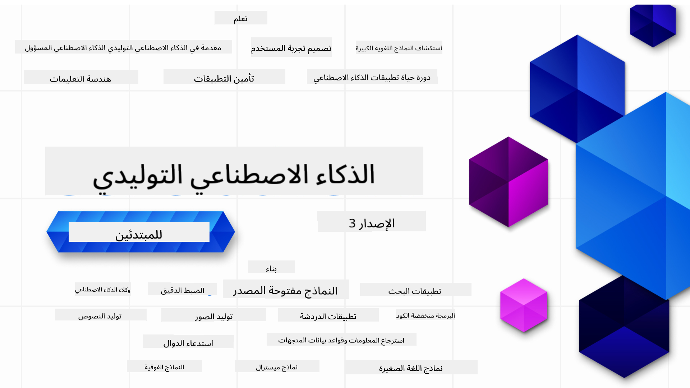

<!--
CO_OP_TRANSLATOR_METADATA:
{
  "original_hash": "4d022651f0c17151c68255e41a68e4ed",
  "translation_date": "2025-12-21T10:41:06+00:00",
  "source_file": "README.md",
  "language_code": "ar"
}
-->

### 21 درسًا تعلمك كل ما تحتاج معرفته للبدء في بناء تطبيقات الذكاء الاصطناعي التوليدي

### 🌐 دعم متعدد اللغات

#### مدعوم عبر GitHub Action (مؤتمت ومحدث دائمًا)

<!-- CO-OP TRANSLATOR LANGUAGES TABLE START -->
[العربية](./README.md) | [البنغالية](../bn/README.md) | [البلغارية](../bg/README.md) | [البورمية (ميانمار)](../my/README.md) | [الصينية (المبسطة)](../zh/README.md) | [الصينية (التقليدية، هونغ كونغ)](../hk/README.md) | [الصينية (التقليدية، ماكاو)](../mo/README.md) | [الصينية (التقليدية، تايوان)](../tw/README.md) | [الكرواتية](../hr/README.md) | [التشيكية](../cs/README.md) | [الدنماركية](../da/README.md) | [الهولندية](../nl/README.md) | [الإستونية](../et/README.md) | [الفنلندية](../fi/README.md) | [الفرنسية](../fr/README.md) | [الألمانية](../de/README.md) | [اليونانية](../el/README.md) | [العبرية](../he/README.md) | [الهندية](../hi/README.md) | [المجرية](../hu/README.md) | [الإندونيسية](../id/README.md) | [الإيطالية](../it/README.md) | [اليابانية](../ja/README.md) | [الكانادا](../kn/README.md) | [الكورية](../ko/README.md) | [الليتوانية](../lt/README.md) | [الماليزية](../ms/README.md) | [المالايالامية](../ml/README.md) | [الماراثية](../mr/README.md) | [النيبالية](../ne/README.md) | [البيجين النيجيري](../pcm/README.md) | [النرويجية](../no/README.md) | [الفارسية (Farsi)](../fa/README.md) | [البولندية](../pl/README.md) | [البرتغالية (البرازيل)](../br/README.md) | [البرتغالية (البرتغال)](../pt/README.md) | [البنجابية (غورموخي)](../pa/README.md) | [الرومانية](../ro/README.md) | [الروسية](../ru/README.md) | [الصربية (السيريلية)](../sr/README.md) | [السلوفاكية](../sk/README.md) | [السلوفينية](../sl/README.md) | [الإسبانية](../es/README.md) | [السواحيلية](../sw/README.md) | [السويدية](../sv/README.md) | [التاغالوغ (الفلبينية)](../tl/README.md) | [التاميلية](../ta/README.md) | [التيلجو](../te/README.md) | [التايلاندية](../th/README.md) | [التركية](../tr/README.md) | [الأوكرانية](../uk/README.md) | [الأردية](../ur/README.md) | [الفيتنامية](../vi/README.md)
<!-- CO-OP TRANSLATOR LANGUAGES TABLE END -->

# الذكاء الاصطناعي التوليدي للمبتدئين (الإصدار 3) - دورة

تعلم أساسيات بناء تطبيقات الذكاء الاصطناعي التوليدي من خلال دورتنا المكونة من 21 درسًا من قِبل Microsoft Cloud Advocates.

## 🌱 ابدأ هنا

تحتوي هذه الدورة على 21 درسًا. كل درس يغطي موضوعًا خاصًا به لذا ابدأ من أي مكان تحبه!

يُوسم الدروس إما كدروس "تعلم" التي تشرح مفهوم الذكاء الاصطناعي التوليدي أو كدروس "بناء" التي تشرح المفهوم وتعرض أمثلة كودية بـ **Python** و **TypeScript** عندما يكون ذلك ممكنًا.

لمطوري .NET اطلع على [Generative AI for Beginners (.NET Edition)](https://github.com/microsoft/Generative-AI-for-Beginners-dotnet?WT.mc_id=academic-105485-koreyst)!

يتضمن كل درس أيضًا قسم "واصل التعلم" مع أدوات تعلم إضافية.

## ما الذي تحتاجه
### لتشغيل كود هذه الدورة، يمكنك استخدام أيًا من:
 - [Azure OpenAI Service](https://aka.ms/genai-beginners/azure-open-ai?WT.mc_id=academic-105485-koreyst) - **الدروس:** "aoai-assignment"
 - [GitHub Marketplace Model Catalog](https://aka.ms/genai-beginners/gh-models?WT.mc_id=academic-105485-koreyst) - **الدروس:** "githubmodels"
 - [OpenAI API](https://aka.ms/genai-beginners/open-ai?WT.mc_id=academic-105485-koreyst) - **الدروس:** "oai-assignment" 
   
- معرفة أساسية بـ Python أو TypeScript مفيدة - \*للمبتدئين تمامًا اطلع على دورات [Python](https://aka.ms/genai-beginners/python?WT.mc_id=academic-105485-koreyst) و [TypeScript](https://aka.ms/genai-beginners/typescript?WT.mc_id=academic-105485-koreyst)
- حساب GitHub لـ [fork للمستودع بأكمله](https://aka.ms/genai-beginners/github?WT.mc_id=academic-105485-koreyst) إلى حسابك على GitHub

أنشأنا درس **[إعداد الدورة](./00-course-setup/README.md?WT.mc_id=academic-105485-koreyst)** لمساعدتك في إعداد بيئة التطوير الخاصة بك.

لا تنسَ أن [تضع نجمة (🌟) لهذا المستودع](https://docs.github.com/en/get-started/exploring-projects-on-github/saving-repositories-with-stars?WT.mc_id=academic-105485-koreyst) لتجده بسهولة لاحقًا.

## 🧠 جاهز للنشر؟

إذا كنت تبحث عن أمثلة كودية أكثر تقدمًا، اطلع على [مجموعة أمثلة كود الذكاء الاصطناعي التوليدي](https://aka.ms/genai-beg-code?WT.mc_id=academic-105485-koreyst) الخاصة بنا بكل من **Python** و **TypeScript**.

## 🗣️ قابل متعلمين آخرين، واحصل على دعم

انضم إلى [خادم Discord الرسمي لـ Azure AI Foundry](https://aka.ms/genai-discord?WT.mc_id=academic-105485-koreyst) للتعرف على متعلمين آخرين يأخذون هذه الدورة والحصول على دعم.

اطرح أسئلة أو شارك ملاحظات المنتج في [منتدى مطوري Azure AI Foundry](https://aka.ms/azureaifoundry/forum) على Github.

## 🚀 تبني شركة ناشئة؟

قم بزيارة [Microsoft for Startups](https://www.microsoft.com/startups) لمعرفة كيفية البدء في البناء باستخدام أرصدة Azure اليوم.

## 🙏 هل تريد المساعدة؟

هل لديك اقتراحات أو وجدت أخطاء إملائية أو أخطاء في الشيفرة؟ [افتح موضوعًا](https://github.com/microsoft/generative-ai-for-beginners/issues?WT.mc_id=academic-105485-koreyst) أو [أنشئ طلب سحب](https://github.com/microsoft/generative-ai-for-beginners/pulls?WT.mc_id=academic-105485-koreyst)

## 📂 يتضمن كل درس:

- مقدمة فيديو قصيرة عن الموضوع
- درس مكتوب موجود في README
- عينات كود بـ Python و TypeScript تدعم Azure OpenAI و OpenAI API
- روابط لموارد إضافية لمواصلة التعلم

## 🗃️ الدروس

| #   | **رابط الدرس**                                                                                                                              | **الوصف**                                                                                 | **الفيديو**                                                                   | **تعلم إضافي**                                                             |
| --- | -------------------------------------------------------------------------------------------------------------------------------------------- | ----------------------------------------------------------------------------------------------- | --------------------------------------------------------------------------- | ------------------------------------------------------------------------------ |
| 00  | [إعداد الدورة](./00-course-setup/README.md?WT.mc_id=academic-105485-koreyst)                                                                 | **تعلم:** كيفية إعداد بيئة التطوير الخاصة بك                                            | سيتم نشر الفيديو قريبًا                                                                 | [معرفة المزيد](https://aka.ms/genai-collection?WT.mc_id=academic-105485-koreyst) |
| 01  | [مقدمة في الذكاء الاصطناعي التوليدي ونماذج اللغة الكبيرة](./01-introduction-to-genai/README.md?WT.mc_id=academic-105485-koreyst)                              | **تعلم:** فهم ما هو الذكاء الاصطناعي التوليدي وكيف تعمل نماذج اللغة الكبيرة (LLMs).       | [فيديو](https://aka.ms/gen-ai-lesson-1-gh?WT.mc_id=academic-105485-koreyst) | [معرفة المزيد](https://aka.ms/genai-collection?WT.mc_id=academic-105485-koreyst) |
| 02  | [استكشاف ومقارنة نماذج اللغة المختلفة](./02-exploring-and-comparing-different-llms/README.md?WT.mc_id=academic-105485-koreyst)             | **تعلم:** كيفية اختيار النموذج المناسب لحالة الاستخدام الخاصة بك                                      | [فيديو](https://aka.ms/gen-ai-lesson2-gh?WT.mc_id=academic-105485-koreyst)  | [معرفة المزيد](https://aka.ms/genai-collection?WT.mc_id=academic-105485-koreyst) |
| 03  | [استخدام الذكاء الاصطناعي التوليدي بمسؤولية](./03-using-generative-ai-responsibly/README.md?WT.mc_id=academic-105485-koreyst)                           | **تعلم:** كيفية بناء تطبيقات الذكاء الاصطناعي التوليدي بمسؤولية                                  | [فيديو](https://aka.ms/gen-ai-lesson3-gh?WT.mc_id=academic-105485-koreyst)  | [معرفة المزيد](https://aka.ms/genai-collection?WT.mc_id=academic-105485-koreyst) |
| 04  | [فهم أساسيات هندسة المطالبات](./04-prompt-engineering-fundamentals/README.md?WT.mc_id=academic-105485-koreyst)             | **تعلم:** ممارسات هندسة المطالبات العملية الأفضل                                           | [فيديو](https://aka.ms/gen-ai-lesson4-gh?WT.mc_id=academic-105485-koreyst)  | [معرفة المزيد](https://aka.ms/genai-collection?WT.mc_id=academic-105485-koreyst) |
| 05  | [إنشاء مطالبات متقدمة](./05-advanced-prompts/README.md?WT.mc_id=academic-105485-koreyst)                                                | **تعلم:** كيفية تطبيق تقنيات هندسة المطالبات التي تحسن نتائج مطالباتك. | [فيديو](https://aka.ms/gen-ai-lesson5-gh?WT.mc_id=academic-105485-koreyst)  | [معرفة المزيد](https://aka.ms/genai-collection?WT.mc_id=academic-105485-koreyst) |
| 06  | [بناء تطبيقات توليد النصوص](./06-text-generation-apps/README.md?WT.mc_id=academic-105485-koreyst)                                | **بناء:** تطبيق لتوليد النصوص باستخدام Azure OpenAI / OpenAI API                                | [فيديو](https://aka.ms/gen-ai-lesson6-gh?WT.mc_id=academic-105485-koreyst)  | [معرفة المزيد](https://aka.ms/genai-collection?WT.mc_id=academic-105485-koreyst) |
| 07  | [بناء تطبيقات الدردشة](./07-building-chat-applications/README.md?WT.mc_id=academic-105485-koreyst)                                     | **بناء:** تقنيات لبناء ودمج تطبيقات الدردشة بكفاءة.               | [فيديو](https://aka.ms/gen-ai-lessons7-gh?WT.mc_id=academic-105485-koreyst) | [معرفة المزيد](https://aka.ms/genai-collection?WT.mc_id=academic-105485-koreyst) |
| 08  | [بناء تطبيقات البحث وقواعد بيانات المتجهات](./08-building-search-applications/README.md?WT.mc_id=academic-105485-koreyst)                        | **بناء:** تطبيق بحث يستخدم التمثيلات المتجهية (Embeddings) للبحث عن البيانات.                        | [فيديو](https://aka.ms/gen-ai-lesson8-gh?WT.mc_id=academic-105485-koreyst)  | [معرفة المزيد](https://aka.ms/genai-collection?WT.mc_id=academic-105485-koreyst) |
| 09  | [بناء تطبيقات توليد الصور](./09-building-image-applications/README.md?WT.mc_id=academic-105485-koreyst)                        | **بناء:** تطبيق لتوليد الصور                                                       | [فيديو](https://aka.ms/gen-ai-lesson9-gh?WT.mc_id=academic-105485-koreyst)  | [معرفة المزيد](https://aka.ms/genai-collection?WT.mc_id=academic-105485-koreyst) |
| 10  | [بناء تطبيقات ذكاء اصطناعي منخفضة الشيفرة](./10-building-low-code-ai-applications/README.md?WT.mc_id=academic-105485-koreyst)                       | **بناء:** تطبيق ذكاء اصطناعي توليدي باستخدام أدوات منخفضة الشيفرة                                     | [فيديو](https://aka.ms/gen-ai-lesson10-gh?WT.mc_id=academic-105485-koreyst) | [معرفة المزيد](https://aka.ms/genai-collection?WT.mc_id=academic-105485-koreyst) |
| 11  | [تكامل التطبيقات الخارجية مع استدعاء الدوال](./11-integrating-with-function-calling/README.md?WT.mc_id=academic-105485-koreyst) | **بناء:** ما هو استدعاء الدوال وحالات استخدامه للتطبيقات                          | [فيديو](https://aka.ms/gen-ai-lesson11-gh?WT.mc_id=academic-105485-koreyst) | [معرفة المزيد](https://aka.ms/genai-collection?WT.mc_id=academic-105485-koreyst) |
| 12  | [تصميم تجربة المستخدم لتطبيقات الذكاء الاصطناعي](./12-designing-ux-for-ai-applications/README.md?WT.mc_id=academic-105485-koreyst)                         | **تعلم:** كيفية تطبيق مبادئ تصميم تجربة المستخدم عند تطوير تطبيقات الذكاء الاصطناعي التوليدية         | [فيديو](https://aka.ms/gen-ai-lesson12-gh?WT.mc_id=academic-105485-koreyst) | [معرفة المزيد](https://aka.ms/genai-collection?WT.mc_id=academic-105485-koreyst) |
| 13  | [تأمين تطبيقات الذكاء الاصطناعي التوليدية الخاصة بك](./13-securing-ai-applications/README.md?WT.mc_id=academic-105485-koreyst)                         | **تعلم:** التهديدات والمخاطر لأنظمة الذكاء الاصطناعي وطرق تأمين هذه الأنظمة.             | [فيديو](https://aka.ms/gen-ai-lesson13-gh?WT.mc_id=academic-105485-koreyst) | [معرفة المزيد](https://aka.ms/genai-collection?WT.mc_id=academic-105485-koreyst) |
| 14  | [دورة حياة تطبيقات الذكاء الاصطناعي التوليدية](./14-the-generative-ai-application-lifecycle/README.md?WT.mc_id=academic-105485-koreyst)           | **تعلم:** الأدوات والمؤشرات لإدارة دورة حياة LLM وLLMOps                         | [فيديو](https://aka.ms/gen-ai-lesson14-gh?WT.mc_id=academic-105485-koreyst) | [معرفة المزيد](https://aka.ms/genai-collection?WT.mc_id=academic-105485-koreyst) |
| 15  | [التوليد المعزز بالاسترجاع (RAG) وقواعد بيانات المتجهات](./15-rag-and-vector-databases/README.md?WT.mc_id=academic-105485-koreyst)        | **بناء:** تطبيق يستخدم إطار RAG لاسترجاع التمثيلات المتجهية من قواعد بيانات المتجهات  | [فيديو](https://aka.ms/gen-ai-lesson15-gh?WT.mc_id=academic-105485-koreyst) | [معرفة المزيد](https://aka.ms/genai-collection?WT.mc_id=academic-105485-koreyst) |
| 16  | [النماذج مفتوحة المصدر وHugging Face](./16-open-source-models/README.md?WT.mc_id=academic-105485-koreyst)                                    | **بناء:** تطبيق يستخدم نماذج مفتوحة المصدر المتاحة على Hugging Face                    | [فيديو](https://aka.ms/gen-ai-lesson16-gh?WT.mc_id=academic-105485-koreyst) | [معرفة المزيد](https://aka.ms/genai-collection?WT.mc_id=academic-105485-koreyst) |
| 17  | [وكلاء الذكاء الاصطناعي](./17-ai-agents/README.md?WT.mc_id=academic-105485-koreyst)                                                                       | **بناء:** تطبيق يستخدم إطار عمل لوكلاء الذكاء الاصطناعي                                           | [فيديو](https://aka.ms/gen-ai-lesson17-gh?WT.mc_id=academic-105485-koreyst) | [معرفة المزيد](https://aka.ms/genai-collection?WT.mc_id=academic-105485-koreyst) |
| 18  | [الضبط الدقيق لنماذج اللغة الكبيرة](./18-fine-tuning/README.md?WT.mc_id=academic-105485-koreyst)                                                              | **تعلم:** ما هو الضبط الدقيق للنماذج، ولماذا، وكيف يتم                                            | [فيديو](https://aka.ms/gen-ai-lesson18-gh?WT.mc_id=academic-105485-koreyst) | [معرفة المزيد](https://aka.ms/genai-collection?WT.mc_id=academic-105485-koreyst) |
| 19  | [البناء باستخدام نماذج اللغة الصغيرة](./19-slm/README.md?WT.mc_id=academic-105485-koreyst)                                                              | **تعلم:** فوائد البناء باستخدام نماذج اللغة الصغيرة                                            | فيديو قادم قريبًا | [معرفة المزيد](https://aka.ms/genai-collection?WT.mc_id=academic-105485-koreyst) |
| 20  | [البناء باستخدام نماذج Mistral](./20-mistral/README.md?WT.mc_id=academic-105485-koreyst)                                                              | **تعلم:** ميزات واختلافات نماذج عائلة Mistral                                           | فيديو قادم قريبًا | [معرفة المزيد](https://aka.ms/genai-collection?WT.mc_id=academic-105485-koreyst) |
| 21  | [البناء باستخدام نماذج Meta](./21-meta/README.md?WT.mc_id=academic-105485-koreyst)                                                              | **تعلم:** ميزات واختلافات نماذج عائلة Meta                                           | فيديو قادم قريبًا | [معرفة المزيد](https://aka.ms/genai-collection?WT.mc_id=academic-105485-koreyst) |

### 🌟 شكر خاص

شكر خاص لـ [**John Aziz**](https://www.linkedin.com/in/john0isaac/) على إنشاء جميع GitHub Actions وسير العمل

[**Bernhard Merkle**](https://www.linkedin.com/in/bernhard-merkle-738b73/) على قيامه بمساهمات رئيسية في كل درس لتحسين تجربة المتعلم وتجربة الكود. 

## 🎒 دورات أخرى

فريقنا ينتج دورات أخرى! اطلع على:

<!-- CO-OP TRANSLATOR OTHER COURSES START -->
### LangChain

---

### Azure / Edge / MCP / Agents

---
 
### سلسلة الذكاء الاصطناعي التوليدي

[-9333EA?style=for-the-badge&labelColor=E5E7EB&color=9333EA)](https://github.com/microsoft/Generative-AI-for-beginners-dotnet?WT.mc_id=academic-105485-koreyst)
[-C084FC?style=for-the-badge&labelColor=E5E7EB&color=C084FC)](https://github.com/microsoft/generative-ai-for-beginners-java?WT.mc_id=academic-105485-koreyst)
[-E879F9?style=for-the-badge&labelColor=E5E7EB&color=E879F9)](https://github.com/microsoft/generative-ai-with-javascript?WT.mc_id=academic-105485-koreyst)

---
 
### التعلم الأساسي

---
 
### سلسلة Copilot

<!-- CO-OP TRANSLATOR OTHER COURSES END -->

## الحصول على المساعدة

إذا علقت أو كانت لديك أي أسئلة حول بناء تطبيقات الذكاء الاصطناعي، انضم إلى المتعلمين الآخرين والمطورين ذوي الخبرة في مناقشات حول MCP. إنه مجتمع داعم حيث تُرحَّب بالأسئلة وتُشارك المعرفة بحرية.

إذا كان لديك ملاحظات عن المنتج أو واجهت أخطاء أثناء البناء، قم بزيارة:

---

<!-- CO-OP TRANSLATOR DISCLAIMER START -->
إخلاء المسؤولية:
تمت ترجمة هذا المستند باستخدام خدمة الترجمة الآلية [Co-op Translator] (https://github.com/Azure/co-op-translator). بينما نسعى جاهداً لتحقيق الدقة، يُرجى العلم أن الترجمات الآلية قد تحتوي على أخطاء أو عدم دقة. يجب اعتبار المستند الأصلي بلغته الأصلية المصدر المعتمد. للمعلومات الحرجة، يوصى بالاستعانة بترجمة بشرية محترفة. لا نتحمّل أي مسؤولية عن أي سوء فهم أو تفسير ناتج عن استخدام هذه الترجمة.
<!-- CO-OP TRANSLATOR DISCLAIMER END -->