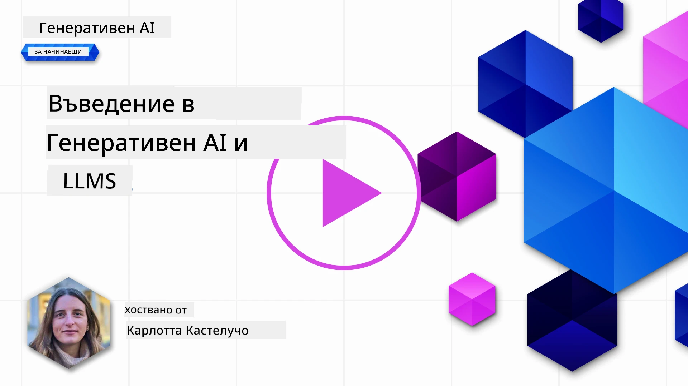
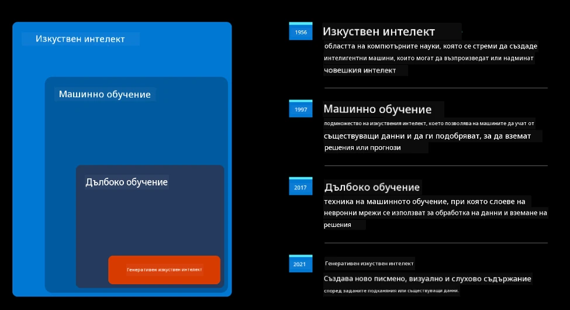
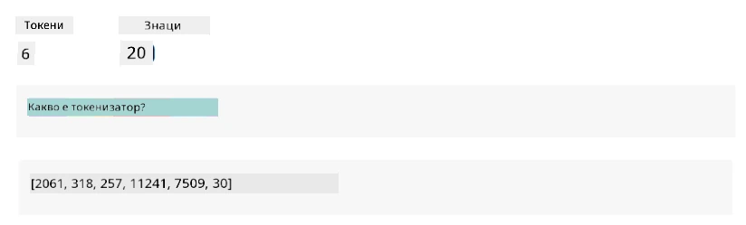
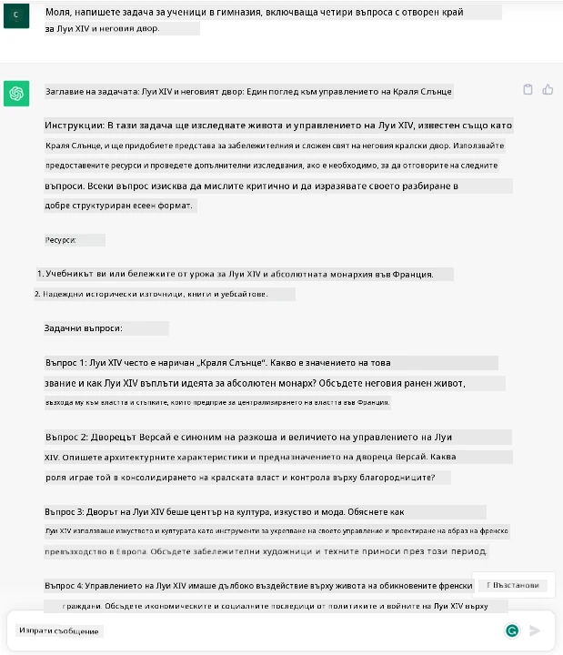
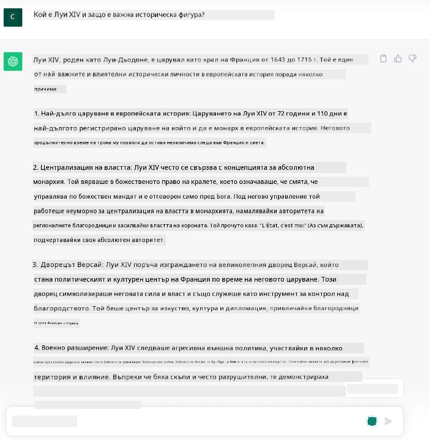
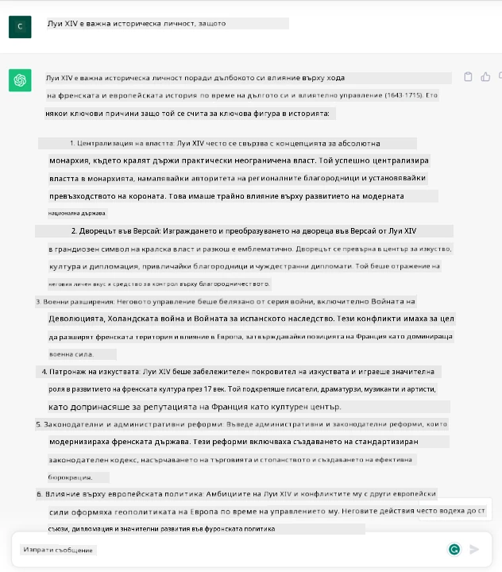
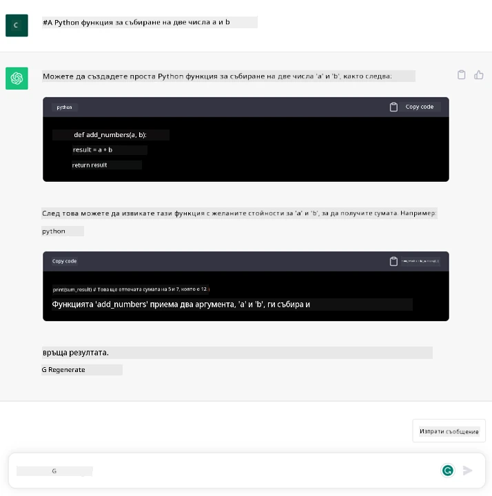

# Въведение в Генеративния ИИ и Големите Езикови Модели

_(Кликнете на изображението по-горе, за да гледате видео на този урок)_

Генеративният ИИ е изкуствен интелект, способен да генерира текст, изображения и други видове съдържание. Това, което го прави фантастична технология, е, че демократизира ИИ – всеки може да го използва с толкова малко, колкото текстова команда, изречение, написано на естествен език. Не е необходимо да научавате език като Java или SQL, за да постигнете нещо значимо, всичко, от което се нуждаете, е да използвате своя език, да заявите какво искате, и излиза предложение от ИИ модел. Приложенията и въздействието на това са огромни – пишете или разбирате доклади, пишете приложения и много повече, всичко за секунди.

В този учебен материал ще разгледаме как нашият стартъп използва генеративен ИИ, за да отключи нови сценарии в сферата на образованието и как се справяме с неизбежните предизвикателства, свързани с обществените последствия от приложението му и технологичните ограничения.

## Въведение

В този урок ще разгледаме:

- Въведение в бизнес сценария: идеята и мисията на нашия стартъп.
- Генеративният ИИ и как стигнахме до сегашното технологично развитие.
- Вътрешната работа на голям езиков модел.
- Основните възможности и практически случаи на употреба на Големите Езикови Модели.

## Цели на обучението

След завършване на този урок ще разберете:

- Какво е генеративен ИИ и как работят Големите Езикови Модели.
- Как можете да използвате големи езикови модели за различни случаи на употреба, с фокус върху образователни сценарии.

## Сценарий: нашият образователен стартъп

Генеративният изкуствен интелект (ИИ) представлява върха на ИИ технологиите, разширявайки границите на това, което някога е било смятано за невъзможно. Генеративните ИИ модели имат множество възможности и приложения, но в този учебен материал ще разгледаме как той революционизира образованието чрез една измислена компания. Ще наречем този стартъп _нашия стартъп_. Нашият стартъп действа в сферата на образованието с амбициозната мисия:

> _да подобри достъпността на обучението в глобален мащаб, гарантирайки справедлив достъп до образование и предоставяне на персонализирани учебни преживявания на всеки ученик, според техните нужди_.

Екипът на стартапа знае, че няма да може да постигне тази цел без да използва един от най-мощните инструменти на нашето време – Големите Езикови Модели (ГЕМ).

Очаква се генеративният ИИ да революционизира начина ни на учене и преподаване днес, като студентите ще разполагат с виртуални учители 24 часа в денонощието, предоставящи огромно количество информация и примери, а учителите ще могат да използват иновативни инструменти за оценяване на учениците и даване на обратна връзка.

За начало, нека дефинираме някои основни понятия и терминология, които ще използваме през целия учебен курс.

## Как стигнахме до Генеративния ИИ?

Въпреки изключителния _хайп_, създаден наскоро от съобщенията за генеративни ИИ модели, тази технология се развива от десетилетия, като първите изследователски усилия датират от 60-те години на миналия век. Сега сме на етап, в който ИИ има човешки когнитивни способности, като разговор, показан например от [OpenAI ChatGPT](https://openai.com/chatgpt) или [Microsoft Copilot](https://copilot.microsoft.com/?WT.mc_id=academic-105485-koreyst), който също използва GPT модел за своя разговорен уеб търсач.

Малко назад, първите прототипи на ИИ бяха писмени чатботове, базирани на база знание от група експерти, представена в компютър. Отговорите в базата знания бяха задействани от ключови думи в текстовия вход.
Но скоро стана ясно, че такъв подход, използвайки писмени чатботове, не може да се мащабира.

### Статистически подход към ИИ: Машинно обучение

През 90-те години настъпи повратна точка с приложението на статистически подход към анализа на текст. Това доведе до разработването на нови алгоритми – известни като машинно обучение – способни да учат модели от данни без да са програмирани изрично. Този подход позволява на машините да симулират разбирането на човешки език: статистически модел се обучава върху двойки текст-етикет, което позволява на модела да класифицира непознат входен текст с предварително зададена етикета, представяща намерението на съобщението.

### Невронни мрежи и съвременни виртуални асистенти

През последните години технологичният напредък на хардуера, способен да обработва по-големи обеми данни и по-сложни изчисления, стимулира изследванията в областта на ИИ, довеждайки до развитието на напреднали алгоритми за машинно обучение, известни като невронни мрежи или алгоритми за дълбоко обучение.

Невронните мрежи (и по-специално Рекурентните Невронни Мрежи – RNN) значително подобриха обработката на естествен език, което позволява представяне на значението на текста по по-смислен начин, отчитайки контекста на дума в изречение.

Това е технологията, която задвижи виртуалните асистенти, появили се през първото десетилетие на новия век, много добри в интерпретирането на човешки език, в идентифициране на нужда и извършване на действие за нейното задоволяване – като отговаряне с предефиниран скрипт или използване на външна услуга.

### Настояще, Генеративен ИИ

Така стигнахме до генеративния ИИ днес, който може да се разглежда като подмножество на дълбокото обучение.

След десетилетия изследвания в областта на ИИ, нова архитектура на модел – наречена _Transformer_ – преодоля ограниченията на RNN, позволявайки да се приемат много по-дълги текстови последователности като вход. Трансформърите се базират на механизма на вниманието, позволяващ на модела да дава различни тежести на получените входове, „обръщайки повече внимание“ там, където се концентрира най-съществената информация, независимо от реда им в текстовата последователност.

Повечето от последните генеративни ИИ модели – известни също като Големи Езикови Модели (ГЕМ), тъй като работят с текстови входове и изходи – всъщност се основават на тази архитектура. Интересното при тези модели – обучени на огромно количество неетикетирани данни от различни източници като книги, статии и уебсайтове – е, че могат да се адаптират към широк спектър от задачи и да генерират граматически правилен текст с елемент на креативност. Така те не само значително повишиха способността на машината да „разбира“ входен текст, но и ѝ позволиха да генерира оригинален отговор на човешки език.

## Как работят големите езикови модели?

В следващата глава ще разгледаме различни видове генеративни ИИ модели, но засега нека видим как работят големите езикови модели, съсредоточавайки се върху моделите OpenAI GPT (Generative Pre-trained Transformer).

- **Токенизатор, текст към числа**: Големите Езикови Модели получават текст като вход и генерират текст като изход. Въпреки това, като статистически модели, те работят много по-добре с числа, отколкото с текстови последователности. Затова всеки вход към модела се обработва от токенизатор преди да бъде използван от основния модел. Токен е част от текста – състоящ се от променлив брой символи, така че основната задача на токенизатора е да раздели входа на масив от токени. След това всеки токен се свързва с индекс на токен, който е цяло числово кодиране на оригиналния текстов откъс.

- **Предсказване на изходни токени**: При задаване на n токена като вход (с макс. n, варираща между моделите), моделът може да предскаже един токен като изход. Този токен след това се включва в следващия вход за следващата итерация, в разширяващ се прозорец, като така осигурява по-добро потребителско изживяване с отговор от едно (или няколко) изречения. Това обяснява защо, ако сте играли с ChatGPT, може да сте забелязали, че понякога изглежда спира в средата на изречението.

- **Процес на избиране, вероятностно разпределение**: Изходният токен се избира от модела според вероятността му да се появи след настоящата текстова последователност. Това е защото моделът предсказва вероятностно разпределение над всички възможни „следващи токени“, изчислено на базата на обучението му. Въпреки това, не винаги се избира токена с най-висока вероятност от разпределението. Добавя се степен на случайност в този избор, така че моделът действа както не-детерминистично - не получаваме абсолютно същия изход за един и същи вход. Тази степен на случайност се добавя, за да симулира процеса на творческо мислене и може да бъде регулирана с параметър на модела, наречен температура.

## Как може нашият стартъп да използва Големите Езикови Модели?

Сега, когато имаме по-добро разбиране за вътрешната работа на голям езиков модел, нека разгледаме някои практически примери на най-често срещаните задачи, които те могат да изпълнят много добре, с оглед на нашия бизнес сценарий.
Казахме, че основната способност на Големия Езиков Модел е _генериране на текст от нула, започвайки от текстов вход, написан на естествен език_.

Но какъв вид текстов вход и изход?
Входът на голям езиков модел е известен като prompt (подсказка), а изходът е известен като completion (завършване) – термин, който се отнася до механизма на модела за генериране на следващия токен, за да завърши текущия вход. Ще се задълбочим в това какво е prompt и как да го проектираме, за да получим максимума от модела. Но засега, нека кажем, че prompt може да включва:

- **Инструкция**, указваща типа изход, който очакваме от модела. Понякога тази инструкция може да съдържа примери или допълнителни данни.

  1. Обобщение на статия, книга, продуктови отзиви и други, както и извличане на изводи от неструктурирани данни.
    
    
  
  2. Креативни идеи и дизайн на статия, есе, задание или други.
      
     

- **Въпрос**, зададен във формата на разговор с агент.
  
  

- Част от **текст за дописване**, което неявно е молба за помощ при писане.
  
  

- Част от **код** заедно с молба за обяснение и документиране, или коментар с искане за генериране на код, изпълняващ конкретна задача.
  
  

Примерите по-горе са доста опростени и не са предназначени да са изчерпателна демонстрация на възможностите на Големите Езикови Модели. Те имат за цел да покажат потенциала на генеративния ИИ, в частност, но не и само, в образователни контексти.

Също така изходът на генеративен ИИ модел не е перфектен и понякога креативността на модела може да му се обърне против, като резултатът е комбинация от думи, която човек може да интерпретира като мистификация на реалността, или дори обидна. Генеративният ИИ не е интелигентен – поне в по-широкото определение на интелигентност, което включва критично и творческо мислене или емоционална интелигентност; той не е детерминистичен и не е надежден, тъй като фалшификации, като грешни препратки, съдържание и твърдения, могат да бъдат смесени с вярна информация и представени по убедителен и уверен начин. В следващите уроци ще се справим с всички тези ограничения и ще видим какво можем да направим, за да ги смекчим.

## Задание

Вашата задача е да прочетете повече за [генеративния ИИ](https://en.wikipedia.org/wiki/Generative_artificial_intelligence?WT.mc_id=academic-105485-koreyst) и да опитате да идентифицирате област, където бихте добавили генеративен ИИ днес, ако липсва. Какъв би бил различният ефект от „стария начин“, можете ли да направите нещо, което преди не сте могли, или сте по-бързи? Напишете обобщение от 300 думи за това как би изглеждал вашият мечтан ИИ стартъп и включете заглавия като „Проблем“, „Как бих използвал ИИ“, „Въздействие“ и по избор бизнес план.

Ако извършите тази задача, може дори да сте готови да кандидатствате в инкубатора на Microsoft, [Microsoft for Startups Founders Hub](https://www.microsoft.com/startups?WT.mc_id=academic-105485-koreyst), където предлагаме кредити както за Azure, така и за OpenAI, менторство и много други, разгледайте го!

## Проверка на знанията

Кое е вярно за големите езикови модели?

1. Всеки път получавате абсолютно същия отговор.
1. Те вършат всичко перфектно, чудесни са в събирането на числа, генериране на работещ код и т.н.
1. Отговорът може да варира, въпреки използването на същата подсказка. Освен това са страхотни в предоставянето на първи чернови на нещо, било то текст или код. Но трябва да подобрите резултатите.

А: 3, ГЕМ е недетерминистичен, отговорът варира, но можете да контролирате вариацията чрез настройката температура. Също така не трябва да очаквате да прави нещата перфектно, той е тук, за да свърши тежката работа вместо вас, което често означава, че получавате добър първи опит за нещо, което трябва постепенно да подобрявате.

## Отлична работа! Продължете напред

След като завършите този урок, разгледайте нашата [сбирка „Генеративен ИИ Обучение“](https://aka.ms/genai-collection?WT.mc_id=academic-105485-koreyst), за да продължите да развивате знанията си за Генеративен ИИ!

Отидете на Урок 2, където ще разгледаме как да [проучваме и сравняваме различни видове LLM](../02-exploring-and-comparing-different-llms/README.md?WT.mc_id=academic-105485-koreyst)!

---

<!-- CO-OP TRANSLATOR DISCLAIMER START -->
**Отказ от отговорност**:
Този документ е преведен с помощта на AI преводачески услуга [Co-op Translator](https://github.com/Azure/co-op-translator). Въпреки че се стремим към точност, моля имайте предвид, че автоматизираните преводи могат да съдържат грешки или неточности. Оригиналният документ на неговия роден език трябва да се счита за авторитетен източник. За критична информация се препоръчва професионален човешки превод. Ние не носим отговорност за каквито и да е недоразумения или неправилни тълкувания, произтичащи от използването на този превод.
<!-- CO-OP TRANSLATOR DISCLAIMER END -->