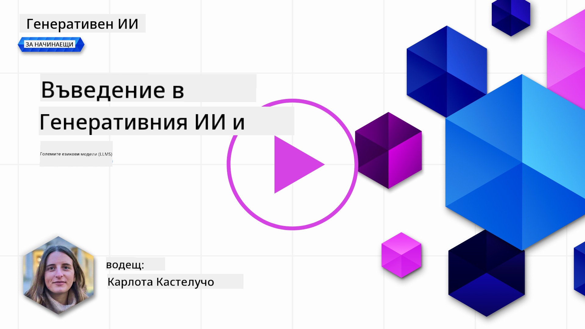
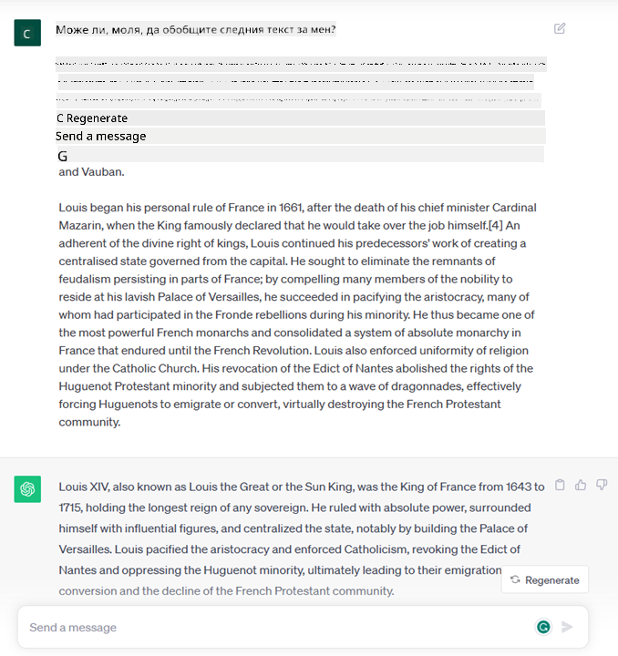
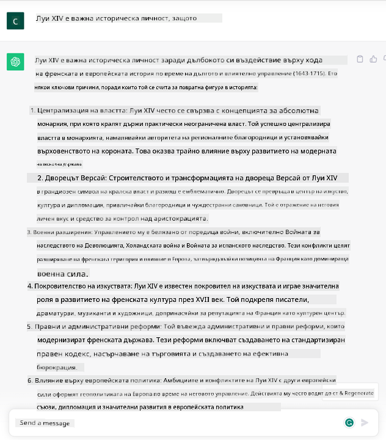

<!--
CO_OP_TRANSLATOR_METADATA:
{
  "original_hash": "bfb7901bdbece1ba3e9f35c400ca33e8",
  "translation_date": "2025-10-17T22:21:17+00:00",
  "source_file": "01-introduction-to-genai/README.md",
  "language_code": "bg"
}
-->
# Въведение в Генеративния AI и Големите Езикови Модели

_(Кликнете върху изображението по-горе, за да гледате видеото на този урок)_

Генеративният AI е изкуствен интелект, способен да генерира текст, изображения и други видове съдържание. Това, което го прави невероятна технология, е, че демократизира AI – всеки може да го използва само с текстова заявка, изречение, написано на естествен език. Няма нужда да учите език като Java или SQL, за да постигнете нещо значимо – всичко, което ви трябва, е да използвате собствения си език, да заявите какво искате и моделът на AI ще ви предложи решение. Приложенията и въздействието на това са огромни – можете да пишете или разбирате доклади, да създавате приложения и много други, всичко това за секунди.

В тази учебна програма ще разгледаме как нашият стартъп използва генеративния AI, за да отключи нови сценарии в света на образованието, както и как се справяме с неизбежните предизвикателства, свързани със социалните последици от неговото приложение и технологичните ограничения.

## Въведение

Този урок ще обхване:

- Въведение в бизнес сценария: нашата стартъп идея и мисия.
- Генеративен AI и как стигнахме до настоящия технологичен пейзаж.
- Вътрешната работа на голям езиков модел.
- Основни възможности и практически приложения на Големите Езикови Модели.

## Цели на обучението

След завършване на този урок ще разберете:

- Какво е генеративен AI и как работят Големите Езикови Модели.
- Как можете да използвате големите езикови модели за различни приложения, с акцент върху образователни сценарии.

## Сценарий: нашият образователен стартъп

Генеративният изкуствен интелект (AI) представлява върха на AI технологиите, разширявайки границите на това, което някога се е смятало за невъзможно. Генеративните AI модели имат множество възможности и приложения, но за тази учебна програма ще разгледаме как те революционизират образованието чрез измислен стартъп. Ще наричаме този стартъп _нашият стартъп_. Нашият стартъп работи в образователната сфера с амбициозната мисия:

> _да подобри достъпността на обучението в глобален мащаб, осигурявайки равен достъп до образование и предоставяйки персонализирани учебни преживявания на всеки ученик според неговите нужди_.

Екипът на нашия стартъп е наясно, че няма да можем да постигнем тази цел без да използваме един от най-мощните инструменти на съвременността – Големите Езикови Модели (LLMs).

Очаква се генеративният AI да революционизира начина, по който учим и преподаваме днес, като учениците разполагат с виртуални учители 24 часа в денонощието, които предоставят огромни количества информация и примери, а учителите могат да използват иновативни инструменти за оценка на своите ученици и предоставяне на обратна връзка.

За начало, нека дефинираме някои основни концепции и терминология, които ще използваме в учебната програма.

## Как стигнахме до Генеративния AI?

Въпреки изключителния _хайп_, създаден напоследък от обявяването на генеративни AI модели, тази технология се разработва от десетилетия, като първите изследователски усилия датират от 60-те години. Сега сме на етап, в който AI притежава човешки когнитивни способности, като например разговор, както се вижда например от [OpenAI ChatGPT](https://openai.com/chatgpt) или [Bing Chat](https://www.microsoft.com/edge/features/bing-chat?WT.mc_id=academic-105485-koreyst), който също използва GPT модел за уеб търсене и разговори в Bing.

Ако се върнем малко назад, първите прототипи на AI се състояха от чатботове, които разчитаха на база знания, извлечена от група експерти и представена в компютър. Отговорите в базата знания се задействаха от ключови думи, появяващи се в текста на входа. 
Въпреки това скоро стана ясно, че такъв подход, използващ чатботове, не се мащабира добре.

### Статистически подход към AI: Машинно обучение

Преломен момент настъпи през 90-те години с прилагането на статистически подход към анализа на текст. Това доведе до разработването на нови алгоритми – известни като машинно обучение – способни да учат модели от данни, без да бъдат изрично програмирани. Този подход позволява на машините да симулират разбирането на човешки език: статистически модел се обучава върху двойки текст-етикет, което позволява на модела да класифицира неизвестен входен текст с предварително дефиниран етикет, представляващ намерението на съобщението.

### Невронни мрежи и съвременни виртуални асистенти

През последните години технологичната еволюция на хардуера, способен да обработва по-големи количества данни и по-сложни изчисления, насърчи изследванията в AI, водейки до разработването на усъвършенствани алгоритми за машинно обучение, известни като невронни мрежи или алгоритми за дълбоко обучение.

Невронните мрежи (и по-специално Рекурентните Невронни Мрежи – RNNs) значително подобриха обработката на естествен език, позволявайки представянето на значението на текста по по-смислен начин, като се оценява контекстът на думата в изречението.

Това е технологията, която захранва виртуалните асистенти, родени през първото десетилетие на новия век, много умели в интерпретирането на човешки език, идентифицирането на нужда и извършването на действие за нейното удовлетворяване – като отговаряне с предварително дефиниран сценарий или използване на услуга от трета страна.

### Днес, Генеративен AI

Така стигнахме до Генеративния AI днес, който може да се разглежда като подмножество на дълбокото обучение.

След десетилетия изследвания в областта на AI, нова архитектура на модела – наречена _Transformer_ – преодоля ограниченията на RNNs, като успя да обработва много по-дълги текстови последователности като вход. Transformers се основават на механизма на внимание, който позволява на модела да дава различни тежести на входовете, които получава, „обръщайки повече внимание“ там, където е концентрирана най-релевантната информация, независимо от тяхната последователност в текста.

Повечето от последните генеративни AI модели – известни също като Големи Езикови Модели (LLMs), тъй като работят с текстови входове и изходи – всъщност се основават на тази архитектура. Това, което е интересно за тези модели – обучени върху огромно количество неетикетирани данни от разнообразни източници като книги, статии и уебсайтове – е, че те могат да бъдат адаптирани към широк спектър от задачи и да генерират граматически правилен текст с привидна креативност. Така че, не само че те невероятно подобриха способността на машината да „разбира“ входния текст, но и позволиха способността й да генерира оригинален отговор на човешки език.

## Как работят големите езикови модели?

В следващата глава ще разгледаме различни видове генеративни AI модели, но засега нека разгледаме как работят големите езикови модели, с акцент върху моделите OpenAI GPT (Generative Pre-trained Transformer).

- **Токенизатор, текст към числа**: Големите Езикови Модели получават текст като вход и генерират текст като изход. Въпреки това, като статистически модели, те работят много по-добре с числа, отколкото с текстови последователности. Затова всеки вход към модела се обработва от токенизатор, преди да бъде използван от основния модел. Токенът е част от текст – състоящ се от променлив брой символи, така че основната задача на токенизатора е да раздели входа на масив от токени. След това всеки токен се свързва с индекс на токен, който е целочислено кодиране на оригиналния текстов фрагмент.

- **Предсказване на изходни токени**: Дадени n токена като вход (с максимално n, вариращо от един модел до друг), моделът може да предскаже един токен като изход. Този токен след това се включва във входа на следващата итерация, в разширяващ се прозорец, позволявайки по-добро потребителско изживяване, като се получава едно (или няколко) изречение като отговор. Това обяснява защо, ако някога сте играли с ChatGPT, може да сте забелязали, че понякога изглежда, че спира в средата на изречение.

- **Процес на избор, разпределение на вероятностите**: Изходният токен се избира от модела според вероятността му да се появи след текущата текстова последователност. Това е така, защото моделът предсказва разпределение на вероятностите за всички възможни „следващи токени“, изчислено въз основа на неговото обучение. Въпреки това, не винаги се избира токенът с най-висока вероятност от полученото разпределение. Към този избор се добавя степен на случайност, така че моделът да действа по недетерминистичен начин – не получаваме точно същия изход за същия вход. Тази степен на случайност се добавя, за да симулира процеса на творческо мислене и може да се регулира чрез параметър на модела, наречен температура.

## Как нашият стартъп може да използва Големите Езикови Модели?

Сега, когато имаме по-добро разбиране за вътрешната работа на големите езикови модели, нека разгледаме някои практически примери за най-често срещаните задачи, които те могат да изпълняват доста добре, с поглед към нашия бизнес сценарий. Казахме, че основната способност на Големите Езикови Модели е _генериране на текст от нулата, започвайки от текстов вход, написан на естествен език_.

Но какъв вид текстов вход и изход?
Входът на голям езиков модел е известен като заявка (prompt), докато изходът е известен като завършване (completion), термин, който се отнася до механизма на модела за генериране на следващия токен, за да завърши текущия вход. Ще разгледаме подробно какво е заявка и как да я проектираме така, че да извлечем максимума от нашия модел. Но засега нека просто кажем, че заявката може да включва:

- **Инструкция**, уточняваща типа изход, който очакваме от модела. Тази инструкция понякога може да включва примери или допълнителни данни.

  1. Резюме на статия, книга, отзиви за продукти и други, заедно с извличане на прозрения от неструктурирани данни.
    
    
  
  2. Творческо създаване и дизайн на статия, есе, задача или друго.
      
     

- **Въпрос**, зададен под формата на разговор с агент.
  
  

- Част от **текст за завършване**, което имплицитно е искане за помощ при писане.
  
  

- Част от **код**, заедно с искане за обяснение и документиране, или коментар, който иска генериране на код, изпълняващ конкретна задача.
  
  

Горните примери са доста прости и не са предназначени да бъдат изчерпателна демонстрация на възможностите на Големите Езикови Модели. Те са предназначени да покажат потенциала на използването на генеративния AI, особено, но не само, в образователни контексти.

Също така, изходът на генеративния AI модел не е перфектен и понякога креативността на модела може да работи срещу него, водейки до изход, който е комбинация от думи, които човешкият потребител може да интерпретира като изкривяване на реалността или може да бъде обиден. Генеративният AI не е интелигентен – поне в по-цялостното определение на интелигентност, включващо критично и творческо мислене или емоционална интелигентност; той не е детерминистичен и не е надежден, тъй като измислици, като погрешни препратки, съдържание и твърдения, могат да бъдат комбинирани с правилна информация и представени по убедителен и уверен начин. В следващите уроци ще се занимаваме с всички тези ограничения и ще видим какво можем да направим, за да ги смекчим.

## Задача

Вашата задача е да прочетете повече за [генеративния AI](https://en.wikipedia.org/wiki/Generative_artificial_intelligence?WT.mc_id=academic-105485-koreyst) и да се опитате да идентифицирате област, в която бихте добавили генеративен AI днес, която все още не го използва. Как би се различило въздействието от това да го правите по "стария начин", можете ли да направите нещо, което не сте могли преди, или сте по-бързи? Напишете резюме от 300 думи за това как би изглеждал вашият мечтан AI стартъп и включете заглавия като "Проблем", "Как бих използвал AI", "Въздействие" и по желание бизнес план.

Ако изпълните тази задача, може дори да сте готови да кандидатствате за инкубатора на Microsoft, [Microsoft for Startups Founders Hub](https://www.microsoft.com/startups?WT.mc_id=academic-105485-koreyst), където предлагаме кредити за Azure, OpenAI, менторство и много други, разгледайте го!

## Проверка на знанията

Какво е вярно за големите езикови модели?

1. Получавате точно същия отговор всеки път.
1. Те правят всичко перфектно, страхотни са в събиране на числа, създаване на работещ код и т.н.
1. Отговорът може да варира, въпреки че използвате същата заявка. Те също са страхотни за предоставяне на първоначален вариант на нещо, било то текст или код. Но трябва да подобрите резултатите.

A: 3, LLM е недетерминистичен, отговорът варира, но можете да контролирате неговата вариация чрез настройка на температурата. Също
Отидете на Урок 2, където ще разгледаме как да [изследваме и сравняваме различни типове LLM](../02-exploring-and-comparing-different-llms/README.md?WT.mc_id=academic-105485-koreyst)!

---

**Отказ от отговорност**:  
Този документ е преведен с помощта на AI услуга за превод [Co-op Translator](https://github.com/Azure/co-op-translator). Въпреки че се стремим към точност, моля, имайте предвид, че автоматизираните преводи може да съдържат грешки или неточности. Оригиналният документ на неговия роден език трябва да се счита за авторитетен източник. За критична информация се препоръчва професионален човешки превод. Ние не носим отговорност за каквито и да е недоразумения или погрешни интерпретации, произтичащи от използването на този превод.