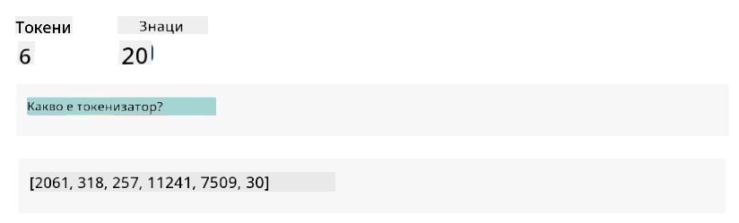
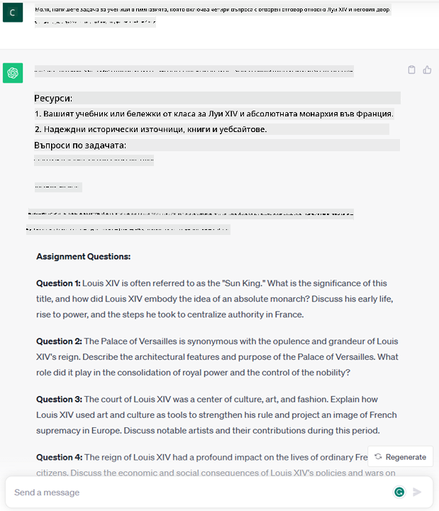
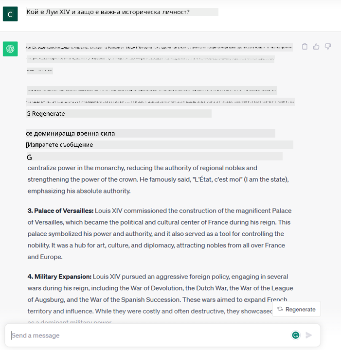
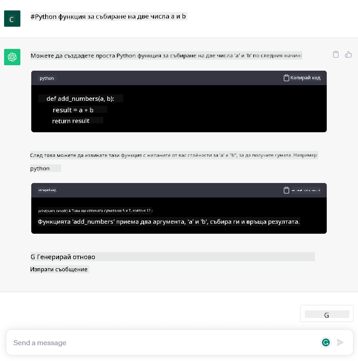

<!--
CO_OP_TRANSLATOR_METADATA:
{
  "original_hash": "f53ba0fa49164f9323043f1c6b11f2b1",
  "translation_date": "2025-07-09T08:02:31+00:00",
  "source_file": "01-introduction-to-genai/README.md",
  "language_code": "bg"
}
-->
# Въведение в Генеративния AI и Големите Езикови Модели

_(Кликнете върху изображението по-горе, за да гледате видеото на този урок)_

Генеративният AI е изкуствен интелект, способен да създава текст, изображения и други видове съдържание. Това, което го прави изключителна технология, е че демократизира AI – всеки може да го използва само с кратка текстова команда, изречение, написано на естествен език. Не е нужно да учите езици като Java или SQL, за да постигнете нещо значимо – всичко, което трябва да направите, е да използвате своя език, да заявите какво искате и AI моделът ще ви предложи резултат. Приложенията и въздействието са огромни – пишете или разбирате доклади, създавате приложения и много други неща, всичко това за секунди.

В този учебен план ще разгледаме как нашият стартъп използва генеративния AI, за да отключи нови възможности в образованието и как се справяме с неизбежните предизвикателства, свързани със социалните последици от приложението му и технологичните ограничения.

## Въведение

Този урок ще обхване:

- Въведение в бизнес сценария: идеята и мисията на нашия стартъп.
- Генеративен AI и как стигнахме до настоящия технологичен пейзаж.
- Вътрешната работа на голям езиков модел.
- Основни възможности и практически приложения на Големите Езикови Модели.

## Цели на обучението

След завършване на този урок ще разберете:

- Какво е генеративен AI и как работят Големите Езикови Модели.
- Как можете да използвате големите езикови модели за различни приложения, с акцент върху образователни сценарии.

## Сценарий: нашият образователен стартъп

Генеративният изкуствен интелект (AI) представлява върха на AI технологиите, разширявайки границите на това, което някога е било смятано за невъзможно. Генеративните AI модели имат множество възможности и приложения, но в този учебен план ще разгледаме как той революционизира образованието чрез един измислен стартъп. Ще наричаме този стартъп _нашият стартъп_. Нашият стартъп работи в сферата на образованието с амбициозната мисия:

> _да подобри достъпността до обучение на глобално ниво, осигурявайки равен достъп до образование и предоставяйки персонализирани учебни преживявания на всеки ученик според неговите нужди_.

Екипът на нашия стартъп е наясно, че няма да може да постигне тази цел без да използва един от най-мощните инструменти на съвремието – Големите Езикови Модели (LLMs).

Очаква се генеративният AI да революционизира начина, по който учим и преподаваме днес, като студентите ще разполагат с виртуални учители 24 часа в денонощието, които предоставят огромно количество информация и примери, а преподавателите ще могат да използват иновативни инструменти за оценка и обратна връзка.

За начало, нека дефинираме някои основни понятия и терминология, които ще използваме през целия учебен план.

## Как стигнахме до Генеративния AI?

Въпреки огромния _хайп_, създаден напоследък около генеративните AI модели, тази технология се развива от десетилетия, като първите изследователски усилия датират още от 60-те години. В момента AI притежава човешки когнитивни способности, като например водене на разговор, показано от [OpenAI ChatGPT](https://openai.com/chatgpt) или [Bing Chat](https://www.microsoft.com/edge/features/bing-chat?WT.mc_id=academic-105485-koreyst), който също използва GPT модел за търсене и разговори в Bing.

Ако се върнем назад, първите прототипи на AI бяха чатботове с предварително зададени отговори, базирани на база знания, съставена от експерти и въведена в компютър. Отговорите се задействаха от ключови думи в текста на входа. Въпреки това, скоро стана ясно, че този подход не се мащабира добре.

### Статистически подход към AI: Машинно обучение

Преломен момент настъпи през 90-те години с прилагането на статистически подход към анализа на текст. Това доведе до разработването на нови алгоритми – известни като машинно обучение – които могат да учат модели от данни без да са изрично програмирани. Този подход позволява на машините да симулират разбирането на човешки език: статистически модел се обучава върху двойки текст-етикет, което му позволява да класифицира непознат текст с предварително зададена етикета, отразяваща намерението на съобщението.

### Невронни мрежи и съвременни виртуални асистенти

През последните години технологичният напредък в хардуера, способен да обработва по-големи обеми данни и по-сложни изчисления, стимулира изследванията в AI, водещи до развитието на усъвършенствани алгоритми за машинно обучение, известни като невронни мрежи или дълбоко обучение.

Невронните мрежи (особено Рекурентните Невронни Мрежи – RNN) значително подобриха обработката на естествен език, позволявайки по-смислено представяне на значението на текста, като се взема предвид контекстът на думата в изречението.

Това е технологията, която задвижи виртуалните асистенти, появили се в първото десетилетие на новия век, много добри в разбирането на човешкия език, идентифициране на нужда и извършване на действие за нейното удовлетворяване – като отговор с предварително зададен скрипт или използване на външна услуга.

### Днешен ден, Генеративен AI

Така стигнахме до днешния Генеративен AI, който може да се разглежда като подмножество на дълбокото обучение.

След десетилетия изследвания в областта на AI, нова архитектура на модел – наречена _Transformer_ – преодоля ограниченията на RNN, като може да обработва много по-дълги текстови последователности като вход. Трансформърите се базират на механизма на вниманието, който позволява на модела да дава различни тежести на входните данни, „обръщайки повече внимание“ там, където е концентрирана най-важната информация, независимо от реда им в текста.

Повечето от последните генеративни AI модели – известни още като Големи Езикови Модели (LLMs), тъй като работят с текстови входове и изходи – са базирани именно на тази архитектура. Интересното при тези модели – обучени върху огромно количество неетикетирани данни от различни източници като книги, статии и уебсайтове – е, че могат да се адаптират към разнообразни задачи и да генерират граматически правилен текст с известна доза креативност. Така те не само значително подобриха способността на машината да „разбира“ входния текст, но и ѝ позволиха да създава оригинален отговор на човешки език.

## Как работят големите езикови модели?

В следващата глава ще разгледаме различни видове генеративни AI модели, но засега нека видим как работят големите езикови модели, с акцент върху OpenAI GPT (Generative Pre-trained Transformer) моделите.

- **Токенизатор, текст към числа**: Големите Езикови Модели получават текст като вход и генерират текст като изход. Въпреки това, като статистически модели, те работят много по-добре с числа, отколкото с текстови последователности. Затова всеки вход към модела се обработва от токенизатор, преди да бъде използван от основния модел. Токенът е част от текста – съставена от променлив брой символи, така че основната задача на токенизатора е да раздели входа на масив от токени. След това всеки токен се свързва с индекс на токен, който е цяло число, кодиращо оригиналния текстов фрагмент.

- **Предсказване на изходни токени**: При подаване на n токена като вход (максималният брой n варира при различните модели), моделът може да предскаже един токен като изход. Този токен след това се включва във входа за следващата итерация, в разширяващ се прозорец, което позволява по-добро потребителско изживяване с получаване на едно (или няколко) изречения като отговор. Това обяснява защо, ако сте използвали ChatGPT, понякога изглежда, че спира в средата на изречение.

- **Процес на избор, разпределение на вероятности**: Изходният токен се избира от модела според вероятността му да се появи след текущата текстова последователност. Това е така, защото моделът предсказва разпределение на вероятностите за всички възможни „следващи токени“, изчислено на базата на обучението му. Въпреки това, не винаги се избира токенът с най-висока вероятност. Добавя се степен на случайност, така че моделът действа по недетерминистичен начин – не получаваме точно същия изход за един и същ вход. Тази случайност се добавя, за да симулира процеса на творческо мислене и може да се регулира чрез параметър на модела, наречен температура.

## Как нашият стартъп може да използва Големите Езикови Модели?

Сега, когато имаме по-добро разбиране за вътрешната работа на голям езиков модел, нека видим някои практически примери на най-честите задачи, които те могат да изпълняват много добре, с поглед към нашия бизнес сценарий. Казахме, че основната способност на Големия Езиков Модел е _да генерира текст от нулата, започвайки от текстов вход, написан на естествен език_.

Но какъв вид текстов вход и изход?
Входът на големия езиков модел е известен като prompt, а изходът – като completion, термин, който се отнася до механизма на модела за генериране на следващия токен, за да завърши текущия вход. Ще навлезем по-дълбоко в това какво е prompt и как да го проектираме, за да извлечем максимума от модела. Но засега нека кажем, че prompt може да включва:

- **Инструкция**, указваща типа изход, който очакваме от модела. Тази инструкция понякога може да съдържа примери или допълнителни данни.

  1. Резюмиране на статия, книга, ревюта на продукти и др., заедно с извличане на прозрения от неструктурирани данни.
    
    
  
  2. Креативно генериране и проектиране на статия, есе, задача и др.
      
     

- **Въпрос**, зададен под формата на разговор с агент.
  
  

- Част от **текст за дописване**, което имплицитно е молба за помощ при писане.
  
  

- Част от **код** заедно с молба за обяснение и документиране, или коментар, който иска да се генерира код за изпълнение на конкретна задача.
  
  

Горните примери са доста опростени и не претендират да демонстрират изчерпателно възможностите на Големите Езикови Модели. Те са предназначени да покажат потенциала на генеративния AI, особено, но не само, в образователен контекст.

Също така, изходът на генеративен AI модел не е перфектен и понякога креативността на модела може да работи срещу него, като резултатът е комбинация от думи, която човешкият потребител може да възприеме като изкривяване на реалността или дори обидна. Генеративният AI не е интелигентен – поне не в по-широкото определение за интелигентност, включващо критическо и творческо мислене или емоционална интелигентност; той не е детерминистичен и не е напълно надежден, тъй като измислици, като грешни препратки, съдържание и твърдения, могат да бъдат смесени с правилна информация и представени по убедителен и уверен начин. В следващите уроци ще разгледаме всички тези ограничения и ще видим какво можем да направим, за да ги смекчим.

## Задача

Вашата задача е да прочетете повече за [генеративния AI](https://en.wikipedia.org/wiki/Generative_artificial_intelligence?WT.mc_id=academic-105485-koreyst) и да опитате да идентифицирате област, в която бихте добавили генеративен AI днес, а която все още не го използва. Как би бил различен ефектът в сравнение с „стария начин“? Можете ли да направите нещо, което преди не сте могли, или сте по-бързи? Напишете резюме от 300 думи за това как би изглеждал вашият мечтан AI стартъп и включете заглавия като „Проблем“, „Как бих използвал AI“, „Въздействие“ и по желание бизнес план.

Ако изпълните тази задача, може дори да сте готови да кандидатствате в инкубатора на Microsoft, [Microsoft for Startups Founders Hub](https://www.microsoft.com/startups?WT.mc_id=academic-105485-koreyst), където предлагаме кредити за Azure, OpenAI, менторство и много други – разгледайте го!

## Проверка на знанията

Кое от следните е вярно за големите езикови модели?

1. Винаги получавате точно същия отговор.
1. Те вършат всичко перфектно, отлично са в събирането на числа, генерират работещ код и т.н.
1. Отговорът може да варира, въпреки че използвате същия prompt. Те също са отлични в предоставянето на първа чернова на нещо, било то текст или код. Но трябва да подобрите резултатите.

Отговор: 3, LLM е недетерминистичен, отговорът варира, но можете да контролирате тази вариация чрез настройка на температурата. Също така не трябва да очаквате перфектна работа – моделът е тук, за да свърши тежката работа, което често означава, че получавате добър първи опит, който трябва постепенно да подобрявате.

## Отлична работа! Продължете пътешествието

След като завършите този урок, разгледайте нашата [колекция за обучение по Генеративен AI](https://aka.ms/genai-collection?WT.mc_id=academic-105485-koreyst), за да продължите да разв
Отидете на Урок 2, където ще разгледаме как да [изследваме и сравняваме различни типове LLM](../02-exploring-and-comparing-different-llms/README.md?WT.mc_id=academic-105485-koreyst)!

**Отказ от отговорност**:  
Този документ е преведен с помощта на AI преводаческа услуга [Co-op Translator](https://github.com/Azure/co-op-translator). Въпреки че се стремим към точност, моля, имайте предвид, че автоматизираните преводи могат да съдържат грешки или неточности. Оригиналният документ на неговия език трябва да се счита за авторитетен източник. За критична информация се препоръчва професионален човешки превод. Ние не носим отговорност за каквито и да е недоразумения или неправилни тълкувания, произтичащи от използването на този превод.