<!--
CO_OP_TRANSLATOR_METADATA:
{
  "original_hash": "e2f686f2eb794941761252ac5e8e090b",
  "translation_date": "2025-07-09T08:40:25+00:00",
  "source_file": "02-exploring-and-comparing-different-llms/README.md",
  "language_code": "bg"
}
-->
# Изследване и сравнение на различни LLM модели

[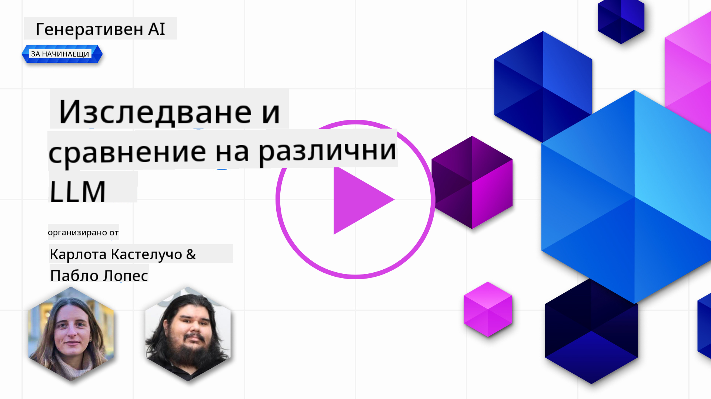](https://aka.ms/gen-ai-lesson2-gh?WT.mc_id=academic-105485-koreyst)

> _Кликнете върху изображението по-горе, за да гледате видео на този урок_

В предишния урок видяхме как Generative AI променя технологичния пейзаж, как работят големите езикови модели (LLM) и как един бизнес – като нашия стартъп – може да ги приложи към своите случаи на употреба и да расте! В тази глава ще сравним и противопоставим различни видове големи езикови модели, за да разберем техните предимства и недостатъци.

Следващата стъпка в пътуването на нашия стартъп е да изследваме настоящия пейзаж на LLM моделите и да разберем кои са подходящи за нашия случай на употреба.

## Въведение

В този урок ще разгледаме:

- Различни видове LLM модели в настоящия пейзаж.
- Тестване, итерации и сравнение на различни модели за вашия случай на употреба в Azure.
- Как да внедрите LLM модел.

## Цели на обучението

След завършване на този урок ще можете да:

- Изберете правилния модел за вашия случай на употреба.
- Разберете как да тествате, итеративно да подобрявате и оптимизирате представянето на модела.
- Знаете как бизнесите внедряват модели.

## Разбиране на различните видове LLM модели

LLM моделите могат да бъдат категоризирани по различни начини според тяхната архитектура, обучителни данни и случаи на употреба. Разбирането на тези разлики ще помогне на нашия стартъп да избере правилния модел за конкретния сценарий и да разбере как да тества, итеративно да подобрява и оптимизира представянето.

Съществуват много различни видове LLM модели, а изборът ви зависи от това за какво искате да ги използвате, какви данни имате, колко сте готови да платите и други.

В зависимост от това дали искате да използвате моделите за текст, аудио, видео, генериране на изображения и т.н., може да изберете различен тип модел.

- **Аудио и разпознаване на реч**. За тази цел моделите от тип Whisper са отличен избор, тъй като са универсални и са насочени към разпознаване на реч. Те са обучени върху разнообразни аудио данни и могат да извършват многоезично разпознаване на реч. Научете повече за [Whisper моделите тук](https://platform.openai.com/docs/models/whisper?WT.mc_id=academic-105485-koreyst).

- **Генериране на изображения**. За генериране на изображения, DALL-E и Midjourney са две много известни опции. DALL-E се предлага от Azure OpenAI. [Прочетете повече за DALL-E тук](https://platform.openai.com/docs/models/dall-e?WT.mc_id=academic-105485-koreyst) и също в Глава 9 от този учебен план.

- **Генериране на текст**. Повечето модели са обучени за генериране на текст и имате голям избор от GPT-3.5 до GPT-4. Те се предлагат на различни цени, като GPT-4 е най-скъпият. Струва си да разгледате [Azure OpenAI playground](https://oai.azure.com/portal/playground?WT.mc_id=academic-105485-koreyst), за да оцените кои модели най-добре отговарят на вашите нужди по отношение на възможности и цена.

- **Мултимодалност**. Ако искате да обработвате няколко типа данни като вход и изход, може да разгледате модели като [gpt-4 turbo с визия или gpt-4o](https://learn.microsoft.com/azure/ai-services/openai/concepts/models#gpt-4-and-gpt-4-turbo-models?WT.mc_id=academic-105485-koreyst) – най-новите версии на OpenAI модели – които могат да комбинират обработка на естествен език с визуално разбиране, позволявайки взаимодействия чрез мултимодални интерфейси.

Изборът на модел означава, че получавате базови възможности, които обаче може да не са достатъчни. Често имате фирмени специфични данни, за които трябва по някакъв начин да информирате LLM. Има няколко различни подхода за това, за които ще говорим в следващите секции.

### Foundation модели срещу LLM модели

Терминът Foundation Model е [въведен от изследователи от Станфорд](https://arxiv.org/abs/2108.07258?WT.mc_id=academic-105485-koreyst) и се дефинира като AI модел, който отговаря на някои критерии, като:

- **Обучават се чрез неконтролирано или самоконтролирано обучение**, което означава, че са обучени върху немаркирани мултимодални данни и не изискват човешка анотация или маркиране на данните за обучението.
- **Те са много големи модели**, базирани на много дълбоки невронни мрежи, обучени върху милиарди параметри.
- **Обикновено са предназначени да служат като „основа“ за други модели**, което означава, че могат да се използват като отправна точка за изграждане на други модели чрез фино настройване.

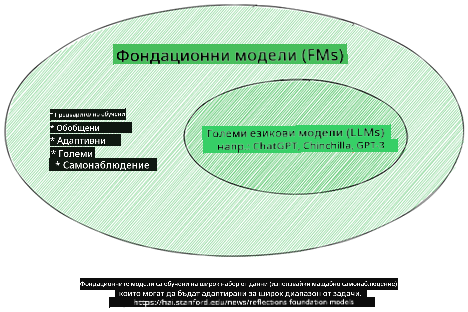

Източник на изображението: [Essential Guide to Foundation Models and Large Language Models | от Babar M Bhatti | Medium](https://thebabar.medium.com/essential-guide-to-foundation-models-and-large-language-models-27dab58f7404)

За да изясним тази разлика, нека вземем ChatGPT за пример. За да се създаде първата версия на ChatGPT, моделът GPT-3.5 е използван като foundation модел. Това означава, че OpenAI е използвал специфични за чат данни, за да създаде настроена версия на GPT-3.5, специализирана да се представя добре в разговорни сценарии, като чатботове.

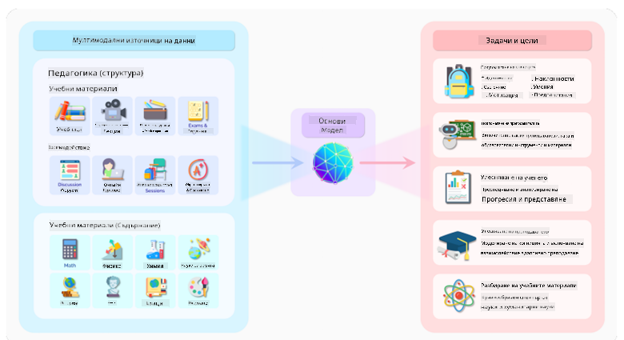

Източник на изображението: [2108.07258.pdf (arxiv.org)](https://arxiv.org/pdf/2108.07258.pdf?WT.mc_id=academic-105485-koreyst)

### Отворени срещу собственически модели

Друг начин за категоризиране на LLM моделите е дали са с отворен код или собственически.

Отворените модели са тези, които са достъпни за обществеността и могат да се използват от всеки. Те често се предоставят от компанията, която ги е създала, или от изследователската общност. Тези модели могат да бъдат преглеждани, модифицирани и персонализирани за различни случаи на употреба. Въпреки това, те не винаги са оптимизирани за продукционна употреба и може да не са толкова ефективни, колкото собственическите модели. Освен това финансирането за отворените модели може да е ограничено, те може да не се поддържат дългосрочно или да не се обновяват с най-новите изследвания. Примери за популярни отворени модели са [Alpaca](https://crfm.stanford.edu/2023/03/13/alpaca.html?WT.mc_id=academic-105485-koreyst), [Bloom](https://huggingface.co/bigscience/bloom) и [LLaMA](https://llama.meta.com).

Собственическите модели са модели, които са собственост на компания и не са достъпни за обществеността. Те често са оптимизирани за продукционна употреба. Въпреки това, не е позволено да се преглеждат, модифицират или персонализират за различни случаи на употреба. Освен това не винаги са безплатни и може да изискват абонамент или плащане за използване. Потребителите нямат контрол върху данните, използвани за обучението на модела, което означава, че трябва да се доверят на собственика на модела за спазване на поверителността на данните и отговорното използване на AI. Примери за популярни собственически модели са [OpenAI модели](https://platform.openai.com/docs/models/overview?WT.mc_id=academic-105485-koreyst), [Google Bard](https://sapling.ai/llm/bard?WT.mc_id=academic-105485-koreyst) и [Claude 2](https://www.anthropic.com/index/claude-2?WT.mc_id=academic-105485-koreyst).

### Вграждане (Embedding) срещу генериране на изображения срещу генериране на текст и код

LLM моделите могат да се категоризират и според вида на изхода, който генерират.

Embedding моделите са набор от модели, които преобразуват текст в числова форма, наречена embedding, което е числово представяне на входния текст. Embedding улесняват машините да разбират връзките между думи или изречения и могат да се използват като вход за други модели, като модели за класификация или клъстеризация, които работят по-добре с числови данни. Embedding моделите често се използват за трансферно обучение, при което моделът се обучава за заместителна задача с изобилие от данни, а след това теглата на модела (embedding) се използват за други задачи. Пример за тази категория са [OpenAI embeddings](https://platform.openai.com/docs/models/embeddings?WT.mc_id=academic-105485-koreyst).

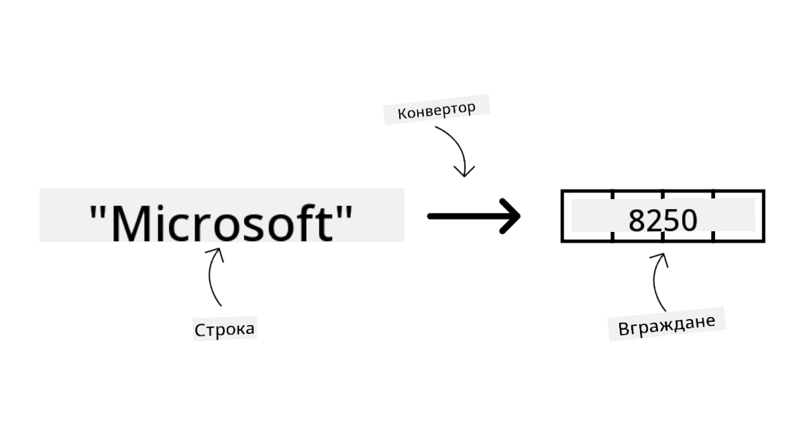

Моделите за генериране на изображения създават изображения. Те често се използват за редактиране, синтез и трансформация на изображения. Обучават се върху големи набори от изображения, като [LAION-5B](https://laion.ai/blog/laion-5b/?WT.mc_id=academic-105485-koreyst), и могат да генерират нови изображения или да редактират съществуващи с техники като inpainting, суперрезолюция и колоризация. Примери са [DALL-E-3](https://openai.com/dall-e-3?WT.mc_id=academic-105485-koreyst) и [Stable Diffusion модели](https://github.com/Stability-AI/StableDiffusion?WT.mc_id=academic-105485-koreyst).

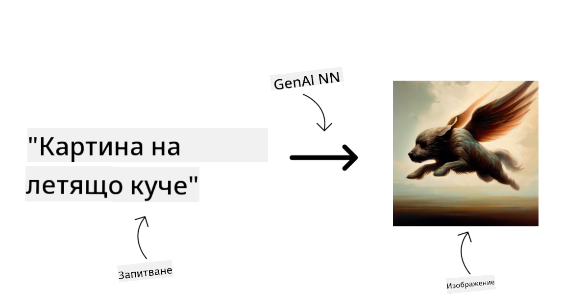

Моделите за генериране на текст и код създават текст или код. Те често се използват за обобщаване на текст, превод и отговаряне на въпроси. Обучават се върху големи текстови набори, като [BookCorpus](https://www.cv-foundation.org/openaccess/content_iccv_2015/html/Zhu_Aligning_Books_and_ICCV_2015_paper.html?WT.mc_id=academic-105485-koreyst), и могат да генерират нов текст или да отговарят на въпроси. Моделите за генериране на код, като [CodeParrot](https://huggingface.co/codeparrot?WT.mc_id=academic-105485-koreyst), се обучават върху големи набори от код, като GitHub, и могат да генерират нов код или да поправят грешки в съществуващ код.

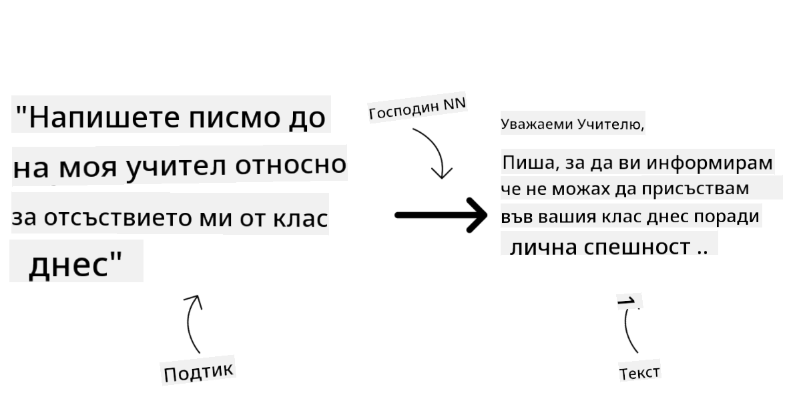

### Encoder-Decoder срещу само Decoder

За да обясним различните архитектури на LLM моделите, нека използваме аналогия.

Представете си, че вашият мениджър ви е дал задача да напишете тест за учениците. Имате двама колеги; единият отговаря за създаването на съдържанието, а другият – за прегледа му.

Създателят на съдържание е като модел само с Decoder, той може да види темата и това, което вече сте написали, и да създаде курс на тази база. Те са много добри в писането на ангажиращо и информативно съдържание, но не са много добри в разбирането на темата и учебните цели. Примери за Decoder модели са семейството GPT, като GPT-3.

Преглеждащият е като модел само с Encoder, той разглежда написания курс и отговорите, забелязва връзките между тях и разбира контекста, но не е добър в генерирането на съдържание. Пример за Encoder модел е BERT.

Представете си, че имаме някой, който може както да създава, така и да преглежда теста – това е Encoder-Decoder модел. Примери за такива са BART и T5.

### Услуга срещу Модел

Сега нека разгледаме разликата между услуга и модел. Услугата е продукт, предлаган от доставчик на облачни услуги, и често представлява комбинация от модели, данни и други компоненти. Моделът е основният компонент на услугата и обикновено е foundation модел, като LLM.

Услугите са оптимизирани за продукционна употреба и обикновено са по-лесни за използване чрез графичен интерфейс. Въпреки това, услугите не винаги са безплатни и може да изискват абонамент или плащане, като в замяна се използват оборудването и ресурсите на доставчика, оптимизират се разходите и се осигурява лесно мащабиране. Пример за услуга е [Azure OpenAI Service](https://learn.microsoft.com/azure/ai-services/openai/overview?WT.mc_id=academic-105485-koreyst), която предлага плащане според използването, като потребителите се таксуват пропорционално на консумацията. Освен това Azure OpenAI Service предлага корпоративна сигурност и рамка за отговорно използване на AI върху възможностите на моделите.

Моделите са само невронната мрежа с параметрите, теглата и други. Компаниите могат да ги използват локално, но трябва да закупят оборудване, да изградят инфраструктура за мащабиране и да закупят лиценз или да използват отворен код. Модел като LLaMA е достъпен за използване, но изисква изчислителна мощност за работа.

## Как да тествате и итеративно да подобрявате представянето на различни модели в Azure

След като нашият екип е изследвал настоящия пейзаж на LLM моделите и е идентифицирал някои подходящи кандидати за своите сценарии, следващата стъпка е да ги тества върху своите данни и натоварване. Това е итеративен процес, извършван чрез експерименти и измервания.
Повечето от моделите, които споменахме в предишните параграфи (OpenAI модели, отворени модели като Llama2 и Hugging Face трансформъри) са налични в [Model Catalog](https://learn.microsoft.com/azure/ai-studio/how-to/model-catalog-overview?WT.mc_id=academic-105485-koreyst) в [Azure AI Studio](https://ai.azure.com/?WT.mc_id=academic-105485-koreyst).

[Azure AI Studio](https://learn.microsoft.com/azure/ai-studio/what-is-ai-studio?WT.mc_id=academic-105485-koreyst) е облачна платформа, създадена за разработчици, която позволява изграждането на генеративни AI приложения и управлението на целия жизнен цикъл на разработка – от експериментиране до оценка – чрез обединяване на всички Azure AI услуги в един център с удобен графичен интерфейс. Model Catalog в Azure AI Studio дава възможност на потребителя да:

- Намери Foundation Model, който го интересува в каталога – независимо дали е собствен или с отворен код, като филтрира по задача, лиценз или име. За по-добра търсене моделите са организирани в колекции, като Azure OpenAI колекция, Hugging Face колекция и други.

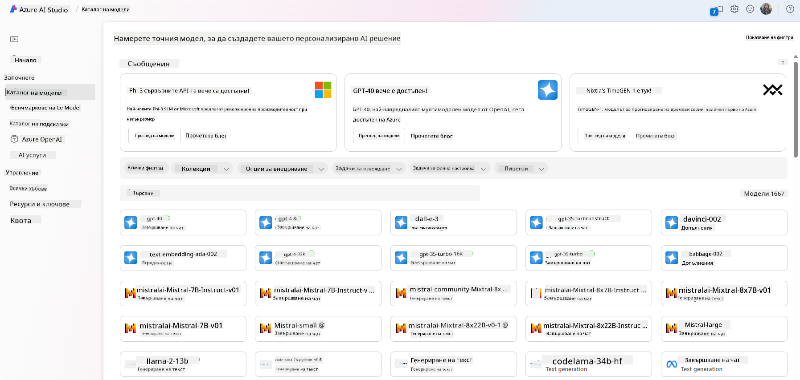

- Прегледа model card, включително подробна информация за предназначението и обучителните данни, примерен код и резултати от оценки в библиотеката с вътрешни тестове.

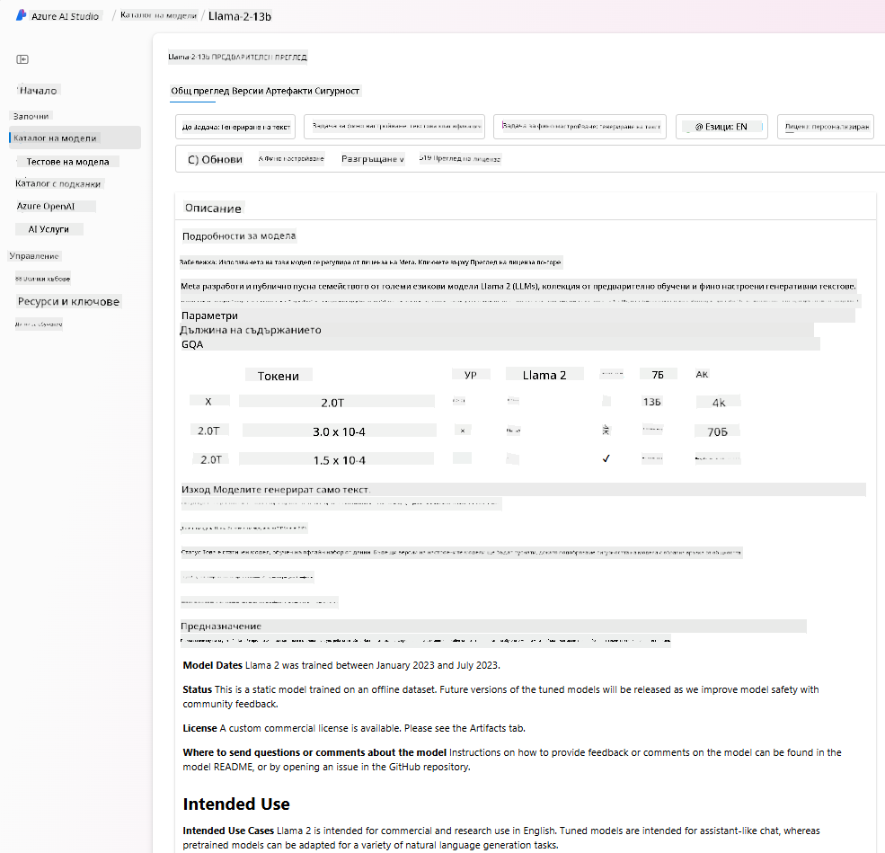

- Сравни бенчмаркове между модели и набори от данни, налични в индустрията, за да прецени кой най-добре отговаря на бизнес сценария, чрез панела [Model Benchmarks](https://learn.microsoft.com/azure/ai-studio/how-to/model-benchmarks?WT.mc_id=academic-105485-koreyst).

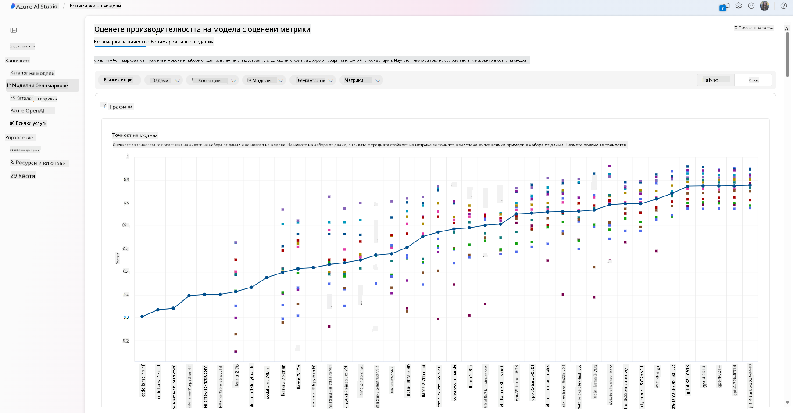

- Фино настрои модела върху собствени обучителни данни, за да подобри представянето му при конкретна задача, използвайки възможностите за експериментиране и проследяване в Azure AI Studio.

- Деплойне оригиналния предварително обучен модел или фино настроената версия към отдалечен real time inference – управляван изчислителен ресурс – или serverless API endpoint – [pay-as-you-go](https://learn.microsoft.com/azure/ai-studio/how-to/model-catalog-overview#model-deployment-managed-compute-and-serverless-api-pay-as-you-go?WT.mc_id=academic-105485-koreyst) – за да позволи на приложенията да го използват.

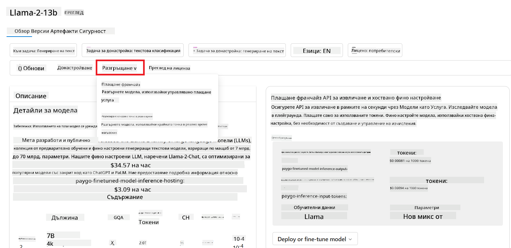

> [!NOTE]
> Не всички модели в каталога в момента са достъпни за фино настройване и/или pay-as-you-go деплоймент. Проверете model card за подробности относно възможностите и ограниченията на модела.

## Подобряване на резултатите от LLM

Нашият стартъп екип изследва различни видове LLM и облачната платформа (Azure Machine Learning), която ни позволява да сравняваме различни модели, да ги оценяваме върху тестови данни, да подобряваме представянето им и да ги деплойваме на inference endpoints.

Но кога е подходящо да се направи фино настройване на модел, вместо да се използва предварително обучен? Има ли други подходи за подобряване на представянето на модела при конкретни задачи?

Има няколко подхода, които бизнесът може да използва, за да получи желаните резултати от LLM. Можете да изберете различни типове модели с различна степен на обучение при внедряване на LLM в продукция, с различна сложност, цена и качество. Ето някои от тях:

- **Prompt engineering с контекст**. Идеята е да се предостави достатъчно контекст при подаване на заявката, за да се получат нужните отговори.

- **Retrieval Augmented Generation, RAG**. Вашите данни може да се намират в база данни или уеб endpoint, например, и за да се включат тези данни или част от тях в момента на подаване на заявката, можете да извлечете релевантната информация и да я добавите към prompt-а на потребителя.

- **Фино настроен модел**. Тук сте обучили модела допълнително върху собствени данни, което го прави по-точен и отзивчив към вашите нужди, но може да е по-скъпо.

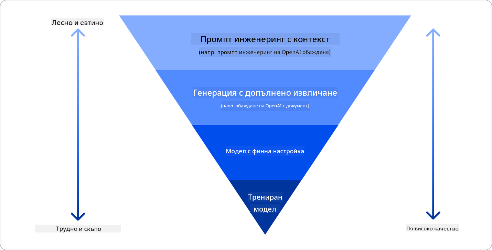

Източник на изображението: [Four Ways that Enterprises Deploy LLMs | Fiddler AI Blog](https://www.fiddler.ai/blog/four-ways-that-enterprises-deploy-llms?WT.mc_id=academic-105485-koreyst)

### Prompt Engineering с Контекст

Предварително обучените LLM работят много добре при общи задачи с естествен език, дори когато се извикват с кратък prompt, като изречение за допълване или въпрос – т.нар. „zero-shot“ обучение.

Въпреки това, колкото повече потребителят може да формулира заявката си с подробна молба и примери – Контекста – толкова по-точен и близък до очакванията на потребителя ще бъде отговорът. В този случай говорим за „one-shot“ обучение, ако prompt-ът съдържа само един пример, и „few-shot“ обучение, ако има няколко примера.
Prompt engineering с контекст е най-рентабилният подход за започване.

### Retrieval Augmented Generation (RAG)

LLM имат ограничението, че могат да използват само данните, с които са били обучени, за да генерират отговор. Това означава, че не знаят нищо за събития, настъпили след обучението им, и нямат достъп до непублична информация (като фирмени данни).
Това може да се преодолее чрез RAG – техника, която допълва prompt-а с външни данни под формата на части от документи, като се вземат предвид ограниченията за дължина на prompt-а. Това се поддържа от инструменти за векторни бази данни (като [Azure Vector Search](https://learn.microsoft.com/azure/search/vector-search-overview?WT.mc_id=academic-105485-koreyst)), които извличат полезните части от различни предварително дефинирани източници и ги добавят към контекста на prompt-а.

Тази техника е много полезна, когато бизнесът няма достатъчно данни, време или ресурси за фино настройване на LLM, но иска да подобри представянето при конкретна задача и да намали риска от измислици, т.е. изкривяване на реалността или вредно съдържание.

### Фино настроен модел

Финото настройване е процес, който използва трансферно обучение, за да „адаптира“ модела към конкретна задача или проблем. За разлика от few-shot обучението и RAG, това води до създаване на нов модел с обновени тегла и параметри. Необходимо е множество обучителни примери, състоящи се от вход (prompt) и съответния изход (completion).
Това е предпочитаният подход, ако:

- **Използвате фино настроени модели**. Бизнесът иска да използва по-малко мощни, но фино настроени модели (като embedding модели), което води до по-евтино и бързо решение.

- **Взимате предвид латентността**. Латентността е важна за конкретен случай на употреба, затова не е възможно да се използват много дълги prompt-ове или броят на примерите, от които моделът трябва да се учи, не се вписва в ограничението за дължина на prompt-а.

- **Искате да сте в крак с времето**. Бизнесът разполага с много качествени данни и етикети за ground truth, както и с ресурси за поддържане на тези данни актуални във времето.

### Обучен модел

Обучението на LLM от нулата е безспорно най-трудният и най-сложен подход, изискващ огромни количества данни, квалифицирани ресурси и подходяща изчислителна мощност. Тази опция трябва да се разглежда само ако бизнесът има специфичен за домейна случай на употреба и голям обем домейн-специфични данни.

## Проверка на знанията

Кой би бил добър подход за подобряване на резултатите от LLM completion?

1. Prompt engineering с контекст  
1. RAG  
1. Фино настроен модел

Отговор: 3, ако разполагате с време, ресурси и качествени данни, финото настройване е по-добрият вариант за поддържане на актуалност. Въпреки това, ако искате да подобрите нещата и нямате много време, първо си струва да обмислите RAG.

## 🚀 Предизвикателство

Прочетете повече за това как можете да [използвате RAG](https://learn.microsoft.com/azure/search/retrieval-augmented-generation-overview?WT.mc_id=academic-105485-koreyst) за вашия бизнес.

## Отлична работа, продължете с ученето

След като завършите този урок, разгледайте нашата [Generative AI Learning колекция](https://aka.ms/genai-collection?WT.mc_id=academic-105485-koreyst), за да продължите да развивате знанията си в областта на генеративния AI!

Отидете на Урок 3, където ще разгледаме как да [строим с генеративен AI отговорно](../03-using-generative-ai-responsibly/README.md?WT.mc_id=academic-105485-koreyst)!

**Отказ от отговорност**:  
Този документ е преведен с помощта на AI преводаческа услуга [Co-op Translator](https://github.com/Azure/co-op-translator). Въпреки че се стремим към точност, моля, имайте предвид, че автоматизираните преводи могат да съдържат грешки или неточности. Оригиналният документ на неговия език трябва да се счита за авторитетен източник. За критична информация се препоръчва професионален човешки превод. Ние не носим отговорност за каквито и да е недоразумения или неправилни тълкувания, произтичащи от използването на този превод.