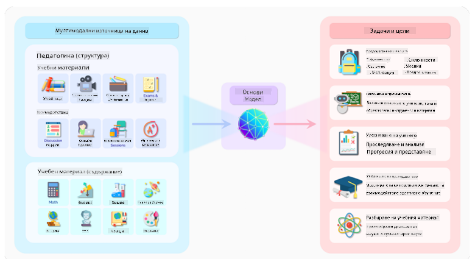
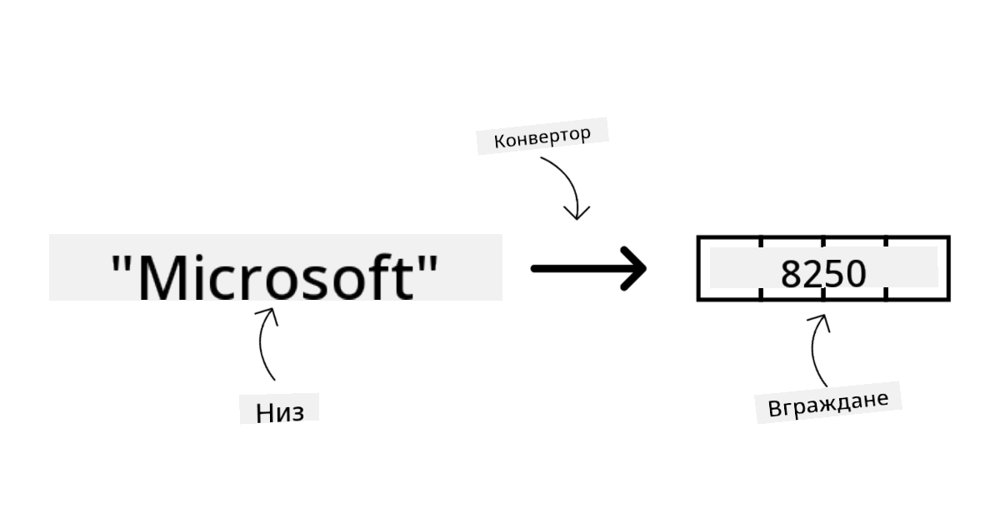
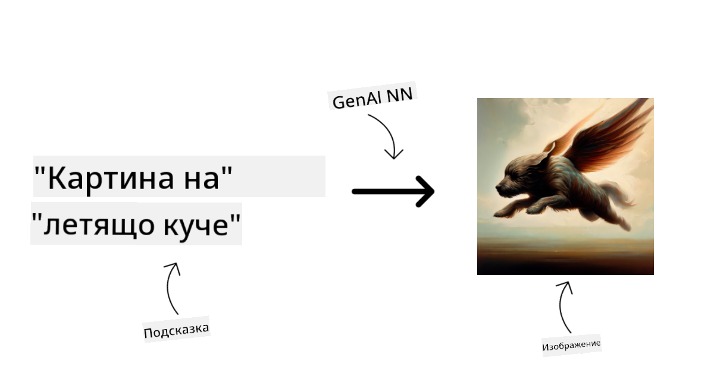
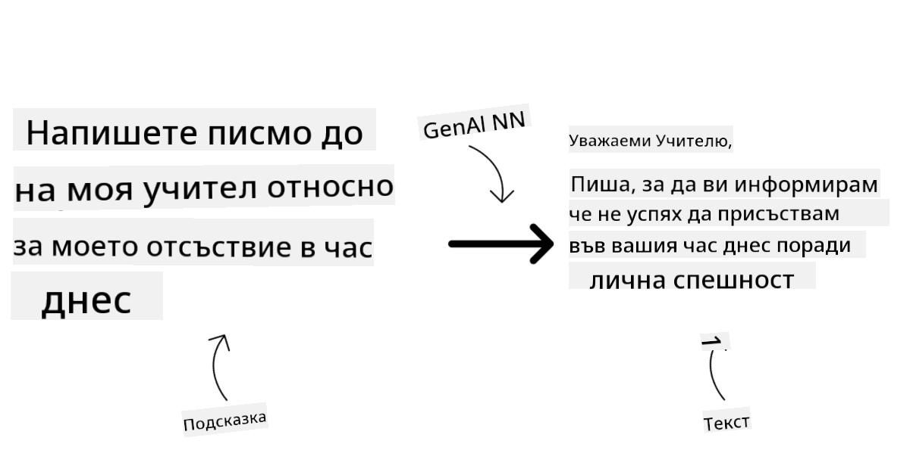
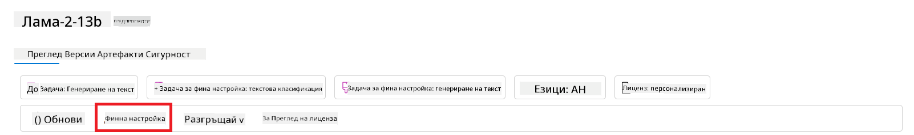
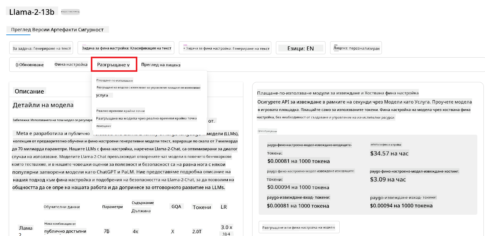

<!--
CO_OP_TRANSLATOR_METADATA:
{
  "original_hash": "e2f686f2eb794941761252ac5e8e090b",
  "translation_date": "2025-05-19T14:23:56+00:00",
  "source_file": "02-exploring-and-comparing-different-llms/README.md",
  "language_code": "bg"
}
-->
# Изследване и сравняване на различни LLMs

> _Кликнете върху изображението по-горе, за да гледате видео на този урок_

С предишния урок видяхме как Генеративният AI променя технологичния пейзаж, как работят Големите езикови модели (LLMs) и как един бизнес - като нашия стартъп - може да ги приложи към своите случаи на употреба и да расте! В тази глава ще се стремим да сравним и противопоставим различни видове големи езикови модели (LLMs), за да разберем техните предимства и недостатъци.

Следващата стъпка в пътуването на нашия стартъп е да изследваме текущия пейзаж на LLMs и да разберем кои са подходящи за нашия случай на употреба.

## Въведение

Този урок ще обхване:

- Различни видове LLMs в текущия пейзаж.
- Тестване, итерация и сравняване на различни модели за вашия случай на употреба в Azure.
- Как да внедрите LLM.

## Учебни цели

След завършване на този урок ще можете да:

- Изберете правилния модел за вашия случай на употреба.
- Разберете как да тествате, итеративно подобрявате и подобрявате производителността на вашия модел.
- Знаете как бизнесите внедряват модели.

## Разбиране на различни видове LLMs

LLMs могат да имат различни категоризации въз основа на тяхната архитектура, обучителни данни и случай на употреба. Разбирането на тези разлики ще помогне на нашия стартъп да избере правилния модел за сценария и да разбере как да тества, итеративно подобрява и подобрява производителността.

Има много различни видове LLM модели, вашият избор на модел зависи от това, за какво искате да ги използвате, вашите данни, колко сте готови да платите и още.

В зависимост от това дали искате да използвате моделите за текст, аудио, видео, генериране на изображения и т.н., може да изберете различен тип модел.

- **Разпознаване на аудио и реч**. За тази цел, модели от типа Whisper са чудесен избор, тъй като са универсални и насочени към разпознаване на реч. Те са обучени на разнообразно аудио и могат да изпълняват многоезично разпознаване на реч. Научете повече за [моделите от типа Whisper тук](https://platform.openai.com/docs/models/whisper?WT.mc_id=academic-105485-koreyst).

- **Генериране на изображения**. За генериране на изображения, DALL-E и Midjourney са два много добре познати избора. DALL-E се предлага от Azure OpenAI. [Прочетете повече за DALL-E тук](https://platform.openai.com/docs/models/dall-e?WT.mc_id=academic-105485-koreyst) и също в Глава 9 на тази учебна програма.

- **Генериране на текст**. Повечето модели са обучени за генериране на текст и имате голямо разнообразие от избори от GPT-3.5 до GPT-4. Те идват с различни разходи, като GPT-4 е най-скъпият. Струва си да разгледате [Azure OpenAI playground](https://oai.azure.com/portal/playground?WT.mc_id=academic-105485-koreyst), за да оцените кои модели най-добре отговарят на вашите нужди по отношение на способност и разходи.

- **Мултимодалност**. Ако искате да обработвате множество видове данни на вход и изход, може да се заинтересувате от модели като [gpt-4 turbo с визия или gpt-4o](https://learn.microsoft.com/azure/ai-services/openai/concepts/models#gpt-4-and-gpt-4-turbo-models?WT.mc_id=academic-105485-koreyst) - най-новите издания на OpenAI модели - които са способни да комбинират обработка на естествен език с визуално разбиране, позволявайки взаимодействия чрез мултимодални интерфейси.

Изборът на модел означава, че получавате някои основни възможности, които обаче може да не са достатъчни. Често имате фирмени специфични данни, които по някакъв начин трябва да съобщите на LLM. Има няколко различни избора как да подходите към това, повече за това в предстоящите секции.

### Фондационни модели срещу LLMs

Терминът Фондационен модел беше [въведен от изследователи от Станфорд](https://arxiv.org/abs/2108.07258?WT.mc_id=academic-105485-koreyst) и определен като AI модел, който следва някои критерии, като:

- **Те се обучават чрез несупервизирано или самосупервизирано обучение**, което означава, че се обучават на неетикетирани мултимодални данни и не изискват човешка анотация или етикетиране на данни за техния обучителен процес.
- **Те са много големи модели**, базирани на много дълбоки невронни мрежи, обучени на милиарди параметри.
- **Те обикновено са предназначени да служат като „основа“ за други модели**, което означава, че могат да се използват като отправна точка за изграждане на други модели върху тях, което може да се направи чрез фино настройване.

Източник на изображението: [Essential Guide to Foundation Models and Large Language Models | by Babar M Bhatti | Medium
](https://thebabar.medium.com/essential-guide-to-foundation-models-and-large-language-models-27dab58f7404)

За да изясним допълнително това разграничение, нека вземем ChatGPT като пример. За да се изгради първата версия на ChatGPT, моделът GPT-3.5 служи като фондационен модел. Това означава, че OpenAI използва някои специфични за чата данни, за да създаде настроена версия на GPT-3.5, която е специализирана в доброто изпълнение в разговорни сценарии, като чатботове.

Източник на изображението: [2108.07258.pdf (arxiv.org)](https://arxiv.org/pdf/2108.07258.pdf?WT.mc_id=academic-105485-koreyst)

### Отворен код срещу Собствени модели

Друг начин за категоризиране на LLMs е дали са с отворен код или собствени.

Моделите с отворен код са модели, които са направени достъпни за обществеността и могат да се използват от всеки. Те често се правят достъпни от компанията, която ги е създала, или от изследователската общност. Тези модели могат да бъдат инспектирани, модифицирани и персонализирани за различни случаи на употреба в LLMs. Въпреки това, те не винаги са оптимизирани за производствено използване и може да не са толкова производителни, колкото собствените модели. Освен това, финансирането за модели с отворен код може да бъде ограничено и те може да не се поддържат дългосрочно или да не се актуализират с най-новите изследвания. Примери за популярни модели с отворен код включват [Alpaca](https://crfm.stanford.edu/2023/03/13/alpaca.html?WT.mc_id=academic-105485-koreyst), [Bloom](https://huggingface.co/bigscience/bloom) и [LLaMA](https://llama.meta.com).

Собствените модели са модели, които са собственост на компания и не са направени достъпни за обществеността. Тези модели често са оптимизирани за производствено използване. Въпреки това, те не могат да бъдат инспектирани, модифицирани или персонализирани за различни случаи на употреба. Освен това, те не винаги са достъпни безплатно и може да изискват абонамент или плащане за използване. Също така, потребителите нямат контрол върху данните, които се използват за обучение на модела, което означава, че трябва да се доверят на собственика на модела да осигури ангажираност към защита на данните и отговорно използване на AI. Примери за популярни собствени модели включват [OpenAI модели](https://platform.openai.com/docs/models/overview?WT.mc_id=academic-105485-koreyst), [Google Bard](https://sapling.ai/llm/bard?WT.mc_id=academic-105485-koreyst) или [Claude 2](https://www.anthropic.com/index/claude-2?WT.mc_id=academic-105485-koreyst).

### Вграждане срещу Генериране на изображения срещу Генериране на текст и код

LLMs също могат да бъдат категоризирани по изхода, който генерират.

Вгражданията са набор от модели, които могат да конвертират текст в числова форма, наречена вграждане, която е числово представяне на входния текст. Вгражданията улесняват машините да разбират връзките между думи или изречения и могат да бъдат използвани като входове от други модели, като модели за класификация или клъстеризация, които имат по-добра производителност върху числови данни. Моделите за вграждане често се използват за преносно обучение, където моделът се изгражда за заместителна задача, за която има изобилие от данни, и след това тежестите на модела (вгражданията) се използват повторно за други задачи. Пример за тази категория е [OpenAI вграждания](https://platform.openai.com/docs/models/embeddings?WT.mc_id=academic-105485-koreyst).

Моделите за генериране на изображения са модели, които генерират изображения. Тези модели често се използват за редактиране на изображения, синтез на изображения и превод на изображения. Моделите за генериране на изображения често се обучават на големи набори от данни с изображения, като [LAION-5B](https://laion.ai/blog/laion-5b/?WT.mc_id=academic-105485-koreyst), и могат да се използват за генериране на нови изображения или за редактиране на съществуващи изображения с техники като inpainting, супер-резолюция и оцветяване. Примери включват [DALL-E-3](https://openai.com/dall-e-3?WT.mc_id=academic-105485-koreyst) и [Stable Diffusion модели](https://github.com/Stability-AI/StableDiffusion?WT.mc_id=academic-105485-koreyst).

Моделите за генериране на текст и код са модели, които генерират текст или код. Тези модели често се използват за обобщение на текст, превод и отговаряне на въпроси. Моделите за генериране на текст често се обучават на големи набори от данни с текст, като [BookCorpus](https://www.cv-foundation.org/openaccess/content_iccv_2015/html/Zhu_Aligning_Books_and_ICCV_2015_paper.html?WT.mc_id=academic-105485-koreyst), и могат да се използват за генериране на нов текст или за отговаряне на въпроси. Моделите за генериране на код, като [CodeParrot](https://huggingface.co/codeparrot?WT.mc_id=academic-105485-koreyst), често се обучават на големи набори от данни с код, като GitHub, и могат да се използват за генериране на нов код или за коригиране на грешки в съществуващ код.

### Енкодер-Декодер срещу Само декодер

За да говорим за различните типове архитектури на LLMs, нека използваме аналогия.

Представете си, че вашият мениджър ви е дал задача да напишете викторина за студентите. Имате двама колеги; единият отговаря за създаването на съдържанието, а другият за прегледа му.

Създателят на съдържание е като модел само декодер, те могат да погледнат темата и да видят какво вече сте написали и след това могат да напишат курс въз основа на това. Те са много добри в писането на ангажиращо и информативно съдържание, но не са много добри в разбирането на темата и учебните цели. Някои примери за модели само декодер са GPT семейството модели, като GPT-3.

Рецензентът е като модел само енкодер, те поглеждат написания курс и отговорите, забелязвайки връзката между тях и разбирайки контекста, но не са добри в генерирането на съдържание. Пример за модел само енкодер би бил BERT.

Представете си, че можем да имаме и някой, който може да създава и преглежда викторината, това е модел енкодер-декодер. Някои примери биха били BART и T5.

### Услуга срещу Модел

Сега, нека поговорим за разликата между услуга и модел. Услугата е продукт, който се предлага от доставчик на облачни услуги и често е комбинация от модели, данни и други компоненти. Моделът е основният компонент на услугата и често е фондационен модел, като LLM.

Услугите често са оптимизирани за производствено използване и често са по-лесни за използване от моделите, чрез графичен потребителски интерфейс. Въпреки това, услугите не винаги са достъпни безплатно и може да изискват абонамент или плащане за използване, в замяна на използването на оборудването и ресурсите на собственика на услугата, оптимизиране на разходите и лесно мащабиране. Пример за услуга е [Azure OpenAI Service](https://learn.microsoft.com/azure/ai-services/openai/overview?WT.mc_id=academic-105485-koreyst), която предлага план за плащане според използването, което означава, че потребителите се таксуват пропорционално на това колко използват услугата. Също така, Azure OpenAI Service предлага сигурност на ниво предприятие и рамка за отговорно използване на AI върху възможностите на моделите.

Моделите са просто невронната мрежа, с параметрите, тежестите и други. Позволявайки на компаниите да работят локално, обаче, ще трябва да закупят оборудване, да изградят структура за мащабиране и да закупят лиценз или да използват модел с отворен код. Модел като LLaMA е достъпен за използване, изисквайки изчислителна мощност за работа с модела.

## Как да тествате и итеративно подобрявате с различни модели, за да разберете производителността в Azure

След като нашият екип е изследвал текущия пейзаж на LLMs и е идентифицирал някои добри кандидати за техните сценарии, следващата стъпка е да ги тестват върху своите данни и върху тяхната работна натовареност. Това е итеративен процес, извършван чрез експерименти и измервания.
Повечето от моделите, които споменахме в предишните параграфи (модели на OpenAI, модели с отворен код като Llama2 и трансформатори на Hugging Face), са налични в [Каталога на модели](https://learn.microsoft.com/azure/ai-studio/how-to/model-catalog-overview?WT.mc_id=academic-105485-koreyst) в [Azure AI Studio](https://ai.azure.com/?WT.mc_id=academic-105485-koreyst).

[Azure AI Studio](https://learn.microsoft.com/azure/ai-studio/what-is-ai-studio?WT.mc_id=academic-
- Сравнете бенчмарковете на модели и набори от данни, налични в индустрията, за да оцените кой от тях отговаря на бизнес сценариите, чрез панела [Model Benchmarks](https://learn.microsoft.com/azure/ai-studio/how-to/model-benchmarks?WT.mc_id=academic-105485-koreyst).

- Фино настройте модела върху персонализирани тренировъчни данни, за да подобрите производителността му в специфично натоварване, използвайки възможностите за експериментиране и проследяване на Azure AI Studio.

- Разгърнете оригиналния предварително обучен модел или фино настроената версия към отдалечена реална инференция - управлявана изчислителна мощност - или сървърлесс API крайна точка - [плащане при използване](https://learn.microsoft.com/azure/ai-studio/how-to/model-catalog-overview#model-deployment-managed-compute-and-serverless-api-pay-as-you-go?WT.mc_id=academic-105485-koreyst) - за да позволите приложенията да го използват.

> [!NOTE]
> Не всички модели в каталога са налични за фина настройка и/или разгръщане с плащане при използване. Проверете картата на модела за подробности относно възможностите и ограниченията на модела.

## Подобряване на резултатите от LLM

Разгледахме с нашия стартъп екип различни видове LLM и облачна платформа (Azure Machine Learning), която ни позволява да сравняваме различни модели, да ги оценяваме върху тестови данни, да подобряваме производителността и да ги разгръщаме на инференционни крайни точки.

Но кога трябва да обмислят фина настройка на модел, вместо да използват предварително обучен? Има ли други подходи за подобряване на производителността на модела при специфични натоварвания?

Има няколко подхода, които бизнесът може да използва, за да получи резултатите, от които се нуждае от LLM. Можете да изберете различни типове модели с различни степени на обучение при разгръщане на LLM в продукция, с различни нива на сложност, цена и качество. Ето някои различни подходи:

- **Инженеринг на подканата с контекст**. Идеята е да предоставите достатъчно контекст, когато подканвате, за да гарантирате, че получавате необходимите отговори.

- **Извличане на данни с допълнено генериране, RAG**. Вашите данни могат да съществуват в база данни или уеб крайна точка, например, за да гарантирате, че тези данни или част от тях са включени в момента на подканата, можете да извлечете релевантните данни и да ги направите част от подканата на потребителя.

- **Фино настроен модел**. Тук сте обучили модела допълнително върху вашите собствени данни, което води до по-точен и отзивчив модел, но може да бъде скъпо.

Източник на изображението: [Четири начина, по които предприятията разгръщат LLMs | Fiddler AI Blog](https://www.fiddler.ai/blog/four-ways-that-enterprises-deploy-llms?WT.mc_id=academic-105485-koreyst)

### Инженеринг на подканата с контекст

Предварително обучените LLMs работят много добре върху обобщени задачи за естествен език, дори когато ги извиквате с кратка подканва, като например изречение за допълване или въпрос – така нареченото "zero-shot" обучение.

Въпреки това, колкото повече потребителят може да формулира своето запитване, с подробно искане и примери – Контекстът – толкова по-точен и близък до очакванията на потребителя ще бъде отговорът. В този случай говорим за "one-shot" обучение, ако подканата включва само един пример и "few-shot" обучение, ако включва множество примери. Инженерингът на подканата с контекст е най-икономичният подход за започване.

### Извличане на данни с допълнено генериране (RAG)

LLMs имат ограничение, че могат да използват само данните, които са били използвани по време на тяхното обучение за генериране на отговор. Това означава, че те не знаят нищо за фактите, които са се случили след тяхното обучение, и не могат да получат достъп до непублична информация (като данни на компанията). Това може да бъде преодоляно чрез RAG, техника, която допълва подканата с външни данни под формата на части от документи, като се вземат предвид ограниченията на дължината на подканата. Това се поддържа от инструменти за векторни бази данни (като [Azure Vector Search](https://learn.microsoft.com/azure/search/vector-search-overview?WT.mc_id=academic-105485-koreyst)), които извличат полезните части от различни предварително определени източници на данни и ги добавят към контекста на подканата.

Тази техника е много полезна, когато бизнесът няма достатъчно данни, време или ресурси за фина настройка на LLM, но все пак желае да подобри производителността при специфично натоварване и да намали рисковете от фабрикации, т.е. мистификация на реалността или вредно съдържание.

### Фино настроен модел

Фината настройка е процес, който използва трансферно обучение за "адаптиране" на модела към низходяща задача или за решаване на специфичен проблем. Различно от few-shot обучение и RAG, това води до генериране на нов модел с актуализирани тегла и пристрастия. Изисква набор от тренировъчни примери, състоящи се от един вход (подканата) и свързания му изход (завършването). Това би бил предпочитаният подход, ако:

- **Използване на фино настроени модели**. Бизнесът би искал да използва фино настроени по-малко способни модели (като модели за вграждане), вместо високопроизводителни модели, което води до по-икономично и бързо решение.

- **Разглеждане на латентността**. Латентността е важна за специфичен случай на използване, така че не е възможно да се използват много дълги подканви или броят на примерите, които трябва да бъдат научени от модела, не се вписва в ограничението на дължината на подканата.

- **Поддържане на актуалност**. Бизнесът има много висококачествени данни и етикети на истината и ресурсите, необходими за поддържане на тези данни актуални във времето.

### Обучен модел

Обучението на LLM от нулата е без съмнение най-трудният и най-сложният подход за приемане, изискващ огромни количества данни, квалифицирани ресурси и подходяща изчислителна мощност. Тази опция трябва да се разглежда само в сценарий, в който бизнесът има специфичен за домейн случай на използване и голямо количество данни, свързани с домейна.

## Проверка на знанията

Какъв би могъл да бъде добър подход за подобряване на резултатите от LLM?

1. Инженеринг на подканата с контекст
1. RAG
1. Фино настроен модел

A:3, ако имате време и ресурси и висококачествени данни, фината настройка е по-добрият вариант за поддържане на актуалност. Въпреки това, ако търсите подобрения и ви липсва време, си струва първо да разгледате RAG.

## 🚀 Предизвикателство

Научете повече за това как можете да [използвате RAG](https://learn.microsoft.com/azure/search/retrieval-augmented-generation-overview?WT.mc_id=academic-105485-koreyst) за вашия бизнес.

## Страхотна работа, продължете да учите

След като завършите този урок, разгледайте нашата [колекция за обучение по генеративен AI](https://aka.ms/genai-collection?WT.mc_id=academic-105485-koreyst), за да продължите да развивате знанията си за генеративния AI!

Отидете на Урок 3, където ще разгледаме как да [изграждаме с генеративен AI отговорно](../03-using-generative-ai-responsibly/README.md?WT.mc_id=academic-105485-koreyst)!

**Отказ от отговорност**:  
Този документ е преведен с помощта на AI услуга за превод [Co-op Translator](https://github.com/Azure/co-op-translator). Въпреки че се стремим към точност, моля, имайте предвид, че автоматизираните преводи може да съдържат грешки или неточности. Оригиналният документ на неговия роден език трябва да се счита за авторитетен източник. За критична информация се препоръчва професионален човешки превод. Не носим отговорност за недоразумения или погрешни интерпретации, произтичащи от използването на този превод.