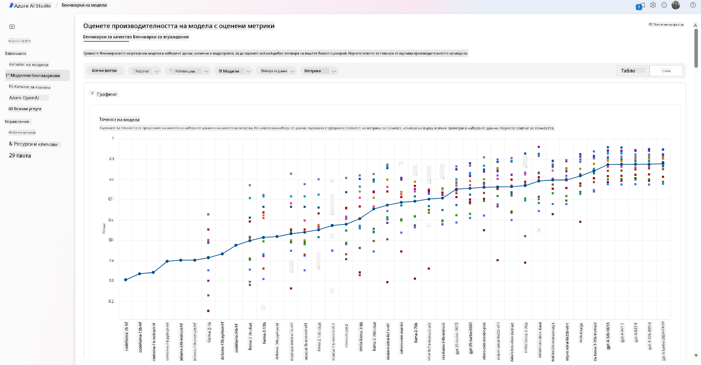
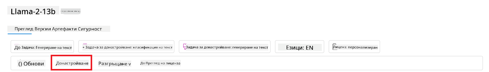
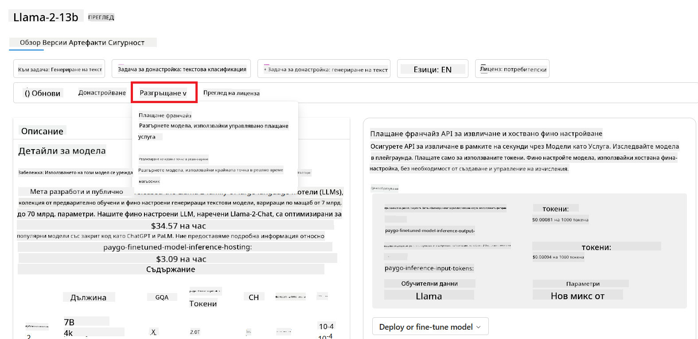
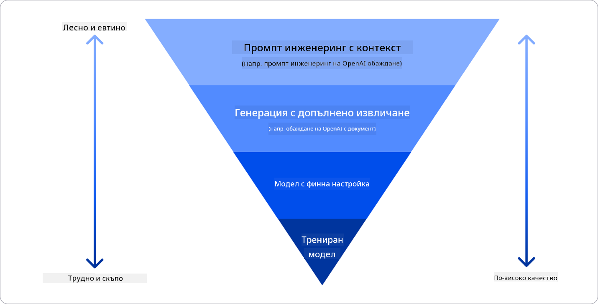

<!--
CO_OP_TRANSLATOR_METADATA:
{
  "original_hash": "e2f686f2eb794941761252ac5e8e090b",
  "translation_date": "2025-06-25T11:01:46+00:00",
  "source_file": "02-exploring-and-comparing-different-llms/README.md",
  "language_code": "bg"
}
-->
# Изследване и сравнение на различни LLMs

> _Кликнете върху изображението по-горе, за да гледате видео на този урок_

С предишния урок видяхме как Генеративният AI променя технологичния пейзаж, как работят Големите езикови модели (LLMs) и как бизнесът - като нашия стартъп - може да ги приложи към своите случаи на употреба и да расте! В тази глава ще сравним и контрастираме различни видове големи езикови модели (LLMs), за да разберем техните плюсове и минуси.

Следващата стъпка в пътуването на нашия стартъп е изследването на текущия пейзаж на LLMs и разбирането кои са подходящи за нашия случай на употреба.

## Въведение

Този урок ще покрие:

- Различни видове LLMs в текущия пейзаж.
- Тестване, итерация и сравнение на различни модели за вашия случай на употреба в Azure.
- Как да разположите LLM.

## Учебни цели

След завършване на този урок, ще можете да:

- Изберете правилния модел за вашия случай на употреба.
- Разберете как да тествате, итеративно подобрявате и усъвършенствате производителността на вашия модел.
- Знаете как бизнесите разполагат модели.

## Разбиране на различни видове LLMs

LLMs могат да имат множество категоризации въз основа на тяхната архитектура, обучителни данни и случай на употреба. Разбирането на тези разлики ще помогне на нашия стартъп да избере правилния модел за сценария и да разбере как да тества, итеративно подобрява и усъвършенства производителността.

Има много различни видове LLM модели, вашият избор на модел зависи от това за какво възнамерявате да ги използвате, вашите данни, колко сте готови да платите и други фактори.

В зависимост от това дали възнамерявате да използвате моделите за текст, аудио, видео, генериране на изображения и т.н., може да изберете различен тип модел.

- **Аудио и разпознаване на реч**. За тази цел, моделите от типа Whisper са отличен избор, тъй като са универсални и насочени към разпознаване на реч. Те са обучени на разнообразно аудио и могат да изпълняват многоезично разпознаване на реч. Научете повече за [моделите от типа Whisper тук](https://platform.openai.com/docs/models/whisper?WT.mc_id=academic-105485-koreyst).

- **Генериране на изображения**. За генериране на изображения, DALL-E и Midjourney са два много известни избора. DALL-E се предлага от Azure OpenAI. [Прочетете повече за DALL-E тук](https://platform.openai.com/docs/models/dall-e?WT.mc_id=academic-105485-koreyst) и също в Глава 9 от тази учебна програма.

- **Генериране на текст**. Повечето модели са обучени за генериране на текст и имате голямо разнообразие от избори от GPT-3.5 до GPT-4. Те идват на различни цени, като GPT-4 е най-скъпият. Струва си да разгледате [игралната площадка на Azure OpenAI](https://oai.azure.com/portal/playground?WT.mc_id=academic-105485-koreyst), за да оцените кои модели най-добре отговарят на вашите нужди по отношение на възможности и цена.

- **Мултимодалност**. Ако искате да обработвате множество видове данни във входа и изхода, може да искате да разгледате модели като [gpt-4 turbo с визия или gpt-4o](https://learn.microsoft.com/azure/ai-services/openai/concepts/models#gpt-4-and-gpt-4-turbo-models?WT.mc_id=academic-105485-koreyst) - последните версии на OpenAI модели - които са способни да комбинират обработка на естествен език с визуално разбиране, позволявайки взаимодействия чрез мултимодални интерфейси.

Избирането на модел означава, че получавате някои основни възможности, които обаче може да не са достатъчни. Често имате специфични за компанията данни, които по някакъв начин трябва да предадете на LLM. Има няколко различни избора за това как да подходите към това, повече за това в следващите раздели.

### Фондационни модели срещу LLMs

Терминът Фондационен модел беше [въведен от изследователи от Станфорд](https://arxiv.org/abs/2108.07258?WT.mc_id=academic-105485-koreyst) и определен като AI модел, който следва някои критерии, като:

- **Те са обучени с неуправляемо обучение или самоуправляемо обучение**, което означава, че са обучени на неетикетирани мултимодални данни и не изискват човешка анотация или етикетиране на данни за своя обучителен процес.
- **Те са много големи модели**, базирани на много дълбоки невронни мрежи, обучени на милиарди параметри.
- **Те обикновено са предназначени да служат като ‘основа’ за други модели**, което означава, че могат да се използват като начална точка за изграждане на други модели върху тях, което може да се направи чрез фино настройване.

За да изясним допълнително това разграничение, нека вземем ChatGPT като пример. За да се изгради първата версия на ChatGPT, моделът GPT-3.5 служи като фондационен модел. Това означава, че OpenAI използва някои данни, специфични за чат, за да създаде настроена версия на GPT-3.5, която е специализирана в доброто изпълнение в разговорни сценарии, като чатботове.

### Отворени източници срещу Собствени модели

Друг начин за категоризиране на LLMs е дали са с отворен код или собствени.

Моделите с отворен код са модели, които са направени достъпни за обществеността и могат да бъдат използвани от всеки. Те често се предоставят от компанията, която ги е създала, или от изследователската общност. Тези модели могат да бъдат инспектирани, модифицирани и персонализирани за различните случаи на употреба в LLMs. Въпреки това, те не винаги са оптимизирани за производствена употреба и може да не са толкова производителни, колкото собствените модели. Освен това, финансирането за модели с отворен код може да бъде ограничено и те може да не се поддържат дългосрочно или да не бъдат актуализирани с най-новите изследвания. Примери за популярни модели с отворен код включват [Alpaca](https://crfm.stanford.edu/2023/03/13/alpaca.html?WT.mc_id=academic-105485-koreyst), [Bloom](https://huggingface.co/bigscience/bloom) и [LLaMA](https://llama.meta.com).

Собствените модели са модели, които са собственост на компания и не са достъпни за обществеността. Тези модели често са оптимизирани за производствена употреба. Въпреки това, те не могат да бъдат инспектирани, модифицирани или персонализирани за различни случаи на употреба. Освен това, те не винаги са достъпни безплатно и може да изискват абонамент или плащане за използване. Също така, потребителите нямат контрол върху данните, които се използват за обучение на модела, което означава, че трябва да се доверят на собственика на модела да осигури ангажимент към защита на данните и отговорно използване на AI. Примери за популярни собствени модели включват [OpenAI модели](https://platform.openai.com/docs/models/overview?WT.mc_id=academic-105485-koreyst), [Google Bard](https://sapling.ai/llm/bard?WT.mc_id=academic-105485-koreyst) или [Claude 2](https://www.anthropic.com/index/claude-2?WT.mc_id=academic-105485-koreyst).

### Вграждане срещу Генериране на изображения срещу Генериране на текст и код

LLMs могат също да бъдат категоризирани според изхода, който генерират.

Вгражданията са набор от модели, които могат да конвертират текст в числова форма, наречена вграждане, което е числено представяне на входния текст. Вгражданията улесняват машините да разбират връзките между думите или изреченията и могат да бъдат консумирани като входни данни от други модели, като модели за класификация или модели за клъстеризация, които имат по-добра производителност върху числени данни. Моделите за вграждане често се използват за преносимо обучение, където моделът е изграден за сурогатна задача, за която има изобилие от данни, и след това тежестите на модела (вгражданията) се използват повторно за други задачи надолу по веригата. Пример за тази категория е [OpenAI вграждания](https://platform.openai.com/docs/models/embeddings?WT.mc_id=academic-105485-koreyst).

Моделите за генериране на изображения са модели, които генерират изображения. Тези модели често се използват за редактиране на изображения, синтез на изображения и превод на изображения. Моделите за генериране на изображения често се обучават на големи набори от данни с изображения, като [LAION-5B](https://laion.ai/blog/laion-5b/?WT.mc_id=academic-105485-koreyst), и могат да се използват за генериране на нови изображения или за редактиране на съществуващи изображения с техники за вътрешно рисуване, супер-резолюция и оцветяване. Примери включват [DALL-E-3](https://openai.com/dall-e-3?WT.mc_id=academic-105485-koreyst) и [Stable Diffusion модели](https://github.com/Stability-AI/StableDiffusion?WT.mc_id=academic-105485-koreyst).

Моделите за генериране на текст и код са модели, които генерират текст или код. Тези модели често се използват за обобщаване на текст, превод и отговаряне на въпроси. Моделите за генериране на текст често се обучават на големи набори от данни с текст, като [BookCorpus](https://www.cv-foundation.org/openaccess/content_iccv_2015/html/Zhu_Aligning_Books_and_ICCV_2015_paper.html?WT.mc_id=academic-105485-koreyst), и могат да се използват за генериране на нов текст или за отговаряне на въпроси. Моделите за генериране на код, като [CodeParrot](https://huggingface.co/codeparrot?WT.mc_id=academic-105485-koreyst), често се обучават на големи набори от данни с код, като GitHub, и могат да се използват за генериране на нов код или за отстраняване на грешки в съществуващ код.

### Енкодер-Декодер срещу Само Декодер

За да говорим за различните видове архитектури на LLMs, нека използваме аналогия.

Представете си, че вашият мениджър ви даде задача да напишете тест за студентите. Имате двама колеги; един отговаря за създаването на съдържание, а другият отговаря за прегледа им.

Създателят на съдържание е като модел Само Декодер, те могат да погледнат темата и да видят какво вече сте написали и след това могат да напишат курс въз основа на това. Те са много добри в писането на ангажиращо и информативно съдържание, но не са много добри в разбирането на темата и учебните цели. Някои примери за модели Само Декодер са моделите от семейството на GPT, като GPT-3.

Рецензентът е като модел Само Енкодер, те гледат курса, написан и отговорите, забелязвайки връзката между тях и разбират контекста, но не са добри в генерирането на съдържание. Пример за модел Само Енкодер би бил BERT.

Представете си, че можем да имаме и някой, който може да създаде и прегледа теста, това е модел Енкодер-Декодер. Някои примери биха били BART и T5.

### Услуга срещу Модел

Сега, нека поговорим за разликата между услуга и модел. Услугата е продукт, който се предлага от доставчик на облачни услуги и често е комбинация от модели, данни и други компоненти. Моделът е основният компонент на услугата и често е фондационен модел, като LLM.

Услугите често са оптимизирани за производствена употреба и често са по-лесни за използване от модели чрез графичен потребителски интерфейс. Въпреки това, услугите не винаги са достъпни безплатно и може да изискват абонамент или плащане за използване, в замяна на използването на оборудването и ресурсите на собственика на услугата, оптимизиране на разходите и лесно мащабиране. Пример за услуга е [Azure OpenAI Service](https://learn.microsoft.com/azure/ai-services/openai/overview?WT.mc_id=academic-105485-koreyst), която предлага план за плащане при използване, което означава, че потребителите се таксуват пропорционално на това колко използват услугата. Също така, Azure OpenAI Service предлага сигурност на ниво предприятие и отговорна AI рамка върху възможностите на моделите.

Моделите са просто невронната мрежа с параметрите, тежестите и други. Това позволява на компаниите да работят локално, но би било необходимо да купят оборудване, да изградят структура за мащабиране и да закупят лиценз или да използват модел с отворен код. Модел като LLaMA е достъпен за използване, изискващ изчислителна мощност за изпълнение на модела.

## Как да тествате и итеративно подобрявате с различни модели, за да разберете производителността в Azure

След като нашият екип е изследвал текущия пейзаж на LLMs и е идентифицирал някои добри кандидати за своите сценарии, следващата стъпка е да ги тества върху своите данни и върху своята работна натовареност. Това е итеративен процес, извършван чрез експерименти и измервания. Повечето от моделите, които споменахме в предишните параграфи (модели на OpenAI, модели с отворен код като Llama2 и трансформатори на Hugging Face) са налични в [Каталога на моделите](https://learn.microsoft.com/azure/ai-studio/how-to/model-catalog-overview?WT.mc_id=academic-105485-koreyst) в [Azure AI Studio](https://ai.azure.com/?WT.mc_id=academic-105485-koreyst).

[Azure AI Studio](https://learn.microsoft.com/azure/ai-studio/what-is-ai-studio?WT.mc_id=academic-105485-koreyst) е облачна платформа, предназначена за разработчици за изграждане на приложения с генеративен AI и управление на целия жизнен цикъл на разработката - от експериментиране до оценка - като комбинира всички услуги на Azure AI в един хъб с удобен графичен потребителски интерфейс. Каталогът на моделите в Azure AI Studio позволява на потребителя да:

- Намери фондационния модел от интерес в каталога - независимо дали е собствен или с отворен код, като филтрира по задача, лиценз или име. За подобряване на търсенето, моделите са организирани в колекции, като колекцията на Azure OpenAI, колекцията на Hugging Face и други.

- Прегледа картата на модела, включително подробно описание на предназначената употреба и обучителните данни, примерен код и резултати от оценка на вътрешната библиотека за оценки.
- Сравнете бенчмарковете между модели и набори от данни, налични в индустрията, за да оцените кой от тях отговаря на бизнес сценариите, чрез панела [Model Benchmarks](https://learn.microsoft.com/azure/ai-studio/how-to/model-benchmarks?WT.mc_id=academic-105485-koreyst).

- Направете фино настройване на модела върху персонализирани данни за обучение, за да подобрите производителността на модела в специфична работна натовареност, използвайки възможностите за експериментиране и проследяване на Azure AI Studio.

- Разгърнете оригиналния предварително обучен модел или финално настроената версия за отдалечено реално време инференция - управлявано изчисление - или безсървисна API крайна точка - [pay-as-you-go](https://learn.microsoft.com/azure/ai-studio/how-to/model-catalog-overview#model-deployment-managed-compute-and-serverless-api-pay-as-you-go?WT.mc_id=academic-105485-koreyst) - за да позволите приложенията да го използват.

> [!NOTE]
> Не всички модели в каталога са налични за фино настройване и/или разгръщане с плащане според използването. Проверете картата на модела за подробности относно възможностите и ограниченията на модела.

## Подобряване на резултатите от LLM

Изследвахме с нашия стартъп екип различни видове LLM и облачна платформа (Azure Machine Learning), която ни позволява да сравняваме различни модели, да ги оценяваме на тестови данни, да подобряваме производителността и да ги разгръщаме на крайни точки за инференция.

Но кога трябва да се обмисли фино настройване на модел, вместо да се използва предварително обучен? Има ли други подходи за подобряване на производителността на модела в специфични работни натоварености?

Съществуват няколко подхода, които бизнесът може да използва, за да получи резултатите, от които се нуждае от LLM. Можете да изберете различни типове модели с различни степени на обучение при разгръщане на LLM в продукция, с различни нива на сложност, цена и качество. Ето някои различни подходи:

- **Инженеринг на подканата с контекст**. Идеята е да се предостави достатъчно контекст, когато подканяте, за да се гарантира, че получавате отговорите, от които се нуждаете.

- **Допълнено извличане и генериране, RAG**. Вашите данни може да съществуват в база данни или уеб крайна точка например, за да се гарантира, че тези данни или част от тях са включени по време на подканата, можете да извлечете съответните данни и да ги направите част от подканата на потребителя.

- **Финално настроен модел**. Тук сте обучили модела допълнително върху вашите собствени данни, което води до това моделът да бъде по-точен и отзивчив към вашите нужди, но може да бъде скъпо.

Източник на изображението: [Four Ways that Enterprises Deploy LLMs | Fiddler AI Blog](https://www.fiddler.ai/blog/four-ways-that-enterprises-deploy-llms?WT.mc_id=academic-105485-koreyst)

### Инженеринг на подканата с контекст

Предварително обучените LLM работят много добре върху обобщени задачи за естествен език, дори когато се извикват с кратка подканата, като например изречение за завършване или въпрос – така нареченото „zero-shot“ обучение.

Въпреки това, колкото повече потребителят може да формулира своето запитване, с подробна заявка и примери – Контекстът – толкова по-точен и по-близък до очакванията на потребителя ще бъде отговорът. В този случай говорим за „one-shot“ обучение, ако подканата включва само един пример и „few shot learning“, ако включва множество примери.
Инженерингът на подканата с контекст е най-рентабилният подход за започване.

### Допълнено извличане и генериране (RAG)

LLM имат ограничението, че могат да използват само данните, които са били използвани по време на тяхното обучение, за да генерират отговор. Това означава, че те не знаят нищо за фактите, които са се случили след процеса на тяхното обучение, и не могат да достъпят непублична информация (като данни на компанията).
Това може да бъде преодоляно чрез RAG, техника, която допълва подканата с външни данни под формата на части от документи, като се вземат предвид ограниченията за дължина на подканата. Това се поддържа от инструменти за векторни бази данни (като [Azure Vector Search](https://learn.microsoft.com/azure/search/vector-search-overview?WT.mc_id=academic-105485-koreyst)), които извличат полезните части от различни предварително определени източници на данни и ги добавят към контекста на подканата.

Тази техника е много полезна, когато бизнесът няма достатъчно данни, време или ресурси да финално настрои LLM, но все пак желае да подобри производителността в специфична работна натовареност и да намали рисковете от фабрикации, т.е. изкривяване на реалността или вредно съдържание.

### Финално настроен модел

Финалното настройване е процес, който използва трансферно обучение, за да „адаптира“ модела към задача за надолу по веригата или за решаване на специфичен проблем. За разлика от few-shot learning и RAG, то води до създаване на нов модел, с обновени тегла и пристрастия. Изисква набор от примери за обучение, състоящи се от един вход (подканата) и неговия свързан изход (завършването).
Това би било предпочитаният подход, ако:

- **Използване на финално настроени модели**. Бизнесът би искал да използва финално настроени по-малко способни модели (като модели за вграждане), вместо модели с висока производителност, което води до по-рентабилно и бързо решение.

- **Вземане предвид на латентността**. Латентността е важна за специфичен случай на използване, така че не е възможно да се използват много дълги подканти или броят на примерите, които трябва да бъдат научени от модела, не съответства на ограничението за дължина на подканата.

- **Поддържане на актуалност**. Бизнесът разполага с много висококачествени данни и етикети на истинската стойност и ресурсите, необходими за поддържане на тези данни актуални във времето.

### Обучен модел

Обучението на LLM от нулата без съмнение е най-трудният и най-сложният подход за приемане, изискващ огромни количества данни, квалифицирани ресурси и подходяща изчислителна мощност. Тази опция трябва да се обмисли само в сценарий, когато бизнесът има случай на използване, специфичен за домейна, и голямо количество данни, центрирани върху домейна.

## Проверка на знанията

Какъв може да бъде добър подход за подобряване на резултатите от завършване на LLM?

1. Инженеринг на подканта с контекст
1. RAG
1. Финално настроен модел

A:3, ако имате време и ресурси и висококачествени данни, финалното настройване е по-добрият вариант за поддържане на актуалност. Въпреки това, ако се стремите към подобрение и ви липсва време, си струва първо да обмислите RAG.

## 🚀 Предизвикателство

Прочетете повече за това как можете [да използвате RAG](https://learn.microsoft.com/azure/search/retrieval-augmented-generation-overview?WT.mc_id=academic-105485-koreyst) за вашия бизнес.

## Отлична работа, продължете обучението си

След завършване на този урок, разгледайте нашата [Колекция за обучение по генеративен AI](https://aka.ms/genai-collection?WT.mc_id=academic-105485-koreyst), за да продължите да повишавате знанията си за генеративен AI!

Преминете към Урок 3, където ще разгледаме как да [създаваме с генеративен AI отговорно](../03-using-generative-ai-responsibly/README.md?WT.mc_id=academic-105485-koreyst)!

**Отказ от отговорност**:  
Този документ е преведен с помощта на AI услуга за превод [Co-op Translator](https://github.com/Azure/co-op-translator). Докато се стремим към точност, моля, имайте предвид, че автоматизираните преводи може да съдържат грешки или неточности. Оригиналният документ на неговия роден език трябва да се счита за авторитетен източник. За критична информация се препоръчва професионален човешки превод. Ние не носим отговорност за каквито и да е недоразумения или погрешни интерпретации, произтичащи от използването на този превод.