# Изследване и сравнение на различни големи езикови модели  

[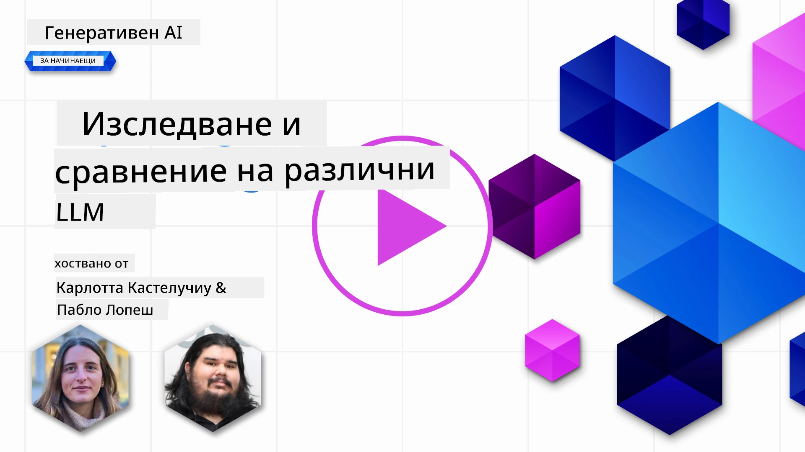](https://youtu.be/KIRUeDKscfI?si=8BHX1zvwzQBn-PlK)  

> _Кликнете върху изображението по-горе, за да гледате видео на този урок_  

С предишния урок видяхме как генеративният изкуствен интелект променя технологичния пейзаж, как работят големите езикови модели (LLMs) и как бизнес - като нашия стартъп - може да ги прилага към своите случаи на употреба и да расте! В тази глава разглеждаме сравнение и противопоставяне на различни типове големи езикови модели, за да разберем техните предимства и недостатъци.  

Следващата стъпка в пътя на нашия стартъп е да изследваме текущия пейзаж на LLM и да разберем кои са подходящи за нашия случай на употреба.  

## Въведение  

Този урок ще обхване:  

- Различни типове LLM в текущия пейзаж.  
- Тестване, итерации и сравнение на различни модели за вашия случай на употреба в Azure.  
- Как да разгърнете LLM.  

## Цели на обучението  

След завършване на този урок ще можете да:  

- Изберете правилния модел за вашия случай на употреба.  
- Разберете как да тествате, итерате и подобрявате производителността на вашия модел.  
- Знаете как бизнесите разгърнат модели.  

## Разберете различните типове LLM  

LLM могат да имат множество категоризации, базирани на тяхната архитектура, обучителни данни и случай на употреба. Разбирането на тези разлики ще помогне на нашия стартъп да избере правилния модел за сценария и да разбере как да тестват, итерат и подобрят производителността.  

Има много различни типове LLM модели, изборът на модел зависи от това как планирате да ги използвате, вашите данни, колко сте готови да платите и други.  

В зависимост от това дали искате да използвате моделите за текст, аудио, видео, генериране на изображения и други, може да изберете различен тип модел.  

- **Аудио и разпознаване на реч**. Моделите в стил Whisper все още са полезни като общи модели за разпознаване на реч, но производствените варианти сега включват по-нови модели за реч към текст като `gpt-4o-transcribe`, `gpt-4o-mini-transcribe` и варианти за диагноза. Оценявайте покритието на езиците, диагноза, поддръжка в реално време, латентност и цена за вашия сценарий. Научете повече в [документацията за реч към текст на OpenAI](https://platform.openai.com/docs/guides/speech-to-text?WT.mc_id=academic-105485-koreyst).  

- **Генериране на изображения**. DALL-E и Midjourney са добре познати възможности за генериране на изображения, но текущите API-та на OpenAI за изображения са съсредоточени върху GPT модели за изображения като `gpt-image-2`, докато Stable Diffusion, Imagen, Flux и други семейства модели също са чести избори. Сравнете съответствието с подканите, поддръжката на редактиране, контрола над стила, изискванията за безопасност и лицензиране. Научете повече в [ръководството за генериране на изображения на OpenAI](https://platform.openai.com/docs/guides/images?WT.mc_id=academic-105485-koreyst) и глава 9 от тази учебна програма.  

- **Генериране на текст**. Текстовите модели сега обхващат най-новите модели, модели за разсъждение, по-малки модели с ниска латентност и модели с отворени тежести. Примери са OpenAI GPT-5.x модели, Anthropic Claude 4.x модели, Google Gemini 3.x модели, Meta Llama 4 модели и Mistral модели. Не избирайте само по дата на пускане или цена; сравнете качеството на задачата, латентността, прозореца на контекста, използването на инструменти, поведението по безопасност, регионалната наличност и общата цена. Каталогът на модели на [Microsoft Foundry](https://ai.azure.com/catalog?WT.mc_id=academic-105485-koreyst) е добро място за сравнение на модели, налични в Azure.  

- **Мултимодалност**. Много текущи модели могат да обработват повече от текст. Някои приемат входове от изображения, аудио или видео; други могат да извикват инструменти; а специализирани модели могат да генерират изображения, аудио или видео. Например, текущите OpenAI модели поддържат текст и изображения като вход, моделите Gemini могат да поддържат текст, код, изображения, аудио и видео в зависимост от варианта, а Llama 4 Scout и Maverick са отворени модели с мултимодална естествена поддръжка. Винаги проверявайте картата на всеки модел за поддържани входни и изходни модалности, преди да изградите работен поток около него.  

Изборът на модел означава, че получавате някои основни възможности, които обаче може да не са достатъчни. Често имате фирмени специфични данни, за които някак трябва да информирате LLM. Има няколко различни начина да подходите към това, повече за това в следващите секции.  

### Основни модели спрямо LLM  

Терминът Основен модел беше [въведен от изследователи на Станфорд](https://arxiv.org/abs/2108.07258?WT.mc_id=academic-105485-koreyst) и се дефинира като модел за изкуствен интелект, който следва някои критерии, като:  

- **Те са обучени чрез неконтролирано или самообучение**, което означава, че са обучени върху неетикетирани мултимодални данни и не изискват човешка анотация или етикетиране на данните за процеса на обучение.  
- **Те са много големи модели**, базирани на много дълбоки невронни мрежи обучени върху милиарди параметри.  
- **Обикновено са предназначени да служат като „основа“ за други модели**, което означава, че могат да се използват като отправна точка за изграждане на други модели чрез донастройване.  

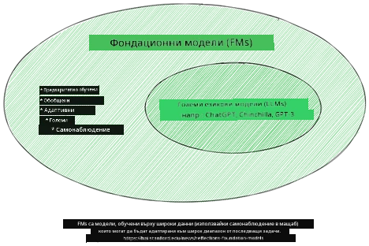  

Източник на изображението: [Essential Guide to Foundation Models and Large Language Models | от Babar M Bhatti | Medium  
](https://thebabar.medium.com/essential-guide-to-foundation-models-and-large-language-models-27dab58f7404)  

За да изясним още тази разлика, нека вземем ChatGPT като исторически пример. Ранните версии на ChatGPT използваха GPT-3.5 като основен модел. OpenAI след това използва чат-специфични данни и техники за изравняване, за да създаде настроена версия, която се представя по-добре в разговорни сценарии, като чатботове. Модерните AI услуги често маршрутизират между няколко варианта на модели, така че името на услугата и основният модел не винаги са едно и също нещо.  

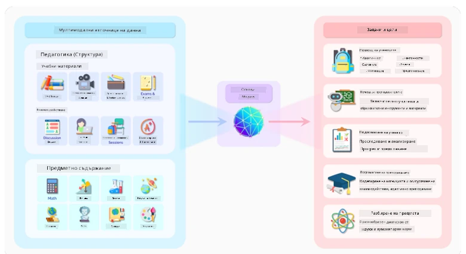  

Източник на изображението: [2108.07258.pdf (arxiv.org)](https://arxiv.org/pdf/2108.07258.pdf?WT.mc_id=academic-105485-koreyst)  

### Модели с отворени тежести/отворен код спрямо собствени модели  

Друг начин да се категоризират LLM е дали са с отворени тежести, с отворен код или собствени.  

Моделите с отворен код и отворени тежести предоставят артефакти за разглеждане, изтегляне или персонализиране, но техните лицензи се различават. Някои са напълно с отворен код, докато други са модели с отворени тежести с ограничения за употреба. Те могат да бъдат полезни, когато бизнесът се нуждае от повече контрол върху разгръщането, локализацията на данните, разходите или персонализирането. Въпреки това, екипите все пак трябва да прегледат лицензионните условия, разходите за обслужване, поддръжката, сигурностните актуализации и качеството на оценка преди да ги използват в продукция. Примери включват [Meta Llama 4](https://ai.meta.com/blog/llama-4-multimodal-intelligence/?WT.mc_id=academic-105485-koreyst), някои [Mistral модели](https://docs.mistral.ai/models/overview?WT.mc_id=academic-105485-koreyst) и много модели, хоствани на [Hugging Face](https://huggingface.co/models?WT.mc_id=academic-105485-koreyst).  

Собствените модели са собственост и са хоствани от доставчик. Тези модели често са оптимизирани за управлявано производство и могат да предложат силна поддръжка, системи за безопасност, интеграция с инструменти и мащабиране. Въпреки това клиентите обикновено не могат да преглеждат или модифицират тежестите на модела и трябва да прегледат условията на доставчика за поверителност, съхранение, съответствие и приемливо ползване. Примери включват [OpenAI модели](https://platform.openai.com/docs/models?WT.mc_id=academic-105485-koreyst), [Google Gemini](https://deepmind.google/models/gemini/pro/?WT.mc_id=academic-105485-koreyst) и [Anthropic Claude](https://platform.claude.com/docs/en/about-claude/models/overview?WT.mc_id=academic-105485-koreyst).  

### Вграждане спрямо генериране на изображения спрямо генериране на текст и код  

LLM могат да се категоризират и по произведения от тях изход.  

Вгражданията са група модели, които могат да превръщат текст в числова форма, наречена вграждане, което е числено представяне на входния текст. Вгражданията улесняват машините да разбират връзките между думи или изречения и могат да се използват като входове за други модели, като модели за класификация или клъстериране, които имат по-добра производителност при числови данни. Моделите за вграждане често се използват за трансферно обучение, при което се изгражда модел за заместителна задача с изобилие от данни и след това тежестите на модела (вгражданията) се преизползват за други последващи задачи. Пример за тази категория са [OpenAI embeddings](https://platform.openai.com/docs/models/embeddings?WT.mc_id=academic-105485-koreyst).  

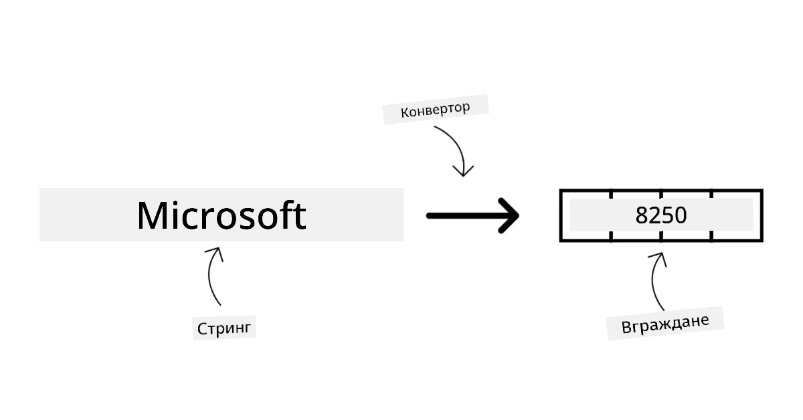  

Моделите за генериране на изображения са модели, които генерират изображения. Тези модели често се използват за редактиране на изображения, синтез на изображения и транслация на изображения. Моделите за генериране на изображения често са обучени върху големи набори от изображения, като [LAION-5B](https://laion.ai/blog/laion-5b/?WT.mc_id=academic-105485-koreyst), и могат да се използват за генериране на нови изображения или за редактиране на съществуващи изображения с техники като инпейнтинг, супер-резолюция и колоризация. Примери включват [GPT Image модели](https://platform.openai.com/docs/guides/images?WT.mc_id=academic-105485-koreyst), [Stable Diffusion модели](https://github.com/Stability-AI/StableDiffusion?WT.mc_id=academic-105485-koreyst) и модели Imagen.  

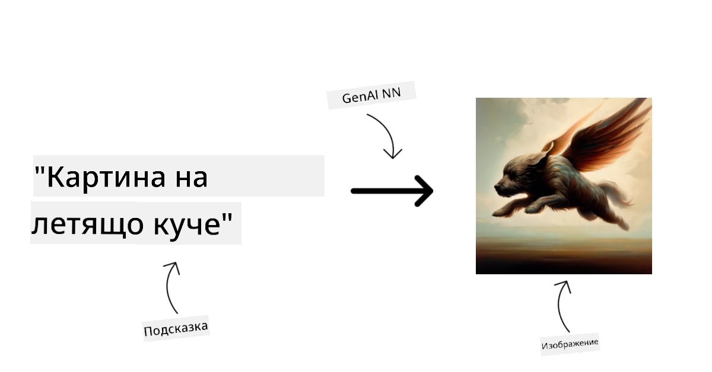  

Моделите за генериране на текст и код са модели, които генерират текст или код. Тези модели често се използват за резюмиране на текст, превод и отговаряне на въпроси. Моделите за генериране на текст често са обучени върху големи набори от текст, като [BookCorpus](https://www.cv-foundation.org/openaccess/content_iccv_2015/html/Zhu_Aligning_Books_and_ICCV_2015_paper.html?WT.mc_id=academic-105485-koreyst), и могат да се използват за генериране на нов текст или за отговаряне на въпроси. Моделите за генериране на код, като [CodeParrot](https://huggingface.co/codeparrot?WT.mc_id=academic-105485-koreyst), често са обучени върху големи набори от код, като GitHub, и могат да се използват за генериране на нов код или за отстраняване на грешки в съществуващ код.  

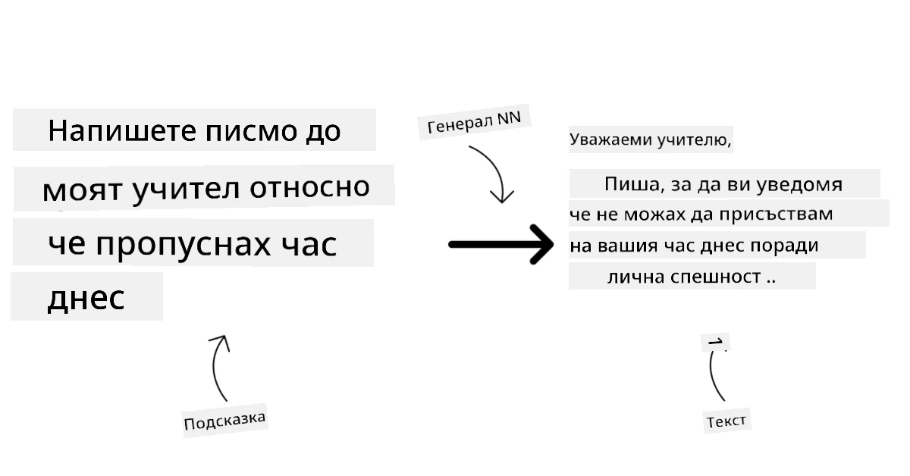  

### Кодиращ-декодиращ спрямо само декодиращ  

За да поговорим за различните архитектури на LLM, нека използваме аналогия.  

Представете си, че вашият мениджър ви е възложил задача да създадете куиз за студентите. Имате двама колеги; единият отговаря за създаването на съдържанието, а другият за преглеждането му.  

Създателят на съдържание е като модел само с декодер: той може да види темата, да види какво вече сте написали и след това да продължи да генерира съдържание въз основа на този контекст. Те са много добри в писането на ангажиращо и информативно съдържание, но не винаги са най-добрият избор, когато задачата е само да класифицират, извличат или кодират информация. Примери за семейства модели само с декодери включват GPT и Llama модели.  

Преглеждачът е като модел само с кодиращ модул: те разглеждат написания курс и отговорите, забелязват връзката между тях и разбират контекста, но не са добри в генерирането на съдържание. Пример за модел само с кодирач е BERT.  

Представете си, че можем също да имаме някой, който може и да създава, и да преглежда куиза, това е модел кодирач-декодирач. Някои примери са BART и T5.  

### Услуга спрямо модел  

Сега нека поговорим за разликата между услуга и модел. Услугата е продукт, който се предлага от облачен доставчик, и често е комбинация от модели, данни и други компоненти. Моделът е основният компонент на услугата и често е основен модел, като например LLM.  

Услугите често са оптимизирани за продукционна употреба и са по-лесни за използване от моделите, чрез графичен потребителски интерфейс. Въпреки това, услугите не винаги са безплатни и може да изискват абонамент или плащане за използване, срещу използването на оборудване и ресурси на собственика на услугата, оптимизирайки разходите и улеснявайки мащабирането. Пример за услуга е [Azure OpenAI Service](https://learn.microsoft.com/azure/ai-foundry/openai/overview?WT.mc_id=academic-105485-koreyst), която предлага тарифен план с плащане според използването, което означава, че потребителите се таксуват пропорционално на това колко използват услугата. Azure OpenAI Service предлага също корпоративна сигурност и рамка за отговорен AI, върху способностите на моделите.  

Моделите са артефактите на невронната мрежа: параметри, тежести, архитектура, токенизатор и поддържаща конфигурация. Изпълнението на модел локално или в частна среда изисква подходящ хардуер, обслужваща инфраструктура, мониторинг и съвместим лиценз с отворен код/тежест или комерсиален лиценз. Модели с отворени тежести като Llama 4 или Mistral могат да се хостват самостоятелно, но все пак изискват изчислителна мощ и оперативен опит.  

## Как да тествате и итерате с различни модели, за да разберете производителността в Azure  

Веднъж след като нашият екип проучи настоящия пейзаж на LLM и идентифицира някои добри кандидати за техните сценарии, следващата стъпка е да ги тества върху техните данни и натоварване. Това е итеративен процес, извършван чрез експерименти и измервания.
Повечето от моделите, които споменахме в предишните параграфи (модели на OpenAI, модели с отворени тежести като Llama 4 и Mistral, и модели на Hugging Face) са налични в [Microsoft Foundry Models](https://learn.microsoft.com/azure/foundry/concepts/foundry-models-overview?WT.mc_id=academic-105485-koreyst).

[Microsoft Foundry](https://learn.microsoft.com/azure/foundry/what-is-foundry?WT.mc_id=academic-105485-koreyst), бивш Azure AI Studio/Azure AI Foundry, е обединена платформа на Azure за изграждане на AI приложения и агенти. Тя помага на разработчиците да управляват жизнения цикъл от експериментиране и оценка до внедряване, наблюдение и управление. Каталогът с модели в Microsoft Foundry позволява на потребителя да:

- Намери основния модел от интерес в каталога, включително модели, продавани от Azure, и модели от партньори и доставчици от общността. Потребителите могат да филтрират по задача, доставчик, лиценз, опция за внедряване или име.

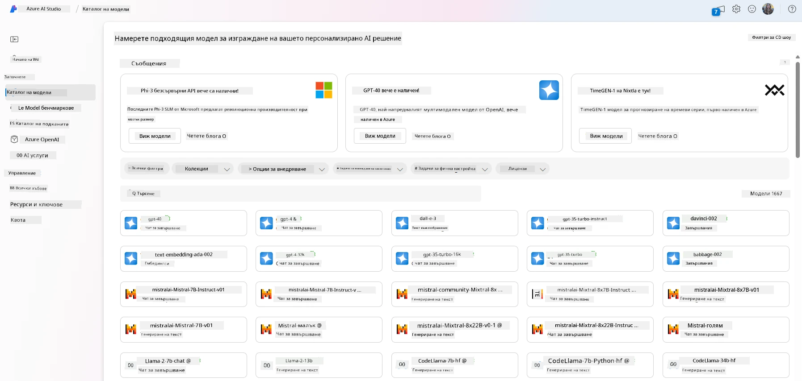

- Прегледа картата на модела, включително подробна информация за предназначеното използване и обучителните данни, примерен код и резултати от оценките в библиотеката за вътрешни оценки.

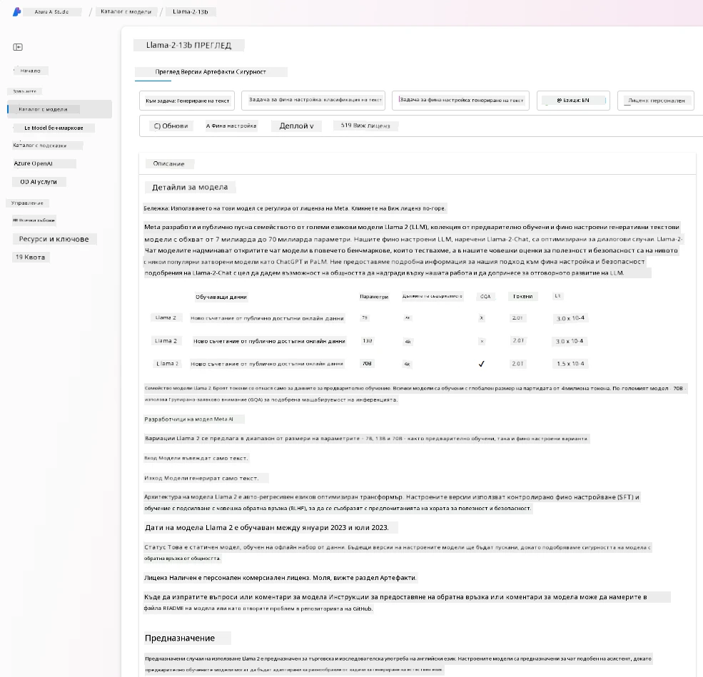

- Сравни показатели между модели и набори от данни, налични в индустрията, за да прецени кой най-добре отговаря на бизнес сценария, чрез панела [Model Benchmarks](https://learn.microsoft.com/azure/ai-foundry/concepts/model-benchmarks?WT.mc_id=academic-105485-koreyst).

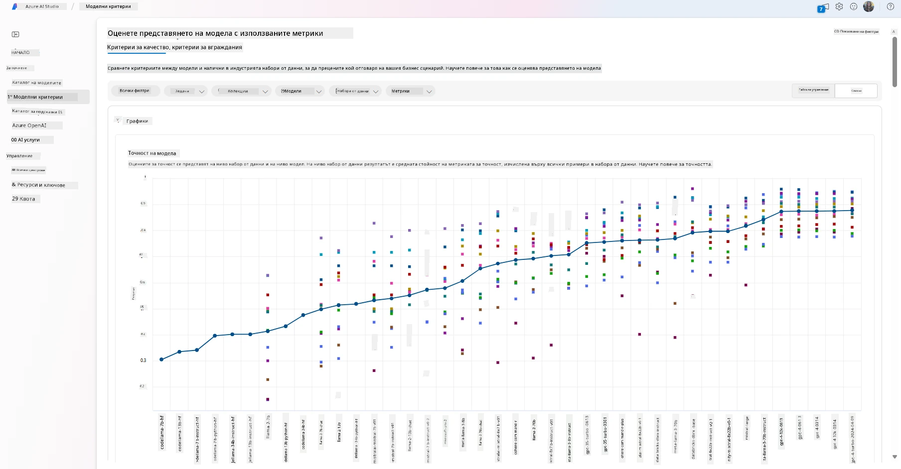

- Фина настройка на поддържани модели върху персонализирани обучителни данни за подобряване на представянето на модела в конкретно натоварване, използвайки възможностите за експериментиране и проследяване на Microsoft Foundry.

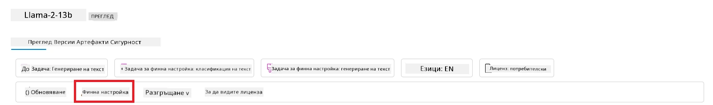

- Внедряване на оригиналния предварително обучен модел или на фината настроена версия в отдалечена крайна точка за реално време, използвайки управлявани изчисления или безсървърни опции за внедряване, за да позволи на приложенията да го използват.

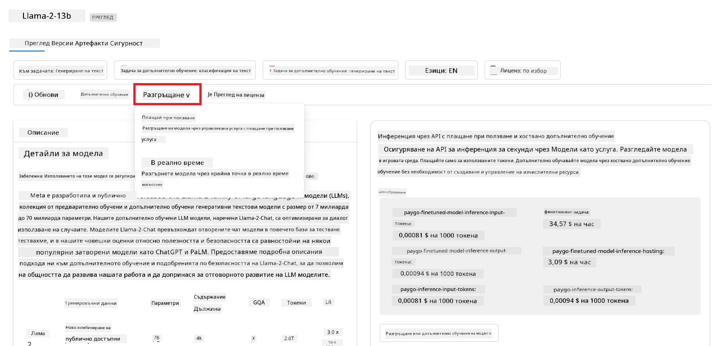

> [!NOTE]
> Не всички модели в каталога в момента са налични за фина настройка и/или внедряване с плащане според употребата. Проверете картата на модела за подробности относно възможностите и ограниченията на модела.

## Подобряване на резултатите от LLM

Изследвахме с нашия стартъп екип различни видове LLM и облачна платформа (Microsoft Foundry), която ни позволява да сравняваме различни модели, да ги оценяваме върху тестови данни, да подобряваме представянето им и да ги внедряваме на крайни точки за извличане.

Но кога трябва да разгледат възможността за фина настройка на модел, вместо да използват предварително обучен такъв? Има ли други подходи за подобряване на представянето на модела върху специфични натоварвания?

Има няколко подхода, които бизнесът може да използва, за да получи необходимите резултати от LLM. Можете да изберете различни видове модели с различна степен на обучение при внедряване на LLM в производство, с различни нива на сложност, цена и качество. Ето някои различни подходи:

- **Инженеринг на подсказки с контекст**. Идеята е да се предостави достатъчен контекст при подсказването, за да се гарантира, че получавате отговорите, от които се нуждаете.

- **Генериране със забогатяване чрез извличане, RAG**. Вашите данни може би съществуват например в база данни или уеб крайна точка, за да се гарантира, че тези данни или тяхна подмножество са включени по време на подсказването, можете да извлечете релевантните данни и да ги направите част от подсказката на потребителя.

- **Фино настроен модел**. Тук сте обучили допълнително модела върху собствените си данни, което води до по-точен и отзивчив модел според вашите нужди, но може да е скъпо.

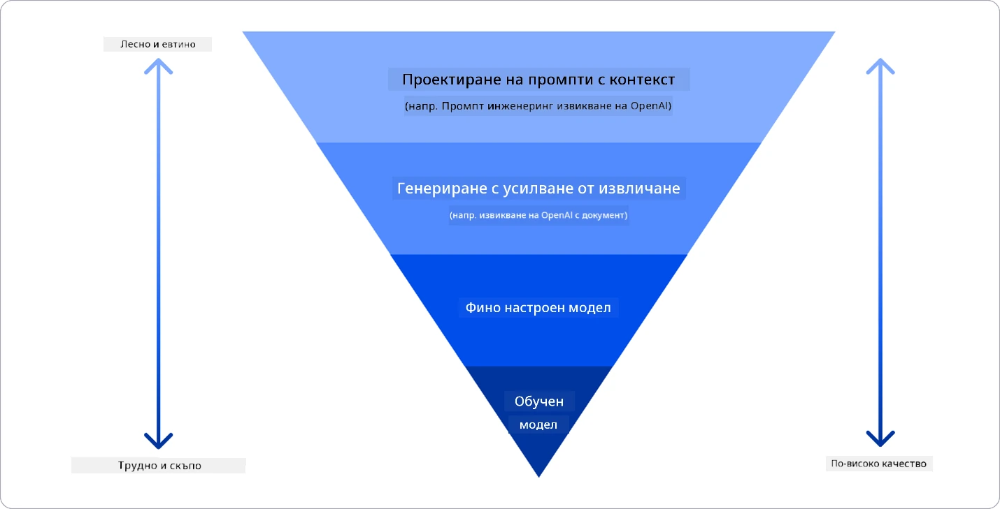

Източник на изображението: [Four Ways that Enterprises Deploy LLMs | Fiddler AI Blog](https://www.fiddler.ai/blog/four-ways-that-enterprises-deploy-llms?WT.mc_id=academic-105485-koreyst)

### Инженеринг на подсказки с контекст

Предварително обучените LLM работят много добре върху генерализирани задачи с естествен език, дори при кратки подсказки, като изречение за допълване или въпрос – така нареченото „обучение с нулев пример“.

Въпреки това, колкото повече потребителят може да рамкира запитването си с подробна заявка и примери – Контекста – толкова по-точен и близък до очакванията на потребителя ще бъде отговорът. В този случай говорим за „обучение с един пример“, ако подсказката включва само един пример, и „обучение с няколко примера“, ако включва множество примери.
Инженерингът на подсказки с контекст е най-ефективният по отношение на разходите подход за започване.

### Генериране със забогатяване чрез извличане (RAG)

LLM имат ограничението, че могат да използват само данните, използвани по време на обучението си, за да генерират отговор. Това означава, че те не знаят нищо за фактите, които са се случили след процеса на обучение, и нямат достъп до непублична информация (като фирмени данни).
Това може да бъде преодоляно чрез RAG, техника, която допълва подсказката с външни данни под формата на части от документи, като се вземат предвид ограниченията на дължината на подсказката. Това се поддържа от векторни бази данни (като [Azure Vector Search](https://learn.microsoft.com/azure/search/vector-search-overview?WT.mc_id=academic-105485-koreyst)), които извличат полезните части от разнообразни предварително дефинирани източници на данни и ги добавят към Контекста на подсказката.

Тази техника е много полезна, когато бизнесът няма достатъчно данни, време или ресурси за фина настройка на LLM, но все пак желае да подобри представянето при специфично натоварване и да намали рисковете от „халюцинирани“, остарели или неподдържани отговори.

### Фино настроен модел

Фина настройка е процес, който използва трансферно обучение, за да „адаптира“ модела към задача на по-ниско ниво или за разрешаване на конкретен проблем. За разлика от обучението с няколко примера и RAG, това води до създаването на нов модел с обновени тежести и отклонения. Този процес изисква набор от обучителни примери, състоящи се от един вход (подсказката) и съответния му изход (допълнението).
Това би бил предпочитаният подход, ако:

- **Използване на по-малки модели, специфични за задачата.** Бизнесът желае да финално настрои по-малък модел за тясна задача, а не да предоставя многократно подсказки на по-голям модел, което би довело до по-икономично и по-бързо решение.

- **Вземане предвид на латентността.** Латентността е важна за конкретен случай, така че не е възможно да се използват много дълги подсказки или броят на примерите, от които моделът трябва да се научи, не отговаря на ограничението за дължина на подсказката.

- **Адаптиране на стабилно поведение.** Бизнесът разполага с много качествени примери и иска моделът да следва последователно модел на задача, формат на изхода, тон или стил, специфични за домейна. Ако основният проблем са свежи факти или частни знания, които често се променят, използвайте RAG вместо да разчитате само на фина настройка.

### Обучен модел

Обучението на LLM от нулата без съмнение е най-трудният и най-сложният подход за възприемане, изискващ огромни количества данни, квалифицирани ресурси и подходяща изчислителна мощ. Тази опция трябва да се разглежда само в сценарий, където бизнесът има специфична за домейна задача и голямо количество домейн-центрирани данни.

## Проверка на знанията

Кой би могъл да бъде добър подход за подобряване на резултатите от завършване с LLM?

1. Инженеринг на подсказки с контекст
1. RAG
1. Фино настроен модел

A: И трите могат да помогнат. Започнете с инженеринг на подсказката и контекста за бързи подобрения, и използвайте RAG, когато моделът се нуждае от актуални факти или частни бизнес данни. Изберете фина настройка, когато имате достатъчно качествени примери и ви трябва моделът да следва последователно задача, формат, тон или модел на домейн.

## 🚀 Предизвикателство

Прочетете повече как можете да [използвате RAG](https://learn.microsoft.com/azure/search/retrieval-augmented-generation-overview?WT.mc_id=academic-105485-koreyst) за вашия бизнес.

## Отлична работа, продължете своето обучение

След като завършите този урок, разгледайте нашата [колекция за обучение по Генеративен AI](https://aka.ms/genai-collection?WT.mc_id=academic-105485-koreyst), за да продължите да усъвършенствате знанията си за Генеративен AI!

Отидете на урок 3, където ще разгледаме как да [строим с Генеративен AI отговорно](../03-using-generative-ai-responsibly/README.md?WT.mc_id=academic-105485-koreyst)!

---

<!-- CO-OP TRANSLATOR DISCLAIMER START -->
**Отказ от отговорност**:
Този документ е преведен с помощта на AI преводачески услуга [Co-op Translator](https://github.com/Azure/co-op-translator). Въпреки че се стремим към точност, моля имайте предвид, че автоматизираните преводи могат да съдържат грешки или неточности. Оригиналният документ на неговия роден език трябва да се счита за авторитетен източник. За критична информация се препоръчва професионален човешки превод. Ние не носим отговорност за каквито и да е недоразумения или неправилни тълкувания, произтичащи от използването на този превод.
<!-- CO-OP TRANSLATOR DISCLAIMER END -->