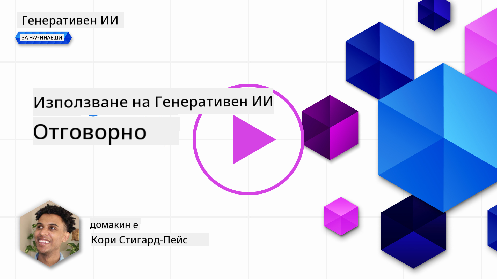
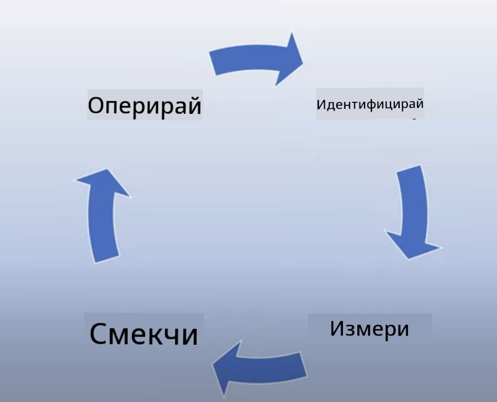
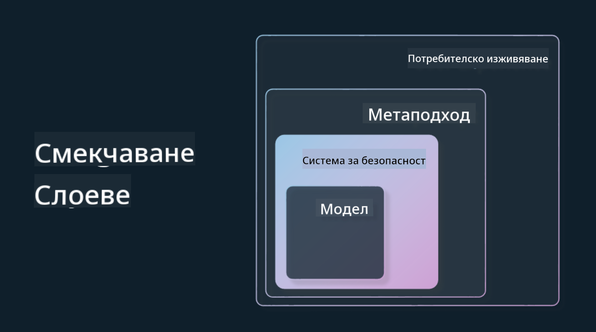

<!--
CO_OP_TRANSLATOR_METADATA:
{
  "original_hash": "7f8f4c11f8c1cb6e1794442dead414ea",
  "translation_date": "2025-07-09T09:03:29+00:00",
  "source_file": "03-using-generative-ai-responsibly/README.md",
  "language_code": "bg"
}
-->
# Отговорно използване на генеративен AI

> _Кликнете върху изображението по-горе, за да гледате видеото на този урок_

Лесно е да се впечатлиш от AI, особено от генеративния AI, но е важно да обмислиш как да го използваш отговорно. Трябва да вземеш предвид как да гарантираш, че резултатите са справедливи, безвредни и други подобни. Тази глава има за цел да ти предостави контекста, какво да имаш предвид и как да предприемеш активни стъпки за подобряване на използването на AI.

## Въведение

В този урок ще разгледаме:

- Защо трябва да поставяш отговорния AI на първо място при създаване на генеративни AI приложения.
- Основните принципи на отговорния AI и как те се отнасят до генеративния AI.
- Как да приложиш тези принципи на отговорния AI на практика чрез стратегии и инструменти.

## Цели на обучението

След завършване на този урок ще знаеш:

- Значението на отговорния AI при създаване на генеративни AI приложения.
- Кога да мислиш и прилагаш основните принципи на отговорния AI при разработка на генеративни AI приложения.
- Какви инструменти и стратегии са на разположение, за да приложиш концепцията за отговорен AI на практика.

## Принципи на отговорния AI

Вълнението около генеративния AI никога не е било по-голямо. Това вълнение привлече много нови разработчици, внимание и финансиране в тази област. Докато това е много положително за всеки, който иска да създава продукти и компании с генеративен AI, е важно да продължим отговорно.

През целия курс се фокусираме върху изграждането на нашия стартъп и нашия образователен AI продукт. Ще използваме принципите на отговорния AI: справедливост, приобщаване, надеждност/безопасност, сигурност и поверителност, прозрачност и отчетност. С тези принципи ще разгледаме как те се отнасят до използването на генеративен AI в нашите продукти.

## Защо трябва да поставиш отговорния AI на първо място

При създаване на продукт, подходът, ориентиран към човека и с мисъл за най-добрия интерес на потребителя, води до най-добри резултати.

Уникалността на генеративния AI е в способността му да създава полезни отговори, информация, насоки и съдържание за потребителите. Това може да се случи без много ръчни стъпки, което води до впечатляващи резултати. Без подходящо планиране и стратегии обаче, това може да доведе и до вредни резултати за потребителите, продукта и обществото като цяло.

Нека разгледаме някои (но не всички) от тези потенциално вредни резултати:

### Халюцинации

Халюцинациите са термин, използван за описване на ситуация, когато LLM генерира съдържание, което е напълно безсмислено или известно, че е фактически грешно според други източници на информация.

Например, ако създадем функция за нашия стартъп, която позволява на студентите да задават исторически въпроси на модел. Студент пита: `Кой беше единственият оцелял от Титаник?`

Моделът дава отговор като този по-долу:

> _(Източник: [Flying bisons](https://flyingbisons.com?WT.mc_id=academic-105485-koreyst))_

Това е много уверeн и изчерпателен отговор. За съжаление, той е грешен. Дори с минимално проучване, човек би открил, че е имало повече от един оцелял от катастрофата на Титаник. За студент, който тепърва започва да изследва тази тема, този отговор може да бъде достатъчно убедителен, за да не бъде поставен под въпрос и да се приеме за факт. Последствията от това могат да направят AI системата ненадеждна и да навредят на репутацията на нашия стартъп.

С всяка нова версия на даден LLM наблюдаваме подобрения в намаляването на халюцинациите. Въпреки това, ние като разработчици и потребители трябва да сме наясно с тези ограничения.

### Вредно съдържание

В предишния раздел разгледахме случаи, когато LLM генерира неправилни или безсмислени отговори. Друг риск, за който трябва да сме наясно, е когато моделът отговаря с вредно съдържание.

Вредното съдържание може да се определи като:

- Даване на инструкции или насърчаване на самонараняване или нараняване на определени групи.
- Омразно или унизително съдържание.
- Насоки за планиране на атаки или насилствени действия.
- Даване на инструкции как да се намери незаконно съдържание или да се извършат незаконни действия.
- Показване на сексуално експлицитно съдържание.

За нашия стартъп искаме да сме сигурни, че разполагаме с правилните инструменти и стратегии, за да предотвратим този тип съдържание да бъде видяно от студентите.

### Липса на справедливост

Справедливостта се определя като „гарантиране, че AI системата е свободна от пристрастия и дискриминация и третира всички справедливо и равноправно.“ В света на генеративния AI искаме да гарантираме, че изключващите светогледи към маргинализирани групи не се засилват чрез изхода на модела.

Този тип изходи не само вредят на изграждането на положителни продуктови преживявания за нашите потребители, но и нанасят допълнителна вреда на обществото. Като разработчици трябва винаги да имаме предвид широка и разнообразна потребителска база при създаването на решения с генеративен AI.

## Как да използваме генеративен AI отговорно

След като установихме значението на отговорния генеративен AI, нека разгледаме 4 стъпки, които можем да предприемем, за да изградим нашите AI решения отговорно:

### Измерване на потенциалните вреди

При тестване на софтуер проверяваме очакваните действия на потребителя в приложението. По същия начин, тестването на разнообразен набор от заявки, които потребителите най-вероятно ще използват, е добър начин да се измери потенциалната вреда.

Тъй като нашият стартъп създава образователен продукт, би било добре да подготвим списък с образователни заявки. Те могат да обхващат определен предмет, исторически факти и въпроси за студентския живот.

### Намаляване на потенциалните вреди

Сега е време да намерим начини да предотвратим или ограничим потенциалната вреда, причинена от модела и неговите отговори. Можем да разгледаме това на 4 различни нива:

- **Модел**. Избор на правилния модел за конкретния случай. По-големи и по-сложни модели като GPT-4 могат да носят по-голям риск от вредно съдържание, когато се прилагат в по-малки и по-специфични случаи. Използването на тренировъчни данни за фина настройка също намалява риска от вредно съдържание.

- **Система за безопасност**. Система за безопасност е набор от инструменти и конфигурации на платформата, която обслужва модела и помага за намаляване на вредата. Пример за това е системата за филтриране на съдържание в Azure OpenAI услугата. Системите трябва също да откриват опити за заобикаляне на ограничения (jailbreak) и нежелана активност като заявки от ботове.

- **Метазаявка (Metaprompt)**. Метазаявките и заземяването са начини да насочим или ограничим модела въз основа на определени поведения и информация. Това може да включва използване на системни входове за дефиниране на определени ограничения на модела. Освен това, предоставяне на изходи, които са по-релевантни за обхвата или домейна на системата.

Може също да се използват техники като Retrieval Augmented Generation (RAG), при които моделът извлича информация само от избрани доверени източници. В по-късен урок от този курс има материал за [създаване на търсачки](../08-building-search-applications/README.md?WT.mc_id=academic-105485-koreyst).

- **Потребителско изживяване**. Последният слой е мястото, където потребителят взаимодейства директно с модела чрез интерфейса на нашето приложение. По този начин можем да проектираме UI/UX, за да ограничим потребителя в типовете входни данни, които може да изпраща към модела, както и текста или изображенията, които се показват на потребителя. При пускане на AI приложението трябва да сме прозрачни относно това, какво нашето генеративно AI приложение може и не може да прави.

Имаме цял урок, посветен на [Проектиране на UX за AI приложения](../12-designing-ux-for-ai-applications/README.md?WT.mc_id=academic-105485-koreyst).

- **Оценка на модела**. Работата с LLM може да бъде предизвикателна, защото не винаги имаме контрол върху данните, с които моделът е обучен. Въпреки това, винаги трябва да оценяваме представянето и изходите на модела. Важно е да измерваме точността, сходството, обосноваността и релевантността на изхода. Това помага да се осигури прозрачност и доверие сред заинтересованите страни и потребителите.

### Управление на отговорно генеративно AI решение

Изграждането на оперативна практика около AI приложенията е последният етап. Това включва партньорство с други отдели в нашия стартъп като Правен и Сигурност, за да гарантираме съответствие с всички регулаторни политики. Преди пускане искаме да изградим планове за доставка, управление на инциденти и връщане назад, за да предотвратим нарастване на вреди за нашите потребители.

## Инструменти

Въпреки че разработването на отговорни AI решения може да изглежда като много работа, тя си заслужава усилията. С разрастването на генеративния AI ще се появяват все повече инструменти, които помагат на разработчиците ефективно да интегрират отговорността в работните си процеси. Например, [Azure AI Content Safety](https://learn.microsoft.com/azure/ai-services/content-safety/overview?WT.mc_id=academic-105485-koreyst) може да помогне за откриване на вредно съдържание и изображения чрез API заявки.

## Проверка на знанията

Какви неща трябва да имаш предвид, за да осигуриш отговорно използване на AI?

1. Отговорът да е правилен.  
1. Да се предотврати вредна употреба, AI да не се използва за престъпни цели.  
1. Да се гарантира, че AI е свободен от пристрастия и дискриминация.

О: 2 и 3 са правилни. Отговорният AI ти помага да обмислиш как да намалиш вредните ефекти, пристрастията и други.

## 🚀 Предизвикателство

Прочети за [Azure AI Content Safety](https://learn.microsoft.com/azure/ai-services/content-safety/overview?WT.mc_id=academic-105485-koreyst) и виж какво можеш да приложиш за своето използване.

## Отлична работа, продължавай да учиш

След като завършиш този урок, разгледай нашата [колекция за обучение по генеративен AI](https://aka.ms/genai-collection?WT.mc_id=academic-105485-koreyst), за да продължиш да развиваш знанията си за генеративен AI!

Отиди на урок 4, където ще разгледаме [Основи на prompt инженерството](../04-prompt-engineering-fundamentals/README.md?WT.mc_id=academic-105485-koreyst)!

**Отказ от отговорност**:  
Този документ е преведен с помощта на AI преводаческа услуга [Co-op Translator](https://github.com/Azure/co-op-translator). Въпреки че се стремим към точност, моля, имайте предвид, че автоматизираните преводи могат да съдържат грешки или неточности. Оригиналният документ на неговия роден език трябва да се счита за авторитетен източник. За критична информация се препоръчва професионален човешки превод. Ние не носим отговорност за каквито и да е недоразумения или неправилни тълкувания, произтичащи от използването на този превод.