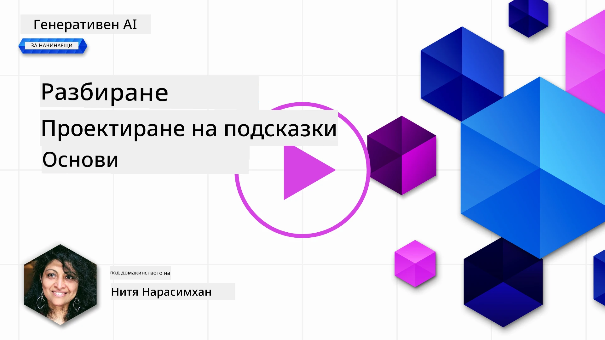
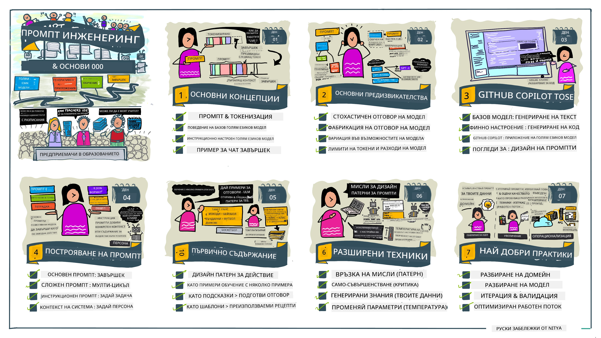
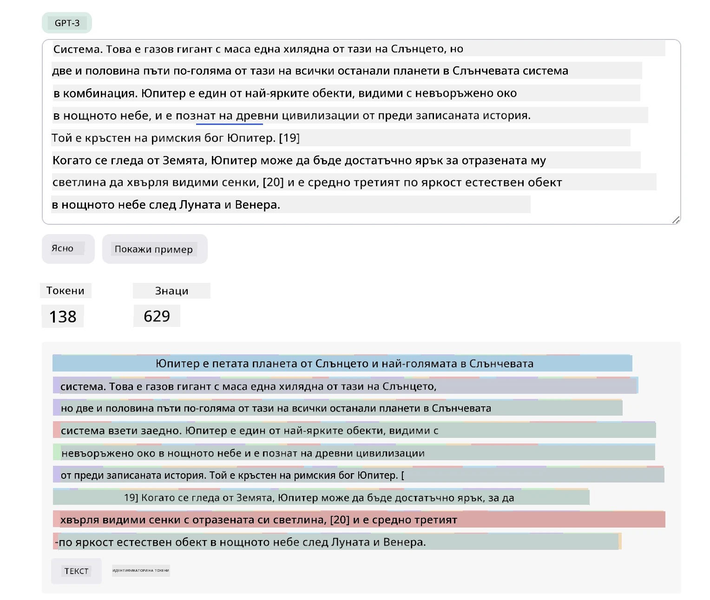
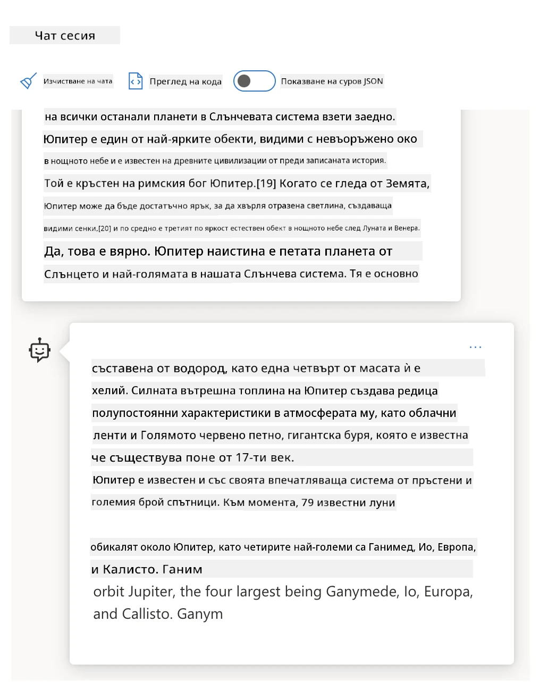
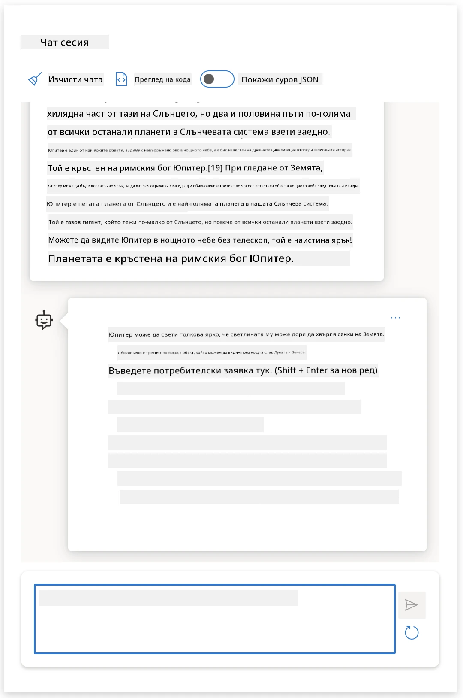
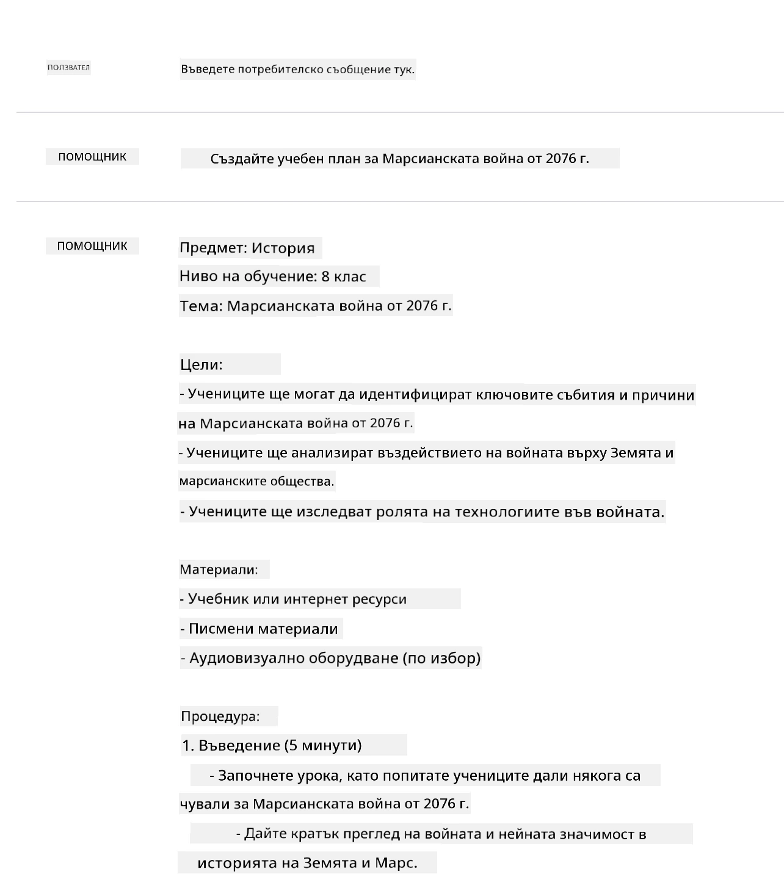
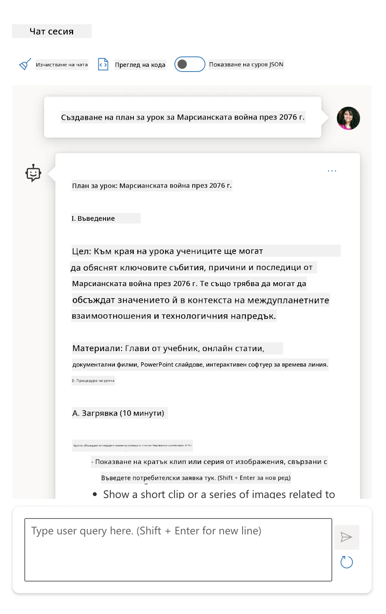
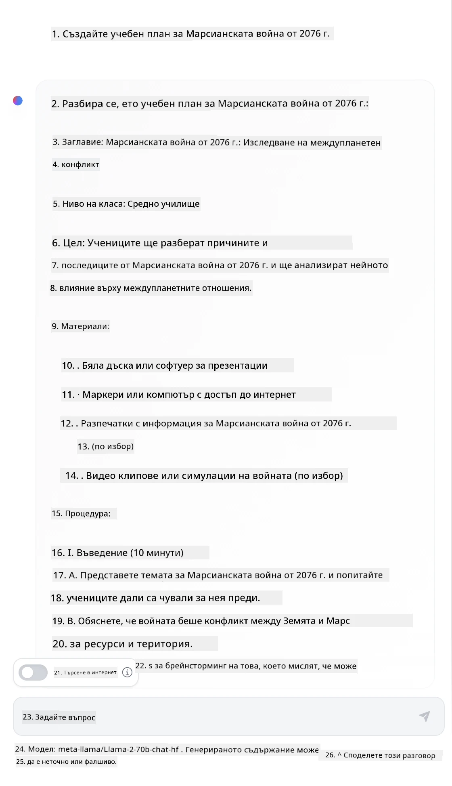

# Основи на проектирането на запитвания

[](https://youtu.be/GElCu2kUlRs?si=qrXsBvXnCW12epb8)

## Въведение
Този модул обхваща основни концепции и техники за създаване на ефективни запитвания в генеративни AI модели. Начинът, по който формулирате вашето запитване към LLM, също има значение. Внимателно създаденото запитване може да постигне по-добро качество на отговора. Но какво точно означават термините _prompt_ и _prompt engineering_? И как да подобря входното запитване (_input_), което изпращам към LLM? Това са въпросите, на които ще се опитаме да отговорим в този и следващия раздел.

_Генеративният AI_ е способен да създава ново съдържание (например текст, изображения, аудио, код и др.) в отговор на потребителски заявки. Той постига това чрез _Големи езикови модели_ като серията GPT на OpenAI ("Generative Pre-trained Transformer"), които са обучени за използване на естествен език и код.

Потребителите сега могат да взаимодействат с тези модели чрез познати парадигми като чат, без необходимост от технически умения или обучение. Моделите са _базирани на запитвания_ - потребителите изпращат текстов вход (запитване) и получават отговор от AI (завършек). Те могат после да "чатят с AI" итеративно, в многократни разговори, като усъвършенстват запитването си докато отговорът отговаря на техните очаквания.

"Запитванията" сега се превръщат в основния _програмен интерфейс_ за генеративни AI приложения, като казват на моделите какво да правят и влияят върху качеството на получените отговори. "Проектирането на запитвания" е бързо развиващо се поле на изследване, което се фокусира върху _проектирането и оптимизацията_ на запитванията с цел доставяне на последователни и качествени отговори в мащаб.

## Цели на обучението

В този урок ще научим какво е Проектиране на запитвания, защо е важно и как да създаваме по-ефективни запитвания за даден модел и цел на приложението. Ще разберем основните концепции и най-добри практики за проектиране на запитвания - и ще се запознаем с интерактивна среда от Jupyter Notebooks "пясъчник", където можем да видим тези концепции приложени в реални примери.

До края на този урок ще можем да:

1. Обясним какво е проектиране на запитвания и защо е важно.
2. Описваме компонентите на едно запитване и как се използват.
3. Научим най-добри практики и техники за проектиране на запитвания.
4. Прилагаме научените техники върху реални примери, използвайки OpenAI крайна точка.

## Ключови термини

Проектиране на запитвания: Практиката на проектиране и усъвършенстване на входни данни, за да се насочат AI моделите към генериране на желаните изходи.  
Токенизация: Процесът на конвертиране на текст в по-малки единици, наречени токени, които моделът може да разбира и обработва.  
Инструкционно-настройвани LLMs: Големи езикови модели (LLMs), които са допълнително настроени с конкретни инструкции, за да подобрят точността и релевантността на отговорите си.

## Обучителен пясъчник

Проектирането на запитвания в момента е повече изкуство, отколкото наука. Най-добрият начин да подобрим интуицията си е да _тренираме повече_ и да приемем подход тип проба-грешка, който комбинира експертиза в областта на приложението с препоръчани техники и модели-специфични оптимизации.

Jupyter Notebook, съпътстващ този урок, предоставя _пясъчник_ - среда, в която можете да изпробвате наученото - както в движение, така и като част от кодовото предизвикателство в края. За да изпълнявате упражненията, ще имате нужда от:

1. **API ключ за Azure OpenAI** - крайна точка на услугата за разположен LLM.  
2. **Среда за Python** - в която да се изпълнява Notebook.  
3. **Локални променливи на средата** - _завършете стъпките от [SETUP](./../00-course-setup/02-setup-local.md?WT.mc_id=academic-105485-koreyst) сега, за да се подготвите_.

Notebook идва с _начални_ упражнения - но ви се препоръчва да добавяте свои собствени _Markdown_ (описание) и _Code_ (заявки към запитвания) секции, за да изпробвате повече примери или идеи - и да изградите интуицията си за проектиране на запитвания.

## Илюстрирано ръководство

Искате ли да получите цялостната представа за това, което обхваща този урок преди да се заемете? Вижте това илюстрирано ръководство, което ви дава усещане за основните теми и ключовите изводи за размисъл във всяка от тях. Пътната карта на урока ви води от разбирането на основните концепции и предизвикателства до тяхното адресиране с релевантни техники за проектиране на запитвания и най-добри практики. Обърнете внимание, че разделът "Разширени техники" в това ръководство се отнася до съдържание, разглеждано в _следващия_ урок от тази учебна програма.



## Нашият стартъп

Сега нека поговорим как _тази тема_ се свързва с мисията на нашия стартъп да [внедри AI иновации в образованието](https://educationblog.microsoft.com/2023/06/collaborating-to-bring-ai-innovation-to-education?WT.mc_id=academic-105485-koreyst). Искаме да изградим AI-задвижвани приложения за _персонализирано обучение_, затова нека помислим как различните потребители на нашето приложение могат да "проектират" запитвания:

- **Администратори** могат да поискат от AI да _анализира данни от учебната програма, за да идентифицира пропуски в покритието_. AI може да обобщи резултатите или да ги визуализира с код.
- **Учители** могат да поискат от AI да _генерира учебен план за целева аудитория и тема_. AI може да създаде персонализирания план в зададен формат.
- **Ученици** могат да поискат от AI да _ги напътства в труден предмет_. AI може да ги води с уроци, подсказки и примери, съобразени с тяхното ниво.

Това е само върхът на айсберга. Вижте [Prompts For Education](https://github.com/microsoft/prompts-for-edu/tree/main?WT.mc_id=academic-105485-koreyst) - библиотека с отворен код, събрана от експерти в образованието, за по-широка представа за възможностите! _Опитайте да пуснете някои от тези запитвания в пясъчника или в OpenAI Playground, за да видите резултатите!_

<!--
LESSON TEMPLATE:
This unit should cover core concept #1.
Reinforce the concept with examples and references.

CONCEPT #1:
Prompt Engineering.
Define it and explain why it is needed.
-->

## Какво е проектиране на запитвания?

Започнахме този урок, като дефинирахме **проектирането на запитвания** като процес на _проектиране и оптимизиране_ на текстови входове (запитвания) с цел да се доставят последователни и качествени отговори (завършеци) за дадена цел на приложението и модел. Можем да го разгледаме като двуфазен процес:

- _проектиране_ на началното запитване за даден модел и цел  
- _усъвършенстване_ на запитването итеративно за подобряване на качеството на отговора

Това по необходимост е процес на проба и грешка, който изисква потребителска интуиция и усилия за постигане на оптимални резултати. Защо е важно това? За да отговорим на този въпрос, първо трябва да разберем три концепции:

- _Токенизация_ = как моделът "вижда" запитването  
- _Основни LLMs_ = как базовият модел "обработва" запитване  
- _Инструкционно-настройвани LLMs_ = как моделът вече може да вижда "задачи"

### Токенизация

Един LLM вижда запитванията като _последователност от токени_, като различните модели (или версии на модела) могат да токенизират едно и също запитване по различни начини. Тъй като LLM са обучени върху токени (а не върху суров текст), начинът, по който запитванията се токенизират, влияе пряко върху качеството на генерирания отговор.

За да добиете интуиция как работи токенизацията, пробвайте инструменти като [OpenAI Tokenizer](https://platform.openai.com/tokenizer?WT.mc_id=academic-105485-koreyst), показан по-долу. Копирайте вашето запитване - и вижте как то се преобразува в токени, като обърнете внимание как се третират интервалите и пунктуационните знаци. Обърнете внимание, че този пример показва по-стар модел (GPT-3) - при нов по-нов модел резултатът може да е различен.



### Концепция: Основни модели

След като запитването бъде токенизирано, основната функция на ["Основния LLM"](https://blog.gopenai.com/an-introduction-to-base-and-instruction-tuned-large-language-models-8de102c785a6?WT.mc_id=academic-105485-koreyst) (или базов модел) е да предскаже следващия токен в тази последователност. Тъй като LLM са обучени върху огромни текстови данни, те имат добра представа за статистическите връзки между токените и могат да направят тази прогноза с определена увереност. Обърнете внимание, че те не разбират _значението_ на думите в запитването или токена; те просто виждат модел, който могат да "завършат" с предсказването си за следващия токен. Те могат да продължат с предсказването на последователността, докато не бъдат прекъснати от потребителя или не настъпи предварително зададено условие.

Искате ли да видите как работи попълването, базирано на запитване? Въведете горното запитване в Azure OpenAI Studio [_Chat Playground_](https://oai.azure.com/playground?WT.mc_id=academic-105485-koreyst) с настройките по подразбиране. Системата е конфигурирана да третира запитванията като заявки за информация - така че трябва да видите завършек, който отговаря на този контекст.

Но какво ако потребителят иска нещо конкретно, което отговаря на някакви критерии или цел на задачата? Тук на помощ идват _инструкционно-настройваните_ LLM.



### Концепция: Инструкционно-настройвани LLM

[Инструкционно-настройван LLM](https://blog.gopenai.com/an-introduction-to-base-and-instruction-tuned-large-language-models-8de102c785a6?WT.mc_id=academic-105485-koreyst) започва с базовия модел и го финално настройва с примери или вход/изход двойки (например многократни "съобщения"), които съдържат ясни инструкции - и отговорът от AI се опитва да следва тази инструкция.

Това използва техники като Усъвършенстване чрез Подсилващо Обучение с Човешка Обратна Връзка (RLHF), които обучават модела да _следва инструкции_ и да _се учи от обратна връзка_, така че да произвежда отговори, по-подходящи за практическо приложение и по-релевантни за целите на потребителя.

Нека опитаме - върнете се към горното запитване, но сега променете _системното съобщение_, за да предоставите следната инструкция като контекст:

> _Обобщи предоставеното съдържание за ученик от втори клас. Запазете резултата в един абзац с 3-5 точки._

Вижте как резултатът сега е настроен да отразява желаната цел и формат? Един учител може директно да използва този отговор в слайдовете за този клас.



## Защо имаме нужда от проектиране на запитвания?

Сега когато знаем как LLM обработват запитвания, нека поговорим защо имаме нужда от проектиране на запитвания. Отговорът се крие във факта, че съвременните LLM имат няколко предизвикателства, които правят постигането на _надеждни и последователни завършеци_ по-трудно без усилие при създаване и оптимизация на запитвания. Например:

1. **Отговорите на моделите са стохастични.** _Същото запитване_ вероятно ще произведе различни отговори с различни модели или версии на модел. И може дори да даде различни резултати с _един и същи модел_ в различни моменти. _Техниките за проектиране на запитвания могат да ни помогнат да минимизираме тези вариации, като предложат по-добри ориентири_.

1. **Моделите могат да измислят отговори.** Моделите са предварително обучени с _големи, но ограничени_ набори от данни, което означава, че нямат знания за концепции извън този обхват на обучение. В резултат могат да създадат завършеци, които са неточни, невярно изобретени или дори противоречат на известни факти. _Техниките за проектиране на запитвания помагат на потребителите да идентифицират и смекчат такива измишльотини, например чрез искане на цитати или обосновки от AI_.

1. **Възможностите на моделите се различават.** По-новите модели или поколение модели имат по-богати възможности, но носят и уникални особености и компромиси в цената и сложността. _Проектирането на запитвания може да ни помогне да развием най-добри практики и работни потоци, които абстрахират разликите и се адаптират към специфичните изисквания на модела по мащабируем и безпроблемен начин_.

Нека видим това в действие в OpenAI или Azure OpenAI Playground:

- Използвайте едно и също запитване с различни внедрявания на LLM (например OpenAI, Azure OpenAI, Hugging Face) - видяхте ли вариациите?  
- Използвайте едно и също запитване многократно с _един и същи_ LLM (например в Azure OpenAI playground) - как се различаваха тези вариации?

### Пример за измисляне

В този курс използваме термина **"измисляне"** за обозначаване на явлението, при което LLM понякога генерират фактически некоректна информация поради ограничения в обучението или други фактори. Може да сте чували това наричано и _"халюцинации"_ в популярни статии или научни трудове. Все пак ние силно препоръчваме да използвате термина _"измисляне"_, за да не представяме поведението по антропоморфен начин, като приписваме човешка черта на машинно генериран резултат. Това също така подкрепя [отговорните насоки за AI](https://www.microsoft.com/ai/responsible-ai?WT.mc_id=academic-105485-koreyst) от терминологична гледна точка, като премахва термини, които могат да се считат за обидни или изключващи в някои контексти.

Искате ли да добиете представа как работят измислянията? Помислете за запитване, което инструктира AI да генерира съдържание за не-съществуваща тема (за да се гарантира, че не присъства в обучаващия набор от данни). Например - опитах следното запитване:

> **Запитване:** генерирай учебен план за Марсианската война от 2076 година.
Уеб търсене ми показа, че има художествени разкази (например телевизионни сериали или книги) за марсиански войни – но никои през 2076 г. Здравият разум също ни казва, че 2076 е _в бъдещето_ и следователно не може да се свързва с реално събитие.

Така че какво се случва, когато стартираме този промпт с различни доставчици на LLM?

> **Отговор 1**: OpenAI Playground (GPT-35)



> **Отговор 2**: Azure OpenAI Playground (GPT-35)



> **Отговор 3**: : Hugging Face Chat Playground (LLama-2)



Както се очакваше, всеки модел (или версия на модела) дава леко различни отговори благодарение на стохастичното поведение и вариациите в възможностите на модела. Например, един модел е насочен към аудитория на 8 клас, докато другият предполага ученици в гимназия. Но и трите модела генерираха отговори, които биха убедили неподготвен потребител, че събитието е реално.

Техники за инженеринг на промпти като _метапромптинг_ и _настройване на температурата_ могат да намалят измислянията от модела до известна степен. Нови _архитектури_ за инженеринг на промпти също интегрират безпроблемно нови инструменти и техники в потока на промпта, за да смекчат или намалят някои от тези ефекти.

## Казус: GitHub Copilot

Нека завършим този раздел с поглед към това как инженерингът на промпти се използва в реални решения, като разгледаме един казус: [GitHub Copilot](https://github.com/features/copilot?WT.mc_id=academic-105485-koreyst).

GitHub Copilot е вашият "AI асистент програмист" – той превръща текстови промпти в допълнения на код и е интегриран във вашата среда за разработка (например Visual Studio Code) за безпроблемно потребителско изживяване. Както е документирано в серията блогове по-долу, най-ранната версия беше базирана на модела OpenAI Codex – инженерите бързо осъзнаха нуждата да настроят модела допълнително и да развият по-добри техники за инженеринг на промпти, за да подобрят качеството на кода. През юли те [представиха подобрен AI модел, който надхвърля Codex](https://github.blog/2023-07-28-smarter-more-efficient-coding-github-copilot-goes-beyond-codex-with-improved-ai-model/?WT.mc_id=academic-105485-koreyst) за още по-бързи предложения.

Прочетете постовете в ред, за да проследите тяхното обучение.

- **Май 2023** | [GitHub Copilot става по-добър в разбирането на вашия код](https://github.blog/2023-05-17-how-github-copilot-is-getting-better-at-understanding-your-code/?WT.mc_id=academic-105485-koreyst)
- **Май 2023** | [Вътрешно в GitHub: Работа с LLM зад GitHub Copilot](https://github.blog/2023-05-17-inside-github-working-with-the-llms-behind-github-copilot/?WT.mc_id=academic-105485-koreyst)
- **Юни 2023** | [Как да пишете по-добри промпти за GitHub Copilot](https://github.blog/2023-06-20-how-to-write-better-prompts-for-github-copilot/?WT.mc_id=academic-105485-koreyst)
- **Юли 2023** | [.. GitHub Copilot надхвърля Codex с подобрен AI модел](https://github.blog/2023-07-28-smarter-more-efficient-coding-github-copilot-goes-beyond-codex-with-improved-ai-model/?WT.mc_id=academic-105485-koreyst)
- **Юли 2023** | [Ръководство за разработчици за инженеринг на промпти и LLM](https://github.blog/2023-07-17-prompt-engineering-guide-generative-ai-llms/?WT.mc_id=academic-105485-koreyst)
- **Септ 2023** | [Как да изградите корпоративно LLM приложение: Уроци от GitHub Copilot](https://github.blog/2023-09-06-how-to-build-an-enterprise-llm-application-lessons-from-github-copilot/?WT.mc_id=academic-105485-koreyst)

Също така можете да разгледате техния [инженерен блог](https://github.blog/category/engineering/?WT.mc_id=academic-105485-koreyst) за още публикации като [тази](https://github.blog/2023-09-27-how-i-used-github-copilot-chat-to-build-a-reactjs-gallery-prototype/?WT.mc_id=academic-105485-koreyst), която показва как тези модели и техники се _прилагат_ за задвижване на реални приложения.

---

<!--
LESSON TEMPLATE:
This unit should cover core concept #2.
Reinforce the concept with examples and references.

CONCEPT #2:
Prompt Design.
Illustrated with examples.
-->

## Създаване на промпт

Вече разбрахме защо инженерството на промпти е важно – сега нека разберем как се _създават_ промптите, за да можем да оценим различните техники за по-ефективен дизайн на промпти.

### Основен промпт

Нека започнем с основния промпт: текстов вход, изпратен към модела без друг контекст. Ето пример – когато изпратим първите няколко думи от националния химн на САЩ към OpenAI [Completion API](https://platform.openai.com/docs/api-reference/completions?WT.mc_id=academic-105485-koreyst) той мигновено _завършва_ отговора с следващите няколко реда, илюстрирайки основното поведение за предсказване.

| Промпт (Вход)         | Завършване (Изход)                                                                                                                       |
| :--------------------- | :---------------------------------------------------------------------------------------------------------------------------------------- |
| Oh say can you see     | Изглежда, че започвате текста на "The Star-Spangled Banner", националния химн на Съединените щати. Пълният текст е ...                     |

### Комплексен промпт

Сега нека добавим контекст и инструкции към този основен промпт. [Chat Completion API](https://learn.microsoft.com/azure/ai-services/openai/how-to/chatgpt?WT.mc_id=academic-105485-koreyst) ни позволява да създадем сложен промпт като колекция от _съобщения_ със:

- двойки вход/изход, отразяващи входа на _потребителя_ и отговора на _асистента_.
- системно съобщение, задаващо контекста за поведението или личността на асистента.

Заявката е сега във формата по-долу, където _токенизацията_ ефективно улавя релевантна информация от контекста и разговора. Сега, промяната на системния контекст може да има също толкова голямо влияние върху качеството на завършванията, колкото и входовете, дадени от потребителя.

```python
response = openai.chat.completions.create(
    model="gpt-3.5-turbo",
    messages=[
        {"role": "system", "content": "You are a helpful assistant."},
        {"role": "user", "content": "Who won the world series in 2020?"},
        {"role": "assistant", "content": "The Los Angeles Dodgers won the World Series in 2020."},
        {"role": "user", "content": "Where was it played?"}
    ]
)
```

### Инструкционен промпт

В горните примери, промптът от потребителя беше прост текстов въпрос, който може да се интерпретира като искане за информация. С _инструкционни_ промпти можем да използваме този текст, за да уточним задача по-подробно, като предоставим по-добро ръководство на ИИ. Ето един пример:

| Промпт (Вход)                                                                                                                                                                                                                         | Завършване (Изход)                                                                                                       | Тип на инструкция |
| :----------------------------------------------------------------------------------------------------------------------------------------------------------------------------------------------------------------------------------- | :------------------------------------------------------------------------------------------------------------------------ | :---------------- |
| Напишете описание на Гражданската война                                                                                                                                                                                             | _връща прост параграф_                                                                                                   | Прост             |
| Напишете описание на Гражданската война. Посочете ключови дати и събития и опишете тяхното значение                                                                                                                                 | _връща параграф, последван от списък с ключови дати и описания на събития_                                               | Комплексен        |
| Напишете описание на Гражданската война в 1 параграф. Посочете 3 точки с ключови дати и тяхното значение. Посочете още 3 точки с ключови исторически личности и техния принос. Върнете изхода като JSON файл | _връща по-обстойни детайли в текстово поле, форматирани като JSON, които може да копирате и валидирате_                     | Комплексен. Форматиран. |

## Основно съдържание

В горните примери, промптът все още беше доста открит, позволявайки на LLM да избере коя част от предварително тренирания му корпус е релевантна. С дизайна на _основно съдържание_, входният текст се разделя на две части:

- инструкция (действие)
- релевантно съдържание (което влияе върху действието)

Ето пример, където инструкцията е "резюмирайте това в 2 изречения".

| Промпт (Вход)                                                                                                                                                                                                                                                                                                                                                                                                                                                                                                                                                                                                                                                                                | Завършване (Изход)                                                                                                                                                                                                                                                                              |
| :-------------------------------------------------------------------------------------------------------------------------------------------------------------------------------------------------------------------------------------------------------------------------------------------------------------------------------------------------------------------------------------------------------------------------------------------------------------------------------------------------------------------------------------------------------------------------------------------------------------------------------------------------------------------------------------------- | :----------------------------------------------------------------------------------------------------------------------------------------------------------------------------------------------------------------------------------------------------------------------------------------------- |
| Юпитер е петата планета от Слънцето и най-голямата в Слънчевата система. Той е газов гигант с маса една хилядна от тази на Слънцето, но два и половина пъти по-голяма от всички останали планети в Слънчевата система взети заедно. Юпитер е един от най-ярките обекти, видими с просто око в нощното небе и е известен на древните цивилизации от преди записаната история. Той е кръстен на римския бог Юпитер.[19] Когато се наблюдава от Земята, Юпитер може да бъде достатъчно ярък, за да хвърля видими сенки,[20] и е средно третият най-ярък естествен обект в нощното небе след Луната и Венера. <br/> **Резюмирайте това в 2 кратки изречения** | Юпитер, петата планета от Слънцето, е най-голямата в Слънчевата система и е известен като един от най-ярките обекти в нощното небе. Кръстен на римския бог Юпитер, той е газов гигант с маса два и половина пъти тази на всички останали планети в Слънчевата система взети заедно. |

Сегментът на основното съдържание може да се използва по различни начини за постигане на по-ефективни инструкции:

- **Примери** – вместо да казваме на модела какво да направи с ясна инструкция, даваме му примери какво да направи и му позволяваме да изведе модела.
- **Насоки** – след инструкцията се добавя "намек", който подготвя завършването, насочвайки модела към по-релевантни отговори.
- **Шаблони** – това са повторяеми 'рецепти' за промпти с плейсхолдъри (променливи), които могат да се персонализират с данни за конкретни случаи.

Нека разгледаме тези техники в действие.

### Използване на примери

Това е подход, при който използвате основното съдържание, за да „храните модела“ с няколко примера за желания изход за дадена инструкция и му позволявате да изведе шаблона за желания изход. В зависимост от броя на предоставените примери, можем да имаме zero-shot, one-shot, few-shot промптиране и др.

Промптът сега се състои от три компонента:

- описание на задача
- няколко примера за желания изход
- начало на нов пример (който става неявно описание на задача)

| Тип на обучение | Промпт (Вход)                                                                                                                                        | Завършване (Изход)         |
| :--------------- | :-------------------------------------------------------------------------------------------------------------------------------------------------- | :-------------------------- |
| Zero-shot        | "The Sun is Shining". Преведи на испански                                                                                                           | "El Sol está brillando".    |
| One-shot         | "The Sun is Shining" => ""El Sol está brillando". <br> "It's a Cold and Windy Day" =>                                                              | "Es un día frío y ventoso". |
| Few-shot         | Играчът обикаля базите => Бейзбол <br/> Играчът изигра аса => Тенис <br/> Играчът удари шестица => Крикет <br/> Играчът направи слем-данк =>          | Баскетбол                   |
|                  |                                                                                                                                                     |                            |

Обърнете внимание как при zero-shot промптиране трябваше да има явна инструкция ("Преведи на испански"), но при one-shot примера тя е изведена неявно. Примерът с few-shot показва как добавянето на повече примери позволява на моделите да правят по-точни изводи без допълнителни инструкции.

### Насоки за промпт

Друга техника за използване на основното съдържание е да се предоставят _намeци_, а не примери. В този случай даваме на модела подсказка, като _започваме_ с откъс във формата, който отразява желания отговор. Моделът „вземa на знамение“ тази подсказка, за да продължи в същия дух.

| Брой намеци | Промпт (Вход)                                                                                                                                                                                                                                                                                                                                                                                                | Завършване (Изход)                                                                                                                                                                                                                                                       |
| :---------- | :--------------------------------------------------------------------------------------------------------------------------------------------------------------------------------------------------------------------------------------------------------------------------------------------------------------------------------------------------------------------------------------------------------- | :------------------------------------------------------------------------------------------------------------------------------------------------------------------------------------------------------------------------------------------------------------------------ |
| 0           | Юпитер е петата планета от Слънцето и най-голямата в Слънчевата система. Той е газов гигант с маса една хилядна от тази на Слънцето, но два и половина пъти по-голяма от всички останали планети в Слънчевата система взети заедно. Юпитер е един от най-ярките обекти, видими с просто око в нощното небе и е известен на древните цивилизации от преди записаната история. <br/>**Резюмирайте това** | Юпитер е най-голямата планета в Слънчевата система и петата от Слънцето. Той е газов гигант с маса 1/1000 от тази на Слънцето, но е по-тежък от всички останали планети взети заедно. Древните цивилизации са го познавали от дълго време, и се вижда лесно в нощното небе. |
| 1              | Юпитер е петата планета от Слънцето и най-голямата в Слънчевата система. Той е газов гигант с маса една хилядна от тази на Слънцето, но два и половина пъти по-голяма от тази на всички останали планети в Слънчевата система взети заедно. Юпитер е един от най-ярките обекти, видими с невъоръжено око на нощното небе, и е познат на древните цивилизации още преди записаната история. <br/>**Обобщете това** <br/> Това, което научихме е, че Юпитер | е петата планета от Слънцето и най-голямата в Слънчевата система. Той е газов гигант с маса една хилядна от тази на Слънцето, но два и половина пъти по-голяма от тази на всички останали планети взети заедно. Лесно се вижда с невъоръжено око и е известен от древни времена.                        |
| 2              | Юпитер е петата планета от Слънцето и най-голямата в Слънчевата система. Той е газов гигант с маса една хилядна от тази на Слънцето, но два и половина пъти по-голяма от тази на всички останали планети в Слънчевата система взети заедно. Юпитер е един от най-ярките обекти, видими с невъоръжено око на нощното небе, и е познат на древните цивилизации още преди записаната история. <br/>**Обобщете това** <br/> Топ 3 факта, които научихме:         | 1. Юпитер е петата планета от Слънцето и най-голямата в Слънчевата система. <br/> 2. Той е газов гигант с маса една хилядна от тази на Слънцето...<br/> 3. Юпитер е бил видим с невъоръжено око още от древни времена ...                                                                       |
|                |                                                                                                                                                                                                                                                                                                                                                                                                                                                              |                                                                                                                                                                                                                                                                                                           |

### Шаблони за подканване

Шаблонът за подканване е _предварително дефинирана рецепта за подканване_, която може да се съхранява и използва повторно при нужда, за да осигури по-последователно потребителско изживяване в голям мащаб. В най-простата си форма това е просто колекция от примери за подканване като [този от OpenAI](https://platform.openai.com/examples?WT.mc_id=academic-105485-koreyst), която предоставя както интерактивни компоненти за подканване (съобщения от потребител и система), така и формат на API заявка - за улесняване на повторната употреба.

В по-сложната си форма, като [този пример от LangChain](https://python.langchain.com/docs/concepts/prompt_templates/?WT.mc_id=academic-105485-koreyst), той съдържа _запълващи места_, които могат да се заменят с данни от различни източници (вход на потребител, контекст на системата, външни източници на данни и др.) за динамично генериране на подканване. Това позволява създаване на библиотека с многократни подканвания, които могат да се използват за програмиране на последователно потребителско изживяване в голям мащаб.

Накрая, реалната стойност на шаблоните се крие в способността да се създават и публикуват _библиотеки с подканвания_ за вертикални приложни домейни - където шаблонът за подканване вече е _оптимизиран_, за да отразява контекста или примери, специфични за приложението, които правят отговорите по-релевантни и точни за целевата аудитория. Репозиториумът [Prompts For Edu](https://github.com/microsoft/prompts-for-edu?WT.mc_id=academic-105485-koreyst) е отличен пример за този подход, предоставяйки селекция от подканвания за образователната сфера с акцент върху ключови цели като планиране на уроци, дизайн на учебни програми, подпомагане на ученици и др.

## Поддържащо съдържание

Ако разглеждаме конструирането на подканване като съставено от инструкция (задача) и цел (основно съдържание), тогава _второстепенното съдържание_ е като допълнителен контекст, който осигуряваме, за да **повлияем по някакъв начин на изхода**. Това може да са параметри за настройка, инструкции за форматиране, таксономии на теми и т.н., които помагат на модела да _направи отговора по-подходящ за желаните цели или очаквания на потребителя_.

Например: При наличие на каталог с курсове с обширни метаданни (име, описание, ниво, етикети, преподавател и др.) за всички налични курсове в учебната програма:

- можем да дефинираме инструкция "обобщи каталога за курсове за есенния семестър на 2023"
- можем да използваме основното съдържание, за да дадем няколко примера на желаните изходни данни
- можем да използваме второстепенното съдържание, за да идентифицираме топ 5 "етикета" от интерес.

Сега моделът може да даде обобщение във формата, показан от примерите - но ако резултатът съдържа множество етикети, той може да приоритизира 5-те етикета, посочени във второстепенното съдържание.

---

<!--
Шаблон за урок:
Този раздел трябва да покрие основен концепт #1.
Подсили концепта с примери и справки.

КОНЦЕПТ #3:
Техники за създаване на подканвания.
Какви основни техники има при създаването на подканвания?
Илюстрирай с няколко упражнения.
-->

## Най-добри практики при подканване

Сега, когато знаем как могат да се _създават_ подканвания, можем да започнем да мислим как да ги _проектираме_, за да отразят най-добрите практики. Можем да разгледаме това в две части – правилното _мислене_ и прилагането на правилните _техники_.

### Мислене при инженеринг на подканвания

Инженерството на подканвания е процес чрез проба и грешка, така че имайте предвид три основни насоки:

1. **Ролята на познаването на домейна.** Точността и релевантността на отговора зависят от _домейна_, в който се използва приложението или потребителят. Използвайте своята интуиция и експертиза в домейна, за да **персонализирате техниките** още повече. Например, дефинирайте _личности специфични за домейна_ в системните подканвания, или използвайте _шаблони специфични за домейна_ в подканванията към потребителя. Осигурявайте второстепенно съдържание, което отразява контекста на домейна, или използвайте _подсказки и примери специфични за домейна_ за водене на модела към познати модели на употреба.

2. **Ролята на познаването на модела.** Знаем, че моделите са стохастични по природа. Но имплементациите им също могат да се различават по отношение на използвания тренировъчен набор (предварително обучени знания), възможностите им (например чрез API или SDK) и вида на съдържанието, за което са оптимизирани (например код срещу изображения или текст). Разберете силните и ограниченията на модела, който използвате, и използвайте това знание, за да _приоритизирате задачи_ или да изградите _персонализирани шаблони_, оптимизирани за възможностите на модела.

3. **Ролята на итерацията и валидирането.** Моделите се развиват бързо, както и техниките за инженеринг на подканванията. Като експерт в домейна, може да имате и друг контекст или критерии за _вашето_ конкретно приложение, които не важат за по-широката общност. Използвайте налични инструменти и техники за инженеринг на подканвания, за да "ускорите" създаването, после итеративно оптимизирайте и валидирайте резултатите, използвайки собствената си интуиция и експертен опит. Записвайте вашите открития и създайте **база знания** (например библиотеки с подканвания), която може да се използва като нова отправна точка от други за по-бързи итерации в бъдеще.

## Най-добри практики

Ето някои общи най-добри практики, препоръчани от [OpenAI](https://help.openai.com/en/articles/6654000-best-practices-for-prompt-engineering-with-openai-api?WT.mc_id=academic-105485-koreyst) и [Azure OpenAI](https://learn.microsoft.com/azure/ai-services/openai/concepts/prompt-engineering#best-practices?WT.mc_id=academic-105485-koreyst) специалисти.

| Какво                              | Защо                                                                                                                                                                                                                                          |
| :-------------------------------- | :--------------------------------------------------------------------------------------------------------------------------------------------------------------------------------------------------------------------------------------------- |
| Оценявайте най-новите модели.      | Новите поколения модели вероятно имат подобрени функции и качество – но и по-високи разходи. Оценявайте ги за въздействие и вземайте решения за миграция.                                                                                     |
| Разделяйте инструкции и контекст   | Проверете дали моделът/доставчикът ви дефинира _делимитери_, за да разграничават по-ясно инструкции, основно и второстепенно съдържание. Това помага на моделите да разпределят по-точно тежестта на токените.                                   |
| Бъдете конкретни и ясни             | Давайте повече подробности за желания контекст, резултат, дължина, формат, стил и т.н. Това подобрява както качеството, така и последователността на отговорите. Записвайте рецепти в повторно използваеми шаблони.                            |
| Бъдете описателни, използвайте примери | Моделите може да реагират по-добре на подход "покажи и разкажи". Започнете с подход „нула удара“ (zero-shot), където давате само инструкция (без примери), а после пробвайте „няколко удара“ (few-shot) с няколко примера на желания изход. Използвайте аналогии. |
| Използвайте подсказки за старт    | Подтикнете модела към желания резултат, като му дадете няколко начални думи или фрази, които може да използва като отправна точка.                                                                                                           |
| Повтаряйте (Double Down)           | Понякога трябва да повтаряте инструкцията на модела – преди и след основното съдържание, използвайте инструкция и подсказка и др. Итеративно пробвайте и проверявайте кое работи.                                                               |
| Подредбата има значение           | Подредбата, в която предоставяте информацията, може да влияе на изхода, дори в примерите за обучение, заради ефекта на скорошност. Опитайте различни варианти, за да намерите най-добрия.                                                         |
| Дайте на модела "изход"            | Дайте моделът _резервен_ отговор, който да върне, ако не може да изпълни задачата по някаква причина. Това намалява риска от фалшиви или измислени отговори.                                                                                  |
|                                   |                                                                                                                                                                                                                                               |

Както при всяка най-добра практика, помнете, че _вашият опит може да варира_ в зависимост от модела, задачата и домейна. Използвайте тези насоки като отправна точка и итеративно подобрявайте, за да откриете кое работи най-добре за вас. Постоянно преоценявайте процеса си по инженеринг на подканвания с появата на нови модели и инструменти, като се фокусирате върху мащабируемостта на процеса и качеството на отговора.

<!--
Шаблон за урок:
Този раздел трябва да даде кодово предизвикателство, ако е приложимо.

ПРЕДИЗВИКАТЕЛСТВО:
Линк към Jupyter Notebook с коментари в инструкциите (секциите с код са празни).

РЕШЕНИЕ:
Линк към копие на този Notebook с попълнени и изпълнени подканвания, показващо един пример.
-->

## Задача

Честито! Достигнахте до края на урока! Време е да изпробвате някои от концепциите и техниките с реални примери!

За задачата ще използваме Jupyter Notebook с упражнения, които можете да изпълнявате интерактивно. Също така можете да разширите Notebook-а със собствени Markdown и кодови клетки, за да изследвате идеи и техники.

### За да започнете, направете форк на хранилището, след това

- (Препоръчително) Стартирайте GitHub Codespaces
- (Алтернативно) Клонирайте хранилището локално и го използвайте с Docker Desktop
- (Алтернативно) Отворете Notebook с предпочитаната среда за изпълнение на Notebook-и.

### След това конфигурирайте променливите на средата

- Копирайте файла `.env.copy` от основната директория на хранилището като `.env` и попълнете стойностите за `AZURE_OPENAI_API_KEY`, `AZURE_OPENAI_ENDPOINT` и `AZURE_OPENAI_DEPLOYMENT`. Върнете се в [секцията Learning Sandbox](../../../04-prompt-engineering-fundamentals), за да научите как.

### После отворете Jupyter Notebook

- Изберете подходящото ядро за изпълнение. Ако използвате опции 1 или 2, просто изберете стандартното Python 3.10.x ядро, предоставено от разработващия контейнер.

Готови сте да изпълните упражненията. Забележка: тук няма _правилни и неправилни_ отговори – просто изследвате опции чрез проба и грешка и изграждате интуиция какво работи за конкретен модел и домейн.

_Поради това няма сегменти с Кодови решения в този урок. Вместо това, Notebook-ът съдържа Markdown клетки с заглавие "Моето решение:", които показват един примерен изход за справка._

 <!--
Шаблон за урок:
Завършете раздела с обобщение и ресурси за самостоятелно обучение.
-->

## Проверка на знанията

Кое от следните подканвания е добро и следва разумни най-добри практики?

1. Покажи ми изображение на червена кола
2. Покажи ми изображение на червена кола марка Volvo и модел XC90, паркирана край скала при залез слънце
3. Покажи ми изображение на червена кола марка Volvo и модел XC90

Отговор: 2, защото е най-доброто подканване — дава подробности за "какво" и влиза в спецификите (не просто кола, а определена марка и модел), както и описва общата обстановка. 3 е следващо по добрина, защото също съдържа много описание.

## 🚀 Предизвикателство

Пробвайте да използвате техниката "подсказка" с подканването: Допълнете изречението "Покажи ми изображение на червена кола марка Volvo и ". Какъв отговор получавате и как бихте го подобрили?

## Отлична работа! Продължете обучението си

Искате ли да научите повече за различни концепции в инженерството на подканвания? Отидете на [страницата за продължаващо обучение](https://aka.ms/genai-collection?WT.mc_id=academic-105485-koreyst), за да намерите други отлични ресурси по темата.

Отидете на Урок 5, където ще разгледаме [разширени техники за подканване](../05-advanced-prompts/README.md?WT.mc_id=academic-105485-koreyst)!

---

<!-- CO-OP TRANSLATOR DISCLAIMER START -->
**Отказ от отговорност**:  
Този документ е преведен с помощта на AI преводаческа услуга [Co-op Translator](https://github.com/Azure/co-op-translator). Въпреки че се стремим към точност, моля, имайте предвид, че автоматичните преводи може да съдържат грешки или неточности. Оригиналният документ на оригиналния му език трябва да се счита за авторитетен източник. За критична информация се препоръчва професионален човешки превод. Ние не носим отговорност за каквито и да е недоразумения или неправилни тълкувания, произтичащи от използването на този превод.
<!-- CO-OP TRANSLATOR DISCLAIMER END -->