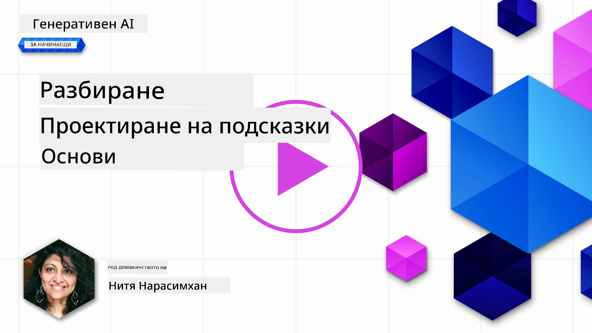
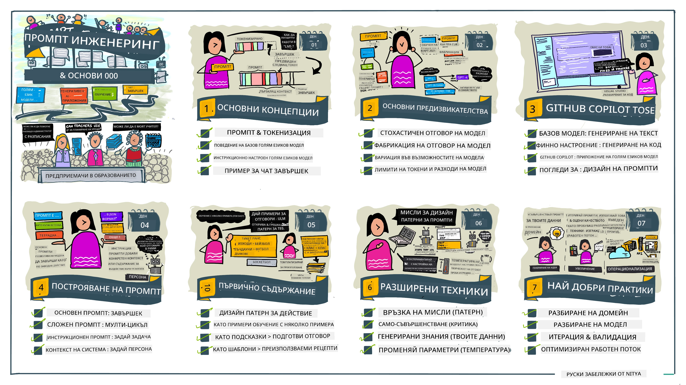
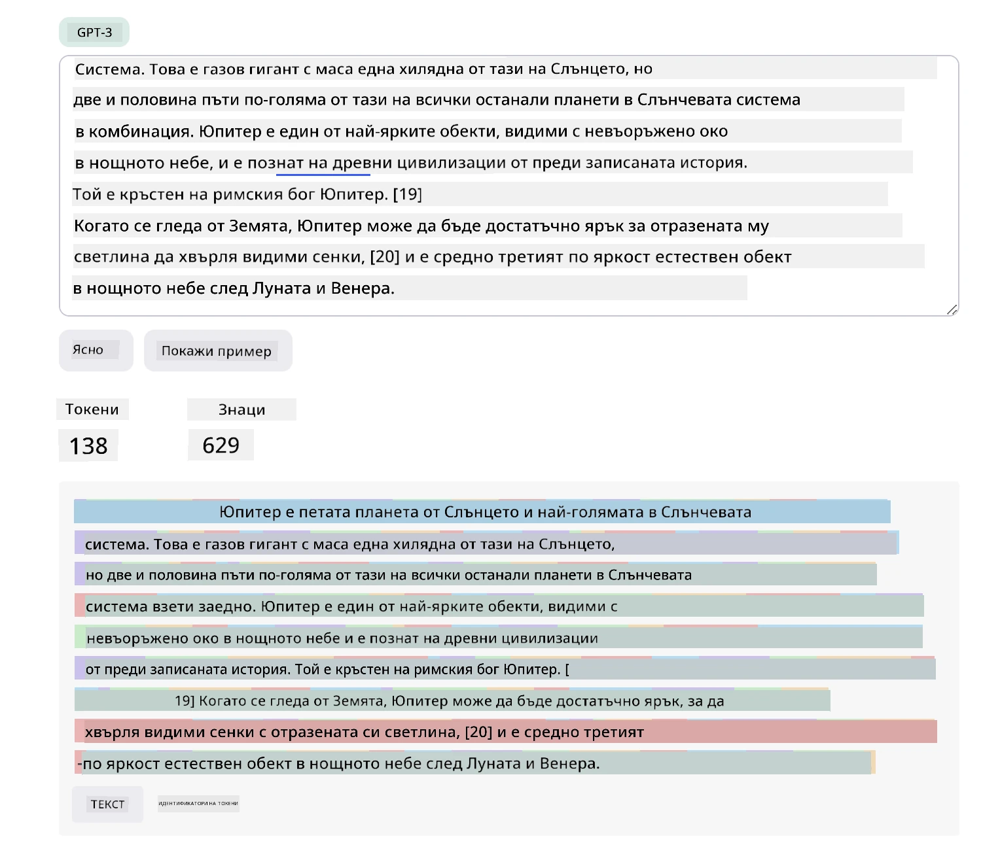
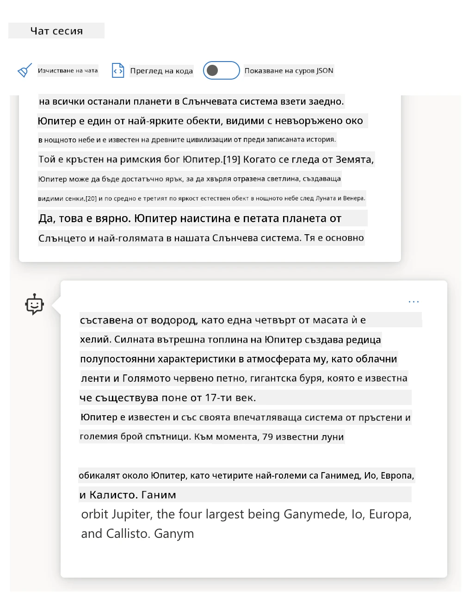
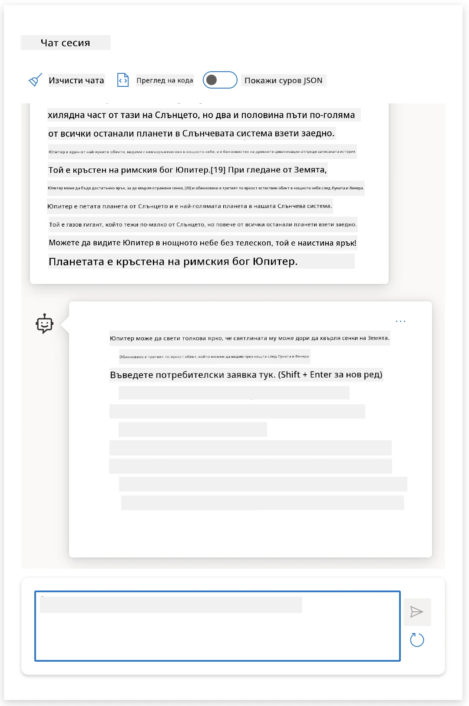
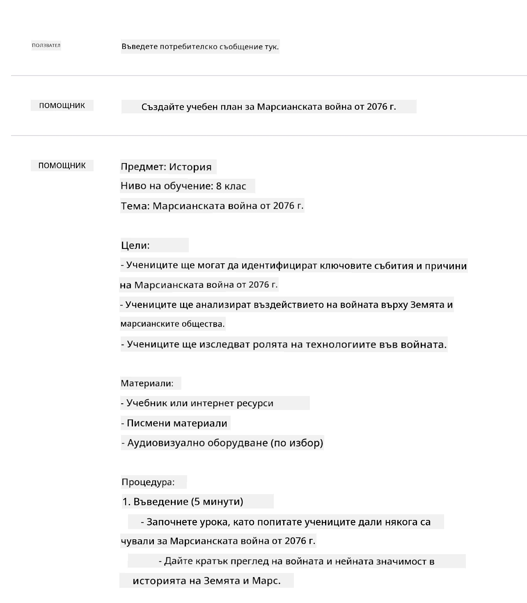
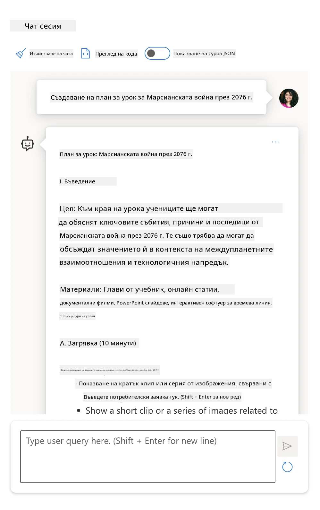
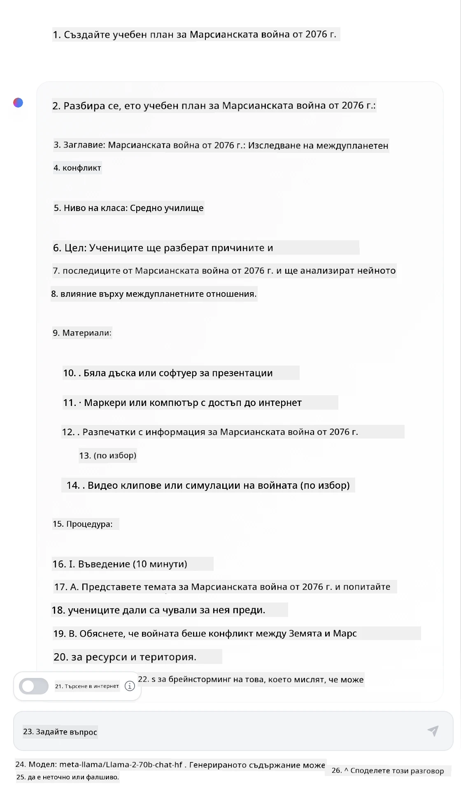

# Основи на проектиране на подсказки

[](https://youtu.be/GElCu2kUlRs?si=qrXsBvXnCW12epb8)

## Въведение
Този модул обхваща основни концепции и техники за създаване на ефективни подсказки в генеративни AI модели. Начинът, по който формулирате подсказката си към голям езиков модел (LLM), също е от значение. Внимателно съставената подсказка може да доведе до по-добро качество на отговора. Но какво всъщност означават термините _подсказка_ и _проектиране на подсказки_? И как мога да подобря _входните_ данни на подсказката, които изпращам към LLM? Това са въпросите, на които ще се опитаме да отговорим в тази и следващата глава.

_Генеративният AI_ е способен да създава ново съдържание (например текст, изображения, аудио, код и др.) в отговор на потребителски заявки. Това се постига чрез използването на _големи езикови модели_ като серията GPT ("Generative Pre-trained Transformer") на OpenAI, които са обучени да работят с естествен език и код.

Потребителите вече могат да взаимодействат с тези модели чрез познати парадигми като чат, без да имат технически опит или обучение. Моделите са _подсказкови_ – потребителите изпращат текстов вход (подсказка) и получават обратно отговора на AI (завършек). Те могат да "чатят с AI" итеративно в многоходови разговори, доусъвършенствайки подсказката си, докато отговорът отговаря на очакванията им.

"Подсказките" сега стават основният _програмен интерфейс_ за генеративни AI приложения, казвайки на моделите какво да правят и влияейки на качеството на върнатите отговори. "Проектирането на подсказки" е бързо развиваща се област на изследване, която се фокусира върху _проектиране и оптимизация_ на подсказки за доставка на последователни и качествени отговори в мащаб.

## Цели на обучението

В този урок ще научим какво е проектиране на подсказки, защо е важно и как да създаваме по-ефективни подсказки за даден модел и цел на приложението. Ще разберем основните концепции и най-добри практики за проектиране на подсказки - и ще се запознаем с интерактивна Jupyter Notebook "пясъчник" среда, в която можем да видим как тези концепции се прилагат на реални примери.

Към края на този урок ще можем да:

1. Обясним какво е проектиране на подсказки и защо е важно.
2. Описваме компонентите на подсказка и как се използват.
3. Научим най-добри практики и техники за проектиране на подсказки.
4. Приложим научените техники върху реални примери, използвайки OpenAI endpoint.

## Ключови термини

Проектиране на подсказки: Практиката на проектиране и усъвършенстване на входни данни за насочване на AI модели към генериране на желани резултати.  
Токенизация: Процесът на преобразуване на текст в по-малки единици, наречени токени, които моделът може да разбере и обработи.  
Инструкционно-обучени LLM: Големи езикови модели (LLM), които са допълнително оптимизирани с конкретни инструкции за подобряване на точността и релевантността на отговорите.

## Пясъчник за обучение

Проектирането на подсказки в момента е повече изкуство, отколкото наука. Най-добрият начин да подобрим интуицията си е да _практикуваме повече_ и да приемем подход "проба-грешка", който комбинира експертиза в приложната област със препоръчани техники и специфични за модела оптимизации.

Jupyter Notebook, съпътстващ този урок, предоставя _пясъчник_ среда, където можете да изпробвате наученото – докато напредвате или като част от кодовото предизвикателство в края. За да изпълните упражненията, ще ви трябват:

1. **Azure OpenAI API ключ** – крайна точка на услугата за разположен LLM.  
2. **Python среда за изпълнение** – в която може да се стартира Notebook-a.  
3. **Локални променливи на средата** – _завършете [SETUP](./../00-course-setup/02-setup-local.md?WT.mc_id=academic-105485-koreyst) стъпките сега, за да сте готови_.

Notebook-а идва със _стартиращи_ упражнения – но сте насърчени да добавяте свои собствени _Markdown_ (описание) и _Code_ (подсказки) секции, за да пробвате повече примери или идеи – и да изградите интуицията си за проектиране на подсказки.

## Илюстрирано ръководство

Искате ли да получите обща представа за това какво обхваща този урок преди да се потопите? Разгледайте това илюстрирано ръководство, което ви дава усещане за основните теми и ключовите изводи, върху които да се замислите във всяка от тях. Пътната карта на урока ви води от разбирането на основните концепции и предизвикателства до справяне с тях чрез подходящи техники и най-добри практики за проектиране на подсказки. Обърнете внимание, че разделът "Разширени техники" в това ръководство се отнася до съдържание, разгледано в _следващата_ глава от този учебен план.



## Нашият стартъп

Сега, нека поговорим как _топикът_ се свързва с мисията на нашия стартъп да [донася AI иновации в образованието](https://educationblog.microsoft.com/2023/06/collaborating-to-bring-ai-innovation-to-education?WT.mc_id=academic-105485-koreyst). Искаме да изградим AI-базирани приложения за _персонализирано обучение_ – затова нека помислим как различните потребители на нашето приложение биха могли да "проектират" подсказки:

- **Администратори** може да поискат от AI да _анализира данни по учебната програма, за да идентифицира пропуски в покритието_. AI може да обобщи резултатите или да ги визуализира с помощта на код.  
- **Преподаватели** може да поискат от AI да _генерира план за урок за определена аудитория и тема_. AI може да създаде персонализирания план в конкретен формат.  
- **Ученици** може да поискат от AI да _ги обучава по труден предмет_. AI сега може да ги води с уроци, подсказки и примери, съобразени с тяхното ниво.

Това е само върхът на айсберга. Вижте [Prompts For Education](https://github.com/microsoft/prompts-for-edu/tree/main?WT.mc_id=academic-105485-koreyst) – библиотека с отворен код, курирана от експерти в образованието – за да получите по-широка представа за възможностите! _Опитайте да пуснете някои от тези подсказки в пясъчника или в OpenAI Playground, за да видите какво се получава!_

<!--
LESSON TEMPLATE:
This unit should cover core concept #1.
Reinforce the concept with examples and references.

CONCEPT #1:
Prompt Engineering.
Define it and explain why it is needed.
-->

## Какво е проектиране на подсказки?

Започнахме този урок, като дефинирахме **проектиране на подсказки** като процес на _проектиране и оптимизиране_ на текстови входове (подсказки) за постигане на последователни и качествени отговори (завършеци) за дадена цел на приложението и модел. Можем да го разглеждаме като двуфазен процес:

- _проектиране_ на първоначалната подсказка за даден модел и цел  
- _усъвършенстване_ на подсказката итеративно за подобряване на качеството на отговора

Това задължително е процес на проба и грешка, който изисква интуиция и усилия от потребителя, за да се постигнат оптимални резултати. Защо е важно? За да отговорим на този въпрос, първо трябва да разберем три концепции:

- _Токенизация_ = как моделът "вижда" подсказката  
- _Основни LLM_ = как основният модел "обработва" подсказка  
- _Инструкционно-обучени LLM_ = как моделът вече може да "вижда задачи"

### Токенизация

LLM вижда подсказките като _последователност от токени_, където различните модели (или версии на един модел) могат да токенизират една и съща подсказка по различен начин. Тъй като LLM са обучени върху токени (а не върху суров текст), начинът, по който подсказките се токенизират, има директно влияние върху качеството на генерирания отговор.

За да получите интуиция как работи токенизацията, опитайте инструменти като [OpenAI Tokenizer](https://platform.openai.com/tokenizer?WT.mc_id=academic-105485-koreyst) показан по-долу. Копирайте своята подсказка и вижте как тя се преобразува в токени, обръщайки внимание на обработката на интервали и пунктуация. Обърнете внимание, че този пример показва по-стар LLM (GPT-3) – затова резултатът може да е различен при по-нов модел.



### Концепция: Основни модели

След като подсказката се токенизира, основната функция на ["Основния LLM"](https://blog.gopenai.com/an-introduction-to-base-and-instruction-tuned-large-language-models-8de102c785a6?WT.mc_id=academic-105485-koreyst) (или Фундаментален модел) е да предсказва следващия токен в тази последователност. Тъй като LLM са обучени върху огромни текстови набори, те имат добра представа за статистическите връзки между токените и могат да направят това предсказание с известна увереност. Обърнете внимание, че те не „разбират“ _значението_ на думите в подсказката или токена; те просто виждат шаблон, който могат да „допълнят“ със следващата си прогноза. Могат да продължат да предсказват последователността, докато потребителят не спре процеса или не се достигне някакво предварително определено условие.

Искате ли да видите как работи завършването на подсказка? Въведете горната подсказка в Azure OpenAI Studio [_Chat Playground_](https://oai.azure.com/playground?WT.mc_id=academic-105485-koreyst) с настройките по подразбиране. Системата е конфигурирана да третира подсказките като заявки за информация – така че ще видите завършек, който удовлетворява този контекст.

Но какво ако потребителят иска да види нещо конкретно, което отговаря на някакви критерии или цел на задачата? Тук на помощ идват _инструкционно-обучените_ LLM.



### Концепция: Инструкционно-обучени LLM

[Инструкционно-обучен LLM](https://blog.gopenai.com/an-introduction-to-base-and-instruction-tuned-large-language-models-8de102c785a6?WT.mc_id=academic-105485-koreyst) започва с основния модел и го допълнително обучава с примери или двойки вход/изход (например многоходови "съобщения"), които могат да съдържат ясни инструкции – а AI отговорът се опитва да следва тези инструкции.

Това използва техники като Обучение чрез подсилване с човешка обратна връзка (RLHF), които могат да научат модела да _следва инструкции_ и да _се учи от обратната връзка_, така че той да произвежда отговори, които са по-подходящи за практични приложения и по-релевантни на целите на потребителите.

Нека опитаме – върнете се към горната подсказка, но сега променете _системното съобщение_, за да осигурите следната инструкция като контекст:

> _Обобщи предоставеното съдържание за ученик от втори клас. Запази резултата в един абзац с 3-5 основни точки._

Виждате ли как резултатът сега е настроен да отразява желаната цел и формат? Един преподавател може директно да използва този отговор в своите слайдове за този клас.



## Защо имаме нужда от проектиране на подсказки?

Сега, след като знаем как LLM обработват подсказки, нека поговорим защо имаме нужда от проектиране на подсказки. Отговорът се крие във факта, че настоящите LLM поставят редица предизвикателства, които правят _надеждното и последователно завършване_ по-трудно за постигане без усилия за конструиране и оптимизация на подсказките. Например:

1. **Отговорите на модела са стохастични.** _Същата подсказка_ вероятно ще генерира различни отговори с различни модели или версии на модел. И може да дава различни резултати с _един и същ модел_ в различни моменти. _Техниките за проектиране на подсказки могат да ни помогнат да минимизираме тези вариации чрез предоставяне на по-добри рамки за контрол_.

1. **Моделите могат да измислят отговори.** Моделите са предварително обучени с _големи, но крайни_ набори данни, което означава, че им липсва знание за концепции извън обхвата на обучението. В резултат те могат да произвеждат завършеци, които са неточни, измислени или директно противоречащи на известни факти. _Техниките за проектиране на подсказки помагат на потребителите да идентифицират и смекчават такива измислици, например чрез искане на цитати или обяснения от AI_.

1. **Възможностите на моделите ще варират.** По-нови модели или поколения на модели ще имат по-богати възможности, но също така ще носят и уникални особености и компромиси по отношение на цена и сложност. _Проектирането на подсказки може да ни помогне да развием най-добри практики и работни потоци, които абстрахират разликите и се адаптират към специфичните изисквания на модела по мащабируем, безпроблемен начин_.

Нека видим това в действие в OpenAI или Azure OpenAI Playground:

- Използвайте една и съща подсказка с различни разполагания на LLM (например OpenAI, Azure OpenAI, Hugging Face) – видяхте ли вариации?  
- Използвайте една и съща подсказка многократно с _едно и също_ разполагане на LLM (например Azure OpenAI playground) – как се различават тези вариации?

### Пример за измислици

В този курс използваме термина **"измислица"** за явлението, когато LLM понякога генерират фактологично неверна информация поради ограничения в обучението или други причини. Може би сте срещали също термина _"халюцинации"_ в популярни статии или изследователски публикации. Въпреки това силно препоръчваме да използвате термина _"измислица"_, за да не антропоморфизираме поведението, приписвайки му човешка черта в резултат, управляван от машина. Това също подкрепя [Отговорни AI насоки](https://www.microsoft.com/ai/responsible-ai?WT.mc_id=academic-105485-koreyst) от гледна точка на терминологията, премахвайки термини, които могат да се считат за обидни или нехетерогенни в някои контексти.

Искате ли да добиете представа как работят измислиците? Помислете за подсказка, която инструктира AI да генерира съдържание за несъществуваща тема (за да сте сигурни, че тя не фигурира в обучителния набор). Например – пробвах тази подсказка:

> **Подсказка:** генерирай план на урок за Марсианската война през 2076.
Уеб търсене ми показа, че има фикционални разкази (напр. телевизионни сериали или книги) за марсиански войни - но никой през 2076 г. Здравият разум също ни подсказва, че 2076 е _в бъдещето_ и следователно не може да се свързва с реално събитие.

Какво се случва, когато изпълним този промпт с различни доставчици на LLM?

> **Отговор 1**: OpenAI Playground (GPT-35)



> **Отговор 2**: Azure OpenAI Playground (GPT-35)



> **Отговор 3**: : Hugging Face Chat Playground (LLama-2)



Както се очаква, всеки модел (или версия на модела) произвежда леко различни отговори благодарение на стохастичното поведение и вариациите в способностите на модела. Например, един модел е насочен към аудитория от 8-ми клас, докато другият предполага ученик от гимназия. Но всички три модела генерираха отговори, които биха могли да убедят невеж потребител, че събитието е реално.

Техники за промпт инженерство като _метапромптинг_ и _конфигуриране на температурата_ могат да намалят измислиците на модела до някаква степен. Нови архитектури за промпт инженерство също така безпроблемно включват нови инструменти и техники в потока на промпта, за да смекчат или намалят някои от тези ефекти.

## Казус: GitHub Copilot

Нека завършим тази секция, като добием представа за това как се използва промпт инженерството в реални решения чрез разглеждане на един казус: [GitHub Copilot](https://github.com/features/copilot?WT.mc_id=academic-105485-koreyst).

GitHub Copilot е твоят "AI партньор-програмист" - той превръща текстови промпти в допълнения на код и е интегриран в средата ти за разработка (напр. Visual Studio Code) за безпроблемно потребителско преживяване. Както е документирано в поредицата блогове по-долу, най-ранната версия е базирана на модела OpenAI Codex - като инженерите бързо осъзнават нуждата да финетюнят модела и да развиват по-добри техники за промпт инженерство, за да подобрят качеството на кода. През юли те [запознаха публиката с подобрен AI модел, който надхвърля Codex](https://github.blog/2023-07-28-smarter-more-efficient-coding-github-copilot-goes-beyond-codex-with-improved-ai-model/?WT.mc_id=academic-105485-koreyst) за още по-бързи предложения.

Прочетете публикациите в ред, за да проследите техния път на учене.

- **Май 2023** | [GitHub Copilot става по-добър в разбирането на твоя код](https://github.blog/2023-05-17-how-github-copilot-is-getting-better-at-understanding-your-code/?WT.mc_id=academic-105485-koreyst)
- **Май 2023** | [Отвътре в GitHub: Работа с LLM-та зад GitHub Copilot](https://github.blog/2023-05-17-inside-github-working-with-the-llms-behind-github-copilot/?WT.mc_id=academic-105485-koreyst).
- **Юни 2023** | [Как да пишеш по-добри промпти за GitHub Copilot](https://github.blog/2023-06-20-how-to-write-better-prompts-for-github-copilot/?WT.mc_id=academic-105485-koreyst).
- **Юли 2023** | [.. GitHub Copilot надминава Codex с подобрен AI модел](https://github.blog/2023-07-28-smarter-more-efficient-coding-github-copilot-goes-beyond-codex-with-improved-ai-model/?WT.mc_id=academic-105485-koreyst)
- **Юли 2023** | [Ръководство за разработчици по промпт инженерство и LLM-та](https://github.blog/2023-07-17-prompt-engineering-guide-generative-ai-llms/?WT.mc_id=academic-105485-koreyst)
- **Септември 2023** | [Как да изградим корпоративно LLM приложение: уроци от GitHub Copilot](https://github.blog/2023-09-06-how-to-build-an-enterprise-llm-application-lessons-from-github-copilot/?WT.mc_id=academic-105485-koreyst)

Можете също така да разгледате техния [Инженерен блог](https://github.blog/category/engineering/?WT.mc_id=academic-105485-koreyst) за повече публикации като [тази](https://github.blog/2023-09-27-how-i-used-github-copilot-chat-to-build-a-reactjs-gallery-prototype/?WT.mc_id=academic-105485-koreyst), която показва как тези модели и техники се _прилагат_ за създаване на реални приложения.

---

## Конструиране на промпти

Видяхме защо промпт инженерството е важно - сега нека разберем как промптите се _конструират_, за да можем да оценим различни техники за по-ефективно проектиране на промпти.

### Основен промпт

Нека започнем с основния промпт: текстов вход, изпратен към модела без друг контекст. Ето пример - когато изпратим първите няколко думи от националния химн на САЩ към OpenAI [Completion API](https://platform.openai.com/docs/api-reference/completions?WT.mc_id=academic-105485-koreyst), той мигновено _завършва_ отговора с следващите няколко реда, илюстрирайки базовото предсказващо поведение.

| Промпт (Вход)     | Завършек (Изход)                                                                                                                        |
| :----------------- | :----------------------------------------------------------------------------------------------------------------------------------------- |
| Oh say can you see | Изглежда, че започваш текста на "The Star-Spangled Banner," националния химн на Съединените щати. Пълният текст е ... |

### Комплексен промпт

Сега нека добавим контекст и инструкции към този основен промпт. [Chat Completion API](https://learn.microsoft.com/azure/ai-services/openai/how-to/chatgpt?WT.mc_id=academic-105485-koreyst) ни позволява да конструираме комплексен промпт като колекция от _съобщения_ с:

- двойки вход/изход, отразяващи входа на _потребителя_ и отговора на _асистента_.
- системно съобщение, задаващо контекста за поведението или личността на асистента.

Заявката сега е във формата по-долу, където _токенизацията_ ефективно улавя релевантна информация от контекста и разговора. Сега, промяната на системния контекст може да бъде толкова въздействаща за качеството на завършеците, колкото и предоставените входове от потребителя.

```python
response = openai.chat.completions.create(
    model="gpt-3.5-turbo",
    messages=[
        {"role": "system", "content": "You are a helpful assistant."},
        {"role": "user", "content": "Who won the world series in 2020?"},
        {"role": "assistant", "content": "The Los Angeles Dodgers won the World Series in 2020."},
        {"role": "user", "content": "Where was it played?"}
    ]
)
```

### Промпт с инструкции

В горните примери потребителският промпт беше прост текстов въпрос, който може да се интерпретира като заявка за информация. С _инструктивни_ промпти можем да използваме този текст, за да уточним задача по-подробно, като предоставим по-добро ръководство за ИИ. Ето пример:

| Промпт (Вход)                                                                                                                                                                                                                         | Завършек (Изход)                                                                                                        | Тип на инструкцията |
| :------------------------------------------------------------------------------------------------------------------------------------------------------------------------------------------------------------------------------------- | :------------------------------------------------------------------------------------------------------------------------- | :------------------ |
| Опишете Гражданската война                                                                                                                                                                                                   | _върна прост параграф_                                                                                              | Прост               |
| Опишете Гражданската война. Посочете ключови дати и събития и опишете тяхното значение                                                                                                                                     | _върна параграф, последван от списък с ключови дати на събития с описания_                                             | Комплексен          |
| Опишете Гражданската война в 1 параграф. Посочете 3 точки с ключови дати и тяхното значение. Посочете още 3 точки с важни исторически личности и техния принос. Върнете изхода като JSON файл | _връща по-обширна информация в текстово поле, форматирано като JSON, което можете да копирате и валидирате при нужда_ | Комплексен. Форматиран. |

## Основно съдържание

В горните примери, промптът все още беше сравнително отворен, позволявайки на LLM да реши коя част от предобучените му данни е релевантна. С дизайн патърна _основно съдържание_ входният текст се разделя на две части:

- инструкция (за действие)
- релевантно съдържание (което влияе на действието)

Ето пример, където инструкцията е "обобщи това в 2 изречения".

| Промпт (Вход)                                                                                                                                                                                                                                                                                                                                                                                                                                                                                                                                                                                                                                                                                      | Завършек (Изход)                                                                                                                                                                                                                                                                             |
| :-------------------------------------------------------------------------------------------------------------------------------------------------------------------------------------------------------------------------------------------------------------------------------------------------------------------------------------------------------------------------------------------------------------------------------------------------------------------------------------------------------------------------------------------------------------------------------------------------------------------------------------------------------------------------------------------------- | :---------------------------------------------------------------------------------------------------------------------------------------------------------------------------------------------------------------------------------------------------------------------------------------------- |
| Юпитер е петата планета от Слънцето и най-голямата в Слънчевата система. Това е газов гигант с маса една хилядна от масата на Слънцето, но два и половина пъти по-голяма от тази на всички останали планети в Слънчевата система взети заедно. Юпитер е един от най-ярките обекти, видими с просто око в нощното небе, и е известен на древните цивилизации още преди писмена история. Наречен е на римския бог Юпитер.[19] Когато се наблюдава от Земята, Юпитер може да бъде достатъчно ярък, за да хвърля видими сенки,[20] и средно е третият най-ярък природен обект в нощното небе след Луната и Венера. <br/> **Обобщи това в 2 кратки изречения** | Юпитер, петата планета от Слънцето, е най-голямата в Слънчевата система и е познат като един от най-ярките обекти в нощното небе. Наречен на римския бог Юпитер, той е газов гигант с маса два и половина пъти на всички останали планети в Слънчевата система взети заедно. |

Сегментът основно съдържание може да се използва по различни начини за по-ефективни инструкции:

- **Примери** - вместо да се казва на модела какво да прави чрез явна инструкция, му се дават примери за това какво да прави и се оставя той да извлече модела.
- **Подсказки** - след инструкцията се добавя "подсказка", която подготвя завършека, насочвайки модела към по-релевантни отговори.
- **Шаблони** - това са повтарящи се "рецепти" за промпти с плейсхолдъри (променливи), които могат да се персонализират с данни за конкретни случаи на употреба.

Нека разгледаме тези подходи в действие.

### Използване на примери

Това е подход, при който използваме основното съдържание, за да „храним модела“ с няколко примера за желания изход при дадена инструкция и го оставяме да извлече модела за желания изход. В зависимост от броя на предоставените примери, можем да имаме zero-shot промптинг, one-shot промптинг, few-shot промптинг и др.

Промптът сега се състои от три компонента:

- Описание на задачата
- Няколко примера за желания изход
- Начало на нов пример (който става имплицитно описание на задача)

| Тип на учене | Промпт (Вход)                                                                                                                                        | Завършек (Изход)         |
| :------------ | :---------------------------------------------------------------------------------------------------------------------------------------------------- | :-------------------------- |
| Zero-shot     | "Слънцето грее". Преведи на испански                                                                                                            | "El Sol está brillando".    |
| One-shot      | "Слънцето грее" => ""El Sol está brillando". <br> "Е студено и ветровито" =>                                                                 | "Es un día frío y ventoso". |
| Few-shot      | Играчът пробяга базите => Бейзбол <br/> Играчът направи ас => Тенис <br/> Играчът направи шестица => Крикет <br/> Играчът направи слем-данк => | Баскетбол                  |
|               |                                                                                                                                                       |                             |

Забележете как при zero-shot промптинга трябваше да дадем явна инструкция („Преведи на испански“), а в примера с one-shot тя се подразбира. Примерът с few-shot показва как добавянето на повече примери позволява на моделите да правят по-точни извличания, без допълнителни инструкции.

### Подсказки в промпта

Друга техника за използване на основно съдържание е да се предоставят _подсказки_, вместо примери. В този случай ние даваме на модела насока, като _започваме_ с откъс, който отразява желания формат на отговора. След това моделът „схваща подсказката“ и продължава в същия стил.

| Брой подсказки | Промпт (Вход)                                                                                                                                                                                                                                                                                                                                                                                                                                               | Завършек (Изход)                                                                                                                                                                                                                                                                                       |
| :------------- | :----------------------------------------------------------------------------------------------------------------------------------------------------------------------------------------------------------------------------------------------------------------------------------------------------------------------------------------------------------------------------------------------------------------------------------------------------------- | :-------------------------------------------------------------------------------------------------------------------------------------------------------------------------------------------------------------------------------------------------------------------------------------------------------- |
| 0              | Юпитер е петата планета от Слънцето и най-голямата в Слънчевата система. Това е газов гигант с маса една хилядна от масата на Слънцето, но два и половина пъти по-голяма от тази на всички останали планети в Слънчевата система взети заедно. Юпитер е един от най-ярките обекти, видими с просто око в нощното небе, и е известен на древните цивилизации още преди писмена история. <br/>**Обобщи това**                                       | Юпитер е най-голямата планета в нашата Слънчева система и петата от Слънцето. Той е газов гигант с маса 1/1000 от масата на Слънцето, но тежи повече от всички останали планети взети заедно. Древните цивилизации познават Юпитер отдавна и той е лесно видим в нощното небе. |
| 1              | Юпитер е петата планета от Слънцето и най-голямата в Слънчевата система. Той е газов гигант с маса една хилядна от тази на Слънцето, но два и половина пъти по-голяма от масата на всички останали планети в Слънчевата система взети заедно. Юпитер е един от най-ярките обекти, видими с невъоръжено око на нощното небе, и е известен на древните цивилизации още преди записана история. <br/>**Обобщи това** <br/> Това, което научихме, е че Юпитер | е петата планета от Слънцето и най-голямата в Слънчевата система. Той е газов гигант с маса една хилядна от тази на Слънцето, но два и половина пъти по-голяма от масата на всички останали планети взети заедно. Лесно се вижда с невъоръжено око и е известен от древни времена.                        |
| 2              | Юпитер е петата планета от Слънцето и най-голямата в Слънчевата система. Той е газов гигант с маса една хилядна от тази на Слънцето, но два и половина пъти по-голяма от масата на всички останали планети в Слънчевата система взети заедно. Юпитер е един от най-ярките обекти, видими с невъоръжено око на нощното небе, и е известен на древните цивилизации още преди записана история. <br/>**Обобщи това** <br/> Топ 3 факта, които научихме:         | 1. Юпитер е петата планета от Слънцето и най-голямата в Слънчевата система. <br/> 2. Той е газов гигант с маса една хилядна от тази на Слънцето...<br/> 3. Юпитер се вижда с невъоръжено око още от древни времена...                                                                       |
|                |                                                                                                                                                                                                                                                                                                                                                                                                                                                              |                                                                                                                                                                                                                                                                                                           |

### Примерни шаблони за заявки

Шаблон за заявка е _предварително дефинирана рецепта за заявка_, която може да се съхранява и използва повторно при необходимост, за да осигури по-последователен потребителски опит в мащаб. В най-простата си форма, това е просто колекция от примери за заявки като [този от OpenAI](https://cookbook.openai.com/examples/gpt4-1_prompting_guide?WT.mc_id=academic-105485-koreyst), който предоставя както интерактивни компоненти за заявка (съобщения от потребител и система), така и API-базиран формат на заявки - за да се подпомогне повторната употреба.

В по-сложната си форма, като [този пример от LangChain](https://python.langchain.com/docs/concepts/prompt_templates/?WT.mc_id=academic-105485-koreyst), съдържа _запълващи места_, които могат да бъдат заменяни с данни от разнообразни източници (въвеждане от потребителя, контекст на системата, външни източници на данни и др.) за динамично генериране на заявка. Това позволява да се създаде библиотека от многократно използваеми заявки, които могат да се използват за управление на последователния потребителски опит **програмно** в голям мащаб.

Накрая, реалната стойност на шаблоните е в способността да създават и публикуват _библиотеки с заявки_ за специфични приложения - където шаблонът за заявка сега е _оптимизиран_, за да отразява контекст или примери, специфични за приложението, които правят отговорите по-релевантни и точни за целевата аудитория. Репозитория [Prompts For Edu](https://github.com/microsoft/prompts-for-edu?WT.mc_id=academic-105485-koreyst) е отличен пример за този подход, съсредоточавайки се върху библиотеки с заявки за образователния домейн с акцент върху ключови цели като планиране на уроци, проектиране на учебни програми, наставничество на студенти и др.

## Допълнително съдържание

Ако разгледаме конструкцията на заявка като съставена от инструкция (задача) и цел (основно съдържание), тогава _вторичното съдържание_ е като допълнителен контекст, който предоставяме, за да **въздействаме по някакъв начин на изхода**. Това могат да бъдат параметри за настройка, инструкции за форматиране, тематични таксономии и др., които помагат на модела да _адаптира_ отговора си за постигане на желаните цели и очаквания на потребителя.

Например: Като разполагаме с каталог на курсове с обширни метаданни (име, описание, ниво, мета маркери, преподавател и др.) за всички курсове в учебната програма:

- можем да дефинираме инструкция за "обобщаване на каталога за есенния семестър 2023"
- да използваме основното съдържание за предоставяне на няколко примера на желания резултат
- да използваме вторичното съдържание за идентифициране на топ 5 "тагове" от интерес.

Тогава моделът може да предостави обобщение във формата, показан от примери - но ако даден резултат има множество тагове, може да приоритизира 5-те тагове, идентифицирани във вторичното съдържание.

---

<!--
LESSON TEMPLATE:
Този раздел трябва да обхване основната концепция #1.
Укрепване на концепцията с примери и препратки.

КОНЦЕПТ #3:
Техники за създаване на заявки.
Какви са някои основни техники за създаване на заявки?
Илюстрирайте с упражнения.
-->

## Най-добри практики при създаване на заявки

Сега, когато знаем как могат да се _конструират_ заявки, можем да започнем да мислим как да ги _проектираме_ с най-добри практики. Можем да разграничим това в две части - да имаме правилния _ментален подход_ и да прилагаме подходящите _техники_.

### Ментален подход при създаване на заявки

Създаването на заявки е процес на проба и грешка, затова имайте предвид трите важни фактора:

1. **Разбирането на домейна има значение.** Точността и релевантността на отговора са функция на _домейна_, в който се използва приложението или потребителят. Прилагайте своята интуиция и експертни знания в домейна, за да **настроите техниките** допълнително. Например, дефинирайте _личности, специфични за домейна_ в системните си заявки или използвайте _шаблони, специфични за домейна_ в потребителските заявки. Осигурявайте вторично съдържание, което отразява контексти специфични за домейна, или използвайте _подсказки и примери, специфични за домейна_, за да насочите модела към познати модели на използване.

2. **Разбирането на модела има значение.** Знаем, че моделите са стохастични по природа. Но имплементациите на модели могат също да варират по отношение на използвания набор от обучителни данни (предварително обучени знания), предоставените възможности (напр. чрез API или SDK) и типа съдържание, за което са оптимизирани (напр. код, изображения, текст). Разберете силните и слабите страни на използвания модел и използвайте тези знания, за да _приоритизирате задачи_ или да създавате _персонализирани шаблони_, оптимизирани за възможностите на модела.

3. **Итерации и валидиране са важни.** Моделите се развиват бързо, както и техниките за създаване на заявки. Като експерт в домейна, вие може да имате друг контекст или критерии за _вашето_ конкретно приложение, които не са приложими към по-широката общност. Използвайте инструменти и техники за създаване на заявки, за да "стартирате" конструкцията на заявка, след което итерайте и валидирайте резултатите с ваша собствена интуиция и експертни знания в домейна. Записвайте прозренията си и създавайте **база от знания** (напр. библиотеки с заявки), която да бъде използвана като нова отправна точка от други за по-бързи итерации в бъдеще.

## Най-добри практики

Сега нека разгледаме общите най-добри практики, препоръчани от [OpenAI](https://help.openai.com/en/articles/6654000-best-practices-for-prompt-engineering-with-openai-api?WT.mc_id=academic-105485-koreyst) и [Azure OpenAI](https://learn.microsoft.com/azure/ai-services/openai/concepts/prompt-engineering#best-practices?WT.mc_id=academic-105485-koreyst) специалисти.

| Какво                              | Защо                                                                                                                                                                                                                                               |
| :-------------------------------- | :------------------------------------------------------------------------------------------------------------------------------------------------------------------------------------------------------------------------------------------------ |
| Оценявайте най-новите модели.       | Новите поколения модели вероятно имат подобрени функции и качество - но могат да имат и по-високи разходи. Оценете ги за ефективност и направете решения за миграция.                                                                                 |
| Разделяйте инструкции и контекст   | Проверете дали вашият модел/доставчик дефинира _разделители_ за по-ясно разграничаване на инструкции, основно и вторично съдържание. Това може да помогне на моделите да приоритизират токени по-точно.                                               |
| Бъдете конкретни и ясни             | Давайте повече подробности за желания контекст, резултат, дължина, формат, стил и др. Това подобрява качеството и последователността на отговорите. Записвайте рецепти в многократно използваеми шаблони.                                           |
| Бъдете описателни, използвайте примери      | Моделите могат по-добре да отговарят на подход "покажи и разкажи". Започнете с `zero-shot` подход, където давате инструкция (без примери), после опитайте `few-shot` за уточнение, като предоставите няколко примера на желания резултат. Използвайте аналогии. |
| Използвайте подсказки за началото на отговора | Подсказвайте към желан резултат, като дадете начални думи или фрази, които моделът може да използва като отправна точка за отговора.                                                                                                               |
| Удвоете усилията                       | Понякога трябва да повторите инструкцията си на модела. Давайте инструкции преди и след основното съдържание, използвайте инструкция и подсказка и др. Итерайте и валидирайте, за да разберете какво работи.                                           |
| Поръчката има значение                     | Последователността, в която представяте информацията на модела, може да влияе на изхода, дори в примерите за обучение, поради ефект на прясност. Опитайте различни варианти, за да видите какво дава най-добри резултати.                                 |
| Дайте на модела “изход”           | Осигурете на модела _резервен_ отговор, който да подаде, ако не може да изпълни задачата по някаква причина. Това намалява шансовете за генериране на неверни или измислени отговори.                                                                |
|                                   |                                                                                                                                                                                                                                                   |

Както при всяка най-добра практика, помнете, че _вашият опит може да се различава_ в зависимост от модела, задачата и домейна. Ползвайте тези насоки като отправна точка и итерайте, за да откриете кое работи най-добре за вас. Постоянно преоценявайте процеса на създаване на заявки с появата на нови модели и инструменти, фокусирайки се върху мащабируемост на процеса и качество на отговорите.

<!--
LESSON TEMPLATE:
Този раздел трябва да предложи предизвикателство с код, ако е приложимо

ПРЕДИЗВИКАТЕЛСТВО:
Връзка към Jupyter Notebook с инструкции само като коментари по кода (кодът е празен).

РЕШЕНИЕ:
Връзка към копие на този Notebook с попълнени заявки и изпълнен код, показващо примерен резултат.
-->

## Задача

Поздравления! Достигнахте края на урока! Време е да проверите някои от тези концепции и техники с реални примери!

За нашата задача ще използваме Jupyter Notebook с упражнения, които можете да решавате интерактивно. Можете също да разширите Notebook с ваши собствени Markdown и кодови клетки, за да изследвате идеи и техники самостоятелно.

### За да започнете, форкайте репото и след това

- (Препоръчително) Стартирайте GitHub Codespaces
- (Алтернативно) Клонирайте репото на локално устройство и го използвайте с Docker Desktop
- (Алтернативно) Отворете Notebook в предпочитаната от вас среда за изпълнение.

### След това конфигурирайте променливите на средата

- Копирайте файла `.env.copy` в главната директория на репото като `.env` и попълнете стойностите за `AZURE_OPENAI_API_KEY`, `AZURE_OPENAI_ENDPOINT` и `AZURE_OPENAI_DEPLOYMENT`. Върнете се към раздела [Learning Sandbox](#пясъчник-за-обучение), за да научите как.

### След това отворете Jupyter Notebook

- Изберете средата за изпълнение (runtime kernel). Ако използвате опции 1 или 2, просто изберете стандартния Python 3.10.x kernel, предоставен от dev контейнера.

Готови сте да изпълнявате упражненията. Имайте предвид, че няма “правилни и грешни” отговори тук - просто изследвате опции чрез проба и грешка, изграждайки интуиция за това кое работи за даден модел и конкретната задача.

_Поради тази причина в този урок няма сегменти с решения на код. Вместо това Notebook има Markdown клетки със заглавие "Моето решение:", които показват един примерен изход за справка._

 <!--
LESSON TEMPLATE:
Увийте секцията с резюме и ресурси за учене самостоятелно.
-->

## Проверка на знанията

Коя от следните заявки е добра, следвайки разумни най-добри практики?

1. Покажи ми изображение на червена кола
2. Покажи ми изображение на червена кола марка Volvo и модел XC90 паркирана до скала при залязващо слънце
3. Покажи ми изображение на червена кола марка Volvo и модел XC90

О: 2 е най-добрата заявка, защото предоставя детайли за „какво“ и влиза в специфики (не просто кола, а конкретна марка и модел) и също описва цялостната обстановка. 3 е следващата най-добра, тъй като също съдържа много описание.

## 🚀 Предизвикателство

Опитайте да приложите техниката „подсказка“ с тази заявка: Допълнете изречението "Покажи ми изображение на червена кола марка Volvo и ". Какъв е отговорът и как бихте го подобрили?

## Отлична работа! Продължете да учите

Искате ли да научите повече за различни концепции в създаването на заявки? Отворете [страницата за продължаващо обучение](https://aka.ms/genai-collection?WT.mc_id=academic-105485-koreyst), за да намерите други полезни ресурси по тази тема.

Посетете урок 5, където ще разгледаме [напреднали техники за създаване на заявки](../05-advanced-prompts/README.md?WT.mc_id=academic-105485-koreyst)!

---

<!-- CO-OP TRANSLATOR DISCLAIMER START -->
**Отказ от отговорност**:
Този документ е преведен с помощта на AI преводачески услуга [Co-op Translator](https://github.com/Azure/co-op-translator). Въпреки че се стремим към точност, моля имайте предвид, че автоматизираните преводи могат да съдържат грешки или неточности. Оригиналният документ на неговия роден език трябва да се счита за авторитетен източник. За критична информация се препоръчва професионален човешки превод. Ние не носим отговорност за каквито и да е недоразумения или неправилни тълкувания, произтичащи от използването на този превод.
<!-- CO-OP TRANSLATOR DISCLAIMER END -->