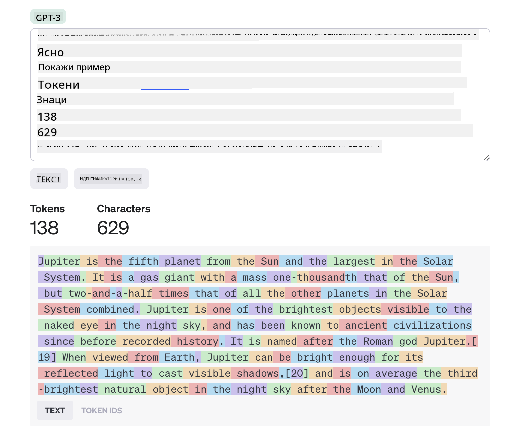
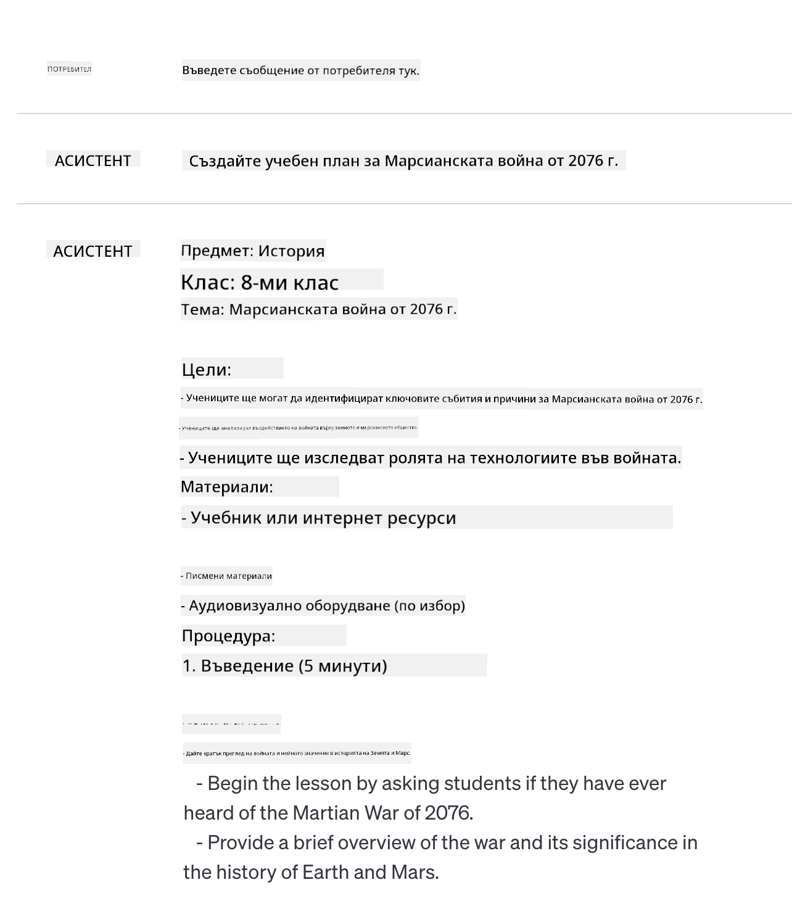
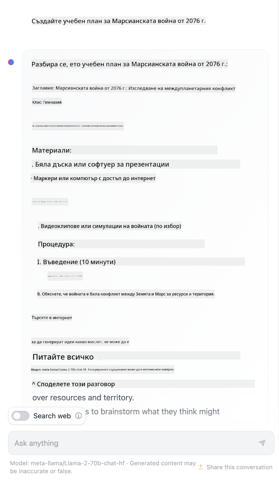

<!--
CO_OP_TRANSLATOR_METADATA:
{
  "original_hash": "a45c318dc6ebc2604f35b8b829f93af2",
  "translation_date": "2025-07-09T11:05:09+00:00",
  "source_file": "04-prompt-engineering-fundamentals/README.md",
  "language_code": "bg"
}
-->
# Основи на Prompt Engineering

[](https://aka.ms/gen-ai-lesson4-gh?WT.mc_id=academic-105485-koreyst)

## Въведение  
Този модул обхваща основни концепции и техники за създаване на ефективни prompt-и в генеративни AI модели. Начинът, по който формулирате prompt към LLM, също има значение. Внимателно създаден prompt може да доведе до по-качествен отговор. Но какво точно означават термините _prompt_ и _prompt engineering_? И как да подобрим prompt _входа_, който изпращаме към LLM? Това са въпросите, на които ще се опитаме да отговорим в тази и следващата глава.

_Генеративният AI_ е способен да създава ново съдържание (например текст, изображения, аудио, код и др.) в отговор на потребителски заявки. Това се постига чрез _големи езикови модели_ като серията GPT на OpenAI ("Generative Pre-trained Transformer"), които са обучени да работят с естествен език и код.

Потребителите вече могат да взаимодействат с тези модели чрез познати парадигми като чат, без да имат технически познания или обучение. Моделите са _prompt-базирани_ – потребителите изпращат текстов вход (prompt) и получават AI отговор (completion). След това могат да "чатят с AI" итеративно, в многократни разговори, като усъвършенстват prompt-а, докато отговорът отговаря на очакванията им.

"Prompt-ите" вече са основният _програмен интерфейс_ за генеративни AI приложения, като казват на моделите какво да правят и влияят върху качеството на върнатите отговори. "Prompt Engineering" е бързо развиваща се област, която се фокусира върху _проектирането и оптимизацията_ на prompt-и, за да се постигнат последователни и качествени отговори в голям мащаб.

## Цели на обучението

В този урок ще научим какво е Prompt Engineering, защо е важно и как да създаваме по-ефективни prompt-и за даден модел и цел на приложението. Ще разберем основните концепции и добри практики за prompt engineering – и ще се запознаем с интерактивна среда в Jupyter Notebooks, където можем да видим тези концепции приложени на реални примери.

Към края на урока ще можем да:

1. Обясним какво е prompt engineering и защо е важно.
2. Описваме компонентите на един prompt и как се използват.
3. Научим добри практики и техники за prompt engineering.
4. Приложим научените техники на реални примери, използвайки OpenAI endpoint.

## Ключови термини

Prompt Engineering: Практиката на проектиране и усъвършенстване на входни данни, които насочват AI моделите към генериране на желаните изходи.  
Tokenization: Процесът на преобразуване на текст в по-малки единици, наречени токени, които моделът може да разбира и обработва.  
Instruction-Tuned LLMs: Големи езикови модели (LLMs), които са допълнително обучени с конкретни инструкции, за да подобрят точността и релевантността на отговорите си.

## Среда за обучение

Prompt engineering в момента е по-скоро изкуство, отколкото наука. Най-добрият начин да подобрим интуицията си е да _практикуваме повече_ и да възприемем подход на проба-грешка, който комбинира експертиза в приложната област с препоръчани техники и оптимизации, специфични за модела.

Jupyter Notebook, който придружава този урок, предоставя _sandbox_ среда, където можете да изпробвате наученото – докато учите или като част от кодовото предизвикателство в края. За да изпълните упражненията, ще ви трябват:

1. **API ключ за Azure OpenAI** – крайна точка на услугата за разположен LLM.  
2. **Python Runtime** – среда, в която може да се изпълнява Notebook-а.  
3. **Локални променливи на средата** – _завършете стъпките от [SETUP](./../00-course-setup/SETUP.md?WT.mc_id=academic-105485-koreyst), за да сте готови_.

Notebook-ът съдържа _начални_ упражнения, но ви се препоръчва да добавяте свои собствени _Markdown_ (описания) и _Code_ (заявки към prompt) секции, за да изпробвате повече примери или идеи и да развиете интуицията си за проектиране на prompt-и.

## Илюстрирано ръководство

Искате ли да получите обща представа за темите, които този урок обхваща, преди да започнете? Вижте това илюстрирано ръководство, което ви дава усещане за основните теми и ключовите изводи, върху които да се замислите във всяка от тях. Пътната карта на урока ви води от разбирането на основните концепции и предизвикателства до справянето с тях чрез съответните техники и добри практики в prompt engineering. Обърнете внимание, че разделът "Разширени техники" в това ръководство се отнася до съдържание, разгледано в _следващата_ глава на този курс.


## Нашият стартъп

Сега нека поговорим как _този урок_ се свързва с мисията на нашия стартъп да [донесем AI иновации в образованието](https://educationblog.microsoft.com/2023/06/collaborating-to-bring-ai-innovation-to-education?WT.mc_id=academic-105485-koreyst). Искаме да изградим AI-базирани приложения за _персонализирано обучение_ – затова нека помислим как различните потребители на нашето приложение биха "проектирали" prompt-и:

- **Администратори** могат да поискат от AI да _анализира учебните планове, за да идентифицира пропуски в покритието_. AI може да обобщи резултатите или да ги визуализира с код.  
- **Учители** могат да поискат от AI да _генерира учебен план за целева аудитория и тема_. AI може да създаде персонализиран план в зададен формат.  
- **Ученици** могат да поискат от AI да _ги обучава по труден предмет_. AI може да ги води с уроци, подсказки и примери, съобразени с тяхното ниво.

Това е само върхът на айсберга. Разгледайте [Prompts For Education](https://github.com/microsoft/prompts-for-edu/tree/main?WT.mc_id=academic-105485-koreyst) – отворена библиотека с prompt-и, курирана от експерти в образованието – за да получите по-широка представа за възможностите! _Опитайте да изпълните някои от тези prompt-и в sandbox средата или в OpenAI Playground, за да видите какво се случва!_

<!--  
LESSON TEMPLATE:  
This unit should cover core concept #1.  
Reinforce the concept with examples and references.  

CONCEPT #1:  
Prompt Engineering.  
Define it and explain why it is needed.  
-->

## Какво е Prompt Engineering?

Започнахме този урок с дефиниция на **Prompt Engineering** като процес на _проектиране и оптимизиране_ на текстови входове (prompt-и), за да се постигнат последователни и качествени отговори (completion-и) за дадена цел на приложението и модел. Можем да го разгледаме като двуфазен процес:

- _проектиране_ на първоначалния prompt за даден модел и цел  
- _усъвършенстване_ на prompt-а итеративно, за да се подобри качеството на отговора

Това задължително е процес на проба и грешка, който изисква интуиция и усилия от страна на потребителя, за да се постигнат оптимални резултати. Защо е важно? За да отговорим, първо трябва да разберем три концепции:

- _Tokenization_ = как моделът "вижда" prompt-а  
- _Base LLMs_ = как основният модел "обработва" prompt-а  
- _Instruction-Tuned LLMs_ = как моделът вече може да разбира "задачи"

### Tokenization

LLM вижда prompt-ите като _последователност от токени_, като различните модели (или версии на модел) могат да токенизират един и същ prompt по различен начин. Тъй като LLM са обучени върху токени (а не върху суров текст), начинът, по който prompt-ите се токенизират, има пряко влияние върху качеството на генерирания отговор.

За да добиете представа как работи токенизацията, опитайте инструменти като [OpenAI Tokenizer](https://platform.openai.com/tokenizer?WT.mc_id=academic-105485-koreyst), показан по-долу. Копирайте своя prompt и вижте как той се преобразува в токени, като обърнете внимание как се третират интервалите и пунктуацията. Обърнете внимание, че този пример показва по-стар LLM (GPT-3) – затова при по-нов модел резултатът може да е различен.



### Концепция: Основни модели

След като prompt-ът е токенизиран, основната функция на ["Base LLM"](https://blog.gopenai.com/an-introduction-to-base-and-instruction-tuned-large-language-models-8de102c785a6?WT.mc_id=academic-105485-koreyst) (или основния модел) е да предскаже следващия токен в тази последователност. Тъй като LLM са обучени върху огромни текстови набори, те имат добра представа за статистическите връзки между токените и могат да направят тази прогноза с известна увереност. Обърнете внимание, че те не разбират _значението_ на думите в prompt-а или токена; те просто виждат модел, който могат да "допълнят" с следващата си прогноза. Могат да продължат да предсказват последователността, докато не бъдат прекъснати от потребителя или някакво предварително зададено условие.

Искате ли да видите как работи завършването на prompt? Въведете горния prompt в Azure OpenAI Studio [_Chat Playground_](https://oai.azure.com/playground?WT.mc_id=academic-105485-koreyst) с настройките по подразбиране. Системата е конфигурирана да третира prompt-ите като заявки за информация – така че трябва да видите отговор, който отговаря на този контекст.

Но какво ако потребителят иска да види нещо конкретно, което отговаря на някакви критерии или цел на задачата? Тук на помощ идват _instruction-tuned_ LLM.


### Концепция: Instruction Tuned LLMs

[Instruction Tuned LLM](https://blog.gopenai.com/an-introduction-to-base-and-instruction-tuned-large-language-models-8de102c785a6?WT.mc_id=academic-105485-koreyst) започва с основния модел и го дообучава с примери или входно/изходни двойки (например многократни "съобщения"), които съдържат ясни инструкции – и AI отговорът се опитва да следва тези инструкции.

Това използва техники като Reinforcement Learning with Human Feedback (RLHF), които обучават модела да _следва инструкции_ и да _се учи от обратна връзка_, така че да генерира отговори, по-подходящи за практическо приложение и по-релевантни на целите на потребителя.

Нека опитаме – върнете се към горния prompt, но сега променете _system message_, за да предоставите следната инструкция като контекст:

> _Обобщи предоставеното съдържание за ученик от втори клас. Запази резултата в един параграф с 3-5 основни точки._

Виждате ли как резултатът вече е настроен да отразява желаната цел и формат? Учителят може директно да използва този отговор в своите слайдове за урока.


## Защо ни трябва Prompt Engineering?

Сега, когато знаем как LLM обработват prompt-ите, нека поговорим за _защо_ ни трябва prompt engineering. Отговорът се крие в това, че настоящите LLM имат редица предизвикателства, които правят постигането на _надеждни и последователни отговори_ по-трудно без усилия за конструиране и оптимизация на prompt-а. Например:

1. **Отговорите на модела са стохастични.** _Същият prompt_ вероятно ще генерира различни отговори с различни модели или версии на модел. И може дори да даде различни резултати с _един и същ модел_ в различно време. _Техниките за prompt engineering могат да ни помогнат да минимизираме тези вариации, като осигурят по-добри насоки_.

2. **Моделите могат да измислят отговори.** Моделите са предварително обучени с _големи, но ограничени_ набори от данни, което означава, че им липсва знание за концепции извън този обхват. В резултат могат да генерират отговори, които са неточни, измислени или директно противоречащи на известни факти. _Техниките за prompt engineering помагат на потребителите да идентифицират и намалят такива измислици, например като поискат цитати или обосновка от AI_.

3. **Възможностите на моделите варират.** По-новите модели или поколения модели имат по-богати възможности, но също така носят уникални особености и компромиси по отношение на цена и сложност. _Prompt engineering може да ни помогне да разработим добри практики и работни процеси, които абстрахират разликите и се адаптират към специфичните изисквания на модела по мащабируем и безпроблемен начин_.

Нека видим това в действие в OpenAI или Azure OpenAI Playground:

- Използвайте един и същ prompt с различни разполагания на LLM (например OpenAI, Azure OpenAI, Hugging Face) – забелязахте ли вариации?  
- Използвайте един и същ prompt многократно с _един и същ_ LLM (например Azure OpenAI playground) – как се различаваха тези вариации?

### Пример за измислици

В този курс използваме термина **"fabrication"** (измислица), за да опишем явлението, при което LLM понякога генерират фактически неточна информация поради ограничения в обучението или други фактори. Може би сте чували това наричано _"халюцинации"_ в популярни статии или научни публикации. Въпреки това силно препоръчваме да използвате термина _"fabrication"_, за да не приписваме човешки черти на машинен резултат. Това също подкрепя [Принципите за отговорен AI](https://www.microsoft.com/ai/responsible-ai?WT.mc_id=academic-105485-koreyst) от гледна точка на терминологията, като премахва термини, които могат да се възприемат като обидни или неинклузивни в някои контексти.

Искате ли да добиете представа как работят измислиците? Помислете за prompt, който инструктира AI да генерира съдържание за несъществуваща тема (за да сте сигурни, че не е намерена в обучителния набор). Например – аз опитах този prompt:
# План на урока: Войната на Марс през 2076 г.

## Въведение
- Кратък преглед на историческия контекст преди Войната на Марс.
- Обсъждане на причините, довели до конфликта през 2076 г.

## Основни събития
- Хронология на ключовите битки и събития по време на войната.
- Важни фигури и техните роли в конфликта.

## Технологии и оръжия
- Представяне на новите технологии, използвани в битките.
- Анализ на влиянието на технологичния напредък върху хода на войната.

## Последствия
- Въздействието на войната върху човечеството и колониите на Марс.
- Политически и социални промени след конфликта.

## Дискусия и анализ
- Обсъждане на уроците, които можем да научим от Войната на Марс.
- Възможни алтернативни сценарии и техните последствия.

## Задачи за учениците
- Напишете есе за причините и последствията от Войната на Марс.
- Подгответе презентация за една от ключовите битки.
- Дискутирайте ролята на технологиите в съвременните конфликти.

## Заключение
- Обобщение на основните точки от урока.
- Отворена дискусия и въпроси от учениците.
Уеб търсене ми показа, че има фикционални разкази (например телевизионни сериали или книги) за марсиански войни – но нито един от 2076 г. Здравият разум също ни подсказва, че 2076 е _в бъдещето_ и следователно не може да се свързва с реално събитие.

Какво се случва, когато изпълним този prompt с различни доставчици на LLM?

> **Отговор 1**: OpenAI Playground (GPT-35)



> **Отговор 2**: Azure OpenAI Playground (GPT-35)


> **Отговор 3**: : Hugging Face Chat Playground (LLama-2)



Както се очаква, всеки модел (или версия на модела) дава леко различни отговори благодарение на стохастичното поведение и вариациите в способностите на модела. Например, един модел е насочен към аудитория от 8 клас, докато друг предполага ученик в гимназията. Но всички три модела генерираха отговори, които биха могли да убедят неподготвен потребител, че събитието е реално.

Техники за prompt engineering като _метапромптиране_ и _настройка на температурата_ могат до известна степен да намалят измислиците на модела. Новите _архитектури_ за prompt engineering също интегрират нови инструменти и техники безпроблемно в потока на prompt-а, за да смекчат или намалят някои от тези ефекти.

## Казус: GitHub Copilot

Нека завършим този раздел, като добием представа как prompt engineering се използва в реални решения, разглеждайки един казус: [GitHub Copilot](https://github.com/features/copilot?WT.mc_id=academic-105485-koreyst).

GitHub Copilot е вашият „AI партньор-програмист“ – той превръща текстови prompt-ове в допълнения на код и е интегриран във вашата среда за разработка (например Visual Studio Code) за безпроблемно потребителско изживяване. Както е документирано в серията блогове по-долу, най-ранната версия беше базирана на модела OpenAI Codex – като инженерите бързо осъзнаха нуждата от фина настройка на модела и разработване на по-добри техники за prompt engineering, за да подобрят качеството на кода. През юли те [представиха подобрен AI модел, който надхвърля Codex](https://github.blog/2023-07-28-smarter-more-efficient-coding-github-copilot-goes-beyond-codex-with-improved-ai-model/?WT.mc_id=academic-105485-koreyst) за още по-бързи предложения.

Прочетете публикациите в ред, за да проследите техния път на учене.

- **Май 2023** | [GitHub Copilot става по-добър в разбирането на вашия код](https://github.blog/2023-05-17-how-github-copilot-is-getting-better-at-understanding-your-code/?WT.mc_id=academic-105485-koreyst)
- **Май 2023** | [Вътре в GitHub: Работа с LLM зад GitHub Copilot](https://github.blog/2023-05-17-inside-github-working-with-the-llms-behind-github-copilot/?WT.mc_id=academic-105485-koreyst)
- **Юни 2023** | [Как да пишем по-добри prompt-ове за GitHub Copilot](https://github.blog/2023-06-20-how-to-write-better-prompts-for-github-copilot/?WT.mc_id=academic-105485-koreyst)
- **Юли 2023** | [.. GitHub Copilot надхвърля Codex с подобрен AI модел](https://github.blog/2023-07-28-smarter-more-efficient-coding-github-copilot-goes-beyond-codex-with-improved-ai-model/?WT.mc_id=academic-105485-koreyst)
- **Юли 2023** | [Ръководство за разработчици за prompt engineering и LLM](https://github.blog/2023-07-17-prompt-engineering-guide-generative-ai-llms/?WT.mc_id=academic-105485-koreyst)
- **Септември 2023** | [Как да изградим корпоративно LLM приложение: Уроци от GitHub Copilot](https://github.blog/2023-09-06-how-to-build-an-enterprise-llm-application-lessons-from-github-copilot/?WT.mc_id=academic-105485-koreyst)

Можете също да разгледате техния [Engineering блог](https://github.blog/category/engineering/?WT.mc_id=academic-105485-koreyst) за още публикации като [тази](https://github.blog/2023-09-27-how-i-used-github-copilot-chat-to-build-a-reactjs-gallery-prototype/?WT.mc_id=academic-105485-koreyst), която показва как тези модели и техники се _прилагат_ за задвижване на реални приложения.

---

<!--
LESSON TEMPLATE:
Този урок трябва да покрие основна концепция #2.
Укрепете концепцията с примери и препратки.

КОНЦЕПЦИЯ #2:
Дизайн на prompt.
Илюстрирано с примери.
-->

## Конструкция на prompt

Видяхме защо prompt engineering е важен – сега нека разберем как се _конструират_ prompt-овете, за да можем да оценим различни техники за по-ефективен дизайн на prompt.

### Основен prompt

Нека започнем с основния prompt: текстов вход, изпратен към модела без друг контекст. Ето пример – когато изпратим първите няколко думи от националния химн на САЩ към OpenAI [Completion API](https://platform.openai.com/docs/api-reference/completions?WT.mc_id=academic-105485-koreyst), той мигновено _допълва_ отговора с следващите няколко реда, илюстрирайки основното поведение при предсказване.

| Prompt (Вход)       | Допълнение (Изход)                                                                                                                        |
| :------------------ | :---------------------------------------------------------------------------------------------------------------------------------------- |
| Oh say can you see  | Изглежда, че започвате текста на „The Star-Spangled Banner“, националния химн на Съединените щати. Пълният текст е ...                    |

### Сложен prompt

Сега нека добавим контекст и инструкции към този основен prompt. [Chat Completion API](https://learn.microsoft.com/azure/ai-services/openai/how-to/chatgpt?WT.mc_id=academic-105485-koreyst) ни позволява да конструираме сложен prompt като колекция от _съобщения_ с:

- двойки вход/изход, отразяващи _потребителски_ вход и _асистентски_ отговор.
- системно съобщение, което задава контекста за поведението или личността на асистента.

Заявката сега е във формата по-долу, където _токенизацията_ ефективно улавя релевантна информация от контекста и разговора. Промяната на системния контекст може да има също толкова голямо влияние върху качеството на допълненията, колкото и подадените потребителски входове.

```python
response = openai.chat.completions.create(
    model="gpt-3.5-turbo",
    messages=[
        {"role": "system", "content": "You are a helpful assistant."},
        {"role": "user", "content": "Who won the world series in 2020?"},
        {"role": "assistant", "content": "The Los Angeles Dodgers won the World Series in 2020."},
        {"role": "user", "content": "Where was it played?"}
    ]
)
```

### Инструкционен prompt

В горните примери потребителският prompt беше прост текстов въпрос, който може да се интерпретира като заявка за информация. С _инструкционни_ prompt-ове можем да използваме този текст, за да уточним задача по-подробно, предоставяйки по-добро насочване на AI. Ето пример:

| Prompt (Вход)                                                                                                                                                                                                                         | Допълнение (Изход)                                                                                                        | Тип инструкция     |
| :----------------------------------------------------------------------------------------------------------------------------------------------------------------------------------------------------------------------------------- | :------------------------------------------------------------------------------------------------------------------------- | :----------------- |
| Напишете описание на Гражданската война                                                                                                                                                                                             | _върна прост параграф_                                                                                                    | Прост              |
| Напишете описание на Гражданската война. Посочете ключови дати и събития и опишете тяхното значение                                                                                                                                 | _върна параграф, последван от списък с ключови дати и описания на събития_                                                | Сложен             |
| Напишете описание на Гражданската война в 1 параграф. Посочете 3 точки с ключови дати и тяхното значение. Посочете още 3 точки с ключови исторически личности и техния принос. Върнете резултата като JSON файл                   | _връща по-обстойни детайли в текстово поле, форматирани като JSON, които можете да копирате и валидирате при нужда_         | Сложен. Форматиран. |

## Основно съдържание

В горните примери prompt-ът все още беше доста отворен, позволявайки на LLM да реши коя част от предварително обучените му данни е релевантна. С дизайна _основно съдържание_ входният текст се разделя на две части:

- инструкция (действие)
- релевантно съдържание (което влияе на действието)

Ето пример, където инструкцията е „обобщи това в 2 изречения“.

| Prompt (Вход)                                                                                                                                                                                                                                                                                                                                                                                                                                                                                                                                                                                                                                                                                      | Допълнение (Изход)                                                                                                                                                                                                                                                                             |
| :-------------------------------------------------------------------------------------------------------------------------------------------------------------------------------------------------------------------------------------------------------------------------------------------------------------------------------------------------------------------------------------------------------------------------------------------------------------------------------------------------------------------------------------------------------------------------------------------------------------------------------------------------------------------------------------------------- | :---------------------------------------------------------------------------------------------------------------------------------------------------------------------------------------------------------------------------------------------------------------------------------------------- |
| Юпитер е петата планета от Слънцето и най-голямата в Слънчевата система. Той е газов гигант с маса една хилядна от тази на Слънцето, но два и половина пъти по-голяма от масата на всички останали планети в Слънчевата система взети заедно. Юпитер е един от най-ярките обекти, видими с невъоръжено око в нощното небе, и е познат на древните цивилизации още преди записаната история. Наречен е на римския бог Юпитер.[19] Когато се наблюдава от Земята, Юпитер може да бъде достатъчно ярък, за да хвърля видими сенки,[20] и е средно третият по яркост естествен обект в нощното небе след Луната и Венера. <br/> **Обобщи това в 2 кратки изречения** | Юпитер, петата планета от Слънцето, е най-голямата в Слънчевата система и е известен като един от най-ярките обекти в нощното небе. Наречен на римския бог Юпитер, той е газов гигант с маса два и половина пъти по-голяма от тази на всички останали планети взети заедно. |

Сегментът с основно съдържание може да се използва по различни начини за по-ефективни инструкции:

- **Примери** – вместо да казваме на модела какво да прави с явна инструкция, даваме му примери и го оставяме да изведе модела.
- **Подсказки** – след инструкцията добавяме „подсказка“, която подготвя допълнението, насочвайки модела към по-релевантни отговори.
- **Шаблони** – това са повтарящи се „рецепти“ за prompt-ове с плейсхолдъри (променливи), които могат да се персонализират с данни за конкретни случаи.

Нека разгледаме тези подходи в действие.

### Използване на примери

Това е подход, при който използваме основното съдържание, за да „храним модела“ с няколко примера на желания изход за дадена инструкция и го оставяме да изведе модела на желания изход. В зависимост от броя на предоставените примери, можем да имаме zero-shot prompting, one-shot prompting, few-shot prompting и т.н.

Prompt-ът сега се състои от три компонента:

- Описание на задачата
- Няколко примера на желания изход
- Началото на нов пример (който става неявно описание на задачата)

| Тип на обучение | Prompt (Вход)                                                                                                                                        | Допълнение (Изход)         |
| :-------------- | :-------------------------------------------------------------------------------------------------------------------------------------------------- | :-------------------------- |
| Zero-shot       | "The Sun is Shining". Преведи на испански                                                                                                          | "El Sol está brillando".    |
| One-shot        | "The Sun is Shining" => "El Sol está brillando". <br> "It's a Cold and Windy Day" =>                                                               | "Es un día frío y ventoso". |
| Few-shot        | Играчът пробяга базите => Бейзбол <br/> Играчът направи ас => Тенис <br/> Играчът удари шестица => Крикет <br/> Играчът направи забиване =>           | Баскетбол                   |
|                 |                                                                                                                                                     |                             |

Забележете как при zero-shot prompting трябваше да дадем явна инструкция („Преведи на испански“), но тя се подразбира в примера с one-shot prompting. Примерът с few-shot показва как добавянето на повече примери позволява на моделите да правят по-точни изводи без допълнителни инструкции.

### Подсказки в prompt

Друг подход за използване на основно съдържание е да се предоставят _подсказки_ вместо примери. В този случай даваме на модела лек тласък в правилната посока, като _започваме_ с откъс, който отразява желания формат на отговора. Моделът „взема подсказката“ и продължава в същия дух.

| Брой подсказки | Prompt (Вход)                                                                                                                                                                                                                                                                                                                                                                                                                                               | Допълнение (Изход)                                                                                                                                                                                                                                                                                       |
| :------------- | :----------------------------------------------------------------------------------------------------------------------------------------------------------------------------------------------------------------------------------------------------------------------------------------------------------------------------------------------------------------------------------------------------------------------------------------------------------- | :-------------------------------------------------------------------------------------------------------------------------------------------------------------------------------------------------------------------------------------------------------------------------------------------------------- |
| 0              | Юпитер е петата планета от Слънцето и най-голямата в Слънчевата система. Той е газов гигант с маса една хилядна от тази на Слънцето, но два и половина пъти по-голяма от масата на всички останали планети в Слънчевата система взети заедно. Юпитер е един от най-ярките обекти, видими с невъоръжено око в нощното небе, и е познат на древните цивилизации още преди записаната история.

**Обобщи това**                                       | Юпитер е най-голямата планета в Слънчевата система и петата по ред от Слънцето. Той е газов гигант с маса 1/1000 от тази на Слънцето, но е по-тежък от всички останали планети взети заедно. Древните цивилизации познават Юпитер отдавна и той е лесно видим на нощното небе. |
| 1              | Юпитер е петата планета от Слънцето и най-голямата в Слънчевата система. Той е газов гигант с маса една хилядна от тази на Слънцето, но два и половина пъти по-голяма от масата на всички останали планети в Слънчевата система взети заедно. Юпитер е един от най-ярките обекти, видими с невъоръжено око на нощното небе, и е познат на древните цивилизации още преди да има писмени записи. <br/>**Обобщи това** <br/> Това, което научихме, е че Юпитер | е петата планета от Слънцето и най-голямата в Слънчевата система. Той е газов гигант с маса една хилядна от тази на Слънцето, но два и половина пъти по-голяма от масата на всички останали планети взети заедно. Лесно се вижда с невъоръжено око и е познат от древни времена.                        |
| 2              | Юпитер е петата планета от Слънцето и най-голямата в Слънчевата система. Той е газов гигант с маса една хилядна от тази на Слънцето, но два и половина пъти по-голяма от масата на всички останали планети в Слънчевата система взети заедно. Юпитер е един от най-ярките обекти, видими с невъоръжено око на нощното небе, и е познат на древните цивилизации още преди да има писмени записи. <br/>**Обобщи това** <br/> Топ 3 факта, които научихме:         | 1. Юпитер е петата планета от Слънцето и най-голямата в Слънчевата система. <br/> 2. Той е газов гигант с маса една хилядна от тази на Слънцето...<br/> 3. Юпитер е видим с невъоръжено око от древни времена ...                                                                       |
|                |                                                                                                                                                                                                                                                                                                                                                                                                                                                              |                                                                                                                                                                                                                                                                                                           |

### Шаблони за подсказки

Шаблон за подсказка е _предварително дефинирана рецепта за подсказка_, която може да се съхранява и използва повторно при нужда, за да осигури по-последователно потребителско изживяване в голям мащаб. В най-простата си форма това е просто колекция от примери за подсказки като [този от OpenAI](https://platform.openai.com/examples?WT.mc_id=academic-105485-koreyst), който предоставя както интерактивните компоненти на подсказката (потребителски и системни съобщения), така и формата на заявката чрез API - за да се поддържа повторна употреба.

В по-сложната си форма, като [този пример от LangChain](https://python.langchain.com/docs/concepts/prompt_templates/?WT.mc_id=academic-105485-koreyst), той съдържа _плейсхолдъри_, които могат да се заменят с данни от различни източници (потребителски вход, системен контекст, външни източници и др.) за динамично генериране на подсказка. Това ни позволява да създадем библиотека от многократно използваеми подсказки, които да се използват за осигуряване на последователно потребителско изживяване **програмно** в голям мащаб.

Накрая, истинската стойност на шаблоните е в способността да се създават и публикуват _библиотеки с подсказки_ за вертикални приложения - където шаблонът за подсказка е _оптимизиран_ да отразява специфичен за приложението контекст или примери, които правят отговорите по-релевантни и точни за целевата аудитория. Репозитория [Prompts For Edu](https://github.com/microsoft/prompts-for-edu?WT.mc_id=academic-105485-koreyst) е отличен пример за този подход, като събира библиотека с подсказки за образователната сфера с акцент върху ключови цели като планиране на уроци, дизайн на учебни програми, обучение на ученици и др.

## Поддържащи материали

Ако разглеждаме създаването на подсказки като съставяне на инструкция (задача) и целево съдържание (основно съдържание), тогава _второстепенното съдържание_ е като допълнителен контекст, който предоставяме, за да **влияе по някакъв начин на изхода**. Това може да са параметри за настройка, инструкции за форматиране, таксономии на теми и др., които помагат на модела да _настрои_ отговора си така, че да отговаря на желаните цели или очаквания на потребителя.

Например: При наличието на каталог с курсове с обширни метаданни (име, описание, ниво, тагове, преподавател и др.) за всички налични курсове в учебната програма:

- можем да дефинираме инструкция да "обобщим каталога с курсове за есен 2023"
- можем да използваме основното съдържание, за да предоставим няколко примера за желания изход
- можем да използваме второстепенното съдържание, за да определим топ 5 "тага" от интерес.

Сега моделът може да предостави обобщение във формата, показан от примерите - но ако резултатът има няколко тага, може да приоритизира 5-те тага, определени във второстепенното съдържание.

---

<!--
Шаблон за урок:
Този модул трябва да покрие основна концепция #1.
Подсилете концепцията с примери и препратки.

КОНЦЕПЦИЯ #3:
Техники за инженеринг на подсказки.
Какви са някои основни техники за инженеринг на подсказки?
Илюстрирайте с упражнения.
-->

## Най-добри практики при подсказване

Сега, когато знаем как могат да се _създават_ подсказки, можем да започнем да мислим как да ги _проектираме_, за да отразяват най-добрите практики. Можем да разгледаме това в две части - правилното _мислене_ и прилагането на правилните _техники_.

### Мислене при инженеринг на подсказки

Инженерингът на подсказки е процес на проба и грешка, затова имайте предвид три основни насоки:

1. **Разбирането на домейна е важно.** Точността и релевантността на отговора зависят от _домейна_, в който се използва приложението или потребителят. Използвайте интуицията и експертизата си в домейна, за да **персонализирате техниките** допълнително. Например, дефинирайте _домейн-специфични личности_ в системните подсказки или използвайте _домейн-специфични шаблони_ в потребителските подсказки. Осигурете второстепенно съдържание, което отразява контексти, специфични за домейна, или използвайте _домейн-специфични знаци и примери_, за да насочите модела към познати модели на употреба.

2. **Разбирането на модела е важно.** Знаем, че моделите са стохастични по природа. Но реализациите на моделите могат да се различават по отношение на използвания тренировъчен набор (предварително научени знания), предоставяните възможности (например чрез API или SDK) и типа съдържание, за което са оптимизирани (например код, изображения, текст). Разберете силните и слабите страни на използвания модел и използвайте това знание, за да _приоритизирате задачи_ или да изградите _персонализирани шаблони_, оптимизирани за възможностите на модела.

3. **Итерация и валидиране са важни.** Моделите се развиват бързо, както и техниките за инженеринг на подсказки. Като експерт в домейна, може да имате допълнителен контекст или критерии за _вашето_ конкретно приложение, които не важат за по-широката общност. Използвайте инструменти и техники за инженеринг на подсказки, за да "запалите" създаването на подсказки, след това итерайте и валидирайте резултатите с помощта на собствената си интуиция и експертиза. Записвайте наблюденията си и създайте **база знания** (например библиотеки с подсказки), която може да се използва като нова отправна точка от други, за по-бързи итерации в бъдеще.

## Най-добри практики

Сега нека разгледаме често препоръчваните най-добри практики от [OpenAI](https://help.openai.com/en/articles/6654000-best-practices-for-prompt-engineering-with-openai-api?WT.mc_id=academic-105485-koreyst) и [Azure OpenAI](https://learn.microsoft.com/azure/ai-services/openai/concepts/prompt-engineering#best-practices?WT.mc_id=academic-105485-koreyst).

| Какво                              | Защо                                                                                                                                                                                                                                               |
| :-------------------------------- | :------------------------------------------------------------------------------------------------------------------------------------------------------------------------------------------------------------------------------------------------ |
| Оценявайте най-новите модели.       | Новите поколения модели вероятно имат подобрени функции и качество - но може да са и по-скъпи. Оценявайте ги за въздействие и след това вземайте решения за миграция.                                                                                |
| Разделяйте инструкции и контекст   | Проверете дали вашият модел/доставчик дефинира _делимитери_, за да разграничават по-ясно инструкции, основно и второстепенно съдържание. Това помага на моделите да разпределят тежестта на токените по-точно.                                                         |
| Бъдете конкретни и ясни             | Давайте повече детайли за желания контекст, резултат, дължина, формат, стил и др. Това подобрява както качеството, така и последователността на отговорите. Записвайте рецепти в многократно използваеми шаблони.                                                          |
| Бъдете описателни, използвайте примери      | Моделите може да реагират по-добре на подход "покажи и разкажи". Започнете с `zero-shot` подход, където давате инструкция (но без примери), след това опитайте `few-shot` като усъвършенстване, предоставяйки няколко примера за желания изход. Използвайте аналогии. |
| Използвайте знаци за стартиране на отговори | Подтикнете модела към желания резултат, като му дадете няколко начални думи или фрази, които да използва като отправна точка за отговора.                                                                                                               |
| Повтаряйте при нужда                       | Понякога трябва да повтаряте инструкциите към модела. Давайте инструкции преди и след основното съдържание, използвайте инструкция и знак, и т.н. Итерайте и валидирайте, за да видите какво работи.                                                         |
| Подредбата има значение                     | Подредбата, в която представяте информацията на модела, може да повлияе на изхода, дори и в примерите за обучение, поради ефекта на последователността. Опитайте различни варианти, за да видите кой работи най-добре.                                                               |
| Дайте на модела „изход“           | Осигурете на модела _резервен_ отговор, който да даде, ако не може да изпълни задачата по някаква причина. Това намалява вероятността моделът да генерира неверни или измислени отговори.                                                         |
|                                   |                                                                                                                                                                                                                                                   |

Както при всяка най-добра практика, имайте предвид, че _вашият опит може да се различава_ в зависимост от модела, задачата и домейна. Използвайте тези насоки като отправна точка и итерайте, за да откриете какво работи най-добре за вас. Постоянно преоценявайте процеса си на инженеринг на подсказки с появата на нови модели и инструменти, като се фокусирате върху мащабируемостта на процеса и качеството на отговорите.

<!--
Шаблон за урок:
Този модул трябва да предостави кодово предизвикателство, ако е приложимо

ПРЕДИЗВИКАТЕЛСТВО:
Връзка към Jupyter Notebook с инструкции само в коментарите на кода (кодови секции са празни).

РЕШЕНИЕ:
Връзка към копие на този Notebook с попълнени подсказки и изпълнен, показващ един примерен изход.
-->

## Задача

Поздравления! Достигнахте до края на урока! Време е да приложите някои от тези концепции и техники на практика с реални примери!

За нашата задача ще използваме Jupyter Notebook с упражнения, които можете да изпълнявате интерактивно. Можете също да разширите Notebook с ваши собствени Markdown и Code клетки, за да изследвате идеи и техники самостоятелно.

### За да започнете, форкнете репото, след което

- (Препоръчително) Стартирайте GitHub Codespaces
- (Алтернативно) Клонирайте репото на локалното си устройство и го използвайте с Docker Desktop
- (Алтернативно) Отворете Notebook с предпочитаната от вас среда за изпълнение на Notebook.

### След това конфигурирайте променливите на средата

- Копирайте файла `.env.copy` от корена на репото в `.env` и попълнете стойностите за `AZURE_OPENAI_API_KEY`, `AZURE_OPENAI_ENDPOINT` и `AZURE_OPENAI_DEPLOYMENT`. Върнете се в секцията [Learning Sandbox](../../../04-prompt-engineering-fundamentals/04-prompt-engineering-fundamentals), за да научите как.

### След това отворете Jupyter Notebook

- Изберете runtime kernel. Ако използвате опции 1 или 2, просто изберете стандартния Python 3.10.x kernel, предоставен от dev контейнера.

Вече сте готови да изпълнявате упражненията. Обърнете внимание, че тук няма _правилни и грешни_ отговори - просто изследвате възможности чрез проба и грешка и изграждате интуиция за това какво работи за даден модел и домейн.

_Поради тази причина в този урок няма сегменти с решения на кода. Вместо това Notebook ще съдържа Markdown клетки със заглавие "Моето решение:", които показват един примерен изход за справка._

 <!--
Шаблон за урок:
Завършете секцията с обобщение и ресурси за самостоятелно обучение.
-->

## Проверка на знанията

Коя от следните подсказки е добра и следва разумни най-добри практики?

1. Покажи ми изображение на червена кола  
2. Покажи ми изображение на червена кола марка Volvo, модел XC90, паркирана до скала при залез слънце  
3. Покажи ми изображение на червена кола марка Volvo, модел XC90

Отговор: 2, това е най-добрата подсказка, тъй като дава детайли за "какво" и навлиза в спецификите (не просто кола, а конкретна марка и модел) и описва цялостната обстановка. 3 е следващата най-добра, тъй като също съдържа много описание.

## 🚀 Предизвикателство

Опитайте да използвате техниката с "знак" с подсказката: Допълнете изречението "Покажи ми изображение на червена кола марка Volvo и ". Какъв е отговорът и как бихте го подобрили?

## Отлична работа! Продължете обучението си

Искате ли да научите повече за различни концепции в инженерството на подсказки? Посетете [страницата за продължаващо обучение](https://aka.ms/genai-collection?WT.mc_id=academic-105485-koreyst), за да намерите други отлични ресурси по темата.

Отидете на Урок 5, къд

**Отказ от отговорност**:  
Този документ е преведен с помощта на AI преводаческа услуга [Co-op Translator](https://github.com/Azure/co-op-translator). Въпреки че се стремим към точност, моля, имайте предвид, че автоматизираните преводи могат да съдържат грешки или неточности. Оригиналният документ на неговия роден език трябва да се счита за авторитетен източник. За критична информация се препоръчва професионален човешки превод. Ние не носим отговорност за каквито и да е недоразумения или неправилни тълкувания, произтичащи от използването на този превод.