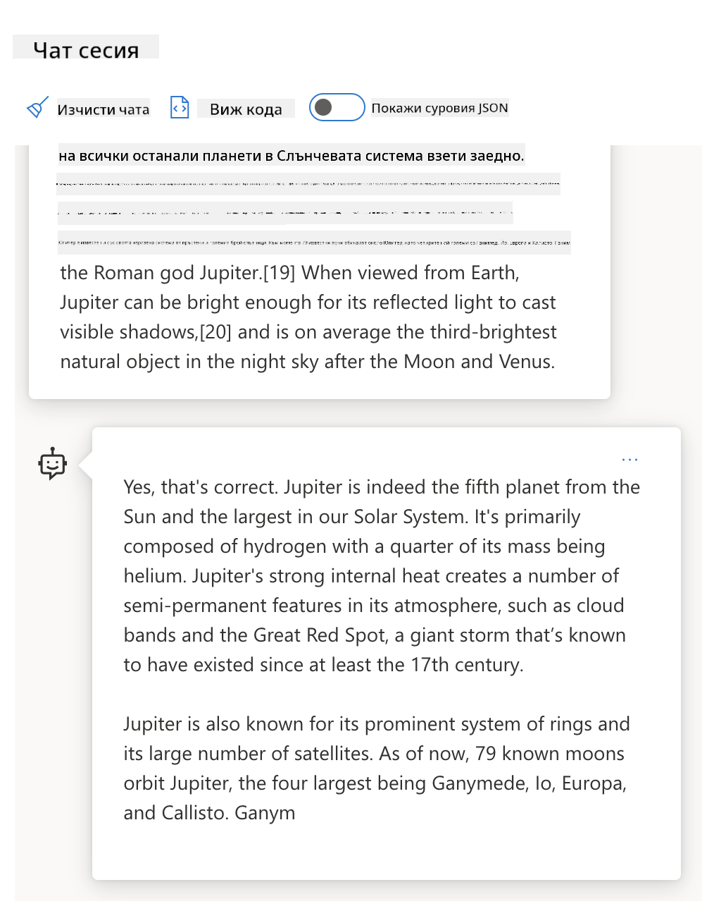
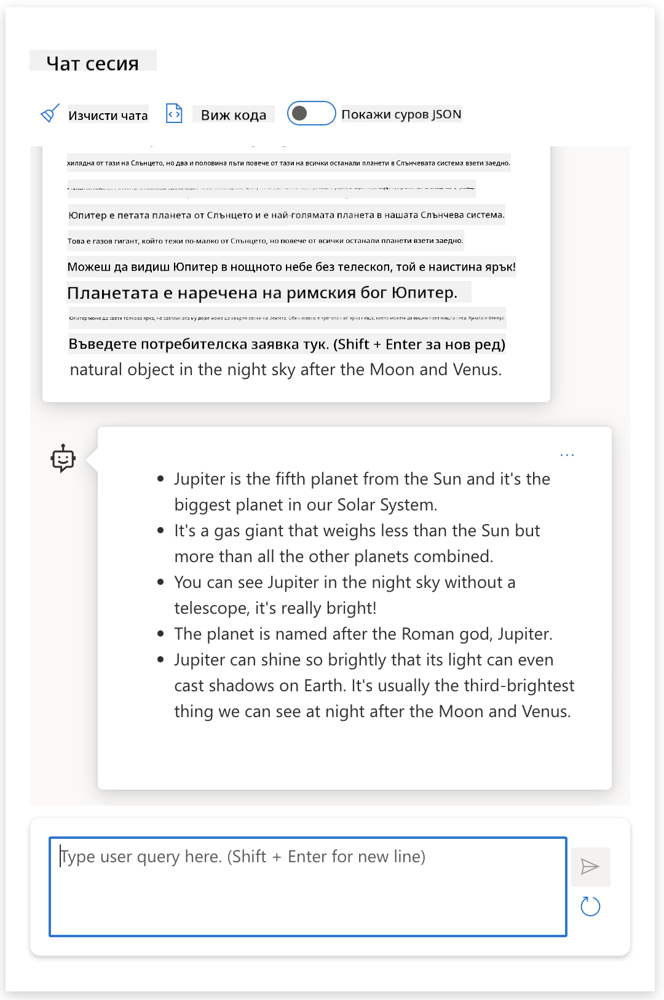
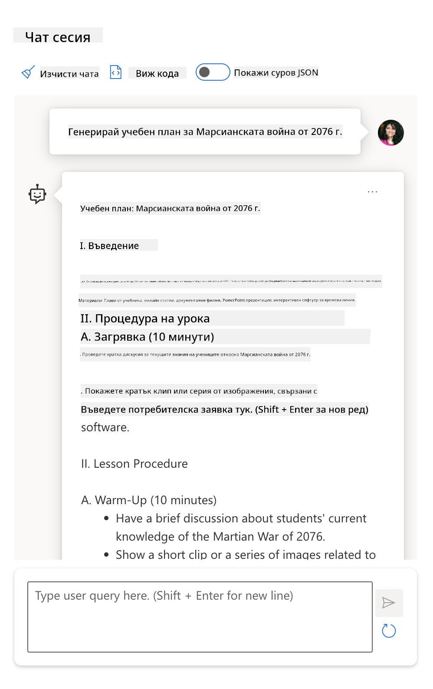

<!--
CO_OP_TRANSLATOR_METADATA:
{
  "original_hash": "dcbaaae026cb50fee071e690685b5843",
  "translation_date": "2025-08-26T19:24:28+00:00",
  "source_file": "04-prompt-engineering-fundamentals/README.md",
  "language_code": "bg"
}
-->
# Основи на инженерството на подсказки

[](https://aka.ms/gen-ai-lesson4-gh?WT.mc_id=academic-105485-koreyst)

## Въведение
Този модул обхваща основни концепции и техники за създаване на ефективни подсказки за генеративни AI модели. Начинът, по който формулирате подсказката си към LLM, също е от значение. Внимателно изработена подсказка може да доведе до по-качествен отговор. Но какво точно означават термините _подсказка_ и _инженерство на подсказки_? И как да подобря _входа_ на подсказката, която изпращам към LLM? Това са въпросите, на които ще се опитаме да отговорим в тази и следващата глава.

_Генеративният AI_ може да създава ново съдържание (например текст, изображения, аудио, код и др.) в отговор на заявки от потребителя. Това се постига чрез _Големи езикови модели_ като серията GPT ("Generative Pre-trained Transformer") на OpenAI, които са обучени да работят с естествен език и код.

Потребителите вече могат да взаимодействат с тези модели чрез познати интерфейси като чат, без да имат технически познания или обучение. Моделите работят на принципа на _подсказки_ – потребителят изпраща текстов вход (подсказка) и получава отговор от AI (завършване). След това може да "общува с AI" многократно, като усъвършенства подсказката си, докато отговорът не отговаря на очакванията му.

"Подсказките" се превръщат в основния _програмен интерфейс_ за генеративни AI приложения, като указват на моделите какво да правят и влияят върху качеството на върнатите отговори. "Инженерството на подсказки" е бързо развиваща се област, която се фокусира върху _дизайна и оптимизацията_ на подсказките, за да се постигнат последователни и качествени резултати в мащаб.

## Учебни цели

В този урок ще научим какво е инженерство на подсказки, защо е важно и как можем да създаваме по-ефективни подсказки за даден модел и цел на приложението. Ще разберем основните концепции и добри практики за инженерство на подсказки – и ще се запознаем с интерактивна среда "sandbox" в Jupyter Notebooks, където можем да видим тези концепции приложени върху реални примери.

В края на този урок ще можем да:

1. Обясним какво е инженерство на подсказки и защо е важно.
2. Описваме компонентите на една подсказка и как се използват.
3. Научим добри практики и техники за инженерство на подсказки.
4. Приложим научените техники върху реални примери, използвайки OpenAI endpoint.

## Ключови термини

Инженерство на подсказки: Практиката да се проектират и усъвършенстват входовете, за да се насочат AI моделите към желаните резултати.
Токенизация: Процесът на преобразуване на текст в по-малки единици, наречени токени, които моделът може да разбере и обработи.
LLM, обучени с инструкции: Големи езикови модели (LLMs), които са допълнително обучени със специфични инструкции, за да подобрят точността и релевантността на отговорите си.

## Учебна среда (Sandbox)

Инженерството на подсказки в момента е повече изкуство, отколкото наука. Най-добрият начин да развием интуиция за него е да _практикуваме повече_ и да използваме подход на проба-грешка, който комбинира експертиза в приложната област с препоръчани техники и оптимизации, специфични за модела.

Jupyter Notebook, който придружава този урок, предоставя _sandbox_ среда, където можете да изпробвате наученото – докато напредвате или като част от предизвикателството с код в края. За да изпълните упражненията, ще ви трябва:

1. **API ключ за Azure OpenAI** – адресът на услугата за внедрен LLM.
2. **Python среда** – в която Notebook-ът може да се изпълнява.
3. **Локални променливи на средата** – _завършете стъпките от [SETUP](./../00-course-setup/02-setup-local.md?WT.mc_id=academic-105485-koreyst), за да сте готови_.

Notebook-ът идва с _начални_ упражнения – но ви насърчаваме да добавяте свои собствени секции с _Markdown_ (описание) и _Code_ (заявки с подсказки), за да изпробвате повече примери или идеи – и да развиете интуиция за дизайна на подсказки.

## Илюстрирано ръководство

Искате да добиете обща представа за темите в този урок, преди да започнете? Разгледайте това илюстрирано ръководство, което ви дава усещане за основните теми и ключовите изводи, върху които да помислите във всяка от тях. Пътната карта на урока ви води от разбиране на основните концепции и предизвикателства до справяне с тях чрез подходящи техники и добри практики за инженерство на подсказки. Имайте предвид, че секцията "Разширени техники" в това ръководство се отнася за съдържание, което ще бъде разгледано в _следващата_ глава от този курс.


## Нашият стартъп

Сега, нека поговорим как _тази тема_ се свързва с мисията на нашия стартъп да [внесе AI иновации в образованието](https://educationblog.microsoft.com/2023/06/collaborating-to-bring-ai-innovation-to-education?WT.mc_id=academic-105485-koreyst). Искаме да създадем AI приложения за _персонализирано обучение_ – затова нека помислим как различните потребители на нашето приложение могат да "проектират" подсказки:

- **Администраторите** могат да поискат от AI да _анализира учебната програма и да открие пропуски в покритието_. AI може да обобщи резултатите или да ги визуализира с код.
- **Учителите** могат да поискат от AI да _създаде план на урок за определена аудитория и тема_. AI може да изгради персонализиран план в зададен формат.
- **Учениците** могат да поискат от AI да _ги обучава по труден предмет_. AI може да ги насочва с уроци, подсказки и примери, съобразени с тяхното ниво.

Това е само началото. Разгледайте [Prompts For Education](https://github.com/microsoft/prompts-for-edu/tree/main?WT.mc_id=academic-105485-koreyst) – библиотека с отворен код, курирана от експерти в образованието – за да добиете по-широка представа за възможностите! _Опитайте да изпълните някои от тези подсказки в sandbox-а или в OpenAI Playground, за да видите какво ще се случи!_

<!--
Шаблон на урока:
Тази единица трябва да обхваща основна концепция #1.
Затвърдете концепцията с примери и препратки.

КОНЦЕПЦИЯ #1:
Инженерство на подсказки.
Дефинирайте го и обяснете защо е необходимо.
-->

## Какво е инженерство на подсказки?

Започнахме този урок с дефиниция на **инженерството на подсказки** като процес на _проектиране и оптимизация_ на текстови входове (подсказки), за да се постигнат последователни и качествени отговори (завършвания) за дадена цел на приложението и модел. Можем да го разглеждаме като двустъпков процес:

- _проектиране_ на първоначалната подсказка за даден модел и цел
- _усъвършенстване_ на подсказката многократно, за да се подобри качеството на отговора

Това е процес на проба-грешка, който изисква интуиция и усилия от страна на потребителя, за да се постигнат оптимални резултати. Защо е важно това? За да отговорим, първо трябва да разберем три концепции:

- _Токенизация_ = как моделът "вижда" подсказката
- _Базови LLM_ = как основният модел "обработва" подсказката
- _LLM, обучени с инструкции_ = как моделът вече може да вижда "задачи"

### Токенизация

LLM възприема подсказките като _последователност от токени_, като различните модели (или версии на модел) могат да токенизират една и съща подсказка по различен начин. Тъй като LLM са обучени върху токени (а не върху суров текст), начинът, по който подсказките се токенизират, оказва пряко влияние върху качеството на генерирания отговор.

За да добиете интуиция как работи токенизацията, опитайте инструменти като [OpenAI Tokenizer](https://platform.openai.com/tokenizer?WT.mc_id=academic-105485-koreyst), показан по-долу. Копирайте вашата подсказка – и вижте как тя се преобразува в токени, като обърнете внимание как се обработват празните пространства и пунктуацията. Имайте предвид, че този пример показва по-стар LLM (GPT-3) – така че пробата с по-нов модел може да даде различен резултат.


### Концепция: Основни модели

След като подсказката е токенизирана, основната функция на ["Базовия LLM"](https://blog.gopenai.com/an-introduction-to-base-and-instruction-tuned-large-language-models-8de102c785a6?WT.mc_id=academic-105485-koreyst) (или основния модел) е да предсказва следващия токен в тази последователност. Тъй като LLM са обучени върху огромни текстови набори, те имат добра представа за статистическите връзки между токените и могат да направят това предсказание с известна увереност. Имайте предвид, че те не разбират _значението_ на думите в подсказката или токена; те просто виждат модел, който могат да "завършат" с следващото си предсказание. Могат да продължат да предсказват последователността, докато не бъдат спрени от потребителя или предварително зададено условие.

Искате да видите как работи завършването на подсказка? Въведете горната подсказка в [_Chat Playground_](https://oai.azure.com/playground?WT.mc_id=academic-105485-koreyst) на Azure OpenAI Studio с настройките по подразбиране. Системата е конфигурирана да третира подсказките като заявки за информация – така че трябва да видите завършване, което отговаря на този контекст.

Но какво ако потребителят иска да види нещо конкретно, което отговаря на определени критерии или цел на задачата? Тук се появяват LLM, обучени с инструкции.



### Концепция: LLM, обучени с инструкции

[LLM, обучен с инструкции](https://blog.gopenai.com/an-introduction-to-base-and-instruction-tuned-large-language-models-8de102c785a6?WT.mc_id=academic-105485-koreyst) започва с основния модел и го дообучава с примери или двойки вход/изход (например многократни "съобщения"), които съдържат ясни инструкции – и отговорът от AI се опитва да следва тази инструкция.

Това използва техники като обучение с подкрепление и човешка обратна връзка (RLHF), които тренират модела да _следва инструкции_ и _да се учи от обратна връзка_, така че да генерира отговори, които са по-подходящи за практическо приложение и по-релевантни за целите на потребителя.

Нека опитаме – върнете се към горната подсказка, но сега променете _system message_, за да предоставите следната инструкция като контекст:

> _Обобщи предоставеното съдържание за ученик във втори клас. Дръж резултата в един параграф с 3-5 точки._

Виждате ли как резултатът вече е насочен към желаната цел и формат? Учителят може директно да използва този отговор в презентацията си за този клас.



## Защо ни е нужно инженерство на подсказки?

Сега, когато знаем как подсказките се обработват от LLM, нека поговорим _защо_ ни е нужно инженерство на подсказки. Причината е, че настоящите LLM имат редица предизвикателства, които правят _надеждните и последователни завършвания_ трудни за постигане без усилия в конструирането и оптимизацията на подсказките. Например:

1. **Отговорите на модела са стохастични.** _Една и съща подсказка_ вероятно ще даде различни отговори с различни модели или версии на модел. А може да даде различни резултати дори със _същия модел_ в различни моменти. _Техниките за инженерство на подсказки могат да помогнат да се минимизират тези вариации чрез по-добри ограничения._

1. **Моделите могат да измислят отговори.** Моделите са предварително обучени с _големи, но крайни_ набори от данни, което означава, че им липсва знание за концепции извън този обхват. В резултат могат да генерират завършвания, които са неточни, измислени или директно противоречат на известни факти. _Техниките за инженерство на подсказки помагат на потребителите да разпознават и ограничават такива измислици, например като поискат от AI цитати или обосновка._

1. **Възможностите на моделите се различават.** По-новите модели или поколения модели имат по-богати възможности, но също така носят специфични особености и компромиси в цена и сложност. _Инженерството на подсказки може да помогне да се разработят добри практики и работни процеси, които абстрахират разликите и се адаптират към специфичните изисквания на модела по мащабируем и безпроблемен начин._

Нека видим това на практика в OpenAI или Azure OpenAI Playground:

- Използвайте една и съща подсказка с различни LLM внедрения (например OpenAI, Azure OpenAI, Hugging Face) – видяхте ли разликите?
- Използвайте една и съща подсказка многократно със _същото_ LLM внедрение (например Azure OpenAI playground) – как се различават тези вариации?

### Пример за измислици

В този курс използваме термина **"измислица"** за явлението, при което LLM понякога генерират фактически неверна информация поради ограничения в обучението си или други фактори. Може би сте чували това и като _"халюцинации"_ в популярни статии или научни публикации. Въпреки това, силно препоръчваме да използвате _"измислица"_ като термин, за да не приписваме човешки черти на машинно поведение. Това също така подкрепя [принципите за отговорен AI](https://www.microsoft.com/ai/responsible-ai?WT.mc_id=academic-105485-koreyst) от гледна точка на терминологията, като премахва думи, които могат да се считат за обидни или неинклузивни в някои контексти.

Искате да видите как работят измислиците? Помислете за подсказка, която инструктира AI да генери
> **Подсказка:** създайте план на урок за Марсианската война от 2076 г.

# План на урок: Марсианската война от 2076 г.

## Цели на урока

- Учениците ще разберат причините и последиците от Марсианската война от 2076 г.
- Учениците ще анализират ключови събития и участници във войната.
- Учениците ще обсъдят влиянието на войната върху бъдещето на човечеството и Марс.

## Въведение (10 минути)

- Кратко представяне на Марсианската война от 2076 г.
- Обсъждане на контекста: колонизацията на Марс, напрежението между земните и марсианските фракции.

## Основни събития (20 минути)

- Преглед на хронологията на войната:
  - Начало на конфликта: икономически и политически причини
  - Основни битки и стратегически моменти
  - Важни лидери и техните решения
- Групова дискусия: Какво е довело до ескалацията на конфликта?

## Последици и влияние (15 минути)

- Как войната е променила отношенията между Земята и Марс
- Технологични иновации, породени от войната
- Социални и културни промени сред марсианските колонии

## Дейност (15 минути)

- Учениците работят по групи, за да създадат кратка презентация за един аспект от войната (напр. военни технологии, дипломатически преговори, животът на цивилните).
- Представяне на резултатите пред класа.

## Обобщение и въпроси (10 минути)

- Обобщение на основните точки от урока
- Отворена дискусия: Какви уроци можем да научим от Марсианската война от 2076 г.?
- Въпроси и отговори

## Домашна работа

- Напишете кратко есе: „Как Марсианската война от 2076 г. е променила бъдещето на човечеството?“
Търсенето в интернет ми показа, че има измислени разкази (например телевизионни сериали или книги) за марсиански войни – но никой от тях не се случва през 2076 г. Логиката също ни подсказва, че 2076 г. е _бъдеща година_ и следователно не може да се свърже с реално събитие.

Какво се случва, ако пуснем този въпрос към различни LLM доставчици?

> **Отговор 1**: OpenAI Playground (GPT-35)


> **Отговор 2**: Azure OpenAI Playground (GPT-35)



> **Отговор 3**: : Hugging Face Chat Playground (LLama-2)


Както се очаква, всяка от тези модели (или версии на моделите) дава малко по-различни отговори, благодарение на стохастичното поведение и разликите в способностите. Например, един модел се насочва към аудитория от 8-ми клас, докато друг приема, че пита ученик от гимназията. Но и трите модела генерират отговори, които могат да убедят невеж потребител, че събитието е реално.

Техники за инженеринг на подканите като _метаподканяне_ и _настройка на температурата_ могат донякъде да намалят измислиците на моделите. Нови архитектури за инженеринг на подканите също интегрират нови инструменти и техники директно в потока на подканата, за да ограничат или намалят някои от тези ефекти.

## Казус: GitHub Copilot

Нека завършим тази част, като видим как инженерингът на подканите се използва в реални решения, разглеждайки един казус: [GitHub Copilot](https://github.com/features/copilot?WT.mc_id=academic-105485-koreyst).

GitHub Copilot е вашият „AI партньор програмист“ – той превръща текстови подканяния в допълнения на код и е интегриран във вашата среда за разработка (например Visual Studio Code) за безпроблемно потребителско изживяване. Както е описано в поредицата блогове по-долу, най-ранната версия е базирана на OpenAI Codex модела – като инженерите бързо осъзнават нуждата да го донастроят и да разработят по-добри техники за инженеринг на подканите, за да подобрят качеството на кода. През юли те [представиха подобрен AI модел, който надминава Codex](https://github.blog/2023-07-28-smarter-more-efficient-coding-github-copilot-goes-beyond-codex-with-improved-ai-model/?WT.mc_id=academic-105485-koreyst) за още по-бързи предложения.

Прочетете публикациите по ред, за да проследите тяхното обучение.

- **Май 2023** | [GitHub Copilot става по-добър в разбирането на вашия код](https://github.blog/2023-05-17-how-github-copilot-is-getting-better-at-understanding-your-code/?WT.mc_id=academic-105485-koreyst)
- **Май 2023** | [Вътре в GitHub: Работа с LLM моделите зад GitHub Copilot](https://github.blog/2023-05-17-inside-github-working-with-the-llms-behind-github-copilot/?WT.mc_id=academic-105485-koreyst).
- **Юни 2023** | [Как да пишете по-добри подканяния за GitHub Copilot](https://github.blog/2023-06-20-how-to-write-better-prompts-for-github-copilot/?WT.mc_id=academic-105485-koreyst).
- **Юли 2023** | [.. GitHub Copilot надминава Codex с подобрен AI модел](https://github.blog/2023-07-28-smarter-more-efficient-coding-github-copilot-goes-beyond-codex-with-improved-ai-model/?WT.mc_id=academic-105485-koreyst)
- **Юли 2023** | [Ръководство за разработчици за инженеринг на подканите и LLM](https://github.blog/2023-07-17-prompt-engineering-guide-generative-ai-llms/?WT.mc_id=academic-105485-koreyst)
- **Септември 2023** | [Как да изградите корпоративно LLM приложение: Уроци от GitHub Copilot](https://github.blog/2023-09-06-how-to-build-an-enterprise-llm-application-lessons-from-github-copilot/?WT.mc_id=academic-105485-koreyst)

Може да разгледате и техния [Engineering blog](https://github.blog/category/engineering/?WT.mc_id=academic-105485-koreyst) за още публикации като [тази](https://github.blog/2023-09-27-how-i-used-github-copilot-chat-to-build-a-reactjs-gallery-prototype/?WT.mc_id=academic-105485-koreyst), която показва как тези модели и техники се _прилагат_ за реални приложения.

---

<!--
Шаблон на урок:
Тази единица трябва да покрива основна концепция #2.
Затвърдете концепцията с примери и препратки.

КОНЦЕПЦИЯ #2:
Дизайн на подканата.
Илюстрирано с примери.
-->

## Създаване на подканата

Видяхме защо инженерингът на подканите е важен – сега нека разберем как се _създават_ подканите, за да можем да оценим различни техники за по-ефективен дизайн.

### Основна подканата

Нека започнем с основната подканата: текстов вход, изпратен към модела без друг контекст. Ето пример – когато изпратим първите няколко думи от американския национален химн към OpenAI [Completion API](https://platform.openai.com/docs/api-reference/completions?WT.mc_id=academic-105485-koreyst), той веднага _довършва_ отговора с следващите редове, показвайки основното поведение на предсказване.

| Подканата (Вход)     | Допълнение (Изход)                                                                                                                        |
| :------------------- | :---------------------------------------------------------------------------------------------------------------------------------------- |
| Oh say can you see   | Изглежда започвате текста на „The Star-Spangled Banner“, националния химн на САЩ. Пълният текст е ...                                    |

### Сложна подканата

Сега нека добавим контекст и инструкции към основната подканата. [Chat Completion API](https://learn.microsoft.com/azure/ai-services/openai/how-to/chatgpt?WT.mc_id=academic-105485-koreyst) ни позволява да създадем сложна подканата като колекция от _съобщения_ с:

- Входно/изходни двойки, отразяващи _потребителски_ вход и _асистентски_ отговор.
- Системно съобщение, което задава контекста за поведението или личността на асистента.

Заявката вече е във формата по-долу, където _токенизацията_ ефективно улавя релевантната информация от контекста и разговора. Промяната на системния контекст може да има толкова голямо влияние върху качеството на допълненията, колкото и самите потребителски входове.

```python
response = openai.chat.completions.create(
    model="gpt-3.5-turbo",
    messages=[
        {"role": "system", "content": "You are a helpful assistant."},
        {"role": "user", "content": "Who won the world series in 2020?"},
        {"role": "assistant", "content": "The Los Angeles Dodgers won the World Series in 2020."},
        {"role": "user", "content": "Where was it played?"}
    ]
)
```

### Инструкционна подканата

В горните примери потребителската подканата беше прост текстов въпрос, който може да се интерпретира като заявка за информация. С _инструкционни_ подканяния можем да използваме този текст, за да опишем задачата по-подробно и да дадем по-добри насоки на AI. Ето пример:

| Подканата (Вход)                                                                                                                                                                                                                         | Допълнение (Изход)                                                                                                        | Тип инструкция      |
| :--------------------------------------------------------------------------------------------------------------------------------------------------------------------------------------------------------------------------------------- | :------------------------------------------------------------------------------------------------------------------------ | :------------------ |
| Напиши описание на Гражданската война                                                                                                                                                              | _върна кратък параграф_                                                                                                  | Просто              |
| Напиши описание на Гражданската война. Посочи ключови дати и събития и опиши тяхното значение                                                                                                      | _върна параграф, последван от списък с ключови дати и описания_                                                          | Сложно              |
| Напиши описание на Гражданската война в 1 параграф. Дай 3 точки с ключови дати и тяхното значение. Дай още 3 точки с ключови исторически личности и техния принос. Върни резултата като JSON файл   | _връща по-подробна информация в текстова кутия, форматирана като JSON, която може да копирате и валидирате при нужда_     | Сложно. Форматирано.|

## Основно съдържание

В горните примери подканата беше доста отворена, позволявайки на LLM да реши коя част от предварително обучените данни е релевантна. С дизайна на подканата с _основно съдържание_, входният текст се разделя на две части:

- инструкция (действие)
- релевантно съдържание (което влияе на действието)

Ето пример, където инструкцията е „обобщи това в 2 изречения“.

| Подканата (Вход)                                                                                                                                                                                                                                                                                                                                                                                                                                                                                                                                                                                                                                                                                      | Допълнение (Изход)                                                                                                                                                                                                                                                                             |
| :-------------------------------------------------------------------------------------------------------------------------------------------------------------------------------------------------------------------------------------------------------------------------------------------------------------------------------------------------------------------------------------------------------------------------------------------------------------------------------------------------------------------------------------------------------------------------------------------------------------------------------------------------------------------------------------------------- | :---------------------------------------------------------------------------------------------------------------------------------------------------------------------------------------------------------------------------------------------------------------------------------------------- |
| Юпитер е петата планета от Слънцето и най-голямата в Слънчевата система. Тя е газов гигант с маса една хилядна от тази на Слънцето, но два и половина пъти повече от всички други планети в Слънчевата система взети заедно. Юпитер е един от най-ярките обекти, видими с просто око в нощното небе, и е познат на древните цивилизации още преди писаната история. Наречен е на римския бог Юпитер.[19] Когато се наблюдава от Земята, Юпитер може да бъде толкова ярък, че отразената му светлина да хвърля видими сенки,[20] и средно е третият най-ярък естествен обект в нощното небе след Луната и Венера. <br/> **Обобщи това в 2 кратки изречения** | Юпитер, петата планета от Слънцето, е най-голямата в Слънчевата система и е известна като един от най-ярките обекти в нощното небе. Наречена на римския бог Юпитер, тя е газов гигант с маса два и половина пъти по-голяма от всички други планети взети заедно. |

Сегментът с основно съдържание може да се използва по различни начини за по-ефективни инструкции:

- **Примери** – вместо да казвате на модела какво да прави с явна инструкция, дайте му примери за желаното действие и го оставете да изведе модела.
- **Подсказки** – следвайте инструкцията с „подсказка“, която насочва допълнението и води модела към по-релевантни отговори.
- **Шаблони** – това са повторяеми „рецепти“ за подканяния с променливи, които могат да се персонализират с данни за конкретни случаи.

Нека ги разгледаме в действие.

### Използване на примери

Това е подход, при който използвате основното съдържание, за да „нахраните модела“ с примери за желания изход при дадена инструкция и го оставяте да изведе модела за желания резултат. В зависимост от броя примери, можем да имаме zero-shot, one-shot, few-shot подканяне и др.

Подканата вече се състои от три компонента:

- Описание на задачата
- Няколко примера за желания изход
- Началото на нов пример (което става имплицитно описание на задачата)

| Тип обучение | Подканата (Вход)                                                                                                                                        | Допълнение (Изход)         |
| :----------- | :------------------------------------------------------------------------------------------------------------------------------------------------------ | :------------------------- |
| Zero-shot    | "The Sun is Shining". Преведи на испански                                                                                                              | "El Sol está brillando".   |
| One-shot     | "The Sun is Shining" => ""El Sol está brillando". <br> "It's a Cold and Windy Day" =>                                                                 | "Es un día frío y ventoso."|
| Few-shot     | The player ran the bases => Baseball <br/> The player hit an ace => Tennis <br/> The player hit a six => Cricket <br/> The player made a slam-dunk => | Basketball                 |
|              |                                                                                                                                                         |                            |

Забележете как трябваше да дадем явна инструкция („Преведи на испански“) при zero-shot подканяне, но тя се извежда в one-shot примера. Few-shot примерът показва как добавянето на повече примери позволява на моделите да правят по-точни изводи без допълнителни инструкции.

### Подсказки в подканата

Друга техника за използване на основно съдържание е да дадете _подсказки_ вместо примери. В този случай давате на модела леко насочване, като го _започвате_ с откъс, който отразява желания формат на отговора. Моделът след това „поема подсказката“ и продължава в същия стил.

| Брой подсказки | Подканата (Вход)                                                                                                                                                                                                                                                                                                                                                                                                                                               | Допълнение (Изход)                                                                                                                                                                                                                                                                                       |
| :------------- | :----------------------------------------------------------------------------------------------------------------------------------------------------------------------------------------------------------------------------------------------------------------------------------------------------------------------------------------------------------------------------------------------------------------------------------------------------------- | :-------------------------------------------------------------------------------------------------------------------------------------------------------------------------------------------------------------------------------------------------------------------------------------------------------- |
| 0              | Юпитер е петата планета от Слънцето и най-голямата в Слънчевата система. Тя е газов гигант с маса една хилядна от тази на Слънцето, но два и половина пъти повече от всички други планети в Слънчевата система взети заедно. Юпитер е един от най-ярките обекти, видими с просто око в нощното небе, и е познат на древните цивилизации още преди писаната история.

**Обобщи това**                                       | Юпитер е най-голямата планета в нашата Слънчева система и петата по ред от Слънцето. Той е газов гигант с маса, равна на 1/1000 от тази на Слънцето, но е по-тежък от всички останали планети взети заедно. Древните цивилизации са познавали Юпитер отдавна, а той лесно се вижда на нощното небе. |
| 1              | Юпитер е петата планета от Слънцето и най-голямата в Слънчевата система. Той е газов гигант с маса, равна на една хилядна от тази на Слънцето, но два и половина пъти по-голяма от всички останали планети взети заедно. Юпитер е един от най-ярките обекти, които се виждат с просто око на нощното небе, и е познат на древните цивилизации още преди писаната история. <br/>**Обобщи това** <br/> Какво научихме: Юпитер | е петата планета от Слънцето и най-голямата в Слънчевата система. Той е газов гигант с маса, равна на една хилядна от тази на Слънцето, но два и половина пъти по-голяма от всички останали планети взети заедно. Лесно се вижда с просто око и е познат от древни времена.                        |
| 2              | Юпитер е петата планета от Слънцето и най-голямата в Слънчевата система. Той е газов гигант с маса, равна на една хилядна от тази на Слънцето, но два и половина пъти по-голяма от всички останали планети взети заедно. Юпитер е един от най-ярките обекти, които се виждат с просто око на нощното небе, и е познат на древните цивилизации още преди писаната история. <br/>**Обобщи това** <br/> Топ 3 факта, които научихме:         | 1. Юпитер е петата планета от Слънцето и най-голямата в Слънчевата система. <br/> 2. Той е газов гигант с маса, равна на една хилядна от тази на Слънцето...<br/> 3. Юпитер се вижда с просто око още от древни времена ...                                                                       |
|                |                                                                                                                                                                                                                                                                                                                                                                                                                                                              |                                                                                                                                                                                                                                                                                                           |

### Шаблони за подканващи инструкции

Шаблонът за подканваща инструкция е _предварително дефинирана рецепта за подканваща инструкция_, която може да се съхранява и използва многократно, за да осигури по-последователно потребителско изживяване в голям мащаб. В най-опростената си форма това е просто колекция от примери за подканващи инструкции като [този от OpenAI](https://platform.openai.com/examples?WT.mc_id=academic-105485-koreyst), който предоставя както интерактивните компоненти (съобщения от потребител и система), така и формата на заявката към API - за по-лесно повторно използване.

В по-сложната си форма, като [този пример от LangChain](https://python.langchain.com/docs/concepts/prompt_templates/?WT.mc_id=academic-105485-koreyst), той съдържа _заместващи полета_, които могат да се попълват с данни от различни източници (потребителски вход, системен контекст, външни данни и др.), за да се генерира подканваща инструкция динамично. Това ни позволява да създаваме библиотека от шаблони, които могат да се използват за по-последователно потребителско изживяване **програмирано** в голям мащаб.

Истинската стойност на шаблоните е във възможността да се създават и публикуват _библиотеки с подканващи инструкции_ за конкретни области на приложение – където шаблонът вече е _оптимизиран_ според специфичния контекст или примери, които правят отговорите по-релевантни и точни за целевата аудитория. Репозиторият [Prompts For Edu](https://github.com/microsoft/prompts-for-edu?WT.mc_id=academic-105485-koreyst) е чудесен пример за този подход, като събира библиотека от подканващи инструкции за образованието с акцент върху ключови цели като планиране на уроци, дизайн на учебни програми, помощ при обучението и др.

## Поддържащо съдържание

Ако мислим за създаването на подканваща инструкция като съдържаща инструкция (задача) и цел (основно съдържание), то _вторичното съдържание_ е допълнителен контекст, който предоставяме, за да **влияе на резултата по някакъв начин**. Това може да са параметри за настройка, инструкции за форматиране, тематични таксономии и др., които помагат на модела да _адаптира_ отговора си според желаните цели или очаквания на потребителя.

Например: Ако имаме каталог с курсове с богата метаинформация (име, описание, ниво, тагове, преподавател и др.) за всички налични курсове в учебната програма:

- можем да зададем инструкция "обобщи каталога с курсове за есента 2023"
- можем да използваме основното съдържание, за да дадем няколко примера за желания резултат
- можем да използваме вторичното съдържание, за да посочим топ 5 "тага" от интерес.

Така моделът може да предостави обобщение във формата, показан от примерите – но ако резултатът има няколко тага, може да даде приоритет на 5-те, посочени във вторичното съдържание.

---

<!--
ШАБЛОН НА УРОК:
Този модул трябва да покрива основна концепция #1.
Затвърди концепцията с примери и препратки.

КОНЦЕПЦИЯ #3:
Техники за инженеринг на подканващи инструкции.
Кои са основните техники за инженеринг на подканващи инструкции?
Илюстрирай с упражнения.
-->

## Най-добри практики при създаване на подканващи инструкции

След като знаем как се _създават_ подканващи инструкции, можем да помислим как да ги _дизайнираме_ според най-добрите практики. Можем да разделим това на две части – правилната _нагласа_ и прилагането на правилните _техники_.

### Нагласа за инженеринг на подканващи инструкции

Инженерингът на подканващи инструкции е процес на проби и грешки, затова имайте предвид три основни насоки:

1. **Разбирането на домейна е важно.** Точността и релевантността на отговора зависят от _домейна_, в който работи приложението или потребителят. Използвайте интуицията и експертизата си, за да **персонализирате техниките** допълнително. Например, дефинирайте _домейн-специфични личности_ в системните подканващи инструкции или използвайте _домейн-специфични шаблони_ в потребителските инструкции. Предоставяйте вторично съдържание, което отразява домейн-специфичен контекст, или използвайте _домейн-специфични сигнали и примери_, за да насочите модела към познати модели на употреба.

2. **Разбирането на модела е важно.** Знаем, че моделите са стохастични по природа. Но реализациите на моделите могат да се различават по набора от данни, с които са обучени (предварително натрупани знания), възможностите, които предоставят (например чрез API или SDK), и типа съдържание, за което са оптимизирани (например код, изображения, текст). Разберете силните и слабите страни на модела, който използвате, и използвайте това знание, за да _приоритизирате задачите_ или да изградите _персонализирани шаблони_, оптимизирани за възможностите на модела.

3. **Итерация и валидиране са важни.** Моделите се развиват бързо, както и техниките за инженеринг на подканващи инструкции. Като експерт в дадена област, може да имате специфичен контекст или критерии за _вашето_ приложение, които не са приложими за по-широката общност. Използвайте инструменти и техники за инженеринг на подканващи инструкции, за да "стартирате" създаването на инструкции, след това итерирайте и валидирайте резултатите с вашата интуиция и експертиза. Записвайте прозренията си и създайте **база знания** (например библиотеки с инструкции), която може да се използва като нова отправна точка от други, за по-бързи итерации в бъдеще.

## Най-добри практики

Нека разгледаме често препоръчвани добри практики от [OpenAI](https://help.openai.com/en/articles/6654000-best-practices-for-prompt-engineering-with-openai-api?WT.mc_id=academic-105485-koreyst) и [Azure OpenAI](https://learn.microsoft.com/azure/ai-services/openai/concepts/prompt-engineering#best-practices?WT.mc_id=academic-105485-koreyst).

| Какво                              | Защо                                                                                                                                                                                                                                               |
| :-------------------------------- | :------------------------------------------------------------------------------------------------------------------------------------------------------------------------------------------------------------------------------------------------ |
| Оценявайте най-новите модели.       | Новите поколения модели вероятно имат подобрени функции и качество – но може да са и по-скъпи. Оценете ги за въздействие, след това вземете решение за миграция.                                                                                |
| Разделяйте инструкции и контекст   | Проверете дали вашият модел/доставчик дефинира _разделители_, за да отличава инструкциите, основното и вторичното съдържание по-ясно. Това може да помогне на моделите да определят по-точно тежестта на токените.                                                         |
| Бъдете конкретни и ясни             | Дайте повече подробности за желания контекст, резултат, дължина, формат, стил и др. Това ще подобри както качеството, така и последователността на отговорите. Записвайте рецептите в шаблони за повторно използване.                                                          |
| Бъдете описателни, използвайте примери      | Моделите често реагират по-добре на подход "покажи и разкажи". Започнете с `zero-shot` подход, където давате само инструкция (без примери), след това опитайте `few-shot` като усъвършенстване, предоставяйки няколко примера за желания резултат. Използвайте аналогии. |
| Използвайте сигнали за старт на отговора | Насочете модела към желания резултат, като му дадете начални думи или фрази, които може да използва като отправна точка за отговора.                                                                                                               |
| Повторете                          | Понякога трябва да се повторите пред модела. Дайте инструкции преди и след основното съдържание, използвайте инструкция и сигнал и др. Итерация и валидиране, за да видите кое работи.                                                         |
| Редът е важен                     | Редът, в който представяте информацията на модела, може да повлияе на резултата, дори в учебните примери, поради ефекта на последните данни. Пробвайте различни варианти, за да видите кое работи най-добре.                                                               |
| Дайте на модела „изход“           | Дайте на модела _резервен_ отговор, който може да предостави, ако не може да изпълни задачата по някаква причина. Това може да намали вероятността моделът да генерира неверни или измислени отговори.                                                         |
|                                   |                                                                                                                                                                                                                                                   |

Както при всяка добра практика, имайте предвид, че _резултатите могат да варират_ според модела, задачата и домейна. Използвайте тези насоки като отправна точка и итерирайте, за да намерите най-доброто за вас. Постоянно преоценявайте процеса си за инженеринг на подканващи инструкции, когато се появяват нови модели и инструменти, с фокус върху мащабируемостта и качеството на отговорите.

<!--
ШАБЛОН НА УРОК:
Този модул трябва да предостави кодово предизвикателство, ако е приложимо

ПРЕДИЗВИКАТЕЛСТВО:
Връзка към Jupyter Notebook само с коментари в инструкциите (секциите с код са празни).

РЕШЕНИЕ:
Връзка към копие на този Notebook с попълнени и изпълнени подканващи инструкции, показващо един примерен резултат.
-->

## Задание

Поздравления! Стигнахте до края на урока! Време е да приложите някои от тези концепции и техники с реални примери!

За нашето задание ще използваме Jupyter Notebook с упражнения, които можете да изпълнявате интерактивно. Можете също да разширите Notebook-а със собствени Markdown и Code клетки, за да изследвате идеи и техники самостоятелно.

### За да започнете, направете fork на репозиторито, след това

- (Препоръчително) Стартирайте GitHub Codespaces
- (Алтернативно) Клонирайте репозиторито на вашето устройство и го използвайте с Docker Desktop
- (Алтернативно) Отворете Notebook-а с предпочитаната от вас среда за Notebook-и.

### След това конфигурирайте променливите на средата

- Копирайте файла `.env.copy` от корена на репозиторито в `.env` и попълнете стойностите за `AZURE_OPENAI_API_KEY`, `AZURE_OPENAI_ENDPOINT` и `AZURE_OPENAI_DEPLOYMENT`. Върнете се към [секцията Learning Sandbox](../../../04-prompt-engineering-fundamentals/04-prompt-engineering-fundamentals), за да научите как.

### След това отворете Jupyter Notebook-а

- Изберете ядрото за изпълнение. Ако използвате опции 1 или 2, просто изберете стандартното ядро Python 3.10.x, предоставено от dev контейнера.

Вече сте готови да изпълнявате упражненията. Имайте предвид, че тук няма _правилни и грешни_ отговори – просто изследвате варианти чрез проби и грешки и изграждате интуиция за това кое работи за даден модел и област на приложение.

_Затова в този урок няма секции с решения на кода. Вместо това Notebook-ът ще има Markdown клетки със заглавие "Моето решение:", които показват един примерен резултат за справка._

 <!--
ШАБЛОН НА УРОК:
Обобщи секцията и предостави ресурси за самостоятелно обучение.
-->

## Проверка на знанията

Кой от следните подканващи инструкции е добър пример според разумни добри практики?

1. Покажи ми изображение на червена кола
2. Покажи ми изображение на червена кола, марка Volvo, модел XC90, паркирана до скала при залез слънце
3. Покажи ми изображение на червена кола, марка Volvo, модел XC90

A: 2, това е най-добрата инструкция, защото дава подробности за "какво" и е конкретна (не просто някаква кола, а определена марка и модел), а също така описва и цялостната обстановка. 3 е следващата най-добра, тъй като също съдържа доста описание.

## 🚀 Предизвикателство

Вижте дали можете да използвате техниката със "сигнал" с подканващата инструкция: Допълнете изречението "Покажи ми изображение на червена кола, марка Volvo и ". Какво ще отговори моделът и как бихте го подобрили?

## Страхотна работа! Продължете с обучението си

Искате да научите повече за различни концепции в инженеринг на подканващи инструкции? Отидете на [страницата за продължаващо обучение](https://aka.ms/genai-collection?WT.mc_id=academic-105485-koreyst), за да намерите още полезни ресурси по темата.

Продължете към Урок 5, където ще разгледаме [напреднали техники за подканващи инструкции](../05-advanced-prompts/README.md?WT.mc_id=academic-105485-koreyst)!

---

**Отказ от отговорност**:
Този документ е преведен с помощта на AI услуга за превод [Co-op Translator](https://github.com/Azure/co-op-translator). Въпреки че се стремим към точност, имайте предвид, че автоматизираните преводи могат да съдържат грешки или неточности. Оригиналният документ на неговия роден език трябва да се счита за авторитетен източник. За критична информация се препоръчва професионален човешки превод. Не носим отговорност за недоразумения или погрешни тълкувания, възникнали от използването на този превод.