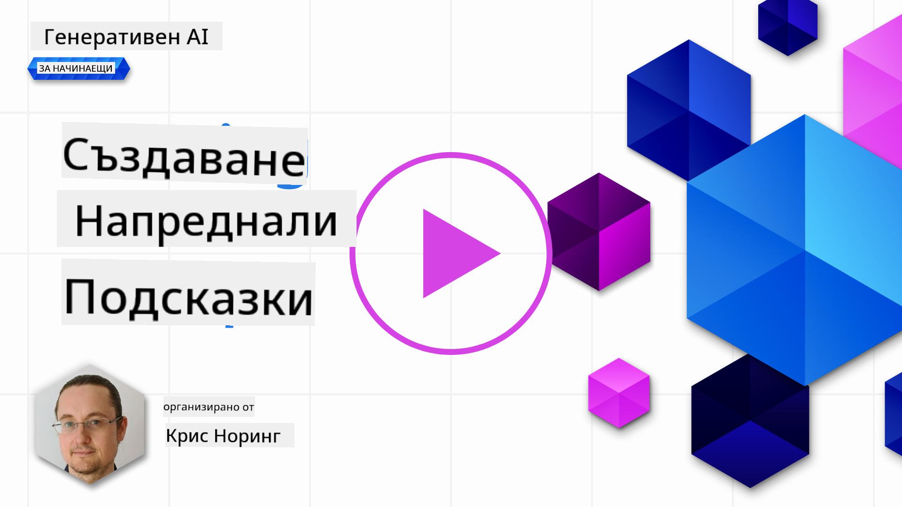

<!--
CO_OP_TRANSLATOR_METADATA:
{
  "original_hash": "b2651fb16bcfbc62b8e518751ed90fdb",
  "translation_date": "2025-10-17T22:13:30+00:00",
  "source_file": "05-advanced-prompts/README.md",
  "language_code": "bg"
}
-->
# Създаване на напреднали подканвания

[](https://youtu.be/BAjzkaCdRok?si=NmUIyRf7-cDgbjtt)

Нека обобщим някои от наученото в предишната глава:

> Подканващото _инженерство_ е процесът, чрез който **насочваме модела към по-релевантни отговори**, като предоставяме по-полезни инструкции или контекст.

Има две стъпки за създаване на подканвания: конструиране на подканването чрез предоставяне на релевантен контекст и _оптимизация_, тоест как постепенно да подобрим подканването.

На този етап имаме основно разбиране за това как да създаваме подканвания, но трябва да задълбочим знанията си. В тази глава ще преминете от изпробване на различни подканвания към разбирането защо едно подканване е по-добро от друго. Ще научите как да конструирате подканвания, следвайки някои основни техники, които могат да се приложат към всяка LLM.

## Въведение

В тази глава ще разгледаме следните теми:

- Разширяване на знанията ви за подканващото инженерство чрез прилагане на различни техники към вашите подканвания.
- Конфигуриране на вашите подканвания за разнообразие в изхода.

## Цели на обучението

След завършване на този урок ще можете:

- Да прилагате техники за подканващо инженерство, които подобряват резултата от вашите подканвания.
- Да извършвате подканвания, които са или разнообразни, или детерминирани.

## Подканващо инженерство

Подканващото инженерство е процесът на създаване на подканвания, които ще произведат желания резултат. Подканващото инженерство е нещо повече от просто писане на текстово подканване. То не е инженерна дисциплина, а по-скоро набор от техники, които можете да приложите, за да получите желания резултат.

### Пример за подканване

Нека вземем едно основно подканване като това:

> Генерирай 10 въпроса за география.

В това подканване всъщност прилагате набор от различни техники за подканване.

Нека го разгледаме подробно.

- **Контекст**, уточнявате, че трябва да бъде за "география".
- **Ограничаване на изхода**, искате не повече от 10 въпроса.

### Ограничения на простите подканвания

Може да получите или да не получите желания резултат. Ще получите генерирани въпроси, но географията е голяма тема и може да не получите това, което искате, поради следните причини:

- **Голяма тема**, не знаете дали ще става въпрос за държави, столици, реки и т.н.
- **Формат**, какво ако искате въпросите да бъдат форматирани по определен начин?

Както виждате, има много неща, които трябва да се вземат предвид при създаването на подканвания.

Досега разгледахме пример за просто подканване, но генеративният AI е способен на много повече, за да помогне на хората в различни роли и индустрии. Нека разгледаме някои основни техники.

### Техники за подканване

Първо, трябва да разберем, че подканването е _възникващо_ свойство на LLM, което означава, че това не е функция, вградена в модела, а нещо, което откриваме, докато използваме модела.

Има някои основни техники, които можем да използваме за подканване на LLM. Нека ги разгледаме.

- **Подканване без примери**, това е най-основната форма на подканване. Това е единично подканване, което изисква отговор от LLM, базиран единствено на неговите обучителни данни.
- **Подканване с малко примери**, този тип подканване насочва LLM, като предоставя 1 или повече примери, на които може да се опре, за да генерира отговора си.
- **Верига от мисли**, този тип подканване казва на LLM как да разбие проблема на стъпки.
- **Генерирани знания**, за да подобрите отговора на подканването, можете да предоставите генерирани факти или знания допълнително към подканването си.
- **От най-малкото към най-голямото**, подобно на верига от мисли, тази техника се състои в разбиване на проблема на серия от стъпки и след това искане тези стъпки да бъдат изпълнени по ред.
- **Самоусъвършенстване**, тази техника се състои в критикуване на изхода на LLM и след това искане той да бъде подобрен.
- **Маетично подканване**, тук целта е да се уверите, че отговорът на LLM е правилен, като го помолите да обясни различни части от отговора. Това е форма на самоусъвършенстване.

### Подканване без примери

Този стил на подканване е много прост, състои се от единично подканване. Тази техника вероятно използвате, когато започвате да учите за LLM. Ето пример:

- Подканване: "Какво е алгебра?"
- Отговор: "Алгебрата е клон на математиката, който изучава математически символи и правилата за манипулиране на тези символи."

### Подканване с малко примери

Този стил на подканване помага на модела, като предоставя няколко примера заедно със заявката. Състои се от единично подканване с допълнителни данни, специфични за задачата. Ето пример:

- Подканване: "Напиши стихотворение в стил Шекспир. Ето няколко примера за шекспирови сонети:
  Сонет 18: 'Да те сравня ли с летен ден? Ти си по-красив и по-умерен...'
  Сонет 116: 'Нека не пречим на съюза на истинските умове. Любовта не е любов, която се променя, когато промяната настъпи...'
  Сонет 132: 'Обичам твоите очи, и те, сякаш ме съжаляват, знаейки, че сърцето ти ме измъчва с презрение,...'
  Сега напиши сонет за красотата на луната."
- Отговор: "На небето луната нежно блести, В сребриста светлина, която разпръсква своята благодат,..."

Примерите предоставят на LLM контекста, формата или стила на желания изход. Те помагат на модела да разбере конкретната задача и да генерира по-точни и релевантни отговори.

### Верига от мисли

Верига от мисли е много интересна техника, тъй като става въпрос за преминаване на LLM през серия от стъпки. Идеята е да инструктирате LLM по такъв начин, че да разбере как да направи нещо. Разгледайте следния пример, със и без верига от мисли:

    - Подканване: "Алис има 5 ябълки, хвърля 3 ябълки, дава 2 на Боб и Боб връща една, колко ябълки има Алис?"
    - Отговор: 5

LLM отговаря с 5, което е неправилно. Правилният отговор е 1 ябълка, според изчислението (5 -3 -2 + 1 = 1).

Как можем да научим LLM да прави това правилно?

Нека опитаме с верига от мисли. Прилагането на верига от мисли означава:

1. Дайте на LLM подобен пример.
1. Покажете изчислението и как да го изчисли правилно.
1. Предоставете оригиналното подканване.

Ето как:

- Подканване: "Лиза има 7 ябълки, хвърля 1 ябълка, дава 4 ябълки на Барт и Барт връща една:
  7 -1 = 6
  6 -4 = 2
  2 +1 = 3  
  Алис има 5 ябълки, хвърля 3 ябълки, дава 2 на Боб и Боб връща една, колко ябълки има Алис?"
  Отговор: 1

Забележете как пишем значително по-дълги подканвания с друг пример, изчисление и след това оригиналното подканване, и стигаме до правилния отговор 1.

Както виждате, верига от мисли е много мощна техника.

### Генерирани знания

Много пъти, когато искате да конструирате подканване, искате да го направите, използвайки данни от вашата собствена компания. Искате част от подканването да бъде от компанията, а другата част да бъде действителното подканване, което ви интересува.

Като пример, ето как може да изглежда вашето подканване, ако сте в застрахователния бизнес:

```text
{{company}}: {{company_name}}
{{products}}:
{{products_list}}
Please suggest an insurance given the following budget and requirements:
Budget: {{budget}}
Requirements: {{requirements}}
```

Горе виждате как подканването е конструирано, използвайки шаблон. В шаблона има редица променливи, обозначени с `{{variable}}`, които ще бъдат заменени с действителни стойности от API на компанията.

Ето пример как може да изглежда подканването, след като променливите са заменени със съдържание от вашата компания:

```text
Insurance company: ACME Insurance
Insurance products (cost per month):
- Car, cheap, 500 USD
- Car, expensive, 1100 USD
- Home, cheap, 600 USD
- Home, expensive, 1200 USD
- Life, cheap, 100 USD

Please suggest an insurance given the following budget and requirements:
Budget: $1000
Requirements: Car, Home, and Life insurance
```

Пускането на това подканване през LLM ще произведе отговор като този:

```output
Given the budget and requirements, we suggest the following insurance package from ACME Insurance:
- Car, cheap, 500 USD
- Home, cheap, 600 USD
- Life, cheap, 100 USD
Total cost: $1,200 USD
```

Както виждате, то също така предлага животозастраховане, което не би трябвало. Този резултат е индикация, че трябва да оптимизираме подканването, като го направим по-ясно какво може да позволи. След известно _пробване и грешки_, стигаме до следното подканване:

```text
Insurance company: ACME Insurance
Insurance products (cost per month):
- type: Car, cheap, cost: 500 USD
- type: Car, expensive, cost: 1100 USD
- type: Home, cheap, cost: 600 USD
- type: Home, expensive, cost: 1200 USD
- type: Life, cheap, cost: 100 USD

Please suggest an insurance given the following budget and requirements:
Budget: $1000 restrict choice to types: Car, Home
```

Забележете как добавянето на _тип_ и _цена_, както и използването на ключовата дума _ограничаване_, помага на LLM да разбере какво искаме.

Сега получаваме следния отговор:

```output
Given the budget and requirements, we suggest the Car, Cheap insurance product which costs 500 USD per month.
```

Целта на този пример беше да покаже, че дори когато използваме основна техника като _генерирани знания_, все пак трябва да оптимизираме подканването в повечето случаи, за да получим желания резултат.

### От най-малкото към най-голямото

Идеята с подканването от най-малкото към най-голямото е да се разбие по-голям проблем на подпроблеми. По този начин помагате на LLM да "покори" по-големия проблем. Добър пример може да бъде за анализ на данни, където можете да помолите LLM да раздели проблема по следния начин:

> Подканване: Как да извърша анализ на данни в 5 стъпки?

Вашият AI асистент отговаря с:

1. Събиране на данни
1. Почистване на данни
1. Анализ на данни
1. Визуализация на данни
1. Представяне на данни

### Самоусъвършенстване, критика на резултатите

С генеративните AI и LLM не можете да се доверите на изхода. Трябва да го проверите. В крайна сметка, LLM просто ви представя какво е най-вероятно да каже след това, а не какво е правилно. Затова добра идея е да помолите LLM да критикува себе си, което ни води до техниката за самоусъвършенстване.

Как работи:

1. Първоначално подканване, което моли LLM да реши проблем.
1. LLM отговаря.
1. Вие критикувате отговора и молите AI да го подобри.
1. LLM отговаря отново, този път като взема предвид критиката и предлага решения, които е измислил.

Можете да повторите този процес колкото пъти искате.

Ето пример, използващ тази техника:

> Подканване: "Създай Python Web API с маршрути за продукти и клиенти"

AI отговор:

```python
import flask
app = Flask(__name__)

@app.route('/products')
def products():
    return 'Products'

@app.route('/customers')
def customers():
    return 'Customers'
```

> Подканване: предложи 3 подобрения на горния код

AI отговор:

```text
Sure, here are three suggestions to improve the code:

Import the correct module: The first line should import Flask instead of flask. The correct import statement should be from flask import Flask.

Add a main function: Add a if __name__ == '__main__': block to the end of the file to run the application when the file is executed.

Use f-strings: Use f-strings to format the return statements in the route functions. For example, return 'Products' can be changed to return f'This is the {request.path} page'.
```

```python
from flask import Flask, request

app = Flask(__name__)

@app.route('/products')
def products():
    return f'This is the {request.path} page'

@app.route('/customers')
def customers():
    return f'This is the {request.path} page'

if __name__ == '__main__':
    app.run()
```

Както виждате, горният AI отговор подобрява първоначално предложения код благодарение на критиката към първия отговор.

### Маетично подканване

Маетичното подканване е техника, която е подобна на самоусъвършенстването, но е повече за това да помолите LLM да се обясни. Целта е да се намалят несъответствията в изхода на LLM, за да се уверите, че той стига до правилния отговор. Работният процес, който трябва да следвате, е:

1. Помолете LLM да отговори на въпрос.
1. За всяка част от отговора помолете LLM да я обясни по-подробно.
1. Ако има несъответствия, отхвърлете частите, които са несъответстващи.

Повтаряйте стъпки 2 и 3, докато не преминете през всички части и не сте доволни от отговора.

Ето пример за подканване:

> Подканване: Как мога да създам план за криза за справяне с пандемия в 5 стъпки?
> LLM отговор:

```text
1. Identify the risks
1. Identify the stakeholders
1. Identify the resources
1. Identify the actions
1. Identify the communication channels
```

Идентифицирани са 5 стъпки, но можем ли да определим дали това е правилно? Нека помолим LLM да обясни всяка стъпка по-подробно:

> Подканване: Обясни първата стъпка по-подробно, какви са рисковете в детайли при пандемия?

```text
The risks are the following:

- Loss of life
- Loss of business
- Loss of reputation
- Loss of customers
- Loss of employees
```

На този етап искаме да се уверим, че LLM е правилен, затова го молим да обясни първия риск по-подробно и се надяваме, че е последователен с горния отговор:

> Подканване: При пандемия, кой е най-големият риск и защо?

```text
The biggest risk is loss of life because it's the most important thing to protect.
```

> Кои са двата най-големи риска при пандемия?

```text
The two biggest risks are loss of life and loss of business.
```

На този етап LLM е последователен и споменава "живот" и "бизнес" като двата най-големи риска. Сега можем да продължим към следващата стъпка и да се чувстваме доста уверени. Въпреки това, не трябва да се доверяваме на LLM сляпо, винаги трябва да проверяваме изхода.

## Разнообразие на изхода

LLM са по природа недетерминирани, което означава, че ще получавате различни резултати всеки път, когато изпълните едно и също подканване. Опитайте следното подканване например:

> "Генерирай код за Python Web API"

```python
# Import necessary modules
import flask
from flask import request, jsonify

# Create a Flask app
app = flask.Flask(__name__)

# Create a route for the API
@app.route('/api', methods=['GET'])
def api():
    # Get the data from the request
    data = request.args

    # Process the data
    result = process_data(data)

    # Return the result as JSON
    return jsonify(result)

# Function to process the data
def process_data(data):
    # Do something with the data
    result = data + 1

    # Return the result
    return result

# Run the app
if __name__ == '__main__':
    app.run()

```

Изпълнението на същото подканване отново генерира леко различен отговор:

```python
#import necessary packages
import flask
from flask import request, jsonify

#create the Flask application
app = flask.Flask(__name__)
app.config["DEBUG"] = True

#create a list of books
books = [
    {'id': 0,
     'title': 'A Fire Upon the Deep',
     'author': 'Vernor Vinge',
     'first_sentence': 'The coldsleep itself was dreamless.',
     'year_published': '1992'},
    {'id': 1,
     'title': 'The Ones Who Walk Away From Omelas',
     'author': 'Ursula K. Le Guin',
     'first_sentence': 'With a clamor of bells that set the swallows soaring, the Festival of Summer came to the city Omelas, bright-towered by the sea.',
     'published': '1973'},
    {'id': 2,
     'title': 'Dhalgren',
     'author': 'Samuel R. Delany',
     'first_sentence': 'to wound the autumnal city.',
     'published': '1975'}
]

#create an endpoint for the API
@app.route('/', methods=['GET'])
def home():
    return '''<h1>Books API</h1>
<p>A prototype API for retrieving books.</p>'''

#create an endpoint to return all books
@app.route('/api/v1/resources/books/all', methods=['GET'])
def api_all():
    return jsonify(books)

#create an endpoint to return a single book
@app.route('/api/v1/resources/books', methods=['GET'])
def api_id():
    #check if an ID was provided as part of the URL
    #if ID is provided, assign it to a variable
    #if no ID is provided, display an error
    if 'id' in request.args:
        id = int(request.args['id'])
    else:
        return "Error: No id field provided. Please specify an id."

    #create an empty list for our results
    results = []

    #loop through the data and match results that fit the requested ID
    #IDs are unique, but other fields might return many results
    for book in books:
        if book['id'] == id:
            results.append(book)

    #use the jsonify function from Flask to convert our list of
    #Python dictionaries to the JSON format
    return jsonify(results)

app.run()
```

> Така че, разнообразният изход проблем ли е?

Зависи от това, което се опитвате да направите. Ако искате конкретен отговор, тогава това е проблем. Ако сте ок с разнообразен изход като "Генерирай произволни 3 въпроса за география", тогава това не е проблем.

### Използване на температура за разнообразие на изхода

Добре, значи сме решили, че искаме да ограничим изхода, за да бъде по-предсказуем, тоест по-детерминиран. Как да го направим?

Температурата е стойност между 0 и 1, където 0 е най-детерминираната, а 1 е най-разнообразната. Стандартната стойност е 0.7. Нека видим какво се случва с два изпълнения на едно и също подканване с температура, зададена на 0.1:

> "Генерирай код за Python Web API"

```python
#import necessary libraries
import flask
from flask import request, jsonify

#create an instance of the Flask class
app = flask.Flask(__name__)

#create an endpoint for the API
@app.route('/api/v1/endpoint', methods=['GET'])
def api_endpoint():
    #get the request data
    data = request.get_json()

    #process the data
    result = process_data(data)

    #return the result
    return jsonify(result)

#function to process the data
def process_data(data):
    #process the data
    result = {'result': 'success'}

    #return the result
    return result

#run the Flask app
if __name__ == '__main__':
    app.run()

```

Изпълнението на подканването отново ни дава този резултат:

```python
#import necessary libraries
import flask
from flask import request, jsonify

#create a Flask app
app = flask.Flask(__name__)

#create a route for the API
@app.route('/api', methods=['GET'])
def api_call():
    #get the data from the request
    data = request.get_json()

    #process the data
    result = process_data(data)

    #return the result
    return jsonify(result)

#define the process_data function
def process_data(data):
    #do something with the data
    result = data + 1

    #return the result
    return result

#run the app
if __name__ == '__main__':
    app.run()

```

Има само малка разлика между тези два изхода. Нека направим обратното този път, да зададем температура на 0.9:

```python
# Import necessary libraries
import flask
from flask import request, jsonify

# Create a Flask app
app = flask.Flask(__name__)

# Create a route for the API
@app.route('/api', methods=['GET'])
def api_call():
    # Get the data from the request
    data = request.args

    # Process the data
    result = process_data(data)

    # Return the result
    return jsonify(result)

# Function to process the data
def process_data(data):
    # Do something with the data
    result = data + 1

    # Return the result
    return result

# Run the app
if __name__ == '__main__':
    app.run()

```

и вторият опит с температура, зададена на 0.9:

```python
import flask
from flask import request, jsonify

# create the Flask app
app = flask.Flask(__name__)
app.config['DEBUG'] = True

# create some test data
books = [
    {'id': 0, 'title': 'A Fire Upon The Deep', 'author': 'Vernor Vinge', 'first_sentence': 'The coldsleep itself was dreamless.', 'year_published': '1992'},
    {'id': 1, 'title': 'The Ones Who Walk Away From Omelas', 'author': 'Ursula K. Le Guin', 'first_sentence': 'With a clamor of bells that set the swallows soaring, the Festival of Summer came to the city Omelas, bright-towered by the sea.', 'published': '1973'},
    {'id': 2, 'title': 'Dhalgren', 'author': 'Samuel R. Delany', 'first_sentence': 'to wound the autumnal city.', 'published': '1975'}
]

# create an endpoint
@app.route('/', methods=['GET'])
def home():
    return '''<h1>Welcome to our book API!</h1>'''

@app.route('/api/v1/resources/books

```

Както виждате, резултатите не биха могли да бъдат по-разнообразни.

> Имайте предвид, че има още параметри, които можете да промените, за да разнообразите изхода, като top-k, top-p, наказание за повторение, наказание за дължина и наказание за разнообразие, но те са извън обхвата на тази учебна програма.

## Добри практики

Има много практики, които можете да приложите, за да постигнете желаните резултати. С времето ще откриете свой собствен стил, докато използвате повече и повече подканвания.

Освен техниките, които разгледахме, има някои добри практики, които да имате предвид при създаване на подканвания за LLM.

Ето някои добри практики, които да обмислите:

- **Уточнете контекста**. Контекстът е важен – колкото повече можете да уточните, като например домейн, тема и т.н., толкова по-добре.
- Ограничете изхода. Ако искате определен брой елементи или определена дължина, уточнете го.
- **Уточнете какво и как**. Не забравяйте да споменете както какво искате, така и как искате да бъде направено, например "Създай Python Web API с маршрути за продукти и клиенти, раздели го на 3 файла".
- **Използвайте шаблони**. Често ще искате да обогатите подканванията си с данни от вашата компания. Използвайте шаблони, за да направите това. Шаблоните могат да съдържат променливи, които заменяте с реални данни.
- **Пишете правилно**. LLM може да ви предостави правилен отговор, но ако пишете правилно, ще получите по-добър отговор.

## Задача

Ето код на Python, който показва как да изградите прост API с Flask:

```python
from flask import Flask, request

app = Flask(__name__)

@app.route('/')
def hello():
    name = request.args.get('name', 'World')
    return f'Hello, {name}!'

if __name__ == '__main__':
    app.run()
```

Използвайте AI асистент като GitHub Copilot или ChatGPT и приложете техниката "самоусъвършенстване", за да подобрите кода.

## Решение

Опитайте да решите задачата, като добавите подходящи подканвания към кода.

> [!TIP]
> Формулирайте подканване, за да поискате подобрение; добра идея е да ограничите броя на подобренията. Можете също така да поискате подобрение в определен аспект, например архитектура, производителност, сигурност и т.н.

[Решение](../../../05-advanced-prompts/python/aoai-solution.py)

## Проверка на знанията

Защо бих използвал подканване с верига от мисли? Покажете ми 1 правилен отговор и 2 грешни отговора.

1. За да науча LLM как да реши даден проблем.
1. B, За да науча LLM да намира грешки в кода.
1. C, За да инструктирам LLM да измисли различни решения.

A: 1, защото подканването с верига от мисли е свързано с това да покажете на LLM как да реши проблем, като му предоставите серия от стъпки и подобни проблеми и как те са били решени.

## 🚀 Предизвикателство

Току-що използвахте техниката за самоусъвършенстване в задачата. Вземете произволна програма, която сте създали, и обмислете какви подобрения бихте искали да приложите към нея. Сега използвайте техниката за самоусъвършенстване, за да приложите предложените промени. Какво мислите за резултата – по-добър или по-лош?

## Чудесна работа! Продължете да учите

След като завършите този урок, разгледайте нашата [колекция за обучение по Генеративен AI](https://aka.ms/genai-collection?WT.mc_id=academic-105485-koreyst), за да продължите да развивате знанията си за Генеративен AI!

Преминете към Урок 6, където ще приложим знанията си за инженерство на подканвания, като [създаваме приложения за генериране на текст](../06-text-generation-apps/README.md?WT.mc_id=academic-105485-koreyst).

---

**Отказ от отговорност**:  
Този документ е преведен с помощта на AI услуга за превод [Co-op Translator](https://github.com/Azure/co-op-translator). Въпреки че се стремим към точност, моля, имайте предвид, че автоматизираните преводи може да съдържат грешки или неточности. Оригиналният документ на неговия роден език трябва да се счита за авторитетен източник. За критична информация се препоръчва професионален човешки превод. Ние не носим отговорност за каквито и да било недоразумения или погрешни интерпретации, произтичащи от използването на този превод.