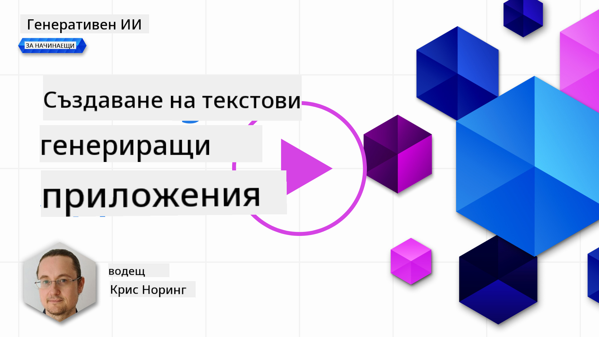

<!--
CO_OP_TRANSLATOR_METADATA:
{
  "original_hash": "ce8224073b86b728ed52b19bed7932fd",
  "translation_date": "2025-07-09T12:08:40+00:00",
  "source_file": "06-text-generation-apps/README.md",
  "language_code": "bg"
}
-->
# Създаване на приложения за генериране на текст

[](https://aka.ms/gen-ai-lesson6-gh?WT.mc_id=academic-105485-koreyst)

> _(Кликнете върху изображението по-горе, за да гледате видеото на този урок)_

Досега в този курс видяхте, че има основни понятия като prompts и дори цяла дисциплина, наречена "prompt engineering". Много инструменти, с които можете да взаимодействате, като ChatGPT, Office 365, Microsoft Power Platform и други, ви подкрепят чрез prompts за постигане на определена задача.

За да добавите такова изживяване към приложение, трябва да разберете понятия като prompts, completions и да изберете библиотека, с която да работите. Това е точното, което ще научите в тази глава.

## Въведение

В тази глава ще:

- Научите за библиотеката openai и нейните основни понятия.
- Създадете приложение за генериране на текст с помощта на openai.
- Разберете как да използвате понятия като prompt, temperature и tokens, за да изградите приложение за генериране на текст.

## Цели на обучението

В края на този урок ще можете да:

- Обясните какво представлява приложение за генериране на текст.
- Създадете приложение за генериране на текст с помощта на openai.
- Конфигурирате приложението си да използва повече или по-малко tokens и също да променяте temperature за по-разнообразен резултат.

## Какво е приложение за генериране на текст?

Обикновено, когато създавате приложение, то има някакъв вид интерфейс, като например:

- Базирано на команди. Конзолните приложения са типични приложения, където въвеждате команда и тя изпълнява задача. Например, `git` е приложение, базирано на команди.
- Потребителски интерфейс (UI). Някои приложения имат графичен потребителски интерфейс (GUI), където кликвате бутони, въвеждате текст, избирате опции и др.

### Конзолните и UI приложенията имат ограничения

Сравнете ги с приложение, базирано на команди, където въвеждате команда:

- **Ограничено е**. Не можете просто да въведете произволна команда, а само тези, които приложението поддържа.
- **Езиково специфично**. Някои приложения поддържат много езици, но по подразбиране са създадени за конкретен език, дори и да можете да добавите поддръжка за други езици.

### Предимства на приложенията за генериране на текст

Какво прави приложението за генериране на текст различно?

В такова приложение имате повече гъвкавост, не сте ограничени до набор от команди или конкретен входен език. Вместо това можете да използвате естествен език, за да взаимодействате с приложението. Друго предимство е, че вече работите с източник на данни, който е обучен върху огромен корпус от информация, докато традиционните приложения може да са ограничени до това, което е в базата данни.

### Какво мога да създам с приложение за генериране на текст?

Има много неща, които можете да създадете. Например:

- **Чатбот**. Чатбот, който отговаря на въпроси по теми като вашата компания и нейните продукти, може да бъде много полезен.
- **Помощник**. Големите езикови модели (LLMs) са отлични в задачи като обобщаване на текст, извличане на информация от текст, създаване на текстове като автобиографии и др.
- **Асистент за кодиране**. В зависимост от езиковия модел, който използвате, можете да създадете асистент за кодиране, който да ви помага да пишете код. Например, можете да използвате продукти като GitHub Copilot или ChatGPT, за да ви помагат при писането на код.

## Как да започна?

Трябва да намерите начин да се интегрирате с LLM, което обикновено включва следните два подхода:

- Използване на API. Тук изграждате уеб заявки с вашия prompt и получавате обратно генериран текст.
- Използване на библиотека. Библиотеките помагат да се капсулират API повикванията и ги правят по-лесни за използване.

## Библиотеки/SDK

Има няколко добре познати библиотеки за работа с LLM, като:

- **openai** – тази библиотека улеснява свързването с вашия модел и изпращането на prompts.

Има и библиотеки, които работят на по-високо ниво, като:

- **Langchain**. Langchain е добре позната и поддържа Python.
- **Semantic Kernel**. Semantic Kernel е библиотека на Microsoft, която поддържа езиците C#, Python и Java.

## Първо приложение с openai

Нека видим как можем да създадем първото си приложение, какви библиотеки са ни нужни, колко е необходимо и т.н.

### Инсталиране на openai

Има много библиотеки за взаимодействие с OpenAI или Azure OpenAI. Можете да използвате различни програмни езици като C#, Python, JavaScript, Java и други. Ние избрахме да използваме Python библиотеката `openai`, затова ще използваме `pip` за инсталирането ѝ.

```bash
pip install openai
```

### Създаване на ресурс

Трябва да изпълните следните стъпки:

- Създайте акаунт в Azure [https://azure.microsoft.com/free/](https://azure.microsoft.com/free/?WT.mc_id=academic-105485-koreyst).
- Получете достъп до Azure OpenAI. Отидете на [https://learn.microsoft.com/azure/ai-services/openai/overview#how-do-i-get-access-to-azure-openai](https://learn.microsoft.com/azure/ai-services/openai/overview#how-do-i-get-access-to-azure-openai?WT.mc_id=academic-105485-koreyst) и подайте заявка за достъп.

  > [!NOTE]
  > Към момента на писане, трябва да кандидатствате за достъп до Azure OpenAI.

- Инсталирайте Python <https://www.python.org/>
- Създайте ресурс Azure OpenAI Service. Вижте това ръководство за [създаване на ресурс](https://learn.microsoft.com/azure/ai-services/openai/how-to/create-resource?pivots=web-portal?WT.mc_id=academic-105485-koreyst).

### Намерете API ключ и endpoint

Сега трябва да кажете на библиотеката `openai` кой API ключ да използва. За да намерите API ключа си, отидете в секцията "Keys and Endpoint" на вашия Azure OpenAI ресурс и копирайте стойността на "Key 1".


След като имате тази информация, нека инструктираме библиотеките да я използват.

> [!NOTE]
> Добре е да отделите API ключа си от кода. Можете да го направите чрез използване на променливи на средата.
>
> - Задайте променливата на средата `OPENAI_API_KEY` със стойността на вашия API ключ.
>   `export OPENAI_API_KEY='sk-...'`

### Конфигуриране на Azure

Ако използвате Azure OpenAI, ето как да настроите конфигурацията:

```python
openai.api_type = 'azure'
openai.api_key = os.environ["OPENAI_API_KEY"]
openai.api_version = '2023-05-15'
openai.api_base = os.getenv("API_BASE")
```

По-горе задаваме следното:

- `api_type` на `azure`. Това казва на библиотеката да използва Azure OpenAI, а не OpenAI.
- `api_key` – вашият API ключ, намерен в Azure портала.
- `api_version` – версията на API, която искате да използвате. Към момента на писане, последната версия е `2023-05-15`.
- `api_base` – endpoint на API-то. Можете да го намерите в Azure портала до вашия API ключ.

> [!NOTE] > `os.getenv` е функция, която чете променливи на средата. Можете да я използвате, за да прочетете променливи като `OPENAI_API_KEY` и `API_BASE`. Задайте тези променливи в терминала си или чрез библиотека като `dotenv`.

## Генериране на текст

Начинът за генериране на текст е чрез използване на класа `Completion`. Ето пример:

```python
prompt = "Complete the following: Once upon a time there was a"

completion = openai.Completion.create(model="davinci-002", prompt=prompt)
print(completion.choices[0].text)
```

В горния код създаваме обект за completion и подаваме модела, който искаме да използваме, и prompt-а. След това отпечатваме генерирания текст.

### Chat completions

Досега видяхте как използваме `Completion` за генериране на текст. Но има и друг клас, наречен `ChatCompletion`, който е по-подходящ за чатботове. Ето пример за използването му:

```python
import openai

openai.api_key = "sk-..."

completion = openai.ChatCompletion.create(model="gpt-3.5-turbo", messages=[{"role": "user", "content": "Hello world"}])
print(completion.choices[0].message.content)
```

Повече за тази функционалност в следваща глава.

## Упражнение – вашето първо приложение за генериране на текст

Сега, след като научихме как да настроим и конфигурираме openai, е време да създадете първото си приложение за генериране на текст. За да го направите, следвайте тези стъпки:

1. Създайте виртуална среда и инсталирайте openai:

   ```bash
   python -m venv venv
   source venv/bin/activate
   pip install openai
   ```

   > [!NOTE]
   > Ако използвате Windows, напишете `venv\Scripts\activate` вместо `source venv/bin/activate`.

   > [!NOTE]
   > Намерете вашия Azure OpenAI ключ, като отидете на [https://portal.azure.com/](https://portal.azure.com/?WT.mc_id=academic-105485-koreyst), потърсите `Open AI`, изберете `Open AI resource`, след това `Keys and Endpoint` и копирайте стойността на `Key 1`.

1. Създайте файл _app.py_ и поставете следния код:

   ```python
   import openai

   openai.api_key = "<replace this value with your open ai key or Azure OpenAI key>"

   openai.api_type = 'azure'
   openai.api_version = '2023-05-15'
   openai.api_base = "<endpoint found in Azure Portal where your API key is>"
   deployment_name = "<deployment name>"

   # add your completion code
   prompt = "Complete the following: Once upon a time there was a"
   messages = [{"role": "user", "content": prompt}]

   # make completion
   completion = openai.chat.completions.create(model=deployment_name, messages=messages)

   # print response
   print(completion.choices[0].message.content)
   ```

   > [!NOTE]
   > Ако използвате Azure OpenAI, трябва да зададете `api_type` на `azure` и да зададете `api_key` на вашия Azure OpenAI ключ.

   Трябва да видите изход като следния:

   ```output
    very unhappy _____.

   Once upon a time there was a very unhappy mermaid.
   ```

## Различни видове prompts за различни задачи

Вече видяхте как да генерирате текст с помощта на prompt. Дори имате работеща програма, която можете да модифицирате и променяте, за да генерирате различни видове текст.

Prompts могат да се използват за всякакви задачи. Например:

- **Генериране на тип текст**. Например, можете да генерирате поема, въпроси за викторина и др.
- **Търсене на информация**. Можете да използвате prompts, за да търсите информация, като например „Какво означава CORS в уеб разработката?“.
- **Генериране на код**. Можете да използвате prompts, за да генерирате код, например да създадете регулярни изрази за валидиране на имейли или дори цяла програма, като уеб приложение.

## По-практичен пример: генератор на рецепти

Представете си, че имате съставки вкъщи и искате да сготвите нещо. За това ви трябва рецепта. Един начин да намерите рецепти е да използвате търсачка или да използвате LLM.

Можете да напишете prompt като този:

> "Покажи ми 5 рецепти за ястие със следните съставки: пиле, картофи и моркови. За всяка рецепта изброи всички използвани съставки."

При този prompt може да получите отговор, подобен на:

```output
1. Roasted Chicken and Vegetables:
Ingredients:
- 4 chicken thighs
- 2 potatoes, cut into cubes
- 2 carrots, cut into cubes
- 2 tablespoons olive oil
- 2 cloves garlic, minced
- 1 teaspoon dried thyme
- 1 teaspoon dried oregano
- Salt and pepper, to taste

2. Chicken and Potato Stew:
Ingredients:
- 2 tablespoons olive oil
- 1 onion, diced
- 2 cloves garlic, minced
- 2 chicken breasts, cut into cubes
- 2 potatoes, cut into cubes
- 2 carrots, cut into cubes
- 1 teaspoon dried oregano
- 1 teaspoon dried thyme
- 1 cup chicken broth
- Salt and pepper, to taste

3. Chicken and Potato Bake:
Ingredients:
- 2 tablespoons olive oil
- 2 chicken breasts, cut into cubes
- 2 potatoes, cut into cubes
- 2 carrots, cut into cubes
- 1 onion, diced
- 2 cloves garlic, minced
- 1 teaspoon dried oregano
- 1 teaspoon dried thyme
- 1 cup chicken broth
- Salt and pepper, to taste

4. Chicken and Potato Soup:
Ingredients:
- 2 tablespoons olive oil
- 1 onion, diced
- 2 cloves garlic, minced
- 2 chicken breasts, cut into cubes
- 2 potatoes, cut into cubes
- 2 carrots, cut into cubes
- 1 teaspoon dried oregano
- 1 teaspoon dried thyme
- 4 cups chicken broth
- Salt and pepper, to taste

5. Chicken and Potato Hash:
Ingredients:
- 2 tablespoons olive oil
- 2 chicken breasts, cut into cubes
- 2 potatoes, cut into cubes
- 2 carrots, cut into cubes
- 1 onion, diced
- 2 cloves garlic, minced
- 1 teaspoon dried oregano
```

Този резултат е страхотен, вече знам какво да сготвя. В този момент полезни подобрения биха били:

- Филтриране на съставки, които не харесвам или съм алергичен към тях.
- Създаване на списък за пазаруване, в случай че нямам всички съставки вкъщи.

За горните случаи, нека добавим допълнителен prompt:

> "Моля, премахни рецепти с чесън, тъй като съм алергичен, и го замени с нещо друго. Също така, моля, създай списък за пазаруване за рецептите, като имаш предвид, че вече имам пиле, картофи и моркови вкъщи."

Сега имате нов резултат, а именно:

```output
1. Roasted Chicken and Vegetables:
Ingredients:
- 4 chicken thighs
- 2 potatoes, cut into cubes
- 2 carrots, cut into cubes
- 2 tablespoons olive oil
- 1 teaspoon dried thyme
- 1 teaspoon dried oregano
- Salt and pepper, to taste

2. Chicken and Potato Stew:
Ingredients:
- 2 tablespoons olive oil
- 1 onion, diced
- 2 chicken breasts, cut into cubes
- 2 potatoes, cut into cubes
- 2 carrots, cut into cubes
- 1 teaspoon dried oregano
- 1 teaspoon dried thyme
- 1 cup chicken broth
- Salt and pepper, to taste

3. Chicken and Potato Bake:
Ingredients:
- 2 tablespoons olive oil
- 2 chicken breasts, cut into cubes
- 2 potatoes, cut into cubes
- 2 carrots, cut into cubes
- 1 onion, diced
- 1 teaspoon dried oregano
- 1 teaspoon dried thyme
- 1 cup chicken broth
- Salt and pepper, to taste

4. Chicken and Potato Soup:
Ingredients:
- 2 tablespoons olive oil
- 1 onion, diced
- 2 chicken breasts, cut into cubes
- 2 potatoes, cut into cubes
- 2 carrots, cut into cubes
- 1 teaspoon dried oregano
- 1 teaspoon dried thyme
- 4 cups chicken broth
- Salt and pepper, to taste

5. Chicken and Potato Hash:
Ingredients:
- 2 tablespoons olive oil
- 2 chicken breasts, cut into cubes
- 2 potatoes, cut into cubes
- 2 carrots, cut into cubes
- 1 onion, diced
- 1 teaspoon dried oregano

Shopping List:
- Olive oil
- Onion
- Thyme
- Oregano
- Salt
- Pepper
```

Това са вашите пет рецепти без чесън и имате списък за пазаруване, като се взема предвид какво вече имате вкъщи.

## Упражнение – създайте генератор на рецепти

След като разгледахме сценария, нека напишем код, който да го реализира. За целта следвайте тези стъпки:

1. Използвайте съществуващия файл _app.py_ като отправна точка.
1. Намерете променливата `prompt` и променете кода ѝ на следното:

   ```python
   prompt = "Show me 5 recipes for a dish with the following ingredients: chicken, potatoes, and carrots. Per recipe, list all the ingredients used"
   ```

   Ако сега стартирате кода, трябва да видите изход, подобен на:

   ```output
   -Chicken Stew with Potatoes and Carrots: 3 tablespoons oil, 1 onion, chopped, 2 cloves garlic, minced, 1 carrot, peeled and chopped, 1 potato, peeled and chopped, 1 bay leaf, 1 thyme sprig, 1/2 teaspoon salt, 1/4 teaspoon black pepper, 1 1/2 cups chicken broth, 1/2 cup dry white wine, 2 tablespoons chopped fresh parsley, 2 tablespoons unsalted butter, 1 1/2 pounds boneless, skinless chicken thighs, cut into 1-inch pieces
   -Oven-Roasted Chicken with Potatoes and Carrots: 3 tablespoons extra-virgin olive oil, 1 tablespoon Dijon mustard, 1 tablespoon chopped fresh rosemary, 1 tablespoon chopped fresh thyme, 4 cloves garlic, minced, 1 1/2 pounds small red potatoes, quartered, 1 1/2 pounds carrots, quartered lengthwise, 1/2 teaspoon salt, 1/4 teaspoon black pepper, 1 (4-pound) whole chicken
   -Chicken, Potato, and Carrot Casserole: cooking spray, 1 large onion, chopped, 2 cloves garlic, minced, 1 carrot, peeled and shredded, 1 potato, peeled and shredded, 1/2 teaspoon dried thyme leaves, 1/4 teaspoon salt, 1/4 teaspoon black pepper, 2 cups fat-free, low-sodium chicken broth, 1 cup frozen peas, 1/4 cup all-purpose flour, 1 cup 2% reduced-fat milk, 1/4 cup grated Parmesan cheese

   -One Pot Chicken and Potato Dinner: 2 tablespoons olive oil, 1 pound boneless, skinless chicken thighs, cut into 1-inch pieces, 1 large onion, chopped, 3 cloves garlic, minced, 1 carrot, peeled and chopped, 1 potato, peeled and chopped, 1 bay leaf, 1 thyme sprig, 1/2 teaspoon salt, 1/4 teaspoon black pepper, 2 cups chicken broth, 1/2 cup dry white wine

   -Chicken, Potato, and Carrot Curry: 1 tablespoon vegetable oil, 1 large onion, chopped, 2 cloves garlic, minced, 1 carrot, peeled and chopped, 1 potato, peeled and chopped, 1 teaspoon ground coriander, 1 teaspoon ground cumin, 1/2 teaspoon ground turmeric, 1/2 teaspoon ground ginger, 1/4 teaspoon cayenne pepper, 2 cups chicken broth, 1/2 cup dry white wine, 1 (15-ounce) can chickpeas, drained and rinsed, 1/2 cup raisins, 1/2 cup chopped fresh cilantro
   ```

   > NOTE, вашият LLM не е детерминиран, така че може да получите различни резултати всеки път, когато стартирате програмата.

   Страхотно, нека видим как можем да подобрим нещата. За да ги подобрим, искаме кодът да е гъвкав, така че броят на рецептите и съставките да могат да се променят.

1. Нека променим кода по следния начин:

   ```python
   no_recipes = input("No of recipes (for example, 5): ")

   ingredients = input("List of ingredients (for example, chicken, potatoes, and carrots): ")

   # interpolate the number of recipes into the prompt an ingredients
   prompt = f"Show me {no_recipes} recipes for a dish with the following ingredients: {ingredients}. Per recipe, list all the ingredients used"
   ```

   Тестовото изпълнение на кода може да изглежда така:

   ```output
   No of recipes (for example, 5): 3
   List of ingredients (for example, chicken, potatoes, and carrots): milk,strawberries

   -Strawberry milk shake: milk, strawberries, sugar, vanilla extract, ice cubes
   -Strawberry shortcake: milk, flour, baking powder, sugar, salt, unsalted butter, strawberries, whipped cream
   -Strawberry milk: milk, strawberries, sugar, vanilla extract
   ```

### Подобрение чрез добавяне на филтър и списък за пазаруване

Вече имаме работещо приложение, което може да генерира рецепти и е гъвкаво, тъй като разчита на вход от потребителя – както за броя на рецептите, така и за използваните съставки.

За да го подобрим още, искаме да добавим следното:

- **Филтриране на съставки**. Искаме да можем да филтрираме съставки, които не харесваме или към които сме алергични. За да направим тази промяна, можем да редактираме съществуващия prompt и да добавим условие за филтър в края му, например така:

  ```python
  filter = input("Filter (for example, vegetarian, vegan, or gluten-free): ")

  prompt = f"Show me {no_recipes} recipes for a dish with the following ingredients: {ingredients}. Per recipe, list all the ingredients used, no {filter}"
  ```

  По-горе добавяме `{filter}` в края на prompt-а и също така улавяме стойността на филтъра от потребителя.

  Примерен вход при стартиране на програмата може да изглежда така:

  ```output
  No of recipes (for example, 5): 3
  List of ingredients (for example, chicken, potatoes, and carrots): onion,milk
  Filter (for example, vegetarian, vegan, or gluten-free): no milk

  1. French Onion Soup

  Ingredients:

  -1 large onion, sliced
  -3 cups beef broth
  -1 cup milk
  -6 slices french bread
  -1/4 cup shredded Parmesan cheese
  -1 tablespoon butter
  -1 teaspoon dried thyme
  -1/4 teaspoon salt
  -1/4 teaspoon black pepper

  Instructions:

  1. In a large pot, sauté onions in butter until golden brown.
  2. Add beef broth, milk, thyme, salt, and pepper. Bring to a boil.
  3. Reduce heat and simmer for 10 minutes.
  4. Place french bread slices on soup bowls.
  5. Ladle soup over bread.
  6. Sprinkle with Parmesan cheese.

  2. Onion and Potato Soup

  Ingredients:

  -1 large onion, chopped
  -2 cups potatoes, diced
  -3 cups vegetable broth
  -1 cup milk
  -1/4 teaspoon black pepper

  Instructions:

  1. In a large pot, sauté onions in butter until golden brown.
  2. Add potatoes, vegetable broth, milk, and pepper. Bring to a boil.
  3. Reduce heat and simmer for 10 minutes.
  4. Serve hot.

  3. Creamy Onion Soup

  Ingredients:

  -1 large onion, chopped
  -3 cups vegetable broth
  -1 cup milk
  -1/4 teaspoon black pepper
  -1/4 cup all-purpose flour
  -1/2 cup shredded Parmesan cheese

  Instructions:

  1. In a large pot, sauté onions in butter until golden brown.
  2. Add vegetable broth, milk, and pepper. Bring to a boil.
  3. Reduce heat and simmer for 10 minutes.
  4. In a small bowl, whisk together flour and Parmesan cheese until smooth.
  5. Add to soup and simmer for an additional 5 minutes, or until soup has thickened.
  ```

  Както виждате, всички рецепти с мляко са филтрирани. Но ако сте лактозно непоносими, може да искате да филтрирате и рецепти с сирене, затова е важно да сте конкретни.

- **Създаване на списък за пазаруване**. Искаме да създадем списък за пазаруване, като вземем предвид какво вече имаме вкъщи.

  За тази функционалност можем или да опитаме да решим всичко с един prompt, или да го разделим на два prompts. Нека опитаме втория подход. Тук предлагаме да добавим допълнителен prompt, но за да работи това, трябва да добавим резултата от първия prompt като контекст към втория.

  Намерете частта от кода, която отпечатва резултата от първия prompt, и добавете следния код под нея:

  ```python
  old_prompt_result = completion.choices[0].message.content
  prompt = "Produce a shopping list for the generated recipes and please don't include ingredients that I already have."

  new_prompt = f"{old_prompt_result} {prompt}"
  messages = [{"role": "user", "content": new_prompt}]
  completion = openai.Completion.create(engine=deployment_name, messages=messages, max_tokens=1200)

  # print response
  print("Shopping list:")
  print(completion.choices[0].message.content)
  ```

  Обърнете внимание на следното:

  1. Създаваме нов prompt, като добавяме резултата от първия prompt към новия prompt:

     ```python
     new_prompt = f"{old_prompt_result} {prompt}"
     ```
1. Правим нова заявка, като също така взимаме предвид броя на токените, които поискахме в първоначалния промпт, затова този път задаваме `max_tokens` на 1200.

```python
     completion = openai.Completion.create(engine=deployment_name, prompt=new_prompt, max_tokens=1200)
     ```

Пускайки този код, получаваме следния резултат:

```output
     No of recipes (for example, 5): 2
     List of ingredients (for example, chicken, potatoes, and carrots): apple,flour
     Filter (for example, vegetarian, vegan, or gluten-free): sugar


     -Apple and flour pancakes: 1 cup flour, 1/2 tsp baking powder, 1/2 tsp baking soda, 1/4 tsp salt, 1 tbsp sugar, 1 egg, 1 cup buttermilk or sour milk, 1/4 cup melted butter, 1 Granny Smith apple, peeled and grated
     -Apple fritters: 1-1/2 cups flour, 1 tsp baking powder, 1/4 tsp salt, 1/4 tsp baking soda, 1/4 tsp nutmeg, 1/4 tsp cinnamon, 1/4 tsp allspice, 1/4 cup sugar, 1/4 cup vegetable shortening, 1/4 cup milk, 1 egg, 2 cups shredded, peeled apples
     Shopping list:
     -Flour, baking powder, baking soda, salt, sugar, egg, buttermilk, butter, apple, nutmeg, cinnamon, allspice
     ```

## Подобрете настройката си

Досега имаме работещ код, но има някои настройки, които трябва да направим, за да подобрим нещата допълнително. Някои от нещата, които трябва да направим, са:

- **Разделяне на тайните от кода**, като API ключа. Тайните не трябва да се съхраняват в кода, а на сигурно място. За да разделим тайните от кода, можем да използваме променливи на средата и библиотеки като `python-dotenv`, които ги зареждат от файл. Ето как би изглеждало това в кода:

  1. Създайте файл `.env` със следното съдържание:

     ```bash
     OPENAI_API_KEY=sk-...
     ```

     
> Забележка, за Azure трябва да зададете следните променливи на средата:

     ```bash
     OPENAI_API_TYPE=azure
     OPENAI_API_VERSION=2023-05-15
     OPENAI_API_BASE=<replace>
     ```

     В кода променливите на средата се зареждат по следния начин:

     ```python
     from dotenv import load_dotenv

     load_dotenv()

     openai.api_key = os.environ["OPENAI_API_KEY"]
     ```

- **Дума за дължината на токените**. Трябва да обмислим колко токена са ни нужни, за да генерираме желания текст. Токените струват пари, затова където е възможно, трябва да бъдем икономични с броя токени. Например, можем ли да формулираме промпта така, че да използваме по-малко токени?

  За да промените броя използвани токени, можете да използвате параметъра `max_tokens`. Например, ако искате да използвате 100 токена, ще направите следното:

  ```python
  completion = client.chat.completions.create(model=deployment, messages=messages, max_tokens=100)
  ```

- **Експериментиране с температурата**. Температурата е нещо, което досега не сме споменавали, но е важен контекст за това как работи програмата ни. Колкото по-висока е стойността на температурата, толкова по-случаен ще бъде изходът. Обратно, колкото по-ниска е температурата, толкова по-предсказуем ще бъде резултатът. Помислете дали искате вариации в изхода си или не.

  За да промените температурата, можете да използвате параметъра `temperature`. Например, ако искате да зададете температура 0.5, ще направите следното:

  ```python
  completion = client.chat.completions.create(model=deployment, messages=messages, temperature=0.5)
  ```

  > Забележка, колкото по-близо до 1.0, толкова по-разнообразен е изходът.

## Задача

За тази задача можете да изберете какво да създадете.

Ето някои предложения:

- Настройте приложението за генериране на рецепти, за да го подобрите допълнително. Експериментирайте с температурните стойности и промптите, за да видите какво можете да постигнете.
- Създайте "учебен помощник". Това приложение трябва да може да отговаря на въпроси по дадена тема, например Python. Можете да имате промпти като "Какво е дадена тема в Python?" или промпт, който казва, покажи ми код за определена тема и т.н.
- Исторически бот – направете историята жива, инструктирайте бота да играе ролята на определена историческа личност и му задавайте въпроси за живота и времето ѝ.

## Решение

### Учебен помощник

По-долу е начален промпт, вижте как можете да го използвате и нагодите според вашите предпочитания.

```text
- "You're an expert on the Python language

    Suggest a beginner lesson for Python in the following format:

    Format:
    - concepts:
    - brief explanation of the lesson:
    - exercise in code with solutions"
```

### Исторически бот

Ето някои промпти, които можете да използвате:

```text
- "You are Abe Lincoln, tell me about yourself in 3 sentences, and respond using grammar and words like Abe would have used"
- "You are Abe Lincoln, respond using grammar and words like Abe would have used:

   Tell me about your greatest accomplishments, in 300 words"
```

## Проверка на знанията

Какво прави концепцията температура?

1. Контролира колко случаен е изходът.
1. Контролира колко голям е отговорът.
1. Контролира колко токена се използват.

## 🚀 Предизвикателство

Докато работите по задачата, опитайте да променяте температурата, задайте я на 0, 0.5 и 1. Запомнете, че 0 е най-малко разнообразна, а 1 – най-разнообразна. Коя стойност работи най-добре за вашето приложение?

## Отлична работа! Продължете да учите

След като завършите този урок, разгледайте нашата [колекция за учене на Generative AI](https://aka.ms/genai-collection?WT.mc_id=academic-105485-koreyst), за да продължите да развивате знанията си в областта на генеративния AI!

Отидете на Урок 7, където ще разгледаме как да [създаваме чат приложения](../07-building-chat-applications/README.md?WT.mc_id=academic-105485-koreyst)!

**Отказ от отговорност**:  
Този документ е преведен с помощта на AI преводаческа услуга [Co-op Translator](https://github.com/Azure/co-op-translator). Въпреки че се стремим към точност, моля, имайте предвид, че автоматизираните преводи могат да съдържат грешки или неточности. Оригиналният документ на неговия роден език трябва да се счита за авторитетен източник. За критична информация се препоръчва професионален човешки превод. Ние не носим отговорност за каквито и да е недоразумения или неправилни тълкувания, произтичащи от използването на този превод.