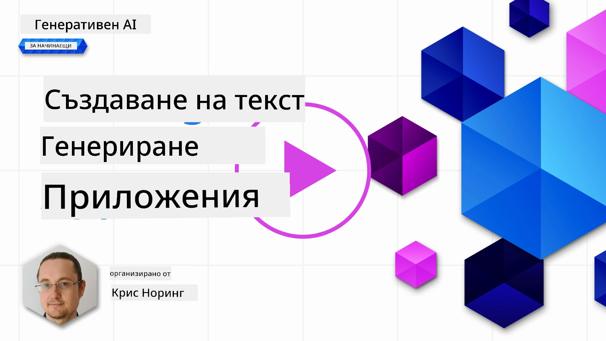

# Създаване на приложения за генериране на текст

[](https://youtu.be/0Y5Luf5sRQA?si=t_xVg0clnAI4oUFZ)

> _(Кликнете върху изображението по-горе, за да гледате видеото на този урок)_

До момента сте видели, че има основни концепции като подсказките (prompts) и дори цяла дисциплина, наречена "prompt engineering". Много инструменти, с които можете да взаимодействате, като ChatGPT, Office 365, Microsoft Power Platform и други, ви подкрепят, като използвате подсказки, за да постигнете нещо.

За да добавите такова преживяване в едно приложение, трябва да разберете концепции като подсказки, допълнения и да изберете библиотека, с която да работите. Това точно ще научите в тази глава.

## Въведение

В тази глава ще:

- Научите за библиотеката openai и нейните основни концепции.
- Създадете приложение за генериране на текст, използвайки openai.
- Разберете как да използвате концепции като подсказка (prompt), температура и токени за изграждане на текстово приложение.

## Цели на обучението

В края на този урок ще можете да:

- Обясните какво е приложение за генериране на текст.
- Създадете приложение за генериране на текст с помощта на openai.
- Конфигурирате приложението си да използва повече или по-малко токени и също така да променяте температурата за по-разнообразен изход.

## Какво е приложение за генериране на текст?

Обикновено, когато създавате приложение, то има някакъв вид интерфейс като следния:

- Командно-базирано. Конзолните приложения са типични приложения, където въвеждате команда и тя изпълнява задача. Например, `git` е командно-базирано приложение.
- Потребителски интерфейс (UI). Някои приложения имат графични потребителски интерфейси (GUI), където щраквате бутони, въвеждате текст, избирате опции и други.

### Конзолните и UI приложения са ограничени

Сравнете го с командно-базирано приложение, където въвеждате команда:

- **Ограничено е**. Не можете просто да въвеждате произволна команда, а само тези, които приложението поддържа.
- **Езиково специфично**. Някои приложения поддържат много езици, но по подразбиране приложението е създадено за конкретен език, дори ако можете да добавите подкрепа за повече езици.

### Предимства на приложенията за генериране на текст

Как тогава е различно приложението за генериране на текст?

В приложение за генериране на текст имате по-голяма гъвкавост, не сте ограничени до набор от команди или конкретен входен език. Вместо това можете да използвате естествен език, за да взаимодействате с приложението. Друго предимство е, че вече взаимодействате с източник на данни, който е обучен върху огромен корпус от информация, докато традиционно приложение може да е ограничено от това, което има в база данни.

### Какво мога да създам с приложение за генериране на текст?

Има много неща, които можете да създадете. Например:

- **Чатбот**. Чатбот, отговарящ на въпроси по теми, като вашата компания и нейните продукти, може да е добър избор.
- **Помощник**. Големите езикови модели (LLM) са добри в неща като обобщаване на текст, извличане на прозрения от текст, генериране на текст като автобиографии и други.
- **Асистент за кодиране**. В зависимост от езиковия модел, който използвате, можете да създадете асистент за кодиране, който да ви помага да пишете код. Например, можете да използвате продукти като GitHub Copilot, както и ChatGPT, за да ви помогнат при писане на код.

## Как да започнете?

Е, трябва да намерите начин да се интегрирате с голям езиков модел (LLM), което обикновено означава следните два подхода:

- Използвате API. Тук създавате уеб заявки с вашата подсказка и получавате обратно генериран текст.
- Използвате библиотека. Библиотеките помагат да се капсулират тези API повиквания и ги правят по-лесни за използване.

## Библиотеки/SDK

Има няколко добре познати библиотеки за работа с големи езикови модели, като:

- **openai**, тази библиотека улеснява връзката с вашия модел и изпращането на подсказки.

След това има библиотеки, които работят на по-високо ниво, като:

- **Langchain**. Langchain е добре позната и поддържа Python.
- **Semantic Kernel**. Semantic Kernel е библиотека на Microsoft, която поддържа езиците C#, Python и Java.

## Първо приложение с openai

Нека да видим как можем да създадем първото си приложение, какви библиотеки са ни необходими, колко е необходимо и т.н.

### Инсталиране на openai

Има много библиотеки за взаимодействие с OpenAI или Azure OpenAI. Можете да използвате множество програмни езици, като C#, Python, JavaScript, Java и други. Ние избрахме да използваме Python библиотеката `openai`, затова ще използваме `pip` за инсталация.

```bash
pip install openai
```

### Създаване на ресурс

Трябва да извършите следните стъпки:

- Създайте акаунт в Azure [https://azure.microsoft.com/free/](https://azure.microsoft.com/free/?WT.mc_id=academic-105485-koreyst).
- Достъп до Azure OpenAI. Отидете на [https://learn.microsoft.com/azure/ai-services/openai/overview#how-do-i-get-access-to-azure-openai](https://learn.microsoft.com/azure/ai-services/openai/overview#how-do-i-get-access-to-azure-openai?WT.mc_id=academic-105485-koreyst) и поискайте достъп.

  > [!NOTE]
  > По време на писането е необходимо да кандидатствате за достъп до Azure OpenAI.

- Инсталирайте Python <https://www.python.org/>
- Създайте ресурс Azure OpenAI Service. Вижте това ръководство как да [създадете ресурс](https://learn.microsoft.com/azure/ai-services/openai/how-to/create-resource?pivots=web-portal?WT.mc_id=academic-105485-koreyst).

### Намерете API ключ и крайна точка

В този момент трябва да кажете на библиотеката `openai` кой API ключ да използва. За да намерите своя API ключ, отидете в секцията "Keys and Endpoint" на вашия ресурс Azure OpenAI и копирайте стойността на "Key 1".


След като имате тази информация копирана, нека инструктираме библиотеките да я използват.

> [!NOTE]
> Струва си да отделите API ключа си от кода. Можете да го направите, като използвате променливи на средата.
>
> - Задайте променливата на средата `OPENAI_API_KEY` на вашия API ключ.
>   `export OPENAI_API_KEY='sk-...'`

### Конфигуриране на Azure

Ако използвате Azure OpenAI (част от Microsoft Foundry), ето как да настроите конфигурацията. Използваме стандартния клиент `OpenAI`, насочен към Azure OpenAI крайна точка `/openai/v1/`, която работи с Responses API и не изисква `api_version`:

```python
import os
from openai import OpenAI

client = OpenAI(
    api_key=os.environ["AZURE_OPENAI_API_KEY"],
    base_url=f"{os.environ['AZURE_OPENAI_ENDPOINT'].rstrip('/')}/openai/v1/",
)
```

По-горе задаваме следното:

- `api_key`, това е вашият API ключ, намерен в Azure портала или Microsoft Foundry портала.
- `base_url`, това е крайна точка на вашия ресурс Foundry с добавено `/openai/v1/`. Стабилната v1 крайната точка работи както с OpenAI, така и с Azure OpenAI без управление на `api_version`.

> [!NOTE] > `os.environ` чете променливи на средата. Можете да го използвате, за да прочетете променливи на средата като `AZURE_OPENAI_API_KEY` и `AZURE_OPENAI_ENDPOINT`. Задайте тези променливи на средата в терминала си или чрез библиотека като `dotenv`.

## Генериране на текст

Начинът за генериране на текст е чрез Responses API чрез метода `responses.create`. Ето един пример:

```python
prompt = "Complete the following: Once upon a time there was a"

response = client.responses.create(
    model="gpt-4o-mini",  # това е името на вашето внедряване на модел
    input=prompt,
    store=False,
)
print(response.output_text)
```

В горния код създаваме отговор и подаваме модела, който искаме да използваме и подсказката. След това отпечатваме генерирания текст чрез `response.output_text`.

### Многократни разговори

Responses API е подходящ както за генериране на текст в една стъпка, така и за многократни чатботи - подавате списък със съобщения в `input` за изграждане на разговор:

```python
from openai import OpenAI

client = OpenAI(api_key="sk-...")

response = client.responses.create(model="gpt-4o-mini", input="Hello world", store=False)
print(response.output_text)
```

Повече за тази функционалност в следваща глава.

## Упражнение - първото ви приложение за генериране на текст

Сега, след като научихме как да настроим и конфигурираме openai, е време да изградим първото ви приложение за генериране на текст. Следвайте тези стъпки:

1. Създайте виртуална среда и инсталирайте openai:

   ```bash
   python -m venv venv
   source venv/bin/activate
   pip install openai
   ```

   > [!NOTE]
   > Ако използвате Windows, напишете `venv\Scripts\activate` вместо `source venv/bin/activate`.

   > [!NOTE]
   > Намерете своя Azure OpenAI ключ, като отидете на [https://portal.azure.com/](https://portal.azure.com/?WT.mc_id=academic-105485-koreyst), потърсете `Open AI`, изберете `Open AI resource` и след това изберете `Keys and Endpoint`, копирайте стойността на `Key 1`.

1. Създайте файл _app.py_ и сложете следния код в него:

   ```python
   import os
   from openai import OpenAI

   client = OpenAI(
       api_key="<replace this value with your Azure OpenAI key>",
       base_url="<endpoint found in Azure Portal>/openai/v1/",
   )
   deployment_name = "<deployment name>"

   # добавете вашия завършващ код
   prompt = "Complete the following: Once upon a time there was a"

   # направете заявка с помощта на Responses API
   response = client.responses.create(model=deployment_name, input=prompt, store=False)

   # отпечатайте отговора
   print(response.output_text)
   ```

   > [!NOTE]
   > Ако използвате обикновен OpenAI (не Azure), използвайте `client = OpenAI(api_key="<заменете тази стойност с вашия OpenAI ключ>")` (без `base_url`) и подайте името на модел като `gpt-4o-mini` вместо име на разгръщане.

   Ще видите изход нещо подобно:

   ```output
    very unhappy _____.

   Once upon a time there was a very unhappy mermaid.
   ```

## Различни видове подсказки за различни неща

Сега, след като видяхте как да генерирате текст с помощта на подсказка, имате програма, която работи и можете да я модифицирате и променяте, за да генерирате различни видове текст.

Подсказките могат да се използват за всякакви задачи. Например:

- **Генериране на тип текст**. Например, можете да генерирате поема, въпроси за викторина и т.н.
- **Търсене на информация**. Можете да използвате подсказки, за да търсите информация, като в следния пример: "Какво означава CORS в уеб разработката?".
- **Генериране на код**. Можете да използвате подсказки, за да генерирате код, например за създаване на регулярен израз за валидиране на имейли или защо не да генерирате цяла програма, като уеб приложение?

## По-практичен случай: генератор на рецепти

Представете си, че имате съставки вкъщи и искате да сготвите нещо. За това ви трябва рецепта. Един начин да намерите рецепти е да използвате търсачка, или да използвате LLM за тази цел.

Можете да напишете подсказка, например:

> "Покажи ми 5 рецепти за ястие със следните съставки: пилешко, картофи и моркови. За всяка рецепта изброи всички използвани съставки."

При дадената подсказка можете да получите отговор, подобен на:

```output
1. Roasted Chicken and Vegetables:
Ingredients:
- 4 chicken thighs
- 2 potatoes, cut into cubes
- 2 carrots, cut into cubes
- 2 tablespoons olive oil
- 2 cloves garlic, minced
- 1 teaspoon dried thyme
- 1 teaspoon dried oregano
- Salt and pepper, to taste

2. Chicken and Potato Stew:
Ingredients:
- 2 tablespoons olive oil
- 1 onion, diced
- 2 cloves garlic, minced
- 2 chicken breasts, cut into cubes
- 2 potatoes, cut into cubes
- 2 carrots, cut into cubes
- 1 teaspoon dried oregano
- 1 teaspoon dried thyme
- 1 cup chicken broth
- Salt and pepper, to taste

3. Chicken and Potato Bake:
Ingredients:
- 2 tablespoons olive oil
- 2 chicken breasts, cut into cubes
- 2 potatoes, cut into cubes
- 2 carrots, cut into cubes
- 1 onion, diced
- 2 cloves garlic, minced
- 1 teaspoon dried oregano
- 1 teaspoon dried thyme
- 1 cup chicken broth
- Salt and pepper, to taste

4. Chicken and Potato Soup:
Ingredients:
- 2 tablespoons olive oil
- 1 onion, diced
- 2 cloves garlic, minced
- 2 chicken breasts, cut into cubes
- 2 potatoes, cut into cubes
- 2 carrots, cut into cubes
- 1 teaspoon dried oregano
- 1 teaspoon dried thyme
- 4 cups chicken broth
- Salt and pepper, to taste

5. Chicken and Potato Hash:
Ingredients:
- 2 tablespoons olive oil
- 2 chicken breasts, cut into cubes
- 2 potatoes, cut into cubes
- 2 carrots, cut into cubes
- 1 onion, diced
- 2 cloves garlic, minced
- 1 teaspoon dried oregano
```

Това е страхотен резултат, знам какво да сготвя. В този момент полезни подобрения биха могли да бъдат:

- Филтриране на съставки, които не харесвам или към които имам алергия.
- Генериране на списък за пазаруване, в случай че няма всички съставки вкъщи.

За горните случаи, нека добавим допълнителна подсказка:

> "Моля, премахнете рецепти с чесън, тъй като съм алергичен/а и ги заменете с нещо друго. Също така, моля, направете списък за пазаруване за рецептите, като имате предвид, че вече имам пилешко, картофи и моркови вкъщи."

Сега имате нов резултат, а именно:

```output
1. Roasted Chicken and Vegetables:
Ingredients:
- 4 chicken thighs
- 2 potatoes, cut into cubes
- 2 carrots, cut into cubes
- 2 tablespoons olive oil
- 1 teaspoon dried thyme
- 1 teaspoon dried oregano
- Salt and pepper, to taste

2. Chicken and Potato Stew:
Ingredients:
- 2 tablespoons olive oil
- 1 onion, diced
- 2 chicken breasts, cut into cubes
- 2 potatoes, cut into cubes
- 2 carrots, cut into cubes
- 1 teaspoon dried oregano
- 1 teaspoon dried thyme
- 1 cup chicken broth
- Salt and pepper, to taste

3. Chicken and Potato Bake:
Ingredients:
- 2 tablespoons olive oil
- 2 chicken breasts, cut into cubes
- 2 potatoes, cut into cubes
- 2 carrots, cut into cubes
- 1 onion, diced
- 1 teaspoon dried oregano
- 1 teaspoon dried thyme
- 1 cup chicken broth
- Salt and pepper, to taste

4. Chicken and Potato Soup:
Ingredients:
- 2 tablespoons olive oil
- 1 onion, diced
- 2 chicken breasts, cut into cubes
- 2 potatoes, cut into cubes
- 2 carrots, cut into cubes
- 1 teaspoon dried oregano
- 1 teaspoon dried thyme
- 4 cups chicken broth
- Salt and pepper, to taste

5. Chicken and Potato Hash:
Ingredients:
- 2 tablespoons olive oil
- 2 chicken breasts, cut into cubes
- 2 potatoes, cut into cubes
- 2 carrots, cut into cubes
- 1 onion, diced
- 1 teaspoon dried oregano

Shopping List:
- Olive oil
- Onion
- Thyme
- Oregano
- Salt
- Pepper
```

Това са вашите пет рецепти без споменаване на чесън, както и списък за пазаруване, като се отчита какво вече имате вкъщи.

## Упражнение - създайте генератор на рецепти

След като разгледахме този сценарий, нека напишем код, който съответства на демонстрирания пример. За да го направите, следвайте тези стъпки:

1. Използвайте съществуващия файл _app.py_ като отправна точка
1. Намерете променливата `prompt` и променете нейния код на следния:

   ```python
   prompt = "Show me 5 recipes for a dish with the following ingredients: chicken, potatoes, and carrots. Per recipe, list all the ingredients used"
   ```

   Ако сега стартирате кода, трябва да видите изход, подобен на:

   ```output
   -Chicken Stew with Potatoes and Carrots: 3 tablespoons oil, 1 onion, chopped, 2 cloves garlic, minced, 1 carrot, peeled and chopped, 1 potato, peeled and chopped, 1 bay leaf, 1 thyme sprig, 1/2 teaspoon salt, 1/4 teaspoon black pepper, 1 1/2 cups chicken broth, 1/2 cup dry white wine, 2 tablespoons chopped fresh parsley, 2 tablespoons unsalted butter, 1 1/2 pounds boneless, skinless chicken thighs, cut into 1-inch pieces
   -Oven-Roasted Chicken with Potatoes and Carrots: 3 tablespoons extra-virgin olive oil, 1 tablespoon Dijon mustard, 1 tablespoon chopped fresh rosemary, 1 tablespoon chopped fresh thyme, 4 cloves garlic, minced, 1 1/2 pounds small red potatoes, quartered, 1 1/2 pounds carrots, quartered lengthwise, 1/2 teaspoon salt, 1/4 teaspoon black pepper, 1 (4-pound) whole chicken
   -Chicken, Potato, and Carrot Casserole: cooking spray, 1 large onion, chopped, 2 cloves garlic, minced, 1 carrot, peeled and shredded, 1 potato, peeled and shredded, 1/2 teaspoon dried thyme leaves, 1/4 teaspoon salt, 1/4 teaspoon black pepper, 2 cups fat-free, low-sodium chicken broth, 1 cup frozen peas, 1/4 cup all-purpose flour, 1 cup 2% reduced-fat milk, 1/4 cup grated Parmesan cheese

   -One Pot Chicken and Potato Dinner: 2 tablespoons olive oil, 1 pound boneless, skinless chicken thighs, cut into 1-inch pieces, 1 large onion, chopped, 3 cloves garlic, minced, 1 carrot, peeled and chopped, 1 potato, peeled and chopped, 1 bay leaf, 1 thyme sprig, 1/2 teaspoon salt, 1/4 teaspoon black pepper, 2 cups chicken broth, 1/2 cup dry white wine

   -Chicken, Potato, and Carrot Curry: 1 tablespoon vegetable oil, 1 large onion, chopped, 2 cloves garlic, minced, 1 carrot, peeled and chopped, 1 potato, peeled and chopped, 1 teaspoon ground coriander, 1 teaspoon ground cumin, 1/2 teaspoon ground turmeric, 1/2 teaspoon ground ginger, 1/4 teaspoon cayenne pepper, 2 cups chicken broth, 1/2 cup dry white wine, 1 (15-ounce) can chickpeas, drained and rinsed, 1/2 cup raisins, 1/2 cup chopped fresh cilantro
   ```

   > ЗАБЕЛЕЖКА: Вашият LLM е недетерминистичен, така че може да получите различни резултати всеки път, когато стартирате програмата.

   Страхотно, нека видим как можем да подобрим нещата. За подобряване искаме кодът да бъде гъвкав, така че съставките и броят на рецептите да могат да бъдат променяни и подобрявани.

1. Нека променим кода по следния начин:

   ```python
   no_recipes = input("No of recipes (for example, 5): ")

   ingredients = input("List of ingredients (for example, chicken, potatoes, and carrots): ")

   # интерполирайте броя на рецептите в подканата и съставките
   prompt = f"Show me {no_recipes} recipes for a dish with the following ingredients: {ingredients}. Per recipe, list all the ingredients used"
   ```

   Стартирането на кода за тест изглежда така:

   ```output
   No of recipes (for example, 5): 3
   List of ingredients (for example, chicken, potatoes, and carrots): milk,strawberries

   -Strawberry milk shake: milk, strawberries, sugar, vanilla extract, ice cubes
   -Strawberry shortcake: milk, flour, baking powder, sugar, salt, unsalted butter, strawberries, whipped cream
   -Strawberry milk: milk, strawberries, sugar, vanilla extract
   ```

### Подобряване чрез добавяне на филтър и списък за пазаруване

Сега имаме работещо приложение, което може да генерира рецепти и е гъвкаво, тъй като се основава на вход от потребителя, както за броя на рецептите, така и за използваните съставки.

За да го подобрим допълнително, искаме да добавим следното:

- **Филтриране на съставки**. Искаме да можем да филтрираме съставки, които не харесваме или към които имаме алергия. За да постигнем това, можем да редактираме съществуващата подсказка и да добавим условие за филтър в края ѝ, ето така:

  ```python
  filter = input("Filter (for example, vegetarian, vegan, or gluten-free): ")

  prompt = f"Show me {no_recipes} recipes for a dish with the following ingredients: {ingredients}. Per recipe, list all the ingredients used, no {filter}"
  ```

  По-горе добавяме `{filter}` в края на подсказката и също улавяме стойността на филтъра от потребителя.

  Примерният вход при изпълнение на програмата може да изглежда така:

  ```output
  No of recipes (for example, 5): 3
  List of ingredients (for example, chicken, potatoes, and carrots): onion,milk
  Filter (for example, vegetarian, vegan, or gluten-free): no milk

  1. French Onion Soup

  Ingredients:

  -1 large onion, sliced
  -3 cups beef broth
  -1 cup milk
  -6 slices french bread
  -1/4 cup shredded Parmesan cheese
  -1 tablespoon butter
  -1 teaspoon dried thyme
  -1/4 teaspoon salt
  -1/4 teaspoon black pepper

  Instructions:

  1. In a large pot, sauté onions in butter until golden brown.
  2. Add beef broth, milk, thyme, salt, and pepper. Bring to a boil.
  3. Reduce heat and simmer for 10 minutes.
  4. Place french bread slices on soup bowls.
  5. Ladle soup over bread.
  6. Sprinkle with Parmesan cheese.

  2. Onion and Potato Soup

  Ingredients:

  -1 large onion, chopped
  -2 cups potatoes, diced
  -3 cups vegetable broth
  -1 cup milk
  -1/4 teaspoon black pepper

  Instructions:

  1. In a large pot, sauté onions in butter until golden brown.
  2. Add potatoes, vegetable broth, milk, and pepper. Bring to a boil.
  3. Reduce heat and simmer for 10 minutes.
  4. Serve hot.

  3. Creamy Onion Soup

  Ingredients:

  -1 large onion, chopped
  -3 cups vegetable broth
  -1 cup milk
  -1/4 teaspoon black pepper
  -1/4 cup all-purpose flour
  -1/2 cup shredded Parmesan cheese

  Instructions:

  1. In a large pot, sauté onions in butter until golden brown.
  2. Add vegetable broth, milk, and pepper. Bring to a boil.
  3. Reduce heat and simmer for 10 minutes.
  4. In a small bowl, whisk together flour and Parmesan cheese until smooth.
  5. Add to soup and simmer for an additional 5 minutes, or until soup has thickened.
  ```

  Както виждате, всяка рецепта с мляко е филтрирана. Но, ако сте непоносими към лактоза, може би ще искате да филтрирате и рецепти с сирене, така че трябва да бъдете ясни.


- **Създайте списък за пазаруване**. Искаме да създадем списък за пазаруване, като вземем предвид какво вече имаме вкъщи.

  За тази функционалност можем или да опитаме да решим всичко с един въпрос (prompt), или да го разделим на два въпроса. Нека опитаме втория подход. Тук предлагаме да добавим допълнителен въпрос, но за да работи това, трябва да добавим резултата от първия въпрос като контекст към втория въпрос.

  Намерете частта в кода, която извежда резултата от първия въпрос и добавете следния код под нея:

  ```python
  old_prompt_result = response.output_text
  prompt = "Produce a shopping list for the generated recipes and please don't include ingredients that I already have."

  new_prompt = f"{old_prompt_result} {prompt}"
  response = client.responses.create(model=deployment_name, input=new_prompt, max_output_tokens=1200, store=False)

  # отпечатай отговора
  print("Shopping list:")
  print(response.output_text)
  ```

  Обърнете внимание на следното:

  1. Създаваме нов въпрос, като добавяме резултата от първия въпрос към новия въпрос:

     ```python
     new_prompt = f"{old_prompt_result} {prompt}"
     ```

  1. Правим ново запитване, като също така взимаме предвид броя токени, които поискахме в първия въпрос, затова този път казваме, че `max_output_tokens` е 1200.

     ```python
     response = client.responses.create(model=deployment_name, input=new_prompt, max_output_tokens=1200, store=False)
     ```

     Когато изпълним този код, получаваме следния изход:

     ```output
     No of recipes (for example, 5): 2
     List of ingredients (for example, chicken, potatoes, and carrots): apple,flour
     Filter (for example, vegetarian, vegan, or gluten-free): sugar


     -Apple and flour pancakes: 1 cup flour, 1/2 tsp baking powder, 1/2 tsp baking soda, 1/4 tsp salt, 1 tbsp sugar, 1 egg, 1 cup buttermilk or sour milk, 1/4 cup melted butter, 1 Granny Smith apple, peeled and grated
     -Apple fritters: 1-1/2 cups flour, 1 tsp baking powder, 1/4 tsp salt, 1/4 tsp baking soda, 1/4 tsp nutmeg, 1/4 tsp cinnamon, 1/4 tsp allspice, 1/4 cup sugar, 1/4 cup vegetable shortening, 1/4 cup milk, 1 egg, 2 cups shredded, peeled apples
     Shopping list:
     -Flour, baking powder, baking soda, salt, sugar, egg, buttermilk, butter, apple, nutmeg, cinnamon, allspice
     ```

## Подобрете своята настройка

Това, което имаме досега, е работещ код, но има някои промени, които можем да направим, за да подобрим нещата допълнително. Някои неща, които трябва да направим, са:

- **Отделете тайните от кода**, като API ключа. Тайните не принадлежат в кода и трябва да се съхраняват на сигурно място. За да отделим тайните от кода, можем да използваме променливи на средата (environment variables) и библиотеки като `python-dotenv`, за да ги зареждаме от файл. Ето как би изглеждало това в кода:

  1. Създайте файл `.env` със следното съдържание:

     ```bash
     OPENAI_API_KEY=sk-...
     ```

     > Забележка: за Azure OpenAI в Microsoft Foundry трябва да зададете следните променливи на средата вместо това:

     ```bash
     AZURE_OPENAI_API_KEY=<replace>
     AZURE_OPENAI_ENDPOINT=<replace>
     AZURE_OPENAI_API_VERSION=2024-10-21
     ```

     В кода променливите на средата се зареждат по следния начин:

     ```python
     import os
     from dotenv import load_dotenv
     from openai import OpenAI

     load_dotenv()

     client = OpenAI(api_key=os.environ["OPENAI_API_KEY"])
     ```

- **Дума за дължината на токените**. Трябва да вземем предвид колко токена са нужни, за да генерираме желания текст. Токените струват пари, затова, където е възможно, трябва да бъдем икономични с броя на използваните токени. Например, може ли да оформим въпроса така, че да използваме по-малко токени?

  За да промените броя на използваните токени, може да използвате параметъра `max_output_tokens`. Например, ако искате да използвате 100 токена, бихте направили следното:

  ```python
  response = client.responses.create(model=deployment, input=prompt, max_output_tokens=100, store=False)
  ```

- **Експериментиране с температурата**. Температурата е нещо, което досега не сме споменавали, но е важен контекст за това как работи нашата програма. Колкото по-висока е стойността на температурата, толкова по-случаен ще е изходът. Обратно, колкото по-ниска е стойността, толкова по-предсказуем ще е изходът. Помислете дали искате вариация в изхода си или не.

  За да промените температурата, може да използвате параметъра `temperature`. Например, ако искате да зададете температура 0.5, бихте направили следното:

  ```python
  response = client.responses.create(model=deployment, input=prompt, temperature=0.5, store=False)
  ```

  > Забележка: колкото по-близо до 1.0, толкова по-разнообразен ще бъде изходът.

## Задача

За тази задача можете да изберете какво да създадете.

Ето някои предложения:

- Променете приложението за генериране на рецепти, за да го подобрите още. Играйте с различни стойности на температурата и с въпросите, за да видите какво можете да постигнете.
- Създайте „учебен помощник“. Това приложение трябва да може да отговаря на въпроси по определена тема, например Python. Можете да имате въпроси като „Какво представлява дадена тема в Python?“ или въпроси, в които поискате код за определена тема и др.
- Исторически бот, направете историята жива, инструктирайте бота да изиграе определен исторически персонаж и го питайте въпроси за неговия живот и времена.

## Решение

### Учебен помощник

По-долу е даден примерен начален въпрос, вижте как можете да го използвате и да го промените по ваш вкус.

```text
- "You're an expert on the Python language

    Suggest a beginner lesson for Python in the following format:

    Format:
    - concepts:
    - brief explanation of the lesson:
    - exercise in code with solutions"
```

### Исторически бот

Ето някои въпроси, които можете да използвате:

```text
- "You are Abe Lincoln, tell me about yourself in 3 sentences, and respond using grammar and words like Abe would have used"
- "You are Abe Lincoln, respond using grammar and words like Abe would have used:

   Tell me about your greatest accomplishments, in 300 words"
```

## Проверка на знанията

Какво прави концепцията за температура?

1. Контролира колко случаен ще бъде изходът.
1. Контролира колко голям ще бъде отговорът.
1. Контролира колко токена се използват.

## 🚀 Предизвикателство

Докато работите по задачата, опитайте да изменяте температурата, задавайки я на 0, 0.5 и 1. Запомнете, че 0 е най-малко разнообразна, а 1 е най-много. Коя стойност работи най-добре за вашето приложение?

## Отлична работа! Продължете обучението си

След като завършите този урок, разгледайте нашата [сборка „Обучение за генеративен ИИ“](https://aka.ms/genai-collection?WT.mc_id=academic-105485-koreyst), за да продължите да повишавате знанията си за генеративен ИИ!

Отидете на Урок 7, където ще разгледаме как да [създаваме чат приложения](../07-building-chat-applications/README.md?WT.mc_id=academic-105485-koreyst)!

---

<!-- CO-OP TRANSLATOR DISCLAIMER START -->
**Отказ от отговорност**:
Този документ е преведен с помощта на AI преводачески услуга [Co-op Translator](https://github.com/Azure/co-op-translator). Въпреки че се стремим към точност, моля имайте предвид, че автоматизираните преводи могат да съдържат грешки или неточности. Оригиналният документ на неговия роден език трябва да се счита за авторитетен източник. За критична информация се препоръчва професионален човешки превод. Ние не носим отговорност за каквито и да е недоразумения или неправилни тълкувания, произтичащи от използването на този превод.
<!-- CO-OP TRANSLATOR DISCLAIMER END -->