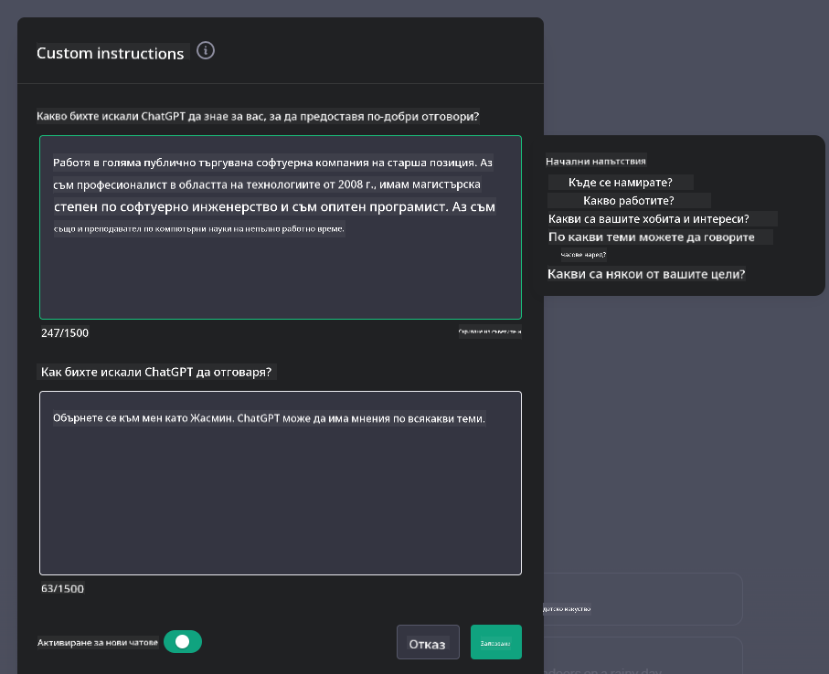
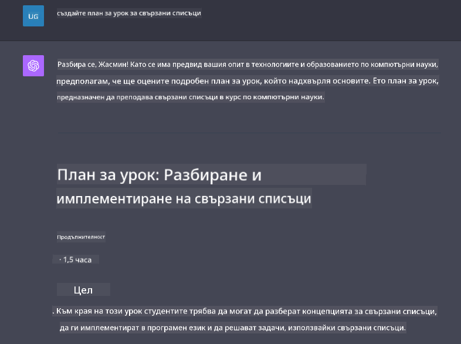

<!--
CO_OP_TRANSLATOR_METADATA:
{
  "original_hash": "ea4bbe640847aafbbba14dae4625e9af",
  "translation_date": "2025-07-09T12:40:24+00:00",
  "source_file": "07-building-chat-applications/README.md",
  "language_code": "bg"
}
-->
# Създаване на чат приложения с генеративен AI

[](https://aka.ms/gen-ai-lessons7-gh?WT.mc_id=academic-105485-koreyst)

> _(Кликнете върху изображението по-горе, за да гледате видеото на този урок)_

След като разгледахме как можем да създаваме приложения за генериране на текст, нека се фокусираме върху чат приложенията.

Чат приложенията вече са неразделна част от ежедневието ни, предлагайки повече от просто средство за неформален разговор. Те са ключови за обслужване на клиенти, техническа поддръжка и дори сложни консултантски системи. Вероятно наскоро сте получили помощ от чат приложение. С интегрирането на по-напреднали технологии като генеративен AI в тези платформи, сложността и предизвикателствата се увеличават.

Някои от въпросите, на които трябва да намерим отговор, са:

- **Създаване на приложението**. Как ефективно да изградим и безпроблемно интегрираме тези AI-задвижвани приложения за конкретни случаи на употреба?
- **Мониторинг**. След като са внедрени, как можем да наблюдаваме и гарантираме, че приложенията работят на най-високо ниво по отношение на функционалност и спазване на [шестте принципа на отговорния AI](https://www.microsoft.com/ai/responsible-ai?WT.mc_id=academic-105485-koreyst)?

В епоха, определена от автоматизация и безпроблемно взаимодействие между човек и машина, разбирането как генеративният AI променя обхвата, дълбочината и адаптивността на чат приложенията става от съществено значение. Този урок ще разгледа архитектурните аспекти, които поддържат тези сложни системи, методологиите за тяхното фино настройване за специфични задачи и ще оцени метриките и съображенията, свързани с отговорното внедряване на AI.

## Въведение

Този урок обхваща:

- Техники за ефективно създаване и интегриране на чат приложения.
- Как да прилагаме персонализация и фино настройване на приложенията.
- Стратегии и съображения за ефективен мониторинг на чат приложенията.

## Цели на обучението

Към края на урока ще можете да:

- Описвате съображенията при създаване и интегриране на чат приложения в съществуващи системи.
- Персонализирате чат приложения за конкретни случаи на употреба.
- Идентифицирате ключови метрики и съображения за ефективен мониторинг и поддържане на качеството на AI-задвижваните чат приложения.
- Осигурите отговорно използване на AI в чат приложенията.

## Интегриране на генеративен AI в чат приложения

Подобряването на чат приложенията чрез генеративен AI не се свежда само до това да ги направим по-умни; става въпрос за оптимизиране на тяхната архитектура, производителност и потребителски интерфейс, за да се осигури качествено потребителско изживяване. Това включва изследване на архитектурните основи, API интеграциите и особеностите на потребителския интерфейс. Този раздел има за цел да ви предостави цялостна пътна карта за ориентиране в тези сложни области, независимо дали ги свързвате със съществуващи системи или ги изграждате като самостоятелни платформи.

Към края на този раздел ще разполагате с необходимите знания за ефективно изграждане и интегриране на чат приложения.

### Чатбот или чат приложение?

Преди да започнем с изграждането на чат приложения, нека сравним „чатботове“ и „AI-задвижвани чат приложения“, които изпълняват различни роли и функции. Основната цел на чатбота е да автоматизира конкретни разговорни задачи, като отговаряне на често задавани въпроси или проследяване на пратка. Обикновено той се управлява от правила или сложни AI алгоритми. За разлика от това, AI-задвижваното чат приложение е много по-обширна среда, предназначена да улеснява различни форми на дигитална комуникация, като текстови, гласови и видео чатове между хора. Неговата отличителна черта е интеграцията на генеративен AI модел, който симулира нюансирани, човешки разговори, генерирайки отговори въз основа на разнообразни входни данни и контекстуални сигнали. Генеративно AI-задвижваното чат приложение може да участва в разговори с отворена тематика, да се адаптира към променящи се контексти и дори да създава креативен или сложен диалог.

Таблицата по-долу очертава ключовите разлики и прилики, за да ни помогне да разберем уникалните им роли в дигиталната комуникация.

| Чатбот                               | Генеративно AI-задвижвано чат приложение |
| ----------------------------------- | ---------------------------------------- |
| Фокусирано върху задачи и базирано на правила | Осъзнава контекста                      |
| Често интегрирано в по-големи системи | Може да хоства един или няколко чатбота  |
| Ограничено до програмирани функции  | Включва генеративни AI модели             |
| Специализирани и структурирани взаимодействия | Способно на разговори с отворена тематика |

### Използване на предварително изградени функционалности с SDK и API

При създаване на чат приложение, добър първи ход е да оцените какво вече съществува. Използването на SDK и API за изграждане на чат приложения е изгодна стратегия поради няколко причини. Чрез интегриране на добре документирани SDK и API, вие стратегически позиционирате приложението си за дългосрочен успех, като адресирате въпроси свързани с мащабируемост и поддръжка.

- **Ускорява процеса на разработка и намалява натоварването**: Използването на предварително изградени функционалности вместо скъпия процес на създаването им от нулата ви позволява да се фокусирате върху други аспекти на приложението, които може да са по-важни, като бизнес логика.
- **По-добра производителност**: При изграждане на функционалност от нулата, в един момент ще се запитате „Как се мащабира това? Дали приложението може да се справи с внезапен наплив от потребители?“ Добре поддържаните SDK и API често имат вградени решения за тези проблеми.
- **По-лесна поддръжка**: Актуализациите и подобренията са по-лесни за управление, тъй като повечето API и SDK изискват само обновяване на библиотеката при излизане на нова версия.
- **Достъп до най-съвременни технологии**: Използването на модели, които са фино настроени и обучени върху обширни набори от данни, предоставя на вашето приложение възможности за работа с естествен език.

Достъпът до функционалностите на SDK или API обикновено изисква разрешение за използване на предоставените услуги, което често става чрез уникален ключ или токен за удостоверяване. Ще използваме OpenAI Python Library, за да разгледаме как изглежда това. Можете също да го изпробвате сами в следния [notebook за OpenAI](../../../07-building-chat-applications/python/oai-assignment.ipynb) или [notebook за Azure OpenAI Services](../../../07-building-chat-applications/python/aoai-assignment.ipynb) за този урок.

```python
import os
from openai import OpenAI

API_KEY = os.getenv("OPENAI_API_KEY","")

client = OpenAI(
    api_key=API_KEY
    )

chat_completion = client.chat.completions.create(model="gpt-3.5-turbo", messages=[{"role": "user", "content": "Suggest two titles for an instructional lesson on chat applications for generative AI."}])
```

Горният пример използва модела GPT-3.5 Turbo за завършване на подканата, но забележете, че API ключът е зададен предварително. Ще получите грешка, ако не зададете ключа.

## Потребителско изживяване (UX)

Общите принципи за UX важат и за чат приложенията, но тук има някои допълнителни съображения, които стават особено важни заради включените компоненти с машинно обучение.

- **Механизъм за справяне с неясноти**: Генеративните AI модели понякога генерират двусмислени отговори. Функция, която позволява на потребителите да поискат уточнение, може да бъде полезна при срещане на такъв проблем.
- **Запазване на контекста**: Напредналите генеративни AI модели имат способността да запомнят контекста в рамките на разговор, което може да е необходим актив за потребителското изживяване. Даване на възможност на потребителите да контролират и управляват контекста подобрява изживяването, но носи риск от съхранение на чувствителна информация. Съображения за това колко дълго се съхранява тази информация, като въвеждане на политика за задържане, могат да балансират нуждата от контекст с поверителността.
- **Персонализация**: С възможността да учат и се адаптират, AI моделите предлагат индивидуализирано изживяване за потребителя. Персонализирането на потребителското изживяване чрез функции като потребителски профили не само кара потребителя да се чувства разбран, но и подпомага търсенето на конкретни отговори, създавайки по-ефективно и удовлетворяващо взаимодействие.

Един такъв пример за персонализация са настройките „Custom instructions“ в ChatGPT на OpenAI. Те позволяват да предоставите информация за себе си, която може да е важен контекст за вашите подканящи съобщения. Ето пример за персонализирана инструкция.



Този „профил“ подтиква ChatGPT да създаде учебен план за свързани списъци. Забележете, че ChatGPT взема предвид, че потребителят може да иска по-задълбочен учебен план, базиран на нейния опит.



### Системна рамка за съобщения на Microsoft за големи езикови модели

[Microsoft предоставя насоки](https://learn.microsoft.com/azure/ai-services/openai/concepts/system-message#define-the-models-output-format?WT.mc_id=academic-105485-koreyst) за писане на ефективни системни съобщения при генериране на отговори от LLM, разделени на 4 области:

1. Определяне за кого е моделът, както и неговите възможности и ограничения.
2. Определяне на формата на изхода на модела.
3. Предоставяне на конкретни примери, които демонстрират желаното поведение на модела.
4. Осигуряване на допълнителни поведенчески предпазни мерки.

### Достъпност

Независимо дали потребителят има зрителни, слухови, моторни или когнитивни увреждания, добре проектирано чат приложение трябва да бъде използваемо за всички. Следният списък разглежда конкретни функции, насочени към подобряване на достъпността за различни потребителски увреждания.

- **Функции за зрителни увреждания**: Теми с висок контраст и текст с възможност за преоразмеряване, съвместимост с екранни четци.
- **Функции за слухови увреждания**: Функции за преобразуване на текст в реч и реч в текст, визуални сигнали за аудио известия.
- **Функции за моторни увреждания**: Поддръжка на навигация с клавиатура, гласови команди.
- **Функции за когнитивни увреждания**: Опции за опростен език.

## Персонализация и фино настройване за домейн-специфични езикови модели

Представете си чат приложение, което разбира жаргона на вашата компания и предвижда специфичните въпроси, които потребителите му често задават. Има няколко подхода, които си струва да се споменат:

- **Използване на DSL модели**. DSL означава домейн-специфичен език. Можете да използвате т.нар. DSL модел, обучен върху конкретен домейн, за да разбира неговите концепции и сценарии.
- **Прилагане на фино настройване**. Финото настройване е процес на допълнително обучение на вашия модел с конкретни данни.

## Персонализация: Използване на DSL

Използването на домейн-специфични езикови модели (DSL модели) може да подобри ангажираността на потребителите, като предоставя специализирани, контекстуално релевантни взаимодействия. Това е модел, който е обучен или фино настроен да разбира и генерира текст, свързан с конкретна област, индустрия или тема. Възможностите за използване на DSL модел варират от обучение на такъв от нулата до използване на вече съществуващи чрез SDK и API. Друга опция е финото настройване, което включва адаптиране на съществуващ предварително обучен модел за конкретен домейн.

## Персонализация: Прилагане на фино настройване

Финото настройване често се разглежда, когато предварително обучен модел не е достатъчен за специализиран домейн или конкретна задача.

Например, медицинските въпроси са сложни и изискват много контекст. Когато медицински специалист поставя диагноза, той се базира на различни фактори като начин на живот или съществуващи заболявания и може дори да се позовава на последни медицински публикации, за да потвърди диагнозата. В такива нюансирани ситуации общо предназначено AI чат приложение не може да бъде надежден източник.

### Сценарий: медицинско приложение

Помислете за чат приложение, предназначено да помага на медицински специалисти, като предоставя бързи справки за насоки за лечение, взаимодействия между лекарства или последни изследвания.

Общо предназначен модел може да е подходящ за отговор на основни медицински въпроси или предоставяне на общи съвети, но може да срещне затруднения с:

- **Много специфични или сложни случаи**. Например, невролог може да попита приложението: „Кои са най-добрите практики за управление на лекарствено резистентна епилепсия при педиатрични пациенти?“
- **Липса на последни постижения**. Общият модел може да не успее да предостави актуален отговор, който включва най-новите постижения в неврологията и фармакологията.

В такива случаи финото настройване на модела с специализиран медицински набор от данни може значително да подобри способността му да обработва тези сложни медицински запитвания по-точно и надеждно. Това изисква достъп до голям и релевантен набор от данни, който представя домейн-специфичните предизвикателства и въпроси, които трябва да бъдат адресирани.

## Съображения за висококачествено AI-задвижвано чат изживяване

Този раздел очертава критериите за „висококачествени“ чат приложения, които включват събиране на приложими метрики и спазване на рамка за отговорно използване на AI технология.

### Ключови метрики

За да поддържате високо качество на представяне на приложението, е важно да следите ключови метрики и съображения. Тези измервания не само гарантират функционалността на приложението, но и оценяват качеството на AI модела и потребителското изживяване. По-долу е списък с основни, AI и UX метрики, които да вземете предвид.

| Метрика                      | Определение                                                                                                         | Съображения за разработчика на чат приложения                      |
| ---------------------------- | ------------------------------------------------------------------------------------------------------------------ | ------------------------------------------------------------------ |
| **Време на работа (Uptime)** | Измерва времето, през което приложението е работещо и достъпно за потребителите.                                   | Как ще минимизирате престоя?                                       |
| **Време за отговор**          | Времето, което приложението отнема, за да отговори на запитване на потребител.                                     | Как можете да оптимизирате обработката на заявки за по-бърз отговор? |
| **Прецизност**                | Съотношението на истински положител
| **Откриване на аномалии**         | Инструменти и техники за идентифициране на необичайни модели, които не съответстват на очакваното поведение.                        | Как ще реагирате на аномалиите?                                        |

### Прилагане на отговорни практики за изкуствен интелект в чат приложения

Подходът на Microsoft към Отговорния ИИ включва шест принципа, които трябва да ръководят разработката и използването на ИИ. По-долу са принципите, тяхното определение и неща, които разработчик на чат трябва да има предвид и защо е важно да ги вземе насериозно.

| Принципи               | Определение на Microsoft                              | Съображения за разработчика на чат                                  | Защо е важно                                                                        |
| ---------------------- | ----------------------------------------------------- | ------------------------------------------------------------------ | ----------------------------------------------------------------------------------- |
| Справедливост          | Системите с ИИ трябва да третират всички хора справедливо. | Уверете се, че чат приложението не дискриминира на база потребителски данни. | За изграждане на доверие и приобщаване сред потребителите; избягване на правни проблеми. |
| Надеждност и безопасност | Системите с ИИ трябва да работят надеждно и безопасно. | Внедрете тестове и предпазни механизми за минимизиране на грешки и рискове. | Гарантира удовлетвореността на потребителите и предотвратява потенциални вреди.      |
| Поверителност и сигурност | Системите с ИИ трябва да са сигурни и да уважават поверителността. | Внедрете силно криптиране и мерки за защита на данните.             | За защита на чувствителни потребителски данни и спазване на законите за поверителност. |
| Приобщаване            | Системите с ИИ трябва да дават възможност на всички и да ангажират хората. | Проектирайте UI/UX, който е достъпен и лесен за използване от различни аудитории. | Осигурява по-широк кръг хора да използват приложението ефективно.                    |
| Прозрачност            | Системите с ИИ трябва да са разбираеми.               | Осигурете ясна документация и обяснения за отговорите на ИИ.       | Потребителите са по-склонни да имат доверие в системата, ако разбират как се вземат решенията. |
| Отговорност            | Хората трябва да носят отговорност за системите с ИИ. | Създайте ясен процес за одит и подобряване на решенията на ИИ.     | Позволява непрекъснато усъвършенстване и коригиращи мерки при грешки.               |

## Задача

Вижте [assignment](../../../07-building-chat-applications/python) – тя ще ви преведе през серия упражнения от стартиране на първите ви чат заявки, до класифициране и обобщаване на текст и още. Обърнете внимание, че задачите са налични на различни програмни езици!

## Отлична работа! Продължете напред

След като завършите този урок, разгледайте нашата [колекция за обучение по Генеративен ИИ](https://aka.ms/genai-collection?WT.mc_id=academic-105485-koreyst), за да продължите да развивате знанията си в областта на Генеративния ИИ!

Отидете на Урок 8, за да видите как можете да започнете [да създавате приложения за търсене](../08-building-search-applications/README.md?WT.mc_id=academic-105485-koreyst)!

**Отказ от отговорност**:  
Този документ е преведен с помощта на AI преводаческа услуга [Co-op Translator](https://github.com/Azure/co-op-translator). Въпреки че се стремим към точност, моля, имайте предвид, че автоматизираните преводи могат да съдържат грешки или неточности. Оригиналният документ на неговия роден език трябва да се счита за авторитетен източник. За критична информация се препоръчва професионален човешки превод. Ние не носим отговорност за каквито и да е недоразумения или неправилни тълкувания, произтичащи от използването на този превод.