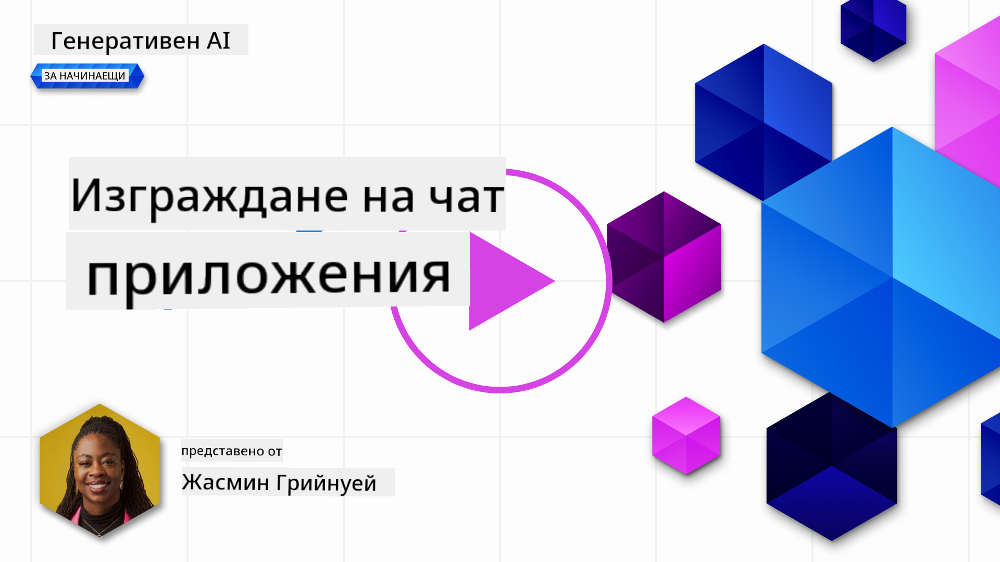
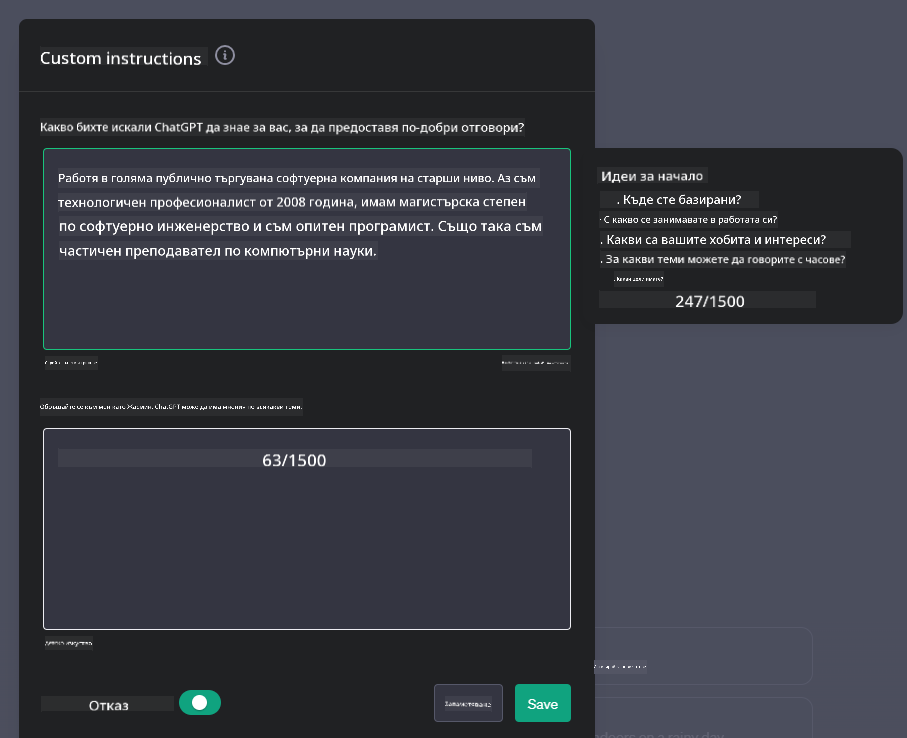

<!--
CO_OP_TRANSLATOR_METADATA:
{
  "original_hash": "ea4bbe640847aafbbba14dae4625e9af",
  "translation_date": "2025-05-19T18:11:37+00:00",
  "source_file": "07-building-chat-applications/README.md",
  "language_code": "bg"
}
-->
# Създаване на чат приложения, задвижвани от генеративен AI

[](https://aka.ms/gen-ai-lessons7-gh?WT.mc_id=academic-105485-koreyst)

> _(Кликнете върху изображението по-горе, за да гледате видео на този урок)_

След като видяхме как можем да създаваме приложения за генериране на текст, нека разгледаме чат приложенията.

Чат приложенията са се интегрирали в ежедневието ни, предлагайки повече от просто средство за неформален разговор. Те са неразделна част от обслужването на клиенти, техническата поддръжка и дори сложни системи за консултации. Вероятно неотдавна сте получили помощ от чат приложение. С интегрирането на по-напреднали технологии като генеративен AI в тези платформи, сложността се увеличава, както и предизвикателствата.

Някои въпроси, които трябва да бъдат отговорени, са:

- **Създаване на приложението**. Как ефективно да създадем и безпроблемно да интегрираме тези приложения, задвижвани от AI, за специфични случаи на употреба?
- **Мониторинг**. След като са внедрени, как можем да следим и да гарантираме, че приложенията работят на най-високо ниво на качество както по отношение на функционалността, така и в съответствие с [шестте принципа на отговорния AI](https://www.microsoft.com/ai/responsible-ai?WT.mc_id=academic-105485-koreyst)?

Докато се придвижваме напред в епоха, определена от автоматизация и безпроблемни взаимодействия между човек и машина, разбирането как генеративният AI трансформира обхвата, дълбочината и адаптивността на чат приложенията става съществено. Този урок ще изследва аспектите на архитектурата, които поддържат тези сложни системи, ще разгледа методологиите за тяхното фино настройване за задачи, специфични за даден домейн, и ще оцени метриките и съображенията, свързани с осигуряването на отговорно внедряване на AI.

## Въведение

Този урок обхваща:

- Техники за ефективно създаване и интегриране на чат приложения.
- Как да приложим персонализиране и фина настройка на приложенията.
- Стратегии и съображения за ефективно наблюдение на чат приложенията.

## Цели на обучението

До края на този урок ще можете:

- Да опишете съображенията за създаване и интегриране на чат приложения в съществуващи системи.
- Да персонализирате чат приложения за специфични случаи на употреба.
- Да идентифицирате ключови метрики и съображения за ефективно наблюдение и поддържане на качеството на приложенията, задвижвани от AI.
- Да гарантирате, че чат приложенията използват AI отговорно.

## Интегриране на генеративен AI в чат приложения

Повишаването на чат приложенията чрез генеративен AI не се ограничава само до това да ги направим по-умни; става дума за оптимизиране на тяхната архитектура, производителност и потребителски интерфейс, за да се предостави качествено потребителско изживяване. Това включва изследване на архитектурните основи, интеграциите на API и съображенията за потребителския интерфейс. Този раздел има за цел да ви предложи цялостна пътна карта за навигиране в тези сложни пейзажи, независимо дали ги интегрирате в съществуващи системи или ги изграждате като самостоятелни платформи.

До края на този раздел ще сте оборудвани с експертизата, необходима за ефективно конструиране и интегриране на чат приложения.

### Чатбот или чат приложение?

Преди да се потопим в изграждането на чат приложения, нека сравним „чатботове“ с „AI-задвижвани чат приложения“, които изпълняват различни роли и функционалности. Основната цел на чатбота е да автоматизира специфични разговорни задачи, като например отговаряне на често задавани въпроси или проследяване на пратка. Той обикновено се управлява от логика, базирана на правила, или сложни AI алгоритми. За разлика от това, AI-задвижваното чат приложение е много по-обширна среда, предназначена да улеснява различни форми на цифрова комуникация, като текстови, гласови и видео чатове между човешки потребители. Отличителната му черта е интеграцията на генеративен AI модел, който симулира нюансирани, подобни на човешки разговори, генерирайки отговори въз основа на голямо разнообразие от входни и контекстуални сигнали. Чат приложение, задвижвано от генеративен AI, може да участва в дискусии с отворен домейн, да се адаптира към развиващи се разговорни контексти и дори да създава креативен или сложен диалог.

Таблицата по-долу очертава ключовите разлики и прилики, за да ни помогне да разберем уникалните им роли в цифровата комуникация.

| Чатбот                                | Чат приложение, задвижвано от генеративен AI |
| ------------------------------------- | -------------------------------------------- |
| Фокусирано върху задачи и базирано на правила | Осъзнато за контекста                         |
| Често интегрирано в по-големи системи | Може да хоства един или няколко чатбота      |
| Ограничено до програмирани функции    | Включва генеративни AI модели                |
| Специализирани и структурирани взаимодействия | Способно на дискусии с отворен домейн         |

### Използване на предварително изградени функционалности със SDK и API

Когато изграждате чат приложение, страхотна първа стъпка е да оцените какво вече съществува. Използването на SDK и API за изграждане на чат приложения е изгодна стратегия по различни причини. Чрез интегриране на добре документирани SDK и API, вие стратегически позиционирате вашето приложение за дългосрочен успех, като се справяте с проблемите на мащабируемостта и поддръжката.

- **Ускорява процеса на разработка и намалява разходите**: Разчитането на предварително изградени функционалности вместо скъпия процес на изграждане на такива сами ви позволява да се съсредоточите върху други аспекти на вашето приложение, които може да смятате за по-важни, като бизнес логика.
- **По-добра производителност**: Когато изграждате функционалност от нулата, в крайна сметка ще си зададете въпроса „Как мащабира? Това приложение може ли да се справи с внезапен приток на потребители?“ Добре поддържаните SDK и API често имат вградени решения за тези проблеми.
- **По-лесна поддръжка**: Актуализациите и подобренията са по-лесни за управление, тъй като повечето API и SDK изискват просто актуализация на библиотеката, когато бъде пусната по-нова версия.
- **Достъп до най-съвременната технология**: Използването на модели, които са фино настроени и обучени на обширни набори от данни, предоставя на вашето приложение възможности за естествен език.

Достъпът до функционалността на SDK или API обикновено включва получаване на разрешение за използване на предоставените услуги, което често се извършва чрез използването на уникален ключ или токен за удостоверяване. Ще използваме OpenAI Python Library, за да разгледаме как изглежда това. Можете също да го изпробвате сами в следния [тетрадка за OpenAI](../../../07-building-chat-applications/python/oai-assignment.ipynb) или [тетрадка за Azure OpenAI Services](../../../07-building-chat-applications/python/aoai-assignment.ipynb) за този урок.

```python
import os
from openai import OpenAI

API_KEY = os.getenv("OPENAI_API_KEY","")

client = OpenAI(
    api_key=API_KEY
    )

chat_completion = client.chat.completions.create(model="gpt-3.5-turbo", messages=[{"role": "user", "content": "Suggest two titles for an instructional lesson on chat applications for generative AI."}])
```

Горният пример използва модела GPT-3.5 Turbo, за да завърши подсказката, но обърнете внимание, че API ключът е зададен преди това. Ще получите грешка, ако не зададете ключа.

## Потребителско изживяване (UX)

Общите принципи на UX се прилагат за чат приложенията, но ето някои допълнителни съображения, които стават особено важни поради компонентите на машинното обучение.

- **Механизъм за адресиране на двусмислието**: Генеративните AI модели понякога генерират двусмислени отговори. Функция, която позволява на потребителите да поискат пояснение, може да бъде полезна, ако се сблъскат с този проблем.
- **Запазване на контекста**: Напредналите генеративни AI модели имат способността да запомнят контекста в рамките на разговор, което може да бъде необходим актив за потребителското изживяване. Даването на потребителите възможност да контролират и управляват контекста подобрява потребителското изживяване, но въвежда риск от запазване на чувствителна потребителска информация. Съображенията за това колко дълго се съхранява тази информация, като например въвеждане на политика за задържане, могат да балансират нуждата от контекст с поверителността.
- **Персонализация**: С възможността да се учат и адаптират, AI моделите предлагат индивидуализирано изживяване за потребителя. Персонализирането на потребителското изживяване чрез функции като потребителски профили не само кара потребителя да се чувства разбран, но и помага в търсенето на конкретни отговори, създавайки по-ефективно и удовлетворяващо взаимодействие.

Един такъв пример за персонализация е настройките за "Персонализирани инструкции" в ChatGPT на OpenAI. Това ви позволява да предоставите информация за себе си, която може да е важен контекст за вашите подсказки. Ето пример за персонализирана инструкция.



Този "профил" подканва ChatGPT да създаде план на урок за свързани списъци. Забележете, че ChatGPT взема предвид, че потребителят може да иска по-задълбочен план на урока въз основа на нейния опит.


### Рамка за системни съобщения на Microsoft за модели с голям език

[Microsoft предостави насоки](https://learn.microsoft.com/azure/ai-services/openai/concepts/system-message#define-the-models-output-format?WT.mc_id=academic-105485-koreyst) за писане на ефективни системни съобщения при генериране на отговори от LLM, разделени на 4 области:

1. Определяне за кого е моделът, както и неговите възможности и ограничения.
2. Определяне на формата на изхода на модела.
3. Предоставяне на конкретни примери, които демонстрират желаното поведение на модела.
4. Предоставяне на допълнителни поведенчески ограничения.

### Достъпност

Независимо дали потребителят има зрителни, слухови, двигателни или когнитивни увреждания, добре проектирано чат приложение трябва да бъде използваемо от всички. Следният списък разбива специфични функции, насочени към подобряване на достъпността за различни потребителски увреждания.

- **Функции за зрителни увреждания**: Теми с висок контраст и мащабируем текст, съвместимост с четец на екрана.
- **Функции за слухови увреждания**: Функции за преобразуване на текст в реч и реч в текст, визуални сигнали за аудио известия.
- **Функции за двигателни увреждания**: Поддръжка на навигация с клавиатура, гласови команди.
- **Функции за когнитивни увреждания**: Опции за опростен език.

## Персонализация и фина настройка за езикови модели, специфични за домейна

Представете си чат приложение, което разбира жаргона на вашата компания и предвижда специфичните въпроси, които потребителите му обикновено имат. Има няколко подхода, които си струва да се споменат:

- **Използване на DSL модели**. DSL означава специфичен за домейна език. Можете да използвате така наречения DSL модел, обучен в конкретен домейн, за да разбере неговите концепции и сценарии.
- **Прилагане на фина настройка**. Фината настройка е процесът на допълнително обучение на вашия модел със специфични данни.

## Персонализация: Използване на DSL

Използването на модели с език, специфичен за домейна (DSL модели), може да подобри ангажираността на потребителите, като предостави специализирани, контекстуално подходящи взаимодействия. Това е модел, който е обучен или фино настроен да разбира и генерира текст, свързан с конкретна област, индустрия или предмет. Вариантите за използване на DSL модел могат да варират от обучение от нулата до използване на съществуващи чрез SDK и API. Друг вариант е фина настройка, която включва вземане на съществуващ предварително обучен модел и адаптирането му за конкретен домейн.

## Персонализация: Прилагане на фина настройка

Фината настройка често се разглежда, когато предварително обучен модел не достига в специализиран домейн или специфична задача.

Например медицинските запитвания са сложни и изискват много контекст. Когато медицински специалист диагностицира пациент, това се основава на различни фактори, като начин на живот или съществуващи състояния, и може дори да разчита на скорошни медицински журнали, за да потвърди диагнозата си. В такива нюансирани сценарии общопрактикуващо AI чат приложение не може да бъде надежден източник.

### Сценарий: медицинско приложение

Помислете за чат приложение, предназначено да помага на медицински специалисти, като предоставя бързи справки за насоки за лечение, взаимодействия между лекарства или последни изследвания.

Общопрактикуващ модел може да бъде адекватен за отговаряне на основни медицински въпроси или предоставяне на общи съвети, но може да се затрудни със следното:

- **Много специфични или сложни случаи**. Например, невролог може да попита приложението: „Какви са настоящите най-добри практики за управление на лекарствено-устойчива епилепсия при педиатрични пациенти?“
- **Липса на последни постижения**. Общопрактикуващ модел може да се затрудни да предостави актуален отговор, който включва най-новите постижения в неврологията и фармакологията.

В случаи като тези, фино настроен модел със специализиран медицински набор от данни може значително да подобри способността му да се справя с тези сложни медицински запитвания по-точно и надеждно. Това изисква достъп до голям и релевантен набор от данни, който представлява специфичните за домейна предизвикателства и въпроси, които трябва да бъдат адресирани.

## Съображения за висококачествено AI-задвижвано чат изживяване

Този раздел очертава критериите за „висококачествени“ чат приложения, които включват събирането на приложими метрики и спазването на рамка, която отговорно използва AI технология.

### Ключови метрики

За да поддържате висококачественото изпълнение на приложението, е важно да следите ключовите метрики и съображения. Тези измервания не само осигуряват функционалността на приложението, но и оценяват качеството на AI модела и потребителското изживяване. По-долу е даден списък, който обхваща основни, AI и метрики за потребителско изживяване, които да се вземат предвид.

| Метрика                       | Определение                                                                                                            | Съображения за разработчика на чат

**Отказ от отговорност**:  
Този документ е преведен с помощта на AI услуга за превод [Co-op Translator](https://github.com/Azure/co-op-translator). Докато се стремим към точност, моля, имайте предвид, че автоматизираните преводи може да съдържат грешки или неточности. Оригиналният документ на неговия роден език трябва да се счита за авторитетен източник. За критична информация се препоръчва професионален човешки превод. Ние не носим отговорност за недоразумения или неправилни интерпретации, произтичащи от използването на този превод.