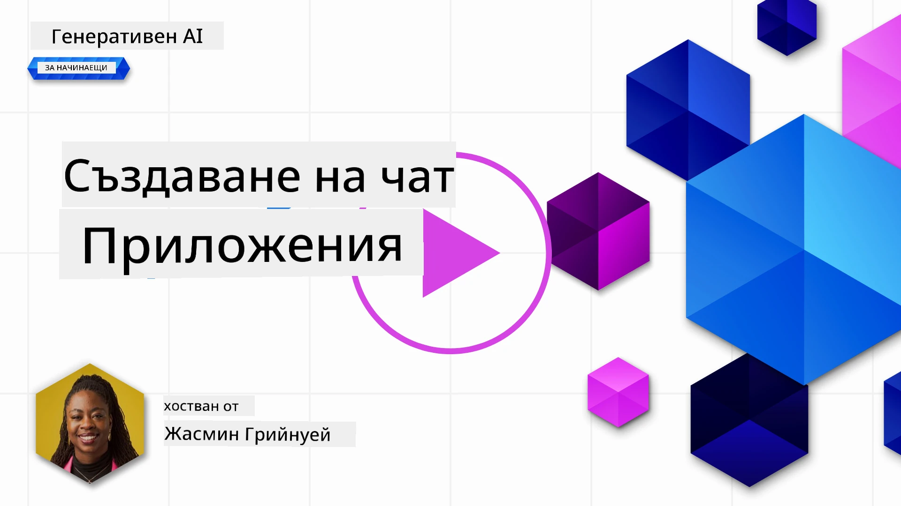
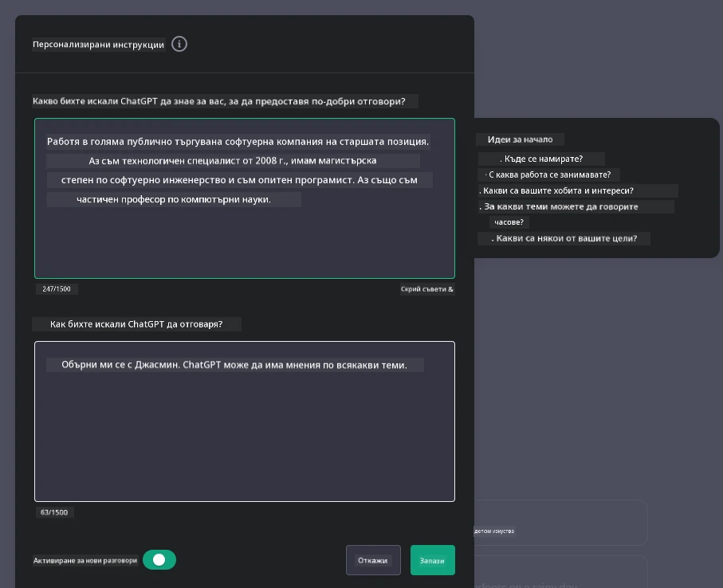
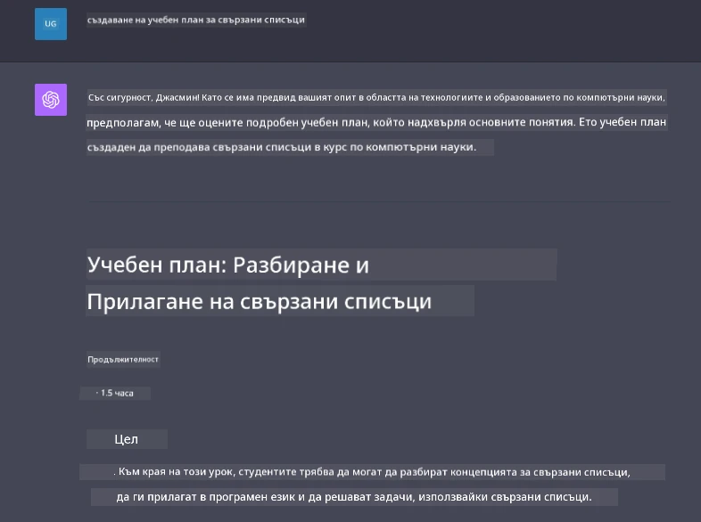

# Създаване на чат приложения с генеративен AI

[](https://youtu.be/R9V0ZY1BEQo?si=IHuU-fS9YWT8s4sA)

> _(Кликнете върху изображението по-горе, за да гледате видеото на този урок)_

Сега, когато видяхме как можем да създаваме приложения за генериране на текст, нека разгледаме чат приложенията.

Чат приложенията вече са интегрирани в ежедневието ни, като предлагат повече от просто средство за неформален разговор. Те са неотменна част от клиентското обслужване, техническата поддръжка и дори от сложни консултантски системи. Вероятно наскоро сте получили помощ от чат приложение. С интегрирането на по-усъвършенствани технологии като генеративен AI в тези платформи, сложността нараства, както и предизвикателствата.

Някои от въпросите, на които трябва да отговорим, са:

- **Създаване на приложението**. Как да изградим ефективно и безпроблемно интегрираме тези AI-задвижвани приложения за конкретни случаи на употреба?
- **Мониторинг**. След като са внедрени, как можем да следим и гарантираме, че приложенията работят на най-високо ниво на качество, както по отношение на функционалността, така и с оглед на спазването на [шестте принципа за отговорен AI](https://www.microsoft.com/ai/responsible-ai?WT.mc_id=academic-105485-koreyst)?

Докато навлизаме в ера, дефинирана от автоматизацията и безпроблемното взаимодействие човек-машина, става от съществено значение да разберем как генеративният AI трансформира обхвата, дълбочината и адаптивността на чат приложенията. Този урок ще разгледа аспекти на архитектурата, които поддържат тези сложни системи, ще навлезе в методологиите за прецизиране за задачи в специфични домейни и ще оцени метрики и съображения, свързани с осигуряването на отговорно внедряване на AI.

## Въведение

Този урок обхваща:

- Техники за ефективно изграждане и интегриране на чат приложения.
- Как да приложим персонализация и прецизиране към приложенията.
- Стратегии и съображения за ефективно наблюдение на чат приложенията.

## Цели на обучението

В края на този урок ще можете да:

- Описвате съображенията при изграждане и интегриране на чат приложения в съществуващи системи.
- Персонализирате чат приложения за конкретни случаи на употреба.
- Идентифицирате ключови метрики и съображения за ефективно наблюдение и поддържане на качеството на AI-задвижваните чат приложения.
- Осигурите отговорно използване на AI в чат приложенията.

## Интеграция на генеративен AI в чат приложения

Подобряването на чат приложения чрез генеративен AI не се състои само в това да ги направим по-умни; става въпрос за оптимизиране на тяхната архитектура, производителност и потребителски интерфейс, за да се осигури качествено потребителско изживяване. Това включва изследване на архитектурните основи, API интеграциите и съображенията за потребителския интерфейс. Тази секция цели да ви предостави цялостна пътна карта за ориентиране в тези сложни области — било то като ги интегрирате в съществуващи системи, или като ги изграждате като самостоятелни платформи.

В края на тази секция ще разполагате с необходимата експертиза за ефективно изграждане и внедряване на чат приложения.

### Чатбот или чат приложение?

Преди да се впуснем в изграждането на чат приложения, нека сравним „чатботове“ с „AI-задвижвани чат приложения“, които изпълняват различни роли и функции. Основната цел на чатбота е да автоматизира специфични разговорни задачи, като отговаряне на често задавани въпроси или проследяване на пратка. Обикновено той се управлява от базирана на правила логика или сложни AI алгоритми. За разлика от тях, AI-задвижваното чат приложение е много по-широка среда, предназначена да улеснява различни форми на цифрова комуникация, като текстови, гласови и видео чатове между хора. Неговата отличителна характеристика е интеграцията на генеративен AI модел, който симулира нюансирани, подобни на човешките разговори, генерирайки отговори на базата на разнообразни входни данни и контекстуални подсказки. Генеративен AI чат приложение може да участва в дискусии с отворена тематика, да се адаптира към развиващите се контексти на разговора и дори да създава креативен или сложен диалог.

По-долу таблично са очертани ключовите различия и сходства, които да ни помогнат да разберем уникалните им роли в дигиталната комуникация.

| Чатбот                               | Генеративно AI-задвижвано чат приложение |
| ------------------------------------- | -------------------------------------- |
| Фокусирано на задача и базирано на правила | Осъзнава контекста                       |
| Често интегрирано в по-големи системи    | Може да включва един или няколко чатбота  |
| Ограничено до програмирани функции        | Включва генеративни AI модели              |
| Специализирани и структурираните взаимодействия | Способно на дискусии с отворена тематика    |

### Използване на готови функционалности чрез SDK и API

При изграждането на чат приложение, отлична първа стъпка е да се оцени какво вече съществува. Използването на SDK и API за създаване на чат приложения е стратегически предимство по редица причини. Интегрирайки добре документирани SDK и API, вие стратегически позиционирате своето приложение за дългосрочен успех, като адресирате въпроси, свързани с мащабируемост и поддръжка.

- **Ускорява процеса на разработка и намалява разходите**: Разчитането на готови функционалности вместо скъпия процес на тяхното създаване ви позволява да се съсредоточите върху други аспекти на приложението, които може да смятате за по-важни, като бизнес логика.
- **По-добра производителност**: Когато създавате функционалност от нулата, накрая си задавате въпроса „Как се мащабира? Способно ли е това приложение да се справи с внезапен приток от потребители?“ Добре поддържани SDK и API често имат вградени решения за тези въпроси.
- **По-лесна поддръжка**: Актуализациите и подобренията са по-лесни за управление, тъй като повечето API и SDK изискват просто актуализация на библиотеката при пускане на нова версия.
- **Достъп до най-нови технологии**: Използването на модели, които са фино настроени и обучени с обширни датасети, предоставя на приложението ви способности за естествен език.

Достъпът до функционалностите на SDK или API обикновено включва получаване на разрешение за използване на предоставените услуги, което често става чрез уникален ключ или токен за удостоверяване. Ще използваме Python библиотеката на OpenAI, за да видим как изглежда това. Можете също така сами да опитате в следващия [notebook за OpenAI](./python/oai-assignment.ipynb?WT.mc_id=academic-105485-koreyst) или [notebook за Azure OpenAI Services](./python/aoai-assignment.ipynb?WT.mc_id=academic-105485-koreys) за този урок.

```python
import os
from openai import OpenAI

API_KEY = os.getenv("OPENAI_API_KEY","")

client = OpenAI(
    api_key=API_KEY
    )

response = client.responses.create(model="gpt-5-mini", input="Suggest two titles for an instructional lesson on chat applications for generative AI.", store=False)
print(response.output_text)
```

Горният пример използва GPT-5 мини модел с Responses API за завършване на подкана, но забележете, че API ключът е зададен предварително. Ще получите грешка, ако не зададете ключа.

## Потребителско изживяване (UX)

Общите UX принципи важат за чат приложенията, но ето някои допълнителни съображения, които стават особено важни поради участието на компонентите за машинно обучение.

- **Механизъм за решаване на неясноти**: Генеративните AI модели понякога създават двусмислени отговори. Функция, която позволява на потребителите да искат уточнение, може да бъде полезна при възникване на такъв проблем.
- **Задържане на контекст**: Усъвършенстваните генеративни AI модели имат способността да помнят контекста в хода на разговора, което може да е необходим актив за потребителското изживяване. Даване на възможност на потребителите да управляват контекста подобрява UX, но носи риск от съхранение на чувствителна информация. Обмислянето колко дълго тази информация се съхранява, например чрез въвеждане на политика за запазване, може да балансира нуждата от контекст и поверителността.
- **Персонализация**: С възможността да се учат и адаптират, AI моделите предлагат индивидуализирано изживяване за потребителя. Персонализирането на UX чрез функции като потребителски профили не само кара потребителя да се чувства разбран, но и улеснява намирането на конкретни отговори, създавайки по-ефективно и удовлетворяващо взаимодействие.

Един такъв пример за персонализация са настройките „Custom instructions“ в ChatGPT на OpenAI. Те позволяват да предоставите информация за себе си, която може да бъде важен контекст за вашите подкани. Ето пример за персонализирана инструкция.



Този „профил“ подтиква ChatGPT да създаде учебен план за свързани списъци. Забележете, че ChatGPT взема под внимание, че потребителят може да желае по-задълбочен учебен план на базата на нейния опит.



### Microsoft Framework за системни съобщения при големи езикови модели

[Microsoft предоставя насоки](https://learn.microsoft.com/azure/ai-foundry/openai/concepts/system-message#define-the-models-output-format?WT.mc_id=academic-105485-koreyst) за писане на ефективни системни съобщения при генериране на отговори от LLM, разгрупирани в 4 области:

1. Определяне за кого е моделът, както и неговите възможности и ограничения.
2. Определяне на формата на изхода на модела.
3. Предоставяне на конкретни примери, които демонстрират желаното поведение на модела.
4. Осигуряване на допълнителни поведенчески предпазители.

### Достъпност

Независимо дали потребителят има зрителни, слухови, моторни или когнитивни увреждания, добре проектираното чат приложение трябва да бъде използваемо от всички. Следващият списък разглежда специфични функции, насочени към подобряване на достъпността за различни увреждания.

- **Функции за зрителни увреждания**: Теми с висок контраст и мащабируем текст, съвместимост с екранни четеи.
- **Функции за слухови увреждания**: Функции за преобразуване на текст в реч и обратно, визуални сигнали за аудио известия.
- **Функции за моторни увреждания**: Поддръжка на навигация с клавиатура, гласови команди.
- **Функции за когнитивни увреждания**: Опции за опростен език.

## Персонализация и прецизиране за домейн-специфични езикови модели

Представете си чат приложение, което разбира жаргона на вашата компания и предвижда специфичните въпроси, които често задават потребителите. Има няколко подхода, които си струва да се споменат:

- **Използване на DSL модели**. DSL означава домейн-специфичен език. Можете да използвате така наречен DSL модел, обучен за конкретен домейн, за разбиране на неговите концепции и сценарии.
- **Приложете прецизиране (fine-tuning)**. Прецизирането е процесът на допълнително обучение на модела с конкретни данни.

## Персонализация: Използване на DSL

Използването на домейн-специфични езикови модели (DSL модели) може да повиши ангажираността на потребителите, като предлага специализирани, контекстуално релевантни взаимодействия. Това е модел, който е обучен или прецизиран да разбира и генерира текст, свързан с конкретна област, индустрия или тема. Вариантите за използване на DSL модел могат да варират от обучение на такъв от нулата, до използване на съществуващи чрез SDK и API. Друг вариант е прецизирането, което включва вземане на вече предварително обучен модел и адаптирането му за конкретен домейн.

## Персонализация: Прилагане на прецизиране

Прецизирането често се обмисля, когато предварително обучен модел не е достатъчен за специализиран домейн или конкретна задача.

Например медицинските запитвания са сложни и изискват много контекст. Когато медицински специалист диагностицира пациент, той се базира на множество фактори, като начин на живот или предшестващи състояния, и може дори да разчита на скорошни медицински издания за потвърждение на диагнозата. В такива нюансирани сценарии общо предназначено AI чат приложение не може да бъде надежден източник.

### Сценарий: медицинско приложение

Разгледайте чат приложение, създадено да подпомага медицински специалисти чрез осигуряване на бързи справки за насоки за лечение, лекарствени взаимодействия или скорошни изследвания.

Общоприет модел може да е достатъчен за отговаряне на базови медицински въпроси или предоставяне на общи съвети, но може да има затруднения със следното:

- **Много специфични или сложни случаи**. Например невролог може да попита приложението: „Кои са най-добрите практики в момента за управление на лекарствено-резистентна епилепсия при педиатрични пациенти?“
- **Липса на най-нови постижения**. Общоприет модел може да не успее да предостави актуален отговор, който включва най-новите постижения в областта на неврологията и фармакологията.

В такива случаи, прецизирането на модела с използване на специализиран медицински датасет може значително да подобри способността му да обработва тези сложни медицински запитвания по-точно и надеждно. Това изисква достъп до голям и релевантен датасет, който представя домейн-специфичните предизвикателства и въпроси, които трябва да бъдат адресирани.

## Съображения за висококачествено AI-задвижвано чат изживяване

Тази секция очертава критериите за „висококачествени“ чат приложения, които включват улавяне на приложими метрики и спазване на рамка, която отговорно използва AI технология.

### Ключови метрики

За поддържане на висококачествено изпълнение на приложение е важно да следите ключови метрики и съображения. Тези измервания не само осигуряват функционирането на приложението, но и оценяват качеството на AI модела и потребителското изживяване. По-долу е списък, обхващащ основни метрики, метрики за AI и тези за UX.

| Метрика                      | Определение                                                                                                           | Съображения за разработчика на чат                                   |
| ---------------------------- | -------------------------------------------------------------------------------------------------------------------- | -------------------------------------------------------------------- |
| **Време на работа (Uptime)** | Измерва времето, през което приложението е работоспособно и достъпно за потребителите.                                | Как ще минимизирате времето на престой?                             |
| **Време за отговор**          | Времето, което приложението изисква за отговор на заявка от потребител.                                              | Как може да оптимизирате обработката на заявки, за да подобрите времето за отговор? |
| **Прецизност**                | Отношение на истински положителни предсказания към общия брой положителни предсказания                                | Как ще валидирате прецизността на вашия модел?                      |
| **Отзивчивост (чувствителност)** | Отношение на истински положителни предсказания към реалния брой положителни                                         | Как ще измерите и подобрите отзивчивостта?                         |
| **F1 резултат**               | Хармонично средно между прецизността и отзивчивостта, балансиращо между двете.                                       | Каква е целевата ви F1 стойност? Как ще балансирате прецизност и отзивчивост? |
| **Перплексиция**             | Измерва доколко прогнозираното разпределение на вероятностите на модела съвпада с действителното разпределение на данните. | Как ще минимизирате перплексията?                                  |
| **Метрики за удовлетвореност на потребителите** | Измерва възприятието на потребителите за приложението. Често се улавя чрез анкети.                                  | Колко често ще събирате обратна връзка от потребителите? Как ще се адаптирате спрямо нея? |
| **Процент грешки**            | Процентът, с който моделът прави грешки при разбирането или изхода.                                                | Какви стратегии имате за намаляване на грешките?                   |
| **Цикли на преобучение**     | Честотата, с която моделът се актуализира, за да включва нови данни и прозрения.                                  | Колко често ще преобучавате модела? Какво задейства цикъл на преобучение?  |

| **Откриване на аномалии**         | Инструменти и техники за идентифициране на необичайни модели, които не съответстват на очакваното поведение.                        | Как ще реагирате на аномалиите?                                        |

### Прилагане на отговорни AI практики в чат приложения

Подходът на Microsoft към Отговорен AI е определил шест принципа, които трябва да ръководят разработката и използването на AI. По-долу са принципите, тяхното определение, както и неща, които разработчик на чат приложения трябва да вземе под внимание и защо е важно да го направи.

| Принципи             | Определение на Microsoft                                | Съображения за разработчик на чат                                      | Защо е важно                                                                     |
| ---------------------- | ----------------------------------------------------- | ---------------------------------------------------------------------- | -------------------------------------------------------------------------------------- |
| Справедливост               | AI системите трябва да третират всички хора справедливо.            | Осигурете чат приложението да не дискриминира на база потребителски данни.  | За да се изгради доверие и инклузивност сред потребителите; предотвратява правни последици.                |
| Надеждност и безопасност | AI системите трябва да работят надеждно и безопасно.        | Прилагане на тестване и предпазни механизми за минимизиране на грешки и рискове.         | Осигурява удовлетвореност на потребителя и предотвратява потенциална вреда.                                 |
| Поверителност и сигурност   | AI системите трябва да са сигурни и да уважават поверителността.      | Прилагане на силно криптиране и мерки за защита на данните.              | За защита на чувствителни потребителски данни и съблюдаване на законите за поверителност.                         |
| Инклузивност          | AI системите трябва да дадат възможност на всички и да ангажират хората. | Дизайн на UI/UX, който е достъпен и лесен за използване от различна аудитория. | Осигурява по-широк кръг хора да използват ефективно приложението.                   |
| Прозрачност           | AI системите трябва да са разбираеми.                  | Предоставяне на ясна документация и обяснения за AI отговорите.            | Потребителите са по-склонни да се доверят на система, ако разбират как се вземат решенията. |
| Отговорност         | Хората трябва да са отговорни за AI системите.          | Създаване на ясен процес за одитиране и подобряване на AI решенията.     | Позволява постоянно усъвършенстване и корективни мерки при грешки.               |

## Задача

Вижте [assignment](../../../07-building-chat-applications/python). Тя ще ви преведе през поредица от упражнения от стартиране на първите ви чат заявки, през класификация и обобщаване на текст и още. Обърнете внимание, че задачите са налични на различни програмни езици!

## Отлична работа! Продължете пътуването

След като завършите този урок, разгледайте нашата [колекция за учене на Генеративен AI](https://aka.ms/genai-collection?WT.mc_id=academic-105485-koreyst), за да продължите да развивате знанията си в Генеративен AI!

Отидете на Урок 8, за да видите как можете да започнете да [създавате приложения за търсене](../08-building-search-applications/README.md?WT.mc_id=academic-105485-koreyst)!

---

<!-- CO-OP TRANSLATOR DISCLAIMER START -->
**Отказ от отговорност**:
Този документ е преведен с помощта на AI преводачески услуга [Co-op Translator](https://github.com/Azure/co-op-translator). Въпреки че се стремим към точност, моля имайте предвид, че автоматизираните преводи могат да съдържат грешки или неточности. Оригиналният документ на неговия роден език трябва да се счита за авторитетен източник. За критична информация се препоръчва професионален човешки превод. Ние не носим отговорност за каквито и да е недоразумения или неправилни тълкувания, произтичащи от използването на този превод.
<!-- CO-OP TRANSLATOR DISCLAIMER END -->