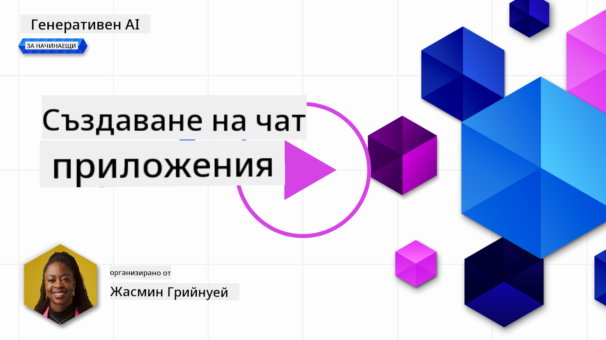
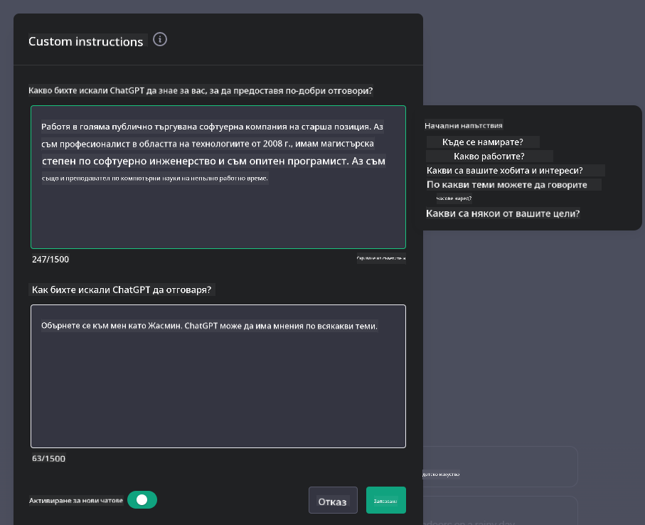
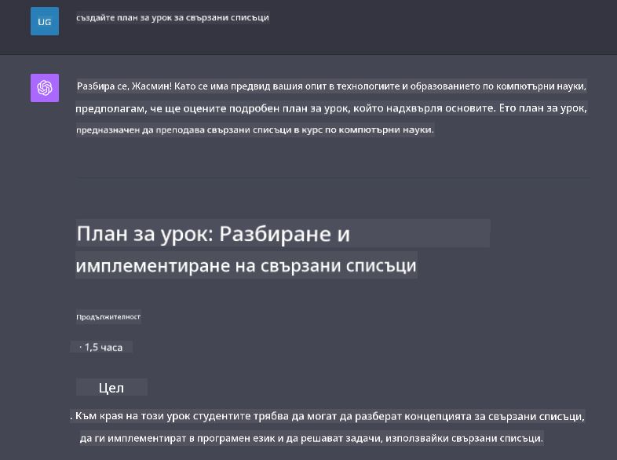

<!--
CO_OP_TRANSLATOR_METADATA:
{
  "original_hash": "ea4bbe640847aafbbba14dae4625e9af",
  "translation_date": "2025-06-25T15:58:36+00:00",
  "source_file": "07-building-chat-applications/README.md",
  "language_code": "bg"
}
-->
# Създаване на чат приложения, захранвани от генеративен AI

[](https://aka.ms/gen-ai-lessons7-gh?WT.mc_id=academic-105485-koreyst)

> _(Кликнете върху изображението по-горе, за да гледате видеото на този урок)_

След като видяхме как можем да създадем приложения за генериране на текст, нека разгледаме чат приложенията.

Чат приложенията са станали неразделна част от ежедневието ни, предлагайки повече от просто средство за неформален разговор. Те са интегрални части от обслужването на клиенти, техническата поддръжка и дори сложни консултантски системи. Вероятно сте получили помощ от чат приложение неотдавна. С интегрирането на по-напреднали технологии като генеративен AI в тези платформи, сложността се увеличава, както и предизвикателствата.

Някои въпроси, на които трябва да отговорим, са:

- **Създаване на приложението**. Как ефективно да създадем и безпроблемно да интегрираме тези приложения, захранвани от AI, за конкретни случаи на употреба?
- **Мониторинг**. След като бъдат внедрени, как можем да наблюдаваме и да гарантираме, че приложенията работят на най-високо ниво на качество, както по отношение на функционалността, така и в съответствие с [шестте принципа на отговорен AI](https://www.microsoft.com/ai/responsible-ai?WT.mc_id=academic-105485-koreyst)?

Докато навлизаме в епоха, дефинирана от автоматизация и безпроблемни взаимодействия човек-машина, разбирането как генеративният AI трансформира обхвата, дълбочината и адаптивността на чат приложенията става от съществено значение. Този урок ще изследва аспектите на архитектурата, които поддържат тези сложни системи, ще разгледа методологиите за фино настройване за задачи, специфични за домейна, и ще оцени метриките и съображенията, свързани с осигуряването на отговорно внедряване на AI.

## Въведение

Този урок обхваща:

- Техники за ефективно създаване и интегриране на чат приложения.
- Как да приложим персонализация и фино настройване на приложенията.
- Стратегии и съображения за ефективно наблюдение на чат приложенията.

## Цели на обучението

До края на този урок ще можете:

- Да опишете съображенията за създаване и интегриране на чат приложения в съществуващи системи.
- Да персонализирате чат приложения за конкретни случаи на употреба.
- Да идентифицирате ключови метрики и съображения за ефективно наблюдение и поддържане на качеството на чат приложенията, захранвани от AI.
- Да гарантирате, че чат приложенията използват AI отговорно.

## Интегриране на генеративен AI в чат приложения

Подобряването на чат приложенията чрез генеративен AI не е само за да ги направим по-умни; става въпрос за оптимизиране на тяхната архитектура, производителност и потребителски интерфейс, за да предоставим качествено потребителско изживяване. Това включва изследване на архитектурните основи, интеграциите на API и съображенията за потребителския интерфейс. Този раздел има за цел да ви предложи цялостна пътна карта за навигация в тези сложни среди, независимо дали ги включвате в съществуващи системи или ги изграждате като самостоятелни платформи.

До края на този раздел ще бъдете оборудвани с необходимите знания за ефективно конструиране и интегриране на чат приложения.

### Чатбот или чат приложение?

Преди да се потопим в създаването на чат приложения, нека сравним 'чатботите' с 'чат приложения, захранвани от AI,' които изпълняват различни роли и функционалности. Основната цел на чатбота е да автоматизира специфични разговорни задачи, като отговаряне на често задавани въпроси или проследяване на пратка. Обикновено се управлява от логика, базирана на правила или сложни AI алгоритми. В контраст, чат приложение, захранвано от AI, е много по-обширна среда, предназначена да улеснява различни форми на цифрова комуникация, като текстови, гласови и видео чатове между човешки потребители. Неговата определяща характеристика е интегрирането на генеративен AI модел, който симулира нюансирани, човешки разговори, генерирайки отговори въз основа на широк спектър от входни данни и контекстуални указания. Чат приложение, захранвано от генеративен AI, може да се ангажира в дискусии с отворен домейн, да се адаптира към развиващите се контексти на разговор и дори да произвежда творчески или сложни диалози.

Таблицата по-долу очертава ключовите разлики и прилики, за да ни помогне да разберем техните уникални роли в цифровата комуникация.

| Чатбот                                | Чат приложение, захранвано от генеративен AI |
| ------------------------------------- | ------------------------------------------- |
| Фокусирано върху задачи и базирано на правила | Контекстуално осъзнато                     |
| Често интегрирано в по-големи системи | Може да хоства един или множество чатботи  |
| Ограничено до програмирани функции   | Включва генеративни AI модели              |
| Специализирани и структурирани взаимодействия | Способно на дискусии с отворен домейн     |

### Използване на предварително изградени функционалности с SDK и API

Когато изграждате чат приложение, добра първа стъпка е да оцените какво вече съществува. Използването на SDK и API за изграждане на чат приложения е изгодна стратегия поради различни причини. Чрез интегриране на добре документирани SDK и API, стратегически позиционирате приложението си за дългосрочен успех, като адресирате проблемите с мащабируемостта и поддръжката.

- **Ускорява процеса на разработка и намалява разходите**: Разчитането на предварително изградени функционалности, вместо скъпия процес на изграждане на такива, ви позволява да се фокусирате върху други аспекти на вашето приложение, които може да считате за по-важни, като бизнес логика.
- **По-добра производителност**: Когато изграждате функционалност от нулата, в крайна сметка ще се запитате "Как се мащабира? Това приложение способно ли е да се справи с внезапен наплив от потребители?" Добре поддържаните SDK и API често имат вградени решения за тези проблеми.
- **По-лесна поддръжка**: Актуализациите и подобренията са по-лесни за управление, тъй като повечето API и SDK просто изискват актуализация на библиотеката, когато бъде пусната по-нова версия.
- **Достъп до най-съвременна технология**: Използването на модели, които са били фино настроени и обучени върху обширни набори от данни, предоставя на вашето приложение способности за естествен език.

Достъпът до функционалностите на SDK или API обикновено включва получаване на разрешение за използване на предоставените услуги, което често се осъществява чрез използването на уникален ключ или токен за удостоверяване. Ще използваме OpenAI Python Library, за да изследваме как изглежда това. Можете също да го изпробвате сами в следния [бележник за OpenAI](../../../07-building-chat-applications/python/oai-assignment.ipynb) или [бележник за Azure OpenAI Services](../../../07-building-chat-applications/python/aoai-assignment.ipynb) за този урок.

```python
import os
from openai import OpenAI

API_KEY = os.getenv("OPENAI_API_KEY","")

client = OpenAI(
    api_key=API_KEY
    )

chat_completion = client.chat.completions.create(model="gpt-3.5-turbo", messages=[{"role": "user", "content": "Suggest two titles for an instructional lesson on chat applications for generative AI."}])
```

Горният пример използва модела GPT-3.5 Turbo, за да завърши подканата, но забележете, че API ключът е зададен преди това. Ще получите грешка, ако не зададете ключа.

## Потребителско изживяване (UX)

Общите принципи на UX се прилагат за чат приложения, но ето някои допълнителни съображения, които стават особено важни поради компонентите за машинно обучение.

- **Механизъм за адресиране на двусмислието**: Генеративните AI модели понякога генерират двусмислени отговори. Функция, която позволява на потребителите да поискат пояснение, може да бъде полезна, ако се сблъскат с този проблем.
- **Задържане на контекст**: Напредналите генеративни AI модели имат способността да запомнят контекста в рамките на разговор, което може да бъде необходим актив за потребителското изживяване. Даване на потребителите възможността да контролират и управляват контекста подобрява потребителското изживяване, но въвежда риск от задържане на чувствителна потребителска информация. Съображенията за това колко дълго се съхранява тази информация, като въвеждане на политика за задържане, могат да балансират нуждата от контекст срещу поверителността.
- **Персонализация**: С способността да учат и адаптират, AI моделите предлагат индивидуализирано изживяване за потребителя. Персонализирането на потребителското изживяване чрез функции като потребителски профили не само кара потребителя да се чувства разбран, но също така помага в преследването на намирането на конкретни отговори, създавайки по-ефективно и удовлетворяващо взаимодействие.

Един такъв пример за персонализация е настройките "Персонализирани инструкции" в OpenAI's ChatGPT. Това ви позволява да предоставите информация за себе си, която може да бъде важен контекст за вашите подканвания. Ето пример за персонализирана инструкция.



Този "профил" подканва ChatGPT да създаде план за урок за свързани списъци. Забележете, че ChatGPT взема предвид, че потребителят може да иска по-задълбочен план за урок въз основа на нейния опит.



### Системната рамка за съобщения на Microsoft за големи езикови модели

[Microsoft предостави насоки](https://learn.microsoft.com/azure/ai-services/openai/concepts/system-message#define-the-models-output-format?WT.mc_id=academic-105485-koreyst) за писане на ефективни системни съобщения при генериране на отговори от LLMs, разбити в 4 области:

1. Определяне за кого е моделът, както и неговите възможности и ограничения.
2. Определяне на формата на изхода на модела.
3. Предоставяне на конкретни примери, които демонстрират желаното поведение на модела.
4. Предоставяне на допълнителни поведенчески ограничения.

### Достъпност

Независимо дали потребителят има зрителни, слухови, моторни или когнитивни увреждания, добре проектирано чат приложение трябва да бъде използваемо от всички. Следният списък разбива специфични функции, насочени към подобряване на достъпността за различни потребителски увреждания.

- **Функции за зрителни увреждания**: Теми с висок контраст и преоразмеряем текст, съвместимост с екранни четци.
- **Функции за слухови увреждания**: Функции за преобразуване на текст в реч и реч в текст, визуални сигнали за аудио известия.
- **Функции за моторни увреждания**: Поддръжка за навигация с клавиатура, гласови команди.
- **Функции за когнитивни увреждания**: Опции за опростен език.

## Персонализация и фино настройване за езикови модели, специфични за домейна

Представете си чат приложение, което разбира жаргона на вашата компания и предвижда специфичните запитвания, които потребителската база обикновено има. Има няколко подхода, които си струва да се споменат:

- **Използване на модели DSL**. DSL означава език, специфичен за домейна. Можете да използвате така наречен модел DSL, обучен върху специфичен домейн, за да разберете неговите концепции и сценарии.
- **Прилагане на фино настройване**. Финото настройване е процесът на допълнително обучение на вашия модел със специфични данни.

## Персонализация: Използване на DSL

Използването на модели, специфични за домейна (DSL модели), може да подобри ангажираността на потребителите, като предоставя специализирани, контекстуално релевантни взаимодействия. Това е модел, който е обучен или фино настроен, за да разбира и генерира текст, свързан с конкретна област, индустрия или предмет. Опциите за използване на модел DSL могат да варират от обучение на такъв от нулата до използване на съществуващи чрез SDK и API. Друга опция е фино настройване, което включва вземане на съществуващ предварително обучен модел и адаптирането му за специфичен домейн.

## Персонализация: Прилагане на фино настройване

Финото настройване често се разглежда, когато предварително обучен модел не достига в специализиран домейн или специфична задача.

Например, медицинските запитвания са сложни и изискват много контекст. Когато медицински специалист диагностицира пациент, това се основава на различни фактори, като начин на живот или съществуващи условия, и може дори да се разчита на скорошни медицински списания за потвърждение на диагнозата. В такива нюансирани сценарии, общопредназначеното AI чат приложение не може да бъде надежден източник.

### Сценарий: медицинско приложение

Помислете за чат приложение, предназначено да подпомага медицински практикуващи, като предоставя бързи справки за насоки за лечение, взаимодействия на лекарства или скорошни изследователски открития.

Общопредназначен модел може да бъде адекватен за отговаряне на основни медицински въпроси или предоставяне на общи съвети, но може да се затрудни със следното:

- **Много специфични или сложни случаи**. Например, невролог може да попита приложението, "Какви са текущите най-добри практики за управление на лекарствено резистентна епилепсия при педиатрични пациенти?"
- **Липса на скорошни постижения**. Общопредназначен модел може да се затрудни да предостави актуален отговор, който включва най-новите постижения в неврологията и фармакологията.

В случаи като тези, финото настройване на модела със специализиран медицински набор от данни може значително да подобри способността му да се справя с тези сложни медицински запитвания по-точно и надеждно. Това изисква достъп до голям и релевантен набор от данни, който представя предизвикателствата и въпросите, специфични за домейна, които трябва да бъдат адресирани.

## Съображения за висококачествено AI-задвижвано чат изживяване

Този раздел очертава критериите за "висококачествени" чат приложения, които включват улавяне на измерими метрики и спазване на рамка, която отговорно използва AI технология.

### Ключови метрики

За да поддържате висококачествена производителност на приложението, е от съществено значение да следите ключови метрики и съображения. Тези измервания не само гарантират функционалността на приложението, но и оценяват качеството на AI модела и потребителското изживяване. По-долу е даден списък, който обхваща основни, AI и потребителски метрики, които трябва да се вземат предвид.

| Метрика                        | Определение                                                                                                            | Съображения за разработчика на чат                                         |
| ----------------------------- |

**Отказ от отговорност**:  
Този документ е преведен с помощта на AI услуга за превод [Co-op Translator](https://github.com/Azure/co-op-translator). Докато се стремим към точност, моля, имайте предвид, че автоматичните преводи могат да съдържат грешки или неточности. Оригиналният документ на родния му език трябва да се счита за авторитетния източник. За критична информация се препоръчва професионален човешки превод. Не носим отговорност за каквито и да е недоразумения или погрешни интерпретации, произтичащи от използването на този превод.