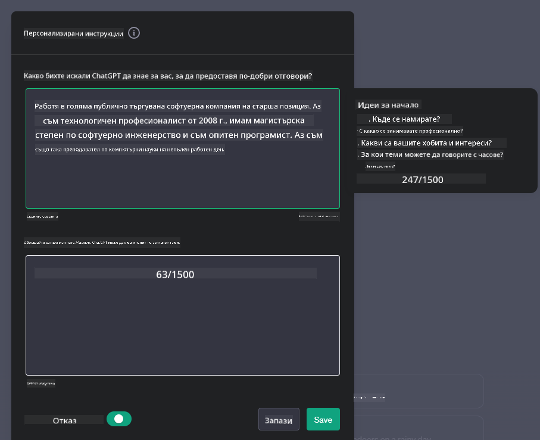

<!--
CO_OP_TRANSLATOR_METADATA:
{
  "original_hash": "a5308963a56cfbad2d73b0fa99fe84b3",
  "translation_date": "2025-10-17T22:20:41+00:00",
  "source_file": "07-building-chat-applications/README.md",
  "language_code": "bg"
}
-->
# Създаване на чат приложения, захранвани от генеративен AI

[](https://youtu.be/R9V0ZY1BEQo?si=IHuU-fS9YWT8s4sA)

> _(Кликнете върху изображението по-горе, за да гледате видеото към този урок)_

След като разгледахме как можем да създаваме приложения за генериране на текст, нека се запознаем с чат приложенията.

Чат приложенията са станали неразделна част от ежедневието ни, предлагайки повече от просто средство за неформален разговор. Те са основни елементи на обслужването на клиенти, техническата поддръжка и дори сложни консултантски системи. Вероятно неотдавна сте получили помощ от чат приложение. С интегрирането на по-напреднали технологии като генеративния AI в тези платформи, сложността се увеличава, както и предизвикателствата.

Някои въпроси, които трябва да бъдат разгледани, са:

- **Създаване на приложението**. Как ефективно да изградим и безпроблемно да интегрираме тези приложения, захранвани от AI, за специфични случаи на употреба?
- **Мониторинг**. След внедряването, как можем да наблюдаваме и да гарантираме, че приложенията работят на най-високо ниво на качество, както по отношение на функционалността, така и на спазването на [шестте принципа на отговорния AI](https://www.microsoft.com/ai/responsible-ai?WT.mc_id=academic-105485-koreyst)?

Докато навлизаме в епоха, определена от автоматизация и безпроблемни взаимодействия между хора и машини, разбирането как генеративният AI трансформира обхвата, дълбочината и адаптивността на чат приложенията става от съществено значение. Този урок ще изследва аспектите на архитектурата, които поддържат тези сложни системи, ще разгледа методологиите за тяхното фино настройване за задачи, специфични за дадена област, и ще оцени метриките и съображенията, свързани с осигуряването на отговорно внедряване на AI.

## Въведение

Този урок обхваща:

- Техники за ефективно изграждане и интегриране на чат приложения.
- Как да приложим персонализация и фина настройка на приложенията.
- Стратегии и съображения за ефективен мониторинг на чат приложения.

## Цели на обучението

До края на този урок ще можете:

- Да опишете съображенията за изграждане и интегриране на чат приложения в съществуващи системи.
- Да персонализирате чат приложения за специфични случаи на употреба.
- Да идентифицирате ключови метрики и съображения за ефективен мониторинг и поддържане на качеството на приложенията, захранвани от AI.
- Да гарантирате, че чат приложенията използват AI отговорно.

## Интегриране на генеративен AI в чат приложения

Подобряването на чат приложенията чрез генеративен AI не се свежда само до това да ги направим по-умни; става въпрос за оптимизиране на тяхната архитектура, производителност и потребителски интерфейс, за да се предостави качествено потребителско изживяване. Това включва изследване на архитектурните основи, интеграцията на API и съображенията за потребителския интерфейс. Този раздел има за цел да ви предложи цялостна пътна карта за навигация в тези сложни области, независимо дали ги интегрирате в съществуващи системи или ги изграждате като самостоятелни платформи.

До края на този раздел ще бъдете оборудвани с необходимите знания за ефективно изграждане и интегриране на чат приложения.

### Чатбот или чат приложение?

Преди да се потопим в изграждането на чат приложения, нека сравним „чатботовете“ с „AI-захранваните чат приложения“, които изпълняват различни роли и функции. Основната цел на чатбота е да автоматизира специфични разговорни задачи, като например отговаряне на често задавани въпроси или проследяване на пратка. Обикновено той се управлява от логика, базирана на правила, или сложни AI алгоритми. За разлика от това, AI-захранваното чат приложение е много по-обширна среда, предназначена да улесни различни форми на цифрова комуникация, като текстови, гласови и видео чатове между човешки потребители. Неговата отличителна черта е интеграцията на генеративен AI модел, който симулира нюансирани, човешки разговори, генерирайки отговори въз основа на широк спектър от входни данни и контекстуални сигнали. Чат приложение, захранвано от генеративен AI, може да участва в дискусии с отворен домейн, да се адаптира към развиващи се разговорни контексти и дори да създава креативен или сложен диалог.

Таблицата по-долу очертава основните разлики и прилики, за да ни помогне да разберем уникалните роли на тези технологии в цифровата комуникация.

| Чатбот                              | Чат приложение, захранвано от генеративен AI |
| ------------------------------------ | ------------------------------------------- |
| Фокусирано върху задачи и базирано на правила | Осъзнава контекста                          |
| Често интегрирано в по-големи системи | Може да хоства един или няколко чатбота     |
| Ограничено до програмирани функции   | Включва генеративни AI модели               |
| Специализирани и структурирани взаимодействия | Способно на дискусии с отворен домейн       |

### Използване на предварително изградени функционалности със SDK и API

Когато изграждате чат приложение, добър първи ход е да оцените какво вече съществува. Използването на SDK и API за изграждане на чат приложения е изгодна стратегия поради различни причини. Чрез интегриране на добре документирани SDK и API, стратегически позиционирате приложението си за дългосрочен успех, като се справяте с проблемите на мащабируемостта и поддръжката.

- **Ускорява процеса на разработка и намалява разходите**: Разчитането на предварително изградени функционалности вместо скъпия процес на самостоятелно изграждане ви позволява да се съсредоточите върху други аспекти на вашето приложение, които може да смятате за по-важни, като например бизнес логиката.
- **По-добра производителност**: Когато изграждате функционалност от нулата, в даден момент ще се запитате „Как се мащабира? Може ли това приложение да се справи с внезапен наплив от потребители?“ Добре поддържаните SDK и API често имат вградени решения за тези проблеми.
- **По-лесна поддръжка**: Актуализациите и подобренията са по-лесни за управление, тъй като повечето API и SDK изискват просто актуализация на библиотеката, когато бъде пусната нова версия.
- **Достъп до най-новите технологии**: Използването на модели, които са фино настроени и обучени върху обширни набори от данни, предоставя на вашето приложение възможности за обработка на естествен език.

Достъпът до функционалностите на SDK или API обикновено включва получаване на разрешение за използване на предоставените услуги, което често става чрез използването на уникален ключ или токен за удостоверяване. Ще използваме OpenAI Python Library, за да разгледаме как изглежда това. Можете също така да го изпробвате сами в следния [бележник за OpenAI](./python/oai-assignment.ipynb?WT.mc_id=academic-105485-koreyst) или [бележник за Azure OpenAI Services](./python/aoai-assignment.ipynb?WT.mc_id=academic-105485-koreys) за този урок.

```python
import os
from openai import OpenAI

API_KEY = os.getenv("OPENAI_API_KEY","")

client = OpenAI(
    api_key=API_KEY
    )

chat_completion = client.chat.completions.create(model="gpt-3.5-turbo", messages=[{"role": "user", "content": "Suggest two titles for an instructional lesson on chat applications for generative AI."}])
```

Горният пример използва модела GPT-3.5 Turbo за завършване на заявката, но забележете, че API ключът е зададен преди това. Ще получите грешка, ако не зададете ключа.

## Потребителско изживяване (UX)

Общите принципи на UX се прилагат за чат приложенията, но ето някои допълнителни съображения, които стават особено важни поради компонентите на машинното обучение.

- **Механизъм за справяне с неясноти**: Генеративните AI модели понякога генерират неясни отговори. Функция, която позволява на потребителите да поискат пояснение, може да бъде полезна, ако се сблъскат с този проблем.
- **Запазване на контекста**: Напредналите генеративни AI модели имат способността да запомнят контекста в рамките на разговор, което може да бъде необходим актив за потребителското изживяване. Даване на възможност на потребителите да контролират и управляват контекста подобрява потребителското изживяване, но въвежда риск от запазване на чувствителна потребителска информация. Съображенията за това колко дълго се съхранява тази информация, като например въвеждането на политика за запазване, могат да балансират нуждата от контекст с поверителността.
- **Персонализация**: С възможността да учат и да се адаптират, AI моделите предлагат индивидуализирано изживяване за потребителя. Персонализирането на потребителското изживяване чрез функции като потребителски профили не само кара потребителя да се чувства разбран, но също така му помага да намери конкретни отговори, създавайки по-ефективно и удовлетворяващо взаимодействие.

Един такъв пример за персонализация е настройката "Персонализирани инструкции" в ChatGPT на OpenAI. Тя ви позволява да предоставите информация за себе си, която може да бъде важен контекст за вашите заявки. Ето пример за персонализирана инструкция.



Този "профил" подтиква ChatGPT да създаде план за урок за свързани списъци. Забележете, че ChatGPT взема предвид, че потребителят може да иска по-задълбочен план за урок въз основа на нейния опит.


### Рамка за системни съобщения на Microsoft за големи езикови модели

[Microsoft предоставя насоки](https://learn.microsoft.com/azure/ai-services/openai/concepts/system-message#define-the-models-output-format?WT.mc_id=academic-105485-koreyst) за писане на ефективни системни съобщения при генериране на отговори от големи езикови модели, разделени на 4 области:

1. Определяне за кого е предназначен моделът, както и неговите възможности и ограничения.
2. Определяне на формата на изхода на модела.
3. Предоставяне на конкретни примери, които демонстрират желаното поведение на модела.
4. Осигуряване на допълнителни поведенчески ограничения.

### Достъпност

Независимо дали потребителят има зрителни, слухови, моторни или когнитивни увреждания, добре проектираното чат приложение трябва да бъде достъпно за всички. Следният списък разглежда специфични функции, насочени към подобряване на достъпността за различни потребителски увреждания.

- **Функции за зрителни увреждания**: Теми с висок контраст и мащабируем текст, съвместимост с екранни четци.
- **Функции за слухови увреждания**: Функции за преобразуване на текст в реч и реч в текст, визуални сигнали за аудио известия.
- **Функции за моторни увреждания**: Поддръжка за навигация с клавиатура, гласови команди.
- **Функции за когнитивни увреждания**: Опции за опростен език.

## Персонализация и фина настройка за езикови модели, специфични за дадена област

Представете си чат приложение, което разбира жаргона на вашата компания и предвижда специфичните запитвания, които потребителската база обикновено има. Има няколко подхода, които си струва да се споменат:

- **Използване на DSL модели**. DSL означава език, специфичен за дадена област. Можете да използвате така наречен DSL модел, обучен в специфична област, за да разбира нейните концепции и сценарии.
- **Приложение на фина настройка**. Фината настройка е процесът на допълнително обучение на вашия модел със специфични данни.

## Персонализация: Използване на DSL

Използването на модели, специфични за дадена област (DSL модели), може да подобри ангажираността на потребителите, като предоставя специализирани, контекстуално релевантни взаимодействия. Това е модел, който е обучен или фино настроен да разбира и генерира текст, свързан с определена област, индустрия или тема. Опциите за използване на DSL модел могат да варират от обучение на такъв от нулата до използване на предварително съществуващи чрез SDK и API. Друга опция е фината настройка, която включва адаптиране на съществуващ предварително обучен модел за специфична област.

## Персонализация: Приложение на фина настройка

Фината настройка често се разглежда, когато предварително обучен модел не е достатъчен за специализирана област или конкретна задача.

Например, медицинските запитвания са сложни и изискват много контекст. Когато медицински специалист поставя диагноза на пациент, това се основава на различни фактори като начин на живот или предшестващи заболявания и може дори да разчита на последните медицински изследвания за валидиране на диагнозата. В такива нюансирани сценарии, общопрактикуващо AI чат приложение не може да бъде надежден източник.

### Сценарий: медицинско приложение

Разгледайте чат приложение, предназначено да помага на медицински специалисти, като предоставя бързи справки за насоки за лечение, лекарствени взаимодействия или последни изследвания.

Общопрактикуващ модел може да бъде адекватен за отговаряне на основни медицински въпроси или предоставяне на общи съвети, но може да се затрудни със следното:

- **Много специфични или сложни случаи**. Например, невролог може да попита приложението: „Какви са настоящите най-добри практики за управление на лекарствено-устойчива епилепсия при педиатрични пациенти?“
- **Липса на последни постижения**. Общопрактикуващ модел може да се затрудни да предостави актуален отговор, който включва най-новите постижения в неврологията и фармакологията.

В такива случаи, фината настройка на модела със специализиран медицински набор от данни може значително да подобри способността му да се справя с тези сложни медицински запитвания по-точно и надеждно. Това изисква достъп до голям и релевантен набор от данни, който представлява предизвикателствата и въпросите, специфични за дадената област, които трябва да бъдат разгледани.

## Съображения за висококачествено AI-задвижвано чат изживяване

Този раздел очертава критериите за „висококачествени“ чат приложения, които включват събиране на измерими показатели и спазване на рамка, която отговорно използва AI технологията.

### Ключови метрики

За да се поддържа висококачественото представяне на приложението, е важно да се следят ключови метрики и съображения. Тези измервания не само гарантират функционалността на приложението, но също така оценяват качеството на AI модела и потребителското изживяване. По-долу е даден списък, който обхваща основни, AI и потребителски метрики, които трябва да се вземат предвид.

| Метрика                     | Определение                                                                                     | Съображения за разработчика на чат приложението                          |
| --------------------------- | ---------------------------------------------------------------------------------------------- | -----------------------------------------------------------------------
| **Откриване на аномалии**     | Инструменти и техники за идентифициране на необичайни модели, които не съответстват на очакваното поведение.          | Как ще реагирате на аномалиите?                                             |

### Прилагане на отговорни практики за изкуствен интелект в чат приложения

Подходът на Microsoft към Отговорния изкуствен интелект е идентифицирал шест принципа, които трябва да ръководят разработката и използването на AI. По-долу са представени принципите, тяхното определение, както и неща, които разработчиците на чат приложения трябва да вземат предвид и защо те са важни.

| Принципи               | Определение на Microsoft                              | Съображения за разработчика на чат приложения                          | Защо е важно                                                                         |
| ---------------------- | ----------------------------------------------------- | ---------------------------------------------------------------------- | ------------------------------------------------------------------------------------ |
| Справедливост          | AI системите трябва да третират всички хора справедливо. | Уверете се, че чат приложението не дискриминира въз основа на данни за потребителя. | За изграждане на доверие и включване сред потребителите; избягва правни последствия. |
| Надеждност и безопасност | AI системите трябва да работят надеждно и безопасно. | Прилагане на тестове и защитни механизми за минимизиране на грешки и рискове. | Осигурява удовлетвореност на потребителите и предотвратява потенциални вреди.       |
| Поверителност и сигурност | AI системите трябва да бъдат сигурни и да уважават поверителността. | Прилагане на силно криптиране и мерки за защита на данните.            | За защита на чувствителни потребителски данни и спазване на законите за поверителност. |
| Включване              | AI системите трябва да дават възможност на всички и да ангажират хората. | Дизайн на UI/UX, който е достъпен и лесен за използване от разнообразна аудитория. | Осигурява възможност за използване на приложението от по-широк кръг хора.            |
| Прозрачност            | AI системите трябва да бъдат разбираеми.               | Осигуряване на ясна документация и обяснения за AI отговорите.         | Потребителите са по-склонни да се доверят на система, ако разбират как се вземат решенията. |
| Отговорност            | Хората трябва да бъдат отговорни за AI системите.      | Установяване на ясен процес за одит и подобряване на AI решенията.     | Позволява непрекъснато подобрение и корективни мерки в случай на грешки.              |

## Задача

Вижте [задачата](../../../07-building-chat-applications/python). Тя ще ви преведе през серия от упражнения - от изпълнение на първите чат команди, до класифициране и обобщаване на текст и други. Забележете, че задачите са достъпни на различни програмни езици!

## Отлична работа! Продължете напред

След като завършите този урок, разгледайте нашата [колекция за обучение по Генеративен AI](https://aka.ms/genai-collection?WT.mc_id=academic-105485-koreyst), за да продължите да развивате знанията си за Генеративния AI!

Преминете към Урок 8, за да видите как можете да започнете [създаването на приложения за търсене](../08-building-search-applications/README.md?WT.mc_id=academic-105485-koreyst)!

---

**Отказ от отговорност**:  
Този документ е преведен с помощта на AI услуга за превод [Co-op Translator](https://github.com/Azure/co-op-translator). Въпреки че се стремим към точност, моля, имайте предвид, че автоматизираните преводи може да съдържат грешки или неточности. Оригиналният документ на неговия роден език трябва да се счита за авторитетен източник. За критична информация се препоръчва професионален човешки превод. Ние не носим отговорност за каквито и да е недоразумения или погрешни интерпретации, произтичащи от използването на този превод.